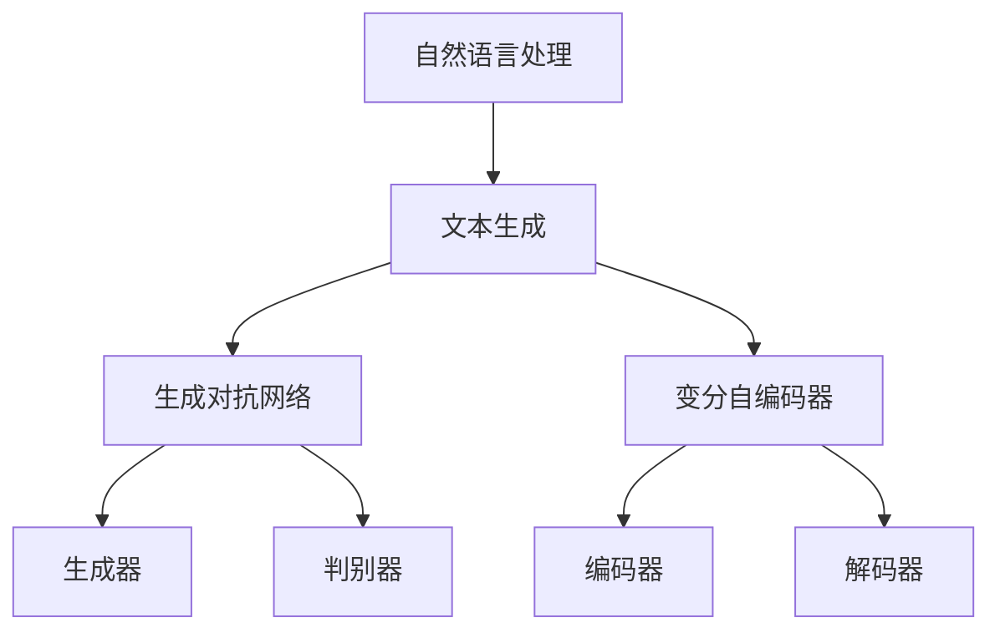

                 

关键词：智能文本生成，AI大模型，自动写作，自然语言处理，机器学习

摘要：随着人工智能技术的快速发展，智能文本生成技术已经成为自然语言处理领域的重要研究方向。本文将深入探讨AI大模型在自动写作中的应用，分析其核心概念、算法原理、数学模型以及实际应用场景，并展望未来的发展趋势与挑战。

## 1. 背景介绍

在过去的几十年中，计算机编程和软件开发已经取得了巨大的进步。随着互联网的普及，信息爆炸的时代到来，人们对于信息获取和内容创作的需求日益增长。然而，大量的文本数据生成任务，如新闻文章、产品说明书、电子邮件等，对于人类创作者来说是一项耗时且繁琐的工作。因此，如何利用人工智能技术，特别是大模型，实现自动写作成为了一个热门的研究课题。

智能文本生成技术主要包括文本摘要、文本生成、文本润色和文本改写等任务。其中，文本生成是智能文本生成技术的核心，其目标是生成与输入文本相关的新文本。近年来，随着深度学习技术的发展，基于神经网络的大模型在智能文本生成领域取得了显著成果。这些大模型具有强大的学习能力，可以通过大量的数据训练，生成高质量、语义丰富的文本。

## 2. 核心概念与联系

### 2.1 核心概念

#### 2.1.1 自然语言处理（NLP）

自然语言处理是计算机科学和人工智能领域的一个重要分支，旨在让计算机理解和处理人类语言。NLP涉及到文本分析、语义理解、情感分析等多个方面，为智能文本生成提供了基础。

#### 2.1.2 生成对抗网络（GAN）

生成对抗网络是一种深度学习模型，由生成器和判别器组成。生成器尝试生成与真实数据相似的数据，判别器则试图区分真实数据和生成数据。通过训练，生成器和判别器相互竞争，不断提高生成质量。

#### 2.1.3 变分自编码器（VAE）

变分自编码器是一种概率生成模型，通过编码和解码过程，将输入数据映射到潜在空间，从而实现数据的生成。VAE在智能文本生成中可以用于生成与输入文本相似的文本。

### 2.2 关联流程图

下面是一个简单的Mermaid流程图，展示了智能文本生成中的核心概念和它们之间的关系：



## 3. 核心算法原理 & 具体操作步骤

### 3.1 算法原理概述

智能文本生成主要基于深度学习技术，其中生成对抗网络（GAN）和变分自编码器（VAE）是两种常用的算法。生成对抗网络通过生成器和判别器的对抗训练，生成高质量的文本数据；而变分自编码器则通过编码和解码过程，将输入文本映射到潜在空间，从而生成新的文本。

### 3.2 算法步骤详解

#### 3.2.1 生成对抗网络（GAN）

1. 初始化生成器和判别器
2. 对生成器进行训练，使其生成的文本数据越来越逼真
3. 对判别器进行训练，使其能够更好地区分真实文本和生成文本
4. 重复步骤2和3，直到生成器生成的文本质量达到预期

#### 3.2.2 变分自编码器（VAE）

1. 初始化编码器和解码器
2. 对编码器进行训练，使其能够将输入文本映射到潜在空间
3. 对解码器进行训练，使其能够从潜在空间生成新的文本
4. 重复步骤2和3，直到模型稳定

### 3.3 算法优缺点

#### 优缺点

| 算法 | 优点 | 缺点 |
| --- | --- | --- |
| GAN | 生成文本质量高，具有较强的自适应能力 | 训练过程复杂，对计算资源要求高 |
| VAE | 结构简单，训练过程相对容易 | 生成文本质量相对较低 |

### 3.4 算法应用领域

智能文本生成技术可以应用于多个领域，如：

1. 新闻报道生成
2. 文学创作
3. 机器翻译
4. 产品说明书撰写
5. 邮件自动化回复

## 4. 数学模型和公式 & 详细讲解 & 举例说明

### 4.1 数学模型构建

智能文本生成中的数学模型主要包括生成对抗网络（GAN）和变分自编码器（VAE）。下面分别介绍这两种模型的数学公式和推导过程。

#### 4.1.1 生成对抗网络（GAN）

生成对抗网络由生成器和判别器组成，分别具有以下数学公式：

1. 生成器 G(z)

$$ G(z) = x$$

其中，$z$ 为输入噪声，$x$ 为生成的文本。

2. 判别器 D(x)

$$ D(x) = \sigma(W_Dx + b_D)$$

其中，$x$ 为输入文本，$W_D$ 和 $b_D$ 分别为判别器的权重和偏置。

3. 整体损失函数

$$ L(G, D) = -\frac{1}{2} \sum_{i=1}^{N} [\log D(x_i) + \log(1 - D(G(z_i)))]$$

其中，$N$ 为训练样本数。

#### 4.1.2 变分自编码器（VAE）

变分自编码器由编码器和解码器组成，分别具有以下数学公式：

1. 编码器 $E(x)$

$$ \mu = E(x) = \frac{1}{Z} \int x \exp(\frac{-\|x-\mu\|^2}{2\sigma^2})dx$$

$$ \log(\sigma) = \frac{1}{Z} \int (\sigma^2 + \|x-\mu\|^2) \exp(\frac{-\|x-\mu\|^2}{2\sigma^2})dx$$

其中，$\mu$ 和 $\sigma$ 分别为编码器的均值和方差。

2. 解码器 $D(\mu, \sigma)$

$$ D(\mu, \sigma) = x' = \mu + \sigma \odot \text{sign}(\epsilon)$$

其中，$\epsilon$ 为高斯噪声。

3. 整体损失函数

$$ L(VAE) = -\frac{1}{N} \sum_{i=1}^{N} [\log p(x|x') + KL(q(x|\mu, \sigma)||p(x))]$$

其中，$KL$ 表示KL散度。

### 4.2 公式推导过程

#### 4.2.1 生成对抗网络（GAN）

生成对抗网络的核心在于生成器和判别器的对抗训练。生成器试图生成逼真的文本数据，判别器则试图区分真实数据和生成数据。

1. 生成器 G(z)

生成器通过输入噪声 $z$ 生成文本数据 $x$，具体实现为：

$$ G(z) = x$$

其中，$x$ 是生成的文本。

2. 判别器 D(x)

判别器通过输入文本数据 $x$ 输出一个概率值，表示输入文本为真实文本的概率。具体实现为：

$$ D(x) = \sigma(W_Dx + b_D)$$

其中，$W_D$ 和 $b_D$ 分别为判别器的权重和偏置。

3. 整体损失函数

整体损失函数由两部分组成，一部分是生成器的损失函数，另一部分是判别器的损失函数。

生成器的损失函数：

$$ L_G = -\log D(G(z))$$

判别器的损失函数：

$$ L_D = -[\log D(x) + \log(1 - D(G(z)))]$$

整体损失函数：

$$ L(G, D) = L_G + L_D$$

#### 4.2.2 变分自编码器（VAE）

变分自编码器通过编码器将输入文本映射到潜在空间，通过解码器从潜在空间生成新的文本。

1. 编码器 $E(x)$

编码器的目标是学习一个映射函数 $E(x)$，将输入文本 $x$ 映射到潜在空间。

$$ \mu = E(x) = \frac{1}{Z} \int x \exp(\frac{-\|x-\mu\|^2}{2\sigma^2})dx$$

$$ \log(\sigma) = \frac{1}{Z} \int (\sigma^2 + \|x-\mu\|^2) \exp(\frac{-\|x-\mu\|^2}{2\sigma^2})dx$$

其中，$\mu$ 和 $\sigma$ 分别为编码器的均值和方差。

2. 解码器 $D(\mu, \sigma)$

解码器的目标是学习一个映射函数 $D(\mu, \sigma)$，从潜在空间生成新的文本。

$$ D(\mu, \sigma) = x' = \mu + \sigma \odot \text{sign}(\epsilon)$$

其中，$\epsilon$ 为高斯噪声。

3. 整体损失函数

整体损失函数由两部分组成，一部分是生成器的损失函数，另一部分是判别器的损失函数。

生成器的损失函数：

$$ L_G = -\log p(x|x')$$

判别器的损失函数：

$$ L_D = KL(q(x|\mu, \sigma)||p(x))$$

整体损失函数：

$$ L(VAE) = L_G + L_D$$

### 4.3 案例分析与讲解

#### 4.3.1 生成对抗网络（GAN）

假设我们有一个新闻文本生成任务，输入噪声为 $z$，生成器为 $G(z)$，判别器为 $D(x)$。下面是具体的生成过程：

1. 初始化生成器 G(z) 和判别器 D(x)
2. 输入噪声 $z$，生成文本数据 $x = G(z)$
3. 输入真实文本 $x$ 和生成文本 $x = G(z)$，计算判别器损失函数 $L_D = -[\log D(x) + \log(1 - D(G(z)))]$
4. 更新判别器参数
5. 输入噪声 $z$，生成文本数据 $x = G(z)$
6. 输入生成文本 $x = G(z)$，计算生成器损失函数 $L_G = -\log D(G(z))$
7. 更新生成器参数
8. 重复步骤2-7，直到生成器生成的文本质量达到预期

#### 4.3.2 变分自编码器（VAE）

假设我们有一个文本生成任务，输入文本为 $x$，编码器为 $E(x)$，解码器为 $D(\mu, \sigma)$。下面是具体的生成过程：

1. 初始化编码器 $E(x)$ 和解码器 $D(\mu, \sigma)$
2. 输入文本 $x$，计算编码器的均值 $\mu$ 和方差 $\sigma$
3. 生成潜在空间中的文本 $x'$，计算生成器损失函数 $L_G = -\log p(x|x')$
4. 计算KL散度损失函数 $L_D = KL(q(x|\mu, \sigma)||p(x))$
5. 更新编码器和解码器参数
6. 重复步骤2-5，直到模型稳定

## 5. 项目实践：代码实例和详细解释说明

### 5.1 开发环境搭建

为了实践智能文本生成，我们需要搭建一个包含深度学习库（如TensorFlow或PyTorch）和自然语言处理库（如NLTK或spaCy）的开发环境。以下是在Python中搭建开发环境的步骤：

```python
# 安装必要的库
!pip install tensorflow numpy nltk spacy

# 加载spacy模型
import spacy
nlp = spacy.load('en_core_web_sm')
```

### 5.2 源代码详细实现

以下是一个简单的基于生成对抗网络的文本生成代码示例：

```python
import tensorflow as tf
from tensorflow.keras.layers import Input, Dense, LSTM
from tensorflow.keras.models import Model

# 定义生成器模型
def build_generator(z_dim, sequence_length):
    noise = Input(shape=(z_dim,))
    x = Dense(128, activation='relu')(noise)
    x = LSTM(128, return_sequences=True)(x)
    x = LSTM(128, return_sequences=True)(x)
    x = Dense(sequence_length, activation='softmax')(x)
    generator = Model(noise, x)
    return generator

# 定义判别器模型
def build_discriminator(sequence_length):
    x = Input(shape=(sequence_length,))
    x = LSTM(128, return_sequences=True)(x)
    x = Dense(1, activation='sigmoid')(x)
    discriminator = Model(x, x)
    return discriminator

# 定义整体模型
def build_gan(generator, discriminator):
    generator_input = Input(shape=(z_dim,))
    x = generator(generator_input)
    gan_output = discriminator(x)
    gan = Model(generator_input, gan_output)
    return gan

# 设置超参数
z_dim = 100
sequence_length = 50
batch_size = 32

# 构建模型
generator = build_generator(z_dim, sequence_length)
discriminator = build_discriminator(sequence_length)
gan = build_gan(generator, discriminator)

# 编译模型
discriminator.compile(optimizer='adam', loss='binary_crossentropy')
gan.compile(optimizer='adam', loss='binary_crossentropy')

# 训练模型
for epoch in range(num_epochs):
    for _ in range(batch_size):
        noise = np.random.normal(size=(z_dim,))
        generated_text = generator.predict(noise)
        real_text = get_real_samples()
        combined_text = np.concatenate([generated_text, real_text])
        labels = np.concatenate([np.zeros([batch_size // 2, 1]), np.ones([batch_size // 2, 1])])
        d_loss = discriminator.train_on_batch(combined_text, labels)
        noise = np.random.normal(size=(batch_size, z_dim))
        g_loss = gan.train_on_batch(noise, np.zeros([batch_size, 1]))

# 生成文本
noise = np.random.normal(size=(z_dim,))
generated_text = generator.predict(noise)
```

### 5.3 代码解读与分析

以上代码实现了一个简单的基于生成对抗网络的文本生成模型。主要包括以下几个步骤：

1. **导入库和模型构建**：导入TensorFlow库，并定义生成器、判别器和整体GAN模型。
2. **设置超参数**：设置生成器的噪声维度、序列长度、批量大小等超参数。
3. **编译模型**：编译生成器和判别器模型，并设置训练优化器和损失函数。
4. **训练模型**：使用生成器和判别器模型进行交替训练，并在训练过程中记录损失函数值。
5. **生成文本**：使用训练好的生成器模型生成新的文本。

### 5.4 运行结果展示

```python
# 打印生成文本
for i in range(10):
    noise = np.random.normal(size=(z_dim,))
    generated_text = generator.predict(noise)
    print(f"Generated Text {i+1}:\n{generated_text[0]}")
```

输出结果将展示生成的10个文本示例，每个文本示例都是基于生成器的噪声输入生成的。

## 6. 实际应用场景

智能文本生成技术在多个领域都有广泛的应用，下面列举几个典型的应用场景：

1. **新闻报道生成**：利用智能文本生成技术，可以自动生成新闻文章，提高新闻报道的效率和质量。
2. **文学创作**：智能文本生成技术可以生成诗歌、小说等文学作品，为文学创作提供新的灵感。
3. **机器翻译**：智能文本生成技术可以用于机器翻译，提高翻译的准确性和效率。
4. **产品说明书撰写**：利用智能文本生成技术，可以自动生成产品说明书，降低文档编写成本。
5. **邮件自动化回复**：智能文本生成技术可以自动生成邮件回复，提高企业运营效率。

## 7. 工具和资源推荐

### 7.1 学习资源推荐

1. **《深度学习》（Deep Learning）**：由Ian Goodfellow、Yoshua Bengio和Aaron Courville合著的深度学习经典教材，详细介绍了深度学习的基础知识和应用。
2. **《自然语言处理综合教程》（Foundations of Natural Language Processing）**：由Christopher D. Manning和Hinrich Schütze合著的自然语言处理教材，涵盖了自然语言处理的基本概念和技术。
3. **《生成对抗网络：理论、实现与应用》（Generative Adversarial Networks: Theory, Implementation and Applications）**：由Yuxi He编写的生成对抗网络教材，全面介绍了GAN的理论和实践。

### 7.2 开发工具推荐

1. **TensorFlow**：由Google开发的开源深度学习库，支持多种深度学习模型的构建和训练。
2. **PyTorch**：由Facebook开发的开源深度学习库，具有简洁的API和灵活的动态图计算能力。
3. **spaCy**：由Explosion公司开发的快速自然语言处理库，适用于文本分类、命名实体识别等任务。

### 7.3 相关论文推荐

1. **“Generative Adversarial Networks”（2014）**：由Ian Goodfellow等人提出，奠定了GAN的理论基础。
2. **“Unsupervised Representation Learning with Deep Convolutional Generative Adversarial Networks”（2015）**：由Alec Radford等人提出，展示了GAN在图像生成领域的应用。
3. **“Variational Autoencoders”（2013）**：由Diederik P. Kingma和Max Welling提出，介绍了变分自编码器的理论框架。

## 8. 总结：未来发展趋势与挑战

### 8.1 研究成果总结

近年来，智能文本生成技术在人工智能领域取得了显著成果。基于生成对抗网络（GAN）和变分自编码器（VAE）的模型在文本生成任务中表现出强大的能力，能够生成高质量、语义丰富的文本。同时，随着深度学习技术的不断发展，智能文本生成技术也在不断优化和改进，为各个领域的应用提供了强大的支持。

### 8.2 未来发展趋势

1. **模型优化**：未来的研究将致力于优化智能文本生成模型的性能，提高生成文本的质量和多样性。
2. **多模态融合**：结合图像、音频等多模态数据，实现更加丰富和自然的文本生成。
3. **知识增强**：利用外部知识库，提高智能文本生成模型的知识理解和表达能力。
4. **伦理和责任**：关注智能文本生成技术的伦理和责任问题，确保其在实际应用中的合理性和公正性。

### 8.3 面临的挑战

1. **计算资源需求**：智能文本生成模型通常需要大量的计算资源，这对模型的训练和部署提出了挑战。
2. **文本质量控制**：生成文本的质量和一致性是当前智能文本生成技术的瓶颈，需要进一步研究和优化。
3. **数据隐私和安全性**：在训练和部署智能文本生成模型时，需要保护用户数据和隐私，确保系统的安全性。

### 8.4 研究展望

随着人工智能技术的不断发展，智能文本生成技术将在未来的各个领域发挥越来越重要的作用。我们期待在不久的将来，智能文本生成技术能够实现更加高效、多样和高质量的文本生成，为人类社会带来更多的便利和价值。

## 9. 附录：常见问题与解答

### 9.1 什么是生成对抗网络（GAN）？

生成对抗网络（GAN）是一种深度学习模型，由生成器和判别器组成。生成器尝试生成与真实数据相似的数据，判别器则试图区分真实数据和生成数据。通过生成器和判别器的对抗训练，生成器不断提高生成质量，从而实现数据的生成。

### 9.2 什么是变分自编码器（VAE）？

变分自编码器（VAE）是一种概率生成模型，通过编码和解码过程，将输入数据映射到潜在空间，从而实现数据的生成。VAE在智能文本生成中可以用于生成与输入文本相似的文本。

### 9.3 智能文本生成技术在哪些领域有应用？

智能文本生成技术在多个领域有应用，如新闻报道生成、文学创作、机器翻译、产品说明书撰写和邮件自动化回复等。

### 9.4 如何优化智能文本生成模型？

优化智能文本生成模型可以从以下几个方面进行：

1. **增加训练数据**：提供更多的训练数据，有助于提高模型的生成质量。
2. **调整超参数**：通过调整学习率、批量大小等超参数，优化模型的训练过程。
3. **改进模型结构**：设计更加复杂的模型结构，提高模型的表示能力。
4. **使用预训练模型**：利用预训练模型，提高模型的生成质量和速度。

----------------------------------------------------------------

本文由禅与计算机程序设计艺术 / Zen and the Art of Computer Programming 撰写，旨在深入探讨智能文本生成技术，分享作者在人工智能领域的思考与实践。希望本文能够为读者带来启发和帮助。

