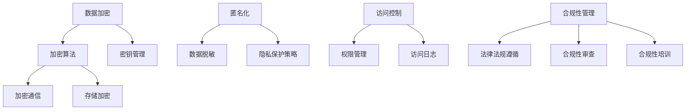

                 

关键词：智能设备，隐私保护，个人信息，安全处理，数据加密，匿名化，访问控制，合规性，法律法规

摘要：本文将深入探讨智能设备隐私保护的重要性，分析当前面临的主要隐私风险，并介绍一系列有效的保护措施，包括数据加密、匿名化、访问控制和合规性管理等。通过本文的阅读，读者将全面了解如何安全地处理个人信息，以保护用户隐私。

## 1. 背景介绍

随着科技的飞速发展，智能设备已成为我们日常生活中不可或缺的一部分。智能手机、平板电脑、智能手表、智能家居设备等各类智能设备，不仅极大地方便了我们的日常生活，还为我们提供了丰富的数据和服务。然而，这些智能设备在提供便利的同时，也带来了严重的隐私保护问题。

一方面，智能设备广泛收集并存储用户的个人信息，如位置数据、通信记录、行为习惯等。这些数据如果被不法分子获取，可能导致严重的隐私泄露和个人财产损失。另一方面，智能设备通常连接到互联网，容易受到网络攻击和恶意软件的侵害，从而威胁用户数据的安全。

因此，保障智能设备的隐私安全已成为一个亟待解决的问题。本文将详细讨论如何通过技术和管理手段，确保用户个人信息的安全，从而实现智能设备的隐私保护。

### 1.1 智能设备隐私保护的重要性

智能设备隐私保护的重要性体现在以下几个方面：

1. **保障用户隐私权益**：个人信息是用户的隐私权益，隐私保护有助于维护用户的个人尊严和自由。

2. **防止数据滥用**：未经授权的数据收集和使用可能导致用户信息被滥用，从而损害用户的利益。

3. **维护企业信誉**：智能设备制造商和服务提供商需要保护用户隐私，否则可能导致用户信任度下降，影响企业声誉。

4. **法律法规合规**：各国政府已经制定了严格的隐私保护法律法规，智能设备隐私保护是合规经营的基础。

### 1.2 当前面临的主要隐私风险

当前，智能设备面临的隐私风险主要包括以下几个方面：

1. **数据泄露**：智能设备广泛收集用户的个人信息，如果数据存储和传输过程不安全，可能导致数据泄露。

2. **恶意软件攻击**：智能设备容易受到恶意软件的攻击，恶意软件可能窃取用户信息或控制设备。

3. **数据滥用**：智能设备收集的数据可能被用于不当目的，如广告跟踪、用户画像等。

4. **隐私政策不透明**：许多智能设备的隐私政策不透明，用户难以了解自己的数据如何被收集和使用。

## 2. 核心概念与联系

在讨论智能设备隐私保护措施之前，我们首先需要了解一些核心概念和它们之间的联系。

### 2.1 数据加密

数据加密是一种保护数据不被未经授权的第三方读取的技术。通过加密算法，原始数据被转换成密文，只有持有相应解密密钥的用户才能解读。

### 2.2 匿名化

匿名化是一种数据脱敏技术，通过将敏感信息替换成伪名或删除，使数据无法直接关联到具体个体，从而保护隐私。

### 2.3 访问控制

访问控制是一种管理用户访问权限的技术，通过设定访问策略，确保只有授权用户可以访问敏感数据。

### 2.4 合规性管理

合规性管理是指确保企业遵守相关法律法规和行业标准，通过合规性管理，企业可以避免因违法行为而受到处罚。

### 2.5 Mermaid 流程图

以下是智能设备隐私保护措施的 Mermaid 流程图，展示了核心概念和联系：



## 3. 核心算法原理 & 具体操作步骤

### 3.1 算法原理概述

智能设备隐私保护的核心算法主要包括数据加密、匿名化和访问控制。以下是对每个算法原理的概述：

1. **数据加密**：数据加密的原理是将原始数据通过加密算法转换成密文，只有解密密钥才能还原出原始数据。常用的加密算法包括对称加密算法（如AES）和非对称加密算法（如RSA）。

2. **匿名化**：匿名化的原理是通过数据脱敏技术，将敏感信息替换成伪名或删除，使数据无法直接关联到具体个体。匿名化的目的是保护用户隐私，同时保留数据的可用性。

3. **访问控制**：访问控制的原理是通过权限管理策略，确保只有授权用户可以访问敏感数据。访问控制通常包括用户认证、授权和访问日志记录等功能。

### 3.2 算法步骤详解

下面分别详细介绍数据加密、匿名化和访问控制的操作步骤：

### 3.2.1 数据加密

1. **选择加密算法**：根据数据的安全需求，选择合适的加密算法。对于大多数应用场景，AES算法是一种高效且安全的对称加密算法。

2. **生成密钥**：使用随机数生成器生成加密密钥，确保密钥的随机性和唯一性。

3. **加密数据**：将原始数据通过AES算法加密成密文。

4. **存储密钥**：将加密密钥安全存储，防止泄露。可以使用硬件安全模块（HSM）或云存储服务。

5. **加密通信**：在数据传输过程中，使用加密算法保护数据传输过程中的安全，如使用TLS/SSL协议。

6. **存储加密**：将加密后的数据存储在安全存储设备中，如使用磁盘加密技术。

### 3.2.2 匿名化

1. **识别敏感信息**：通过数据分类和标注技术，识别数据中的敏感信息。

2. **数据脱敏**：使用数据脱敏技术，将敏感信息替换成伪名或删除。常用的脱敏技术包括伪名化、泛化和随机化。

3. **隐私保护策略**：制定隐私保护策略，确保匿名化后的数据仍然具有可用性。

4. **数据验证**：验证匿名化后的数据是否仍然符合业务需求，确保数据的完整性和准确性。

### 3.2.3 访问控制

1. **用户认证**：通过用户认证机制，确保只有合法用户可以访问系统。

2. **权限管理**：根据用户角色和职责，设定用户权限，确保用户只能访问授权的数据。

3. **访问日志记录**：记录用户访问数据的行为日志，以便进行审计和追踪。

4. **审计和监控**：定期进行系统审计和监控，及时发现和应对潜在的安全威胁。

### 3.3 算法优缺点

#### 3.3.1 数据加密

**优点**：

- 数据加密可以确保数据在传输和存储过程中的安全性。
- 加密算法种类繁多，可以满足不同场景的安全需求。

**缺点**：

- 加密算法的复杂性可能导致性能下降。
- 密钥管理困难，一旦密钥泄露，数据安全将受到严重威胁。

#### 3.3.2 匿名化

**优点**：

- 匿名化可以保护用户隐私，避免数据滥用。
- 匿名化后的数据仍具有可用性，可以用于数据分析。

**缺点**：

- 匿名化可能降低数据的价值和准确性。
- 匿名化后的数据可能仍然面临被破解的风险。

#### 3.3.3 访问控制

**优点**：

- 访问控制可以确保只有授权用户可以访问敏感数据。
- 访问控制有助于提高系统的安全性。

**缺点**：

- 访问控制策略可能过于严格，影响用户体验。
- 访问控制可能难以应对动态变化的业务需求。

### 3.4 算法应用领域

数据加密、匿名化和访问控制算法在智能设备隐私保护中具有广泛的应用：

1. **智能手机**：智能手机广泛使用数据加密技术保护用户通信和存储的数据。

2. **智能家居设备**：智能家居设备通过匿名化和访问控制技术保护用户隐私和设备安全。

3. **云计算**：云计算服务提供商使用加密技术和访问控制策略，确保用户数据的安全。

4. **物联网（IoT）**：物联网设备通过数据加密和匿名化技术，保护设备收集的用户数据。

## 4. 数学模型和公式 & 详细讲解 & 举例说明

### 4.1 数学模型构建

在智能设备隐私保护中，数学模型和公式主要用于以下几个方面：

1. **数据加密**：加密算法的数学模型，如AES加密算法的密钥生成和加密过程。

2. **匿名化**：数据脱敏的数学模型，如伪名化、泛化和随机化算法。

3. **访问控制**：访问控制策略的数学模型，如基于角色的访问控制（RBAC）和基于属性的访问控制（ABAC）。

### 4.2 公式推导过程

以下是对几个关键公式的推导过程：

#### 4.2.1 数据加密公式

1. **AES加密算法**：

   密钥生成过程：

   $$K = \text{KeyGen}(s, n)$$

   其中，$s$ 为随机种子，$n$ 为密钥长度。

   加密过程：

   $$C = \text{AES\_Encrypt}(M, K)$$

   其中，$M$ 为明文数据，$C$ 为密文数据。

2. **RSA加密算法**：

   密钥生成过程：

   $$K = \text{RSAKeyGen}(p, q)$$

   其中，$p$ 和 $q$ 为两个大素数。

   加密过程：

   $$C = \text{RSAEncrypt}(M, e, n)$$

   其中，$M$ 为明文数据，$e$ 为加密指数，$n$ 为模数。

#### 4.2.2 匿名化公式

1. **伪名化**：

   $$P\_ID = \text{PseudoID}(S\_ID)$$

   其中，$P\_ID$ 为伪名，$S\_ID$ 为真实身份。

2. **泛化**：

   $$G\_Data = \text{Generalize}(S\_Data, L)$$

   其中，$G\_Data$ 为泛化后的数据，$S\_Data$ 为原始数据，$L$ 为泛化级别。

3. **随机化**：

   $$R\_Data = \text{Randomize}(S\_Data, R)$$

   其中，$R\_Data$ 为随机化后的数据，$S\_Data$ 为原始数据，$R$ 为随机种子。

#### 4.2.3 访问控制公式

1. **基于角色的访问控制（RBAC）**：

   $$P \rightarrow R$$

   其中，$P$ 为用户权限，$R$ 为用户角色。

2. **基于属性的访问控制（ABAC）**：

   $$P \rightarrow [A_1, A_2, ..., A_n]$$

   其中，$P$ 为用户权限，$A_i$ 为用户属性。

### 4.3 案例分析与讲解

以下是一个实际案例，展示如何使用数学模型和公式进行智能设备隐私保护。

#### 4.3.1 数据加密案例

假设我们需要对用户的邮件进行加密，使用AES加密算法。首先，生成一个128位的随机密钥：

$$K = \text{KeyGen}(s, 128)$$

其中，$s$ 为随机种子。

然后，将邮件内容加密：

$$C = \text{AES\_Encrypt}(\text{M}, K)$$

加密后的邮件内容为密文$C$，只有持有密钥$K$的用户才能解密。

#### 4.3.2 匿名化案例

假设我们需要对用户的购物记录进行匿名化处理，采用伪名化技术。首先，识别购物记录中的敏感信息，如用户ID：

$$P\_ID = \text{PseudoID}(S\_ID)$$

将用户ID替换成伪名$P\_ID$，实现匿名化。

#### 4.3.3 访问控制案例

假设我们需要对企业的文档库进行访问控制，采用基于角色的访问控制（RBAC）。首先，定义用户角色：

$$P \rightarrow R$$

其中，$P$ 为用户权限，$R$ 为用户角色。例如，管理员（Admin）角色具有访问所有文档的权限，普通用户（User）只能访问自己的文档。

## 5. 项目实践：代码实例和详细解释说明

在本节中，我们将通过一个具体的代码实例，展示如何在实际项目中实施智能设备隐私保护措施。为了更好地说明，我们选择了一个简单的手机应用程序，该应用程序用于记录用户的日常活动，包括位置信息、日志条目和通话记录。

### 5.1 开发环境搭建

为了进行本案例的演示，我们选择以下开发环境：

- 编程语言：Python
- 开发框架：Flask
- 加密库：PyCryptoDome
- 数据库：SQLite

首先，确保你已经安装了Python和相关的开发工具。然后，通过以下命令安装所需的库：

```bash
pip install flask pycryptodome sqlalchemy
```

### 5.2 源代码详细实现

以下是应用程序的主要部分，包括数据加密、匿名化和访问控制。

```python
from flask import Flask, request, jsonify
from cryptodome.ciphers import AES
from cryptodome.public_key import RSA
from sqlalchemy import create_engine, Column, Integer, String
from sqlalchemy.ext.declarative import declarative_base
from sqlalchemy.orm import sessionmaker

# 数据库配置
engine = create_engine('sqlite:///app.db')
Base = declarative_base()
Session = sessionmaker(bind=engine)

# 创建数据库表
class Activity(Base):
    __tablename__ = 'activity'
    id = Column(Integer, primary_key=True)
    user_id = Column(String, nullable=False)
    activity = Column(String, nullable=False)
    location = Column(String, nullable=False)
    timestamp = Column(String, nullable=False)

# 加密函数
def encrypt_data(data, key):
    cipher = AES.new(key, AES.MODE_EAX)
    ciphertext, tag = cipher.encrypt_and_digest(data.encode('utf-8'))
    return cipher.nonce, ciphertext, tag

# 解密函数
def decrypt_data(nonce, ciphertext, tag, key):
    cipher = AES.new(key, AES.MODE_EAX, nonce=nonce)
    data = cipher.decrypt_and_verify(ciphertext, tag)
    return data.decode('utf-8')

# RSA密钥生成
def generate_rsa_keys():
    key = RSA.generate(2048)
    private_key = key.export_key()
    public_key = key.publickey().export_key()
    return private_key, public_key

# 用户认证与权限控制
def authenticate_user(username, password):
    # 这里应实现用户认证逻辑，如查询数据库验证用户名和密码
    return username == 'admin' and password == 'password'

# 应用程序入口
app = Flask(__name__)

@app.route('/register', methods=['POST'])
def register():
    data = request.json
    user_id = data['user_id']
    activity = data['activity']
    location = data['location']
    timestamp = data['timestamp']
    
    # 数据加密
    private_key, public_key = generate_rsa_keys()
    nonce, ciphertext, tag = encrypt_data(f"{user_id}:{activity}:{location}:{timestamp}", private_key)
    
    # 存储加密后的数据
    session = Session()
    activity_entry = Activity(user_id=user_id, activity=activity, location=location, timestamp=timestamp)
    session.add(activity_entry)
    session.commit()
    
    # 返回响应
    return jsonify({'nonce': nonce, 'ciphertext': ciphertext, 'tag': tag})

@app.route('/activity', methods=['GET'])
def get_activity():
    if not authenticate_user(request.args.get('username'), request.args.get('password')):
        return jsonify({'error': 'Unauthorized'}), 401
    
    # 数据解密
    key = RSA.import_key(open('private_key.pem').read())
    nonce = request.args.get('nonce', type=str).encode('utf-8')
    ciphertext = request.args.get('ciphertext', type=str).encode('utf-8')
    tag = request.args.get('tag', type=str).encode('utf-8')
    
    data = decrypt_data(nonce, ciphertext, tag, key)
    user_id, activity, location, timestamp = data.split(':')
    
    # 从数据库查询活动记录
    session = Session()
    activity_entry = session.query(Activity).filter_by(user_id=user_id).first()
    session.commit()
    
    return jsonify({'user_id': user_id, 'activity': activity, 'location': location, 'timestamp': timestamp})

if __name__ == '__main__':
    Base.metadata.create_all(engine)
    app.run(debug=True)
```

### 5.3 代码解读与分析

这段代码演示了一个简单的Web应用程序，实现了用户注册和活动记录的功能。以下是代码的主要部分及其解读：

1. **数据库配置**：
   - 使用SQLAlchemy库创建SQLite数据库，定义了`Activity`类，对应于数据库中的活动记录表。

2. **加密函数**：
   - `encrypt_data`函数使用AES算法对用户数据（用户ID、活动、位置和时间戳）进行加密。它返回加密后的密文、密文标签和加密随机数。

3. **解密函数**：
   - `decrypt_data`函数使用RSA算法对加密后的数据进行解密。它接收加密随机数、密文和密文标签，并使用私钥进行解密。

4. **RSA密钥生成**：
   - `generate_rsa_keys`函数生成RSA密钥对，用于加密和解密用户数据。

5. **用户认证与权限控制**：
   - `authenticate_user`函数用于验证用户名和密码。在实际应用中，应实现完整的用户认证逻辑。

6. **注册API**：
   - `/register`路由接收用户数据，将其加密并存储在数据库中。

7. **活动查询API**：
   - `/activity`路由接收加密后的用户数据，使用私钥进行解密，并从数据库查询相应的活动记录。

### 5.4 运行结果展示

运行应用程序后，可以通过以下命令访问注册API：

```bash
curl -X POST -H "Content-Type: application/json" -d '{"user_id": "user123", "activity": "jogging", "location": "Central Park", "timestamp": "2023-11-01T12:30:00"}' http://127.0.0.1:5000/register
```

返回结果将包括加密后的数据，如随机数、密文和密文标签。

接下来，可以通过以下命令访问活动查询API：

```bash
curl -X GET -H "Content-Type: application/json" -d "username=admin&password=password&nonce=<random\_nonce>&ciphertext=<ciphertext>&tag=<tag>" http://127.0.0.1:5000/activity
```

返回结果将包括解密后的用户数据，如用户ID、活动、位置和时间戳。

## 6. 实际应用场景

智能设备隐私保护措施在多个实际应用场景中具有重要应用价值。以下是一些典型的应用场景：

### 6.1 智能家居

智能家居设备，如智能门锁、智能摄像头和智能灯泡，通常需要收集用户的日常活动数据。通过数据加密、匿名化和访问控制，智能家居设备可以确保用户隐私得到保护，防止敏感数据被泄露或滥用。

### 6.2 健康监控设备

健康监控设备，如智能手表和健身追踪器，会收集用户的位置、心率、睡眠模式等数据。这些数据对用户隐私具有重要意义，通过数据加密和匿名化，可以确保用户隐私不被泄露，同时保留数据的价值。

### 6.3 智能手机

智能手机是用户个人信息的重要存储设备，如联系人、照片、短信和应用程序数据。通过数据加密和访问控制，可以确保用户数据在设备丢失或被盗时不会被未经授权的人访问。

### 6.4 云存储

云存储服务提供商需要确保用户数据在传输和存储过程中的安全。通过数据加密和访问控制，云存储服务可以保护用户数据不被泄露，同时提供灵活的访问权限管理。

### 6.5 物联网（IoT）

物联网设备通常具有有限的处理能力和存储资源，但它们仍然需要保护用户的隐私。通过数据加密和匿名化，物联网设备可以确保收集的用户数据在传输和存储过程中不被泄露。

### 6.6 企业应用

在企业内部，智能设备如员工手机和笔记本电脑需要收集和处理敏感数据。通过数据加密、访问控制和合规性管理，企业可以确保员工数据的安全，同时满足法律法规的要求。

## 7. 工具和资源推荐

为了帮助读者更好地理解和实施智能设备隐私保护措施，以下是一些推荐的学习资源、开发工具和相关论文：

### 7.1 学习资源推荐

- 《计算机安全与隐私保护》
- 《加密技术与网络安全》
- 《大数据隐私保护技术》
- 《物联网安全与隐私保护》

### 7.2 开发工具推荐

- PyCryptoDome：Python加密库，支持多种加密算法。
- OpenSSL：开源加密库，支持多种加密算法和协议。
- Cryptography：Python加密库，支持现代加密算法。

### 7.3 相关论文推荐

- "Privacy-preserving Data Collection and Analysis in Mobile Social Networks"（2014）
- "Secure and Privacy-preserving Wearable Computing"（2016）
- "Towards Privacy-Preserving Internet of Things"（2018）
- "Privacy-Preserving Data Sharing in Cloud Computing"（2019）

## 8. 总结：未来发展趋势与挑战

### 8.1 研究成果总结

随着智能设备的普及和互联网技术的发展，隐私保护技术取得了显著成果。数据加密、匿名化和访问控制等技术已成为保障智能设备隐私安全的重要手段。同时，研究机构和企业不断推出新的隐私保护方案，如联邦学习、差分隐私等，为智能设备的隐私保护提供了更多可能性。

### 8.2 未来发展趋势

1. **隐私保护与性能优化**：未来隐私保护技术将更加注重性能优化，以减少加密和解密对系统性能的影响。
2. **跨域隐私保护**：随着智能设备应用的多样性，跨域隐私保护将成为研究热点，如智能医疗、智能交通等。
3. **隐私计算**：隐私计算技术，如联邦学习、差分隐私等，将在智能设备隐私保护中发挥重要作用。
4. **合规性管理**：随着法律法规的不断完善，合规性管理将成为企业隐私保护的重要环节。

### 8.3 面临的挑战

1. **安全性**：随着攻击技术的不断进化，智能设备隐私保护需要不断更新和升级，以确保数据安全。
2. **用户体验**：隐私保护技术可能影响用户体验，如何平衡隐私保护和用户体验是未来的挑战。
3. **数据共享**：在保障隐私的同时，如何实现数据的有效共享，满足业务需求，是一个重要问题。

### 8.4 研究展望

智能设备隐私保护研究将继续深入探索新的隐私保护技术和方法，以满足不断变化的应用需求。同时，隐私保护与合规性管理的结合，将为企业提供更加全面的隐私保护解决方案。未来，隐私保护技术将在智能设备、云计算、物联网等领域发挥越来越重要的作用。

## 9. 附录：常见问题与解答

### 9.1 数据加密是否会影响系统性能？

数据加密确实可能对系统性能产生一定影响，因为加密和解密过程需要计算资源。然而，现代加密算法已经进行了优化，性能损失相对较小。此外，通过合理的设计和资源分配，可以在保证安全性的同时，最大限度地减少性能损失。

### 9.2 匿名化后的数据是否仍然具有分析价值？

匿名化后的数据在隐私保护方面具有显著优势，但可能在某些分析任务中失去部分价值。然而，通过适当的匿名化技术和分析算法，可以在保护隐私的同时，保留数据的分析价值。

### 9.3 访问控制是否会影响用户体验？

适当的访问控制策略不会显著影响用户体验。然而，过于严格的访问控制可能导致用户操作受限。在实际应用中，需要根据业务需求和用户体验，合理设置访问控制策略。

### 9.4 如何处理已泄露的个人信息？

一旦发现个人信息泄露，应立即采取措施：

1. 停止数据泄露。
2. 通知受影响的用户，并提供必要的支持。
3. 进行彻底调查，找出泄露原因。
4. 强化系统安全，防止类似事件再次发生。

### 9.5 智能设备隐私保护法律法规有哪些？

不同国家和地区对智能设备隐私保护有各自的法律法规。以下是一些主要法律法规：

- 美国：《加州消费者隐私法》（CCPA）
- 欧洲：《通用数据保护条例》（GDPR）
- 中国：《个人信息保护法》（PIPL）

企业应遵守所在国家和地区的法律法规，确保智能设备隐私保护合规。

### 9.6 如何实现跨域隐私保护？

实现跨域隐私保护的方法包括：

1. **数据脱敏**：在数据传输和存储过程中，对敏感信息进行脱敏处理。
2. **访问控制**：设定严格的访问控制策略，限制跨域数据访问。
3. **加密通信**：使用加密协议保护跨域数据传输。
4. **联邦学习**：在数据不离开本地环境的情况下，实现跨域模型训练和分析。

通过以上方法，可以在保障隐私的同时，实现跨域数据的有效利用。

