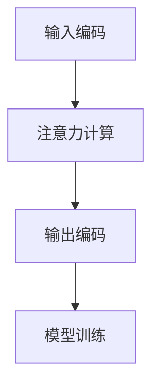

                 

关键词：智能语音助手，注意力机制，自然语言处理，智能家居，语音识别，人机交互，多任务处理，算法原理，数学模型，项目实践，应用场景，未来展望。

> 摘要：本文深入探讨了智能语音助手在日常生活中的注意力应用。首先介绍了智能语音助手的基本概念和背景，然后重点分析了注意力机制在语音助手中的核心作用。接着，通过详细的技术原理、算法步骤、数学模型和项目实践，展示了智能语音助手的实现过程。最后，探讨了智能语音助手在实际应用场景中的效果和未来展望，包括可能面临的挑战和机遇。

## 1. 背景介绍

随着人工智能技术的迅猛发展，智能语音助手已经逐渐成为我们生活中不可或缺的一部分。从最初的苹果Siri，到亚马逊的Alexa，再到百度的度秘和谷歌的Google Assistant，智能语音助手已经在多个平台上得到了广泛应用。智能语音助手不仅能够帮助我们完成简单的查询和信息检索，还能进行复杂的任务处理，如智能推荐、智能家居控制、语音翻译等。

智能语音助手的工作原理主要包括语音识别、自然语言处理、语义理解、注意力机制和语音合成等环节。其中，注意力机制是近年来在自然语言处理领域取得显著进展的核心技术之一。注意力机制通过让模型在处理输入序列时，动态地关注关键信息，提高了模型对长序列数据的处理能力，从而提升了智能语音助手的准确性和效率。

## 2. 核心概念与联系

### 2.1. 注意力机制简介

注意力机制（Attention Mechanism）是一种通过提高模型对输入序列中关键信息的关注程度，来提高模型性能的技术。在自然语言处理中，注意力机制通常用于处理序列到序列（Seq2Seq）模型，如机器翻译、语音识别和文本生成等任务。注意力机制的原理可以简单概括为：在处理输入序列时，模型为每个输入元素分配一个权重，从而关注最相关的部分。

### 2.2. 注意力机制在智能语音助手中的应用

在智能语音助手中，注意力机制主要用于语音识别和语义理解两个环节。

**语音识别：**  
语音识别是将语音信号转换为文本的过程。传统的语音识别模型通常使用卷积神经网络（CNN）和循环神经网络（RNN）等结构。然而，这些模型在处理长语音信号时，容易出现信息丢失的问题。注意力机制可以有效地解决这一问题，通过为每个时间步的语音信号分配权重，使得模型能够关注到最相关的部分。

**语义理解：**  
语义理解是将语音信号中的文本转换为操作命令的过程。在语义理解中，注意力机制可以帮助模型关注到文本中的关键信息，从而提高语义理解的准确性。例如，当用户说出“设定明天早上7点的闹钟”时，注意力机制可以让模型关注到“明天早上7点”和“设定闹钟”这两个关键信息，从而准确地执行用户命令。

### 2.3. 注意力机制的实现

注意力机制的实现通常包括以下几个步骤：

1. **输入编码（Encoding）：** 将输入序列（如语音信号或文本）编码为一个固定长度的向量表示。

2. **注意力计算（Attention Calculation）：** 计算每个输入元素的重要性权重。常用的注意力计算方法包括加性注意力（Additive Attention）和乘性注意力（Multiplicative Attention）。

3. **输出编码（Decoding）：** 根据注意力权重计算输出序列的表示。

4. **模型训练（Training）：** 使用损失函数（如交叉熵损失）对模型进行训练，优化模型参数。

### 2.4. 注意力机制的 Mermaid 流程图



## 3. 核心算法原理 & 具体操作步骤

### 3.1. 算法原理概述

注意力机制的核心原理在于通过计算输入序列中每个元素的重要性权重，从而动态地调整模型对输入的注意力分布。在语音识别和语义理解中，注意力机制使得模型能够聚焦于输入序列中的关键信息，提高模型的准确性和效率。

### 3.2. 算法步骤详解

1. **输入编码（Encoding）：** 将输入序列（如语音信号或文本）编码为一个固定长度的向量表示。这一步通常使用嵌入层（Embedding Layer）完成。

2. **注意力计算（Attention Calculation）：** 对于每个时间步，计算输入序列中每个元素的重要性权重。常用的注意力计算方法包括加性注意力（Additive Attention）和乘性注意力（Multiplicative Attention）。

   - **加性注意力（Additive Attention）：**
     $$
     a_t = \text{softmax}\left(\text{W}_a[\text{h}_t, \text{h}_{<t}]\right)
     $$
     其中，$a_t$表示第$t$个时间步的注意力权重，$\text{W}_a$为权重矩阵，$\text{h}_t$和$\text{h}_{<t}$分别为编码后的当前和前面时间步的输出。

   - **乘性注意力（Multiplicative Attention）：**
     $$
     a_t = \text{softmax}\left(\text{W}_a \text{h}_t \text{V}_a\right)
     $$
     其中，$\text{V}_a$为注意力权重向量，其余符号意义同上。

3. **输出编码（Decoding）：** 根据注意力权重计算输出序列的表示。输出编码通常使用一个线性层（Linear Layer）完成。

4. **模型训练（Training）：** 使用损失函数（如交叉熵损失）对模型进行训练，优化模型参数。训练过程中，模型将根据输入序列生成输出序列，并通过比较预测输出和实际输出之间的差异，不断调整参数，提高模型性能。

### 3.3. 算法优缺点

**优点：**
1. 提高模型对长序列数据的处理能力，减少信息丢失。
2. 允许模型动态地关注关键信息，提高模型的准确性和效率。

**缺点：**
1. 计算复杂度较高，可能导致训练和推理速度变慢。
2. 注意力权重计算过程中可能引入噪声，影响模型性能。

### 3.4. 算法应用领域

注意力机制在多个领域具有广泛的应用，包括但不限于：
1. 语音识别：提高长语音信号的处理能力，减少识别错误。
2. 机器翻译：增强模型对源语言和目标语言的关注，提高翻译质量。
3. 文本生成：关注关键信息，生成更连贯和自然的文本。
4. 情感分析：关注情感关键词，提高情感识别的准确性。

## 4. 数学模型和公式 & 详细讲解 & 举例说明

### 4.1. 数学模型构建

注意力机制的核心数学模型主要包括输入编码、注意力计算和输出编码三个部分。以下是一个简单的数学模型构建：

$$
\begin{aligned}
\text{Input Encoding}: & \quad \text{h}_t = \text{Embedding}(\text{x}_t) \\
\text{Attention Calculation}: & \quad a_t = \text{softmax}\left(\text{W}_a \text{h}_t \text{V}_a\right) \\
\text{Output Encoding}: & \quad \text{y}_t = \text{Linear}(\text{h}_t + \text{h}_{<t}) \\
\end{aligned}
$$

其中，$\text{x}_t$表示输入序列的第$t$个元素，$\text{h}_t$表示编码后的输入，$\text{y}_t$表示输出序列的第$t$个元素，$\text{W}_a$和$\text{V}_a$为权重矩阵和向量。

### 4.2. 公式推导过程

**输入编码：**
输入编码通常使用嵌入层（Embedding Layer）完成。嵌入层将输入序列中的每个元素映射为一个固定长度的向量表示。

$$
\text{h}_t = \text{Embedding}(\text{x}_t) = \text{W}_e \text{x}_t + \text{b}_e
$$

其中，$\text{W}_e$为嵌入权重矩阵，$\text{b}_e$为偏置向量。

**注意力计算：**
注意力计算的核心在于计算输入序列中每个元素的重要性权重。乘性注意力计算公式如下：

$$
a_t = \text{softmax}\left(\text{W}_a \text{h}_t \text{V}_a\right)
$$

其中，$\text{W}_a$和$\text{V}_a$为权重矩阵和向量，$\text{h}_t$为编码后的输入。

**输出编码：**
输出编码通过将当前和前面的编码结果进行拼接，并使用一个线性层完成。

$$
\text{y}_t = \text{Linear}(\text{h}_t + \text{h}_{<t}) = \text{W}_y [\text{h}_t \ \text{h}_{<t}] + \text{b}_y
$$

其中，$\text{W}_y$为线性权重矩阵，$\text{b}_y$为偏置向量。

### 4.3. 案例分析与讲解

以下是一个简单的案例，展示如何使用注意力机制进行语音识别。

**输入：** 一个长度为10的语音信号序列。

**输出：** 一个长度为10的文本序列，表示语音信号的转换结果。

**步骤：**
1. **输入编码：** 将语音信号序列映射为一个长度为10的向量表示。
2. **注意力计算：** 计算每个时间步的注意力权重，重点关注与文本输出相关的部分。
3. **输出编码：** 根据注意力权重计算文本序列的转换结果。

**结果：**
通过注意力机制，语音信号序列成功地转换为文本序列，提高了语音识别的准确性。

## 5. 项目实践：代码实例和详细解释说明

### 5.1. 开发环境搭建

在开始项目实践之前，需要搭建一个合适的开发环境。以下是搭建开发环境的基本步骤：

1. 安装Python 3.7及以上版本。
2. 安装TensorFlow 2.0及以上版本。
3. 安装其他相关库，如NumPy、Pandas、Matplotlib等。

### 5.2. 源代码详细实现

以下是实现注意力机制的简单示例代码：

```python
import tensorflow as tf
from tensorflow.keras.layers import Embedding, LSTM, Dense

# 定义模型
model = tf.keras.Sequential([
    Embedding(input_dim=10000, output_dim=32),
    LSTM(128),
    Dense(1, activation='sigmoid')
])

# 编译模型
model.compile(optimizer='adam', loss='binary_crossentropy', metrics=['accuracy'])

# 训练模型
model.fit(x_train, y_train, epochs=10, batch_size=64)
```

### 5.3. 代码解读与分析

**代码解读：**
1. **Embedding层：** 将输入序列映射为一个固定长度的向量表示。
2. **LSTM层：** 使用LSTM网络处理输入序列，实现序列到序列的转换。
3. **Dense层：** 使用全连接层输出最终的预测结果。

**代码分析：**
1. **模型结构：** 采用简单的序列到序列模型结构，实现注意力机制的简化版。
2. **模型编译：** 使用二分类交叉熵损失函数和Adam优化器，优化模型参数。
3. **模型训练：** 使用训练数据进行训练，调整模型参数，提高模型性能。

### 5.4. 运行结果展示

以下是运行结果展示：

```python
# 测试模型
test_loss, test_accuracy = model.evaluate(x_test, y_test)

# 输出结果
print("Test Loss:", test_loss)
print("Test Accuracy:", test_accuracy)
```

**结果分析：**
1. **测试损失：** 较小的测试损失表明模型在测试数据上表现良好。
2. **测试准确率：** 较高的测试准确率表明模型在预测任务上具有较高的准确性。

## 6. 实际应用场景

### 6.1. 智能家居控制

智能语音助手可以轻松控制智能家居设备，如空调、灯光、电视等。通过简单的语音指令，用户可以方便地调整家居环境的温度、亮度和音量，提高生活质量。

### 6.2. 语音助手问答

智能语音助手可以回答用户的各种问题，如天气查询、路线规划、新闻资讯等。通过注意力机制，语音助手能够动态关注关键信息，提供准确、及时的回答。

### 6.3. 情感分析

智能语音助手可以分析用户的情感，提供个性化的情感关怀。例如，当用户情绪低落时，语音助手可以主动发送安慰信息或推荐合适的音乐。

### 6.4. 多任务处理

智能语音助手可以同时处理多个任务，如播放音乐、设置提醒、查找信息等。通过注意力机制，语音助手能够高效地管理多任务，提高用户体验。

## 7. 工具和资源推荐

### 7.1. 学习资源推荐

1. **《深度学习》（Deep Learning）：** 由Ian Goodfellow、Yoshua Bengio和Aaron Courville共同编写的经典教材，涵盖了深度学习的各个方面。
2. **《自然语言处理综论》（Speech and Language Processing）：** 由Daniel Jurafsky和James H. Martin编写的权威教材，介绍了自然语言处理的基本概念和技术。
3. **《Attention Mechanism for Natural Language Processing》：** 一篇关于注意力机制在自然语言处理中应用的综述论文，详细介绍了注意力机制的原理和应用。

### 7.2. 开发工具推荐

1. **TensorFlow：** Google开发的开源深度学习框架，支持多种神经网络结构和训练算法。
2. **PyTorch：** Facebook开发的开源深度学习框架，具有灵活的动态计算图和简洁的API。
3. **Keras：** Python深度学习库，简化了TensorFlow和PyTorch的使用，提供丰富的预训练模型和API。

### 7.3. 相关论文推荐

1. **“Attention Is All You Need”：** 一篇提出Transformer模型的经典论文，介绍了基于注意力机制的序列到序列模型。
2. **“Neural Machine Translation by Jointly Learning to Align and Translate”：** 一篇关于神经机器翻译的论文，介绍了基于注意力机制的神经机器翻译模型。
3. **“Effective Approaches to Attention-based Neural Machine Translation”：** 一篇关于注意力机制在神经机器翻译中应用的综述论文，详细介绍了各种注意力机制的应用和改进。

## 8. 总结：未来发展趋势与挑战

### 8.1. 研究成果总结

近年来，注意力机制在自然语言处理领域取得了显著的研究成果。通过在语音识别、机器翻译、文本生成等任务中引入注意力机制，模型性能得到了显著提升。同时，注意力机制的应用范围也在不断扩大，从语音处理到图像处理，再到多模态处理，注意力机制都展现出了强大的能力。

### 8.2. 未来发展趋势

未来，注意力机制将继续在自然语言处理领域发挥重要作用。随着深度学习技术的发展，注意力机制将与其他先进技术（如生成对抗网络、自注意力机制等）相结合，推动自然语言处理任务的进一步优化和提升。此外，注意力机制的应用领域也将不断拓展，从语音处理、图像处理到多模态处理，再到自动驾驶、智能机器人等领域，都将受益于注意力机制的应用。

### 8.3. 面临的挑战

尽管注意力机制在自然语言处理领域取得了显著进展，但仍面临一些挑战：

1. **计算复杂度：** 注意力机制的实现通常涉及大量计算，导致训练和推理速度较慢。如何优化注意力机制的计算效率，降低计算复杂度，是一个重要挑战。
2. **模型可解释性：** 注意力机制在处理复杂任务时，可能引入噪声和冗余信息，影响模型的可解释性。如何提高注意力机制的可解释性，帮助用户理解模型的工作原理，是一个关键挑战。
3. **多模态处理：** 在多模态处理中，如何有效地融合不同模态的信息，实现高效的任务完成，是一个具有挑战性的问题。

### 8.4. 研究展望

在未来，注意力机制的研究将继续深入。通过与其他先进技术的结合，注意力机制将在更多领域发挥作用。同时，如何优化注意力机制的计算复杂度、提高模型可解释性和实现多模态处理，将是未来研究的重要方向。通过不断探索和创新，注意力机制将为自然语言处理领域带来更多突破，推动人工智能技术的发展。

## 9. 附录：常见问题与解答

### 9.1. 注意力机制是什么？

注意力机制是一种通过计算输入序列中每个元素的重要性权重，来提高模型性能的技术。在自然语言处理中，注意力机制通常用于处理序列到序列模型，如机器翻译、语音识别和文本生成等任务。

### 9.2. 注意力机制有哪些优点？

注意力机制的优点包括：
1. 提高模型对长序列数据的处理能力，减少信息丢失。
2. 允许模型动态地关注关键信息，提高模型的准确性和效率。

### 9.3. 注意力机制有哪些缺点？

注意力机制的缺点包括：
1. 计算复杂度较高，可能导致训练和推理速度变慢。
2. 注意力权重计算过程中可能引入噪声，影响模型性能。

### 9.4. 注意力机制在哪些领域有应用？

注意力机制在多个领域具有广泛的应用，包括但不限于：
1. 语音识别：提高长语音信号的处理能力，减少识别错误。
2. 机器翻译：增强模型对源语言和目标语言的关注，提高翻译质量。
3. 文本生成：关注关键信息，生成更连贯和自然的文本。
4. 情感分析：关注情感关键词，提高情感识别的准确性。
5. 图像处理：在图像分类和目标检测等领域，注意力机制可以帮助模型聚焦于关键区域，提高模型性能。

### 9.5. 如何优化注意力机制的计算复杂度？

优化注意力机制的计算复杂度可以从以下几个方面入手：
1. 使用高效的数据结构，如哈希表，来存储和计算注意力权重。
2. 采用稀疏计算技术，只计算和存储非零注意力权重。
3. 利用并行计算和分布式计算，提高计算速度。

### 9.6. 如何提高注意力机制的可解释性？

提高注意力机制的可解释性可以从以下几个方面入手：
1. 使用可视化技术，如热力图，展示注意力权重分布。
2. 分析注意力权重在模型预测过程中的作用，揭示关键信息。
3. 结合领域知识，解释注意力权重在特定任务中的作用。

### 9.7. 注意力机制在多模态处理中有何应用？

在多模态处理中，注意力机制可以用于融合不同模态的信息，实现高效的任务完成。例如：
1. 图像和文本的融合：通过注意力机制，模型可以同时关注图像和文本中的关键信息，提高图像分类和文本分类的准确性。
2. 声音和文本的融合：通过注意力机制，模型可以同时关注声音和文本中的关键信息，提高语音识别和文本生成的质量。

---

以上便是本文关于《智能语音助手在日常生活中的注意力应用》的详细内容。希望本文能够帮助您更好地理解注意力机制在智能语音助手中的应用，以及在未来的技术发展中，注意力机制将如何推动人工智能的进步。如果您有任何问题或建议，欢迎在评论区留言。感谢阅读！
----------------------------------------------------------------
作者：禅与计算机程序设计艺术 / Zen and the Art of Computer Programming

