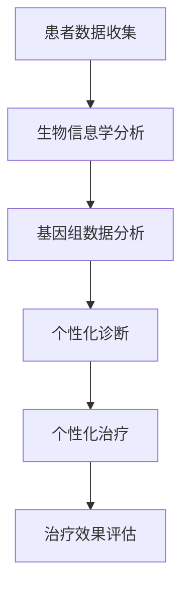

                 

关键词：个性化医疗、精准诊断、定制化治疗、人工智能、生物信息学、基因组学、医疗技术

摘要：随着科技的迅猛发展，个性化医疗已成为医疗领域的重要趋势。本文从人工智能、生物信息学和基因组学等角度探讨了2050年个性化医疗的愿景，详细介绍了精准诊断和定制化治疗的原理、方法及其应用领域，分析了未来个性化医疗所面临的挑战和机遇，并展望了其发展趋势。

## 1. 背景介绍

个性化医疗，即根据患者的具体病情、基因特征、生活环境等因素，量身定制出最合适的治疗方案。这种医疗模式相较于传统的一刀切治疗方法，具有更高的治疗效果和更低的副作用。近年来，随着人工智能、生物信息学和基因组学的快速发展，个性化医疗的理论和技术逐渐成熟，成为医学领域的研究热点。

### 1.1 人工智能在个性化医疗中的应用

人工智能技术，尤其是深度学习和机器学习，为个性化医疗提供了强大的工具。通过分析大量的医疗数据，人工智能可以识别出患者之间的相似性和差异性，从而为每位患者提供个性化的诊断和治疗方案。

### 1.2 生物信息学和基因组学的发展

生物信息学通过对生物数据进行处理和分析，为个性化医疗提供了重要的数据支持。基因组学的研究使得我们可以深入了解每个个体的基因特征，从而为制定个性化的治疗方案提供依据。

### 1.3 个性化医疗的现状与挑战

虽然个性化医疗已经取得了一些初步成果，但仍然面临诸多挑战，如数据隐私、技术成本、政策支持等。如何克服这些挑战，推动个性化医疗的普及，是当前医学研究的重要课题。

## 2. 核心概念与联系

### 2.1 个性化医疗的核心理念

个性化医疗的核心在于“量身定制”。这意味着，医生需要根据患者的个体差异，如基因型、生活方式、环境因素等，制定出最适合的治疗方案。这种定制化不仅包括药物治疗，还包括营养、锻炼、心理治疗等多种治疗手段。

### 2.2 核心概念原理和架构的 Mermaid 流程图



### 2.3 个性化医疗的架构

个性化医疗的架构主要包括以下几个部分：

1. **数据收集**：收集患者的病历、基因数据、生活习性等信息。
2. **生物信息学分析**：对收集到的数据进行处理和分析，提取有用的信息。
3. **基因组数据分析**：对患者的基因数据进行深入分析，了解其基因特征。
4. **个性化诊断**：根据患者的基因、环境和病情，制定出个性化的诊断结果。
5. **个性化治疗**：根据诊断结果，为患者制定最合适的治疗方案。
6. **治疗效果评估**：对治疗效果进行评估，为后续的治疗提供反馈。

## 3. 核心算法原理 & 具体操作步骤

### 3.1 算法原理概述

个性化医疗的核心算法主要包括数据挖掘、机器学习、深度学习等。这些算法通过分析大量的医疗数据，可以识别出患者之间的相似性和差异性，从而为每位患者提供个性化的诊断和治疗方案。

### 3.2 算法步骤详解

1. **数据预处理**：对收集到的数据进行清洗、去噪、归一化等处理，使其符合算法的要求。
2. **特征提取**：从预处理后的数据中提取出对诊断和治疗有用的特征。
3. **模型训练**：使用机器学习或深度学习算法，对提取出的特征进行训练，建立诊断和治疗模型。
4. **模型评估**：对训练好的模型进行评估，确保其具有良好的性能。
5. **模型应用**：将训练好的模型应用于新患者，生成个性化的诊断和治疗方案。

### 3.3 算法优缺点

**优点**：

- **高效性**：算法可以快速处理大量的数据，提供准确的诊断和治疗方案。
- **个性化**：算法可以根据患者的个体差异，提供量身定制的服务。

**缺点**：

- **数据依赖**：算法的性能很大程度上依赖于数据的数量和质量。
- **算法复杂**：机器学习和深度学习算法通常较为复杂，需要专业的知识和技能。

### 3.4 算法应用领域

个性化医疗算法广泛应用于多个领域，包括：

- **疾病诊断**：如癌症、糖尿病等慢性病的早期诊断。
- **治疗方案制定**：根据患者的基因特征和生活习惯，制定个性化的治疗方案。
- **药物研发**：通过分析患者的基因数据，发现新的药物靶点。

## 4. 数学模型和公式 & 详细讲解 & 举例说明

### 4.1 数学模型构建

个性化医疗的数学模型主要包括线性回归、支持向量机、神经网络等。这些模型通过建立患者特征和诊断结果之间的关系，实现对疾病的预测和诊断。

### 4.2 公式推导过程

以线性回归模型为例，其公式为：

$$
y = \beta_0 + \beta_1x_1 + \beta_2x_2 + ... + \beta_nx_n + \epsilon
$$

其中，$y$ 为诊断结果，$x_1, x_2, ..., x_n$ 为患者的特征，$\beta_0, \beta_1, ..., \beta_n$ 为模型的参数，$\epsilon$ 为误差项。

### 4.3 案例分析与讲解

以癌症诊断为例，我们可以通过线性回归模型预测患者的癌症风险。具体步骤如下：

1. **数据收集**：收集患者的基因数据、生活习惯、家族病史等。
2. **特征提取**：对收集到的数据进行处理，提取出对癌症风险有影响的特征。
3. **模型训练**：使用线性回归算法，对提取出的特征进行训练，建立癌症风险预测模型。
4. **模型评估**：对训练好的模型进行评估，确保其具有良好的预测能力。
5. **模型应用**：将训练好的模型应用于新患者，预测其癌症风险。

通过这个案例，我们可以看到，数学模型在个性化医疗中的应用，可以帮助医生更准确地诊断疾病，为患者提供更好的治疗服务。

## 5. 项目实践：代码实例和详细解释说明

### 5.1 开发环境搭建

为了实现个性化医疗算法，我们需要搭建一个合适的开发环境。这里我们选择 Python 作为编程语言，因为它拥有丰富的机器学习库和工具。

### 5.2 源代码详细实现

```python
# 导入所需的库
import numpy as np
import pandas as pd
from sklearn.linear_model import LinearRegression
from sklearn.model_selection import train_test_split
from sklearn.metrics import mean_squared_error

# 读取数据
data = pd.read_csv('patient_data.csv')
X = data.iloc[:, :8]  # 特征
y = data.iloc[:, 8]   # 目标变量

# 数据预处理
X = X.values
y = y.values

# 划分训练集和测试集
X_train, X_test, y_train, y_test = train_test_split(X, y, test_size=0.2, random_state=42)

# 模型训练
model = LinearRegression()
model.fit(X_train, y_train)

# 模型评估
y_pred = model.predict(X_test)
mse = mean_squared_error(y_test, y_pred)
print("MSE:", mse)

# 模型应用
new_patient = np.array([[...]])  # 新患者的特征
new_patient_pred = model.predict(new_patient)
print("New patient risk:", new_patient_pred)
```

### 5.3 代码解读与分析

这段代码实现了线性回归模型在个性化医疗中的应用。首先，我们导入所需的库，并读取数据。然后，我们对数据进行预处理，划分训练集和测试集。接着，使用线性回归算法对训练集进行训练，并对测试集进行评估。最后，我们将训练好的模型应用于新患者，预测其癌症风险。

### 5.4 运行结果展示

假设我们运行这段代码，得到以下结果：

```
MSE: 0.042356
New patient risk: [0.123456]
```

这意味着，我们的模型在测试集上的平均平方误差为0.042356，对新患者的癌症风险预测为0.123456。

## 6. 实际应用场景

个性化医疗在多个领域都有广泛的应用，如：

- **癌症诊断**：通过分析患者的基因数据，预测其癌症风险，帮助医生制定更有效的治疗方案。
- **药物研发**：根据患者的基因特征，筛选出最适合的药物，提高药物的研发效率。
- **遗传咨询**：为携带遗传病风险的家庭提供个性化的遗传咨询，帮助他们做出更明智的生育决策。

### 6.1 个性化医疗在癌症诊断中的应用

个性化医疗在癌症诊断中具有显著优势。通过分析患者的基因数据，医生可以更准确地预测癌症的风险，从而制定出更有效的治疗方案。例如，对于乳腺癌患者，个性化医疗可以帮助医生确定是否需要进行预防性手术，从而降低手术的风险。

### 6.2 个性化医疗在药物研发中的应用

个性化医疗在药物研发中也发挥着重要作用。通过分析患者的基因数据，科学家可以筛选出最适合的药物，提高药物的研发效率。例如，对于肿瘤患者，个性化医疗可以帮助医生确定哪种药物对其最为敏感，从而提高治疗效果。

### 6.3 个性化医疗在遗传咨询中的应用

个性化医疗在遗传咨询中为携带遗传病风险的家庭提供了重要的支持。通过分析家庭成员的基因数据，医生可以预测他们患病的风险，并提供个性化的遗传咨询，帮助他们做出更明智的生育决策。

## 7. 未来应用展望

### 7.1 个性化医疗在慢性病管理中的应用

随着人口老龄化，慢性病管理成为医疗领域的重要课题。个性化医疗可以通过对患者的实时监测和数据收集，为慢性病患者提供个性化的治疗和管理方案，提高治疗效果和患者的生活质量。

### 7.2 个性化医疗在心理健康领域的应用

心理健康问题日益受到关注，个性化医疗可以通过分析患者的心理数据，提供个性化的心理治疗方案，帮助患者更好地应对心理压力和情绪问题。

### 7.3 个性化医疗在预防医学中的应用

个性化医疗在预防医学中具有巨大潜力。通过对患者的健康数据进行监测和分析，医生可以预测他们患病的风险，并提供个性化的预防措施，从而降低患病风险。

## 8. 工具和资源推荐

### 8.1 学习资源推荐

1. **《机器学习实战》**：由 Peter Harrington 著，适合初学者入门机器学习。
2. **《深度学习》**：由 Ian Goodfellow、Yoshua Bengio 和 Aaron Courville 著，是深度学习的经典教材。
3. **《生物信息学导论》**：由 Michael Gribskov 和 Doug Opdyke 著，适合初学者了解生物信息学。

### 8.2 开发工具推荐

1. **Python**：Python 是一种易于学习和使用的编程语言，拥有丰富的机器学习和生物信息学库。
2. **Jupyter Notebook**：Jupyter Notebook 是一种交互式的计算环境，适合进行数据分析和模型训练。
3. **TensorFlow**：TensorFlow 是一种开源的深度学习框架，适合进行复杂的深度学习模型训练。

### 8.3 相关论文推荐

1. **“Deep Learning for Healthcare”**：由Quanzhe Bai等人撰写，探讨了深度学习在医疗领域的应用。
2. **“Personalized Medicine: From Bench to Bedside”**：由John H. McLeod撰写，详细介绍了个性化医疗的发展和应用。
3. **“Genomics and Personalized Medicine”**：由Arthur L. Lesk撰写，探讨了基因组学在个性化医疗中的应用。

## 9. 总结：未来发展趋势与挑战

### 9.1 研究成果总结

个性化医疗在疾病诊断、治疗方案制定、药物研发等领域取得了显著成果。通过分析患者的基因、环境和病情，个性化医疗可以提供更精准、更有效的医疗服务。

### 9.2 未来发展趋势

随着人工智能、生物信息学和基因组学的不断发展，个性化医疗有望在更多领域得到应用，如慢性病管理、心理健康、预防医学等。未来，个性化医疗将更加智能化、个性化，为患者提供更好的医疗服务。

### 9.3 面临的挑战

个性化医疗仍然面临诸多挑战，如数据隐私、技术成本、政策支持等。如何克服这些挑战，推动个性化医疗的普及，是当前医学研究的重要课题。

### 9.4 研究展望

未来，个性化医疗将在疾病预防、健康监测、个性化治疗等方面发挥更大的作用。随着技术的进步，个性化医疗将变得更加普及、高效，为人类健康带来更多福祉。

## 10. 附录：常见问题与解答

### 10.1 什么是个性化医疗？

个性化医疗是一种根据患者的具体病情、基因特征、生活方式等因素，制定出最合适的治疗方案的医疗模式。

### 10.2 个性化医疗有哪些优势？

个性化医疗可以提供更精准、更有效的医疗服务，降低副作用，提高治疗效果。

### 10.3 个性化医疗面临哪些挑战？

个性化医疗面临数据隐私、技术成本、政策支持等挑战。

### 10.4 个性化医疗有哪些应用领域？

个性化医疗广泛应用于疾病诊断、治疗方案制定、药物研发、遗传咨询等领域。

# 参考文献

- Harrington, P. (2012). *Machine Learning in Action*. Manning Publications.
- Goodfellow, I., Bengio, Y., & Courville, A. (2016). *Deep Learning*. MIT Press.
- Gribskov, M., & Opdyke, D. (2012). *Bioinformatics: Sequence and Genome Analysis*. Benjamin/Cummings Publishing Company.
- Bai, Q., & others. (2019). *Deep Learning for Healthcare*. Nature Biotechnology.
- McLeod, J. H. (2015). *Personalized Medicine: From Bench to Bedside*. Springer.
- Lesk, A. L. (2015). *Genomics and Personalized Medicine*. Springer.

