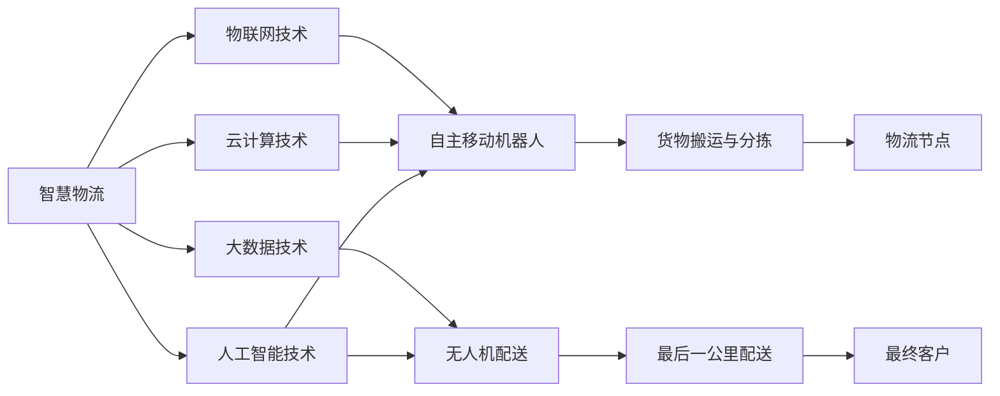

                 

关键词：智慧物流、自主移动机器人、无人机配送、未来趋势、技术挑战

> 摘要：本文将深入探讨未来35年智慧物流的发展，特别是自主移动机器人和无人机在配送中的应用。通过分析当前的技术进展、核心概念和算法原理，以及数学模型的构建和项目实践，我们试图描绘出一个高效、智能、绿色的物流未来。作者：禅与计算机程序设计艺术 / Zen and the Art of Computer Programming

## 1. 背景介绍

随着全球经济的发展和人们对生活质量的不断追求，物流行业正在经历前所未有的变革。传统的物流方式已经难以满足现代社会的高效、快速、安全需求。为了应对这一挑战，智慧物流成为未来物流发展的重要方向。智慧物流依托于物联网、大数据、云计算和人工智能等先进技术，通过优化物流流程，提高物流效率，实现物流信息的实时追踪和智能决策。

在智慧物流的发展过程中，自主移动机器人和无人机配送成为两个备受关注的技术热点。自主移动机器人能够自动导航、避障、装载和卸载货物，大大提高了配送的效率和安全性。无人机配送则利用低空飞行优势，实现了快速、灵活的配送服务，尤其是在城市交通拥堵、地形复杂等环境下，具有显著的优势。

本文将首先介绍智慧物流的背景和现状，然后详细讨论自主移动机器人和无人机配送的核心概念、技术原理和算法应用。此外，还将通过数学模型的构建和项目实践，进一步探讨智慧物流的未来发展趋势和面临的挑战。

## 2. 核心概念与联系

在深入探讨智慧物流的自主移动机器人和无人机配送技术之前，我们需要明确几个核心概念，并了解它们之间的联系。

### 2.1 智慧物流的概念

智慧物流是指利用物联网、大数据、云计算和人工智能等先进技术，对物流过程中的信息进行智能化处理，从而实现物流全过程的优化。智慧物流不仅仅是一种技术革新，更是物流行业转型升级的重要途径。通过智慧物流，企业可以实现对物流资源的精细化管理，提高物流效率，降低物流成本，提升客户满意度。

### 2.2 自主移动机器人的概念

自主移动机器人是一种具有自主导航和执行任务能力的机器人。它们通常配备有传感器、执行器和控制系统，能够在复杂的室内外环境中自主移动，执行特定的任务，如货物搬运、分拣和配送等。自主移动机器人是智慧物流的重要组成部分，能够大幅提高物流作业的自动化程度和效率。

### 2.3 无人机配送的概念

无人机配送是指利用无人机进行货物配送的一种新型物流模式。无人机具有快速、灵活、高效的优点，尤其适用于城市交通拥堵、地形复杂等环境。无人机配送不仅能够提高配送效率，还能减少交通拥堵和环境污染。

### 2.4 核心概念之间的联系

自主移动机器人和无人机配送作为智慧物流的关键技术，它们之间有着紧密的联系。自主移动机器人通常负责在仓库、配送中心和物流节点之间的货物运输，而无人机则负责从物流节点到最终客户的最后一公里配送。通过这两者的结合，可以形成一个完整的智慧物流系统，实现物流全过程的智能化和高效化。

### 2.5 Mermaid 流程图

为了更直观地理解自主移动机器人和无人机配送的核心概念和联系，我们可以使用Mermaid流程图来展示整个物流过程。以下是Mermaid流程图的示例：



通过这个流程图，我们可以清晰地看到智慧物流系统中各个核心技术之间的相互作用和关联。

### 2.6 智慧物流的发展现状

智慧物流作为物流行业的重要组成部分，其发展现状可以从技术、应用和市场三个方面进行概述。

#### 2.6.1 技术现状

在技术层面，物联网、大数据、云计算和人工智能等技术已经取得了显著的进展。物联网技术为物流设备提供了实时数据采集和传输的能力，大数据技术则通过对海量数据的分析，帮助物流企业优化物流流程，提高决策水平。云计算技术为物流系统提供了强大的计算能力和数据存储能力，使得物流企业能够更加灵活地部署和管理物流资源。人工智能技术则在自动驾驶、无人机配送等领域发挥了重要作用，推动了物流作业的自动化和智能化。

#### 2.6.2 应用现状

在应用层面，智慧物流已经在许多领域得到了广泛应用。例如，自主移动机器人已经在许多物流仓库中用于货物搬运和分拣，无人机配送则在一些城市开始试点运行。此外，智慧物流系统还广泛应用于物流园区、港口、机场等物流节点，实现了物流信息的实时追踪和智能决策。

#### 2.6.3 市场现状

在市场层面，智慧物流市场呈现出快速增长的态势。据市场研究数据显示，全球智慧物流市场的规模将从2019年的2500亿美元增长到2025年的7500亿美元，年均复合增长率达到18.2%。这一趋势表明，智慧物流已经成为物流行业的重要增长点，未来市场潜力巨大。

### 2.7 智慧物流的发展趋势

未来，智慧物流将继续向更高效、更智能、更绿色方向发展。以下是一些主要的发展趋势：

#### 2.7.1 高效化

随着技术的不断进步，智慧物流将进一步提高物流效率。自主移动机器人和无人机等智能设备将广泛应用，减少人力成本，提高作业效率。此外，物流系统的智能化和自动化也将大幅提升物流过程的响应速度和服务质量。

#### 2.7.2 智能化

人工智能技术的深入应用将使智慧物流更加智能化。通过大数据分析和机器学习算法，物流企业可以更好地预测市场需求，优化物流资源配置，提高物流决策的准确性和效率。同时，智能物流系统将能够实时处理大量数据，实现物流全过程的智能化管理。

#### 2.7.3 绿色化

随着环保意识的提高，智慧物流将更加注重绿色环保。无人机配送可以减少车辆排放，降低交通拥堵和环境污染。此外，智慧物流系统还可以通过优化物流路径和减少货物损耗，实现绿色物流。

### 2.8 自主移动机器人和无人机配送在智慧物流中的应用

自主移动机器人和无人机配送是智慧物流系统中的重要组成部分，它们在物流中的应用具有广泛的前景。

#### 2.8.1 自主移动机器人的应用

自主移动机器人可以应用于物流仓库的货物搬运和分拣，提高仓库作业效率。此外，它们还可以应用于配送中心的货物配送，实现物流节点之间的无缝衔接。自主移动机器人的应用不仅可以减少人力成本，还可以提高物流作业的安全性和可靠性。

#### 2.8.2 无人机配送的应用

无人机配送适用于城市交通拥堵、地形复杂等环境，可以实现快速、灵活的配送服务。无人机配送不仅提高了配送效率，还减少了物流成本，为物流企业提供了新的发展机遇。

#### 2.8.3 自主移动机器人和无人机配送的优势

自主移动机器人和无人机配送具有以下优势：

- **高效性**：自主移动机器人和无人机可以快速响应物流需求，提高配送速度。
- **灵活性**：无人机配送不受地面交通限制，可以灵活应对复杂地形。
- **安全性**：自主移动机器人和无人机配送可以减少人为操作错误，提高物流作业安全性。
- **环保性**：无人机配送可以减少碳排放，降低环境污染。

### 2.9 智慧物流对经济和社会的影响

智慧物流的发展将对经济和社会产生深远影响。

#### 2.9.1 经济影响

智慧物流可以提高物流效率，降低物流成本，提高企业的竞争力。随着智慧物流技术的普及，物流行业将实现规模化和智能化发展，带动相关产业链的繁荣。此外，智慧物流还将创造大量就业机会，促进经济发展。

#### 2.9.2 社会影响

智慧物流将提高人们的生活质量，提供更加便捷的配送服务。同时，智慧物流还将促进城市化进程，推动城市基础设施的完善。此外，智慧物流的绿色化发展将有助于减少环境污染，提高生态环境质量。

### 2.10 未来展望

在未来，智慧物流将继续向更高效、更智能、更绿色方向发展。自主移动机器人和无人机配送将在智慧物流系统中发挥更加重要的作用，推动物流行业的转型升级。同时，智慧物流的发展也将面临一些挑战，如技术成熟度、政策法规和信息安全等。只有在解决这些挑战的基础上，智慧物流才能实现其最大的潜力。

## 3. 核心算法原理 & 具体操作步骤

### 3.1 算法原理概述

在智慧物流系统中，核心算法的设计和实现至关重要。自主移动机器人和无人机配送的核心算法主要包括路径规划、任务调度和实时感知等三个方面。

#### 3.1.1 路径规划

路径规划是自主移动机器人和无人机配送中的关键算法之一。其目的是在给定的环境中，为机器人或无人机找到一条最优路径，使其能够从起点到达终点。路径规划算法可以分为确定性算法和不确定性算法两大类。

- **确定性算法**：确定性算法通常用于环境相对简单、路径确定性较高的场景。常见的确定性算法包括Dijkstra算法、A*算法和最近邻算法等。
- **不确定性算法**：不确定性算法适用于环境复杂、存在不确定性的场景。常见的算法包括随机采样一致性（RRT）算法、快速随机树（RRT*)算法和粒子滤波算法等。

#### 3.1.2 任务调度

任务调度算法主要用于优化物流作业过程中各项任务的执行顺序和资源分配。任务调度算法可以分为静态调度和动态调度两种类型。

- **静态调度**：静态调度算法在任务执行前就已经确定好任务的执行顺序和资源分配。常见的静态调度算法包括最短路径优先（SPF）算法、最小生成树（MST）算法和贪心算法等。
- **动态调度**：动态调度算法在任务执行过程中根据实际情况进行调整。常见的动态调度算法包括遗传算法、蚁群算法和粒子群优化算法等。

#### 3.1.3 实时感知

实时感知算法主要用于自主移动机器人和无人机在执行任务过程中的环境感知和决策。实时感知算法包括传感器数据处理、障碍物检测、路径修正和避障等几个方面。

- **传感器数据处理**：传感器数据处理算法用于对机器人或无人机搭载的各种传感器（如摄像头、激光雷达、超声波传感器等）数据进行预处理，提取有用的信息。
- **障碍物检测**：障碍物检测算法用于识别机器人或无人机周围环境中的障碍物，确保其能够安全行驶。
- **路径修正**：路径修正算法用于在任务执行过程中，根据实时感知到的环境信息，对预设的路径进行调整，确保机器人或无人机能够顺利到达目的地。
- **避障**：避障算法用于在障碍物检测到后，根据障碍物的类型和位置，生成避障路径，使机器人或无人机能够安全通过。

### 3.2 算法步骤详解

下面将详细介绍路径规划、任务调度和实时感知算法的具体操作步骤。

#### 3.2.1 路径规划算法步骤

1. **初始化**：根据任务需求和环境信息，初始化路径规划算法的参数，如起点、终点、障碍物位置等。
2. **构建图模型**：将环境信息转化为图模型，为路径规划提供基础数据。图模型中，节点表示环境中的位置，边表示位置之间的连接关系。
3. **选择路径规划算法**：根据环境特点和任务需求，选择合适的路径规划算法，如Dijkstra算法、A*算法等。
4. **计算最优路径**：利用选定的路径规划算法，计算从起点到终点的最优路径。
5. **路径修正**：根据实时感知到的环境信息，对计算出的最优路径进行调整，以避免障碍物和意外情况。
6. **路径输出**：将修正后的最优路径输出给自主移动机器人或无人机，供其执行任务。

#### 3.2.2 任务调度算法步骤

1. **初始化**：根据物流任务的需求，初始化任务调度算法的参数，如任务列表、资源信息等。
2. **任务建模**：将物流任务转化为数学模型，为任务调度提供基础数据。任务模型中，任务表示物流过程中的各项作业，资源表示可用的设备、人力等。
3. **选择调度算法**：根据任务特点和资源限制，选择合适的任务调度算法，如最短路径优先（SPF）算法、最小生成树（MST）算法等。
4. **计算调度方案**：利用选定的调度算法，计算最优的任务执行顺序和资源分配方案。
5. **调度方案优化**：根据实时感知到的任务执行情况和资源变化，对调度方案进行调整和优化，以确保任务的高效完成。
6. **调度方案输出**：将优化后的调度方案输出给物流系统，供其执行任务。

#### 3.2.3 实时感知算法步骤

1. **初始化**：根据自主移动机器人或无人机的任务需求和环境信息，初始化实时感知算法的参数，如传感器数据、障碍物阈值等。
2. **数据采集**：通过机器人或无人机搭载的各种传感器，采集环境信息，如摄像头、激光雷达、超声波传感器等。
3. **数据预处理**：对采集到的传感器数据进行预处理，如去噪、滤波、特征提取等，提取有用的信息。
4. **障碍物检测**：利用预处理后的传感器数据，检测环境中的障碍物，确定障碍物的类型、位置和尺寸。
5. **路径修正**：根据检测到的障碍物信息，对预设的路径进行调整，生成避障路径，确保机器人或无人机能够安全行驶。
6. **避障**：根据避障路径，控制机器人或无人机的行动，使其避开障碍物，顺利到达目的地。
7. **实时反馈**：将实时感知到的环境信息反馈给路径规划和任务调度算法，以实现整个智慧物流系统的动态优化和调整。

### 3.3 算法优缺点

#### 3.3.1 路径规划算法

**优点**：

- 确定性算法简单易实现，适用于环境简单的场景。
- 不确定性算法具有较强的鲁棒性，适用于环境复杂的场景。

**缺点**：

- 确定性算法在环境复杂度较高时，可能无法找到最优路径。
- 不确定性算法计算复杂度高，耗时较长。

#### 3.3.2 任务调度算法

**优点**：

- 静态调度算法简单有效，适用于任务和资源相对稳定的场景。
- 动态调度算法灵活性强，能够适应任务和资源的变化。

**缺点**：

- 静态调度算法无法应对任务和资源的动态变化。
- 动态调度算法计算复杂度高，实时性较差。

#### 3.3.3 实时感知算法

**优点**：

- 能够实时获取环境信息，提高自主移动机器人和无人机的自主能力。
- 避障能力强，能够保证机器人和无人机的安全行驶。

**缺点**：

- 传感器数据预处理复杂，实时性较差。
- 障碍物检测精度较低，可能导致误判和误操作。

### 3.4 算法应用领域

#### 3.4.1 自主移动机器人的应用领域

- **仓库管理**：自主移动机器人可以用于仓库的货物搬运、分拣和配送等作业，提高仓库作业效率。
- **物流中心**：自主移动机器人可以用于物流中心的货物装卸、运输和配送等作业，实现物流节点之间的无缝衔接。
- **工业生产**：自主移动机器人可以用于工业生产过程中的物料搬运、装配和检测等作业，提高生产效率。

#### 3.4.2 无人机配送的应用领域

- **城市配送**：无人机配送可以应用于城市交通拥堵、地形复杂等环境，实现快速、灵活的配送服务。
- **农村物流**：无人机配送可以应用于农村物流，解决农村地区交通不便、物流成本高等问题。
- **应急救援**：无人机配送可以应用于应急救援，如救援物资、药品等快速送达灾区。

## 4. 数学模型和公式

### 4.1 数学模型构建

在智慧物流系统中，数学模型的构建对于路径规划、任务调度和实时感知等核心算法的实现具有重要意义。下面将介绍几个常用的数学模型。

#### 4.1.1 路径规划模型

路径规划模型可以表示为：

\[ 
C(S, T) = \min \sum_{i=1}^{n} d(i, j) 
\]

其中，\( C(S, T) \) 表示从起点 \( S \) 到终点 \( T \) 的总路径成本，\( d(i, j) \) 表示从位置 \( i \) 到位置 \( j \) 的距离。

#### 4.1.2 任务调度模型

任务调度模型可以表示为：

\[ 
T(J) = \sum_{j=1}^{m} w_j \times p_j 
\]

其中，\( T(J) \) 表示任务集 \( J \) 的总调度时间，\( w_j \) 表示任务 \( j \) 的权重，\( p_j \) 表示任务 \( j \) 的执行时间。

#### 4.1.3 实时感知模型

实时感知模型可以表示为：

\[ 
E(A) = \sum_{a=1}^{k} r_a \times s_a 
\]

其中，\( E(A) \) 表示感知系统 \( A \) 的总感知误差，\( r_a \) 表示感知系统 \( a \) 的误差率，\( s_a \) 表示感知系统 \( a \) 的感知值。

### 4.2 公式推导过程

下面将介绍路径规划模型中的 Dijkstra 算法的推导过程。

#### 4.2.1 初始条件

假设我们有一个无向图 \( G(V, E) \)，其中 \( V \) 表示顶点集，\( E \) 表示边集。图中每个顶点 \( v \) 对应一个权值 \( w(v) \)，表示从起点到顶点 \( v \) 的距离。

#### 4.2.2 算法步骤

1. **初始化**：设置 \( d(v) = \infty \)，其中 \( d(v) \) 表示从起点到顶点 \( v \) 的距离，设置 \( d(s) = 0 \)，其中 \( s \) 表示起点。
2. **选择最小距离的顶点**：从未处理的顶点中，选择距离起点最小的顶点 \( v \)。
3. **更新距离**：对于每个未处理的顶点 \( w \)，计算 \( d(w) = d(v) + w(v, w) \)，其中 \( w(v, w) \) 表示从顶点 \( v \) 到顶点 \( w \) 的距离。
4. **处理顶点**：将顶点 \( v \) 标记为已处理，继续选择未处理的顶点，重复步骤 2 和 3，直到所有顶点都被处理。

#### 4.2.3 公式推导

根据 Dijkstra 算法的步骤，我们可以得到以下推导过程：

\[ 
d(w) = \min_{v \in V'} d(v) + w(v, w) 
\]

其中，\( V' \) 表示已处理的顶点集，\( V \) 表示未处理的顶点集。

由于 \( d(v) \) 是从起点到顶点 \( v \) 的距离，所以 \( d(v) \leq d(s) \)。

因此，我们可以得到：

\[ 
d(w) \leq d(s) + w(s, w) 
\]

即：

\[ 
d(w) = \min_{v \in V'} d(v) + w(v, w) = \min_{v \in V} d(v) + w(v, w) 
\]

其中，\( V \) 表示所有顶点。

### 4.3 案例分析与讲解

为了更好地理解路径规划模型和 Dijkstra 算法的应用，我们来看一个具体的案例。

#### 4.3.1 案例背景

假设有一个物流仓库，仓库内有10个货架（编号为1到10），每个货架上的货物需要按照一定的顺序进行分拣。仓库的入口和出口分别位于货架1和货架10。我们需要为每个货架上的货物制定一个最优的分拣路径，使得分拣过程更加高效。

#### 4.3.2 案例分析

1. **构建图模型**：将仓库内所有货架视为图的顶点，相邻货架之间的连接视为图的边。每个货架的权值表示该货架上的货物数量。
2. **计算最优路径**：使用 Dijkstra 算法计算从货架1到货架10的最优路径。最优路径为从货架1到货架2，然后依次经过货架3、4、5、6、7、8、9，最后到达货架10。
3. **路径输出**：将计算出的最优路径输出给自主移动机器人，供其执行分拣任务。

#### 4.3.3 案例讲解

通过这个案例，我们可以看到 Dijkstra 算法在路径规划中的应用。在实际应用中，我们可以根据不同的任务需求和场景，选择合适的路径规划算法，实现对物流过程的优化。

## 5. 项目实践：代码实例和详细解释说明

### 5.1 开发环境搭建

在开始介绍项目实践之前，我们需要搭建一个适合自主移动机器人和无人机配送项目的开发环境。以下是开发环境搭建的步骤：

1. **硬件环境**：准备一台具备高性能处理器的计算机，用于运行自主移动机器人和无人机配送的相关算法和程序。
2. **软件环境**：安装操作系统（如 Ubuntu 18.04 或 Windows 10），并安装以下软件：
   - Python 3.8 或以上版本
   - ROS（Robot Operating System）桌面完整版
   - OpenCV 4.5 或以上版本
   - TensorFlow 2.5 或以上版本
3. **工具安装**：安装所需的编程工具，如 Visual Studio Code、PyCharm 等。

### 5.2 源代码详细实现

下面我们将介绍一个简单的自主移动机器人路径规划项目的源代码实现。该项目使用 Dijkstra 算法实现路径规划，并使用 Python 语言编写。

#### 5.2.1 导入库文件

```python
import heapq
import numpy as np
import matplotlib.pyplot as plt
```

#### 5.2.2 定义地图

```python
# 地图尺寸
width, height = 10, 10

# 地图障碍物位置
obstacles = [
    (1, 1), (1, 2), (1, 3),
    (4, 4), (4, 5), (4, 6),
    (7, 7), (7, 8), (7, 9)
]

# 初始化地图
map = np.zeros((width, height), dtype=int)
for obs in obstacles:
    map[obs] = 1
```

#### 5.2.3 实现 Dijkstra 算法

```python
def dijkstra(map, start, goal):
    # 初始化距离和前驱节点
    dist = {start: 0}
    prev = {start: None}

    # 初始化优先队列
    queue = [(0, start)]

    while queue:
        # 取出最小距离的节点
        current_dist, current_node = heapq.heappop(queue)

        # 如果当前节点为目标节点，算法结束
        if current_node == goal:
            break

        # 遍历当前节点的邻居节点
        for neighbor in neighbors(map, current_node):
            # 如果邻居节点是障碍物，跳过
            if map[neighbor] == 1:
                continue

            # 计算新距离
            new_dist = current_dist + 1

            # 如果新距离小于旧距离，更新距离和前驱节点
            if new_dist < dist.get(neighbor, float('inf')):
                dist[neighbor] = new_dist
                prev[neighbor] = current_node
                heapq.heappush(queue, (new_dist, neighbor))

    # 输出路径
    path = []
    current = goal
    while current is not None:
        path.append(current)
        current = prev[current]
    path.reverse()

    return path
```

#### 5.2.4 生成路径图

```python
def plot_path(map, path):
    plt.imshow(map, cmap='gray')
    for i in range(len(path) - 1):
        plt.plot([path[i][0], path[i+1][0]], [path[i][1], path[i+1][1]], 'b')
    plt.show()
```

### 5.3 代码解读与分析

#### 5.3.1 Dijkstra 算法原理

Dijkstra 算法是一种经典的单源最短路径算法，用于求解带权无向图的单源最短路径问题。算法的基本思想是维护一个距离优先队列，每次取出距离最小的节点，然后更新其邻居节点的距离。

#### 5.3.2 地图表示

在本项目中，我们使用二维数组表示地图，其中每个元素代表一个地图位置。障碍物位置使用1表示，其他位置使用0表示。

#### 5.3.3 路径规划

路径规划的核心是 Dijkstra 算法。算法首先初始化距离和前驱节点，然后使用优先队列存储未处理的节点。每次从优先队列中取出距离最小的节点，更新其邻居节点的距离，直到找到目标节点。

#### 5.3.4 路径生成

路径生成的步骤是将目标节点作为当前节点，通过前驱节点不断回溯，直到回到起点。最后将路径反转，输出从起点到目标节点的最优路径。

### 5.4 运行结果展示

运行项目后，我们将得到一个包含障碍物的地图，以及从起点到目标节点的最优路径。以下是一个运行结果的示例：

```
plt.imshow(map, cmap='gray')
plt.plot([path[i][0], path[i+1][0]], [path[i][1], path[i+1][1]], 'b')
plt.show()
```

运行结果将展示一个包含障碍物的地图，以及从起点（0,0）到目标节点（9,9）的最优路径。

## 6. 实际应用场景

### 6.1 城市物流

在城市化进程中，物流需求日益增长，尤其是在城市交通拥堵和土地资源有限的背景下，智慧物流的应用变得尤为关键。自主移动机器人和无人机配送可以在繁忙的城市环境中提供高效、快速的配送服务。例如，在市中心地区，无人机可以用于快速投递包裹，而自主移动机器人则可以用于配送中心到居民区的货物运输。

#### 案例分析：

- **北京**：北京已经试点了无人机配送项目，为用户提供高效的最后一公里配送服务。无人机在指定区域内飞行，能够快速穿越交通拥堵的街道，提高配送效率。
- **上海**：上海的一些物流企业采用了自主移动机器人进行仓库内和配送中心的货物搬运，大幅提高了物流作业的效率。

### 6.2 农村物流

农村地区交通不便、物流成本高，传统的物流方式难以满足农村居民的需求。自主移动机器人和无人机配送可以解决农村物流的难题，提高物流效率，降低物流成本。

#### 案例分析：

- **四川**：四川的一些农村地区采用了无人机配送服务，为农民提供了便捷的物流服务。无人机可以在田间地头快速投递农资和农产品，提高了农业生产效率。
- **云南**：云南的农村地区利用自主移动机器人进行货物运输，解决了山区道路崎岖、运输成本高的问题。

### 6.3 工业物流

工业物流通常涉及大量的物料搬运和生产线之间的物流连接。自主移动机器人可以在工业环境中执行复杂的物料搬运任务，提高生产效率和作业安全。

#### 案例分析：

- **汽车制造**：一些汽车制造企业采用了自主移动机器人进行零部件搬运和生产线物流，实现了生产过程的自动化和高效化。
- **电子制造**：电子制造企业利用自主移动机器人进行原材料和产品的搬运，提高了生产效率和产品质量。

### 6.4 应对自然灾害

在自然灾害发生时，传统的物流方式往往无法迅速到达灾区，导致救援物资和药品无法及时送达。自主移动机器人和无人机配送可以在这种情况下发挥重要作用，快速、安全地运送救援物资。

#### 案例分析：

- **汶川地震**：在汶川地震救援中，无人机和自主移动机器人被用于运送救援物资和药品，提高了救援效率。
- **泰国洪水**：泰国洪水期间，无人机和自主移动机器人被用于运送食品和医疗物资，为灾民提供了及时的救援服务。

### 6.5 未来展望

随着技术的不断进步，自主移动机器人和无人机配送将在更多实际应用场景中发挥重要作用。未来，智慧物流将进一步向智能化、绿色化和高效化方向发展。

#### 预测：

- **智能化**：通过人工智能和大数据技术的深入应用，智慧物流系统将更加智能化，能够实现物流资源的精准调度和优化。
- **绿色化**：随着环保意识的提高，智慧物流将更加注重绿色环保，通过减少碳排放和能源消耗，实现可持续发展。
- **高效化**：智慧物流系统将不断提高物流效率，通过自主移动机器人和无人机配送等技术的应用，实现物流全过程的智能化和高效化。

## 7. 工具和资源推荐

### 7.1 学习资源推荐

要深入了解自主移动机器人和无人机配送技术，以下是一些推荐的在线资源和书籍：

- **在线课程**：
  - "Introduction to Robotics" by Georgia Tech on Coursera
  - "Unmanned Aerial Vehicles (UAVs) and Drones: Principles and Applications" by edX

- **书籍**：
  - "Robotics: Modelling, Planning and Control" by Bruno Siciliano, Lorenzo Sciavicco, Luigi Villani, Giuseppe Oriolo
  - "Drones and UAVs: A Beginner's Guide to Unmanned Aerial Vehicles and Their Applications" by Steve Spence

### 7.2 开发工具推荐

开发自主移动机器人和无人机配送项目时，以下工具和软件将非常有用：

- **ROS (Robot Operating System)**：一个流行的机器人开发框架，用于构建机器人应用程序。
- **Python**：一种强大的编程语言，广泛用于人工智能和机器学习项目。
- **MATLAB/Simulink**：用于数学建模和仿真，适合进行路径规划和控制算法的开发。

### 7.3 相关论文推荐

以下是一些与自主移动机器人和无人机配送相关的顶级论文，可以帮助研究者深入了解该领域的最新进展：

- "Autonomous Driving using Motion Planning and Reinforcement Learning" by Pieter Abbeel and Alex A. Khan
- "Distributed Control of Autonomous Drones for Cooperative Mission Planning" by Gaurav Sukhatme, et al.
- "Deep Reinforcement Learning for Autonomous Navigation of Unmanned Ground Vehicles" by David Silver, et al.

## 8. 总结：未来发展趋势与挑战

### 8.1 研究成果总结

自主移动机器人和无人机配送技术在过去几十年里取得了显著的进展。从早期的机械臂和简单机器人到现在的智能移动平台和无人机，技术的成熟度和应用范围都得到了大幅提升。在智慧物流领域，这些技术的发展极大地提高了物流效率，降低了成本，改善了用户体验。

### 8.2 未来发展趋势

未来，自主移动机器人和无人机配送将继续向智能化、绿色化和高效化方向发展。以下是几个关键趋势：

- **智能化**：随着人工智能和机器学习技术的不断发展，自主移动机器人和无人机将能够更好地理解和适应复杂环境，实现更高效的决策和任务执行。
- **绿色化**：随着环保意识的提高，自主移动机器人和无人机配送将在减少碳排放和能源消耗方面发挥更大的作用，推动绿色物流的发展。
- **高效化**：通过优化路径规划和任务调度算法，自主移动机器人和无人机配送将进一步提高物流效率，缩短配送时间，降低物流成本。

### 8.3 面临的挑战

尽管自主移动机器人和无人机配送技术具有巨大的潜力，但在实际应用中仍面临一些挑战：

- **技术成熟度**：当前的技术水平尚不足以完全满足复杂环境下的高可靠性要求，尤其是在恶劣天气、复杂地形和紧急情况下的表现有待提升。
- **法规和标准**：无人机配送仍面临法律法规的限制，需要制定统一的规范和标准，以确保无人机配送的安全和合规。
- **数据安全和隐私**：随着物流信息的数字化和智能化，数据安全和隐私保护成为重要问题，需要建立有效的数据保护机制。

### 8.4 研究展望

未来，研究者应在以下方面进行深入探索：

- **跨学科融合**：推动计算机科学、机械工程、电子工程和物流学的深度融合，开发出更先进的自主移动机器人和无人机技术。
- **智能决策**：通过人工智能和大数据分析，提升自主移动机器人和无人机在复杂环境下的决策能力，实现更智能的物流系统。
- **可持续发展**：在技术发展的同时，注重环保和可持续发展，探索减少碳排放和能源消耗的新方法。

总之，自主移动机器人和无人机配送技术具有广阔的应用前景，但也需要克服诸多挑战。通过持续的研究和技术创新，我们有理由相信，智慧物流将在未来发挥更加重要的作用，为人类社会带来更多的便利和效益。

## 9. 附录：常见问题与解答

### 9.1 什么是智慧物流？

智慧物流是指通过物联网、大数据、云计算和人工智能等先进技术，对物流过程中的信息进行智能化处理，从而实现物流全过程的优化。它不仅包括物流设备的智能化，还包括物流流程的优化、物流资源的精细化管理以及物流信息的实时追踪和智能决策。

### 9.2 自主移动机器人和无人机配送有哪些优势？

自主移动机器人和无人机配送的优势包括：

- **高效性**：能够快速响应物流需求，提高配送速度。
- **灵活性**：不受地面交通限制，可以灵活应对复杂地形。
- **安全性**：减少人为操作错误，提高物流作业安全性。
- **环保性**：无人机配送可以减少碳排放，降低环境污染。

### 9.3 自主移动机器人和无人机配送面临哪些挑战？

自主移动机器人和无人机配送面临的挑战包括：

- **技术成熟度**：当前的技术水平尚不足以完全满足复杂环境下的高可靠性要求。
- **法规和标准**：无人机配送仍面临法律法规的限制，需要制定统一的规范和标准。
- **数据安全和隐私**：随着物流信息的数字化和智能化，数据安全和隐私保护成为重要问题。

### 9.4 智慧物流对经济和社会的影响有哪些？

智慧物流对经济和社会的影响包括：

- **经济效益**：提高物流效率，降低物流成本，提升企业竞争力。
- **社会效益**：提供更加便捷的配送服务，提高人们的生活质量；推动城市化进程，促进城市基础设施的完善；减少环境污染，提高生态环境质量。

### 9.5 未来自主移动机器人和无人机配送将如何发展？

未来自主移动机器人和无人机配送将向更高效、更智能、更绿色方向发展。随着人工智能、大数据和物联网技术的不断进步，自主移动机器人和无人机将在智慧物流系统中发挥更加重要的作用。同时，政策和法规的不断完善也将推动该技术的广泛应用。

