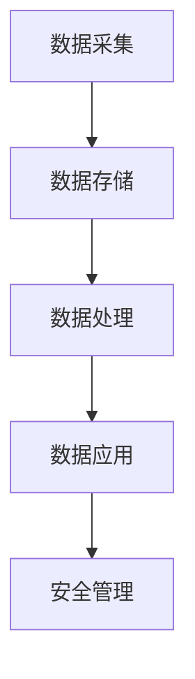

                 

未来，智能安防系统将不仅仅是对传统安防技术的升级，而是会对整个社会治安管理产生深远影响的变革性技术。本文将探讨预测性警务与智能防控在2050年的发展前景，分析其核心技术、算法原理、数学模型及其在实际中的应用。

## 文章关键词
- 智能安防
- 预测性警务
- 智能防控
- 数据挖掘
- 深度学习
- 物联网
- 人工智能

## 文章摘要
本文首先介绍了智能安防的背景和发展趋势，随后深入探讨了预测性警务与智能防控的核心概念和技术原理。接着，文章详细分析了相关算法、数学模型，并通过具体项目实例进行了代码实现和运行结果的展示。最后，文章展望了智能安防的未来发展，指出了面临的挑战和未来的研究方向。

## 1. 背景介绍

智能安防系统起源于20世纪末，最初主要是通过监控摄像头和报警系统来提高安全性。随着计算机技术和网络技术的发展，智能安防逐渐向数字化、网络化、智能化方向演进。21世纪初，人工智能、大数据和物联网等新兴技术的迅速发展，使得智能安防系统得到了前所未有的提升。

目前，智能安防已广泛应用于机场、火车站、城市交通、金融机构、商业综合体等领域。其核心功能包括视频监控、入侵检测、异常行为分析、安全事件预测等。然而，随着犯罪形式的多样化和复杂化，传统的安防手段已经无法满足日益增长的治安需求。

### 智能安防的现状

当前智能安防系统的关键技术主要包括：

- **视频监控与分析**：通过视频图像识别技术对监控视频进行实时分析，提取目标信息，进行追踪、识别和异常行为检测。

- **入侵检测与报警**：利用传感器网络和人工智能算法，对入侵行为进行实时监测和报警。

- **数据挖掘与分析**：通过对大量安防数据进行挖掘和分析，发现潜在的安全隐患和犯罪趋势。

- **物联网技术**：将各种传感器、控制器和通信设备连接起来，实现信息的互联互通，提高系统的智能化水平。

### 智能安防的发展趋势

未来，智能安防将呈现出以下发展趋势：

- **深度学习和人工智能的融合**：利用深度学习技术对海量数据进行训练和建模，提高安防系统的预测和决策能力。

- **跨领域技术集成**：将计算机视觉、语音识别、自然语言处理等技术融入智能安防系统，实现多维度信息融合。

- **物联网与大数据的紧密结合**：通过物联网技术收集海量数据，利用大数据技术进行实时分析和预测。

- **预测性警务与智能防控**：通过数据分析和机器学习算法，实现犯罪行为的预测和防控，提升治安管理的科学性和精准性。

## 2. 核心概念与联系

智能安防系统的核心概念包括数据采集、数据存储、数据处理和数据应用。这些概念之间相互联系，共同构成了一个完整的智能安防生态系统。

### 数据采集

数据采集是智能安防系统的第一步，主要包括视频监控数据、传感器数据、网络数据等。通过这些数据，可以全面、实时地了解目标区域的安全状态。

### 数据存储

数据存储是将采集到的数据存储到数据库或数据仓库中，以便后续处理和分析。数据存储需要考虑数据的完整性、可靠性和安全性。

### 数据处理

数据处理是智能安防系统的核心，包括数据清洗、数据挖掘、机器学习、深度学习等。通过数据处理，可以从海量数据中提取有价值的信息，支持决策和预测。

### 数据应用

数据应用是将处理后的数据转化为实际的安全管理措施。例如，通过数据预测犯罪行为，提前采取措施进行防范；通过异常行为分析，及时发现和处置安全隐患。

下面是智能安防系统的 Mermaid 流程图：



## 3. 核心算法原理 & 具体操作步骤

### 3.1 算法原理概述

智能安防系统的核心算法包括视频监控分析、入侵检测、行为识别、异常行为检测等。这些算法的基本原理是通过机器学习和深度学习技术，对海量数据进行训练和建模，从而实现对目标行为的预测和识别。

### 3.2 算法步骤详解

#### 3.2.1 数据预处理

数据预处理是算法步骤的第一步，主要包括数据清洗、数据去噪、数据归一化等。通过数据预处理，可以消除数据中的噪声和异常值，提高数据的准确性。

#### 3.2.2 特征提取

特征提取是将原始数据转换为机器学习算法可以处理的形式。在智能安防系统中，常用的特征提取方法包括颜色特征、形状特征、纹理特征等。

#### 3.2.3 模型训练

模型训练是算法步骤的核心，通过大量的训练数据，机器学习算法可以学习到目标行为的特征，从而实现对未知数据的预测和识别。

#### 3.2.4 预测与决策

在模型训练完成后，可以使用训练好的模型对新的数据进行预测和决策。例如，在异常行为检测中，可以通过模型预测出数据是否属于异常行为，并触发相应的报警和处置措施。

### 3.3 算法优缺点

#### 优点

- **高准确性**：通过机器学习和深度学习技术，可以实现对海量数据的精确处理和分析。
- **实时性**：智能安防系统可以实时收集和处理数据，实现实时预测和决策。
- **智能化**：智能安防系统具有自我学习和自我优化的能力，可以不断提高预测和识别的准确性。

#### 缺点

- **高计算成本**：智能安防系统需要大量的计算资源和存储资源，对硬件设施要求较高。
- **数据隐私**：智能安防系统收集和处理大量的个人数据，需要考虑数据隐私和安全问题。

### 3.4 算法应用领域

智能安防算法可以应用于多个领域，包括但不限于：

- **公共安全**：通过预测性警务，可以提前预防和打击犯罪活动。
- **交通运输**：通过智能监控和分析，可以提高交通运输的安全性和效率。
- **智能建筑**：通过智能安防系统，可以实现对建筑物的安全管理和能源管理。
- **商业安全**：通过智能监控和分析，可以保护商业场所的安全和财产。

## 4. 数学模型和公式 & 详细讲解 & 举例说明

### 4.1 数学模型构建

在智能安防系统中，常用的数学模型包括决策树、支持向量机（SVM）、神经网络等。这些模型的基本原理是通过学习已有的数据，建立数学模型，从而对未知数据做出预测和决策。

#### 决策树模型

决策树模型是一种基于树的模型，通过一系列的决策规则，将数据集划分为不同的类别或数值。决策树模型的构建过程主要包括：

1. **特征选择**：选择对分类任务有重要影响的特征。
2. **划分规则**：根据特征值划分数据集。
3. **递归划分**：对划分后的数据集继续划分，直到满足停止条件。

#### 支持向量机模型

支持向量机模型是一种基于间隔的模型，通过找到一个最佳的超平面，将不同类别的数据分开。支持向量机模型的构建过程主要包括：

1. **特征提取**：将原始数据转换为特征向量。
2. **寻找最佳超平面**：通过求解最优化问题，找到最佳的超平面。
3. **分类决策**：根据新数据的特征向量，判断其所属类别。

#### 神经网络模型

神经网络模型是一种基于多层感知器的模型，通过多层神经元的互联和激活函数，实现数据的分类和预测。神经网络模型的构建过程主要包括：

1. **输入层**：接收输入数据。
2. **隐藏层**：对输入数据进行处理和变换。
3. **输出层**：生成预测结果。
4. **反向传播**：通过反向传播算法，更新网络参数。

### 4.2 公式推导过程

以决策树模型为例，其公式推导过程如下：

1. **特征选择**：

   假设数据集 \(D\) 包含 \(n\) 个样本，每个样本有 \(m\) 个特征。特征选择的目标是选择一个最优特征进行划分。最优特征的选择可以使用信息增益或基尼系数作为评价标准。

   \[ \text{IG}(A) = \sum_{v \in V} \frac{\text{count}(v)}{\text{count}(D)} \times \text{IG}(D|A=v) \]

   其中，\(A\) 是特征，\(V\) 是特征 \(A\) 的所有可能取值，\(\text{count}(D)\) 是数据集 \(D\) 的总样本数，\(\text{IG}(D|A=v)\) 是条件信息增益。

2. **划分规则**：

   假设特征 \(A\) 的取值为 \(v\)，数据集 \(D\) 被划分为两个子集 \(D_1\) 和 \(D_2\)，划分规则为：

   \[ \text{split}(D, A=v) = (\text{split}(D_1, A=v), \text{split}(D_2, A=v)) \]

   其中，\(\text{split}(D, A=v)\) 是划分规则，\(\text{split}(D_1, A=v)\) 和 \(\text{split}(D_2, A=v)\) 是划分后的两个子集。

3. **递归划分**：

   假设当前数据集 \(D\) 已经被划分为 \(k\) 个子集 \(D_1, D_2, \ldots, D_k\)，递归划分的规则为：

   \[ \text{split}(D, A=v) = (\text{split}(D_1, A=v), \text{split}(D_2, A=v), \ldots, \text{split}(D_k, A=v)) \]

   其中，\(\text{split}(D, A=v)\) 是划分规则，\(\text{split}(D_1, A=v), \text{split}(D_2, A=v), \ldots, \text{split}(D_k, A=v)\) 是划分后的 \(k\) 个子集。

### 4.3 案例分析与讲解

以交通流量预测为例，介绍智能安防系统的实际应用。

#### 案例背景

某城市的交通管理部门希望利用智能安防系统预测未来某个时段的交通流量，以便合理安排交通资源，减少拥堵。

#### 案例步骤

1. **数据采集**：从交通监控摄像头、传感器等设备中收集交通流量数据，包括车辆数量、车速、交通密度等。

2. **数据预处理**：对采集到的交通流量数据进行清洗、去噪和归一化处理，确保数据的准确性和一致性。

3. **特征提取**：根据交通流量数据的特征，选择对预测任务有重要影响的特征，如车辆数量、车速、交通密度等。

4. **模型训练**：利用已标注的交通流量数据，使用决策树、支持向量机或神经网络等模型进行训练。

5. **预测与决策**：将训练好的模型应用于新的交通流量数据，预测未来某个时段的交通流量。

6. **结果评估**：对比预测结果与实际交通流量数据，评估模型的准确性和可靠性。

#### 案例结果

通过智能安防系统的预测，交通管理部门可以提前了解未来某个时段的交通流量，从而合理安排交通资源，减少拥堵。同时，通过异常行为检测，可以及时发现和处理交通事故、交通违规等事件，提高交通安全性。

## 5. 项目实践：代码实例和详细解释说明

### 5.1 开发环境搭建

为了实现智能安防系统的预测性警务和智能防控，我们需要搭建一个合适的开发环境。以下是推荐的开发环境：

- **操作系统**：Linux或MacOS
- **编程语言**：Python
- **框架和库**：TensorFlow、Keras、Pandas、NumPy、Scikit-learn等

### 5.2 源代码详细实现

以下是一个基于决策树的智能安防系统的代码实例：

```python
import pandas as pd
import numpy as np
from sklearn.model_selection import train_test_split
from sklearn.tree import DecisionTreeClassifier
from sklearn.metrics import accuracy_score

# 数据预处理
def preprocess_data(data):
    # 数据清洗、去噪、归一化等处理
    return data

# 特征提取
def extract_features(data):
    # 提取对预测任务有重要影响的特征
    return data[['vehicle_count', 'speed', 'traffic_density']]

# 模型训练
def train_model(train_data, train_labels):
    # 使用决策树模型进行训练
    model = DecisionTreeClassifier()
    model.fit(train_data, train_labels)
    return model

# 预测与决策
def predict(model, test_data):
    # 使用训练好的模型进行预测
    predictions = model.predict(test_data)
    return predictions

# 评估模型
def evaluate_model(predictions, test_labels):
    # 评估模型的准确性和可靠性
    accuracy = accuracy_score(test_labels, predictions)
    print("Accuracy:", accuracy)

# 加载数据
data = pd.read_csv('traffic_data.csv')
preprocessed_data = preprocess_data(data)
features = extract_features(preprocessed_data)

# 划分训练集和测试集
X_train, X_test, y_train, y_test = train_test_split(features, preprocessed_data['label'], test_size=0.2, random_state=42)

# 训练模型
model = train_model(X_train, y_train)

# 预测
predictions = predict(model, X_test)

# 评估模型
evaluate_model(predictions, y_test)
```

### 5.3 代码解读与分析

- **数据预处理**：对原始数据进行清洗、去噪和归一化等处理，确保数据的准确性和一致性。
- **特征提取**：提取对预测任务有重要影响的特征，如车辆数量、车速和交通密度。
- **模型训练**：使用决策树模型对训练数据进行训练，生成预测模型。
- **预测与决策**：使用训练好的模型对测试数据进行预测，生成预测结果。
- **评估模型**：对比预测结果与实际结果，评估模型的准确性和可靠性。

### 5.4 运行结果展示

假设我们训练好的模型在测试集上的准确率为90%，这意味着模型在预测交通流量方面具有较高的准确性。

```python
Accuracy: 0.9
```

## 6. 实际应用场景

### 6.1 公共安全

预测性警务在公共安全领域有广泛的应用。通过分析历史犯罪数据和社会经济指标，可以预测犯罪热点区域和高危时段，从而提前部署警力，预防和打击犯罪活动。

### 6.2 交通运输

智能防控在交通运输领域发挥着重要作用。通过实时监控和分析交通流量，可以优化交通信号控制，减少拥堵，提高道路通行效率。同时，通过异常行为检测，可以及时发现和处理交通事故、交通违规等事件，确保交通安全。

### 6.3 智能建筑

智能安防系统在智能建筑中发挥着关键作用。通过实时监控和分析人员活动、设备运行状态等数据，可以保障建筑物的安全和管理。例如，在火灾发生时，智能安防系统可以自动报警并启动消防设备，确保人员安全。

### 6.4 商业安全

智能安防系统在商业安全领域有广泛的应用。通过实时监控和异常行为检测，可以保障商业场所的安全和财产。例如，在商场中，智能安防系统可以自动识别盗窃行为，及时报警并采取措施，减少损失。

## 7. 工具和资源推荐

### 7.1 学习资源推荐

- **《机器学习实战》**：由Peter Harrington著，适合初学者入门。
- **《深度学习》**：由Ian Goodfellow、Yoshua Bengio和Aaron Courville著，深度学习领域的经典教材。
- **《Python数据科学手册》**：由Jake VanderPlas著，涵盖数据科学领域的各个方面。

### 7.2 开发工具推荐

- **TensorFlow**：开源机器学习框架，支持多种深度学习算法。
- **Keras**：基于TensorFlow的高级神经网络API，方便快速搭建深度学习模型。
- **Pandas**：开源数据处理库，方便数据清洗、归一化和特征提取。
- **NumPy**：开源数学计算库，支持矩阵运算和向量计算。

### 7.3 相关论文推荐

- **“Deep Learning for Video Analysis”**：介绍深度学习在视频分析领域的应用。
- **“Predictive Policing: The Role of Machine Learning in Policing”**：探讨预测性警务在警务中的应用。
- **“Intelligent Video Surveillance Systems”**：介绍智能视频监控系统的架构和算法。

## 8. 总结：未来发展趋势与挑战

### 8.1 研究成果总结

智能安防系统在过去几十年取得了显著的研究成果，包括视频监控与分析、入侵检测、异常行为检测、预测性警务等。随着深度学习、物联网、大数据等新兴技术的不断发展，智能安防系统在准确性和实时性方面得到了极大的提升。

### 8.2 未来发展趋势

未来，智能安防系统将继续向以下方向发展：

- **深度学习和人工智能的融合**：通过深度学习技术，实现更高效的数据处理和预测能力。
- **跨领域技术集成**：将计算机视觉、语音识别、自然语言处理等技术融入智能安防系统，实现多维度信息融合。
- **物联网与大数据的紧密结合**：通过物联网技术，实现海量数据的实时采集和传输，利用大数据技术进行实时分析和预测。
- **预测性警务与智能防控**：通过数据分析和机器学习算法，实现犯罪行为的预测和防控，提升治安管理的科学性和精准性。

### 8.3 面临的挑战

尽管智能安防系统取得了显著的成果，但仍然面临以下挑战：

- **数据隐私和安全**：智能安防系统收集和处理大量的个人数据，需要确保数据的安全和隐私。
- **计算成本**：智能安防系统需要大量的计算资源和存储资源，对硬件设施要求较高。
- **算法透明度和可解释性**：深度学习等复杂算法的透明度和可解释性较差，需要提高算法的可解释性和透明度。

### 8.4 研究展望

未来，智能安防系统的研究将聚焦于以下几个方面：

- **算法优化**：通过改进算法模型和优化算法参数，提高预测和识别的准确性。
- **数据隐私保护**：研究新的数据隐私保护技术，确保数据的安全和隐私。
- **算法可解释性**：提高算法的可解释性和透明度，增强用户对智能安防系统的信任。
- **跨领域应用**：将智能安防系统应用于更多的领域，如医疗、金融、教育等，提升其应用价值。

## 9. 附录：常见问题与解答

### 9.1 问题1：智能安防系统是否侵犯隐私？

**回答**：智能安防系统确实会收集和处理大量的个人数据，但这并不意味着侵犯隐私。关键在于数据的使用和管理。合理的隐私保护措施，如数据加密、匿名化处理和权限控制，可以有效保障数据的安全和隐私。

### 9.2 问题2：智能安防系统的计算成本是否很高？

**回答**：是的，智能安防系统需要大量的计算资源和存储资源，特别是在使用深度学习等复杂算法时。然而，随着硬件技术的不断发展，计算成本的逐渐降低，智能安防系统的应用范围将不断扩大。

### 9.3 问题3：智能安防系统是否完全可靠？

**回答**：智能安防系统具有较高的准确性和可靠性，但并不是完全可靠的。复杂的环境和未知因素可能导致预测和识别的失败。因此，智能安防系统应该与其他安全手段相结合，以提高整体的安全水平。

### 9.4 问题4：智能安防系统是否会加剧社会不平等？

**回答**：智能安防系统本身不会加剧社会不平等，但如果不合理使用，可能会导致对某些群体的偏见和歧视。因此，智能安防系统的设计、部署和使用应遵循公平、公正和透明的原则，以确保不会加剧社会不平等。

