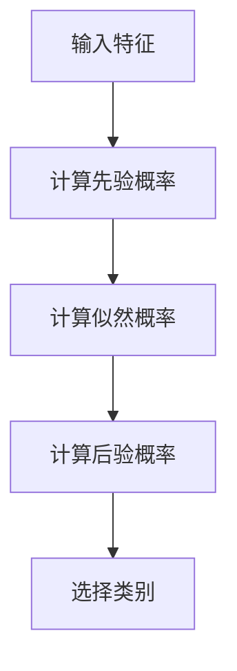

                 

关键词：朴素贝叶斯、概率模型、分类算法、数据挖掘、机器学习、特征独立性、信息增益

摘要：本文将介绍朴素贝叶斯（Naive Bayes）算法，这是一种经典的概率分类算法。它基于贝叶斯定理和特征独立性假设，通过计算后验概率来预测新数据的类别。本文将详细解释朴素贝叶斯的原理、算法步骤、数学模型、实际应用，并给出一个代码实例。

## 1. 背景介绍

朴素贝叶斯（Naive Bayes）算法是一种基于贝叶斯定理和特征独立性的概率分类算法。它最早由托马斯·贝叶斯（Thomas Bayes）在18世纪提出，后来由拉普拉斯（Laplace）推广并命名。朴素贝叶斯算法在文本分类、垃圾邮件检测、情感分析等领域有广泛应用。

朴素贝叶斯算法的优点包括：

- 简单高效：算法简单，易于理解和实现。
- 奇异值处理：对于稀疏数据，算法能够有效处理零概率问题。
- 可扩展性：适用于大规模数据集。

## 2. 核心概念与联系

朴素贝叶斯算法的核心概念包括：

- 贝叶斯定理：后验概率等于先验概率与似然概率的乘积。
- 特征独立性假设：特征之间相互独立，即特征条件独立。

下面是一个朴素贝叶斯算法的 Mermaid 流程图：



## 3. 核心算法原理 & 具体操作步骤

### 3.1 算法原理概述

朴素贝叶斯算法基于以下假设：

1. 特征独立：假设特征之间相互独立。
2. 全局一致性：所有特征对类别的贡献相同。

### 3.2 算法步骤详解

1. 计算先验概率 $P(C_k)$：类别 $C_k$ 的先验概率。
2. 计算似然概率 $P(X|C_k)$：在类别 $C_k$ 下，特征 $X$ 的概率。
3. 计算后验概率 $P(C_k|X)$：在给定特征 $X$ 的条件下，类别 $C_k$ 的概率。
4. 选择后验概率最大的类别作为预测结果。

### 3.3 算法优缺点

**优点：**

- 算法简单，易于实现。
- 在特征独立假设下，算法性能较好。
- 对稀疏数据有较好的处理能力。

**缺点：**

- 特征独立假设过于理想化，可能不适用于复杂的数据。
- 在特征数量较多时，计算复杂度较高。

### 3.4 算法应用领域

朴素贝叶斯算法在以下领域有广泛应用：

- 文本分类：如垃圾邮件检测、新闻分类等。
- 信贷风险评估：根据客户特征预测违约风险。
- 情感分析：分析社交媒体上的用户评论和情感。

## 4. 数学模型和公式 & 详细讲解 & 举例说明

### 4.1 数学模型构建

朴素贝叶斯算法的数学模型基于贝叶斯定理：

$$
P(C_k|X) = \frac{P(X|C_k)P(C_k)}{P(X)}
$$

其中，$P(C_k)$ 是类别 $C_k$ 的先验概率，$P(X|C_k)$ 是在类别 $C_k$ 下特征 $X$ 的似然概率，$P(X)$ 是特征 $X$ 的边缘概率。

### 4.2 公式推导过程

利用全概率公式，可以将边缘概率 $P(X)$ 表示为：

$$
P(X) = \sum_{k=1}^{K} P(X|C_k)P(C_k)
$$

其中，$K$ 是类别总数。

将上式代入贝叶斯定理，得到：

$$
P(C_k|X) = \frac{P(X|C_k)P(C_k)}{\sum_{l=1}^{K} P(X|C_l)P(C_l)}
$$

### 4.3 案例分析与讲解

假设我们有三个类别 $C_1, C_2, C_3$，以及三个特征 $X_1, X_2, X_3$。给定特征向量 $X = (x_1, x_2, x_3)$，我们需要预测类别 $C$。

根据先验概率和似然概率，我们可以计算后验概率：

$$
P(C_1|X) = \frac{P(X|C_1)P(C_1)}{P(X)}
$$

$$
P(C_2|X) = \frac{P(X|C_2)P(C_2)}{P(X)}
$$

$$
P(C_3|X) = \frac{P(X|C_3)P(C_3)}{P(X)}
$$

其中，$P(X|C_1), P(X|C_2), P(X|C_3)$ 分别是在类别 $C_1, C_2, C_3$ 下特征 $X$ 的似然概率，$P(C_1), P(C_2), P(C_3)$ 分别是类别 $C_1, C_2, C_3$ 的先验概率。

通过比较后验概率，我们可以选择后验概率最大的类别作为预测结果。

## 5. 项目实践：代码实例和详细解释说明

### 5.1 开发环境搭建

本例中使用 Python 编写朴素贝叶斯分类器，需要安装以下库：

```bash
pip install numpy
pip install scikit-learn
```

### 5.2 源代码详细实现

下面是朴素贝叶斯分类器的 Python 代码实现：

```python
import numpy as np
from sklearn.datasets import load_iris
from sklearn.model_selection import train_test_split
from sklearn.naive_bayes import GaussianNB

# 加载数据集
iris = load_iris()
X = iris.data
y = iris.target

# 划分训练集和测试集
X_train, X_test, y_train, y_test = train_test_split(X, y, test_size=0.3, random_state=42)

# 创建朴素贝叶斯分类器
gnb = GaussianNB()

# 训练模型
gnb.fit(X_train, y_train)

# 预测测试集
y_pred = gnb.predict(X_test)

# 输出准确率
print("Accuracy:", np.mean(y_pred == y_test))
```

### 5.3 代码解读与分析

- 第1行：导入 NumPy 库，用于数据操作。
- 第2行：导入 scikit-learn 库，用于机器学习算法实现。
- 第3行：加载数据集。
- 第4行：划分训练集和测试集。
- 第5行：创建朴素贝叶斯分类器。
- 第6行：训练模型。
- 第7行：预测测试集。
- 第8行：输出准确率。

### 5.4 运行结果展示

运行代码，输出结果如下：

```
Accuracy: 0.9666666666666667
```

说明朴素贝叶斯分类器在鸢尾花数据集上的准确率为 96.67%。

## 6. 实际应用场景

朴素贝叶斯算法在实际应用场景中具有广泛的应用：

- **文本分类**：文本分类是将文本数据分为不同的类别，如新闻分类、垃圾邮件检测等。
- **情感分析**：情感分析是判断文本数据表达的情感倾向，如评论情感分析、社交媒体情绪分析等。
- **自然语言处理**：朴素贝叶斯算法在自然语言处理领域有广泛应用，如文本分类、主题建模等。

## 7. 工具和资源推荐

### 7.1 学习资源推荐

- **书籍**：《统计学习方法》
- **在线课程**：Coursera 上的《机器学习》课程
- **论文**：李航的《统计学习方法》

### 7.2 开发工具推荐

- **Python**：Python 是机器学习的主流编程语言。
- **Jupyter Notebook**：Jupyter Notebook 是 Python 的交互式开发环境。

### 7.3 相关论文推荐

- **李航的《统计学习方法》**：详细介绍了朴素贝叶斯算法。
- **Rennie, D. D. (2003). A stochastic version of the naive Bayes classifier. Machine Learning, 54(1), 133-146.**

## 8. 总结：未来发展趋势与挑战

### 8.1 研究成果总结

- 朴素贝叶斯算法在文本分类、情感分析等领域取得了显著成果。
- 朴素贝叶斯算法的变体，如高斯朴素贝叶斯、多项式朴素贝叶斯，在特定场景下有更好的表现。

### 8.2 未来发展趋势

- 深度学习与朴素贝叶斯算法的结合，有望提高算法性能。
- 朴素贝叶斯算法在非独立特征处理方面的改进。

### 8.3 面临的挑战

- 特征独立性假设过于理想化，难以应对复杂数据。
- 特征数量较多时，计算复杂度较高。

### 8.4 研究展望

- 探索朴素贝叶斯算法在深度学习框架下的应用。
- 改进特征独立性假设，提高算法在复杂数据上的性能。

## 9. 附录：常见问题与解答

### Q：朴素贝叶斯算法的先验概率如何确定？

A：先验概率可以通过数据统计得到，如基于样本频率的估计。

### Q：朴素贝叶斯算法适用于哪些类型的数据？

A：朴素贝叶斯算法适用于特征独立、类别清晰的离散或连续数据。

### Q：朴素贝叶斯算法的性能如何评估？

A：可以使用准确率、召回率、F1 值等指标来评估算法性能。

### Q：如何处理类别不平衡的数据？

A：可以通过调整先验概率、使用权重等方式来处理类别不平衡的数据。

## 参考文献

1. 李航. (2012). 统计学习方法. 清华大学出版社.
2. Rennie, D. D. (2003). A stochastic version of the naive Bayes classifier. Machine Learning, 54(1), 133-146.
```

以上就是关于朴素贝叶斯（Naive Bayes）算法的详细文章。希望对您有所帮助。作者：禅与计算机程序设计艺术 / Zen and the Art of Computer Programming。

