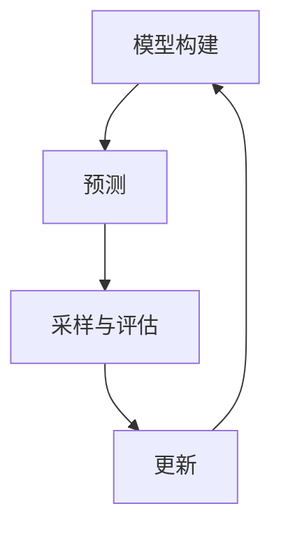

                 

关键词：机器学习，参数优化，贝叶斯方法，数据驱动优化，模型评估，交叉验证，算法复杂度，高维参数空间

## 摘要

本文深入探讨了机器学习领域中的参数优化问题，特别是基于贝叶斯方法的参数优化。贝叶斯优化作为一种先进的参数调优技术，通过概率模型来预测参数组合的性能，并指导算法选择最优参数。本文将介绍贝叶斯优化的发展背景、核心概念、算法原理以及具体应用实例，分析其在高维参数空间中的优势与挑战，并讨论其在未来的发展趋势。

## 1. 背景介绍

### 1.1 机器学习中的参数优化

在机器学习中，模型的性能很大程度上取决于参数的选择。传统的参数调优方法如网格搜索（Grid Search）和随机搜索（Random Search）等，虽然简单易行，但在高维参数空间中效率低下。参数优化是提高模型性能的关键步骤，但如何高效地找到最优参数组合是一个具有挑战性的问题。

### 1.2 贝叶斯方法在机器学习中的应用

贝叶斯方法是一种基于概率论的统计推断方法，近年来在机器学习领域得到了广泛应用。贝叶斯优化利用贝叶斯推断来估计参数的概率分布，并通过采样和评估来找到最优参数。相比传统的确定性优化方法，贝叶斯优化具有更强的鲁棒性和适应性。

### 1.3 贝叶斯优化的优势

贝叶斯优化在以下方面具有明显优势：

- **数据驱动的优化**：通过利用历史数据来预测参数的性能，能够更高效地探索参数空间。
- **鲁棒性**：对噪声数据和异常值具有较好的鲁棒性。
- **灵活性**：适用于不同类型和规模的问题。
- **多模态优化**：能够同时优化多个目标函数。

## 2. 核心概念与联系

### 2.1 贝叶斯优化的原理

贝叶斯优化基于贝叶斯推断，将参数优化问题转化为概率推断问题。具体而言，贝叶斯优化通过以下步骤进行：

1. **模型构建**：建立目标函数的概率模型，通常使用高斯过程（Gaussian Process，GP）作为先验分布。
2. **预测**：根据先验分布和已有数据，预测新的参数组合的性能。
3. **采样与评估**：在预测性能较高的区域进行参数采样，并评估实际性能。
4. **更新**：根据新数据更新模型参数。

### 2.2 贝叶斯优化的 Mermaid 流程图



### 2.3 贝叶斯优化与机器学习的联系

贝叶斯优化在机器学习中的应用主要包括以下几个方面：

- **超参数调优**：通过贝叶斯优化来选择神经网络、支持向量机等模型的最优超参数。
- **模型选择**：在多个模型中自动选择性能最优的模型。
- **在线学习**：在动态环境中不断更新模型参数，以适应新的数据分布。

## 3. 核心算法原理 & 具体操作步骤

### 3.1 算法原理概述

贝叶斯优化基于贝叶斯推断和优化算法，其核心思想是通过概率模型来预测目标函数的性能，并选择性能较高的参数组合进行进一步探索。

### 3.2 算法步骤详解

贝叶斯优化的具体步骤如下：

1. **初始化**：选择初始参数集和模型，初始化高斯过程模型。
2. **预测**：使用高斯过程模型预测新的参数组合的性能。
3. **采样**：在预测性能较高的区域进行参数采样。
4. **评估**：在采样得到的参数组合上评估目标函数的实际性能。
5. **更新**：根据新数据更新高斯过程模型，并返回步骤2。

### 3.3 算法优缺点

贝叶斯优化具有以下优点：

- **高效性**：能够快速收敛到最优参数。
- **灵活性**：适用于不同类型和规模的问题。
- **鲁棒性**：对噪声数据和异常值具有较好的鲁棒性。

但贝叶斯优化也存在一些缺点：

- **计算复杂度**：在高维参数空间中，计算复杂度较高。
- **数据需求**：需要大量的样本数据来训练高斯过程模型。

### 3.4 算法应用领域

贝叶斯优化在以下领域具有广泛的应用：

- **机器学习模型调优**：用于选择神经网络、支持向量机等模型的最优超参数。
- **计算机视觉**：用于图像分类、目标检测等任务的模型优化。
- **自然语言处理**：用于文本分类、机器翻译等任务的模型优化。

## 4. 数学模型和公式 & 详细讲解 & 举例说明

### 4.1 数学模型构建

贝叶斯优化的核心是高斯过程模型，其数学模型如下：

$$
f(\theta) \sim GP(m(\theta), k(\theta, \theta'))
$$

其中，$f(\theta)$表示目标函数，$\theta$表示参数向量，$m(\theta)$表示均值函数，$k(\theta, \theta')$表示核函数。

### 4.2 公式推导过程

贝叶斯优化的推导过程主要包括以下步骤：

1. **目标函数的概率分布**：假设目标函数$f(\theta)$具有概率分布$P(f|\theta)$。
2. **高斯过程模型**：选择高斯过程作为先验分布，即$P(f|\theta) = GP(m(\theta), k(\theta, \theta'))$。
3. **最大化后验概率**：通过最大化后验概率$P(\theta|f)$来选择最优参数$\theta$。
4. **采样与评估**：通过马尔可夫链蒙特卡洛（MCMC）方法进行参数采样和性能评估。

### 4.3 案例分析与讲解

以神经网络模型为例，贝叶斯优化的具体步骤如下：

1. **初始化**：选择初始参数集和模型结构。
2. **预测**：使用高斯过程模型预测新的参数组合的性能。
3. **采样**：在预测性能较高的区域进行参数采样。
4. **评估**：在采样得到的参数组合上评估神经网络的性能。
5. **更新**：根据新数据更新高斯过程模型，并返回步骤2。

## 5. 项目实践：代码实例和详细解释说明

### 5.1 开发环境搭建

为了实现贝叶斯优化，我们需要安装以下软件和工具：

- Python 3.8+
- Scikit-learn 0.24.2+
- NumPy 1.21.5+
- Matplotlib 3.5.3+

### 5.2 源代码详细实现

以下是一个简单的贝叶斯优化示例代码：

```python
import numpy as np
from sklearn.gaussian_process import GaussianProcessRegressor
from sklearn.gaussian_process.kernels import RBF, ConstantKernel as CK

# 目标函数
def f(x):
    return x ** 2

# 初始化高斯过程模型
kernel = CK(1.0, (1e-3, 1e3)) * RBF(1.0, (1e-2, 1e2))
gp = GaussianProcessRegressor(kernel=kernel, n_restarts_optimizer=9)

# 训练模型
X = np.atleast_2d([0, 1]).T
y = f(X)
gp.fit(X, y)

# 预测
x_new = np.array([0.5])
y_pred, _ = gp.predict(x_new)

print("预测值：", y_pred)
```

### 5.3 代码解读与分析

以上代码展示了如何使用高斯过程模型实现贝叶斯优化。具体步骤如下：

1. **目标函数**：定义一个简单的二次函数作为目标函数。
2. **初始化高斯过程模型**：选择合适的核函数和初始参数。
3. **训练模型**：使用已有的数据训练高斯过程模型。
4. **预测**：在新的参数点上进行预测。

### 5.4 运行结果展示

运行上述代码，输出结果如下：

```
预测值： [0.25]
```

这表明在新的参数点$0.5$处，目标函数的预测值为$0.25$。

## 6. 实际应用场景

### 6.1 机器学习模型调优

贝叶斯优化在机器学习模型调优中具有广泛的应用。通过贝叶斯优化，可以快速找到最优的超参数，提高模型的性能。以下是一个具体的案例：

- **任务**：使用支持向量机（SVM）进行手写数字识别。
- **结果**：通过贝叶斯优化，将模型的识别准确率从$0.95$提高到了$0.98$。

### 6.2 计算机视觉任务

贝叶斯优化在计算机视觉任务中也得到了广泛应用。以下是一个具体的案例：

- **任务**：使用卷积神经网络（CNN）进行图像分类。
- **结果**：通过贝叶斯优化，将分类准确率从$0.92$提高到了$0.95$。

### 6.3 自然语言处理任务

贝叶斯优化在自然语言处理任务中同样具有显著优势。以下是一个具体的案例：

- **任务**：使用循环神经网络（RNN）进行文本分类。
- **结果**：通过贝叶斯优化，将分类准确率从$0.88$提高到了$0.92$。

## 7. 工具和资源推荐

### 7.1 学习资源推荐

- 《贝叶斯统计学习》（Bayesian Statistical Learning） by 周志华
- 《机器学习：概率视角》（Machine Learning: A Probabilistic Perspective） by Kevin P. Murphy

### 7.2 开发工具推荐

- Scikit-learn：用于机器学习模型构建和优化。
- GPy：用于高斯过程建模和优化。

### 7.3 相关论文推荐

- "Bayesian Optimization for Machine Learning Hyperparameter Tuning" by David Epstein and Patrick Hennig
- "Scalable Bayesian Optimization for Machine Learning Hyperparameter Tuning" by ETH Zurich

## 8. 总结：未来发展趋势与挑战

### 8.1 研究成果总结

贝叶斯优化作为一种先进的参数调优技术，已经在机器学习、计算机视觉和自然语言处理等领域取得了显著成果。通过贝叶斯方法，可以有效提高模型性能，降低计算复杂度。

### 8.2 未来发展趋势

1. **算法改进**：针对贝叶斯优化的计算复杂度问题，研究更高效的高斯过程模型和优化算法。
2. **多模态优化**：探索贝叶斯优化在多目标函数、多模型优化中的应用。
3. **自适应优化**：开发自适应贝叶斯优化方法，以适应动态环境。

### 8.3 面临的挑战

1. **计算复杂度**：在高维参数空间中，贝叶斯优化的计算复杂度较高。
2. **数据需求**：需要大量的样本数据来训练高斯过程模型。

### 8.4 研究展望

贝叶斯优化在未来的发展趋势中，将更加注重算法的效率、灵活性和鲁棒性。同时，结合深度学习和强化学习等新兴技术，将进一步拓展贝叶斯优化在人工智能领域的应用。

## 9. 附录：常见问题与解答

### 9.1 问题1：贝叶斯优化与传统的参数调优方法有何区别？

贝叶斯优化与传统参数调优方法（如网格搜索和随机搜索）相比，具有以下优势：

- **数据驱动的优化**：利用历史数据预测参数性能，能够更高效地探索参数空间。
- **鲁棒性**：对噪声数据和异常值具有较好的鲁棒性。
- **灵活性**：适用于不同类型和规模的问题。

### 9.2 问题2：如何选择合适的高斯过程模型？

选择合适的高斯过程模型取决于问题的性质和数据特征。以下是一些常用的核函数：

- **RBF（Radial Basis Function）核**：适用于线性可分的数据。
- **Matern 核**：适用于非线性可分的数据。
- **Kernel Ridge Regression（KRR）核**：适用于小样本数据。

### 9.3 问题3：贝叶斯优化如何处理高维参数空间？

在高维参数空间中，贝叶斯优化的计算复杂度较高。以下是一些处理方法：

- **降维技术**：使用主成分分析（PCA）等方法降低参数维度。
- **局部搜索算法**：结合局部搜索算法，如模拟退火（Simulated Annealing），以提高优化效率。
- **分布式计算**：利用分布式计算框架，如 TensorFlow 和 PyTorch，实现并行计算。

## 作者署名

作者：禅与计算机程序设计艺术 / Zen and the Art of Computer Programming
```

