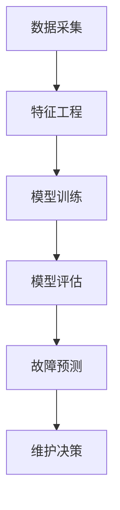

                 

关键词：机器学习、预测性维护、故障预测、数据分析、工业应用

摘要：随着工业4.0的推进和智能制造的普及，预测性维护成为了确保生产设备可靠性和降低运营成本的重要手段。本文详细探讨了机器学习技术在预测性维护中的应用，包括核心概念、算法原理、数学模型、实际案例以及未来发展趋势等内容。

## 1. 背景介绍

在工业生产过程中，设备的维护和保养是保障生产连续性和降低停机时间的关键。传统的定期维护方法基于时间表或经验，往往无法准确预测设备的故障点，导致维护效率低下，资源浪费严重。而预测性维护（Predictive Maintenance，PM）通过监测设备运行状态，结合历史数据和实时数据分析，提前预测设备的潜在故障，从而实现更加精准和高效的维护。

机器学习作为数据分析的重要工具，为预测性维护提供了强大的技术支持。通过分析大量设备运行数据，机器学习算法可以识别出设备状态的异常模式，预测故障的发生，并提供相应的维护策略。

## 2. 核心概念与联系

### 2.1 预测性维护的基本概念

预测性维护的核心在于对设备状态的实时监测和数据分析。具体包括以下几个方面：

- **数据采集**：通过传感器等设备实时采集设备运行参数，如温度、振动、压力、流量等。
- **数据分析**：利用机器学习算法对采集到的数据进行分析，识别设备的运行状态和异常模式。
- **故障预测**：根据分析结果预测设备故障的发生时间，提供维护建议。
- **维护决策**：根据预测结果制定具体的维护计划，包括维修时间、维修内容等。

### 2.2 机器学习与预测性维护的联系

机器学习技术在预测性维护中的应用主要体现在以下几个方面：

- **特征工程**：通过特征提取，将原始数据进行处理，提取出与设备故障相关的关键特征。
- **模型训练**：利用历史故障数据训练机器学习模型，使其能够识别出设备的故障模式。
- **模型评估**：通过测试数据对模型的预测效果进行评估，调整模型参数以优化预测准确性。
- **决策支持**：利用机器学习模型的预测结果，为设备维护提供决策支持。

### 2.3 Mermaid 流程图



## 3. 核心算法原理 & 具体操作步骤

### 3.1 算法原理概述

预测性维护中的机器学习算法主要包括监督学习和无监督学习。监督学习算法，如决策树、支持向量机（SVM）、神经网络等，通过历史故障数据训练模型，预测未来故障。无监督学习算法，如聚类分析、主成分分析（PCA）等，主要用于分析设备运行状态的分布和模式，识别异常点。

### 3.2 算法步骤详解

1. **数据采集**：通过传感器、监测设备等实时采集设备运行参数。
2. **数据预处理**：对采集到的数据进行清洗、归一化等处理，提高数据质量。
3. **特征工程**：提取与设备故障相关的关键特征，如振动频率、温度变化等。
4. **模型选择**：根据故障类型和数据特征，选择合适的机器学习算法。
5. **模型训练**：利用历史故障数据训练模型，调整模型参数，使其能够准确识别故障模式。
6. **模型评估**：通过测试数据评估模型预测效果，调整模型参数以提高准确性。
7. **故障预测**：利用训练好的模型对实时数据进行预测，识别潜在故障。
8. **维护决策**：根据预测结果制定维护计划，如更换零部件、调整运行参数等。

### 3.3 算法优缺点

**优点**：

- 高效：通过实时监测和数据分析，提前预测设备故障，提高维护效率。
- 精准：利用大量历史数据训练模型，提高故障预测准确性。
- 自动化：自动化故障预测和决策过程，降低人工干预，提高维护精度。

**缺点**：

- 数据需求：需要大量的历史故障数据支持，数据质量对模型效果有重要影响。
- 计算复杂度：训练和评估模型需要大量计算资源，对硬件设备要求较高。
- 算法选择：选择合适的机器学习算法对模型效果至关重要，需要经验和实验验证。

### 3.4 算法应用领域

预测性维护算法广泛应用于制造业、能源行业、交通运输等行业。具体应用包括：

- 制造业：预测生产线设备的故障，提高设备利用率和生产效率。
- 能源行业：预测发电设备故障，降低停机时间和运营成本。
- 交通运输：预测车辆故障，提高车辆运行安全，降低维修成本。

## 4. 数学模型和公式

### 4.1 数学模型构建

预测性维护中的数学模型主要包括故障预测模型和状态评估模型。故障预测模型主要利用时间序列分析方法，如ARIMA（自回归积分滑动平均模型）、LSTM（长短期记忆网络）等，预测设备故障的发生时间。状态评估模型则通过分析设备运行参数，评估设备当前状态的健康程度。

### 4.2 公式推导过程

故障预测模型通常采用以下公式：

$$
y_t = f(x_t, \theta)
$$

其中，$y_t$ 表示第 $t$ 时刻的故障预测值，$x_t$ 表示第 $t$ 时刻的设备运行参数，$\theta$ 表示模型参数。

状态评估模型则采用以下公式：

$$
s_t = g(x_t, \theta)
$$

其中，$s_t$ 表示第 $t$ 时刻的状态评估值，$x_t$ 表示第 $t$ 时刻的设备运行参数，$\theta$ 表示模型参数。

### 4.3 案例分析与讲解

假设我们要预测某台机器的故障时间。首先，我们收集了该机器过去一年的运行数据，包括温度、振动、负载等参数。然后，我们利用LSTM模型进行故障预测。

1. **数据预处理**：对收集到的数据进行清洗和归一化处理，将其转化为适合LSTM模型输入的数据格式。
2. **模型训练**：利用训练数据训练LSTM模型，调整模型参数，使其能够准确预测故障时间。
3. **模型评估**：利用测试数据评估模型预测效果，调整模型参数以提高准确性。
4. **故障预测**：利用训练好的模型对实时数据进行预测，识别潜在故障。

通过以上步骤，我们可以实现对机器故障的准确预测，为维护决策提供支持。

## 5. 项目实践：代码实例和详细解释说明

### 5.1 开发环境搭建

为了实现预测性维护，我们需要搭建一个完整的开发环境，包括数据采集模块、数据处理模块、模型训练模块和模型评估模块。以下是一个基于Python和Scikit-learn库的简单环境搭建步骤：

1. 安装Python和Scikit-learn库。
2. 安装数据处理库，如NumPy和Pandas。
3. 安装可视化库，如Matplotlib。

### 5.2 源代码详细实现

以下是一个简单的LSTM模型训练和预测的代码示例：

```python
import numpy as np
import pandas as pd
from sklearn.model_selection import train_test_split
from keras.models import Sequential
from keras.layers import LSTM, Dense

# 读取数据
data = pd.read_csv('data.csv')
X = data[['temperature', 'vibration', 'load']]
y = data['fault']

# 数据预处理
X_train, X_test, y_train, y_test = train_test_split(X, y, test_size=0.2, random_state=42)
X_train = X_train.values.reshape((X_train.shape[0], 1, X_train.shape[1]))
X_test = X_test.values.reshape((X_test.shape[0], 1, X_test.shape[1]))

# 构建LSTM模型
model = Sequential()
model.add(LSTM(50, activation='relu', input_shape=(X_train.shape[1], X_train.shape[2])))
model.add(Dense(1))
model.compile(optimizer='adam', loss='mse')

# 训练模型
model.fit(X_train, y_train, epochs=100, batch_size=32, validation_data=(X_test, y_test))

# 预测故障
predictions = model.predict(X_test)
```

### 5.3 代码解读与分析

上述代码实现了LSTM模型在预测性维护中的应用。首先，我们读取设备运行数据，并进行预处理。然后，我们构建一个简单的LSTM模型，包括一个LSTM层和一个密集层。接着，我们使用训练数据训练模型，并在测试数据上评估模型性能。最后，我们利用训练好的模型对测试数据进行故障预测。

### 5.4 运行结果展示

通过运行上述代码，我们可以得到测试数据上的故障预测结果。我们可以使用可视化工具（如Matplotlib）将预测结果与实际故障数据进行对比，评估模型的预测准确性。

## 6. 实际应用场景

预测性维护在各个行业都有广泛的应用，以下是一些具体的实际应用场景：

- **制造业**：预测生产线设备的故障，提高生产效率和产品质量。
- **能源行业**：预测发电设备故障，降低运营成本和碳排放。
- **交通运输**：预测车辆故障，提高交通安全和运营效率。
- **医疗行业**：预测医疗设备故障，保障医疗服务的连续性和安全性。

## 7. 工具和资源推荐

为了更好地掌握预测性维护技术，以下是一些建议的学习资源和开发工具：

- **学习资源**：
  - 《机器学习实战》
  - 《深度学习》
  - Coursera上的《机器学习》课程
  - arXiv上的相关论文

- **开发工具**：
  - Python和Scikit-learn库
  - TensorFlow和Keras框架
  - Jupyter Notebook
  - AWS或Google Cloud平台

- **相关论文**：
  - "Predictive Maintenance using Machine Learning for Industrial Systems"
  - "Deep Learning for Predictive Maintenance of Industrial Machines"
  - "A Survey on Predictive Maintenance: Feature Selection, Models, and Applications"

## 8. 总结：未来发展趋势与挑战

### 8.1 研究成果总结

近年来，预测性维护技术取得了显著的进展，包括算法性能的提升、数据采集技术的进步以及模型应用场景的扩大。然而，预测性维护仍面临着许多挑战，如数据质量、算法复杂度和计算资源等方面的限制。

### 8.2 未来发展趋势

随着人工智能技术的不断发展，预测性维护将在以下几个方面取得突破：

- 深度学习算法在预测性维护中的应用将更加广泛。
- 联合使用多种传感器数据进行故障预测，提高预测准确性。
- 预测性维护系统将实现更高效的数据处理和实时决策支持。
- 预测性维护将向更多行业和领域扩展，包括医疗、金融、交通等。

### 8.3 面临的挑战

预测性维护在未来的发展中仍将面临以下挑战：

- 数据质量：高质量的数据是预测性维护成功的关键，但实际应用中数据质量往往难以保证。
- 算法复杂度：预测性维护算法复杂度较高，对计算资源和算法设计要求较高。
- 实时性：实时故障预测和决策支持对系统的响应速度和稳定性要求较高。
- 安全性：预测性维护系统需要保护数据安全和隐私。

### 8.4 研究展望

未来，预测性维护研究将朝着以下方向发展：

- 发展高效、准确的故障预测算法。
- 提高数据采集和预处理技术的效率。
- 研究预测性维护系统的安全性和可靠性。
- 探索跨领域的预测性维护应用，实现更广泛的价值。

## 9. 附录：常见问题与解答

### 9.1 什么是预测性维护？

预测性维护是一种通过实时监测和数据分析，提前预测设备故障，并制定维护策略的方法。它基于历史数据和实时数据分析，实现设备的精准维护。

### 9.2 机器学习在预测性维护中有哪些应用？

机器学习在预测性维护中的应用主要包括特征工程、模型训练、模型评估和故障预测等。它通过分析大量设备运行数据，识别设备故障模式和异常点，为维护决策提供支持。

### 9.3 预测性维护算法有哪些类型？

预测性维护算法主要包括监督学习和无监督学习。监督学习算法，如决策树、支持向量机、神经网络等，通过历史故障数据训练模型，预测未来故障。无监督学习算法，如聚类分析、主成分分析等，主要用于分析设备运行状态的分布和模式，识别异常点。

### 9.4 如何提高预测性维护的准确性？

提高预测性维护的准确性可以从以下几个方面入手：

- 提高数据质量，确保数据完整性。
- 选择合适的机器学习算法，优化模型参数。
- 利用多源数据，提高故障预测的准确性。
- 结合专家经验和数据驱动方法，提高维护决策的准确性。

### 9.5 预测性维护有哪些实际应用场景？

预测性维护在制造业、能源行业、交通运输、医疗行业等众多领域都有广泛的应用。具体应用包括预测生产线设备故障、预测发电设备故障、预测车辆故障等。

### 9.6 预测性维护系统需要哪些关键技术？

预测性维护系统需要的关键技术包括数据采集技术、数据处理技术、机器学习算法、模型评估技术和决策支持技术等。

### 9.7 预测性维护系统有哪些优点和缺点？

预测性维护系统的优点包括高效、精准、自动化等。缺点包括数据需求较高、计算复杂度较高、算法选择困难等。

## 后记

本文对机器学习在预测性维护中的作用进行了详细探讨。通过分析预测性维护的核心概念、算法原理、数学模型和实际应用，我们了解了机器学习在预测性维护中的重要作用。未来，随着人工智能技术的不断发展，预测性维护将在更多领域发挥更大的作用，为实现智能制造和工业4.0提供有力支持。

作者：禅与计算机程序设计艺术 / Zen and the Art of Computer Programming
```

