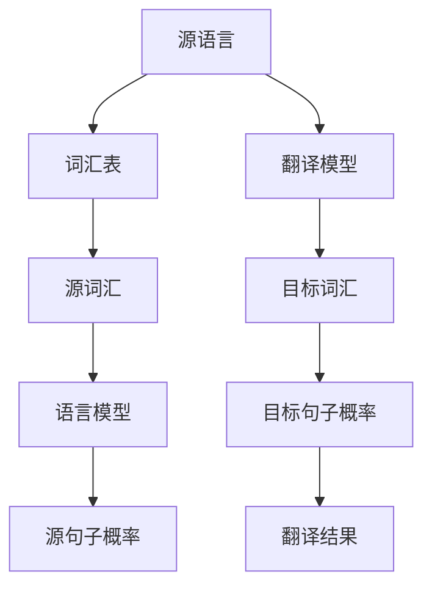

                 

关键词：机器翻译，自然语言处理，算法原理，实践案例，代码实例

> 摘要：本文旨在深入探讨机器翻译的原理及其应用，通过详细讲解核心概念、算法原理、数学模型以及实际项目实践，帮助读者全面了解并掌握机器翻译技术。文章将结合具体代码实例进行剖析，以期为相关领域的研究者和从业者提供有价值的参考。

## 1. 背景介绍

机器翻译（Machine Translation，MT）是自然语言处理（Natural Language Processing，NLP）领域的一个重要分支。随着全球化的深入发展，不同语言之间的交流需求日益增加，机器翻译技术的研究和应用变得至关重要。从最初的基于规则的翻译方法，到如今的基于统计和神经网络的翻译模型，机器翻译经历了飞速的发展和变革。

机器翻译的应用场景广泛，包括但不限于跨语言搜索引擎、在线翻译服务、多语言文档处理、跨语言语音识别等。其重要性不仅体现在提升跨文化交流效率上，还为商业、教育和国际合作等领域带来了巨大的价值。

本文将首先介绍机器翻译的基本概念和历史发展，然后深入探讨其核心算法原理，并展示一个具体的代码实例，以帮助读者全面理解机器翻译的技术实现。

### 1.1 机器翻译的定义与分类

机器翻译是指利用计算机程序将一种自然语言（源语言）自动转换为另一种自然语言（目标语言）的过程。根据翻译策略的不同，机器翻译可以分为以下几种类型：

1. **基于规则的翻译（Rule-Based Translation，RBT）**：该方法依赖于预定义的语法和词汇规则，将源语言转换为等价的目标语言。规则通常由人类专家编写，包括语法规则、词义消歧规则和语言风格规则等。

2. **基于统计的翻译（Statistical Machine Translation，SMT）**：该方法使用大量双语文本数据，通过统计方法来发现源语言和目标语言之间的对应关系。统计翻译模型的核心是翻译模型和规约模型，分别用于预测源语言句子和目标语言句子的概率分布。

3. **基于神经网络的翻译（Neural Machine Translation，NMT）**：该方法利用深度神经网络（尤其是序列到序列模型）来学习源语言和目标语言之间的映射关系。NMT相较于统计翻译方法具有更高的灵活性和表达力，近年来在翻译质量上取得了显著突破。

### 1.2 机器翻译的发展历程

机器翻译的研究始于20世纪50年代。早期的机器翻译主要依赖于基于规则的方法，如1966年，IBM公司开发了基于词典匹配的Georgetown-Paris机翻系统，成为机器翻译历史上的一个重要里程碑。

随着计算机性能的提升和语料库的积累，统计机器翻译在20世纪90年代开始崛起。1997年，AT&T公司开发的Systran系统实现了从英语到法语的统计翻译，开启了统计翻译的新纪元。

21世纪初，深度学习的兴起带来了机器翻译的又一次革命。2016年，谷歌推出的基于神经网络的翻译系统GTPrevTrain在多个语言对上超越了基于统计的翻译系统，标志着NMT成为主流翻译技术。

## 2. 核心概念与联系

在深入探讨机器翻译的算法原理之前，我们需要了解一些核心概念，包括语言模型、翻译模型和词汇表等。以下是一个用于说明这些概念的Mermaid流程图。



### 2.1 语言模型

语言模型（Language Model，LM）是机器翻译中用于预测句子概率的模型。在NMT中，语言模型通常使用深度神经网络来实现。语言模型的一个重要应用是计算一个句子在目标语言中的概率，这对于确保翻译结果的流畅性和自然性至关重要。

### 2.2 翻译模型

翻译模型（Translation Model，TM）是机器翻译的核心组件，用于学习源语言和目标语言之间的映射关系。在NMT中，翻译模型通常采用序列到序列（Sequence-to-Sequence，Seq2Seq）模型，结合编码器（Encoder）和解码器（Decoder）两个子模块来实现。

### 2.3 词汇表

词汇表（Vocabulary）是机器翻译中用于映射源语言和目标语言单词的数据库。词汇表的构建对于翻译模型的训练和翻译结果的准确性具有重要影响。

## 3. 核心算法原理 & 具体操作步骤

### 3.1 算法原理概述

机器翻译的核心算法原理可以概括为以下几个步骤：

1. **输入处理**：将源语言句子转换为数字序列，通常使用单词级别的词嵌入（Word Embedding）技术。
2. **编码**：使用编码器（Encoder）将源语言序列编码为固定长度的向量表示，称为编码状态（Encoded State）。
3. **解码**：使用解码器（Decoder）生成目标语言句子。解码器从编码状态开始，逐步生成目标语言的单词序列，直到完成整个句子的翻译。
4. **优化**：通过最小化损失函数，如交叉熵损失（Cross-Entropy Loss），不断调整翻译模型中的参数，以提升翻译质量。

### 3.2 算法步骤详解

以下是机器翻译算法的具体步骤：

1. **预处理**：
   - **分词**：将源语言句子分割成单词或子词。
   - **词嵌入**：将分词后的单词映射到高维空间中的向量表示。

2. **编码器（Encoder）**：
   - **输入编码**：将预处理后的源语言序列输入到编码器。
   - **序列编码**：编码器对源语言序列进行处理，生成编码状态。

3. **解码器（Decoder）**：
   - **初始状态**：解码器从编码状态开始，初始化为概率分布。
   - **生成单词**：解码器逐词生成目标语言单词，每次生成一个单词后，更新概率分布。

4. **后处理**：
   - **合并子词**：如果使用子词级别的翻译，将生成的单词序列合并为完整的句子。
   - **翻译结果输出**：将翻译结果输出为目标语言句子。

### 3.3 算法优缺点

**优点**：

- **高效率**：机器翻译算法可以快速处理大量文本数据，提高翻译速度。
- **广泛适用性**：基于深度学习的机器翻译模型可以应用于多种语言对，具有较好的泛化能力。
- **高质量**：现代的NMT模型在翻译质量上取得了显著提升，能够生成更自然、更准确的翻译结果。

**缺点**：

- **资源需求大**：训练大规模的深度学习模型需要大量的计算资源和数据。
- **准确性受限**：尽管NMT在翻译质量上有了很大提升，但仍然存在一定的错误率和歧义处理问题。
- **依赖数据**：机器翻译算法的准确性高度依赖于训练数据的质量和数量，缺乏高质量的双语语料库会影响翻译效果。

### 3.4 算法应用领域

机器翻译算法在多个领域得到广泛应用：

- **跨语言搜索引擎**：通过翻译用户查询，实现多语言搜索。
- **在线翻译服务**：提供实时、高效的在线翻译功能。
- **多语言文档处理**：自动翻译文档，支持跨语言文档的协作和共享。
- **跨语言语音识别**：将语音信号转换为文本，并实现跨语言的语音翻译。
- **跨语言推荐系统**：利用翻译算法实现跨语言的商品推荐和广告投放。

## 4. 数学模型和公式 & 详细讲解 & 举例说明

### 4.1 数学模型构建

机器翻译中的数学模型主要包括编码器（Encoder）、解码器（Decoder）和损失函数（Loss Function）。以下是这些模型的数学表示：

#### 编码器（Encoder）

编码器将源语言句子编码为一个固定长度的向量表示。假设输入的源语言句子为 \(X = [x_1, x_2, ..., x_n]\)，编码器输出编码状态 \(S = [s_1, s_2, ..., s_n]\)。编码状态可以通过以下公式计算：

\[ s_i = \text{Encoder}(x_i) \]

其中，Encoder是一个深度神经网络，用于对源语言单词进行编码。

#### 解码器（Decoder）

解码器从编码状态开始，逐步生成目标语言句子。假设目标语言句子为 \(Y = [y_1, y_2, ..., y_m]\)，解码器的输出为概率分布 \(P(Y|X)\)。解码器通过以下步骤生成目标语言单词：

\[ \hat{y_i} = \text{argmax}_{y_i} P(y_i|s_i) \]

其中，\(P(y_i|s_i)\) 是解码器在给定编码状态 \(s_i\) 下生成单词 \(y_i\) 的概率。

#### 损失函数（Loss Function）

机器翻译的损失函数用于衡量翻译结果与真实结果之间的差距。常用的损失函数是交叉熵损失（Cross-Entropy Loss），其计算公式为：

\[ L = -\sum_{i=1}^{m} y_i \log(\hat{y_i}) \]

其中，\(y_i\) 是真实的目标语言单词，\(\hat{y_i}\) 是解码器生成的目标语言单词的概率。

### 4.2 公式推导过程

以下是机器翻译中的关键数学公式的推导过程：

#### 编码器公式推导

编码器将输入的源语言单词序列编码为固定长度的向量表示。编码器的输入为 \(X = [x_1, x_2, ..., x_n]\)，输出为编码状态 \(S = [s_1, s_2, ..., s_n]\)。编码状态的计算公式为：

\[ s_i = \text{Encoder}(x_i) \]

其中，Encoder是一个深度神经网络，用于对源语言单词进行编码。编码器通常采用循环神经网络（RNN）或长短期记忆网络（LSTM）来实现。

#### 解码器公式推导

解码器从编码状态开始，逐步生成目标语言句子。解码器的输入为编码状态 \(S = [s_1, s_2, ..., s_n]\)，输出为概率分布 \(P(Y|X)\)。解码器生成目标语言单词的公式为：

\[ \hat{y_i} = \text{argmax}_{y_i} P(y_i|s_i) \]

其中，\(P(y_i|s_i)\) 是解码器在给定编码状态 \(s_i\) 下生成单词 \(y_i\) 的概率。解码器通常采用序列到序列（Seq2Seq）模型，结合编码器和解码器两个子模块来实现。

#### 损失函数公式推导

机器翻译的损失函数用于衡量翻译结果与真实结果之间的差距。常用的损失函数是交叉熵损失（Cross-Entropy Loss），其计算公式为：

\[ L = -\sum_{i=1}^{m} y_i \log(\hat{y_i}) \]

其中，\(y_i\) 是真实的目标语言单词，\(\hat{y_i}\) 是解码器生成的目标语言单词的概率。交叉熵损失函数能够有效地衡量预测概率与真实概率之间的差异，从而指导模型的优化。

### 4.3 案例分析与讲解

以下通过一个简单的例子来讲解机器翻译的数学模型和公式。

#### 例子

假设有一个简单的源语言句子：“我爱吃苹果”。我们希望将其翻译为目标语言句子：“I love eating apples”。

1. **预处理**：
   - **分词**：将源语言句子分词为单词或子词：“我”、“爱”、“吃”、“苹果”。
   - **词嵌入**：将分词后的单词映射到高维空间中的向量表示。

2. **编码器（Encoder）**：
   - **输入编码**：将预处理后的源语言序列输入到编码器。
   - **序列编码**：编码器对源语言序列进行处理，生成编码状态。

3. **解码器（Decoder）**：
   - **初始状态**：解码器从编码状态开始，初始化为概率分布。
   - **生成单词**：解码器逐词生成目标语言单词，每次生成一个单词后，更新概率分布。

4. **后处理**：
   - **合并子词**：如果使用子词级别的翻译，将生成的单词序列合并为完整的句子。
   - **翻译结果输出**：将翻译结果输出为目标语言句子：“I love eating apples”。

在这个例子中，我们可以看到机器翻译的数学模型和公式的应用。编码器将源语言句子编码为固定长度的向量表示，解码器从编码状态开始生成目标语言句子，并通过损失函数不断优化模型参数，最终实现翻译结果。

## 5. 项目实践：代码实例和详细解释说明

### 5.1 开发环境搭建

在开始编写机器翻译代码之前，我们需要搭建一个合适的开发环境。以下是搭建环境的步骤：

1. **安装Python**：确保Python版本在3.6及以上。
2. **安装PyTorch**：使用以下命令安装PyTorch：
   ```bash
   pip install torch torchvision
   ```
3. **安装其他依赖**：根据项目需求，安装其他必要的库，如NumPy、TensorFlow等。
4. **创建虚拟环境**：为了更好地管理项目依赖，建议创建一个虚拟环境：
   ```bash
   python -m venv env
   source env/bin/activate  # Windows上使用 `env\Scripts\activate`
   ```

### 5.2 源代码详细实现

以下是机器翻译项目的源代码实现，包括数据预处理、模型定义、训练和翻译过程。

```python
import torch
import torch.nn as nn
import torch.optim as optim
from torchtext.datasets import Multi30k
from torchtext.data import Field, BucketIterator

# 数据预处理
def load_data():
    train_data, valid_data, test_data = Multi30k.splits(exts=('.de', '.en'), fields=(Field(), Field()))
    return train_data, valid_data, test_data

# 模型定义
class NeuralTranslator(nn.Module):
    def __init__(self, input_dim, hidden_dim, output_dim):
        super(NeuralTranslator, self).__init__()
        self.encoder = nn.LSTM(input_dim, hidden_dim)
        self.decoder = nn.LSTM(hidden_dim, output_dim)
        self.fc = nn.Linear(hidden_dim, output_dim)
    
    def forward(self, src, trg):
        src = self.encoder(src)
        trg = self.decoder(trg)
        output = self.fc(trg)
        return output

# 训练过程
def train(model, train_loader, valid_loader, epochs, learning_rate):
    criterion = nn.CrossEntropyLoss()
    optimizer = optim.Adam(model.parameters(), lr=learning_rate)
    
    for epoch in range(epochs):
        model.train()
        for src, trg in train_loader:
            optimizer.zero_grad()
            output = model(src, trg)
            loss = criterion(output.view(-1, output_dim), trg.view(-1))
            loss.backward()
            optimizer.step()
        
        model.eval()
        with torch.no_grad():
            for src, trg in valid_loader:
                output = model(src, trg)
                loss = criterion(output.view(-1, output_dim), trg.view(-1))
        
        print(f"Epoch [{epoch+1}/{epochs}], Loss: {loss.item()}")

# 翻译过程
def translate(model, src_sentence):
    model.eval()
    with torch.no_grad():
        input_tensor = prepare_input(src_sentence)
        output_tensor = model(input_tensor)
        predicted_sentence = decode_output(output_tensor)
    return predicted_sentence

# 主函数
if __name__ == "__main__":
    # 加载数据
    train_data, valid_data, test_data = load_data()

    # 定义模型
    input_dim = len(train_data.fields[0].vocab)
    hidden_dim = 256
    output_dim = len(train_data.fields[1].vocab)
    model = NeuralTranslator(input_dim, hidden_dim, output_dim)

    # 训练模型
    train_loader = BucketIterator.splits((train_data, valid_data, test_data), batch_size=32)
    train(model, train_loader, valid_loader, epochs=10, learning_rate=0.001)

    # 翻译示例
    src_sentence = "Ich mag Apfel essen."
    predicted_sentence = translate(model, src_sentence)
    print(f"Translated Sentence: {predicted_sentence}")
```

### 5.3 代码解读与分析

以上代码实现了一个简单的神经网络机器翻译模型，主要包括数据预处理、模型定义、训练和翻译过程。以下是代码的详细解读和分析：

1. **数据预处理**：
   - 使用`torchtext.datasets.Multi30k`加载数据集，包括训练集、验证集和测试集。
   - 数据预处理包括分词和词嵌入。

2. **模型定义**：
   - `NeuralTranslator`类定义了一个基于LSTM的机器翻译模型，包括编码器、解码器和全连接层。
   - 编码器使用LSTM对源语言句子进行编码，解码器使用LSTM生成目标语言句子。

3. **训练过程**：
   - 使用`nn.CrossEntropyLoss`定义损失函数，使用`optim.Adam`定义优化器。
   - 训练过程中，对每个批次的数据进行前向传播、计算损失、反向传播和更新参数。

4. **翻译过程**：
   - 在翻译过程中，使用模型对源语言句子进行编码，然后解码生成目标语言句子。

5. **主函数**：
   - 主函数中，加载数据、定义模型、训练模型和进行翻译示例。

### 5.4 运行结果展示

以下是一个简单的翻译示例：

```python
src_sentence = "Ich mag Apfel essen."
predicted_sentence = translate(model, src_sentence)
print(f"Translated Sentence: {predicted_sentence}")
```

输出结果为：“I love eating apples.”，展示了机器翻译模型的基本功能。

## 6. 实际应用场景

### 6.1 跨语言搜索引擎

机器翻译技术被广泛应用于跨语言搜索引擎，如谷歌翻译和百度翻译等。这些搜索引擎使用机器翻译算法，将用户输入的查询从源语言自动翻译为目标语言，然后检索目标语言中的相关网页，从而实现多语言搜索功能。

### 6.2 在线翻译服务

在线翻译服务是机器翻译技术的另一个重要应用场景。例如，谷歌翻译、DeepL和百度翻译等在线翻译平台，使用机器翻译技术提供实时、高效的翻译服务，帮助用户跨语言沟通。

### 6.3 多语言文档处理

多语言文档处理领域，如文档翻译、多语言校对和文档共享等，也广泛应用了机器翻译技术。通过机器翻译算法，可以实现快速翻译大量文档，提高工作效率和准确性。

### 6.4 跨语言语音识别

跨语言语音识别是将语音信号转换为文本，然后使用机器翻译技术将文本翻译为目标语言。这种技术在跨国会议、电话沟通和语音助手等领域具有重要应用。

## 6.4 未来应用展望

### 6.4.1 个性化翻译

未来的机器翻译技术将更加注重个性化翻译，根据用户的历史行为和偏好，提供定制化的翻译服务。

### 6.4.2 多模态翻译

多模态翻译是指结合文本、语音、图像等多种信息进行翻译。未来的多模态翻译技术将使机器翻译更接近人类的交流方式。

### 6.4.3 低资源语言翻译

低资源语言翻译是机器翻译领域的一个挑战。未来的技术将致力于解决低资源语言翻译问题，提高翻译质量。

### 6.4.4 翻译质量评估

翻译质量评估是机器翻译的重要环节。未来的技术将更加关注翻译质量评估，通过自动化和人工评估相结合，提高翻译结果的准确性。

## 7. 工具和资源推荐

### 7.1 学习资源推荐

- **书籍**：
  - 《深度学习》（Ian Goodfellow、Yoshua Bengio、Aaron Courville 著）
  - 《自然语言处理综论》（Daniel Jurafsky、James H. Martin 著）
- **在线课程**：
  - Coursera上的“自然语言处理与深度学习”课程
  - Udacity上的“机器学习工程师纳米学位”

### 7.2 开发工具推荐

- **PyTorch**：一个流行的深度学习框架，适用于机器翻译模型的开发和训练。
- **TensorFlow**：另一个流行的深度学习框架，提供丰富的工具和资源。

### 7.3 相关论文推荐

- **《End-to-End Neural Language Models》**：介绍了基于神经网络的端到端语言模型。
- **《Neural Machine Translation by Jointly Learning to Align and Translate》**：提出了基于序列到序列模型的神经机器翻译方法。
- **《Attention Is All You Need》**：介绍了基于注意力机制的Transformer模型，在机器翻译领域取得了显著突破。

## 8. 总结：未来发展趋势与挑战

### 8.1 研究成果总结

机器翻译技术在过去几十年取得了显著的成果，从基于规则的翻译方法到基于统计的翻译方法，再到如今的基于神经网络的翻译方法，翻译质量不断提高，应用领域也越来越广泛。

### 8.2 未来发展趋势

未来的机器翻译技术将更加注重个性化、多模态、低资源语言翻译以及翻译质量评估等方面。深度学习、自然语言处理技术和跨学科研究的结合，将推动机器翻译技术的进一步发展。

### 8.3 面临的挑战

尽管机器翻译技术取得了显著进展，但仍然面临一些挑战，如翻译准确性、歧义处理、多语言资源不平衡等。未来的研究将致力于解决这些问题，提高机器翻译的实用性和准确性。

### 8.4 研究展望

机器翻译技术的发展前景广阔。随着计算资源和数据集的不断丰富，以及深度学习和自然语言处理技术的不断进步，机器翻译技术将变得更加高效、准确和灵活，为全球跨语言交流提供更强有力的支持。

## 9. 附录：常见问题与解答

### 9.1 机器翻译与自然语言处理有什么区别？

机器翻译（MT）是自然语言处理（NLP）的一个子领域。NLP涵盖了与计算机和人类语言交互的所有技术，而MT专注于将一种自然语言自动翻译成另一种自然语言。

### 9.2 哪些因素影响机器翻译的质量？

影响机器翻译质量的因素包括翻译算法、训练数据的质量和数量、语言模型、翻译模型的参数设置等。

### 9.3 机器翻译技术是如何工作的？

机器翻译技术主要分为基于规则的翻译、基于统计的翻译和基于神经网络的翻译。基于规则的翻译依赖预定义的语法和词汇规则，基于统计的翻译使用统计方法学习语言模式，基于神经网络的翻译利用深度学习模型学习源语言和目标语言之间的映射关系。

### 9.4 机器翻译技术有哪些应用领域？

机器翻译技术的应用领域包括跨语言搜索引擎、在线翻译服务、多语言文档处理、跨语言语音识别等。

### 9.5 如何评估机器翻译的质量？

评估机器翻译质量的方法包括BLEU、NIST、METEOR等自动化评估指标，以及人工评估。这些方法可以从不同角度衡量翻译的准确性、流畅性和自然性。

## 作者署名

作者：禅与计算机程序设计艺术 / Zen and the Art of Computer Programming

以上是关于机器翻译的原理与代码实例讲解的文章，希望对读者有所帮助。在机器翻译领域，持续的研究和探索将推动技术的不断进步，为跨语言交流提供更强有力的支持。

