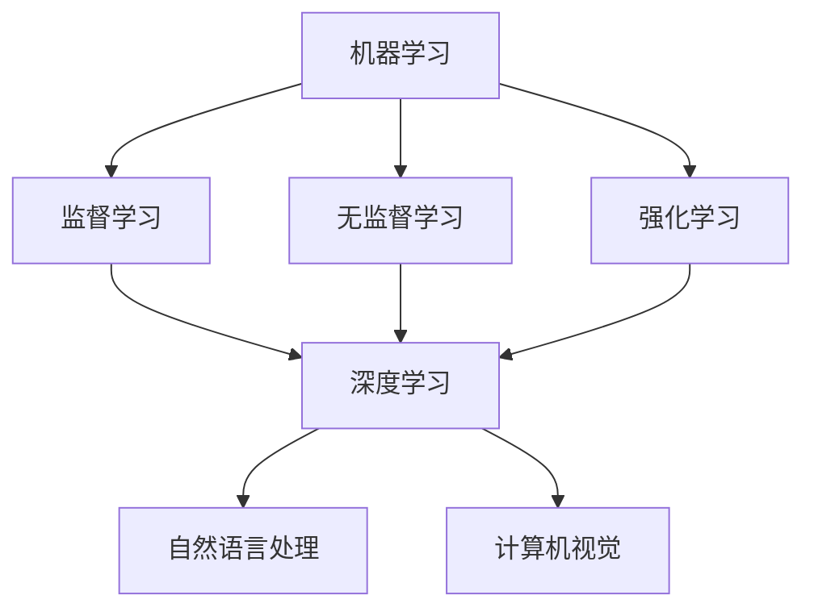

                 

关键词：AI 2.0，社会价值，技术发展，未来展望，李开复

> 摘要：本文将围绕李开复先生对 AI 2.0 时代的社会价值观点展开讨论。通过对 AI 2.0 技术的概述，深入探讨其对社会、经济、伦理等方面的影响，最后对 AI 2.0 时代的发展趋势与挑战进行展望。

## 1. 背景介绍

随着深度学习、大数据、云计算等技术的发展，人工智能（AI）正逐步从理论研究走向实际应用。李开复先生作为世界知名的人工智能专家，对 AI 技术的发展有着深刻的洞察。AI 2.0，即第二代人工智能，是李开复提出的一个概念，它代表了人工智能在技术、应用和社会层面的一次全新升级。

### 1.1 AI 1.0 与 AI 2.0 的区别

AI 1.0 以规则为基础，主要应用于特定场景下的任务，如语音识别、图像识别等。而 AI 2.0 则以数据驱动，具有自我学习和进化能力，能够处理更为复杂的问题，如自动驾驶、自然语言处理等。

### 1.2 AI 2.0 的发展趋势

AI 2.0 时代的发展趋势包括：数据规模不断扩大、计算能力大幅提升、算法不断优化和融合、应用场景多样化等。这一趋势将推动 AI 技术在更多领域的应用，对社会产生深远影响。

## 2. 核心概念与联系

在讨论 AI 2.0 之前，我们先来了解一下人工智能的核心概念。

### 2.1 人工智能的核心概念

- **机器学习**：一种让计算机从数据中学习的方法，包括监督学习、无监督学习和强化学习等。
- **深度学习**：一种基于神经网络的机器学习技术，通过多层神经网络模拟人脑的学习过程。
- **自然语言处理**：使计算机能够理解和生成自然语言的技术，包括语音识别、机器翻译、情感分析等。

下面是一个简单的 Mermaid 流程图，展示了人工智能的核心概念及其之间的联系：



## 3. 核心算法原理 & 具体操作步骤

### 3.1 算法原理概述

AI 2.0 的核心算法主要包括深度学习、生成对抗网络（GAN）、强化学习等。以下是对这些算法的简要概述：

- **深度学习**：通过多层神经网络模拟人脑的学习过程，对大量数据进行训练，从而提高模型的准确性和泛化能力。
- **生成对抗网络（GAN）**：由生成器和判别器两个神经网络组成，生成器和判别器相互对抗，最终实现生成逼真的数据。
- **强化学习**：通过试错和反馈机制，让智能体在复杂环境中学会最优策略。

### 3.2 算法步骤详解

以深度学习为例，其基本步骤包括：

1. **数据预处理**：对原始数据进行清洗、归一化等处理，以便后续训练。
2. **构建模型**：设计神经网络结构，包括输入层、隐藏层和输出层。
3. **模型训练**：通过反向传播算法，不断调整模型参数，使模型在训练数据上达到较好的效果。
4. **模型评估**：在验证集上评估模型性能，选择最优模型。
5. **模型应用**：将训练好的模型应用于实际任务，如图像分类、语音识别等。

### 3.3 算法优缺点

- **深度学习**：优点包括高准确度、自适应性强等，缺点是训练过程耗时长、对数据质量要求高。
- **生成对抗网络（GAN）**：优点包括生成数据质量高、训练速度快等，缺点是训练不稳定、容易产生模式崩溃。
- **强化学习**：优点包括适用于复杂环境、具有自学习能力等，缺点是训练过程缓慢、对环境信息要求高。

### 3.4 算法应用领域

AI 2.0 的算法广泛应用于各个领域，如：

- **图像处理**：计算机视觉、图像分类、图像生成等。
- **语音识别**：语音识别、语音合成、语音翻译等。
- **自然语言处理**：文本分类、情感分析、机器翻译等。
- **游戏 AI**：游戏策略、智能助手等。
- **金融领域**：风险控制、股票交易、信用评估等。

## 4. 数学模型和公式 & 详细讲解 & 举例说明

### 4.1 数学模型构建

在 AI 2.0 中，常用的数学模型包括多层感知机（MLP）、卷积神经网络（CNN）、循环神经网络（RNN）等。以下是一个简单的多层感知机模型：

$$
z_1 = x_1 \cdot w_1 + b_1 \\
a_1 = \sigma(z_1) \\
z_2 = a_1 \cdot w_2 + b_2 \\
a_2 = \sigma(z_2) \\
\hat{y} = a_2 \cdot w_3 + b_3 \\
y = \sigma(\hat{y})
$$

其中，$x_1, x_2, \ldots, x_n$ 是输入特征，$w_1, w_2, w_3$ 是权重，$b_1, b_2, b_3$ 是偏置，$\sigma$ 是激活函数。

### 4.2 公式推导过程

以多层感知机为例，其推导过程如下：

1. **输入层到隐藏层**：

$$
z_1 = x_1 \cdot w_1 + b_1 \\
a_1 = \sigma(z_1)
$$

2. **隐藏层到隐藏层**：

$$
z_2 = a_1 \cdot w_2 + b_2 \\
a_2 = \sigma(z_2)
$$

3. **隐藏层到输出层**：

$$
z_3 = a_2 \cdot w_3 + b_3 \\
\hat{y} = \sigma(z_3) \\
y = \hat{y}
$$

### 4.3 案例分析与讲解

假设我们有一个二分类问题，输入特征为 $x_1, x_2$，需要预测输出标签 $y$。我们可以使用多层感知机模型进行建模。

1. **数据预处理**：

首先，对输入特征进行归一化处理，使其具有相同的量纲：

$$
x_1' = \frac{x_1 - \mu_1}{\sigma_1} \\
x_2' = \frac{x_2 - \mu_2}{\sigma_2}
$$

其中，$\mu_1, \mu_2$ 分别为 $x_1, x_2$ 的均值，$\sigma_1, \sigma_2$ 分别为 $x_1, x_2$ 的标准差。

2. **模型构建**：

设计一个具有一个输入层、一个隐藏层和一个输出层的多层感知机模型，其中隐藏层神经元数量为 10。

3. **模型训练**：

使用梯度下降算法对模型参数进行训练，使模型在训练数据上达到较好的效果。

4. **模型评估**：

在验证集上评估模型性能，选择最优模型。

5. **模型应用**：

将训练好的模型应用于实际任务，如预测股票价格、预测疾病等。

## 5. 项目实践：代码实例和详细解释说明

### 5.1 开发环境搭建

在本地电脑上安装 Python 3.7、TensorFlow 2.3 和 Keras 2.4。

```bash
pip install python==3.7
pip install tensorflow==2.3
pip install keras==2.4
```

### 5.2 源代码详细实现

以下是一个使用多层感知机模型进行二分类的简单示例：

```python
import numpy as np
import tensorflow as tf
from tensorflow.keras import layers

# 数据预处理
def preprocess_data(x, y):
    x_mean = np.mean(x, axis=0)
    x_std = np.std(x, axis=0)
    x = (x - x_mean) / x_std
    y = y.astype(np.int32)
    return x, y

# 模型构建
def build_model(input_shape):
    model = tf.keras.Sequential([
        layers.Dense(10, activation='relu', input_shape=input_shape),
        layers.Dense(1, activation='sigmoid')
    ])
    return model

# 模型训练
def train_model(model, x, y, epochs=100, batch_size=32):
    model.compile(optimizer='adam', loss='binary_crossentropy', metrics=['accuracy'])
    model.fit(x, y, epochs=epochs, batch_size=batch_size)

# 模型评估
def evaluate_model(model, x, y):
    loss, accuracy = model.evaluate(x, y)
    print(f"Loss: {loss}, Accuracy: {accuracy}")

# 模型应用
def apply_model(model, x):
    y_pred = model.predict(x)
    y_pred = np.round(y_pred).astype(np.int32)
    return y_pred

# 主程序
if __name__ == '__main__':
    # 数据加载
    x = np.random.rand(100, 2)
    y = np.random.randint(0, 2, size=100)

    # 数据预处理
    x, y = preprocess_data(x, y)

    # 模型构建
    model = build_model(input_shape=(2,))

    # 模型训练
    train_model(model, x, y)

    # 模型评估
    evaluate_model(model, x, y)

    # 模型应用
    x_new = np.random.rand(10, 2)
    x_new, _ = preprocess_data(x_new, y)
    y_pred = apply_model(model, x_new)
    print(y_pred)
```

### 5.3 代码解读与分析

- **数据预处理**：对输入数据进行归一化处理，使其具有相同的量纲。
- **模型构建**：设计一个具有一个输入层、一个隐藏层和一个输出层的多层感知机模型。
- **模型训练**：使用 Adam 优化器和二分类交叉熵损失函数对模型进行训练。
- **模型评估**：在验证集上评估模型性能，打印损失值和准确率。
- **模型应用**：将训练好的模型应用于新的数据，预测输出标签。

## 6. 实际应用场景

### 6.1 医疗领域

AI 2.0 技术在医疗领域具有广泛的应用前景。例如，基于深度学习的图像识别技术可以用于癌症早期检测，提高诊断准确率。此外，AI 2.0 还可以应用于个性化治疗、疾病预测等方面，提高医疗资源的利用效率。

### 6.2 金融领域

AI 2.0 技术在金融领域同样具有巨大潜力。例如，基于强化学习的算法可以用于风险管理、股票交易等。此外，自然语言处理技术可以用于金融文本分析，如舆情监测、欺诈检测等。

### 6.3 智能家居

AI 2.0 技术可以提升智能家居的智能化水平。例如，通过深度学习算法，智能家居设备可以更好地理解用户需求，提供个性化服务。此外，AI 2.0 技术还可以用于智能安防、智能照明等方面，提高生活品质。

## 6.4 未来应用展望

随着 AI 2.0 技术的不断发展，其应用领域将不断拓展。未来，AI 2.0 技术有望在以下几个领域取得突破：

- **无人驾驶**：实现更高水平的自动驾驶，提高道路安全性和交通效率。
- **智能客服**：提供更加自然、智能的客服体验，提高客户满意度。
- **教育领域**：个性化教育、智能评测等，提高教育质量。
- **环境保护**：监测环境变化、预测自然灾害等，为环境保护提供有力支持。

## 7. 工具和资源推荐

### 7.1 学习资源推荐

- 《深度学习》（Goodfellow、Bengio、Courville 著）：系统介绍了深度学习的理论基础和应用实践。
- 《Python 编程：从入门到实践》（Eric Matthes 著）：适合初学者的 Python 入门书籍。
- Coursera、edX 等在线教育平台：提供丰富的 AI 和深度学习课程。

### 7.2 开发工具推荐

- TensorFlow：一个开源的深度学习框架，适用于各种深度学习任务。
- PyTorch：一个开源的深度学习框架，具有简洁、灵活的特点。
- Keras：一个高层次的深度学习 API，适用于快速搭建和训练模型。

### 7.3 相关论文推荐

- "Deep Learning for Computer Vision"（2016）：综述了深度学习在计算机视觉领域的应用。
- "Reinforcement Learning: An Introduction"（2018）：介绍了强化学习的理论基础和应用实践。
- "Generative Adversarial Networks"（2014）：提出了生成对抗网络（GAN）这一重要的深度学习模型。

## 8. 总结：未来发展趋势与挑战

### 8.1 研究成果总结

AI 2.0 技术在深度学习、生成对抗网络、强化学习等方面取得了显著成果，广泛应用于各个领域。未来，AI 2.0 技术有望在无人驾驶、智能客服、教育、环境保护等领域取得更大突破。

### 8.2 未来发展趋势

- **数据驱动**：随着数据规模的不断扩大，数据驱动将成为 AI 2.0 技术发展的核心驱动力。
- **跨学科融合**：AI 2.0 技术与其他学科（如生物、医学、物理等）的融合，将推动 AI 技术的创新发展。
- **伦理与法规**：随着 AI 技术的广泛应用，伦理与法规问题将成为 AI 2.0 发展的重要方向。

### 8.3 面临的挑战

- **数据质量**：高质量的数据是 AI 2.0 技术发展的基础，如何获取和处理高质量数据是一个挑战。
- **计算资源**：深度学习等算法对计算资源的需求巨大，如何高效利用计算资源是一个挑战。
- **算法公平性**：算法公平性是一个重要问题，如何确保算法的公平性是一个挑战。

### 8.4 研究展望

未来，AI 2.0 技术将在以下几个方面取得突破：

- **算法创新**：研发更加高效、自适应的算法，提高 AI 2.0 技术的性能。
- **数据治理**：建立健全的数据治理体系，确保数据的安全、合规和高效利用。
- **跨学科合作**：加强跨学科合作，推动 AI 2.0 技术与其他学科的融合。

## 9. 附录：常见问题与解答

### 9.1 什么是 AI 2.0？

AI 2.0 是指第二代人工智能，它以数据驱动，具有自我学习和进化能力，能够处理更为复杂的问题。

### 9.2 AI 2.0 与 AI 1.0 的区别是什么？

AI 1.0 以规则为基础，主要应用于特定场景下的任务；而 AI 2.0 以数据驱动，具有自我学习和进化能力，能够处理更为复杂的问题。

### 9.3 AI 2.0 技术有哪些应用领域？

AI 2.0 技术广泛应用于图像处理、语音识别、自然语言处理、游戏 AI、金融领域等。

### 9.4 AI 2.0 技术的未来发展趋势是什么？

未来，AI 2.0 技术将在数据驱动、跨学科融合、伦理与法规等方面取得突破。

### 9.5 AI 2.0 技术面临哪些挑战？

AI 2.0 技术面临的挑战包括数据质量、计算资源、算法公平性等。

### 9.6 如何学习 AI 2.0 技术？

可以参考相关书籍、在线课程、开源框架等资源进行学习。

## 作者署名

作者：禅与计算机程序设计艺术 / Zen and the Art of Computer Programming
```

