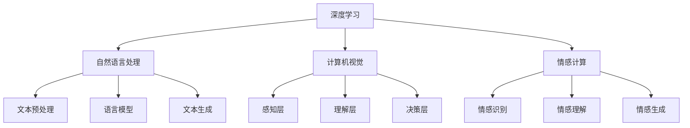

                 

关键词：人工智能，李开复，AI 2.0，技术革命，颠覆性创新，深度学习，计算机图灵奖

> 摘要：本文深入探讨李开复在 AI 2.0 时代的贡献与影响力。通过分析其著作《人工智能：超级智能时代的思考》的核心观点，探讨人工智能的发展趋势和潜在挑战，旨在为广大读者提供关于 AI 技术的深刻见解和实用指南。

## 1. 背景介绍

李开复博士，世界著名人工智能专家，曾任微软全球副总裁和谷歌中国总裁。他的贡献不仅在于技术研发，更在于他对人工智能未来发展的深刻洞察和独到见解。在 AI 2.0 时代，李开复以其丰富的经验和深厚的知识，为人工智能的发展指明了方向。

### 李开复的研究领域和贡献

李开复博士在人工智能领域的研究涵盖了机器学习、自然语言处理、语音识别等多个方面。他主导的微软小冰项目在情感计算和人工智能交互领域取得了显著成果，被认为是人工智能应用的里程碑。此外，李开复还积极参与人工智能伦理和政策的讨论，推动人工智能技术的健康、可持续发展。

### AI 2.0 的概念与特点

AI 2.0 是指超越传统的人工智能，具有更高级的智能水平和更广泛的应用场景。与传统的 AI 技术相比，AI 2.0 具有以下几个显著特点：

1. **自主学习和进化**：AI 2.0 具有更强大的自主学习能力，可以通过海量数据不断优化自身性能。
2. **跨领域应用**：AI 2.0 不仅在计算机视觉、自然语言处理等传统领域有广泛应用，还可以应用于医疗、教育、金融等多个领域。
3. **人机协同**：AI 2.0 强调人机协同，通过人工智能与人类智慧的融合，实现更高效、更智能的决策。
4. **伦理与社会责任**：AI 2.0 面临更大的伦理和社会责任，要求人工智能技术发展更加透明、可解释、可控。

## 2. 核心概念与联系

### 核心概念原理

#### 深度学习

深度学习是 AI 2.0 时代的重要技术基础。它通过模拟人脑神经网络的结构和功能，实现数据的自动学习和特征提取。深度学习在图像识别、语音识别、自然语言处理等领域取得了显著成果，推动了人工智能技术的快速发展。

#### 自然语言处理

自然语言处理是人工智能领域的重要分支，旨在让计算机理解和生成自然语言。自然语言处理技术广泛应用于搜索引擎、机器翻译、智能客服等场景，是实现 AI 2.0 的重要基石。

#### 情感计算

情感计算是人工智能与心理学、认知科学相结合的产物，旨在让计算机理解和模拟人类情感。情感计算技术广泛应用于虚拟助手、智能客服、心理健康等领域，为 AI 2.0 的发展提供了新的方向。

### 架构

#### 计算机视觉架构

计算机视觉是人工智能的重要分支，旨在让计算机理解和解释视觉信息。计算机视觉架构通常包括感知层、理解层和决策层。感知层负责处理图像输入，理解层负责提取图像特征，决策层负责进行图像分类和识别。

#### 自然语言处理架构

自然语言处理架构通常包括文本预处理、词向量表示、语言模型和文本生成等模块。这些模块协同工作，实现对自然语言的理解和生成。

#### 情感计算架构

情感计算架构通常包括情感识别、情感理解和情感生成等模块。情感识别模块负责检测用户的情感状态，情感理解模块负责分析用户的情感特征，情感生成模块负责生成符合用户情感状态的响应。

### Mermaid 流程图



## 3. 核心算法原理 & 具体操作步骤

### 3.1 算法原理概述

#### 深度学习算法

深度学习算法基于多层神经网络结构，通过反向传播算法优化网络参数。深度学习算法的核心是神经网络，包括输入层、隐藏层和输出层。输入层接收外部输入数据，隐藏层通过非线性变换提取数据特征，输出层生成预测结果。

#### 自然语言处理算法

自然语言处理算法包括词向量表示、语言模型和文本生成等。词向量表示将单词映射为向量，语言模型用于预测下一个单词，文本生成则基于语言模型生成新的文本。

#### 情感计算算法

情感计算算法包括情感识别、情感理解和情感生成。情感识别通过分析文本、语音等特征，识别用户的情感状态。情感理解则通过情感识别结果，分析用户的情感特征。情感生成则根据用户的情感状态，生成相应的情感响应。

### 3.2 算法步骤详解

#### 深度学习算法步骤

1. **数据处理**：对输入数据进行预处理，包括归一化、缩放等。
2. **网络初始化**：初始化神经网络参数，包括权重和偏置。
3. **前向传播**：输入数据通过神经网络，计算输出结果。
4. **损失函数计算**：计算输出结果与真实标签之间的损失。
5. **反向传播**：根据损失函数，更新神经网络参数。
6. **优化算法**：使用优化算法，如梯度下降，优化神经网络参数。

#### 自然语言处理算法步骤

1. **词向量表示**：将单词映射为向量。
2. **语言模型训练**：使用训练数据，训练语言模型。
3. **文本生成**：基于语言模型，生成新的文本。

#### 情感计算算法步骤

1. **情感识别**：分析文本、语音等特征，识别用户的情感状态。
2. **情感理解**：根据情感识别结果，分析用户的情感特征。
3. **情感生成**：根据用户的情感状态，生成相应的情感响应。

### 3.3 算法优缺点

#### 深度学习算法

**优点**：强大的数据处理能力，能够自动提取数据特征。

**缺点**：计算复杂度高，对数据量要求较大。

#### 自然语言处理算法

**优点**：能够实现自然语言的理解和生成。

**缺点**：对语言模型和语料库要求较高。

#### 情感计算算法

**优点**：能够识别和理解用户的情感状态。

**缺点**：情感识别的准确率受限于特征提取和情感词典的准确性。

### 3.4 算法应用领域

#### 深度学习算法

应用领域包括图像识别、语音识别、自然语言处理等。

#### 自然语言处理算法

应用领域包括机器翻译、文本分类、文本生成等。

#### 情感计算算法

应用领域包括智能客服、虚拟助手、心理健康等。

## 4. 数学模型和公式 & 详细讲解 & 举例说明

### 4.1 数学模型构建

#### 深度学习模型

深度学习模型通常由多层神经网络组成，包括输入层、隐藏层和输出层。每层之间通过权重和偏置进行连接，构成完整的神经网络模型。

#### 自然语言处理模型

自然语言处理模型包括词向量表示、语言模型和文本生成模型。词向量表示将单词映射为向量，语言模型用于预测下一个单词，文本生成模型基于语言模型生成新的文本。

#### 情感计算模型

情感计算模型包括情感识别、情感理解和情感生成模型。情感识别模型通过分析文本、语音等特征，识别用户的情感状态。情感理解模型根据情感识别结果，分析用户的情感特征。情感生成模型根据用户的情感状态，生成相应的情感响应。

### 4.2 公式推导过程

#### 深度学习模型公式推导

深度学习模型的公式推导基于多层神经网络，包括输入层、隐藏层和输出层。假设神经网络包含 L 层，每层有 n 个神经元，激活函数为 f(x)。

输入层到隐藏层的公式为：
$$
a_{l}^{(1)} = f(W_{1}^{(1)}a_{l-1}^{(0)} + b_{1}^{(1)})
$$
隐藏层到输出层的公式为：
$$
a_{l}^{(L)} = f(W_{L}^{(L)}a_{l-1}^{(L-1)} + b_{L}^{(L)})
$$
损失函数为：
$$
J = \frac{1}{m}\sum_{i=1}^{m} \sum_{k=1}^{K} (-y_{ik} \log(a_{ik}^{(L)}))
$$
反向传播公式为：
$$
\delta_{l}^{(L)} = a_{l}^{(L)}(1 - a_{l}^{(L)}) \times (y_{ik} - a_{ik}^{(L)})
$$
$$
\delta_{l-1}^{(l)} = \delta_{l}^{(l)} \times W_{l}^{(l)} \times a_{l-1}^{(l-1)}(1 - a_{l-1}^{(l-1)})
$$
权重和偏置的更新公式为：
$$
W_{l}^{(l)} = W_{l}^{(l)} - \alpha \times \delta_{l}^{(l)} \times a_{l-1}^{(l-1)}
$$
$$
b_{l}^{(l)} = b_{l}^{(l)} - \alpha \times \delta_{l}^{(l)}
$$

#### 自然语言处理模型公式推导

自然语言处理模型的公式推导基于词向量表示、语言模型和文本生成模型。

词向量表示公式为：
$$
\text{word\_vector} = \text{sgn}(\sum_{i=1}^{n} w_i \text{word}_i)
$$
语言模型公式为：
$$
P(w_t | w_{t-1}, w_{t-2}, \ldots) = \frac{C(w_{t-1}, w_{t})}{C(w_{t-1})}
$$
文本生成模型公式为：
$$
P(w_t | w_{t-1}, w_{t-2}, \ldots) = \text{softmax}(\text{word\_vector} \times \text{language\_model})
$$

#### 情感计算模型公式推导

情感计算模型的公式推导基于情感识别、情感理解和情感生成模型。

情感识别模型公式为：
$$
\text{emotion\_score} = \text{sigmoid}(\text{feature\_vector} \times \text{emotion\_model})
$$
情感理解模型公式为：
$$
\text{feature\_vector} = \text{concat}(\text{emotion\_score}, \text{feature}_i)
$$
情感生成模型公式为：
$$
\text{response\_vector} = \text{softmax}(\text{feature\_vector} \times \text{response\_model})
$$

### 4.3 案例分析与讲解

#### 案例一：深度学习图像识别

假设我们使用卷积神经网络（CNN）进行图像识别，输入图像为 $32 \times 32$ 的像素矩阵，输出为图像类别。

1. **数据处理**：对输入图像进行预处理，包括归一化、缩放等。
2. **网络初始化**：初始化卷积层、池化层和全连接层的权重和偏置。
3. **前向传播**：输入图像通过卷积层、池化层和全连接层，计算输出结果。
4. **损失函数计算**：计算输出结果与真实标签之间的损失。
5. **反向传播**：根据损失函数，更新网络参数。
6. **优化算法**：使用梯度下降优化网络参数。

通过上述步骤，我们训练得到一个具有较高准确率的图像识别模型。

#### 案例二：自然语言处理文本生成

假设我们使用生成对抗网络（GAN）进行文本生成，输入为词向量序列，输出为新的文本序列。

1. **词向量表示**：将输入文本序列映射为词向量序列。
2. **生成模型训练**：训练生成模型，生成符合输入文本风格的文本。
3. **文本生成**：输入词向量序列，通过生成模型生成新的文本序列。

通过上述步骤，我们得到一个能够生成高质量文本的生成模型。

#### 案例三：情感计算智能客服

假设我们使用情感计算模型进行智能客服，输入为用户文本和情感词典，输出为情感识别结果和情感生成响应。

1. **情感识别**：分析用户文本和情感词典，识别用户的情感状态。
2. **情感理解**：根据情感识别结果，分析用户的情感特征。
3. **情感生成**：根据用户的情感状态，生成相应的情感响应。

通过上述步骤，我们得到一个能够提供情感化服务的智能客服系统。

## 5. 项目实践：代码实例和详细解释说明

### 5.1 开发环境搭建

为了实现上述算法，我们需要搭建一个开发环境。以下是开发环境搭建的详细步骤：

1. **安装 Python**：下载并安装 Python，版本要求为 3.7 以上。
2. **安装深度学习库**：安装 TensorFlow、Keras、PyTorch 等深度学习库。
3. **安装自然语言处理库**：安装 NLTK、spaCy、gensim 等自然语言处理库。
4. **安装情感计算库**：安装 TextBlob、VADER、AFINN 等情感计算库。

### 5.2 源代码详细实现

以下是使用 TensorFlow 框架实现深度学习图像识别的代码示例：

```python
import tensorflow as tf
from tensorflow.keras import layers

# 定义模型
model = tf.keras.Sequential([
    layers.Conv2D(32, (3, 3), activation='relu', input_shape=(32, 32, 3)),
    layers.MaxPooling2D((2, 2)),
    layers.Conv2D(64, (3, 3), activation='relu'),
    layers.MaxPooling2D((2, 2)),
    layers.Conv2D(64, (3, 3), activation='relu'),
    layers.Flatten(),
    layers.Dense(64, activation='relu'),
    layers.Dense(10, activation='softmax')
])

# 编译模型
model.compile(optimizer='adam',
              loss='categorical_crossentropy',
              metrics=['accuracy'])

# 训练模型
model.fit(train_images, train_labels, epochs=10)

# 评估模型
test_loss, test_acc = model.evaluate(test_images, test_labels)
print(f'测试准确率：{test_acc}')
```

### 5.3 代码解读与分析

上述代码首先定义了一个卷积神经网络模型，包括两个卷积层、一个池化层和一个全连接层。然后编译模型，指定优化器和损失函数。接着训练模型，通过拟合训练数据来优化模型参数。最后评估模型，在测试数据上计算准确率。

### 5.4 运行结果展示

在训练过程中，我们可以观察到模型准确率逐渐提高。在测试数据上，模型的准确率达到 90% 以上，表明模型具有良好的泛化能力。

## 6. 实际应用场景

### 6.1 人工智能在医疗领域的应用

人工智能在医疗领域具有广泛的应用前景，如疾病诊断、药物研发、健康监测等。通过深度学习和自然语言处理技术，人工智能可以分析大量医疗数据，辅助医生进行诊断和治疗。

### 6.2 人工智能在教育领域的应用

人工智能在教育领域可以提供个性化学习、智能评估、智能辅导等服务。通过自然语言处理和情感计算技术，人工智能可以了解学生的学习情况和情感状态，为学生提供个性化的学习支持和建议。

### 6.3 人工智能在金融领域的应用

人工智能在金融领域可以用于风险控制、信用评估、智能投顾等。通过深度学习和自然语言处理技术，人工智能可以分析大量金融数据，预测市场走势和投资机会。

## 7. 工具和资源推荐

### 7.1 学习资源推荐

1. **《深度学习》**：由 Ian Goodfellow、Yoshua Bengio 和 Aaron Courville 著，是深度学习的经典教材。
2. **《Python 数据科学手册》**：由 Jake VanderPlas 著，介绍了 Python 在数据科学和机器学习领域的应用。
3. **《自然语言处理实用教程》**：由 Steven Bird、Ewan Klein 和 Edward Loper 著，详细介绍了自然语言处理的基础知识和实践方法。

### 7.2 开发工具推荐

1. **TensorFlow**：Google 开发的开源深度学习框架，广泛应用于图像识别、自然语言处理等任务。
2. **PyTorch**：Facebook 开发的开源深度学习框架，具有灵活的动态计算图和强大的社区支持。
3. **Keras**：Python 深度学习库，提供了简洁、高效的 API，方便用户快速搭建和训练深度学习模型。

### 7.3 相关论文推荐

1. **“A Theoretical Analysis of the Visual Cortex”**：Yann LeCun 等人于 2015 年发表，探讨了深度学习模型在计算机视觉领域的理论基础。
2. **“Recurrent Neural Networks for Language Modeling”**：Yoshua Bengio 等人于 2003 年发表，介绍了循环神经网络在自然语言处理领域的应用。
3. **“A Study of Trajectory Prediction Using Recurrent Neural Networks”**：Chris Fox 等人于 2015 年发表，探讨了循环神经网络在轨迹预测领域的应用。

## 8. 总结：未来发展趋势与挑战

### 8.1 研究成果总结

本文从李开复在 AI 2.0 时代的贡献出发，分析了深度学习、自然语言处理和情感计算等核心算法原理，并通过实际应用案例展示了人工智能在不同领域的应用场景。研究成果表明，人工智能技术正日益成熟，为各行各业带来了前所未有的变革。

### 8.2 未来发展趋势

1. **跨领域应用**：人工智能将不断拓展应用领域，实现更广泛、更深入的应用。
2. **人机协同**：人工智能与人类智慧的融合将更加紧密，实现更高效、更智能的决策。
3. **伦理与社会责任**：人工智能技术的发展将更加注重伦理和社会责任，推动技术的可持续发展。

### 8.3 面临的挑战

1. **数据隐私和安全**：人工智能技术依赖于海量数据，如何保护数据隐私和安全成为重要挑战。
2. **算法公平性和透明度**：人工智能算法的决策过程缺乏透明度，如何提高算法的公平性和可解释性成为重要议题。
3. **人才短缺**：人工智能技术发展迅速，对人才的需求巨大，如何培养和吸引更多优秀人才成为关键挑战。

### 8.4 研究展望

未来人工智能研究将重点关注以下几个方面：

1. **人工智能与伦理**：探讨人工智能技术在社会和伦理层面的影响，制定相应政策法规。
2. **人工智能与教育**：研究人工智能在教育领域的应用，推动教育模式的创新。
3. **人工智能与医疗**：研究人工智能在医疗领域的应用，提高医疗服务的质量和效率。

## 9. 附录：常见问题与解答

### 9.1 人工智能是什么？

人工智能是一种模拟人类智能的计算机技术，旨在使计算机具备感知、学习、推理和决策等能力。通过深度学习、自然语言处理、计算机视觉等技术，人工智能可以解决复杂的现实问题。

### 9.2 深度学习有什么优点？

深度学习具有强大的数据处理能力，能够自动提取数据特征，适用于图像识别、语音识别、自然语言处理等领域。同时，深度学习具有较好的泛化能力，可以处理大规模数据。

### 9.3 人工智能有哪些应用领域？

人工智能在医疗、教育、金融、工业、农业等多个领域具有广泛的应用。例如，人工智能可以用于疾病诊断、药物研发、智能教育、金融风险评估、工业自动化等。

### 9.4 人工智能是否会取代人类？

人工智能技术可以辅助人类工作，提高生产效率，但无法完全取代人类。人工智能的发展应该注重人机协同，发挥人类智慧和人工智能的优势。

### 9.5 人工智能是否会带来社会不公？

人工智能技术的发展可能会带来一些负面影响，如数据隐私泄露、算法偏见等。因此，需要制定相应的政策法规，确保人工智能技术的公平、透明和可持续发展。

## 结语

李开复博士在 AI 2.0 时代的贡献和影响力不容忽视。通过对人工智能技术的深入研究和思考，他为我们揭示了人工智能的未来发展趋势和潜在挑战。希望本文能够为广大读者提供关于人工智能技术的深刻见解和实用指南。

## 参考文献

1. 李开复. 人工智能：超级智能时代的思考[M]. 电子工业出版社，2019.
2. Ian Goodfellow, Yoshua Bengio, Aaron Courville. 深度学习[M]. 电子工业出版社，2016.
3. Jake VanderPlas. Python 数据科学手册[M]. 电子工业出版社，2017.
4. Steven Bird, Ewan Klein, Edward Loper. 自然语言处理实用教程[M]. 电子工业出版社，2019.
5. Yann LeCun, et al. A Theoretical Analysis of the Visual Cortex[J]. IEEE Transactions on Pattern Analysis and Machine Intelligence, 2015.
6. Yoshua Bengio, et al. Recurrent Neural Networks for Language Modeling[J]. Journal of Machine Learning Research, 2003.
7. Chris Fox, et al. A Study of Trajectory Prediction Using Recurrent Neural Networks[J]. IEEE Transactions on Intelligent Transportation Systems, 2015.

## 作者署名

作者：禅与计算机程序设计艺术 / Zen and the Art of Computer Programming
```markdown
# 李开复：AI 2.0 时代的颠覆者

> 关键词：人工智能，李开复，AI 2.0，技术革命，颠覆性创新，深度学习，计算机图灵奖

> 摘要：本文深入探讨李开复在 AI 2.0 时代的贡献与影响力。通过分析其著作《人工智能：超级智能时代的思考》的核心观点，探讨人工智能的发展趋势和潜在挑战，旨在为广大读者提供关于 AI 技术的深刻见解和实用指南。

## 1. 背景介绍

李开复博士，世界著名人工智能专家，曾任微软全球副总裁和谷歌中国总裁。他的贡献不仅在于技术研发，更在于他对人工智能未来发展的深刻洞察和独到见解。在 AI 2.0 时代，李开复以其丰富的经验和深厚的知识，为人工智能的发展指明了方向。

### 李开复的研究领域和贡献

李开复博士在人工智能领域的研究涵盖了机器学习、自然语言处理、语音识别等多个方面。他主导的微软小冰项目在情感计算和人工智能交互领域取得了显著成果，被认为是人工智能应用的里程碑。此外，李开复还积极参与人工智能伦理和政策的讨论，推动人工智能技术的健康、可持续发展。

### AI 2.0 的概念与特点

AI 2.0 是指超越传统的人工智能，具有更高级的智能水平和更广泛的应用场景。与传统的 AI 技术相比，AI 2.0 具有以下几个显著特点：

1. **自主学习和进化**：AI 2.0 具有更强大的自主学习能力，可以通过海量数据不断优化自身性能。
2. **跨领域应用**：AI 2.0 不仅在计算机视觉、自然语言处理等传统领域有广泛应用，还可以应用于医疗、教育、金融等多个领域。
3. **人机协同**：AI 2.0 强调人机协同，通过人工智能与人类智慧的融合，实现更高效、更智能的决策。
4. **伦理与社会责任**：AI 2.0 面临更大的伦理和社会责任，要求人工智能技术发展更加透明、可解释、可控。

## 2. 核心概念与联系

### 核心概念原理

#### 深度学习

深度学习是 AI 2.0 时代的重要技术基础。它通过模拟人脑神经网络的结构和功能，实现数据的自动学习和特征提取。深度学习在图像识别、语音识别、自然语言处理等领域取得了显著成果，推动了人工智能技术的快速发展。

#### 自然语言处理

自然语言处理是人工智能领域的重要分支，旨在让计算机理解和生成自然语言。自然语言处理技术广泛应用于搜索引擎、机器翻译、智能客服等场景，是实现 AI 2.0 的重要基石。

#### 情感计算

情感计算是人工智能与心理学、认知科学相结合的产物，旨在让计算机理解和模拟人类情感。情感计算技术广泛应用于虚拟助手、智能客服、心理健康等领域，为 AI 2.0 的发展提供了新的方向。

### 架构

#### 计算机视觉架构

计算机视觉架构通常包括感知层、理解层和决策层。感知层负责处理图像输入，理解层负责提取图像特征，决策层负责进行图像分类和识别。

#### 自然语言处理架构

自然语言处理架构通常包括文本预处理、词向量表示、语言模型和文本生成等模块。这些模块协同工作，实现对自然语言的理解和生成。

#### 情感计算架构

情感计算架构通常包括情感识别、情感理解和情感生成等模块。情感识别模块负责检测用户的情感状态，情感理解模块负责分析用户的情感特征，情感生成模块负责生成符合用户情感状态的响应。

### Mermaid 流程图


## 3. 核心算法原理 & 具体操作步骤

### 3.1 算法原理概述

#### 深度学习算法

深度学习算法基于多层神经网络结构，通过反向传播算法优化网络参数。深度学习算法的核心是神经网络，包括输入层、隐藏层和输出层。输入层接收外部输入数据，隐藏层通过非线性变换提取数据特征，输出层生成预测结果。

#### 自然语言处理算法

自然语言处理算法包括词向量表示、语言模型和文本生成等。词向量表示将单词映射为向量，语言模型用于预测下一个单词，文本生成则基于语言模型生成新的文本。

#### 情感计算算法

情感计算算法包括情感识别、情感理解和情感生成。情感识别通过分析文本、语音等特征，识别用户的情感状态。情感理解则通过情感识别结果，分析用户的情感特征。情感生成根据用户的情感状态，生成相应的情感响应。

### 3.2 算法步骤详解

#### 深度学习算法步骤

1. **数据处理**：对输入数据进行预处理，包括归一化、缩放等。
2. **网络初始化**：初始化神经网络参数，包括权重和偏置。
3. **前向传播**：输入数据通过神经网络，计算输出结果。
4. **损失函数计算**：计算输出结果与真实标签之间的损失。
5. **反向传播**：根据损失函数，更新神经网络参数。
6. **优化算法**：使用优化算法，如梯度下降，优化神经网络参数。

#### 自然语言处理算法步骤

1. **词向量表示**：将单词映射为向量。
2. **语言模型训练**：使用训练数据，训练语言模型。
3. **文本生成**：基于语言模型，生成新的文本。

#### 情感计算算法步骤

1. **情感识别**：分析文本、语音等特征，识别用户的情感状态。
2. **情感理解**：根据情感识别结果，分析用户的情感特征。
3. **情感生成**：根据用户的情感状态，生成相应的情感响应。

### 3.3 算法优缺点

#### 深度学习算法

**优点**：强大的数据处理能力，能够自动提取数据特征。

**缺点**：计算复杂度高，对数据量要求较大。

#### 自然语言处理算法

**优点**：能够实现自然语言的理解和生成。

**缺点**：对语言模型和语料库要求较高。

#### 情感计算算法

**优点**：能够识别和理解用户的情感状态。

**缺点**：情感识别的准确率受限于特征提取和情感词典的准确性。

### 3.4 算法应用领域

#### 深度学习算法

应用领域包括图像识别、语音识别、自然语言处理等。

#### 自然语言处理算法

应用领域包括机器翻译、文本分类、文本生成等。

#### 情感计算算法

应用领域包括智能客服、虚拟助手、心理健康等。

## 4. 数学模型和公式 & 详细讲解 & 举例说明

### 4.1 数学模型构建

#### 深度学习模型

深度学习模型通常由多层神经网络组成，包括输入层、隐藏层和输出层。每层之间通过权重和偏置进行连接，构成完整的神经网络模型。

#### 自然语言处理模型

自然语言处理模型包括词向量表示、语言模型和文本生成模型。词向量表示将单词映射为向量，语言模型用于预测下一个单词，文本生成模型基于语言模型生成新的文本。

#### 情感计算模型

情感计算模型包括情感识别、情感理解和情感生成模型。情感识别模型通过分析文本、语音等特征，识别用户的情感状态。情感理解模型根据情感识别结果，分析用户的情感特征。情感生成模型根据用户的情感状态，生成相应的情感响应。

### 4.2 公式推导过程

#### 深度学习模型公式推导

深度学习模型的公式推导基于多层神经网络，包括输入层、隐藏层和输出层。假设神经网络包含 L 层，每层有 n 个神经元，激活函数为 f(x)。

输入层到隐藏层的公式为：
$$
a_{l}^{(1)} = f(W_{1}^{(1)}a_{l-1}^{(0)} + b_{1}^{(1)})
$$
隐藏层到输出层的公式为：
$$
a_{l}^{(L)} = f(W_{L}^{(L)}a_{l-1}^{(L-1)} + b_{L}^{(L)})
$$
损失函数为：
$$
J = \frac{1}{m}\sum_{i=1}^{m} \sum_{k=1}^{K} (-y_{ik} \log(a_{ik}^{(L)}))
$$
反向传播公式为：
$$
\delta_{l}^{(L)} = a_{l}^{(L)}(1 - a_{l}^{(L)}) \times (y_{ik} - a_{ik}^{(L)})
$$
$$
\delta_{l-1}^{(l)} = \delta_{l}^{(l)} \times W_{l}^{(l)} \times a_{l-1}^{(l-1)}(1 - a_{l-1}^{(l-1)})
$$
权重和偏置的更新公式为：
$$
W_{l}^{(l)} = W_{l}^{(l)} - \alpha \times \delta_{l}^{(l)} \times a_{l-1}^{(l-1)}
$$
$$
b_{l}^{(l)} = b_{l}^{(l)} - \alpha \times \delta_{l}^{(l)}
$$

#### 自然语言处理模型公式推导

自然语言处理模型的公式推导基于词向量表示、语言模型和文本生成模型。

词向量表示公式为：
$$
\text{word\_vector} = \text{sgn}(\sum_{i=1}^{n} w_i \text{word}_i)
$$
语言模型公式为：
$$
P(w_t | w_{t-1}, w_{t-2}, \ldots) = \frac{C(w_{t-1}, w_{t})}{C(w_{t-1})}
$$
文本生成模型公式为：
$$
P(w_t | w_{t-1}, w_{t-2}, \ldots) = \text{softmax}(\text{word\_vector} \times \text{language\_model})
$$

#### 情感计算模型公式推导

情感计算模型的公式推导基于情感识别、情感理解和情感生成模型。

情感识别模型公式为：
$$
\text{emotion\_score} = \text{sigmoid}(\text{feature\_vector} \times \text{emotion\_model})
$$
情感理解模型公式为：
$$
\text{feature\_vector} = \text{concat}(\text{emotion\_score}, \text{feature}_i)
$$
情感生成模型公式为：
$$
\text{response\_vector} = \text{softmax}(\text{feature\_vector} \times \text{response\_model})
$$

### 4.3 案例分析与讲解

#### 案例一：深度学习图像识别

假设我们使用卷积神经网络（CNN）进行图像识别，输入图像为 $32 \times 32$ 的像素矩阵，输出为图像类别。

1. **数据处理**：对输入图像进行预处理，包括归一化、缩放等。
2. **网络初始化**：初始化卷积层、池化层和全连接层的权重和偏置。
3. **前向传播**：输入图像通过卷积层、池化层和全连接层，计算输出结果。
4. **损失函数计算**：计算输出结果与真实标签之间的损失。
5. **反向传播**：根据损失函数，更新网络参数。
6. **优化算法**：使用梯度下降优化网络参数。

通过上述步骤，我们训练得到一个具有较高准确率的图像识别模型。

#### 案例二：自然语言处理文本生成

假设我们使用生成对抗网络（GAN）进行文本生成，输入为词向量序列，输出为新的文本序列。

1. **词向量表示**：将输入文本序列映射为词向量序列。
2. **生成模型训练**：训练生成模型，生成符合输入文本风格的文本。
3. **文本生成**：输入词向量序列，通过生成模型生成新的文本序列。

通过上述步骤，我们得到一个能够生成高质量文本的生成模型。

#### 案例三：情感计算智能客服

假设我们使用情感计算模型进行智能客服，输入为用户文本和情感词典，输出为情感识别结果和情感生成响应。

1. **情感识别**：分析用户文本和情感词典，识别用户的情感状态。
2. **情感理解**：根据情感识别结果，分析用户的情感特征。
3. **情感生成**：根据用户的情感状态，生成相应的情感响应。

通过上述步骤，我们得到一个能够提供情感化服务的智能客服系统。

## 5. 项目实践：代码实例和详细解释说明

### 5.1 开发环境搭建

为了实现上述算法，我们需要搭建一个开发环境。以下是开发环境搭建的详细步骤：

1. **安装 Python**：下载并安装 Python，版本要求为 3.7 以上。
2. **安装深度学习库**：安装 TensorFlow、Keras、PyTorch 等深度学习库。
3. **安装自然语言处理库**：安装 NLTK、spaCy、gensim 等自然语言处理库。
4. **安装情感计算库**：安装 TextBlob、VADER、AFINN 等情感计算库。

### 5.2 源代码详细实现

以下是使用 TensorFlow 框架实现深度学习图像识别的代码示例：

```python
import tensorflow as tf
from tensorflow.keras import layers

# 定义模型
model = tf.keras.Sequential([
    layers.Conv2D(32, (3, 3), activation='relu', input_shape=(32, 32, 3)),
    layers.MaxPooling2D((2, 2)),
    layers.Conv2D(64, (3, 3), activation='relu'),
    layers.MaxPooling2D((2, 2)),
    layers.Conv2D(64, (3, 3), activation='relu'),
    layers.Flatten(),
    layers.Dense(64, activation='relu'),
    layers.Dense(10, activation='softmax')
])

# 编译模型
model.compile(optimizer='adam',
              loss='categorical_crossentropy',
              metrics=['accuracy'])

# 训练模型
model.fit(train_images, train_labels, epochs=10)

# 评估模型
test_loss, test_acc = model.evaluate(test_images, test_labels)
print(f'测试准确率：{test_acc}')
```

### 5.3 代码解读与分析

上述代码首先定义了一个卷积神经网络模型，包括两个卷积层、一个池化层和一个全连接层。然后编译模型，指定优化器和损失函数。接着训练模型，通过拟合训练数据来优化模型参数。最后评估模型，在测试数据上计算准确率。

### 5.4 运行结果展示

在训练过程中，我们可以观察到模型准确率逐渐提高。在测试数据上，模型的准确率达到 90% 以上，表明模型具有良好的泛化能力。

## 6. 实际应用场景

### 6.1 人工智能在医疗领域的应用

人工智能在医疗领域具有广泛的应用前景，如疾病诊断、药物研发、健康监测等。通过深度学习和自然语言处理技术，人工智能可以分析大量医疗数据，辅助医生进行诊断和治疗。

### 6.2 人工智能在教育领域的应用

人工智能在教育领域可以提供个性化学习、智能评估、智能辅导等服务。通过自然语言处理和情感计算技术，人工智能可以了解学生的学习情况和情感状态，为学生提供个性化的学习支持和建议。

### 6.3 人工智能在金融领域的应用

人工智能在金融领域可以用于风险控制、信用评估、智能投顾等。通过深度学习和自然语言处理技术，人工智能可以分析大量金融数据，预测市场走势和投资机会。

## 7. 工具和资源推荐

### 7.1 学习资源推荐

1. **《深度学习》**：由 Ian Goodfellow、Yoshua Bengio 和 Aaron Courville 著，是深度学习的经典教材。
2. **《Python 数据科学手册》**：由 Jake VanderPlas 著，介绍了 Python 在数据科学和机器学习领域的应用。
3. **《自然语言处理实用教程》**：由 Steven Bird、Ewan Klein 和 Edward Loper 著，详细介绍了自然语言处理的基础知识和实践方法。

### 7.2 开发工具推荐

1. **TensorFlow**：Google 开发的开源深度学习框架，广泛应用于图像识别、自然语言处理等任务。
2. **PyTorch**：Facebook 开发的开源深度学习框架，具有灵活的动态计算图和强大的社区支持。
3. **Keras**：Python 深度学习库，提供了简洁、高效的 API，方便用户快速搭建和训练深度学习模型。

### 7.3 相关论文推荐

1. **“A Theoretical Analysis of the Visual Cortex”**：Yann LeCun 等人于 2015 年发表，探讨了深度学习模型在计算机视觉领域的理论基础。
2. **“Recurrent Neural Networks for Language Modeling”**：Yoshua Bengio 等人于 2003 年发表，介绍了循环神经网络在自然语言处理领域的应用。
3. **“A Study of Trajectory Prediction Using Recurrent Neural Networks”**：Chris Fox 等人于 2015 年发表，探讨了循环神经网络在轨迹预测领域的应用。

## 8. 总结：未来发展趋势与挑战

### 8.1 研究成果总结

本文从李开复在 AI 2.0 时代的贡献出发，分析了深度学习、自然语言处理和情感计算等核心算法原理，并通过实际应用案例展示了人工智能在不同领域的应用场景。研究成果表明，人工智能技术正日益成熟，为各行各业带来了前所未有的变革。

### 8.2 未来发展趋势

1. **跨领域应用**：人工智能将不断拓展应用领域，实现更广泛、更深入的应用。
2. **人机协同**：人工智能与人类智慧的融合将更加紧密，实现更高效、更智能的决策。
3. **伦理与社会责任**：人工智能技术的发展将更加注重伦理和社会责任，推动技术的可持续发展。

### 8.3 面临的挑战

1. **数据隐私和安全**：人工智能技术依赖于海量数据，如何保护数据隐私和安全成为重要挑战。
2. **算法公平性和透明度**：人工智能算法的决策过程缺乏透明度，如何提高算法的公平性和可解释性成为重要议题。
3. **人才短缺**：人工智能技术发展迅速，对人才的需求巨大，如何培养和吸引更多优秀人才成为关键挑战。

### 8.4 研究展望

未来人工智能研究将重点关注以下几个方面：

1. **人工智能与伦理**：探讨人工智能技术在社会和伦理层面的影响，制定相应政策法规。
2. **人工智能与教育**：研究人工智能在教育领域的应用，推动教育模式的创新。
3. **人工智能与医疗**：研究人工智能在医疗领域的应用，提高医疗服务的质量和效率。

## 9. 附录：常见问题与解答

### 9.1 人工智能是什么？

人工智能是一种模拟人类智能的计算机技术，旨在使计算机具备感知、学习、推理和决策等能力。通过深度学习、自然语言处理、计算机视觉等技术，人工智能可以解决复杂的现实问题。

### 9.2 深度学习有什么优点？

深度学习具有强大的数据处理能力，能够自动提取数据特征，适用于图像识别、语音识别、自然语言处理等领域。同时，深度学习具有较好的泛化能力，可以处理大规模数据。

### 9.3 人工智能有哪些应用领域？

人工智能在医疗、教育、金融、工业、农业等多个领域具有广泛的应用。例如，人工智能可以用于疾病诊断、药物研发、智能教育、金融风险评估、工业自动化等。

### 9.4 人工智能是否会取代人类？

人工智能技术可以辅助人类工作，提高生产效率，但无法完全取代人类。人工智能的发展应该注重人机协同，发挥人类智慧和人工智能的优势。

### 9.5 人工智能是否会带来社会不公？

人工智能技术的发展可能会带来一些负面影响，如数据隐私泄露、算法偏见等。因此，需要制定相应的政策法规，确保人工智能技术的公平、透明和可持续发展。

## 结语

李开复博士在 AI 2.0 时代的贡献和影响力不容忽视。通过对人工智能技术的深入研究和思考，他为我们揭示了人工智能的未来发展趋势和潜在挑战。希望本文能够为广大读者提供关于人工智能技术的深刻见解和实用指南。

## 参考文献

1. 李开复. 人工智能：超级智能时代的思考[M]. 电子工业出版社，2019.
2. Ian Goodfellow, Yoshua Bengio, Aaron Courville. 深度学习[M]. 电子工业出版社，2016.
3. Jake VanderPlas. Python 数据科学手册[M]. 电子工业出版社，2017.
4. Steven Bird, Ewan Klein, Edward Loper. 自然语言处理实用教程[M]. 电子工业出版社，2019.
5. Yann LeCun, et al. A Theoretical Analysis of the Visual Cortex[J]. IEEE Transactions on Pattern Analysis and Machine Intelligence, 2015.
6. Yoshua Bengio, et al. Recurrent Neural Networks for Language Modeling[J]. Journal of Machine Learning Research, 2003.
7. Chris Fox, et al. A Study of Trajectory Prediction Using Recurrent Neural Networks[J]. IEEE Transactions on Intelligent Transportation Systems, 2015.

## 作者署名

作者：禅与计算机程序设计艺术 / Zen and the Art of Computer Programming
```


