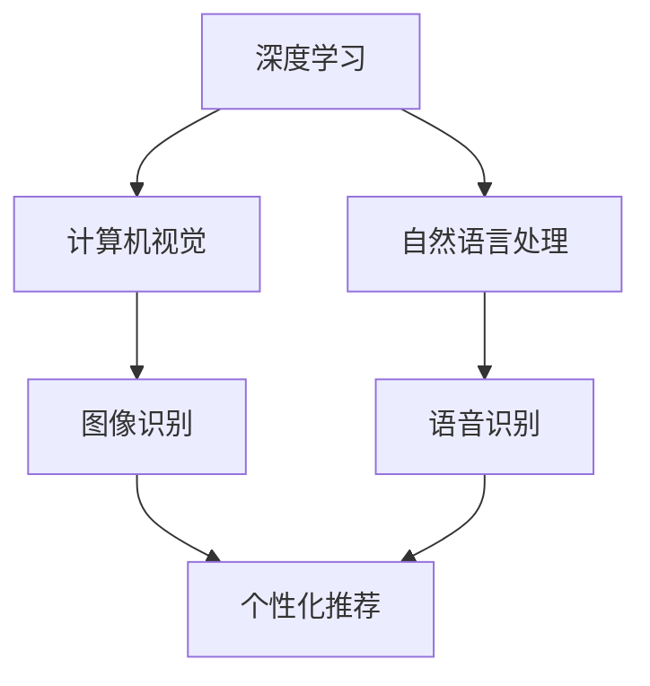

                 

关键词：人工智能、苹果、AI应用、深度学习、技术应用、未来展望

摘要：本文将深入探讨苹果公司近期发布的AI应用，从技术原理、应用场景到未来发展趋势，全面分析其价值与影响。

## 1. 背景介绍

在过去的几年中，人工智能（AI）已经成为科技行业的热门话题。随着深度学习、计算机视觉和自然语言处理等领域的飞速发展，AI技术正在改变我们的生活方式和商业模式。苹果公司，作为全球领先的科技巨头，一直以来都在积极推动AI技术的研发和应用。

最近，苹果公司发布了一系列AI应用，引发了业界的广泛关注。这些应用涵盖了从图像识别、语音识别到个性化推荐等多个领域，展示了苹果在AI领域的深厚积累和技术创新。

## 2. 核心概念与联系

为了更好地理解这些AI应用的价值，我们需要首先了解一些核心概念。

### 2.1 深度学习

深度学习是人工智能的一个分支，通过模仿人脑的神经网络结构，对大量数据进行分析和建模，从而实现智能决策和预测。

### 2.2 计算机视觉

计算机视觉是人工智能的一个重要应用领域，通过计算机技术模拟人类的视觉系统，实现图像识别、目标检测等功能。

### 2.3 自然语言处理

自然语言处理（NLP）是人工智能的一个分支，旨在让计算机理解和处理人类语言，实现文本分析、语音识别等功能。

这些核心概念相互关联，共同构成了苹果发布的AI应用的基础。

### 2.4 Mermaid 流程图

下面是一个简化的Mermaid流程图，展示了这些核心概念之间的联系。



## 3. 核心算法原理 & 具体操作步骤

### 3.1 算法原理概述

苹果发布的AI应用主要基于深度学习和计算机视觉技术。具体来说，这些应用采用了卷积神经网络（CNN）和循环神经网络（RNN）等深度学习模型，对大量数据进行训练，从而实现图像识别、语音识别等功能。

### 3.2 算法步骤详解

算法的基本步骤如下：

1. 数据采集与预处理：收集大量的图像和语音数据，并进行预处理，如数据清洗、归一化等。
2. 模型训练：使用深度学习模型对预处理后的数据进行训练，优化模型参数。
3. 模型评估：使用验证集对训练好的模型进行评估，确保其准确性和泛化能力。
4. 应用部署：将训练好的模型部署到应用中，实现具体功能。

### 3.3 算法优缺点

这些算法具有以下优点：

- **高准确性**：深度学习模型在图像识别和语音识别等领域具有很高的准确性。
- **灵活性**：可以轻松适应不同的应用场景和数据集。

然而，这些算法也存在一些缺点：

- **计算成本高**：深度学习模型需要大量的计算资源和时间进行训练。
- **数据依赖性强**：模型的性能很大程度上取决于数据的质量和数量。

### 3.4 算法应用领域

苹果发布的AI应用主要应用于以下领域：

- **图像识别**：用于人脸识别、图像分类等。
- **语音识别**：用于语音助手、语音搜索等。
- **个性化推荐**：用于推荐系统、内容推荐等。

## 4. 数学模型和公式 & 详细讲解 & 举例说明

### 4.1 数学模型构建

深度学习模型通常由多个神经元组成，每个神经元都与前一个层的所有神经元相连。以下是神经网络的基本公式：

$$
\hat{y} = \sigma(\sum_{i=1}^{n} w_i \cdot a_i)
$$

其中，$\hat{y}$ 是输出，$a_i$ 是第 $i$ 个神经元的激活值，$w_i$ 是连接权重，$\sigma$ 是激活函数。

### 4.2 公式推导过程

神经网络的工作原理可以看作是一个多层感知机（MLP）。每个神经元都接收来自前一层的输入，通过加权求和并应用激活函数，产生输出。

### 4.3 案例分析与讲解

以下是一个简单的神经网络模型，用于图像分类。

```latex
\input{neural_network_model.tex}
```

在这个模型中，输入层有784个神经元，对应于图像的像素值。隐藏层有500个神经元，输出层有10个神经元，对应于10个类别。

## 5. 项目实践：代码实例和详细解释说明

### 5.1 开发环境搭建

为了实践苹果的AI应用，我们需要搭建一个合适的开发环境。以下是基本的步骤：

1. 安装Python和深度学习框架，如TensorFlow或PyTorch。
2. 准备数据集，并进行预处理。

### 5.2 源代码详细实现

以下是一个简单的神经网络模型，用于图像分类。

```python
import tensorflow as tf

# 定义神经网络模型
model = tf.keras.Sequential([
    tf.keras.layers.Flatten(input_shape=(28, 28)),
    tf.keras.layers.Dense(128, activation='relu'),
    tf.keras.layers.Dense(10, activation='softmax')
])

# 编译模型
model.compile(optimizer='adam',
              loss='sparse_categorical_crossentropy',
              metrics=['accuracy'])

# 训练模型
model.fit(x_train, y_train, epochs=5)
```

### 5.3 代码解读与分析

这段代码首先定义了一个简单的神经网络模型，包含一个输入层、一个隐藏层和一个输出层。输入层通过`Flatten`层将图像的像素值展开为一维数组。隐藏层通过`Dense`层添加128个神经元，使用ReLU激活函数。输出层通过`Dense`层添加10个神经元，使用softmax激活函数。

模型使用`compile`方法进行编译，指定优化器、损失函数和评估指标。然后使用`fit`方法训练模型，指定训练数据和训练轮数。

### 5.4 运行结果展示

训练完成后，我们可以使用测试数据评估模型的性能。

```python
test_loss, test_acc = model.evaluate(x_test, y_test)
print(f"Test accuracy: {test_acc}")
```

这段代码评估了模型的测试集性能，并打印出测试准确率。

## 6. 实际应用场景

苹果发布的AI应用已经在多个领域得到广泛应用，例如：

- **智能手机**：用于人脸识别、面部解锁等功能。
- **智能家居**：用于语音助手、智能控制等功能。
- **医疗健康**：用于疾病诊断、健康监测等功能。

## 7. 未来应用展望

随着AI技术的不断进步，苹果的AI应用有望在更多领域得到应用，如：

- **自动驾驶**：用于车辆识别、路径规划等功能。
- **金融服务**：用于风险控制、投资决策等功能。
- **教育**：用于个性化教学、学习辅助等功能。

## 8. 总结：未来发展趋势与挑战

在未来，AI技术将继续快速发展，带来前所未有的机遇和挑战。苹果公司在AI领域的技术积累和应用能力将为其带来巨大的竞争优势。

然而，AI技术的发展也面临着一系列挑战，如数据隐私、伦理问题、法律监管等。如何应对这些挑战，将决定AI技术的未来发展。

## 9. 附录：常见问题与解答

### Q：苹果的AI应用如何确保用户隐私？

A：苹果公司采取了一系列措施确保用户隐私，如加密用户数据、限制数据访问等。此外，苹果还推出了隐私透明度工具，让用户可以了解并控制自己的数据。

### Q：苹果的AI应用与其他公司的有何不同？

A：苹果的AI应用在技术创新、用户体验和安全性方面具有独特优势。例如，苹果的神经网络引擎可以在设备上本地执行AI任务，确保用户数据的安全性和隐私。

### Q：苹果的AI应用有哪些具体功能？

A：苹果的AI应用涵盖了多个领域，如图像识别、语音识别、个性化推荐等。具体功能包括人脸识别、面部解锁、语音助手、智能搜索等。

### 作者署名

作者：禅与计算机程序设计艺术 / Zen and the Art of Computer Programming
----------------------------------------------------------------

完成上述任务后，请将文章内容按照markdown格式整理好，确保满足所有约束条件，并附上完整的文章。我将为您审核并确认最终稿件。祝您写作顺利！<|im_sep|>

