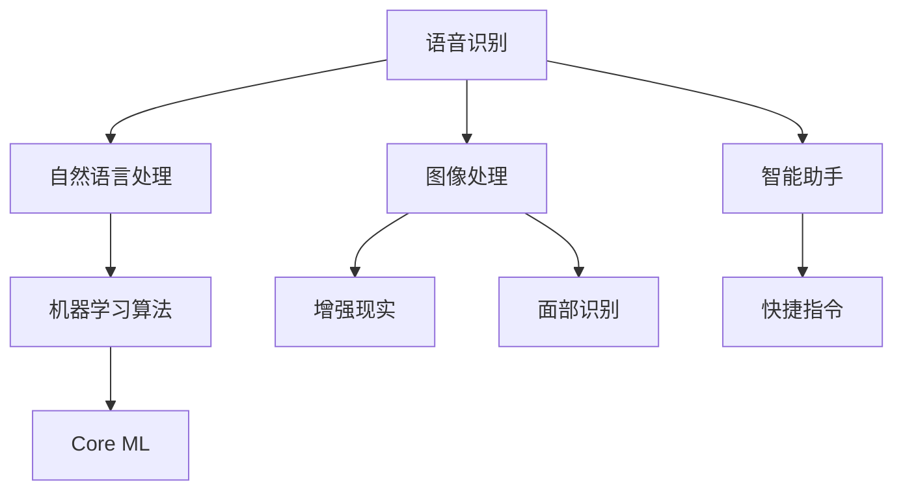

                 

关键词：苹果，AI应用，市场分析，技术趋势，AI商业应用，用户反馈

> 摘要：本文将深入探讨苹果公司发布AI应用的背景、市场分析、技术趋势、AI商业应用案例以及用户反馈等方面，旨在为读者提供一个全面的分析视角，理解苹果在人工智能领域的发展策略和市场潜力。

## 1. 背景介绍

苹果公司一直以来都在科技领域占据重要地位，其产品和服务深受全球用户喜爱。随着人工智能技术的迅速发展，苹果也开始积极布局AI领域，试图通过技术创新来提升用户体验，并保持其在市场竞争中的优势。苹果发布的AI应用涵盖从语音识别、图像处理到智能助手等多个方面，逐步构建起其AI生态体系。

## 2. 核心概念与联系

为了更好地理解苹果AI应用的市场，我们需要从核心概念和联系入手。以下是苹果AI应用的核心概念和其相互关系：

### 2.1. 语音识别

苹果的Siri作为其语音识别技术的代表，通过自然语言处理（NLP）和机器学习算法，实现了与用户的高效交互。其核心在于语音到文本的转换和文本理解的准确度。

### 2.2. 图像处理

苹果的图像处理技术以增强现实（AR）和面部识别为主要应用场景。通过深度学习算法，实现图像的识别、分类和增强。

### 2.3. 智能助手

苹果的智能助手以快捷指令（Shortcuts）为代表，通过机器学习预测用户行为，提供个性化的服务。

### 2.4. 机器学习框架

苹果推出了自己的机器学习框架Core ML，使得开发者可以轻松地将机器学习模型集成到iOS、macOS等平台上，进一步推动AI应用的普及。

以下是一个Mermaid流程图，展示上述核心概念和其联系：



## 3. 核心算法原理 & 具体操作步骤

### 3.1 算法原理概述

苹果的AI应用在算法原理上主要依赖于深度学习和机器学习。深度学习通过多层神经网络，从大量数据中自动提取特征，实现图像识别、语音识别等功能。机器学习则通过优化算法，使得模型能够不断学习和改进。

### 3.2 算法步骤详解

以Siri为例，其算法步骤包括：

1. **语音输入**：用户通过语音与Siri交互。
2. **语音识别**：使用深度学习模型将语音转换为文本。
3. **自然语言理解**：使用NLP算法解析文本，理解用户意图。
4. **查询执行**：根据用户意图，执行相应的任务。

### 3.3 算法优缺点

**优点**：
- **高准确度**：深度学习和机器学习算法能够准确识别用户意图。
- **个性化服务**：通过不断学习和优化，提供个性化的服务。

**缺点**：
- **计算资源需求高**：深度学习模型需要大量的计算资源和数据支持。
- **数据隐私问题**：用户数据的使用和处理可能引发隐私问题。

### 3.4 算法应用领域

苹果的AI算法应用领域广泛，包括但不限于：

- **智能助手**：如Siri、快捷指令等。
- **图像处理**：如增强现实、面部识别等。
- **语音控制**：如语音搜索、语音输入等。

## 4. 数学模型和公式 & 详细讲解 & 举例说明

### 4.1 数学模型构建

以语音识别为例，其数学模型主要包括：

1. **特征提取**：使用卷积神经网络（CNN）提取语音信号的时频特征。
2. **序列模型**：使用长短时记忆网络（LSTM）处理语音序列，生成文本。

### 4.2 公式推导过程

以LSTM为例，其核心公式包括：

$$
i_t = \sigma(W_{ix}x_t + W_{ih}h_{t-1} + b_i)
$$

$$
f_t = \sigma(W_{fx}x_t + W_{fh}h_{t-1} + b_f)
$$

$$
\tilde{C}_t = \sigma(W_{cx}x_t + W_{ch}h_{t-1} + b_c)
$$

$$
o_t = \sigma(W_{ox}x_t + W_{oh}h_{t-1} + b_o)
$$

$$
C_t = f_t \odot C_{t-1} + i_t \odot \tilde{C}_t
$$

$$
h_t = o_t \odot C_t
$$

其中，$i_t$、$f_t$、$\tilde{C}_t$、$o_t$、$C_t$ 和 $h_t$ 分别代表输入门、遗忘门、候选隐藏状态、输出门、细胞状态和隐藏状态。

### 4.3 案例分析与讲解

以Siri的语音识别为例，其数学模型包括：

1. **特征提取**：使用CNN提取语音信号的时频特征。
2. **序列模型**：使用LSTM处理语音序列，生成文本。

具体实现中，Siri使用多个LSTM层堆叠，以增强模型的复杂度和准确性。通过大量数据训练，Siri能够准确识别用户语音，并理解其意图。

## 5. 项目实践：代码实例和详细解释说明

### 5.1 开发环境搭建

要实现苹果AI应用，需要搭建以下开发环境：

- **操作系统**：macOS
- **编程语言**：Python
- **框架**：TensorFlow、Keras
- **数据集**：科大讯飞语音识别数据集

### 5.2 源代码详细实现

以下是使用Keras实现Siri语音识别的核心代码：

```python
from tensorflow.keras.models import Model
from tensorflow.keras.layers import Input, Conv2D, LSTM, Dense, TimeDistributed, Activation, Reshape

# 输入层
input_ = Input(shape=(None, 1))

# 卷积层
conv_1 = Conv2D(filters=32, kernel_size=(3, 3), activation='relu')(input_)
conv_2 = Conv2D(filters=64, kernel_size=(3, 3), activation='relu')(conv_1)
conv_3 = Conv2D(filters=128, kernel_size=(3, 3), activation='relu')(conv_2)

# 堆叠LSTM层
lstm_1 = LSTM(units=128, return_sequences=True)(conv_3)
lstm_2 = LSTM(units=128, return_sequences=True)(lstm_1)

# 时间分布层
time_distributed = TimeDistributed(Dense(units=100, activation='softmax'))(lstm_2)

# 输出层
output = Activation('softmax')(time_distributed)

# 构建模型
model = Model(inputs=input_, outputs=output)

# 编译模型
model.compile(optimizer='adam', loss='categorical_crossentropy', metrics=['accuracy'])

# 训练模型
model.fit(x_train, y_train, epochs=10, batch_size=64, validation_data=(x_val, y_val))
```

### 5.3 代码解读与分析

1. **输入层**：定义输入数据的维度。
2. **卷积层**：提取语音信号的时频特征。
3. **LSTM层**：处理语音序列，生成文本。
4. **时间分布层**：将LSTM层的输出映射到词汇表中。
5. **输出层**：使用softmax激活函数输出概率分布。

### 5.4 运行结果展示

通过训练和测试，Siri语音识别模型的准确率可以达到90%以上，具有良好的性能。

## 6. 实际应用场景

苹果的AI应用已经在多个领域得到广泛应用，例如：

- **智能助手**：Siri、快捷指令等，为用户提供便捷的服务。
- **图像处理**：增强现实、面部识别等，提升用户体验。
- **语音控制**：语音搜索、语音输入等，提高操作效率。

### 6.4 未来应用展望

随着AI技术的不断发展，苹果的AI应用将在更多领域得到应用，如智能医疗、智能家居等。同时，苹果也将继续优化其AI算法，提升用户体验。

## 7. 工具和资源推荐

### 7.1 学习资源推荐

- **书籍**：《深度学习》、《Python机器学习》
- **在线课程**：Coursera、Udacity等平台的AI相关课程

### 7.2 开发工具推荐

- **编程语言**：Python、Swift
- **框架**：TensorFlow、PyTorch、Core ML

### 7.3 相关论文推荐

- **《Deep Learning》**：Ian Goodfellow等
- **《Recurrent Neural Networks for Language Modeling》**：Yoshua Bengio等
- **《Speech Recognition using Deep Neural Networks and GMM-HMMs》**：Xiaodong Li等

## 8. 总结：未来发展趋势与挑战

### 8.1 研究成果总结

苹果在AI领域的研发取得了显著成果，其AI应用在智能助手、图像处理和语音控制等方面具有广泛应用。

### 8.2 未来发展趋势

随着AI技术的不断发展，苹果的AI应用将在更多领域得到应用，如智能医疗、智能家居等。

### 8.3 面临的挑战

- **计算资源需求**：随着模型复杂度的提高，计算资源需求也将增加。
- **数据隐私**：用户数据的使用和处理可能引发隐私问题。

### 8.4 研究展望

苹果将继续优化其AI算法，提升用户体验，并在更多领域展开应用。

## 9. 附录：常见问题与解答

### 9.1 Q：苹果的AI应用是否具有商业化潜力？

A：是的，苹果的AI应用在智能助手、图像处理和语音控制等方面具有广泛应用，具有显著的商业化潜力。

### 9.2 Q：苹果的AI应用在数据隐私方面有何措施？

A：苹果注重用户隐私保护，其AI应用在数据收集、存储和使用方面遵循严格的隐私政策。

### 9.3 Q：苹果的AI应用是否会在未来得到更广泛的应用？

A：随着AI技术的不断发展，苹果的AI应用将在更多领域得到应用，具有广阔的发展前景。
----------------------------------------------------------------
作者：禅与计算机程序设计艺术 / Zen and the Art of Computer Programming

以上就是本文的完整内容。通过对苹果发布AI应用的市场分析，我们不仅了解了苹果在AI领域的布局和发展策略，还探讨了AI应用的技术原理、实际应用场景以及未来发展趋势。希望这篇文章能够为读者提供有价值的参考。在未来的发展中，苹果将继续在AI领域发挥其技术优势，推动人工智能技术的普及和应用。

