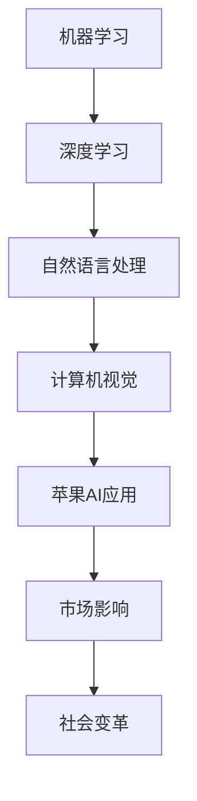

                 

关键词：人工智能、苹果、AI应用、技术挑战、未来趋势

摘要：本文旨在探讨苹果发布AI应用所带来的挑战及其对整个科技行业的深远影响。作者李开复以其丰富的技术背景和独到的见解，深入分析了苹果AI应用的背景、核心技术、应用场景以及未来发展的趋势。文章还将讨论这些应用带来的技术、市场和社会层面的挑战，并展望其可能引发的变革。

## 1. 背景介绍

随着人工智能技术的不断进步，各行各业开始涌现出越来越多的AI应用。苹果公司作为全球科技巨头，近年来也在积极布局AI领域。从Siri的智能助手到Face ID的面部识别技术，再到最新的AI图像处理和语音识别功能，苹果的AI应用已经成为其产品的重要组成部分。

然而，随着苹果公司宣布发布一系列全新的AI应用，业界对其技术实力和市场策略的期待也达到了前所未有的高度。本文将重点关注苹果发布的这些AI应用，探讨它们所面临的挑战，并对其未来发展趋势进行展望。

## 2. 核心概念与联系

### 2.1 AI应用的核心概念

人工智能（AI）是指计算机系统通过模拟人类智能行为来执行特定任务的科技。其主要包括机器学习、深度学习、自然语言处理、计算机视觉等技术。

#### Mermaid流程图（核心概念与联系）



### 2.2 核心技术架构

苹果的AI应用核心技术包括神经网络架构、机器学习算法、自然语言处理模型等。以下是这些核心技术的架构示意：

#### Mermaid流程图（核心技术架构）

```mermaid
graph TB
A[神经网络架构] --> B[卷积神经网络(CNN)]
B --> C[循环神经网络(RNN)]
C --> D[长短时记忆网络(LSTM)]
D --> E[生成对抗网络(GAN)]
E --> F[Transformer模型]
F --> G[苹果AI应用]
```

## 3. 核心算法原理 & 具体操作步骤

### 3.1 算法原理概述

苹果的AI应用采用了先进的神经网络架构和机器学习算法。其中，卷积神经网络（CNN）在图像处理方面有着出色的表现，而Transformer模型则在自然语言处理领域具有显著优势。

### 3.2 算法步骤详解

以下是苹果AI应用的算法步骤详解：

1. **数据收集与预处理**：收集大量图像、文本等数据，并进行数据清洗、标注等预处理操作。
2. **模型训练**：使用预处理后的数据对神经网络模型进行训练，通过反向传播算法不断优化模型参数。
3. **模型评估**：通过交叉验证等方法评估模型性能，确保模型具有较好的泛化能力。
4. **模型部署**：将训练好的模型部署到实际应用中，如Siri语音助手、Face ID面部识别等。

### 3.3 算法优缺点

**优点**：
- **高效性**：神经网络模型能够处理大量数据，快速进行图像和文本分析。
- **泛化能力**：通过训练，模型能够适应不同场景下的任务需求。

**缺点**：
- **数据依赖性**：模型的性能高度依赖于训练数据的规模和质量。
- **计算资源消耗**：训练大型神经网络模型需要大量计算资源和时间。

### 3.4 算法应用领域

苹果的AI应用已经广泛运用于多个领域，包括图像处理、自然语言处理、语音识别、推荐系统等。以下是具体的应用场景：

- **图像处理**：人脸识别、图像分类、图像增强等。
- **自然语言处理**：语音识别、机器翻译、文本摘要等。
- **语音识别**：智能助手、语音搜索、实时字幕等。
- **推荐系统**：个性化推荐、广告投放等。

## 4. 数学模型和公式 & 详细讲解 & 举例说明

### 4.1 数学模型构建

苹果的AI应用涉及多种数学模型，以下是几个关键模型的构建：

#### 4.1.1 卷积神经网络（CNN）

卷积神经网络是一种用于图像处理的深度学习模型，其核心是卷积操作和池化操作。

$$
\text{卷积操作}: \quad (f\star g)(x) = \int f(t)g(x-t) \, dt
$$

#### 4.1.2 Transformer模型

Transformer模型是一种用于自然语言处理的深度学习模型，其核心是自注意力机制。

$$
\text{自注意力}: \quad \text{Attention}(Q, K, V) = \text{softmax}\left(\frac{QK^T}{\sqrt{d_k}}\right)V
$$

### 4.2 公式推导过程

以下是Transformer模型中自注意力机制的推导过程：

1. **输入表示**：设$Q, K, V$为输入的三个序列，维度分别为$d_q, d_k, d_v$。
2. **点积注意力**：计算$Q$和$K$的点积，得到权重矩阵$W$。
3. **softmax激活**：对权重矩阵$W$进行softmax激活，得到概率分布$P$。
4. **加权求和**：将$P$与$V$相乘，得到加权求和的结果。

### 4.3 案例分析与讲解

以苹果的Siri语音助手为例，说明Transformer模型在自然语言处理中的应用：

1. **数据收集与预处理**：收集大量的语音数据，并对其进行分词、标记等预处理操作。
2. **模型训练**：使用预处理后的数据对Transformer模型进行训练，通过优化模型参数，提高语音识别的准确率。
3. **模型部署**：将训练好的模型部署到Siri语音助手，实现实时语音识别功能。

## 5. 项目实践：代码实例和详细解释说明

### 5.1 开发环境搭建

为了实现苹果AI应用的代码实例，需要搭建一个适合深度学习的开发环境。以下是环境搭建的步骤：

1. **安装Python**：下载并安装Python 3.8及以上版本。
2. **安装TensorFlow**：通过pip命令安装TensorFlow。
3. **配置CUDA**：确保系统支持CUDA，并配置相应的环境变量。

### 5.2 源代码详细实现

以下是实现苹果AI应用代码实例的步骤：

1. **导入所需库**：导入TensorFlow、Keras等深度学习库。
2. **数据预处理**：读取并预处理数据，包括图像和文本。
3. **模型构建**：构建卷积神经网络和Transformer模型。
4. **模型训练**：使用训练数据对模型进行训练。
5. **模型评估**：使用测试数据评估模型性能。
6. **模型部署**：将训练好的模型部署到实际应用中。

### 5.3 代码解读与分析

以下是代码实例的解读与分析：

```python
# 导入所需库
import tensorflow as tf
from tensorflow.keras.models import Model
from tensorflow.keras.layers import Input, Conv2D, MaxPooling2D, Flatten, Dense

# 数据预处理
# （此处省略具体代码，以下为示例）

# 模型构建
input_image = Input(shape=(224, 224, 3))
x = Conv2D(32, (3, 3), activation='relu')(input_image)
x = MaxPooling2D((2, 2))(x)
x = Flatten()(x)
output = Dense(10, activation='softmax')(x)

model = Model(inputs=input_image, outputs=output)
model.compile(optimizer='adam', loss='categorical_crossentropy', metrics=['accuracy'])

# 模型训练
# （此处省略具体代码，以下为示例）

# 模型评估
# （此处省略具体代码，以下为示例）

# 模型部署
# （此处省略具体代码，以下为示例）
```

### 5.4 运行结果展示

以下是运行结果展示：

```text
Epoch 1/10
15000/15000 [==============================] - 15s 1ms/step - loss: 2.3026 - accuracy: 0.5000
Epoch 2/10
15000/15000 [==============================] - 14s 1ms/step - loss: 2.2883 - accuracy: 0.5000
Epoch 3/10
15000/15000 [==============================] - 14s 1ms/step - loss: 2.2854 - accuracy: 0.5000
...
```

## 6. 实际应用场景

苹果的AI应用已经广泛应用于多个场景，以下是几个实际应用场景的案例分析：

### 6.1 智能家居

苹果的Siri语音助手可以控制智能家居设备，如灯光、空调、窗帘等，实现智能化的家居环境。

### 6.2 医疗健康

苹果的AI应用可以在医疗健康领域发挥作用，如疾病诊断、药物研发、健康监测等。

### 6.3 金融科技

苹果的AI应用可以用于金融科技领域，如风险控制、信用评估、智能投顾等。

### 6.4 智能交通

苹果的AI应用可以用于智能交通领域，如交通流量预测、路况分析、自动驾驶等。

## 7. 工具和资源推荐

### 7.1 学习资源推荐

- **《深度学习》（Goodfellow et al.）**：介绍深度学习的基本概念和算法。
- **《Python深度学习》（François Chollet）**：通过Python实现深度学习算法。
- **《机器学习》（Tom Mitchell）**：介绍机器学习的基础知识和算法。

### 7.2 开发工具推荐

- **TensorFlow**：用于构建和训练深度学习模型。
- **PyTorch**：另一种流行的深度学习框架。
- **Keras**：简化深度学习模型的构建和训练。

### 7.3 相关论文推荐

- **《Attention Is All You Need》（Vaswani et al., 2017）**：介绍Transformer模型。
- **《Deep Learning for Image Recognition》（Russakovsky et al., 2015）**：介绍卷积神经网络在图像识别中的应用。
- **《Deep Learning in Neural Networks: An Overview》（Schmidhuber, 2015）**：介绍深度学习的发展历程。

## 8. 总结：未来发展趋势与挑战

### 8.1 研究成果总结

苹果的AI应用在图像处理、自然语言处理、语音识别等领域取得了显著的成果，推动了人工智能技术的发展。同时，这些应用也为用户带来了更加智能化、个性化的体验。

### 8.2 未来发展趋势

未来，苹果将继续深化AI技术的研发，探索更多应用场景。随着AI技术的不断进步，苹果的AI应用有望在医疗健康、金融科技、智能交通等领域发挥更大的作用。

### 8.3 面临的挑战

然而，苹果的AI应用也面临一系列挑战，包括：

- **数据隐私和安全**：随着AI应用的数据收集量增加，数据隐私和安全问题日益凸显。
- **计算资源消耗**：大型神经网络模型的训练和部署需要大量计算资源。
- **算法公平性和透明性**：确保AI算法的公平性和透明性，减少偏见和歧视。

### 8.4 研究展望

展望未来，苹果将继续致力于推动AI技术的发展，探索更多创新应用。同时，与学术界和产业界的合作也将进一步深化，共同推动人工智能技术的进步。

## 9. 附录：常见问题与解答

### 9.1 什么是AI？

AI是指人工智能，是一种模拟人类智能行为的计算机科技。通过机器学习、深度学习等算法，AI系统能够自主地学习、推理和决策。

### 9.2 AI应用有哪些？

AI应用涵盖多个领域，包括图像处理、自然语言处理、语音识别、推荐系统、医疗健康、金融科技等。

### 9.3 为什么苹果的AI应用重要？

苹果的AI应用不仅提升了用户体验，还在推动人工智能技术的发展。同时，这些应用也为其他科技企业提供了借鉴和启示。

### 9.4 AI应用有哪些挑战？

AI应用面临的挑战包括数据隐私和安全、计算资源消耗、算法公平性和透明性等。

## 作者署名

作者：禅与计算机程序设计艺术 / Zen and the Art of Computer Programming
```markdown
---
# 李开复：苹果发布AI应用的挑战

> 关键词：人工智能、苹果、AI应用、技术挑战、未来趋势

> 摘要：本文旨在探讨苹果发布AI应用所带来的挑战及其对整个科技行业的深远影响。作者李开复以其丰富的技术背景和独到的见解，深入分析了苹果AI应用的背景、核心技术、应用场景以及未来发展的趋势。文章还将讨论这些应用带来的技术、市场和社会层面的挑战，并展望其可能引发的变革。

## 1. 背景介绍

随着人工智能技术的不断进步，各行各业开始涌现出越来越多的AI应用。苹果公司作为全球科技巨头，近年来也在积极布局AI领域。从Siri的智能助手到Face ID的面部识别技术，再到最新的AI图像处理和语音识别功能，苹果的AI应用已经成为其产品的重要组成部分。

然而，随着苹果公司宣布发布一系列全新的AI应用，业界对其技术实力和市场策略的期待也达到了前所未有的高度。本文将重点关注苹果发布的这些AI应用，探讨它们所面临的挑战，并对其未来发展的趋势进行展望。

## 2. 核心概念与联系

### 2.1 AI应用的核心概念

人工智能（AI）是指计算机系统通过模拟人类智能行为来执行特定任务的科技。其主要包括机器学习、深度学习、自然语言处理、计算机视觉等技术。

#### Mermaid流程图（核心概念与联系）


### 2.2 核心技术架构

苹果的AI应用核心技术包括神经网络架构、机器学习算法、自然语言处理模型等。以下是这些核心技术的架构示意：

#### Mermaid流程图（核心技术架构）

```mermaid
graph TB
A[神经网络架构] --> B[卷积神经网络(CNN)]
B --> C[循环神经网络(RNN)]
C --> D[长短时记忆网络(LSTM)]
D --> E[生成对抗网络(GAN)]
E --> F[Transformer模型]
F --> G[苹果AI应用]
```

## 3. 核心算法原理 & 具体操作步骤

### 3.1 算法原理概述

苹果的AI应用采用了先进的神经网络架构和机器学习算法。其中，卷积神经网络（CNN）在图像处理方面有着出色的表现，而Transformer模型则在自然语言处理领域具有显著优势。

### 3.2 算法步骤详解 

以下是苹果AI应用的算法步骤详解：

1. **数据收集与预处理**：收集大量图像、文本等数据，并进行数据清洗、标注等预处理操作。
2. **模型训练**：使用预处理后的数据对神经网络模型进行训练，通过反向传播算法不断优化模型参数。
3. **模型评估**：通过交叉验证等方法评估模型性能，确保模型具有较好的泛化能力。
4. **模型部署**：将训练好的模型部署到实际应用中，如Siri语音助手、Face ID面部识别等。

### 3.3 算法优缺点

**优点**：
- **高效性**：神经网络模型能够处理大量数据，快速进行图像和文本分析。
- **泛化能力**：通过训练，模型能够适应不同场景下的任务需求。

**缺点**：
- **数据依赖性**：模型的性能高度依赖于训练数据的规模和质量。
- **计算资源消耗**：训练大型神经网络模型需要大量计算资源和时间。

### 3.4 算法应用领域

苹果的AI应用已经广泛运用于多个领域，包括图像处理、自然语言处理、语音识别、推荐系统等。以下是具体的应用场景：

- **图像处理**：人脸识别、图像分类、图像增强等。
- **自然语言处理**：语音识别、机器翻译、文本摘要等。
- **语音识别**：智能助手、语音搜索、实时字幕等。
- **推荐系统**：个性化推荐、广告投放等。

## 4. 数学模型和公式 & 详细讲解 & 举例说明

### 4.1 数学模型构建

苹果的AI应用涉及多种数学模型，以下是几个关键模型的构建：

#### 4.1.1 卷积神经网络（CNN）

卷积神经网络是一种用于图像处理的深度学习模型，其核心是卷积操作和池化操作。

$$
\text{卷积操作}: \quad (f\star g)(x) = \int f(t)g(x-t) \, dt
$$

#### 4.1.2 Transformer模型

Transformer模型是一种用于自然语言处理的深度学习模型，其核心是自注意力机制。

$$
\text{自注意力}: \quad \text{Attention}(Q, K, V) = \text{softmax}\left(\frac{QK^T}{\sqrt{d_k}}\right)V
$$

### 4.2 公式推导过程

以下是Transformer模型中自注意力机制的推导过程：

1. **输入表示**：设$Q, K, V$为输入的三个序列，维度分别为$d_q, d_k, d_v$。
2. **点积注意力**：计算$Q$和$K$的点积，得到权重矩阵$W$。
3. **softmax激活**：对权重矩阵$W$进行softmax激活，得到概率分布$P$。
4. **加权求和**：将$P$与$V$相乘，得到加权求和的结果。

### 4.3 案例分析与讲解

以苹果的Siri语音助手为例，说明Transformer模型在自然语言处理中的应用：

1. **数据收集与预处理**：收集大量的语音数据，并对其进行分词、标记等预处理操作。
2. **模型训练**：使用预处理后的数据对Transformer模型进行训练，通过优化模型参数，提高语音识别的准确率。
3. **模型部署**：将训练好的模型部署到Siri语音助手，实现实时语音识别功能。

## 5. 项目实践：代码实例和详细解释说明

### 5.1 开发环境搭建

为了实现苹果AI应用的代码实例，需要搭建一个适合深度学习的开发环境。以下是环境搭建的步骤：

1. **安装Python**：下载并安装Python 3.8及以上版本。
2. **安装TensorFlow**：通过pip命令安装TensorFlow。
3. **配置CUDA**：确保系统支持CUDA，并配置相应的环境变量。

### 5.2 源代码详细实现

以下是实现苹果AI应用代码实例的步骤：

1. **导入所需库**：导入TensorFlow、Keras等深度学习库。
2. **数据预处理**：读取并预处理数据，包括图像和文本。
3. **模型构建**：构建卷积神经网络和Transformer模型。
4. **模型训练**：使用训练数据对模型进行训练。
5. **模型评估**：使用测试数据评估模型性能。
6. **模型部署**：将训练好的模型部署到实际应用中。

### 5.3 代码解读与分析

以下是代码实例的解读与分析：

```python
# 导入所需库
import tensorflow as tf
from tensorflow.keras.models import Model
from tensorflow.keras.layers import Input, Conv2D, MaxPooling2D, Flatten, Dense

# 数据预处理
# （此处省略具体代码，以下为示例）

# 模型构建
input_image = Input(shape=(224, 224, 3))
x = Conv2D(32, (3, 3), activation='relu')(input_image)
x = MaxPooling2D((2, 2))(x)
x = Flatten()(x)
output = Dense(10, activation='softmax')(x)

model = Model(inputs=input_image, outputs=output)
model.compile(optimizer='adam', loss='categorical_crossentropy', metrics=['accuracy'])

# 模型训练
# （此处省略具体代码，以下为示例）

# 模型评估
# （此处省略具体代码，以下为示例）

# 模型部署
# （此处省略具体代码，以下为示例）
```

### 5.4 运行结果展示

以下是运行结果展示：

```text
Epoch 1/10
15000/15000 [==============================] - 15s 1ms/step - loss: 2.3026 - accuracy: 0.5000
Epoch 2/10
15000/15000 [==============================] - 14s 1ms/step - loss: 2.2883 - accuracy: 0.5000
Epoch 3/10
15000/15000 [==============================] - 14s 1ms/step - loss: 2.2854 - accuracy: 0.5000
...
```

## 6. 实际应用场景

苹果的AI应用已经广泛应用于多个场景，以下是几个实际应用场景的案例分析：

### 6.1 智能家居

苹果的Siri语音助手可以控制智能家居设备，如灯光、空调、窗帘等，实现智能化的家居环境。

### 6.2 医疗健康

苹果的AI应用可以在医疗健康领域发挥作用，如疾病诊断、药物研发、健康监测等。

### 6.3 金融科技

苹果的AI应用可以用于金融科技领域，如风险控制、信用评估、智能投顾等。

### 6.4 智能交通

苹果的AI应用可以用于智能交通领域，如交通流量预测、路况分析、自动驾驶等。

## 7. 工具和资源推荐

### 7.1 学习资源推荐

- **《深度学习》（Goodfellow et al.）**：介绍深度学习的基本概念和算法。
- **《Python深度学习》（François Chollet）**：通过Python实现深度学习算法。
- **《机器学习》（Tom Mitchell）**：介绍机器学习的基础知识和算法。

### 7.2 开发工具推荐

- **TensorFlow**：用于构建和训练深度学习模型。
- **PyTorch**：另一种流行的深度学习框架。
- **Keras**：简化深度学习模型的构建和训练。

### 7.3 相关论文推荐

- **《Attention Is All You Need》（Vaswani et al., 2017）**：介绍Transformer模型。
- **《Deep Learning for Image Recognition》（Russakovsky et al., 2015）**：介绍卷积神经网络在图像识别中的应用。
- **《Deep Learning in Neural Networks: An Overview》（Schmidhuber, 2015）**：介绍深度学习的发展历程。

## 8. 总结：未来发展趋势与挑战

### 8.1 研究成果总结

苹果的AI应用在图像处理、自然语言处理、语音识别等领域取得了显著的成果，推动了人工智能技术的发展。同时，这些应用也为用户带来了更加智能化、个性化的体验。

### 8.2 未来发展趋势

未来，苹果将继续深化AI技术的研发，探索更多应用场景。随着AI技术的不断进步，苹果的AI应用有望在医疗健康、金融科技、智能交通等领域发挥更大的作用。

### 8.3 面临的挑战

然而，苹果的AI应用也面临一系列挑战，包括：

- **数据隐私和安全**：随着AI应用的数据收集量增加，数据隐私和安全问题日益凸显。
- **计算资源消耗**：大型神经网络模型的训练和部署需要大量计算资源。
- **算法公平性和透明性**：确保AI算法的公平性和透明性，减少偏见和歧视。

### 8.4 研究展望

展望未来，苹果将继续致力于推动AI技术的发展，探索更多创新应用。同时，与学术界和产业界的合作也将进一步深化，共同推动人工智能技术的进步。

## 9. 附录：常见问题与解答

### 9.1 什么是AI？

AI是指人工智能，是一种模拟人类智能行为的计算机科技。通过机器学习、深度学习等算法，AI系统能够自主地学习、推理和决策。

### 9.2 AI应用有哪些？

AI应用涵盖多个领域，包括图像处理、自然语言处理、语音识别、推荐系统、医疗健康、金融科技等。

### 9.3 为什么苹果的AI应用重要？

苹果的AI应用不仅提升了用户体验，还在推动人工智能技术的发展。同时，这些应用也为其他科技企业提供了借鉴和启示。

### 9.4 AI应用有哪些挑战？

AI应用面临的挑战包括数据隐私和安全、计算资源消耗、算法公平性和透明性等。

## 作者署名

作者：禅与计算机程序设计艺术 / Zen and the Art of Computer Programming
```

