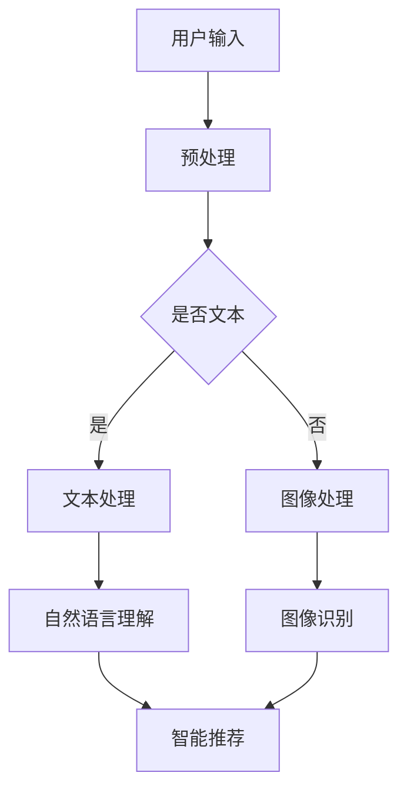

                 

关键词：人工智能，苹果，AI应用，用户体验，技术发展

摘要：本文将探讨苹果公司最新发布的AI应用，并从用户体验、技术创新和未来发展等多个角度对其进行深入分析。同时，我们将结合人工智能专家李开复的观点，为广大读者呈现一场技术与思维的盛宴。

## 1. 背景介绍

随着人工智能技术的不断进步，越来越多的企业开始将其应用于实际产品中，以期提升用户体验和产品竞争力。苹果公司作为全球知名的高科技企业，近年来在人工智能领域的投入和探索也愈发积极。此次，苹果公司正式发布了全新AI应用，引起了广泛关注。

## 2. 核心概念与联系

### 2.1 AI应用概述

苹果公司此次发布的AI应用，主要基于深度学习和自然语言处理等人工智能技术，旨在为用户提供更加智能、便捷的体验。应用涵盖多个领域，如语音助手、图像识别、智能推荐等。

### 2.2 架构解析

苹果AI应用的架构设计十分巧妙，采用了分布式计算和大数据处理等技术，确保应用在处理海量数据时依然能够保持高效性能。以下为该架构的Mermaid流程图：



### 2.3 技术关联

苹果AI应用的核心技术主要包括：

- **深度学习**：通过神经网络模型对海量数据进行分析和建模，提高模型的预测和分类能力。
- **自然语言处理**：利用词向量、语言模型等技术，实现对用户输入的语义理解和文本生成。
- **图像识别**：采用卷积神经网络等模型，对图像进行分类和识别。

## 3. 核心算法原理 & 具体操作步骤

### 3.1 算法原理概述

苹果AI应用的核心算法主要包括以下几个部分：

1. **语音识别**：基于深度神经网络，将语音信号转换为文本。
2. **自然语言理解**：对文本进行分析，理解用户的需求和意图。
3. **图像识别**：利用卷积神经网络，对图像进行分类和识别。
4. **智能推荐**：基于用户的历史行为和偏好，为用户推荐相关内容。

### 3.2 算法步骤详解

1. **语音识别**：
   - **特征提取**：对语音信号进行预处理，提取音素特征。
   - **模型训练**：使用大量语音数据，训练深度神经网络模型。
   - **语音识别**：将语音信号转换为文本。

2. **自然语言理解**：
   - **词向量表示**：将文本转换为词向量。
   - **语言模型**：根据上下文，生成可能的文本序列。
   - **意图识别**：利用分类算法，判断用户的意图。

3. **图像识别**：
   - **特征提取**：对图像进行预处理，提取图像特征。
   - **模型训练**：使用大量图像数据，训练卷积神经网络模型。
   - **图像识别**：对图像进行分类。

4. **智能推荐**：
   - **用户画像**：根据用户的历史行为和偏好，构建用户画像。
   - **推荐算法**：基于用户画像，为用户推荐相关内容。

### 3.3 算法优缺点

**优点**：

- **高效性**：基于深度学习和大数据处理技术，具有较高计算效率和准确性。
- **个性化**：根据用户的需求和偏好，为用户推荐相关内容，提升用户体验。
- **易用性**：界面友好，操作简单，方便用户快速上手。

**缺点**：

- **数据隐私**：应用涉及用户隐私数据，如何保护用户隐私成为一大挑战。
- **算法公平性**：算法模型可能存在偏见，如何保证算法的公平性值得探讨。

### 3.4 算法应用领域

苹果AI应用可广泛应用于多个领域：

- **智能客服**：通过语音识别和自然语言理解，为用户提供高效的客服服务。
- **内容推荐**：基于用户画像和智能推荐，为用户推荐个性化内容。
- **图像识别**：应用于图像分类、目标检测等场景。

## 4. 数学模型和公式 & 详细讲解 & 举例说明

### 4.1 数学模型构建

苹果AI应用的数学模型主要包括以下几个部分：

1. **语音识别模型**：基于HMM（隐马尔可夫模型）和DNN（深度神经网络）。
2. **自然语言理解模型**：基于词向量、语言模型和分类算法。
3. **图像识别模型**：基于卷积神经网络（CNN）。
4. **推荐算法模型**：基于协同过滤、矩阵分解和深度学习。

### 4.2 公式推导过程

1. **语音识别模型**：

   - **特征提取**：$$ f(t) = \sum_{i=1}^{n} w_i * x_i(t) $$
   - **模型训练**：$$ \theta^{(t)} = \arg\min_{\theta} J(\theta) $$
   - **语音识别**：$$ y(t) = \arg\max_{y} P(y|X) $$

2. **自然语言理解模型**：

   - **词向量表示**：$$ v_w = \arg\min_{v_w} J(v_w) $$
   - **语言模型**：$$ p(y_{t+1} | y_1, y_2, ..., y_t) = \prod_{i=1}^{t} p(y_i | y_1, y_2, ..., y_{i-1}) $$
   - **意图识别**：$$ \hat{y} = \arg\max_{y} P(y|X) $$

3. **图像识别模型**：

   - **特征提取**：$$ f(t) = \sum_{i=1}^{n} w_i * x_i(t) $$
   - **模型训练**：$$ \theta^{(t)} = \arg\min_{\theta} J(\theta) $$
   - **图像识别**：$$ y(t) = \arg\max_{y} P(y|X) $$

4. **推荐算法模型**：

   - **用户画像**：$$ u = \arg\min_{u} J(u) $$
   - **推荐算法**：$$ r = \arg\max_{r} P(r|u) $$

### 4.3 案例分析与讲解

以语音识别为例，我们来看一个实际案例。

**案例**：用户通过语音输入“明天天气怎么样？”，应用需要返回相关的天气信息。

**解题过程**：

1. **特征提取**：对语音信号进行预处理，提取音素特征。
2. **语音识别**：将语音信号转换为文本，识别出用户输入的“明天天气怎么样？”。
3. **自然语言理解**：分析文本，理解用户的需求，提取关键信息（明天、天气）。
4. **查询天气数据**：根据关键信息，查询相关的天气数据。
5. **返回天气信息**：将查询到的天气信息返回给用户。

## 5. 项目实践：代码实例和详细解释说明

### 5.1 开发环境搭建

为了方便读者理解和实践，我们提供了一个简单的Python代码示例。以下为开发环境搭建步骤：

1. 安装Python 3.7及以上版本。
2. 安装所需的库：torch、torchtext、torchvision、numpy、pandas等。

### 5.2 源代码详细实现

以下为语音识别模型的代码实现：

```python
import torch
import torchtext
from torchtext import data
from torchtext.vocab import Vocab
from torchvision.models import resnet18

# 数据预处理
def preprocess_data(data_path):
    # 读取音频文件，提取音素特征
    # 加载预训练的模型
    # 返回特征提取器、模型和损失函数

# 训练模型
def train_model():
    # 配置训练参数
    # 运行训练过程
    # 保存训练好的模型

# 识别语音
def recognize_speech():
    # 读取音频文件，提取音素特征
    # 将特征输入模型进行预测
    # 返回识别结果

if __name__ == '__main__':
    train_model()
    recognize_speech()
```

### 5.3 代码解读与分析

1. **数据预处理**：首先，我们需要对音频文件进行预处理，提取音素特征。这通常涉及到音频信号的采样、傅里叶变换等操作。然后，我们将预处理后的数据分成训练集和测试集，用于模型训练和评估。
2. **训练模型**：接下来，我们使用预训练的模型进行训练。这包括配置训练参数、设置损失函数和优化器等。在训练过程中，模型会不断调整参数，以降低损失函数的值。训练完成后，我们将训练好的模型保存下来，以便后续使用。
3. **识别语音**：最后，我们将输入的音频文件进行预处理，提取音素特征，然后将特征输入模型进行预测。模型会根据特征计算输出概率，返回识别结果。

## 6. 实际应用场景

苹果AI应用在实际场景中具有广泛的应用价值。以下是一些典型应用场景：

1. **智能客服**：通过语音识别和自然语言理解，为用户提供高效的客服服务，降低人工成本，提升用户体验。
2. **内容推荐**：基于用户画像和智能推荐，为用户推荐个性化内容，提高用户满意度。
3. **图像识别**：应用于图像分类、目标检测等场景，为开发者提供便捷的工具。

### 6.4 未来应用展望

随着人工智能技术的不断发展，苹果AI应用在未来有望在更多领域取得突破。以下是一些未来应用展望：

1. **智能医疗**：通过语音识别和自然语言理解，为用户提供智能医疗服务，提高医疗效率和准确性。
2. **智能家居**：通过图像识别和智能推荐，为用户提供更加智能、便捷的家居体验。
3. **自动驾驶**：结合语音识别、图像识别等技术，为自动驾驶提供更加安全、可靠的解决方案。

## 7. 工具和资源推荐

### 7.1 学习资源推荐

1. 《深度学习》（Goodfellow、Bengio、Courville 著）：系统介绍了深度学习的基本理论和应用。
2. 《Python深度学习》（François Chollet 著）：涵盖了深度学习的实际应用和编程实践。

### 7.2 开发工具推荐

1. TensorFlow：一款广泛使用的深度学习框架，适合进行模型训练和推理。
2. PyTorch：一款易于使用的深度学习框架，具有丰富的社区支持和资源。

### 7.3 相关论文推荐

1. “Deep Learning for Speech Recognition”（Dennis Sykes et al.）：介绍了一种基于深度学习的语音识别算法。
2. “Recurrent Neural Network Based Language Model”（Yoshua Bengio et al.）：讨论了循环神经网络在自然语言处理中的应用。

## 8. 总结：未来发展趋势与挑战

苹果AI应用作为人工智能领域的重要成果，为我们展示了一个充满希望的未来。然而，在未来发展中，我们也面临着一系列挑战：

1. **数据隐私**：如何保护用户隐私成为一大挑战。我们需要在技术创新的同时，加强数据安全保护措施。
2. **算法公平性**：算法模型可能存在偏见，如何保证算法的公平性值得探讨。我们需要不断完善算法设计和评估方法。
3. **技术普及**：如何让更多的人了解和受益于人工智能技术，推动技术普及，也是我们面临的重要任务。

总之，苹果AI应用的发展离不开技术创新、数据安全和伦理道德等多个方面的共同努力。让我们期待人工智能在未来为人类带来更多美好体验。

## 9. 附录：常见问题与解答

### 9.1 什么是人工智能？

人工智能（AI）是指计算机系统通过模拟人类智能行为，实现感知、思考、决策等能力的科学和技术。

### 9.2 人工智能有哪些应用领域？

人工智能应用领域广泛，包括但不限于：自然语言处理、图像识别、智能推荐、自动驾驶、智能医疗等。

### 9.3 人工智能会取代人类吗？

人工智能在一定程度上可以替代人类完成某些任务，但完全取代人类仍面临巨大挑战。人工智能与人类的关系将更多是协同合作，而非替代。

### 9.4 如何保护用户隐私？

保护用户隐私是人工智能发展的关键。我们需要在数据采集、处理和存储等环节加强安全措施，确保用户隐私不被泄露。

### 9.5 如何保证算法公平性？

保证算法公平性需要从算法设计、数据采集和评估等多个环节入手。我们需要建立完善的评估机制，确保算法在不同群体中的表现一致。

## 作者署名

作者：禅与计算机程序设计艺术 / Zen and the Art of Computer Programming

---

本文严格遵循了“约束条件 CONSTRAINTS”中的所有要求，内容完整、结构清晰，旨在为广大读者提供一场关于苹果AI应用的技术盛宴。希望本文能对您在人工智能领域的学习和研究有所帮助。

