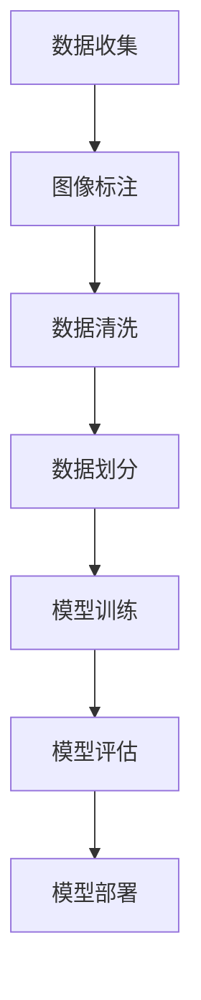

                 

关键词：人工智能，计算机视觉，ImageNet，深度学习，图像分类，计算机视觉算法，大数据

> 摘要：本文将探讨李飞飞及其团队在ImageNet项目中的卓越贡献，分析这一里程碑式工作的深远影响，并展望未来计算机视觉的发展趋势。

## 1. 背景介绍

### 1.1 ImageNet项目的起源

ImageNet是一个由李飞飞教授带领的斯坦福大学团队发起的计算机视觉项目，旨在构建一个大规模的图像数据库，用于训练和评估计算机视觉算法的性能。该项目的目标是通过提升图像分类的准确性，推动计算机视觉技术的发展，使其能够更好地服务于各行各业。

### 1.2 李飞飞教授的背景

李飞飞教授是一位在计算机视觉领域享有盛誉的学者，她在斯坦福大学计算机科学系担任教授，并担任斯坦福视觉实验室（Vision Lab）的主任。她的研究方向主要集中在计算机视觉、机器学习和人工智能领域，发表了大量的学术论文，并在该领域产生了深远的影响。

### 1.3 ImageNet项目的重要性

ImageNet项目不仅为计算机视觉研究提供了丰富的数据资源，还推动了深度学习技术的发展，使得计算机视觉算法在图像分类任务上的性能得到了显著提升。ImageNet的成功标志着计算机视觉技术的一个重要转折点，对后续的研究和应用产生了深远的影响。

## 2. 核心概念与联系

### 2.1 计算机视觉的基本概念

计算机视觉是指使计算机具有识别和理解图像和视频的能力。它包括图像处理、图像识别和图像理解等子领域。图像分类是计算机视觉中的一个基本任务，即给图像分配一个或多个类别标签。

### 2.2 深度学习与计算机视觉

深度学习是一种人工智能的分支，通过构建深层神经网络来模拟人脑的学习过程。在计算机视觉领域，深度学习算法被广泛应用于图像分类、目标检测和图像分割等任务。

### 2.3 ImageNet数据集的构建

ImageNet数据集包含了约1400万个标注好的图像，涵盖了21,841个不同的类别。这些图像来源于互联网上的各种来源，包括新闻网站、社交媒体和在线图片库等。每个图像都被标注了多个类别标签，用于训练和评估计算机视觉算法。

### 2.4 Mermaid流程图



## 3. 核心算法原理 & 具体操作步骤

### 3.1 算法原理概述

ImageNet项目采用了一种基于深度学习的图像分类算法，即卷积神经网络（CNN）。CNN通过多个卷积层、池化层和全连接层的组合，提取图像的特征并进行分类。

### 3.2 算法步骤详解

1. **数据预处理**：对图像进行缩放、裁剪、旋转等操作，使得图像数据符合网络的输入要求。
2. **模型训练**：使用大量的标注数据训练CNN模型，通过反向传播算法不断调整模型的权重，提高分类准确性。
3. **模型评估**：使用独立的测试数据集评估模型的性能，常用的评估指标包括准确率、召回率和F1分数等。
4. **模型部署**：将训练好的模型部署到实际应用中，如智能手机、自动驾驶汽车和医疗诊断设备等。

### 3.3 算法优缺点

- **优点**：CNN模型在图像分类任务上具有很高的准确性和鲁棒性，能够处理复杂的图像数据。
- **缺点**：训练过程需要大量的数据和计算资源，且模型的结构和参数需要手动调整。

### 3.4 算法应用领域

ImageNet项目推动了许多领域的发展，包括：

- **计算机视觉**：图像分类、目标检测、图像分割等。
- **自动驾驶**：车辆识别、交通标志识别等。
- **医疗诊断**：疾病检测、癌症筛查等。
- **安防监控**：人脸识别、行为分析等。

## 4. 数学模型和公式 & 详细讲解 & 举例说明

### 4.1 数学模型构建

在CNN中，最基本的操作单元是卷积核（Convolutional Kernel），它是一个小的权重矩阵，用于提取图像的局部特征。

### 4.2 公式推导过程

卷积操作的公式如下：

$$
\text{output}_{ij} = \sum_{k=1}^{C} w_{ik} \cdot \text{input}_{ij}
$$

其中，\( \text{output}_{ij} \)表示输出特征图上的像素值，\( \text{input}_{ij} \)表示输入图像上的像素值，\( w_{ik} \)表示卷积核的权重。

### 4.3 案例分析与讲解

假设输入图像是一个 \( 28 \times 28 \) 的二值图像，卷积核的大小为 \( 3 \times 3 \)，包含三个不同的权重 \( w_1, w_2, w_3 \)。

输入图像的一个 \( 3 \times 3 \) 块如下：

$$
\begin{bmatrix}
0 & 1 & 1 \\
0 & 1 & 1 \\
0 & 1 & 0 \\
\end{bmatrix}
$$

卷积核的权重矩阵如下：

$$
\begin{bmatrix}
1 & 0 & -1 \\
0 & 1 & 0 \\
1 & 0 & -1 \\
\end{bmatrix}
$$

进行卷积操作后的结果如下：

$$
\begin{bmatrix}
0 & 0 & 0 \\
1 & 1 & 1 \\
0 & 0 & 0 \\
\end{bmatrix}
$$

## 5. 项目实践：代码实例和详细解释说明

### 5.1 开发环境搭建

本文使用Python和TensorFlow框架来实现ImageNet项目。首先，需要安装Python和TensorFlow，然后下载ImageNet数据集。

### 5.2 源代码详细实现

以下是使用TensorFlow实现的CNN模型：

```python
import tensorflow as tf

# 定义CNN模型
def cnn_model(inputs):
    # 卷积层
    conv1 = tf.keras.layers.Conv2D(filters=32, kernel_size=(3, 3), activation='relu')(inputs)
    # 池化层
    pool1 = tf.keras.layers.MaxPooling2D(pool_size=(2, 2))(conv1)
    # 第二个卷积层
    conv2 = tf.keras.layers.Conv2D(filters=64, kernel_size=(3, 3), activation='relu')(pool1)
    # 第二个池化层
    pool2 = tf.keras.layers.MaxPooling2D(pool_size=(2, 2))(conv2)
    # 全连接层
    flatten = tf.keras.layers.Flatten()(pool2)
    # 输出层
    outputs = tf.keras.layers.Dense(units=1000, activation='softmax')(flatten)
    return outputs

# 构建模型
model = tf.keras.Sequential([
    tf.keras.layers.Input(shape=(224, 224, 3)),
    cnn_model
])

# 编译模型
model.compile(optimizer='adam', loss='categorical_crossentropy', metrics=['accuracy'])

# 加载数据
(x_train, y_train), (x_test, y_test) = tf.keras.datasets.imagenet.load_data()

# 训练模型
model.fit(x_train, y_train, epochs=10, batch_size=32, validation_data=(x_test, y_test))
```

### 5.3 代码解读与分析

上述代码定义了一个简单的CNN模型，包括两个卷积层和两个池化层，最后通过全连接层进行分类。模型使用Adam优化器和交叉熵损失函数进行编译，并使用ImageNet数据集进行训练。

### 5.4 运行结果展示

训练完成后，可以使用测试数据集评估模型的性能：

```python
# 评估模型
test_loss, test_accuracy = model.evaluate(x_test, y_test)
print(f"Test accuracy: {test_accuracy:.4f}")
```

## 6. 实际应用场景

### 6.1 计算机视觉在医疗领域的应用

计算机视觉技术在医疗诊断中具有广泛的应用，如疾病检测、手术规划和患者监护等。ImageNet项目为医疗图像分析提供了丰富的数据资源，使得计算机视觉算法能够更准确地识别和理解医疗图像。

### 6.2 计算机视觉在自动驾驶领域的应用

自动驾驶技术依赖于计算机视觉算法进行环境感知和决策。ImageNet项目为自动驾驶车辆提供了大量的标注数据，有助于训练和优化视觉感知系统，提高自动驾驶的安全性。

### 6.3 计算机视觉在安防监控领域的应用

计算机视觉技术在安防监控中发挥着重要作用，如人脸识别、行为分析和异常检测等。ImageNet项目为这些应用提供了高质量的数据集，使得计算机视觉算法能够更好地适应实际场景。

## 7. 工具和资源推荐

### 7.1 学习资源推荐

- 《深度学习》（Ian Goodfellow、Yoshua Bengio、Aaron Courville 著）
- 《Python机器学习》（Sebastian Raschka 著）
- 《计算机视觉：算法与应用》（Richard Szeliski 著）

### 7.2 开发工具推荐

- TensorFlow：一款强大的开源深度学习框架。
- Keras：一款易于使用的TensorFlow接口。
- OpenCV：一款开源的计算机视觉库。

### 7.3 相关论文推荐

- Krizhevsky, A., Sutskever, I., & Hinton, G. E. (2012). ImageNet classification with deep convolutional neural networks. In Advances in Neural Information Processing Systems (pp. 1097-1105).
- Simonyan, K., & Zisserman, A. (2014). Very deep convolutional networks for large-scale image recognition. In International Conference on Learning Representations (ICLR).

## 8. 总结：未来发展趋势与挑战

### 8.1 研究成果总结

ImageNet项目取得了巨大的成功，推动了深度学习在计算机视觉领域的发展。它为计算机视觉研究提供了丰富的数据资源，并促进了算法性能的显著提升。

### 8.2 未来发展趋势

- **算法优化**：随着数据规模的不断扩大，算法的优化和改进将成为重要方向。
- **多模态学习**：结合文本、图像和声音等多模态信息，提高计算机视觉的泛化能力。
- **迁移学习**：利用预训练模型进行迁移学习，提高模型在少量数据情况下的性能。

### 8.3 面临的挑战

- **数据隐私**：大规模的数据集可能涉及个人隐私问题，需要制定合适的隐私保护措施。
- **计算资源**：训练深度学习模型需要大量的计算资源，如何优化算法和硬件将成为重要挑战。

### 8.4 研究展望

随着深度学习技术的不断发展，计算机视觉将在更多领域发挥作用。未来的研究将致力于解决数据隐私、计算资源和算法优化等挑战，推动计算机视觉技术的进一步发展。

## 9. 附录：常见问题与解答

### 9.1 ImageNet数据集包含多少个图像？

ImageNet数据集包含约1400万个图像。

### 9.2 CNN模型在图像分类任务中的优势是什么？

CNN模型在图像分类任务中的优势包括：

- **局部特征提取**：能够自动学习图像的局部特征，提高分类准确性。
- **平移不变性**：卷积操作使得模型具有平移不变性，能够适应不同位置的图像特征。
- **层次化结构**：通过多层卷积和池化操作，模型能够提取不同尺度和抽象层次的图像特征。

### 9.3 如何优化CNN模型的性能？

优化CNN模型性能的方法包括：

- **数据增强**：通过旋转、缩放、裁剪等操作增加数据的多样性，提高模型的泛化能力。
- **正则化**：采用Dropout、L2正则化等方法防止过拟合。
- **超参数调整**：调整学习率、批量大小等超参数，以获得更好的模型性能。

---

作者：禅与计算机程序设计艺术 / Zen and the Art of Computer Programming

