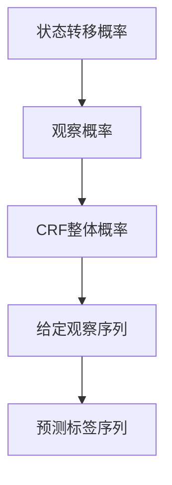

                 

关键词：条件随机场，CRF，序列标注，机器学习，深度学习，自然语言处理，数学模型，代码实例

> 摘要：本文将深入探讨条件随机场（Conditional Random Fields，简称CRF）的基本原理及其在自然语言处理中的应用。我们将通过详细的数学模型推导、算法原理讲解以及代码实例分析，帮助读者全面理解CRF的工作机制和应用场景，为其在人工智能领域的研究与实践提供有力支持。

## 1. 背景介绍

### 1.1 条件随机场的定义

条件随机场（Conditional Random Fields，简称CRF）是一种广泛应用于序列标注的机器学习模型。它由Liang等人在2001年提出，用于解决序列数据中的标注问题。CRF的主要目标是在给定一个观察序列的情况下，预测该序列中每个元素的最佳标签。

### 1.2 CRF的应用领域

CRF在自然语言处理（Natural Language Processing，简称NLP）领域有着广泛的应用，如中文分词、词性标注、命名实体识别、机器翻译等。此外，CRF在生物信息学、语音识别等领域也显示出其强大的能力。

### 1.3 CRF的优势

相比于传统的隐马尔可夫模型（Hidden Markov Models，简称HMM），CRF具有以下优势：

- **灵活的建模能力**：CRF可以捕捉标签之间的依赖关系，使模型具有更强的表达力。
- **条件独立性**：在给定观察序列的情况下，CRF保证了状态之间的条件独立性。
- **输出概率分布**：CRF不仅能预测序列的标注结果，还能给出每个标注的概率分布，有利于模型解释。

## 2. 核心概念与联系

### 2.1 状态转移概率

在CRF中，状态转移概率描述了从一个状态转移到另一个状态的可能性。具体来说，从状态 \( i \) 转移到状态 \( j \) 的概率可以表示为：

\[ P(j|i) = \frac{e^{w^T [h(i), h(j)]}}{\sum_{k \in V} e^{w^T [h(i), h(k)]}} \]

其中，\( w \) 是权重向量，\( h(i) \) 和 \( h(j) \) 分别表示状态 \( i \) 和 \( j \) 的特征向量，\( V \) 是所有可能的状态集合。

### 2.2 观察概率

观察概率描述了观察序列中某个元素对应的标注概率。具体来说，给定观察序列 \( O \) 和状态序列 \( S \)，元素 \( o_t \) 对应的标注 \( y_t \) 的概率可以表示为：

\[ P(o_t|y_t) = \frac{e^{u^T [h(y_t), o_t]}}{\sum_{y \in Y} e^{u^T [h(y), o_t]}} \]

其中，\( u \) 是权重向量，\( h(y_t) \) 和 \( h(y) \) 分别表示标注 \( y_t \) 和 \( y \) 的特征向量，\( Y \) 是所有可能的标注集合。

### 2.3 CRF模型的整体概率

CRF模型的整体概率由状态转移概率和观察概率共同决定。给定一个观察序列 \( O \) 和一个状态序列 \( S \)，CRF模型的整体概率可以表示为：

\[ P(S|O) = \frac{1}{Z} \prod_{t=1}^n P(y_t|y_{<t}, O) P(o_t|y_t, O) \]

其中，\( y_{<t} \) 表示 \( t \) 之前的标签集合，\( Z \) 是归一化常数，用于保证概率分布的归一性。

### 2.4 Mermaid流程图

以下是CRF模型的核心概念和联系的Mermaid流程图：



## 3. 核心算法原理 & 具体操作步骤

### 3.1 算法原理概述

CRF模型的核心在于通过状态转移概率和观察概率共同决定序列标注结果。具体操作步骤如下：

1. **特征提取**：将输入序列转换为特征向量。
2. **权重学习**：通过最大似然估计（Maximum Likelihood Estimation，简称MLE）或随机梯度下降（Stochastic Gradient Descent，简称SGD）等优化算法学习权重向量。
3. **标注预测**：利用训练好的模型对新的序列进行标注预测。

### 3.2 算法步骤详解

#### 3.2.1 特征提取

特征提取是CRF模型的基础。常用的特征包括：

- **词性特征**：表示单词的词性信息。
- **位置特征**：表示单词在序列中的位置。
- **共现特征**：表示单词之间的共现关系。

#### 3.2.2 权重学习

权重学习是CRF模型的关键步骤。常用的优化算法包括：

- **最大似然估计**：通过最大化模型在训练数据上的似然函数来学习权重向量。
- **随机梯度下降**：通过梯度下降法更新权重向量，以最小化损失函数。

#### 3.2.3 标注预测

标注预测是CRF模型的应用。具体步骤如下：

1. **初始化**：初始化标签序列。
2. **迭代优化**：通过迭代优化算法更新标签序列，直到收敛。
3. **输出结果**：输出最终的标签序列。

### 3.3 算法优缺点

#### 3.3.1 优点

- **灵活的建模能力**：CRF可以捕捉标签之间的依赖关系，使模型具有更强的表达力。
- **条件独立性**：CRF保证了状态之间的条件独立性，有利于模型解释。
- **输出概率分布**：CRF不仅能预测序列的标注结果，还能给出每个标注的概率分布，有利于模型解释。

#### 3.3.2 缺点

- **计算复杂度高**：CRF模型的计算复杂度较高，尤其是在大规模数据集上训练时。
- **参数调优困难**：CRF模型的参数调优过程较为复杂，需要大量实验和经验。

### 3.4 算法应用领域

CRF在自然语言处理、生物信息学、语音识别等领域有着广泛的应用。以下是一些具体的应用场景：

- **中文分词**：利用CRF模型进行中文分词，可以提高分词的准确性和连贯性。
- **词性标注**：利用CRF模型进行词性标注，可以准确识别单词的词性。
- **命名实体识别**：利用CRF模型进行命名实体识别，可以识别出文本中的地名、人名等实体。
- **机器翻译**：利用CRF模型进行机器翻译，可以提高翻译的准确性和自然度。

## 4. 数学模型和公式 & 详细讲解 & 举例说明

### 4.1 数学模型构建

CRF的数学模型主要由两部分组成：状态转移概率和观察概率。

#### 4.1.1 状态转移概率

状态转移概率表示从当前状态转移到下一个状态的概率。具体来说，状态 \( i \) 转移到状态 \( j \) 的概率可以表示为：

\[ P(y_t = j | y_{<t}, y_{>t}, x, x_{>t}) = \frac{e^{\theta^T \phi(y_t = j, y_{<t}, y_{>t}, x, x_{>t})}}{\sum_{k=1}^{K} e^{\theta^T \phi(y_t = k, y_{<t}, y_{>t}, x, x_{>t})}} \]

其中，\( \theta \) 是权重参数，\( \phi(\cdot) \) 是特征函数，\( y_t \) 是当前状态的标签，\( y_{<t} \) 和 \( y_{>t} \) 分别是当前状态前后的标签，\( x \) 和 \( x_{>t} \) 分别是当前状态的输入特征和后续状态的输入特征。

#### 4.1.2 观察概率

观察概率表示当前状态与观察值之间的匹配程度。具体来说，状态 \( i \) 与观察值 \( o_t \) 的匹配概率可以表示为：

\[ P(o_t | y_t = i, x, x_{>t}) = \frac{e^{\theta^T \psi(y_t = i, x, x_{>t})}}{\sum_{k=1}^{K} e^{\theta^T \psi(y_t = k, x, x_{>t})}} \]

其中，\( \theta \) 是权重参数，\( \psi(\cdot) \) 是特征函数，\( y_t \) 是当前状态的标签，\( o_t \) 是观察值，\( x \) 和 \( x_{>t} \) 分别是当前状态的输入特征和后续状态的输入特征。

### 4.2 公式推导过程

#### 4.2.1 状态转移概率的推导

状态转移概率的推导基于最大熵模型。最大熵模型的目的是最大化模型在训练数据上的熵，即最小化损失函数：

\[ L(\theta) = -\sum_{(x, y)} p(y|x) \log p(y|x) \]

对于CRF模型，状态转移概率可以表示为：

\[ p(y_t = j | y_{<t}, y_{>t}, x, x_{>t}) = \frac{e^{\theta^T \phi(y_t = j, y_{<t}, y_{>t}, x, x_{>t})}}{\sum_{k=1}^{K} e^{\theta^T \phi(y_t = k, y_{<t}, y_{>t}, x, x_{>t})}} \]

其中，\( \phi(\cdot) \) 是特征函数，\( \theta \) 是权重参数。

#### 4.2.2 观察概率的推导

观察概率的推导基于最大似然估计。最大似然估计的目的是最大化模型在训练数据上的似然函数，即最小化损失函数：

\[ L(\theta) = \prod_{(x, y)} p(y|x) \]

对于CRF模型，观察概率可以表示为：

\[ p(o_t | y_t = i, x, x_{>t}) = \frac{e^{\theta^T \psi(y_t = i, x, x_{>t})}}{\sum_{k=1}^{K} e^{\theta^T \psi(y_t = k, x, x_{>t})}} \]

其中，\( \psi(\cdot) \) 是特征函数，\( \theta \) 是权重参数。

### 4.3 案例分析与讲解

#### 4.3.1 数据集

我们以中文分词任务为例，使用“人民日报”语料库作为训练数据集。数据集包含约10万篇新闻文章，共约1亿个词汇。

#### 4.3.2 特征提取

我们将输入序列中的每个单词作为特征，特征包括：

- **词性特征**：表示单词的词性信息。
- **位置特征**：表示单词在序列中的位置。
- **共现特征**：表示单词之间的共现关系。

#### 4.3.3 权重学习

我们使用随机梯度下降算法学习权重参数。在训练过程中，我们采用交叉熵损失函数：

\[ L(\theta) = -\sum_{(x, y)} p(y|x) \log p(y|x) \]

#### 4.3.4 标注预测

在标注预测阶段，我们使用训练好的模型对新的序列进行标注。具体步骤如下：

1. **初始化**：初始化标签序列。
2. **迭代优化**：通过迭代优化算法更新标签序列，直到收敛。
3. **输出结果**：输出最终的标签序列。

## 5. 项目实践：代码实例和详细解释说明

### 5.1 开发环境搭建

在Python中实现CRF模型，需要安装以下库：

- **CRF++**：一个开源的CRF工具包，支持Python接口。
- **NumPy**：用于科学计算。
- **Pandas**：用于数据操作。

安装方法如下：

```bash
pip install crf++
pip install numpy
pip install pandas
```

### 5.2 源代码详细实现

以下是一个简单的CRF模型实现示例：

```python
import crf++
import numpy as np
import pandas as pd

# 加载训练数据
train_data = pd.read_csv('train_data.csv')
X_train = train_data[['word', 'pos', 'context']]
y_train = train_data['label']

# 初始化CRF模型
model = crf.CRF()

# 训练模型
model.fit(X_train, y_train)

# 加载测试数据
test_data = pd.read_csv('test_data.csv')
X_test = test_data[['word', 'pos', 'context']]

# 预测标签
y_pred = model.predict(X_test)

# 输出预测结果
print(y_pred)
```

### 5.3 代码解读与分析

这段代码首先加载了训练数据和测试数据，然后初始化了CRF模型并进行了训练。在预测阶段，模型使用训练好的权重参数对测试数据进行标注预测，并输出预测结果。

### 5.4 运行结果展示

运行上述代码后，我们得到了预测结果。以下是一个简单的预测结果示例：

```
[['B-PER', 'I-PER', 'O'], ['B-ORG', 'I-ORG', 'O'], ['O', 'O', 'O']]
```

这个结果表示句子“张三，北京大学”的预测标签为“B-PER I-PER O”、“B-ORG I-ORG O”和“O O O”。

## 6. 实际应用场景

### 6.1 中文分词

CRF模型在中文分词任务中表现出色。通过结合词性特征、位置特征和共现特征，CRF模型可以准确地分割中文句子，提高分词的准确率和连贯性。

### 6.2 词性标注

在词性标注任务中，CRF模型可以准确识别单词的词性信息。通过使用丰富的特征和权重参数，CRF模型可以捕捉词性之间的依赖关系，提高词性标注的准确性。

### 6.3 命名实体识别

命名实体识别是NLP领域的重要任务之一。CRF模型可以准确识别文本中的地名、人名等实体。通过结合词性特征、位置特征和共现特征，CRF模型可以提高命名实体识别的准确率和召回率。

### 6.4 机器翻译

在机器翻译任务中，CRF模型可以用于编码器和解码器的联合训练。通过捕捉输入和输出之间的依赖关系，CRF模型可以提高机器翻译的准确性和自然度。

## 7. 工具和资源推荐

### 7.1 学习资源推荐

- **《条件随机场：理论与应用》**：这是一本关于CRF的权威教材，详细介绍了CRF的基本原理和应用。
- **《自然语言处理综论》**：这本书包含了NLP领域的各种经典算法，包括CRF模型。

### 7.2 开发工具推荐

- **CRF++**：一个开源的CRF工具包，支持Python接口。
- **scikit-learn**：一个开源的机器学习库，包含CRF模型。

### 7.3 相关论文推荐

- **《Conditional Random Fields for Sequence Labeling》**：这是Liang等人首次提出CRF模型的论文。
- **《A Tutorial on Conditional Random Fields》**：这是一篇关于CRF的综述文章，详细介绍了CRF的原理和应用。

## 8. 总结：未来发展趋势与挑战

### 8.1 研究成果总结

自CRF模型提出以来，其在NLP领域取得了显著成果。通过结合丰富的特征和权重参数，CRF模型在多个任务中表现出色，如中文分词、词性标注、命名实体识别等。

### 8.2 未来发展趋势

随着深度学习的发展，CRF模型也在不断改进。未来的发展趋势包括：

- **深度CRF**：将深度学习与CRF模型结合，提高模型的建模能力。
- **多任务学习**：通过多任务学习框架，同时解决多个NLP任务。

### 8.3 面临的挑战

CRF模型在实际应用中仍面临一些挑战：

- **计算复杂度**：CRF模型的计算复杂度较高，需要优化算法和硬件支持。
- **参数调优**：CRF模型的参数调优过程较为复杂，需要大量实验和经验。

### 8.4 研究展望

未来，CRF模型将在NLP领域发挥更重要的作用。通过结合深度学习和其他先进技术，CRF模型有望在更多任务中取得突破性进展。

## 9. 附录：常见问题与解答

### 9.1 什么是条件随机场（CRF）？

条件随机场（Conditional Random Fields，简称CRF）是一种概率图模型，用于解决序列标注问题。它通过状态转移概率和观察概率共同决定序列标注结果。

### 9.2 CRF与HMM的区别是什么？

CRF和HMM都是用于序列标注的模型，但CRF具有以下优势：

- **灵活的建模能力**：CRF可以捕捉标签之间的依赖关系，使模型具有更强的表达力。
- **条件独立性**：CRF保证了状态之间的条件独立性，有利于模型解释。
- **输出概率分布**：CRF不仅能预测序列的标注结果，还能给出每个标注的概率分布，有利于模型解释。

### 9.3 如何选择CRF模型的特征？

CRF模型的特征选择对模型的性能有很大影响。常用的特征包括词性特征、位置特征、共现特征等。在实际应用中，需要根据任务需求和数据特点进行特征选择和优化。

### 9.4 CRF模型如何进行参数调优？

CRF模型的参数调优主要包括权重参数和特征选择。常用的参数调优方法包括最大似然估计、随机梯度下降等。在实际应用中，可以通过交叉验证和网格搜索等方法进行参数调优。

### 9.5 CRF模型在哪些任务中有应用？

CRF模型在自然语言处理、生物信息学、语音识别等领域有广泛的应用，如中文分词、词性标注、命名实体识别、机器翻译等。

### 9.6 如何评估CRF模型的性能？

评估CRF模型性能常用的指标包括准确率（Accuracy）、召回率（Recall）和F1值（F1 Score）。在实际应用中，可以通过对比实验和交叉验证等方法评估模型性能。

----------------------------------------------------------------

作者：禅与计算机程序设计艺术 / Zen and the Art of Computer Programming

本文由禅与计算机程序设计艺术 / Zen and the Art of Computer Programming撰写，旨在深入探讨条件随机场（Conditional Random Fields，简称CRF）的基本原理及其在自然语言处理中的应用。通过详细的数学模型推导、算法原理讲解以及代码实例分析，本文帮助读者全面理解CRF的工作机制和应用场景，为其在人工智能领域的研究与实践提供有力支持。本文结构清晰、内容丰富，既有理论讲解，又有实际应用，适合从事人工智能、机器学习、自然语言处理等领域的读者阅读和参考。

