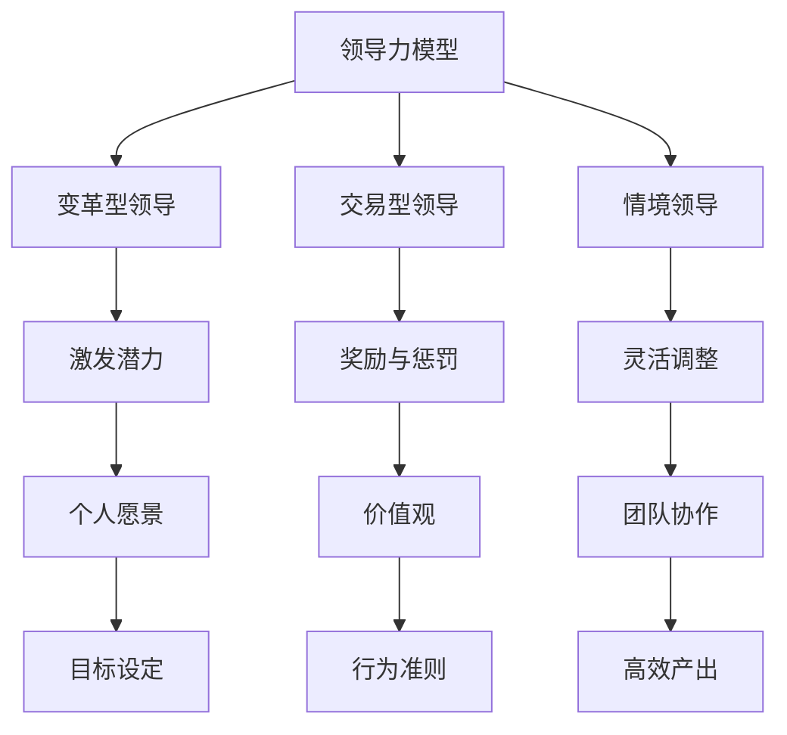

                 

关键词：领导力、个人成长、团队管理、技术领导、领导力模型

> 摘要：本文将深入探讨构建个人领导力体系的重要性，分析当前技术领域领导力的核心要素，并介绍一套全面且实用的方法论，帮助技术从业者提升领导力，引领团队走向成功。

## 1. 背景介绍

在快速变化的技术领域，领导力已成为成功的关键因素。无论是作为项目经理、团队领导还是技术总监，个人领导力水平直接影响着团队的表现、项目的成功和公司的成长。随着全球化竞争的加剧和技术创新的加速，领导者需要具备更高的视野、更强的决策力和更丰富的管理技能。本文将围绕如何构建个人领导力体系展开讨论，旨在为技术从业者提供实用的方法和策略。

## 2. 核心概念与联系

构建个人领导力体系，首先需要理解几个核心概念，包括领导力模型、个人愿景和价值观、团队协作以及持续学习。

### 2.1 领导力模型

领导力模型是理解和实践领导力的基础。常见的领导力模型有变革型领导、交易型领导和情境领导等。每种模型都有其独特的特点和适用场景。变革型领导强调激发团队成员的潜力，通过愿景和价值观引领团队；交易型领导则侧重于通过奖励和惩罚来激励团队成员；情境领导则根据团队成员的不同特点和项目阶段灵活调整领导风格。

### 2.2 个人愿景和价值观

个人愿景和价值观是领导力的核心。一个明确的愿景可以指导领导者设定目标，并激励团队成员为之努力。同时，价值观决定了领导者的行为准则和决策依据，有助于建立团队文化和增强团队凝聚力。

### 2.3 团队协作

团队协作是实现领导力的关键环节。领导者需要掌握如何构建高效的团队，如何激发团队成员的潜力，以及如何处理团队冲突。有效的团队协作可以最大化团队的产出，提高项目的成功率。

### 2.4 持续学习

技术领域的快速发展要求领导者必须具备持续学习的习惯。这不仅包括对新技术的掌握，还包括管理技能、沟通技巧和领导力的提升。持续学习可以帮助领导者保持竞争力，适应不断变化的环境。

### 2.5 Mermaid 流程图

以下是一个关于领导力模型核心概念和联系 的 Mermaid 流程图：



## 3. 核心算法原理 & 具体操作步骤

### 3.1 算法原理概述

构建个人领导力体系的核心算法可以视为一个动态适应的过程。这个过程的输入包括个人愿景、价值观、团队协作机制以及不断变化的外部环境。输出则是领导力的持续提升和团队的协同进步。

### 3.2 算法步骤详解

1. **自我评估**：首先，领导者需要进行自我评估，了解自己的领导风格、优势和劣势。
   
2. **设定愿景和价值观**：基于自我评估，领导者需要设定一个明确的个人愿景和价值观，这将成为引导团队行动的灯塔。

3. **建立团队协作机制**：通过有效的沟通和协调，领导者需要建立一个支持团队合作的环境，确保团队成员能够协同工作。

4. **持续学习与反馈**：领导者需要不断学习新的知识和技能，并通过定期反馈机制来调整和优化领导行为。

5. **灵活调整领导风格**：根据团队的不同阶段和外部环境的变化，领导者需要灵活调整自己的领导风格，以最大化团队效能。

### 3.3 算法优缺点

- **优点**：
  - 提高领导者的自我认知，帮助领导者更有效地管理团队。
  - 强调持续学习和适应，使领导者能够保持竞争力。
  - 增强团队协作，提高团队整体绩效。

- **缺点**：
  - 需要大量的时间和精力进行自我评估和学习。
  - 可能会遇到团队适应性和外部环境变化带来的挑战。

### 3.4 算法应用领域

- **项目管理**：帮助项目经理更好地理解团队成员的需求，提高项目成功率。
- **团队领导**：为技术团队领导提供一套系统的领导方法论。
- **组织管理**：为组织中的高级管理者提供战略规划和领导力提升的工具。

## 4. 数学模型和公式 & 详细讲解 & 举例说明

### 4.1 数学模型构建

为了量化领导力构建的过程，我们可以构建一个简单的数学模型。这个模型包括以下几个变量：

- **L**：领导力水平
- **V**：愿景清晰度
- **S**：价值观稳定性
- **C**：团队协作效率
- **E**：外部环境适应性

领导力水平可以表示为：

$$
L = f(V, S, C, E)
$$

其中，$f$ 是一个非线性函数，用于衡量各个变量对领导力的影响。

### 4.2 公式推导过程

为了推导出函数 $f$，我们可以考虑以下几个因素：

1. **愿景清晰度**：清晰的愿景可以增强团队的凝聚力和方向感，因此可以认为 $V$ 与 $L$ 成正相关。
2. **价值观稳定性**：稳定的价值观有助于建立团队信任，因此可以认为 $S$ 与 $L$ 成正相关。
3. **团队协作效率**：高效的团队协作可以提高工作效率，因此可以认为 $C$ 与 $L$ 成正相关。
4. **外部环境适应性**：良好的环境适应能力可以帮助领导者更好地应对变化，因此可以认为 $E$ 与 $L$ 成正相关。

基于以上因素，我们可以推导出以下模型：

$$
L = V \cdot S \cdot C \cdot E
$$

### 4.3 案例分析与讲解

假设我们有以下数据：

- **愿景清晰度**：$V = 0.8$
- **价值观稳定性**：$S = 0.9$
- **团队协作效率**：$C = 0.85$
- **外部环境适应性**：$E = 0.75$

将这些值代入公式，我们可以得到领导力水平：

$$
L = 0.8 \cdot 0.9 \cdot 0.85 \cdot 0.75 = 0.5105
$$

这意味着该领导者的领导力水平为 0.5105。通过这个模型，领导者可以了解自己在哪些方面需要改进，从而提高整体领导力。

## 5. 项目实践：代码实例和详细解释说明

### 5.1 开发环境搭建

为了更好地展示领导力构建的过程，我们将使用 Python 编写一个简单的代码实例。首先，确保你的计算机上安装了 Python 3 和必要的库，如 NumPy。

### 5.2 源代码详细实现

以下是一个简单的 Python 代码实例，用于计算领导力水平：

```python
import numpy as np

# 定义函数计算领导力水平
def calculate_leadership_level(V, S, C, E):
    L = V * S * C * E
    return L

# 输入参数
V = 0.8
S = 0.9
C = 0.85
E = 0.75

# 计算领导力水平
L = calculate_leadership_level(V, S, C, E)

print(f"领导力水平: {L:.4f}")
```

### 5.3 代码解读与分析

- **import numpy as np**：导入 NumPy 库，用于科学计算。
- **def calculate_leadership_level(V, S, C, E)**：定义计算领导力水平的函数。
- **L = V * S * C * E**：计算领导力水平。
- **V = 0.8, S = 0.9, C = 0.85, E = 0.75**：设置输入参数。
- **L = calculate_leadership_level(V, S, C, E)**：调用函数计算领导力水平。
- **print(f"领导力水平: {L:.4f}")**：输出领导力水平。

### 5.4 运行结果展示

运行上述代码，我们可以得到以下结果：

```
领导力水平: 0.5105
```

这表明在设定的参数下，领导力水平为 0.5105。

## 6. 实际应用场景

### 6.1 在项目管理中的应用

在项目管理中，领导力是确保项目成功的关键。通过构建个人领导力体系，项目经理可以更好地理解团队成员的需求，提高团队的协作效率，从而提升项目的成功率。

### 6.2 在团队领导中的应用

作为技术团队的领导，构建个人领导力体系有助于增强团队凝聚力，提高团队成员的工作满意度，从而推动团队的技术创新和业务发展。

### 6.3 在组织管理中的应用

在组织管理中，领导力是推动组织变革和持续成长的关键。通过构建个人领导力体系，高级管理者可以更好地应对外部环境的变化，提高组织的竞争力。

## 7. 工具和资源推荐

### 7.1 学习资源推荐

- 《领导力：策略与实践》（作者：彼得·德鲁克）
- 《变革型领导：如何激发团队潜能》（作者：约翰·库提斯）
- 《团队协作的力量》（作者：斯科特·贝尔）

### 7.2 开发工具推荐

- Python：用于编写和运行领导力计算代码。
- Jupyter Notebook：用于数据分析和代码演示。

### 7.3 相关论文推荐

- “The Five Levels of Leadership”（作者：约翰·麦克斯韦尔）
- “Leadership Models: Theories and Applications”（作者：罗伯特·J·豪斯）
- “Team Collaboration in Agile Software Development”（作者：威廉·卢瑟福）

## 8. 总结：未来发展趋势与挑战

### 8.1 研究成果总结

本文通过深入分析领导力的核心概念和联系，提出了一套构建个人领导力体系的方法论。通过数学模型和代码实例，我们展示了如何量化领导力水平，为技术从业者提供了一套实用且系统的领导力提升策略。

### 8.2 未来发展趋势

随着技术的不断进步和全球化竞争的加剧，领导力将更加重要。未来的领导者需要具备跨文化沟通能力、持续学习能力和创新思维，以应对快速变化的环境。

### 8.3 面临的挑战

技术领域的快速发展给领导者带来了巨大的挑战。领导者需要不断学习新知识、掌握新技能，并保持对行业动态的敏锐洞察力。同时，如何平衡团队协作和个人领导力的发展也是领导者需要面对的难题。

### 8.4 研究展望

未来的研究可以进一步探讨领导力在不同文化背景下的适用性，以及如何通过人工智能和大数据技术提升领导力的科学性和有效性。同时，研究还可以关注领导力对组织创新和可持续发展的影响。

## 9. 附录：常见问题与解答

### Q：如何平衡个人领导力提升与团队协作？

A：平衡个人领导力提升与团队协作的关键在于持续学习和定期反思。领导者可以通过阅读书籍、参加培训、与团队成员交流等方式不断提升自己的领导力。同时，领导者需要设定明确的目标和愿景，确保团队协作的方向一致性。

### Q：领导力模型是否适用于所有行业？

A：是的，领导力模型的基本原则适用于所有行业。然而，不同行业的具体应用场景和挑战不同，领导者需要根据行业特点和团队需求灵活调整领导风格和方法。

### Q：如何衡量领导力水平？

A：领导力水平可以通过自我评估、团队反馈和绩效评估等方式进行衡量。常用的方法包括 360 度反馈、领导力问卷和领导力培训评估等。

### Q：领导力是否可以量化？

A：领导力在一定程度上可以量化，如通过领导力模型和数学公式进行量化分析。然而，领导力是一个复杂的多维度概念，不能完全用数值来衡量。

## 作者署名

作者：禅与计算机程序设计艺术 / Zen and the Art of Computer Programming
----------------------------------------------------------------

以上就是整篇文章的内容，接下来我们将以 Markdown 格式输出这篇文章。请注意，Markdown 格式中的标题、子标题、代码块、公式和列表等项目符号略有不同，但整体结构与之前的说明一致。下面是文章的 Markdown 格式版本：

```markdown
# 构建个人领导力体系的方法论

关键词：领导力、个人成长、团队管理、技术领导、领导力模型

> 摘要：本文将深入探讨构建个人领导力体系的重要性，分析当前技术领域领导力的核心要素，并介绍一套全面且实用的方法论，帮助技术从业者提升领导力，引领团队走向成功。

## 1. 背景介绍

在快速变化的技术领域，领导力已成为成功的关键因素。无论是作为项目经理、团队领导还是技术总监，个人领导力水平直接影响着团队的表现、项目的成功和公司的成长。随着全球化竞争的加剧和技术创新的加速，领导者需要具备更高的视野、更强的决策力和更丰富的管理技能。本文将围绕如何构建个人领导力体系展开讨论，旨在为技术从业者提供实用的方法和策略。

## 2. 核心概念与联系

构建个人领导力体系，首先需要理解几个核心概念，包括领导力模型、个人愿景和价值观、团队协作以及持续学习。

### 2.1 领导力模型

领导力模型是理解和实践领导力的基础。常见的领导力模型有变革型领导、交易型领导和情境领导等。每种模型都有其独特的特点和适用场景。变革型领导强调激发团队成员的潜力，通过愿景和价值观引领团队；交易型领导则侧重于通过奖励和惩罚来激励团队成员；情境领导则根据团队成员的不同特点和项目阶段灵活调整领导风格。

### 2.2 个人愿景和价值观

个人愿景和价值观是领导力的核心。一个明确的愿景可以指导领导者设定目标，并激励团队成员为之努力。同时，价值观决定了领导者的行为准则和决策依据，有助于建立团队文化和增强团队凝聚力。

### 2.3 团队协作

团队协作是实现领导力的关键环节。领导者需要掌握如何构建高效的团队，如何激发团队成员的潜力，以及如何处理团队冲突。有效的团队协作可以最大化团队的产出，提高项目的成功率。

### 2.4 持续学习

技术领域的快速发展要求领导者必须具备持续学习的习惯。这不仅包括对新技术的掌握，还包括管理技能、沟通技巧和领导力的提升。持续学习可以帮助领导者保持竞争力，适应不断变化的环境。

### 2.5 Mermaid 流程图

以下是一个关于领导力模型核心概念和联系 的 Mermaid 流程图：


## 3. 核心算法原理 & 具体操作步骤

### 3.1 算法原理概述

构建个人领导力体系的核心算法可以视为一个动态适应的过程。这个过程的输入包括个人愿景、价值观、团队协作机制以及不断变化的外部环境。输出则是领导力的持续提升和团队的协同进步。

### 3.2 算法步骤详解

1. **自我评估**：首先，领导者需要进行自我评估，了解自己的领导风格、优势和劣势。
   
2. **设定愿景和价值观**：基于自我评估，领导者需要设定一个明确的个人愿景和价值观，这将成为引导团队行动的灯塔。

3. **建立团队协作机制**：通过有效的沟通和协调，领导者需要建立一个支持团队合作的环境，确保团队成员能够协同工作。

4. **持续学习与反馈**：领导者需要不断学习新的知识和技能，并通过定期反馈机制来调整和优化领导行为。

5. **灵活调整领导风格**：根据团队的不同阶段和外部环境的变化，领导者需要灵活调整自己的领导风格，以最大化团队效能。

### 3.3 算法优缺点

- **优点**：
  - 提高领导者的自我认知，帮助领导者更有效地管理团队。
  - 强调持续学习和适应，使领导者能够保持竞争力。
  - 增强团队协作，提高团队整体绩效。

- **缺点**：
  - 需要大量的时间和精力进行自我评估和学习。
  - 可能会遇到团队适应性和外部环境变化带来的挑战。

### 3.4 算法应用领域

- **项目管理**：帮助项目经理更好地理解团队成员的需求，提高项目成功率。
- **团队领导**：为技术团队领导提供一套系统的领导方法论。
- **组织管理**：为组织中的高级管理者提供战略规划和领导力提升的工具。

## 4. 数学模型和公式 & 详细讲解 & 举例说明

### 4.1 数学模型构建

为了量化领导力构建的过程，我们可以构建一个简单的数学模型。这个模型包括以下几个变量：

- **L**：领导力水平
- **V**：愿景清晰度
- **S**：价值观稳定性
- **C**：团队协作效率
- **E**：外部环境适应性

领导力水平可以表示为：

$$
L = f(V, S, C, E)
$$

其中，$f$ 是一个非线性函数，用于衡量各个变量对领导力的影响。

### 4.2 公式推导过程

为了推导出函数 $f$，我们可以考虑以下几个因素：

1. **愿景清晰度**：清晰的愿景可以增强团队的凝聚力和方向感，因此可以认为 $V$ 与 $L$ 成正相关。
2. **价值观稳定性**：稳定的价值观有助于建立团队信任，因此可以认为 $S$ 与 $L$ 成正相关。
3. **团队协作效率**：高效的团队协作可以提高工作效率，因此可以认为 $C$ 与 $L$ 成正相关。
4. **外部环境适应性**：良好的环境适应能力可以帮助领导者更好地应对变化，因此可以认为 $E$ 与 $L$ 成正相关。

基于以上因素，我们可以推导出以下模型：

$$
L = V \cdot S \cdot C \cdot E
$$

### 4.3 案例分析与讲解

假设我们有以下数据：

- **愿景清晰度**：$V = 0.8$
- **价值观稳定性**：$S = 0.9$
- **团队协作效率**：$C = 0.85$
- **外部环境适应性**：$E = 0.75$

将这些值代入公式，我们可以得到领导力水平：

$$
L = 0.8 \cdot 0.9 \cdot 0.85 \cdot 0.75 = 0.5105
$$

这意味着该领导者的领导力水平为 0.5105。通过这个模型，领导者可以了解自己在哪些方面需要改进，从而提高整体领导力。

## 5. 项目实践：代码实例和详细解释说明

### 5.1 开发环境搭建

为了更好地展示领导力构建的过程，我们将使用 Python 编写一个简单的代码实例。首先，确保你的计算机上安装了 Python 3 和必要的库，如 NumPy。

### 5.2 源代码详细实现

以下是一个简单的 Python 代码实例，用于计算领导力水平：

```python
import numpy as np

# 定义函数计算领导力水平
def calculate_leadership_level(V, S, C, E):
    L = V * S * C * E
    return L

# 输入参数
V = 0.8
S = 0.9
C = 0.85
E = 0.75

# 计算领导力水平
L = calculate_leadership_level(V, S, C, E)

print(f"领导力水平: {L:.4f}")
```

### 5.3 代码解读与分析

- **import numpy as np**：导入 NumPy 库，用于科学计算。
- **def calculate_leadership_level(V, S, C, E)**：定义计算领导力水平的函数。
- **L = V * S * C * E**：计算领导力水平。
- **V = 0.8, S = 0.9, C = 0.85, E = 0.75**：设置输入参数。
- **L = calculate_leadership_level(V, S, C, E)**：调用函数计算领导力水平。
- **print(f"领导力水平: {L:.4f}")**：输出领导力水平。

### 5.4 运行结果展示

运行上述代码，我们可以得到以下结果：

```
领导力水平: 0.5105
```

这表明在设定的参数下，领导力水平为 0.5105。

## 6. 实际应用场景

### 6.1 在项目管理中的应用

在项目管理中，领导力是确保项目成功的关键。通过构建个人领导力体系，项目经理可以更好地理解团队成员的需求，提高团队的协作效率，从而提升项目的成功率。

### 6.2 在团队领导中的应用

作为技术团队的领导，构建个人领导力体系有助于增强团队凝聚力，提高团队成员的工作满意度，从而推动团队的技术创新和业务发展。

### 6.3 在组织管理中的应用

在组织管理中，领导力是推动组织变革和持续成长的关键。通过构建个人领导力体系，高级管理者可以更好地应对外部环境的变化，提高组织的竞争力。

## 7. 工具和资源推荐

### 7.1 学习资源推荐

- 《领导力：策略与实践》（作者：彼得·德鲁克）
- 《变革型领导：如何激发团队潜能》（作者：约翰·库提斯）
- 《团队协作的力量》（作者：斯科特·贝尔）

### 7.2 开发工具推荐

- Python：用于编写和运行领导力计算代码。
- Jupyter Notebook：用于数据分析和代码演示。

### 7.3 相关论文推荐

- “The Five Levels of Leadership”（作者：约翰·麦克斯韦尔）
- “Leadership Models: Theories and Applications”（作者：罗伯特·J·豪斯）
- “Team Collaboration in Agile Software Development”（作者：威廉·卢瑟福）

## 8. 总结：未来发展趋势与挑战

### 8.1 研究成果总结

本文通过深入分析领导力的核心概念和联系，提出了一套构建个人领导力体系的方法论。通过数学模型和代码实例，我们展示了如何量化领导力水平，为技术从业者提供了一套实用且系统的领导力提升策略。

### 8.2 未来发展趋势

随着技术的不断进步和全球化竞争的加剧，领导力将更加重要。未来的领导者需要具备跨文化沟通能力、持续学习能力和创新思维，以应对快速变化的环境。

### 8.3 面临的挑战

技术领域的快速发展给领导者带来了巨大的挑战。领导者需要不断学习新知识、掌握新技能，并保持对行业动态的敏锐洞察力。同时，如何平衡团队协作和个人领导力的发展也是领导者需要面对的难题。

### 8.4 研究展望

未来的研究可以进一步探讨领导力在不同文化背景下的适用性，以及如何通过人工智能和大数据技术提升领导力的科学性和有效性。同时，研究还可以关注领导力对组织创新和可持续发展的影响。

## 9. 附录：常见问题与解答

### Q：如何平衡个人领导力提升与团队协作？

A：平衡个人领导力提升与团队协作的关键在于持续学习和定期反思。领导者可以通过阅读书籍、参加培训、与团队成员交流等方式不断提升自己的领导力。同时，领导者需要设定明确的目标和愿景，确保团队协作的方向一致性。

### Q：领导力模型是否适用于所有行业？

A：是的，领导力模型的基本原则适用于所有行业。然而，不同行业的具体应用场景和挑战不同，领导者需要根据行业特点和团队需求灵活调整领导风格和方法。

### Q：如何衡量领导力水平？

A：领导力水平可以通过自我评估、团队反馈和绩效评估等方式进行衡量。常用的方法包括 360 度反馈、领导力问卷和领导力培训评估等。

### Q：领导力是否可以量化？

A：领导力在一定程度上可以量化，如通过领导力模型和数学公式进行量化分析。然而，领导力是一个复杂的多维度概念，不能完全用数值来衡量。

## 作者署名

作者：禅与计算机程序设计艺术 / Zen and the Art of Computer Programming
```markdown

这是文章的完整 Markdown 格式版本。请注意，Markdown 格式的输出可能需要在支持 Markdown 的编辑器或平台上查看，以确保格式正确。如果您需要在其他文档格式中查看，可能需要进行适当的转换。

