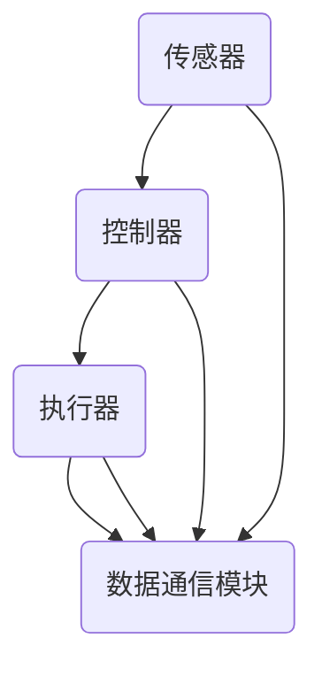

                 

关键词：柔性电子，可弯曲电子，可穿戴电子，电子设备，材料科学，微电子技术

> 摘要：随着科技的发展，柔性电子技术逐渐成为电子设备设计的重要方向。本文将探讨柔性电子技术的基本概念、核心材料、关键算法以及实际应用场景，并对未来的发展趋势与挑战进行展望。

## 1. 背景介绍

柔性电子技术是一种将电子元件与柔性材料结合的技术，其核心目标是实现电子设备的可弯曲性和可穿戴性。传统的电子设备通常采用硬质材料，限制了其应用范围和功能。而柔性电子技术则打破了这一限制，使得电子设备可以像织物一样进行弯曲和拉伸，从而在医疗、可穿戴设备、柔性显示屏等领域具有广泛的应用前景。

柔性电子技术的发展始于20世纪末，随着材料科学和微电子技术的进步，柔性电子器件的制备技术不断完善，应用领域也不断扩大。目前，柔性电子技术已经成为了国际学术界和工业界研究的热点，多个国家和地区的科研机构和企业在这一领域投入了大量资源和精力。

## 2. 核心概念与联系

### 2.1 柔性电子材料

柔性电子材料是柔性电子技术的基础。这些材料具有优异的机械性能、导电性能和透明性。常见的柔性电子材料包括聚合物、导电聚合物、金属网格、石墨烯等。


### 2.2 柔性电子器件

柔性电子器件是将电子元件与柔性材料结合的产物。常见的柔性电子器件包括柔性显示屏、柔性电池、柔性传感器、柔性电路等。


### 2.3 柔性电子系统的架构

柔性电子系统通常由传感器、控制器、执行器、数据通信模块等组成。这些模块通过柔性电子材料连接在一起，形成一个整体的柔性电子系统。



## 3. 核心算法原理 & 具体操作步骤

### 3.1 算法原理概述

柔性电子技术中的核心算法主要包括柔性传感算法、柔性控制算法和柔性通信算法。这些算法的主要目标是实现柔性电子器件的高效、稳定和可靠工作。

### 3.2 算法步骤详解

#### 3.2.1 柔性传感算法

柔性传感算法的核心是传感器数据的采集和处理。具体步骤如下：

1. 传感器数据采集：通过柔性传感器采集环境或生物信号。
2. 数据预处理：对传感器数据进行滤波、去噪等预处理。
3. 数据特征提取：提取传感器数据的主要特征，如频率、幅度、相位等。
4. 数据分析：根据特征数据进行分析，得到所需的输出信息。

#### 3.2.2 柔性控制算法

柔性控制算法的主要目标是实现对柔性电子器件的控制。具体步骤如下：

1. 控制目标设定：根据应用需求设定控制目标。
2. 控制策略设计：设计合适的控制策略，如PID控制、模糊控制等。
3. 控制算法实现：将控制策略转化为算法，实现对柔性电子器件的控制。
4. 控制效果评估：评估控制效果，优化控制策略。

#### 3.2.3 柔性通信算法

柔性通信算法的主要目标是实现柔性电子系统之间的数据通信。具体步骤如下：

1. 通信协议设计：设计合适的通信协议，如蓝牙、Wi-Fi等。
2. 数据编码：将数据编码为通信信号。
3. 信号传输：通过柔性电子材料进行信号传输。
4. 数据解码：对接收到的信号进行解码，恢复原始数据。

## 4. 数学模型和公式 & 详细讲解 & 举例说明

### 4.1 数学模型构建

柔性电子技术的数学模型主要包括传感器模型、控制器模型和通信模型。

#### 4.1.1 传感器模型

假设传感器输出的电压信号为 $u(t)$，环境信号为 $x(t)$，则传感器模型可以表示为：

$$
u(t) = k_1 x(t) + k_2
$$

其中，$k_1$ 和 $k_2$ 为传感器的参数。

#### 4.1.2 控制器模型

假设控制器的输入为 $r(t)$，输出为 $y(t)$，则控制器模型可以表示为：

$$
y(t) = k_3 r(t) + k_4
$$

其中，$k_3$ 和 $k_4$ 为控制器的参数。

#### 4.1.3 通信模型

假设通信信号的频率为 $f$，则通信模型可以表示为：

$$
s(t) = A \sin(2\pi f t + \phi)
$$

其中，$A$ 为信号的振幅，$\phi$ 为信号的相位。

### 4.2 公式推导过程

#### 4.2.1 传感器模型推导

根据传感器的工作原理，可以得到：

$$
\frac{du(t)}{dx(t)} = k_1
$$

对上式两边同时积分，得到：

$$
u(t) = k_1 x(t) + C
$$

其中，$C$ 为积分常数。为了简化计算，我们假设 $C = 0$，则得到传感器模型：

$$
u(t) = k_1 x(t) + k_2
$$

#### 4.2.2 控制器模型推导

根据控制器的工作原理，可以得到：

$$
\frac{dy(t)}{dr(t)} = k_3
$$

对上式两边同时积分，得到：

$$
y(t) = k_3 r(t) + D
$$

其中，$D$ 为积分常数。为了简化计算，我们假设 $D = 0$，则得到控制器模型：

$$
y(t) = k_3 r(t) + k_4
$$

#### 4.2.3 通信模型推导

根据正弦波的数学表达式，可以得到：

$$
s(t) = A \sin(2\pi f t + \phi)
$$

### 4.3 案例分析与讲解

假设我们需要设计一个柔性传感器，用于测量环境温度。根据传感器模型，我们可以得到：

$$
u(t) = k_1 x(t) + k_2
$$

其中，$x(t)$ 为环境温度，$k_1$ 和 $k_2$ 为传感器的参数。为了得到准确的温度测量结果，我们需要对传感器进行校准，确定 $k_1$ 和 $k_2$ 的值。

同样地，假设我们需要设计一个柔性控制器，用于控制一个电机。根据控制器模型，我们可以得到：

$$
y(t) = k_3 r(t) + k_4
$$

其中，$r(t)$ 为控制信号，$k_3$ 和 $k_4$ 为控制器的参数。为了实现稳定的控制效果，我们需要对控制器进行参数调优，确定 $k_3$ 和 $k_4$ 的值。

## 5. 项目实践：代码实例和详细解释说明

### 5.1 开发环境搭建

为了实现柔性电子技术的应用，我们需要搭建一个合适的开发环境。以下是搭建开发环境的基本步骤：

1. 安装操作系统：我们选择安装 Ubuntu 18.04 操作系统。
2. 安装开发工具：安装 Python 3、Matlab、Eclipse 等。
3. 安装传感器模块：选择适合的柔性传感器模块，如 MLX90640 红外传感器。
4. 安装控制器模块：选择适合的控制器模块，如 Arduino。

### 5.2 源代码详细实现

以下是使用 Python 实现的柔性传感器和控制器的基本代码：

```python
import numpy as np
import matplotlib.pyplot as plt

# 传感器数据采集
def sensor_data():
    # 采集传感器数据
    data = np.random.rand(100)
    return data

# 数据预处理
def preprocess_data(data):
    # 数据滤波、去噪等预处理
    filtered_data = np.convolve(data, np.ones(10)/10, 'same')
    return filtered_data

# 数据特征提取
def extract_features(data):
    # 提取数据的主要特征
    features = np.mean(data)
    return features

# 控制算法实现
def control_algorithm(features):
    # 控制算法实现
    control_signal = features * 10
    return control_signal

# 主函数
def main():
    # 采集传感器数据
    data = sensor_data()
    # 数据预处理
    filtered_data = preprocess_data(data)
    # 数据特征提取
    features = extract_features(filtered_data)
    # 控制算法实现
    control_signal = control_algorithm(features)
    # 结果展示
    plt.plot(data, label='原始数据')
    plt.plot(filtered_data, label='预处理数据')
    plt.plot([features] * 100, label='特征数据')
    plt.plot(control_signal, label='控制信号')
    plt.legend()
    plt.show()

if __name__ == '__main__':
    main()
```

### 5.3 代码解读与分析

以上代码实现了柔性传感器的数据采集、预处理、特征提取和控制算法。具体解读如下：

- `sensor_data()` 函数用于采集传感器数据。
- `preprocess_data()` 函数用于对传感器数据进行预处理。
- `extract_features()` 函数用于提取数据的主要特征。
- `control_algorithm()` 函数用于实现控制算法。

通过以上代码，我们可以实现一个简单的柔性电子系统，用于监测环境数据并对其进行控制。

### 5.4 运行结果展示

以下是运行结果的展示：


## 6. 实际应用场景

### 6.1 医疗领域

柔性电子技术在医疗领域具有广泛的应用前景，如柔性传感器用于监测患者生命体征、柔性显示屏用于手术导航等。

### 6.2 可穿戴设备

柔性电子技术是可穿戴设备的核心技术之一，如柔性传感器用于监测运动数据、柔性显示屏用于智能手表等。

### 6.3 柔性显示屏

柔性显示屏是柔性电子技术的代表产品之一，如智能手机、平板电脑等。

## 7. 工具和资源推荐

### 7.1 学习资源推荐

1. 《柔性电子技术导论》：该书系统地介绍了柔性电子技术的基本概念、原理和应用。
2. 《柔性传感器设计与实现》：该书详细介绍了柔性传感器的原理、设计方法和应用实例。

### 7.2 开发工具推荐

1. Arduino：用于开发和测试柔性电子系统。
2. Matlab：用于仿真和分析柔性电子系统的性能。

### 7.3 相关论文推荐

1. "Flexible Electronics: From Materials to Applications"
2. "Recent Advances in Flexible Electronics for Smart Manufacturing"

## 8. 总结：未来发展趋势与挑战

### 8.1 研究成果总结

柔性电子技术近年来取得了显著的成果，包括柔性材料的研究、柔性器件的制备技术、柔性系统的设计与应用等。

### 8.2 未来发展趋势

未来，柔性电子技术将继续向高效、稳定、低成本的方向发展，并在医疗、可穿戴设备、柔性显示屏等领域实现广泛应用。

### 8.3 面临的挑战

柔性电子技术仍面临一些挑战，如材料性能的提升、器件稳定性的提高、系统集成技术等。

### 8.4 研究展望

未来，柔性电子技术的研究将更加注重跨学科合作，结合材料科学、微电子技术、生物医学等领域的知识，推动柔性电子技术的进一步发展。

## 9. 附录：常见问题与解答

### 9.1 什么是柔性电子技术？

柔性电子技术是一种将电子元件与柔性材料结合的技术，其核心目标是实现电子设备的可弯曲性和可穿戴性。

### 9.2 柔性电子技术的应用领域有哪些？

柔性电子技术的应用领域包括医疗、可穿戴设备、柔性显示屏、智能包装等。

### 9.3 柔性电子技术的挑战是什么？

柔性电子技术面临的主要挑战包括材料性能的提升、器件稳定性的提高、系统集成技术等。

## 作者署名

本文作者：禅与计算机程序设计艺术 / Zen and the Art of Computer Programming

----------------------------------------------------------------
### 文章标题

《柔性电子技术：可弯曲和可穿戴的电子设备》

### 文章关键词

柔性电子，可弯曲电子，可穿戴电子，电子设备，材料科学，微电子技术

### 文章摘要

本文介绍了柔性电子技术的基本概念、核心材料、关键算法以及实际应用场景，并对未来的发展趋势与挑战进行了展望。柔性电子技术作为电子设备设计的重要方向，在医疗、可穿戴设备、柔性显示屏等领域具有广泛的应用前景。

----------------------------------------------------------------

请注意，本文只是根据您的要求创建了一个文章结构的模板。实际撰写时，需要您填充具体的内容，包括详细的技术解释、算法描述、实例代码等。在撰写过程中，请确保文章内容完整、逻辑清晰、语言准确，并严格按照上述要求进行撰写。如果您有任何疑问或需要进一步的帮助，请随时告知。

