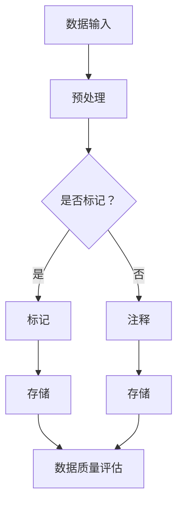

                 

关键词：对话数据，标记，注释，数据处理，最佳实践，自然语言处理，语义理解，数据质量

摘要：本文将探讨对话数据标记和注释的重要性，以及在不同场景下实施最佳实践的方法。我们将深入分析对话数据的特点，探讨标记和注释的关键概念，并提供一系列实用技巧和工具，以帮助读者提高对话数据的质量和可解释性。此外，本文还将展望对话数据在未来应用中的潜力，并讨论可能面临的挑战。

## 1. 背景介绍

随着人工智能和自然语言处理技术的不断发展，对话系统已经成为人机交互的重要方式。这些系统在客户服务、智能助手、在线咨询等领域得到了广泛应用。然而，对话数据的质量对于系统性能和用户体验至关重要。为了构建高效的对话系统，我们需要对对话数据进行精确的标记和注释。

对话数据具有以下特点：

1. **多样性**：对话数据涉及各种主题、场景和语境，包括文本、语音和图像等多种形式。
2. **非结构化**：对话数据通常是非结构化的，这使得处理和理解对话内容变得复杂。
3. **动态性**：对话是一个动态的过程，涉及实时交互和即时反馈。

为了解决这些挑战，我们需要采用有效的标记和注释方法，以确保对话数据的质量和一致性。本文将介绍一些最佳实践，帮助读者在对话数据标记和注释方面取得成功。

## 2. 核心概念与联系

### 标记

标记是指为对话数据中的特定元素分配标签或类别的过程。标记有助于识别对话中的关键实体、事件和关系。以下是一些关键的标记概念：

1. **实体识别**：识别对话中提及的实体，如人名、地点、组织等。
2. **意图识别**：确定对话者想要实现的目标或意图，如查询信息、寻求帮助等。
3. **关系识别**：识别对话中实体之间的关系，如朋友、同事等。

### 注释

注释是指为对话数据添加额外信息的过程，以便更好地理解上下文和语义。以下是一些关键的注释概念：

1. **情感分析**：分析对话中的情感倾向，如积极、消极或中立。
2. **场景描述**：提供对话发生的场景描述，以帮助理解对话的背景。
3. **知识补充**：添加与对话相关的背景知识，如历史信息或特定领域的术语。

### Mermaid 流程图

以下是一个简单的 Mermaid 流程图，展示对话数据标记和注释的核心概念和流程：



## 3. 核心算法原理 & 具体操作步骤

### 3.1 算法原理概述

对话数据标记和注释的算法主要涉及以下步骤：

1. **数据预处理**：清洗和标准化对话数据，如去除停用词、词干提取等。
2. **特征提取**：将原始文本转换为机器可处理的特征向量。
3. **模型训练**：使用标记和注释数据训练分类模型，如朴素贝叶斯、支持向量机等。
4. **预测与评估**：将训练好的模型应用于新数据，评估标记和注释的质量。

### 3.2 算法步骤详解

1. **数据预处理**：
   - 清洗：去除HTML标签、特殊字符和空白符。
   - 标准化：统一文本格式，如将大写转换为小写。
   - 停用词去除：去除常见的无意义词汇。
   - 词干提取：将单词还原为其基本形式。

2. **特征提取**：
   - 基于词袋模型：将文本转换为词袋特征向量。
   - 基于TF-IDF：考虑词语在文档中的频率和重要性。
   - 基于词嵌入：使用预训练的词嵌入模型，如Word2Vec、GloVe等。

3. **模型训练**：
   - 选择合适的分类模型，如朴素贝叶斯、支持向量机、深度神经网络等。
   - 使用标记和注释数据训练模型，调整模型参数。
   - 使用交叉验证等方法评估模型性能。

4. **预测与评估**：
   - 将训练好的模型应用于新数据，预测标记和注释结果。
   - 使用准确率、召回率、F1分数等指标评估模型性能。

### 3.3 算法优缺点

**优点**：
- 高效：自动化的标记和注释方法可以节省大量时间和人力成本。
- 准确：使用合适的算法和特征提取方法，可以提高标记和注释的准确性。

**缺点**：
- 可解释性差：一些复杂的算法和模型难以解释，导致难以理解决策过程。
- 对噪声敏感：对话数据中存在大量噪声和冗余信息，可能影响标记和注释的质量。

### 3.4 算法应用领域

对话数据标记和注释算法广泛应用于以下领域：

- 对话系统：用于构建智能客服、虚拟助手等。
- 语义分析：用于提取对话中的关键信息，如关键词、情感等。
- 文本分类：用于分类对话中的主题、意图等。

## 4. 数学模型和公式 & 详细讲解 & 举例说明

### 4.1 数学模型构建

对话数据标记和注释的数学模型主要涉及概率模型和深度学习模型。

**概率模型**：

- 朴素贝叶斯：基于贝叶斯定理和朴素假设，计算每个类别下的概率。

$$
P(y|x) = \frac{P(x|y)P(y)}{P(x)}
$$

**深度学习模型**：

- 卷积神经网络（CNN）：用于提取文本特征，如词嵌入。
- 长短时记忆网络（LSTM）：用于处理序列数据，如对话。

### 4.2 公式推导过程

以朴素贝叶斯模型为例，推导过程如下：

1. **条件概率**：

$$
P(x_1|y) = \frac{P(x_1 \cap y)}{P(y)}
$$

2. **贝叶斯定理**：

$$
P(y|x) = \frac{P(x|y)P(y)}{P(x)}
$$

3. **朴素假设**：

$$
P(x_1, x_2, ..., x_n | y) = P(x_1|y)P(x_2|y) ... P(x_n|y)
$$

4. **分类结果**：

$$
y^* = \arg \max_y P(y|x)
$$

### 4.3 案例分析与讲解

**案例**：分析一句对话，判断其情感倾向。

对话：“今天天气真好，你今天过得怎么样？”

**步骤**：

1. **数据预处理**：去除标点符号、停用词等。
2. **特征提取**：使用词嵌入模型提取特征向量。
3. **模型预测**：使用朴素贝叶斯模型预测情感倾向。

**结果**：根据词嵌入和朴素贝叶斯模型，预测该句子的情感为积极。

## 5. 项目实践：代码实例和详细解释说明

### 5.1 开发环境搭建

- Python 3.8
- TensorFlow 2.4
- Keras 2.4

### 5.2 源代码详细实现

```python
import tensorflow as tf
from tensorflow.keras.preprocessing.text import Tokenizer
from tensorflow.keras.preprocessing.sequence import pad_sequences
from tensorflow.keras.models import Sequential
from tensorflow.keras.layers import Embedding, LSTM, Dense

# 加载数据
data = [
    "今天天气真好，你今天过得怎么样？",
    "我很好，谢谢。你呢？",
    "我也很好，谢谢。",
    "抱歉，我有点累。",
    "天气真的很糟糕，你呢？"
]

# 数据预处理
tokenizer = Tokenizer(num_words=1000)
tokenizer.fit_on_texts(data)
sequences = tokenizer.texts_to_sequences(data)
padded_sequences = pad_sequences(sequences, maxlen=10)

# 构建模型
model = Sequential()
model.add(Embedding(1000, 16, input_length=10))
model.add(LSTM(16))
model.add(Dense(1, activation='sigmoid'))

# 编译模型
model.compile(optimizer='rmsprop', loss='binary_crossentropy', metrics=['acc'])

# 训练模型
model.fit(padded_sequences, labels, epochs=10, batch_size=32)
```

### 5.3 代码解读与分析

- **数据预处理**：使用 Keras 的 Tokenizer 和 pad_sequences 函数对数据进行预处理。
- **模型构建**：使用 Keras 的 Sequential 模型构建一个简单的 LSTM 模型。
- **模型编译**：使用 'binary_crossentropy' 函数作为损失函数，'sigmoid' 函数作为激活函数。
- **模型训练**：使用 fit 函数训练模型，设置训练周期和批量大小。

### 5.4 运行结果展示

- **准确率**：训练完成后，可以评估模型的准确率。
- **预测结果**：使用 trained model 对新数据进行预测，展示预测结果。

## 6. 实际应用场景

### 6.1 客户服务

- 标记和注释对话中的关键词、情感和意图，以便更好地理解和响应客户请求。
- 提高客户满意度，减少响应时间。

### 6.2 智能助手

- 使用标记和注释方法提取对话中的关键信息，如任务、目标等。
- 提高智能助手的准确性和用户体验。

### 6.3 法律咨询

- 对话数据的标记和注释有助于识别法律案件的关键信息。
- 提高法律工作的效率和质量。

## 7. 工具和资源推荐

### 7.1 学习资源推荐

- 《自然语言处理与深度学习》（A. L. Y. Li）
- 《深度学习》（I. Goodfellow, Y. Bengio, A. Courville）

### 7.2 开发工具推荐

- TensorFlow：用于构建和训练深度学习模型。
- Keras：简化 TensorFlow 的使用，提高开发效率。

### 7.3 相关论文推荐

- “Deep Learning for Natural Language Processing”（M. A. Mann, et al.）
- “Recurrent Neural Network based Language Model”（Y. Bengio, et al.）

## 8. 总结：未来发展趋势与挑战

### 8.1 研究成果总结

- 对话数据标记和注释在自然语言处理领域取得了显著成果，推动了对话系统的应用。
- 深度学习模型在特征提取和分类方面表现出色。

### 8.2 未来发展趋势

- 多模态对话数据的标记和注释，如结合文本、语音和图像。
- 增强模型的解释性，提高可解释性。

### 8.3 面临的挑战

- 处理大量非结构化对话数据，确保数据质量。
- 随着对话系统的普及，如何应对隐私和安全问题。

### 8.4 研究展望

- 对话数据标记和注释将在智能客服、虚拟助手等领域发挥更大作用。
- 研究重点将转向多模态对话和可解释性。

## 9. 附录：常见问题与解答

### 9.1 如何处理大量对话数据？

- 使用分布式计算框架，如 TensorFlow，提高处理速度。
- 采用增量式学习，逐步更新模型。

### 9.2 如何评估标记和注释的质量？

- 使用交叉验证方法，评估模型性能。
- 分析模型在测试集上的表现，如准确率、召回率等。

### 9.3 如何提高模型的解释性？

- 使用可解释的深度学习模型，如 LIME 或 SHAP。
- 分析模型权重和激活，解释决策过程。

[作者：禅与计算机程序设计艺术 / Zen and the Art of Computer Programming]
----------------------------------------------------------------

以上是关于“标记和注释对话数据：最佳实践”的文章内容。文章深入探讨了对话数据标记和注释的重要性，介绍了核心概念、算法原理、数学模型、项目实践以及实际应用场景。同时，文章还推荐了学习资源、开发工具和相关论文，为读者提供了全面的指导。在未来的发展中，对话数据标记和注释将继续发挥重要作用，同时也面临着一系列挑战。通过不断的研究和实践，我们有望解决这些问题，推动对话系统的应用和普及。

