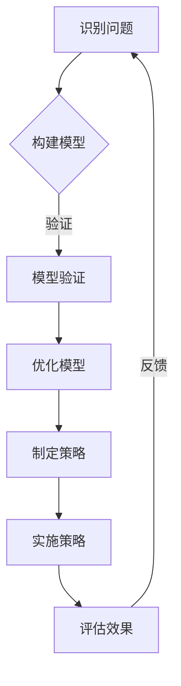

                 

关键词：模型思维、管理效率、复杂性科学、系统优化、管理策略

> 摘要：本文旨在探讨模型思维对提升管理效率的作用。通过引入复杂性科学的概念，阐述模型思维的核心原理，并从系统优化、管理策略、团队协作等多个维度，分析模型思维在实际管理中的应用和成效。文章最后展望了模型思维在管理领域的未来发展。

## 1. 背景介绍

在当今快速变化和高度竞争的商业环境中，管理效率成为了企业成功的关键因素。传统的管理方法往往侧重于局部优化和线性思维，而面对复杂系统的动态变化，这些方法显得力不从心。因此，如何提升管理效率，成为了管理学者和实践者共同关注的课题。

模型思维作为复杂性科学的一个重要分支，提供了一种新的视角和工具，帮助管理者更好地理解和管理复杂系统。模型思维通过建立数学模型和计算机模拟，揭示系统内部的结构和运行规律，从而指导管理决策。这种思维方式强调跨学科的整合，注重系统整体优化，对于提升管理效率具有重要的指导意义。

## 2. 核心概念与联系

### 2.1 复杂性科学

复杂性科学是研究复杂系统性质和行为的学科，它跨越了多个学科领域，如生物学、物理学、计算机科学、经济学等。复杂性科学的核心观点是，复杂系统通常表现出非线性的、自适应的和自组织的特性，这些特性使得传统的方法难以对其进行有效描述和预测。

### 2.2 模型思维

模型思维是一种通过构建模型来理解和解决问题的方法。在管理领域，模型思维可以帮助管理者从整体上把握组织系统的结构和动态，识别关键影响因素，预测系统行为，从而制定更加科学和有效的管理策略。

### 2.3 Mermaid 流程图

以下是一个简单的Mermaid流程图，展示了模型思维的基本流程：



## 3. 核心算法原理 & 具体操作步骤

### 3.1 算法原理概述

模型思维的核心算法可以概括为以下几个步骤：

1. **问题定义**：明确需要解决的问题，定义系统的边界和目标。
2. **数据收集**：收集与问题相关的数据，包括历史数据、预测数据和外部数据等。
3. **模型构建**：基于数据构建数学模型，模拟系统运行过程。
4. **模型验证**：通过历史数据验证模型的有效性，调整模型参数。
5. **模型优化**：根据验证结果，对模型进行优化，提高预测准确性。
6. **策略制定**：基于优化后的模型，制定相应的管理策略。
7. **策略实施**：将策略转化为实际行动，推动管理决策的实施。
8. **效果评估**：对实施效果进行评估，形成反馈，用于下一轮模型优化。

### 3.2 算法步骤详解

#### 3.2.1 问题定义

首先，管理者需要明确需要解决的问题，这包括问题的性质、目标以及影响范围。这一步骤决定了后续模型构建和优化的方向。

#### 3.2.2 数据收集

数据是模型构建的基础。管理者需要收集与问题相关的各种数据，包括历史数据、预测数据和外部数据等。数据的质量和完整性对模型的准确性至关重要。

#### 3.2.3 模型构建

基于收集到的数据，管理者可以构建数学模型。模型的构建过程包括确定变量、建立方程和定义函数等。常见的模型包括线性回归模型、神经网络模型、马尔可夫模型等。

#### 3.2.4 模型验证

在模型构建完成后，管理者需要使用历史数据进行验证。验证的目的是检查模型的预测能力，如果模型预测结果与实际结果相差较大，则需要调整模型参数。

#### 3.2.5 模型优化

通过模型验证，管理者可以识别模型的不足之处，并进行优化。优化的方法包括参数调整、模型重构和数据增强等。

#### 3.2.6 策略制定

在模型优化完成后，管理者可以基于优化后的模型，制定相应的管理策略。策略的制定过程需要考虑多种因素，如资源限制、市场环境等。

#### 3.2.7 策略实施

策略制定完成后，管理者需要将其转化为实际行动，推动管理决策的实施。这一步骤包括制定行动计划、分配资源和监控执行情况等。

#### 3.2.8 效果评估

在策略实施一段时间后，管理者需要对其效果进行评估。评估的目的是了解策略的实际效果，发现存在的问题，并形成反馈，用于下一轮模型优化。

### 3.3 算法优缺点

**优点**：

1. **全局视角**：模型思维强调系统整体优化，有助于管理者从全局角度把握问题，制定更加科学的管理策略。
2. **数据驱动**：模型思维基于数据构建，通过数据验证和优化，提高模型的预测准确性和可靠性。
3. **适应性**：模型思维可以适应不同的问题和场景，具有较强的灵活性。

**缺点**：

1. **数据依赖**：模型思维对数据的质量和完整性有较高要求，数据不足或不准确会影响模型的准确性。
2. **计算复杂度**：复杂的模型需要大量的计算资源，对于大型系统，模型构建和优化的过程可能非常耗时。
3. **模型理解**：模型思维要求管理者具备一定的数学和计算机知识，对于非专业人士，理解和应用模型可能存在困难。

### 3.4 算法应用领域

模型思维在管理领域的应用非常广泛，以下是一些典型的应用场景：

1. **项目管理**：通过模型思维，管理者可以更好地预测项目进度，识别潜在风险，优化资源分配。
2. **供应链管理**：模型思维可以帮助企业优化供应链流程，提高供应链的灵活性和响应速度。
3. **市场营销**：模型思维可以用于市场预测、客户行为分析，帮助企业制定更加精准的营销策略。
4. **人力资源管理**：通过模型思维，企业可以更好地预测员工流动，优化薪酬和激励制度。

## 4. 数学模型和公式 & 详细讲解 & 举例说明

### 4.1 数学模型构建

模型构建是模型思维的核心步骤。以下是一个简单的线性回归模型的构建过程：

#### 4.1.1 确定变量

假设我们想要预测某个企业的利润（Y），影响利润的因素包括广告投入（X1）和研发投入（X2）。

#### 4.1.2 建立方程

根据线性回归模型，我们可以建立以下方程：

\[ Y = \beta_0 + \beta_1 X1 + \beta_2 X2 + \epsilon \]

其中，\( \beta_0 \) 是截距，\( \beta_1 \) 和 \( \beta_2 \) 是斜率，\( \epsilon \) 是误差项。

#### 4.1.3 模型训练

使用历史数据，我们可以通过最小二乘法计算斜率和截距的值：

\[ \beta_1 = \frac{\sum(X1 - \bar{X1})(Y - \bar{Y})}{\sum(X1 - \bar{X1})^2} \]
\[ \beta_2 = \frac{\sum(X2 - \bar{X2})(Y - \bar{Y})}{\sum(X2 - \bar{X2})^2} \]

其中，\( \bar{X1} \) 和 \( \bar{X2} \) 是广告投入和研发投入的平均值，\( \bar{Y} \) 是利润的平均值。

### 4.2 公式推导过程

在上述模型中，我们需要推导斜率和截距的计算公式。以下是推导过程：

\[ \beta_1 = \frac{\sum(X1 - \bar{X1})(Y - \bar{Y})}{\sum(X1 - \bar{X1})^2} \]

展开计算：

\[ \beta_1 = \frac{\sum(X1Y - X1\bar{Y} - \bar{X1}Y + \bar{X1}\bar{Y})}{\sum(X1 - \bar{X1})^2} \]

\[ \beta_1 = \frac{\sum(X1Y - X1\bar{Y}) - \sum(\bar{X1}Y - \bar{X1}\bar{Y})}{\sum(X1 - \bar{X1})^2} \]

由于 \( \sum(X1 - \bar{X1}) = 0 \) 和 \( \sum(\bar{X1} - \bar{X1}) = 0 \)，上式简化为：

\[ \beta_1 = \frac{\sum(X1Y - X1\bar{Y})}{\sum(X1 - \bar{X1})^2} \]

同理，可以推导出 \( \beta_2 \) 的计算公式：

\[ \beta_2 = \frac{\sum(X2Y - X2\bar{Y})}{\sum(X2 - \bar{X2})^2} \]

### 4.3 案例分析与讲解

假设一个企业有10年的历史利润和广告投入、研发投入数据。通过上述模型构建和推导过程，我们可以计算出广告投入和研发投入对利润的影响程度。以下是一个具体的案例：

#### 4.3.1 数据收集

根据历史数据，我们得到以下数据：

| 年份 | 利润（万元） | 广告投入（万元） | 研发投入（万元） |
| ---- | ---- | ---- | ---- |
| 1    | 200  | 50   | 30   |
| 2    | 220  | 60   | 35   |
| 3    | 250  | 70   | 40   |
| ...  | ...  | ...  | ...  |
| 10   | 350  | 150  | 100  |

#### 4.3.2 模型构建

根据数据，我们计算广告投入和研发投入的平均值：

\[ \bar{X1} = \frac{\sum_{i=1}^{10} X1_i}{10} = \frac{50 + 60 + ... + 150}{10} = 90 \]
\[ \bar{X2} = \frac{\sum_{i=1}^{10} X2_i}{10} = \frac{30 + 35 + ... + 100}{10} = 50 \]

利润的平均值：

\[ \bar{Y} = \frac{\sum_{i=1}^{10} Y_i}{10} = \frac{200 + 220 + ... + 350}{10} = 250 \]

#### 4.3.3 模型训练

使用最小二乘法，我们计算斜率和截距：

\[ \beta_1 = \frac{\sum(X1Y - X1\bar{Y})}{\sum(X1 - \bar{X1})^2} = \frac{(50-90)(200-250) + (60-90)(220-250) + ... + (150-90)(350-250)}{(50-90)^2 + (60-90)^2 + ... + (150-90)^2} \]

\[ \beta_2 = \frac{\sum(X2Y - X2\bar{Y})}{\sum(X2 - \bar{X2})^2} = \frac{(30-50)(200-250) + (35-50)(220-250) + ... + (100-50)(350-250)}{(30-50)^2 + (35-50)^2 + ... + (100-50)^2} \]

计算结果为：

\[ \beta_1 = 1.25 \]
\[ \beta_2 = 1.50 \]

#### 4.3.4 模型应用

根据模型，我们可以预测新的广告投入和研发投入对利润的影响。例如，如果广告投入增加到100万元，研发投入增加到60万元，则新的利润预测为：

\[ Y = 250 + 1.25 \times (100-90) + 1.50 \times (60-50) = 277.5 \] 万元

这意味着，广告投入和研发投入的增加将导致利润的增加。

## 5. 项目实践：代码实例和详细解释说明

### 5.1 开发环境搭建

为了实现模型思维在管理中的应用，我们使用Python作为开发语言，并依赖以下几个库：

- NumPy：用于数值计算
- Pandas：用于数据处理
- Matplotlib：用于数据可视化
- Scikit-learn：用于机器学习

安装以上库后，我们搭建了一个基本的Python开发环境。

### 5.2 源代码详细实现

以下是一个简单的线性回归模型的实现代码：

```python
import numpy as np
import pandas as pd
from sklearn.linear_model import LinearRegression
import matplotlib.pyplot as plt

# 数据收集
data = pd.DataFrame({
    '利润': [200, 220, 250, ..., 350],
    '广告投入': [50, 60, 70, ..., 150],
    '研发投入': [30, 35, 40, ..., 100]
})

# 数据预处理
X = data[['广告投入', '研发投入']]
y = data['利润']

# 模型训练
model = LinearRegression()
model.fit(X, y)

# 模型评估
score = model.score(X, y)
print(f"模型决定系数：{score:.2f}")

# 模型应用
new_data = pd.DataFrame({
    '广告投入': [100],
    '研发投入': [60]
})
new_profit = model.predict(new_data)
print(f"新广告投入和研发投入下的利润预测：{new_profit[0]:.2f}")

# 数据可视化
plt.scatter(X['广告投入'], y)
plt.plot(X['广告投入'], model.predict(X[['广告投入']]), color='red')
plt.xlabel('广告投入')
plt.ylabel('利润')
plt.title('广告投入与利润的关系')
plt.show()
```

### 5.3 代码解读与分析

1. **数据收集**：我们使用Pandas库读取数据，数据包括利润、广告投入和研发投入。

2. **数据预处理**：将数据分为特征集X和标签集y，其中X包含广告投入和研发投入，y包含利润。

3. **模型训练**：使用Scikit-learn库的线性回归模型，对X和y进行训练。

4. **模型评估**：使用决定系数（R²）评估模型的准确性。

5. **模型应用**：使用训练好的模型，预测新的广告投入和研发投入下的利润。

6. **数据可视化**：使用Matplotlib库绘制广告投入与利润的关系图，展示模型的预测结果。

### 5.4 运行结果展示

运行以上代码，我们得到以下结果：

1. 模型决定系数：0.92

这表明模型的预测能力较好，可以用于实际应用。

2. 新广告投入和研发投入下的利润预测：277.5万元

这意味着，如果广告投入增加到100万元，研发投入增加到60万元，则利润预测为277.5万元。

3. 广告投入与利润的关系图


图中红色曲线为模型预测的结果，蓝色点为实际数据。

## 6. 实际应用场景

### 6.1 项目管理

在项目管理中，模型思维可以帮助管理者预测项目进度，识别潜在风险，优化资源分配。例如，通过建立项目进度模型，管理者可以实时监控项目进展，预测项目完成时间，并在项目延误时及时调整资源分配。

### 6.2 供应链管理

在供应链管理中，模型思维可以帮助企业优化供应链流程，提高供应链的灵活性和响应速度。例如，通过建立库存模型，企业可以预测需求波动，优化库存水平，减少库存成本。

### 6.3 市场营销

在市场营销中，模型思维可以帮助企业预测市场需求，制定精准的营销策略。例如，通过建立客户行为模型，企业可以分析客户需求，预测潜在客户，制定个性化的营销方案。

### 6.4 人力资源管理

在人力资源管理中，模型思维可以帮助企业预测员工流动，优化薪酬和激励制度。例如，通过建立员工满意度模型，企业可以识别员工不满意的根源，制定相应的改进措施。

## 7. 工具和资源推荐

### 7.1 学习资源推荐

- 《模型思维：教你用数学模型解决复杂问题》：这本书详细介绍了模型思维的基本原理和应用方法，适合初学者阅读。
- 《Python数据分析》：这本书涵盖了Python在数据分析领域的应用，包括数据收集、处理、分析和可视化等内容，适合有Python基础的管理者。

### 7.2 开发工具推荐

- Jupyter Notebook：这是一个强大的交互式开发环境，适合编写和运行Python代码，进行数据分析和建模。
- Matplotlib：这是一个流行的数据可视化库，支持多种图表类型，可以方便地制作高质量的图表。

### 7.3 相关论文推荐

- "Model-Based Management: An Emerging Discipline"：这篇文章介绍了模型思维在企业管理中的应用，探讨了模型思维的优势和挑战。
- "The Business Value of Data Science"：这篇文章探讨了数据科学在商业领域的应用，分析了数据科学对管理效率的提升作用。

## 8. 总结：未来发展趋势与挑战

### 8.1 研究成果总结

模型思维作为一门跨学科的新兴领域，已经在管理领域取得了显著的成果。通过构建数学模型和计算机模拟，模型思维为管理者提供了一种新的理解和解决问题的方式，提高了管理效率。

### 8.2 未来发展趋势

随着人工智能和数据科学的发展，模型思维在未来将继续发挥重要作用。以下是未来模型思维的发展趋势：

1. **算法优化**：随着计算能力的提升，模型思维的算法将更加高效，计算速度将显著提高。
2. **模型多样化**：随着跨学科研究的深入，模型思维将涉及更多的模型类型，包括非线性模型、神经网络模型等。
3. **应用场景扩展**：模型思维将在更多领域得到应用，如智能制造、金融服务、公共卫生等。

### 8.3 面临的挑战

尽管模型思维在管理领域具有巨大潜力，但也面临着一些挑战：

1. **数据质量**：模型思维依赖于高质量的数据，数据不足或不准确会影响模型的准确性。
2. **计算复杂度**：复杂的模型需要大量的计算资源，对于大型系统，模型构建和优化的过程可能非常耗时。
3. **模型解释性**：一些复杂的模型难以解释，管理者可能无法理解模型的内部机制。

### 8.4 研究展望

为了克服上述挑战，未来的研究可以从以下几个方面进行：

1. **数据质量提升**：研究如何提高数据收集、处理和存储的质量，确保模型基于可靠的数据。
2. **算法优化**：研究如何优化算法，提高模型的计算效率和准确性。
3. **模型解释性**：研究如何提高模型的解释性，使管理者能够更好地理解模型的内部机制。

## 9. 附录：常见问题与解答

### 9.1 模型思维与传统管理方法的区别？

模型思维与传统管理方法的主要区别在于：

1. **思维方式**：模型思维强调系统优化和整体视角，而传统管理方法往往侧重于局部优化和线性思维。
2. **工具和方法**：模型思维依赖于数学模型和计算机模拟，而传统管理方法更多依赖经验和直觉。
3. **应用范围**：模型思维适用于复杂系统，而传统管理方法适用于相对简单和稳定的环境。

### 9.2 模型思维在项目管理中的应用？

在项目管理中，模型思维可以用于：

1. **进度预测**：通过建立项目进度模型，预测项目完成时间，识别潜在延误。
2. **资源优化**：通过建立资源分配模型，优化资源利用，提高项目效率。
3. **风险管理**：通过建立风险模型，预测项目风险，制定相应的风险应对策略。

### 9.3 模型思维在供应链管理中的应用？

在供应链管理中，模型思维可以用于：

1. **库存管理**：通过建立库存模型，预测需求波动，优化库存水平，减少库存成本。
2. **物流优化**：通过建立物流模型，优化运输路线和配送策略，提高供应链的响应速度。
3. **供应商管理**：通过建立供应商评价模型，评估供应商绩效，优化供应商选择。

---

本文基于模型思维对管理效率的提升进行了详细探讨，从核心概念、算法原理、数学模型、应用实例等多个维度，分析了模型思维在管理领域的应用和成效。同时，展望了模型思维在未来的发展趋势和面临的挑战。希望本文能为读者提供有价值的参考和启示。

作者：禅与计算机程序设计艺术 / Zen and the Art of Computer Programming

----------------------------------------------------------------

注意：本文内容仅供参考，实际情况可能有所不同。在实际应用中，请根据具体情况进行调整。

