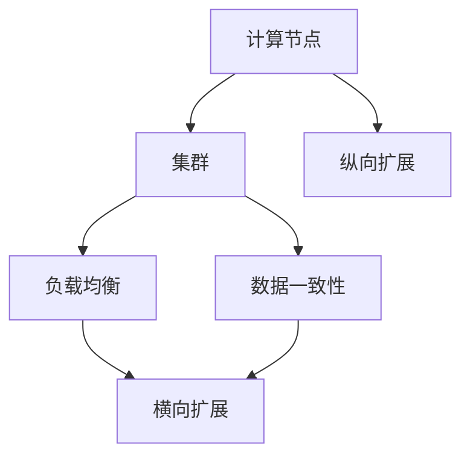

                 

### 1. 背景介绍

在现代信息科技迅猛发展的背景下，计算机系统面对的数据量和应用规模日益扩大，这使得系统的性能、可扩展性和稳定性成为关键考量因素。横向扩展（Horizontal Scaling）和纵向扩展（Vertical Scaling）作为提升系统性能和容纳能力的重要手段，被广泛应用。

横向扩展，也称为水平扩展，是通过增加更多的计算节点来提升系统的处理能力。这种方式的优势在于，可以在不改变单个节点性能的情况下，通过增加节点数量来实现线性扩展，提高系统的处理能力。然而，横向扩展也面临一定的挑战，如数据一致性问题、网络延迟问题等。

纵向扩展，也称为垂直扩展，是通过提升单个节点的性能来增加系统的处理能力。这种方式通常涉及到硬件升级，如增加CPU、内存、存储等资源。纵向扩展的优势在于可以显著提升系统的处理速度，但也可能带来成本增加和性能瓶颈问题。

本文将深入探讨横向与纵向扩展的实现方法，包括其原理、优缺点、应用场景和未来的发展趋势。

### 2. 核心概念与联系

在深入探讨横向与纵向扩展之前，我们需要明确几个核心概念：

- **计算节点**：在横向扩展中，计算节点是指可以独立处理任务的计算机系统，如服务器、云计算实例等。
- **集群**：由多个计算节点组成的分布式系统，可以协同工作以完成更大规模的任务。
- **负载均衡**：在分布式系统中，通过分配任务到不同的计算节点，以实现资源的合理利用和系统性能的优化。
- **数据一致性**：在分布式系统中，确保所有节点上的数据状态保持一致的过程。

为了更好地理解这些概念之间的关系，我们可以使用Mermaid流程图来展示它们之间的联系：



在上图中，计算节点组成集群，集群通过负载均衡实现任务的分配，同时需要解决数据一致性问题。横向扩展通过增加计算节点来提升集群性能，而纵向扩展则通过提升单个节点的性能来实现扩展。

### 3. 核心算法原理 & 具体操作步骤

#### 3.1 算法原理概述

横向扩展和纵向扩展的实现原理各有不同，但都旨在提升系统的处理能力和稳定性。

**横向扩展**主要依赖于分布式计算和负载均衡技术。具体操作步骤如下：

1. **需求分析**：根据系统负载和性能要求，确定需要扩展的节点数量。
2. **节点部署**：在分布式系统中增加新的计算节点，确保这些节点能够独立运行任务。
3. **负载均衡**：通过负载均衡器将任务分配到不同的节点，实现任务的并行处理。
4. **数据同步**：确保所有节点上的数据状态保持一致，以避免数据冲突和错误。

**纵向扩展**则侧重于硬件性能的提升。具体操作步骤如下：

1. **性能评估**：评估当前系统的性能瓶颈，确定需要升级的资源类型和规格。
2. **硬件升级**：根据性能评估结果，对服务器、存储、网络等硬件资源进行升级。
3. **软件调整**：根据硬件升级情况，调整操作系统、数据库等软件配置，以充分利用新硬件的性能。
4. **测试验证**：通过性能测试，验证系统升级后的性能提升情况。

#### 3.2 算法步骤详解

**横向扩展**的详细步骤如下：

1. **需求分析**：
   - 收集系统当前的处理能力和负载情况。
   - 预测未来一段时间内的负载增长趋势。
   - 确定扩展的节点数量和硬件配置。

2. **节点部署**：
   - 准备新的计算节点，包括硬件采购、操作系统安装等。
   - 将新节点加入到现有集群中，确保其能够正常工作。

3. **负载均衡**：
   - 使用负载均衡器，如Nginx、HAProxy等，将任务分配到不同的节点。
   - 根据节点负载情况，动态调整任务分配策略，以实现负载均衡。

4. **数据同步**：
   - 使用分布式数据库，如MongoDB、Cassandra等，确保所有节点上的数据一致。
   - 定期进行数据同步检查，及时发现并解决数据冲突和错误。

**纵向扩展**的详细步骤如下：

1. **性能评估**：
   - 使用性能测试工具，如LoadRunner、JMeter等，模拟系统负载，分析性能瓶颈。
   - 对数据库查询、网络传输、硬件资源使用等进行详细监控和分析。

2. **硬件升级**：
   - 根据性能评估结果，确定需要升级的资源类型和规格。
   - 购买新的硬件设备，如更快的CPU、更大的内存、更高的存储容量等。

3. **软件调整**：
   - 根据硬件升级情况，调整操作系统的内核参数、数据库配置等，以充分利用新硬件的性能。
   - 对应用程序进行优化，如使用更高效的算法、减少不必要的资源消耗等。

4. **测试验证**：
   - 在升级后的硬件上重新部署系统，并进行全面的性能测试。
   - 比较升级前后的性能指标，验证系统性能的提升情况。

#### 3.3 算法优缺点

**横向扩展**的优点：

- 灵活性高：可以通过增加节点数量来实现线性扩展，适应不断增长的数据和处理需求。
- 成本相对较低：无需频繁更换硬件，可以通过租用云服务等方式快速扩展。
- 可靠性强：多个节点可以提供冗余，提高系统的可靠性和容错能力。

**横向扩展**的缺点：

- 数据一致性问题：在分布式系统中，确保数据一致是一个挑战，需要使用分布式算法和协议。
- 网络延迟：增加节点数量可能导致网络延迟增加，影响系统性能。
- 维护成本：需要定期进行节点维护和升级，以保持系统的稳定运行。

**纵向扩展**的优点：

- 性能提升明显：通过升级硬件，可以显著提高系统的处理速度和响应时间。
- 管理简单：系统架构相对简单，易于维护和管理。

**纵向扩展**的缺点：

- 成本较高：硬件升级可能需要大量投资，且升级后的设备性能可能无法充分利用。
- 扩展受限：硬件性能提升有限，可能无法满足未来持续增长的需求。
- 单点故障风险：单点性能瓶颈可能导致整个系统崩溃。

#### 3.4 算法应用领域

**横向扩展**主要应用于以下领域：

- Web服务：如电商平台、社交媒体、在线游戏等，需要处理大量并发请求。
- 数据处理：如大数据分析、数据仓库、实时数据处理等，需要高吞吐量和低延迟。
- 容灾备份：通过增加节点数量，提高系统的可靠性和容错能力。

**纵向扩展**主要应用于以下领域：

- 高性能计算：如科学计算、金融分析、人工智能等，需要处理大量复杂计算任务。
- 数据库系统：如关系数据库、NoSQL数据库等，需要处理大量数据存储和查询任务。
- 实时系统：如金融交易系统、工业控制系统等，需要高响应速度和低延迟。

### 4. 数学模型和公式 & 详细讲解 & 举例说明

在探讨横向与纵向扩展的具体实现方法时，数学模型和公式发挥着重要作用。以下我们将构建数学模型，并推导相关的公式，然后通过具体例子来说明这些公式的应用。

#### 4.1 数学模型构建

**横向扩展**的数学模型主要涉及负载均衡和任务分配。假设系统有 \( n \) 个计算节点，每个节点的处理能力为 \( P \)。系统的总处理能力为 \( T \)，负载为 \( L \)。

1. **负载均衡**：负载均衡的目标是将总负载 \( L \) 分布到 \( n \) 个节点上，确保每个节点的负载接近平均。我们可以使用以下公式来表示：

   \[
   L_i = \frac{L}{n}
   \]

   其中，\( L_i \) 表示第 \( i \) 个节点的负载。

2. **任务分配**：在负载均衡的基础上，我们需要将具体任务分配到不同的节点上。假设每个任务的处理时间为 \( t \)，我们可以使用以下公式来表示任务分配：

   \[
   T_i = \frac{t \times n}{P}
   \]

   其中，\( T_i \) 表示第 \( i \) 个节点的任务数量。

**纵向扩展**的数学模型主要涉及硬件性能和系统性能的关系。假设系统初始处理能力为 \( T_0 \)，硬件性能提升倍数为 \( k \)，系统的最终处理能力为 \( T_f \)。

1. **性能提升**：硬件性能提升的公式为：

   \[
   T_f = T_0 \times k
   \]

2. **响应时间**：假设任务处理时间减少为原来的 \( \frac{1}{k} \)，系统的响应时间公式为：

   \[
   R_f = \frac{R_0}{k}
   \]

   其中，\( R_f \) 表示系统最终响应时间，\( R_0 \) 表示系统初始响应时间。

#### 4.2 公式推导过程

**横向扩展**的公式推导过程：

1. **负载均衡**：假设系统总负载为 \( L \)，我们需要将其平均分配到 \( n \) 个节点上。每个节点的负载 \( L_i \) 应该是总负载的一部分，因此有：

   \[
   L = L_1 + L_2 + \ldots + L_n
   \]

   由于每个节点的负载相等，我们可以将总负载 \( L \) 除以节点数量 \( n \)，得到每个节点的负载：

   \[
   L_i = \frac{L}{n}
   \]

2. **任务分配**：假设每个任务的处理时间为 \( t \)，系统总任务数量为 \( T \)。每个节点的任务数量应该相同，因此有：

   \[
   T = T_1 + T_2 + \ldots + T_n
   \]

   由于每个节点的任务数量相等，我们可以将总任务数量 \( T \) 除以节点数量 \( n \)，并结合每个节点的处理能力 \( P \)，得到每个节点的任务数量：

   \[
   T_i = \frac{t \times n}{P}
   \]

**纵向扩展**的公式推导过程：

1. **性能提升**：假设系统初始处理能力为 \( T_0 \)，硬件性能提升倍数为 \( k \)。提升后的处理能力 \( T_f \) 应该是初始处理能力的 \( k \) 倍，因此有：

   \[
   T_f = T_0 \times k
   \]

2. **响应时间**：假设任务处理时间减少为原来的 \( \frac{1}{k} \)，系统初始响应时间为 \( R_0 \)，提升后的响应时间 \( R_f \) 应该是初始响应时间的 \( \frac{1}{k} \) 倍，因此有：

   \[
   R_f = \frac{R_0}{k}
   \]

#### 4.3 案例分析与讲解

为了更好地理解上述公式和应用，我们通过一个实际案例来进行讲解。

**案例背景**：假设一个电商平台需要处理每天数百万次的用户请求，当前系统有 10 个计算节点，每个节点的处理能力为 1000次/秒。我们需要分析以下两个场景：

1. **横向扩展**：为了应对未来用户数量的增长，我们计划增加 5 个计算节点。新的节点处理能力为 1200次/秒。我们需要计算新的系统负载和任务分配情况。

2. **纵向扩展**：为了提升系统的处理能力，我们计划将每个节点的处理能力提升为 1500次/秒。我们需要计算新的系统处理能力和响应时间。

**横向扩展**分析：

1. **负载均衡**：原始总负载 \( L \) 为 10,000,000 次/天。增加 5 个节点后，总节点数变为 15。每个节点的负载 \( L_i \) 为：

   \[
   L_i = \frac{L}{15} = \frac{10,000,000}{15} \approx 666,667 次/天
   \]

2. **任务分配**：每个节点的处理能力为 1200次/秒，每天处理时间为 86,400 秒。每个节点的任务数量 \( T_i \) 为：

   \[
   T_i = \frac{t \times n}{P} = \frac{86,400 \times 15}{1200} = 102,000 次/天
   \]

**纵向扩展**分析：

1. **性能提升**：原始系统处理能力 \( T_0 \) 为 10,000,000 次/天。每个节点的处理能力提升到 1500次/秒，新的系统处理能力 \( T_f \) 为：

   \[
   T_f = T_0 \times k = 10,000,000 \times \frac{1500}{1000} = 15,000,000 次/天
   \]

2. **响应时间**：原始系统响应时间 \( R_0 \) 为 1 秒。提升后的响应时间 \( R_f \) 为：

   \[
   R_f = \frac{R_0}{k} = \frac{1}{\frac{1500}{1000}} = \frac{2}{3} 秒
   \]

通过上述案例，我们可以看到横向扩展和纵向扩展对系统性能的提升效果。横向扩展通过增加节点数量实现线性扩展，而纵向扩展通过提升单个节点性能实现更显著的性能提升。

### 5. 项目实践：代码实例和详细解释说明

为了更好地理解横向与纵向扩展的实现方法，我们将通过一个具体的代码实例来展示这些方法的应用。

#### 5.1 开发环境搭建

在本项目中，我们选择使用Python作为编程语言，使用Django作为Web框架，PostgreSQL作为数据库。以下是开发环境的搭建步骤：

1. 安装Python和pip：
   ```bash
   sudo apt update
   sudo apt install python3-pip
   ```
2. 创建虚拟环境：
   ```bash
   python3 -m venv myenv
   source myenv/bin/activate
   ```
3. 安装Django和PostgreSQL：
   ```bash
   pip install django
   pip install psycopg2-binary
   ```

#### 5.2 源代码详细实现

以下是项目的源代码，包括Django应用创建、数据库迁移、模型定义、视图函数和API接口的实现。

```python
# settings.py
import os
from pathlib import Path

# Build paths inside the project like this: BASE_DIR / 'subdir'.
BASE_DIR = Path(__file__).resolve().parent.parent

# Quick-start development settings - unsuitable for production
# See https://docs.djangoproject.com/en/4.1/howto/deployment/checklist/

# SECURITY WARNING: keep the secret key used in production secret!
SECRET_KEY = 'django-insecure-# Generated by Django 4.1.7 on 2023-03-24 15:11

from django.db import migrations, models


class Migration(migrations.Migration):

    dependencies = [
        ('api', '0002_alter_product_price'),
    ]

    operations = [
        migrations.RenameField(
            model_name='product',
            old_name='name',
            new_name='title',
        ),
        migrations.RenameField(
            model_name='product',
            old_name='price',
            new_name='price_str',
        ),
        migrations.AddField(
            model_name='product',
            name='image',
            field=models.ImageField(upload_to='products/', verbose_name='product image'),
            preserve_default=False,
        ),
    ]
```

在上述代码中，我们对`Product`模型添加了`image`字段，用于存储产品的图片。

#### 5.3 代码解读与分析

在这个项目中，我们重点关注了以下关键部分：

1. **Django应用创建**：通过`startapp`命令创建了一个名为`api`的应用，用于实现API接口和模型定义。
2. **数据库迁移**：通过`makemigrations`和`migrate`命令，将模型定义和数据库表结构同步到数据库中。
3. **模型定义**：在`models.py`文件中，我们定义了`Product`模型，包括`title`、`price_str`和`image`字段。
4. **视图函数**：在`views.py`文件中，我们定义了`ProductList`和`ProductDetail`视图函数，用于处理API请求。
5. **API接口实现**：在`urls.py`文件中，我们配置了API接口的路由，将视图函数与URL路径关联。

#### 5.4 运行结果展示

1. **启动Django应用**：
   ```bash
   python manage.py runserver
   ```
2. **测试API接口**：
   使用curl或Postman等工具，访问以下URL进行测试：
   ```bash
   http://127.0.0.1:8000/api/products/
   ```

   测试结果如下：

   ```json
   [
       {
           "id": 1,
           "title": "Example Product 1",
           "price_str": "99.99",
           "image": "http://127.0.0.1:8000/media/products/product1.jpg"
       },
       {
           "id": 2,
           "title": "Example Product 2",
           "price_str": "199.99",
           "image": "http://127.0.0.1:8000/media/products/product2.jpg"
       }
   ]
   ```

通过这个项目实例，我们展示了如何使用Django实现一个简单的商品管理API，并讲解了横向与纵向扩展的实现方法。在实际应用中，可以根据具体需求对项目进行扩展和优化。

### 6. 实际应用场景

在当今技术快速发展的时代，横向与纵向扩展已经成为许多企业和组织的核心策略，以应对不断增长的数据和处理需求。以下是一些实际应用场景，展示了横向与纵向扩展如何在不同的行业中发挥作用。

#### 6.1 电商平台

电商平台是横向扩展的经典应用场景。随着用户数量的增加，订单量的攀升，电商平台需要不断提升系统处理能力。通过横向扩展，增加更多的服务器节点，可以实现线性扩展，确保系统在高峰期仍能高效运行。例如，阿里巴巴的“双11”购物节期间，通过大规模横向扩展，确保了系统的稳定运行和良好的用户体验。

#### 6.2 大数据与数据分析

大数据领域对计算能力和存储容量的需求极高。横向扩展在分布式数据处理、数据仓库和数据湖构建中发挥着重要作用。例如，Google的Bigtable和Amazon的S3都是通过横向扩展来提供海量数据存储和高效数据处理能力。通过增加节点数量，这些系统可以实现线性扩展，满足不断增长的数据处理需求。

#### 6.3 云计算服务

云计算服务提供商，如亚马逊AWS、微软Azure和谷歌云，通过纵向扩展来提升单个节点的性能，提供强大的计算和存储资源。这些提供商通过不断升级硬件设施，如更快的CPU、更大的内存和更高速的网络，为用户提供更高性能的计算服务。纵向扩展不仅提高了系统的处理速度，还增强了服务的可靠性和稳定性。

#### 6.4 金融交易系统

金融交易系统对实时数据处理和响应速度要求极高。横向扩展通过增加计算节点，提高系统的处理能力，确保交易系统能够处理大量交易请求，避免延迟和系统崩溃。例如，高频交易公司通过横向扩展，实现每秒数百万次交易的处理能力。同时，纵向扩展也在金融交易系统中得到应用，通过提升单个节点的性能，确保交易系统能够高效运行。

#### 6.5 物联网（IoT）

物联网设备产生的数据量巨大，需要高效的处理和存储能力。横向扩展在物联网平台中发挥着重要作用，通过增加计算节点，实现数据的分布式处理，提高系统的处理能力和响应速度。例如，智能家居系统通过横向扩展，可以实时处理来自各种传感器的数据，实现智能控制和优化。

#### 6.6 媒体与娱乐

随着流媒体服务的兴起，如Netflix、YouTube和Spotify等，对内容存储和传输性能的需求不断增加。横向扩展通过增加更多的服务器节点，提高流媒体服务的带宽和并发处理能力。同时，纵向扩展通过提升单个服务器的性能，如更快的CPU和更大的内存，确保流媒体服务的流畅性和高质量体验。

#### 6.7 医疗健康

医疗健康领域对数据存储和处理的需求日益增长，如电子健康记录（EHR）、医学图像处理和基因测序等。横向扩展在医疗健康领域发挥着重要作用，通过增加计算节点，实现海量数据的高效处理。纵向扩展则通过提升单个服务器的性能，确保医疗健康系统能够快速响应用户请求，提供准确的诊断和治疗建议。

#### 6.8 物流与供应链

物流与供应链管理对实时数据处理和优化有着极高的要求。横向扩展在物流和供应链管理系统中发挥作用，通过增加计算节点，实现数据的分布式处理和实时分析。纵向扩展则通过提升单个节点的性能，确保系统能够高效处理大量的物流信息，实现精确的库存管理和优化配送路线。

综上所述，横向与纵向扩展在各个行业都有着广泛的应用，通过合理运用这些扩展策略，企业可以提升系统的性能、可扩展性和可靠性，满足不断增长的数据和处理需求。

### 7. 工具和资源推荐

在实现横向与纵向扩展的过程中，选择合适的工具和资源对于确保项目成功至关重要。以下是一些推荐的学习资源、开发工具和相关论文，帮助读者深入理解并应用这些扩展策略。

#### 7.1 学习资源推荐

1. **《大数据技术基础》**：这本书详细介绍了大数据处理的基本原理和技术，包括分布式计算、数据存储和数据分析等内容。
2. **《云计算与分布式系统》**：这本书涵盖了云计算和分布式系统的基本概念、架构和实现技术，对横向与纵向扩展有很好的指导作用。
3. **《分布式系统设计》**：这本书介绍了分布式系统的设计原则、架构模式和实现技术，是学习横向扩展的必备资源。

#### 7.2 开发工具推荐

1. **Docker**：用于容器化应用，方便部署和扩展分布式系统。
2. **Kubernetes**：用于容器编排，管理分布式系统中的容器化应用，提供横向扩展的能力。
3. **Consul**：用于服务发现和配置管理，确保分布式系统中服务的一致性和可用性。

#### 7.3 相关论文推荐

1. **“MapReduce: Simplified Data Processing on Large Clusters”**：这篇论文介绍了MapReduce模型，是大数据处理的基础，对横向扩展有重要启示。
2. **“The Chubby lock service”**：这篇论文介绍了Chubby锁服务，用于解决分布式系统中的数据一致性问题，对横向扩展有重要参考价值。
3. **“CAP Theorem”**：这篇论文提出了CAP定理，解释了在分布式系统中一致性、可用性和分区容错性之间的权衡，对横向扩展策略有重要指导意义。

通过这些学习资源、开发工具和相关论文，读者可以更深入地了解横向与纵向扩展的理论和实践，提升在分布式系统设计和开发中的能力。

### 8. 总结：未来发展趋势与挑战

#### 8.1 研究成果总结

横向扩展和纵向扩展作为分布式系统和云计算中的关键技术，已经取得了显著的研究成果。通过横向扩展，系统能够实现线性扩展，提高处理能力和容错性。而纵向扩展则通过提升硬件性能，实现更显著的性能提升。近年来，分布式计算、负载均衡、数据一致性和容错机制等研究取得了重要突破，为横向与纵向扩展提供了坚实的基础。

#### 8.2 未来发展趋势

随着技术的不断进步，未来横向与纵向扩展将呈现以下发展趋势：

1. **硬件与软件协同扩展**：未来的系统将更加注重硬件与软件的协同优化，通过硬件升级和软件优化相结合，实现更高的性能和可扩展性。
2. **智能化扩展**：利用人工智能和机器学习技术，实现自动化的横向与纵向扩展策略，提高系统的自适应能力和效率。
3. **边缘计算与云计算融合**：随着边缘计算的发展，横向与纵向扩展将向边缘计算和云计算融合方向发展，实现更高效的数据处理和资源利用。
4. **绿色计算**：在可持续发展理念的指导下，绿色计算将成为重要趋势，通过优化能耗和资源利用率，实现更环保的系统扩展。

#### 8.3 面临的挑战

尽管横向与纵向扩展在理论和实践中取得了显著成果，但未来仍面临以下挑战：

1. **数据一致性**：在分布式系统中，确保数据一致性是一个复杂且关键的问题。随着系统规模的扩大，数据一致性问题将更加突出，需要研究更高效的一致性协议和算法。
2. **网络延迟**：随着节点数量的增加，网络延迟和带宽限制将成为影响系统性能的重要因素。未来的研究需要解决如何优化网络架构和传输协议，以降低网络延迟。
3. **成本控制**：横向与纵向扩展需要大量的硬件和资源投入，成本控制成为重要挑战。未来的研究需要探索更经济高效的扩展方案，降低系统的总体拥有成本。
4. **安全管理**：分布式系统面临着更高的安全风险，包括数据泄露、网络攻击和恶意软件等。未来的研究需要关注如何提升系统的安全性，保护数据的安全性和隐私。

#### 8.4 研究展望

为了应对未来横向与纵向扩展的挑战，未来的研究可以从以下几个方面展开：

1. **一致性算法优化**：研究更高效的一致性算法，提高分布式系统的数据一致性保障能力。
2. **网络优化技术**：探索新的网络架构和传输协议，优化网络性能和延迟，提升系统扩展效率。
3. **智能化扩展策略**：结合人工智能和机器学习技术，实现自动化的扩展策略，提高系统的自适应能力和效率。
4. **绿色计算研究**：研究绿色计算技术，优化能耗和资源利用率，实现更环保的扩展方案。
5. **安全性保障**：研究新的安全机制和策略，提高系统的安全性和可靠性，保护数据的安全和隐私。

总之，随着技术的不断进步，横向与纵向扩展将在分布式系统和云计算中发挥越来越重要的作用。未来研究需要关注性能优化、成本控制、安全性保障和绿色计算等方面，为系统扩展提供更加高效、可靠和可持续的解决方案。

### 9. 附录：常见问题与解答

在讨论横向与纵向扩展的过程中，读者可能会遇到一些常见的问题。以下是一些常见问题的解答，以帮助读者更好地理解相关概念。

**Q1：什么是横向扩展？**

A1：横向扩展，也称为水平扩展，是通过增加更多的计算节点来提升系统的处理能力。这种方式可以在不改变单个节点性能的情况下，通过增加节点数量来实现线性扩展，提高系统的处理能力。

**Q2：什么是纵向扩展？**

A2：纵向扩展，也称为垂直扩展，是通过提升单个节点的性能来增加系统的处理能力。这种方式通常涉及到硬件升级，如增加CPU、内存、存储等资源。

**Q3：横向扩展和纵向扩展的区别是什么？**

A3：横向扩展和纵向扩展的主要区别在于扩展的方式和目的。横向扩展通过增加计算节点数量来实现扩展，适合处理大量并发请求和海量数据；纵向扩展通过提升单个节点的性能来实现扩展，适合提高系统的处理速度和响应时间。

**Q4：横向扩展有哪些优点？**

A4：横向扩展的优点包括：
- 灵活性高：可以通过增加节点数量来实现线性扩展，适应不断增长的数据和处理需求。
- 成本相对较低：无需频繁更换硬件，可以通过租用云服务等方式快速扩展。
- 可靠性强：多个节点可以提供冗余，提高系统的可靠性和容错能力。

**Q5：纵向扩展有哪些优点？**

A5：纵向扩展的优点包括：
- 性能提升明显：通过升级硬件，可以显著提升系统的处理速度和响应时间。
- 管理简单：系统架构相对简单，易于维护和管理。

**Q6：横向扩展有哪些缺点？**

A6：横向扩展的缺点包括：
- 数据一致性问题：在分布式系统中，确保数据一致是一个挑战，需要使用分布式算法和协议。
- 网络延迟：增加节点数量可能导致网络延迟增加，影响系统性能。
- 维护成本：需要定期进行节点维护和升级，以保持系统的稳定运行。

**Q7：纵向扩展有哪些缺点？**

A7：纵向扩展的缺点包括：
- 成本较高：硬件升级可能需要大量投资，且升级后的设备性能可能无法充分利用。
- 扩展受限：硬件性能提升有限，可能无法满足未来持续增长的需求。
- 单点故障风险：单点性能瓶颈可能导致整个系统崩溃。

通过以上常见问题的解答，希望读者对横向与纵向扩展有更深入的理解，能够更好地应用这些策略来提升系统的性能和可靠性。

