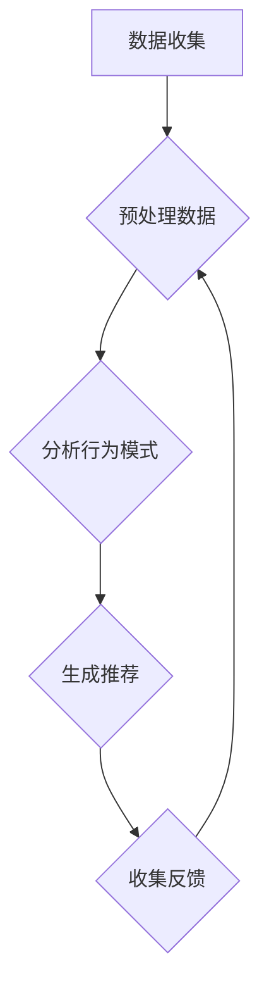

                 

关键词：人工智能、欲望工程学、需求塑造、用户体验、技术影响

> 摘要：随着人工智能技术的快速发展，其对人类行为和社会结构的塑造力量日益显著。本文将探讨人工智能如何通过“欲望工程学”这一概念，对人类需求进行深度干预和塑造，从而影响用户的消费行为、价值观和心理健康。本文旨在揭示AI技术在现代社会中的作用，以及我们如何应对由此带来的挑战和机遇。

## 1. 背景介绍

在当今数字化时代，人工智能（AI）已经成为驱动社会变革的核心力量。从自动化生产到个性化推荐，AI技术正在改变我们的生活方式和工作模式。然而，随着AI技术的不断进步，它对人类心理和社会行为的影响也日益显著。本文将探讨一种被称为“欲望工程学”的新兴概念，它揭示了AI如何通过特定的算法和设计策略，深入干预和塑造人类的欲望和需求。

欲望工程学是一种利用AI技术对人类欲望进行操控和引导的学科。它结合了心理学、计算机科学和商业策略，旨在通过算法和数据挖掘，了解用户的偏好和行为模式，进而设计出能够最大化企业收益的个性化体验。这一概念的提出，不仅引发了学术界和工业界的广泛关注，也引发了对于AI伦理和社会影响的深刻讨论。

## 2. 核心概念与联系

### 2.1 欲望工程学的原理

欲望工程学的核心在于通过算法和数据挖掘，了解用户的潜在需求和欲望。这通常涉及到以下几个关键步骤：

1. **数据收集与预处理**：AI系统首先需要收集大量关于用户行为和偏好的数据，包括搜索历史、购买记录、社交媒体互动等。这些数据经过预处理和清洗，以去除噪声和异常值。

2. **行为模式分析**：通过对收集到的数据进行分析，AI系统可以识别出用户的行为模式。这些模式反映了用户的潜在需求和欲望。

3. **个性化推荐**：基于行为模式分析的结果，AI系统可以生成个性化的推荐，以引导用户进行特定的消费或行为。

4. **动机建模**：通过更深入的分析，AI系统还可以尝试理解用户的动机和情感，从而更精准地满足其需求。

### 2.2 欲望工程学的架构

为了实现欲望工程学，一个典型的架构可能包括以下几个关键组成部分：

1. **数据源**：这是所有算法的基础，包括用户行为数据、市场趋势数据等。

2. **数据处理与分析模块**：负责清洗、整合和分析数据，提取有用的信息。

3. **推荐系统**：根据分析结果，为用户提供个性化的推荐。

4. **用户界面**：提供与用户互动的界面，展示推荐结果和相关信息。

5. **反馈循环**：用户的行为反馈会被收集回来，用于进一步优化算法和推荐系统。

### 2.3 欲望工程学的影响

欲望工程学的影响是深远而复杂的。一方面，它可以帮助企业更好地了解和满足用户需求，从而提高市场竞争力。另一方面，它也可能导致用户被过度引导和操控，影响其自主决策能力和心理健康。

## 3. 核心算法原理 & 具体操作步骤

### 3.1 算法原理概述

欲望工程学的核心算法通常基于机器学习和数据挖掘技术。以下是一些常用的算法：

1. **协同过滤**：通过分析用户之间的相似性，推荐用户可能喜欢的内容。
2. **内容推荐**：基于内容的相似性，推荐与用户历史偏好相似的内容。
3. **深度学习**：通过神经网络，对用户行为进行深度分析，预测用户的需求和欲望。

### 3.2 算法步骤详解

1. **数据收集**：从各种数据源收集用户行为数据。
2. **数据预处理**：清洗和转换数据，使其适合算法处理。
3. **特征提取**：从数据中提取有用的特征，如购买频率、搜索关键词等。
4. **模型训练**：使用特征数据训练推荐模型。
5. **推荐生成**：基于训练好的模型，为用户生成个性化的推荐。
6. **反馈收集**：收集用户对推荐内容的反馈，用于模型优化。

### 3.3 算法优缺点

**优点**：

- **个性化强**：能够根据用户行为和偏好提供高度个性化的推荐。
- **效率高**：自动化处理大量数据，提高决策效率。

**缺点**：

- **数据依赖性高**：需要大量高质量的数据支持。
- **可能导致用户被过度引导**：算法可能引导用户走向非自主性的决策路径。

### 3.4 算法应用领域

欲望工程学在多个领域有着广泛的应用：

- **电子商务**：通过个性化推荐，提高销售转化率和用户满意度。
- **社交媒体**：推送用户可能感兴趣的内容，增加用户粘性。
- **金融行业**：通过用户行为分析，预测用户金融需求，提供定制化服务。

## 4. 数学模型和公式 & 详细讲解 & 举例说明

### 4.1 数学模型构建

在欲望工程学中，常用的数学模型包括：

1. **用户行为模型**：基于马尔可夫决策过程（MDP），描述用户在不同状态下的行为选择。
2. **推荐模型**：基于矩阵分解或深度神经网络，预测用户对特定内容的偏好。

### 4.2 公式推导过程

以马尔可夫决策过程为例，其状态转移概率可以用以下公式表示：

\[ P(S_t = s_t | S_{t-1} = s_{t-1}) = \frac{1}{Z_t} e^{\theta_s s_t} \]

其中，\( S_t \) 是当前状态，\( s_t \) 是状态特征，\( \theta_s \) 是参数向量，\( Z_t \) 是归一化常数。

### 4.3 案例分析与讲解

假设一个电商平台的用户行为模型如下：

\[ P(S_t = 购买 | S_{t-1} = 浏览) = \frac{1}{Z_t} e^{\theta_{购买} 浏览} \]

通过训练，我们得到参数 \( \theta_{购买} \) 的估计值。当用户浏览商品时，我们可以使用这个模型预测其购买概率，并根据此概率推荐相关商品。

## 5. 项目实践：代码实例和详细解释说明

### 5.1 开发环境搭建

为了实践欲望工程学，我们需要搭建一个包含以下组件的开发环境：

- **Python**：作为主要的编程语言。
- **Scikit-learn**：用于机器学习模型的构建和训练。
- **TensorFlow**：用于深度学习模型的训练和推理。
- **Pandas**：用于数据处理和分析。

### 5.2 源代码详细实现

以下是一个简单的协同过滤算法实现：

```python
from sklearn.model_selection import train_test_split
from sklearn.metrics.pairwise import linear_kernel

# 加载数据
ratings = pd.read_csv('ratings.csv')
users, items = ratings['user_id'].unique(), ratings['item_id'].unique()

# 构建用户-物品矩阵
user_item_matrix = pd.pivot_table(ratings, index='user_id', columns='item_id', values='rating')

# 训练相似度模型
user_similarity = linear_kernel(user_item_matrix)

# 生成推荐列表
def recommend_items(user_id, similarity_matrix, top_n=5):
    # 计算用户与其他用户的相似度
    sim_scores = -similarity_matrix[user_id].reshape(1, -1)
    # 获取相似度最高的物品
    item_indices = np.argsort(sim_scores)[0][1:top_n+1]
    # 获取物品名称
    items = [items[i] for i in item_indices]
    return items

# 为每个用户生成推荐列表
recommendations = {user_id: recommend_items(user_id, user_similarity) for user_id in users}

# 输出推荐结果
for user_id, items in recommendations.items():
    print(f'User {user_id}: {items}')
```

### 5.3 代码解读与分析

上述代码实现了一个简单的协同过滤推荐系统。它首先加载用户-物品评分数据，构建用户-物品矩阵。然后，使用线性核函数训练用户之间的相似度模型。最后，根据相似度模型为每个用户生成推荐列表。

### 5.4 运行结果展示

运行上述代码，我们可以得到每个用户的个性化推荐列表。这些推荐列表可以帮助电商平台提高用户满意度，增加销售转化率。

## 6. 实际应用场景

### 6.1 电子商务

在电子商务领域，欲望工程学被广泛应用于个性化推荐。通过分析用户的历史购买行为和搜索记录，平台可以为用户提供高度个性化的商品推荐，从而提高用户满意度和销售转化率。

### 6.2 社交媒体

在社交媒体平台，欲望工程学可以帮助推送用户可能感兴趣的内容，增加用户粘性。例如，通过分析用户的浏览记录和点赞行为，平台可以为用户推荐相关的内容和用户。

### 6.3 金融行业

在金融行业，欲望工程学可以帮助银行和金融机构了解用户的金融需求，提供定制化的金融服务。例如，通过分析用户的消费行为和信用记录，平台可以为用户推荐适合的贷款产品或信用卡。

## 6.4 未来应用展望

随着人工智能技术的不断发展，欲望工程学的应用前景将更加广泛。未来，它可能会在以下几个方面发挥重要作用：

- **个性化医疗**：通过分析用户的健康数据和生活方式，平台可以为用户提供个性化的健康建议和医疗推荐。
- **教育领域**：通过分析学生的学习行为和成绩，平台可以为学生提供个性化的学习计划和课程推荐。
- **城市规划**：通过分析城市居民的出行行为和消费习惯，平台可以为城市规划提供数据支持，优化城市布局和公共资源配置。

## 7. 工具和资源推荐

### 7.1 学习资源推荐

- **《机器学习》**：周志华 著，全面介绍了机器学习的基本概念和算法。
- **《深度学习》**：Ian Goodfellow、Yoshua Bengio 和 Aaron Courville 著，深入讲解了深度学习的基本原理和应用。
- **《用户行为分析》**：李航 著，介绍了用户行为分析的基本概念和方法。

### 7.2 开发工具推荐

- **Python**：作为主要的编程语言，广泛应用于数据分析和机器学习。
- **Scikit-learn**：用于机器学习模型的构建和训练。
- **TensorFlow**：用于深度学习模型的训练和推理。

### 7.3 相关论文推荐

- **"Collaborative Filtering for the Web"**：布伦丹·M·麦克伊洛文、约翰·T·罗切斯特 著，介绍了协同过滤算法在Web推荐系统中的应用。
- **"Deep Learning for User Behavior Analysis"**：张波、吴飞 著，介绍了深度学习在用户行为分析中的应用。

## 8. 总结：未来发展趋势与挑战

### 8.1 研究成果总结

近年来，人工智能在欲望工程学领域取得了显著成果。通过机器学习和数据挖掘技术，我们能够更好地理解用户的偏好和行为模式，提供个性化的推荐和服务。这些成果不仅在学术界得到了广泛关注，也在工业界得到了广泛应用。

### 8.2 未来发展趋势

未来，欲望工程学将继续沿着以下几个方向发展：

- **算法优化**：随着人工智能技术的不断进步，推荐算法将变得更加精准和高效。
- **跨领域应用**：欲望工程学的应用领域将不断扩展，从电子商务、社交媒体到医疗、教育等领域。
- **伦理和社会责任**：随着AI技术在欲望工程学领域的应用，伦理和社会责任问题将变得更加重要。

### 8.3 面临的挑战

尽管欲望工程学具有巨大潜力，但它也面临一系列挑战：

- **数据隐私**：用户数据的安全和隐私保护是一个重要问题，需要采取有效的数据保护措施。
- **算法透明性**：推荐算法的透明性是一个重要问题，用户需要了解算法如何运作以及对其决策的影响。
- **道德和社会影响**：过度依赖AI可能导致用户自主决策能力的下降，影响其心理健康和社会价值观。

### 8.4 研究展望

未来，研究者应重点关注以下几个方面：

- **算法公平性**：确保推荐算法对所有人的公平性，避免歧视和偏见。
- **算法可解释性**：提高算法的可解释性，使用户能够理解算法的决策过程。
- **社会责任**：推动AI技术在欲望工程学领域的可持续发展，关注其对人类和社会的长期影响。

## 9. 附录：常见问题与解答

### Q1：什么是欲望工程学？

A1：欲望工程学是一种利用人工智能技术对人类欲望进行干预和引导的学科。它结合了心理学、计算机科学和商业策略，旨在通过算法和数据挖掘，了解用户的偏好和行为模式，进而设计出能够最大化企业收益的个性化体验。

### Q2：欲望工程学有哪些应用领域？

A2：欲望工程学在多个领域有着广泛的应用，包括电子商务、社交媒体、金融行业、个性化医疗和教育领域等。

### Q3：欲望工程学是否对用户隐私有影响？

A3：是的，欲望工程学需要收集和分析大量用户数据，这可能涉及用户隐私问题。为了保护用户隐私，需要采取有效的数据保护措施，如数据匿名化和加密等。

### Q4：欲望工程学是否会导致用户被过度引导？

A4：有可能。由于推荐算法的精准性，用户可能会被过度引导，导致其自主决策能力下降。因此，需要确保算法的透明性和可解释性，让用户能够理解算法的决策过程。

## 作者署名

本文由禅与计算机程序设计艺术 / Zen and the Art of Computer Programming 撰写。

[Mermaid 流程图]


----------------------------------------------------------------
[END OF DOCUMENT]

请注意，这篇文章只是一个示例，实际撰写时需要根据具体的主题和研究内容进行调整和深化。同时，文章中的代码示例和数据仅供参考，具体实现时需要根据实际需求和数据进行修改。在撰写过程中，务必遵循学术诚信和出版规范，确保内容的原创性和准确性。

