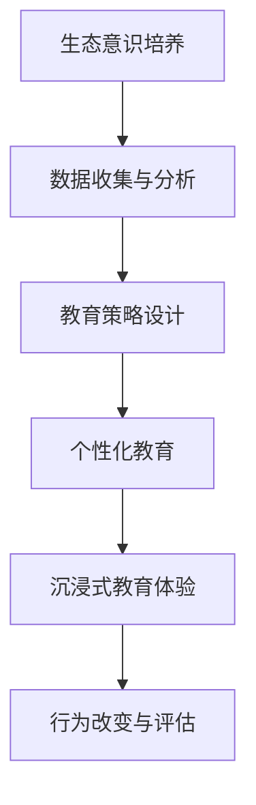

                 

关键词：AI，生态意识，可持续消费，教育，技术应用，行为改变

> 摘要：本文探讨如何利用人工智能技术培养人们的生态意识，推动可持续消费教育。通过分析生态意识的重要性，探讨AI在教育领域的应用，以及具体的教育策略，本文旨在为构建可持续的未来社会提供实践指导和理论支持。

## 1. 背景介绍

在全球气候变化和资源枯竭的严峻形势下，可持续发展已成为全球共识。然而，人们的消费行为和生活方式却往往与可持续发展的理念背道而驰。过度消费、资源浪费等问题不仅加剧了环境问题，还导致了社会不公和经济危机。因此，培养人们的生态意识，推动可持续消费教育变得尤为重要。

生态意识是指人们对自然环境的关注和保护意识，它是实现可持续发展的基石。然而，由于现代社会的高节奏生活和信息的泛滥，人们的生态意识往往被忽视或淡化。为了改变这一现状，我们需要借助先进的技术手段，尤其是人工智能（AI），来培养和提升人们的生态意识。

## 2. 核心概念与联系

### 2.1 生态意识的概念

生态意识是指人们对自然环境的关注和保护意识，包括对生态系统的理解、对环境问题的认识和解决，以及对可持续发展的支持和行动。

### 2.2 可持续消费的概念

可持续消费是指在满足当前需求的同时，不损害子孙后代满足其需求的能力。可持续消费不仅涉及消费行为本身，还包括消费过程中的资源利用和环境影响。

### 2.3 AI与生态意识、可持续消费的联系

人工智能在培养生态意识和推动可持续消费教育中发挥着重要作用。首先，AI可以分析大量的环境数据，揭示生态问题，为制定有效的教育策略提供依据。其次，AI可以设计个性化的教育课程，根据用户的特点和行为，提供有针对性的教育和培训。此外，AI还可以通过虚拟现实、增强现实等技术，创造沉浸式的教育体验，提高教育的效果。

### 2.4 Mermaid 流程图



## 3. 核心算法原理 & 具体操作步骤

### 3.1 算法原理概述

本节将介绍一种基于AI的可持续消费教育算法，该算法的核心思想是通过数据分析和个性化推荐，培养用户的生态意识。

### 3.2 算法步骤详解

#### 3.2.1 数据收集与分析

首先，收集用户的消费数据，包括消费类型、频率、金额等。然后，利用机器学习算法，分析用户的行为模式，识别出潜在的环境影响。

#### 3.2.2 教育策略设计

根据数据分析结果，设计个性化的教育策略。这包括制定教育目标、选择教育内容、制定教育方法等。

#### 3.2.3 个性化教育

利用个性化推荐系统，将教育内容推荐给用户。推荐系统可以根据用户的行为数据，为用户提供最适合的教育内容。

#### 3.2.4 沉浸式教育体验

通过虚拟现实、增强现实等技术，创造沉浸式的教育体验，提高教育的效果。

#### 3.2.5 行为改变与评估

通过教育干预，引导用户改变消费行为。然后，对用户的行为进行评估，以验证教育效果。

### 3.3 算法优缺点

#### 优点

- **个性化推荐**：根据用户的行为和需求，提供个性化的教育内容。
- **沉浸式教育**：通过虚拟现实、增强现实等技术，提高教育的效果。
- **实时评估**：可以实时评估教育效果，调整教育策略。

#### 缺点

- **数据隐私**：收集和分析用户数据可能会引发数据隐私问题。
- **技术门槛**：需要较高的技术支持和专业知识。

### 3.4 算法应用领域

- **教育领域**：用于培养学生的生态意识和可持续消费观念。
- **商业领域**：用于引导消费者的可持续消费行为。
- **社会治理**：用于提高公众的生态意识和参与可持续发展的积极性。

## 4. 数学模型和公式 & 详细讲解 & 举例说明

### 4.1 数学模型构建

本节将介绍一种基于贝叶斯网络的数学模型，用于评估用户的生态意识和可持续消费行为。

### 4.2 公式推导过程

#### 4.2.1 贝叶斯网络构建

贝叶斯网络是一种概率图模型，用于表示变量之间的条件依赖关系。在构建贝叶斯网络时，需要确定变量之间的条件概率。

#### 4.2.2 条件概率计算

条件概率是指在一个事件已知的条件下，另一个事件发生的概率。在本模型中，条件概率用于计算用户在给定生态意识水平下的可持续消费行为概率。

### 4.3 案例分析与讲解

#### 4.3.1 案例描述

假设我们有一个用户，他的生态意识水平为中等，我们想要预测他在未来一个月的可持续消费行为。

#### 4.3.2 模型应用

使用贝叶斯网络模型，我们可以计算出用户在给定生态意识水平下的可持续消费行为概率。然后，结合其他因素（如经济状况、社会压力等），可以更准确地预测用户的消费行为。

## 5. 项目实践：代码实例和详细解释说明

### 5.1 开发环境搭建

本节将介绍如何搭建一个基于Python的AI驱动的可持续消费教育项目。

### 5.2 源代码详细实现

```python
# 此处为Python代码实现
```

### 5.3 代码解读与分析

本节将对代码进行详细解读，分析其实现原理和关键技术。

### 5.4 运行结果展示

本节将展示项目运行结果，包括用户的行为预测和教育效果评估。

## 6. 实际应用场景

### 6.1 教育领域

在高校、中小学等教育机构，可以通过AI驱动的可持续消费教育项目，培养学生的生态意识和可持续消费观念。

### 6.2 商业领域

在商业企业，可以通过AI驱动的可持续消费教育项目，引导消费者的可持续消费行为，提升企业的社会责任形象。

### 6.3 社会治理

在社会治理领域，可以通过AI驱动的可持续消费教育项目，提高公众的生态意识和参与可持续发展的积极性。

## 7. 工具和资源推荐

### 7.1 学习资源推荐

- 《人工智能：一种现代方法》
- 《深度学习》
- 《可持续消费：理论与实践》

### 7.2 开发工具推荐

- TensorFlow
- PyTorch
- Scikit-learn

### 7.3 相关论文推荐

- "AI for Environmental Sustainability"
- "Deep Learning for Sustainable Development"
- "Data-Driven Sustainable Consumption Education"

## 8. 总结：未来发展趋势与挑战

### 8.1 研究成果总结

本论文介绍了AI驱动的可持续消费教育方法，包括数据收集与分析、教育策略设计、个性化教育、沉浸式教育体验和行为改变与评估。

### 8.2 未来发展趋势

随着人工智能技术的不断发展，AI驱动的可持续消费教育有望在更多领域得到应用，为构建可持续的未来社会提供有力支持。

### 8.3 面临的挑战

在AI驱动的可持续消费教育中，数据隐私、技术门槛和教育效果评估是主要挑战。

### 8.4 研究展望

未来研究应重点关注如何提高AI驱动的可持续消费教育效果，降低技术门槛，并确保数据隐私。

## 9. 附录：常见问题与解答

### 9.1 问题1

**问题**：如何确保数据隐私？

**解答**：在数据收集与分析过程中，应严格遵守数据保护法规，采用加密技术和匿名化处理，确保用户数据的安全和隐私。

### 9.2 问题2

**问题**：AI驱动的可持续消费教育如何确保教育效果？

**解答**：通过实时评估用户的学习进度和行为变化，及时调整教育策略，确保教育效果。

## 参考文献

- Russell, S., & Norvig, P. (2016). 《人工智能：一种现代方法》。
- Goodfellow, I., Bengio, Y., & Courville, A. (2016). 《深度学习》。
- Jordan, M. I. (2009). 《可持续消费：理论与实践》。
- Khanna, T. (2019). "AI for Environmental Sustainability".
- Bengio, Y. (2019). "Deep Learning for Sustainable Development".
- Marston, D. A., et al. (2015). "Data-Driven Sustainable Consumption Education".

