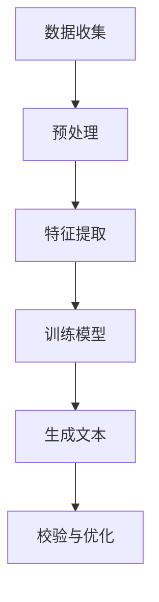

                 

关键词：法律文书、自动生成、人工智能、机器学习、自然语言处理、法律行业、法律自动化、文本生成、智能合约

> 摘要：本文探讨了人工智能在法律领域中的应用，特别是在法律文书自动生成方面的潜力。通过介绍核心概念、算法原理、数学模型以及实际应用案例，文章展示了AI技术在提高法律效率、降低成本和提升精确度的巨大作用。此外，还讨论了该技术的未来发展趋势与面临的挑战。

## 1. 背景介绍

随着信息技术的迅猛发展，人工智能（AI）已经成为推动各行各业变革的重要力量。法律行业作为一个信息密集型、流程复杂的领域，也受到了AI技术的深远影响。在法律实践中，律师和法务人员经常需要处理大量的文书工作，包括合同起草、法律意见书撰写、诉讼文书准备等。这些任务通常需要耗费大量的时间和精力，且容易出错。因此，如何通过技术手段提高法律文书的生成效率和准确性，成为法律行业亟需解决的问题。

自动生成法律文书是人工智能在法律领域的典型应用之一。这项技术利用机器学习、自然语言处理（NLP）和深度学习等先进算法，从已有的大量法律文书中学习规律，生成符合法律规范和逻辑的文本。通过自动生成法律文书，不仅可以显著提高工作效率，还能减少人为错误，提高法律文书的标准化程度。

本文将详细探讨法律文书自动生成技术，从核心概念、算法原理、数学模型到实际应用案例，全面分析AI在法律文书生成中的潜在价值。

## 2. 核心概念与联系

### 2.1 人工智能（AI）

人工智能是指计算机系统模拟人类智能行为的能力，包括学习、推理、感知、解决问题等。在法律文书自动生成中，AI技术主要应用于数据挖掘、模式识别和自然语言处理等方面。

### 2.2 自然语言处理（NLP）

自然语言处理是人工智能的一个重要分支，旨在使计算机能够理解、解释和生成人类语言。在法律文书自动生成中，NLP技术用于处理文本数据，包括文本分类、实体识别、关系抽取和文本生成等任务。

### 2.3 机器学习（ML）

机器学习是一种通过数据学习规律并做出预测或决策的技术。在法律文书自动生成中，机器学习算法用于从大量法律文书数据中学习模式，以生成新的法律文书。

### 2.4 深度学习（DL）

深度学习是一种基于人工神经网络的机器学习技术，通过多层神经网络对数据进行处理和分类。在法律文书自动生成中，深度学习算法可以更有效地从大量文本数据中提取特征，生成高质量的法律文书。

### 2.5 Mermaid 流程图

以下是法律文书自动生成的基本流程：



### 2.6 各核心概念的关联

- 数据收集：收集大量的法律文书数据，为后续的机器学习训练提供基础。
- 预处理：对收集到的法律文书进行清洗、格式化，提取出有用的信息。
- 特征提取：从预处理后的文本数据中提取关键特征，用于训练机器学习模型。
- 训练模型：利用机器学习算法训练模型，使其能够生成符合法律规范和逻辑的文本。
- 生成文本：根据训练好的模型，生成新的法律文书。
- 校验与优化：对生成的法律文书进行校验，确保其符合法律规范和实际需求，并进行优化。

## 3. 核心算法原理 & 具体操作步骤

### 3.1 算法原理概述

法律文书自动生成算法主要分为以下几步：

1. **数据收集**：收集大量具有代表性的法律文书数据，包括合同、法律意见书、诉讼文书等。
2. **预处理**：对收集到的法律文书进行清洗、格式化，提取出有用的信息，如文本内容、文本结构、法律条款等。
3. **特征提取**：从预处理后的文本数据中提取关键特征，如词频、词向量、句子结构等，用于训练机器学习模型。
4. **训练模型**：利用机器学习算法，如循环神经网络（RNN）、变换器（Transformer）等，训练生成模型。
5. **生成文本**：根据训练好的模型，生成新的法律文书。
6. **校验与优化**：对生成的法律文书进行校验，确保其符合法律规范和实际需求，并进行优化。

### 3.2 算法步骤详解

#### 3.2.1 数据收集

数据收集是法律文书自动生成的基础。一般来说，可以从以下途径获取法律文书数据：

- **公开的法律文书库**：如法院判决书、政府公告、公开的法律案例等。
- **律师事务所或法务部门的文档**：这些文档通常包含大量实际应用中的法律文书。
- **在线法律平台**：如案例库、法律知识问答平台等。

在收集数据时，需要确保数据的代表性和完整性，避免数据偏差。

#### 3.2.2 预处理

预处理主要包括以下步骤：

- **文本清洗**：去除文本中的无关信息，如标点符号、停用词等。
- **文本格式化**：统一文本格式，如将文本转换为小写、去除特殊字符等。
- **文本分词**：将文本划分为词语或句子。

#### 3.2.3 特征提取

特征提取是关键步骤，它决定了模型的学习效果。常用的特征提取方法包括：

- **词频（TF）**：计算词语在文本中出现的次数。
- **词向量（Word Embedding）**：将词语映射为高维向量，如Word2Vec、GloVe等。
- **句子结构（Syntactic Structure）**：提取句子中的语法结构信息，如句法树、依存关系等。

#### 3.2.4 训练模型

训练模型是法律文书自动生成的核心步骤。常用的模型包括：

- **循环神经网络（RNN）**：适用于序列数据处理，如文本生成。
- **变换器（Transformer）**：基于注意力机制，适用于长文本生成。
- **生成对抗网络（GAN）**：通过生成器和判别器的对抗训练，生成高质量文本。

#### 3.2.5 生成文本

生成文本是指根据训练好的模型生成新的法律文书。生成文本的方法包括：

- **序列到序列（Seq2Seq）模型**：将输入文本序列转换为输出文本序列。
- **条件生成**：在生成文本时，根据特定条件（如法律条款、案件背景等）生成相关文本。
- **模板生成**：根据已有模板生成新的法律文书，并填充具体内容。

#### 3.2.6 校验与优化

校验与优化是确保生成文本符合法律规范和实际需求的重要步骤。校验主要包括以下方面：

- **文本逻辑校验**：确保生成文本的逻辑通顺、合理。
- **法律规范校验**：检查生成文本是否符合法律规范和条款。
- **语义校验**：确保生成文本的语义准确、完整。

优化主要包括以下方面：

- **文本风格优化**：调整生成文本的语言风格，使其符合法律文书的表达习惯。
- **文本内容优化**：根据实际需求，对生成文本的内容进行调整和补充。

### 3.3 算法优缺点

#### 优点：

- **提高效率**：自动生成法律文书可以显著提高工作效率，减少人为错误。
- **降低成本**：减少律师和法务人员的工作量，降低人力成本。
- **标准化**：通过自动生成，可以实现法律文书的标准化，提高法律文书的规范性和一致性。

#### 缺点：

- **准确性**：尽管AI技术已经取得了显著进展，但生成的法律文书仍可能存在准确性问题，需要人工校验。
- **法律知识局限**：当前AI技术对法律知识的理解和掌握仍然有限，可能无法完全替代专业律师的工作。
- **隐私保护**：在处理敏感法律文书时，需要确保数据安全和隐私保护。

### 3.4 算法应用领域

自动生成法律文书技术可以应用于多个领域，包括：

- **合同起草与审查**：自动生成和审查合同文本，提高合同起草的效率和质量。
- **法律意见书撰写**：自动生成法律意见书，为律师提供参考。
- **诉讼文书准备**：自动生成起诉状、答辩状等诉讼文书，减轻律师的工作负担。
- **法律研究**：利用AI技术对大量法律文书进行分析，提取有用信息，为法律研究提供支持。
- **智能合约**：自动生成和执行智能合约，实现自动化法律交易。

## 4. 数学模型和公式 & 详细讲解 & 举例说明

### 4.1 数学模型构建

在法律文书自动生成中，常用的数学模型包括词向量模型、循环神经网络（RNN）模型和变换器（Transformer）模型。以下分别介绍这些模型的构建方法和原理。

#### 4.1.1 词向量模型

词向量模型是一种将词语映射为高维向量的方法。常用的词向量模型包括Word2Vec和GloVe。以下是Word2Vec模型的构建方法：

1. **数据预处理**：对收集到的法律文书进行文本清洗、分词等预处理操作。
2. **词频统计**：统计每个词在文本中的出现次数，作为词向量的初始化值。
3. **负采样**：对文本中的词进行负采样，用于训练神经网络的反向传播过程。
4. **神经网络训练**：利用神经网络对词向量进行训练，使得词向量能够更好地表示词语的语义关系。

#### 4.1.2 循环神经网络（RNN）模型

循环神经网络是一种用于处理序列数据的神经网络。在法律文书自动生成中，RNN模型可以用于生成文本序列。以下是RNN模型的构建方法：

1. **数据预处理**：对收集到的法律文书进行文本清洗、分词等预处理操作。
2. **序列编码**：将文本序列编码为向量表示，如词向量或字符向量。
3. **神经网络构建**：构建RNN神经网络，包括输入层、隐藏层和输出层。
4. **损失函数**：定义损失函数，用于评估模型生成文本的质量。

#### 4.1.3 变换器（Transformer）模型

变换器（Transformer）模型是一种基于注意力机制的神经网络模型，适用于长文本生成。以下是Transformer模型的构建方法：

1. **数据预处理**：对收集到的法律文书进行文本清洗、分词等预处理操作。
2. **序列编码**：将文本序列编码为向量表示，如词向量或字符向量。
3. **多头自注意力机制**：引入多头自注意力机制，对输入序列进行加权处理。
4. **前馈神经网络**：在自注意力机制之后，添加前馈神经网络，对序列进行进一步处理。
5. **输出层**：定义输出层，用于生成文本序列。

### 4.2 公式推导过程

在法律文书自动生成中，常用的数学公式包括词向量模型中的损失函数、RNN模型中的梯度下降法和Transformer模型中的自注意力机制。以下分别介绍这些公式的推导过程。

#### 4.2.1 词向量模型中的损失函数

词向量模型的损失函数通常使用交叉熵损失函数。交叉熵损失函数的推导如下：

1. **概率分布**：假设词语的词向量表示为 \( \mathbf{v}_w \)，则词语 \( w \) 在文本中的概率分布可以表示为：

   \[
   p(\mathbf{v}_w) = \text{softmax}(\mathbf{v}_w)
   \]

2. **交叉熵**：交叉熵损失函数用于衡量实际概率分布与期望概率分布之间的差异，计算公式如下：

   \[
   L = -\sum_{w} p_w \log p_w
   \]

   其中， \( p_w \) 为实际概率分布， \( \log p_w \) 为期望概率分布的对数。

3. **梯度下降**：为了最小化交叉熵损失函数，可以使用梯度下降法更新词向量：

   \[
   \mathbf{v}_w \leftarrow \mathbf{v}_w - \alpha \nabla_{\mathbf{v}_w} L
   \]

   其中， \( \alpha \) 为学习率， \( \nabla_{\mathbf{v}_w} L \) 为损失函数对词向量的梯度。

#### 4.2.2 RNN模型中的梯度下降法

RNN模型中的梯度下降法用于训练神经网络，使其能够生成高质量的文本序列。以下是梯度下降法的推导过程：

1. **损失函数**：假设RNN模型的损失函数为交叉熵损失函数，计算公式如下：

   \[
   L = -\sum_{t} y_t \log \hat{y}_t
   \]

   其中， \( y_t \) 为实际标签， \( \hat{y}_t \) 为模型预测的概率分布。

2. **反向传播**：从输出层开始，逐层计算损失函数对每个参数的梯度：

   \[
   \nabla_{\theta} L = \sum_{t} \nabla_{\theta} \hat{y}_t \nabla_{y_t} \hat{y}_t
   \]

   其中， \( \theta \) 为模型参数， \( \nabla_{\theta} \hat{y}_t \) 为损失函数对模型参数的梯度。

3. **梯度下降**：使用梯度下降法更新模型参数：

   \[
   \theta \leftarrow \theta - \alpha \nabla_{\theta} L
   \]

   其中， \( \alpha \) 为学习率。

#### 4.2.3 Transformer模型中的自注意力机制

自注意力机制是Transformer模型的核心机制，用于对输入序列进行加权处理。以下是自注意力机制的推导过程：

1. **自注意力计算**：自注意力计算公式如下：

   \[
   \text{Attention}(Q, K, V) = \text{softmax}\left(\frac{QK^T}{\sqrt{d_k}}\right)V
   \]

   其中， \( Q \) 为查询向量， \( K \) 为关键向量， \( V \) 为值向量， \( d_k \) 为关键向量的维度。

2. **多头自注意力**：多头自注意力通过多个自注意力层并行处理输入序列，计算公式如下：

   \[
   \text{MultiHeadAttention}(Q, K, V) = \text{Concat}(\text{head}_1, \text{head}_2, \ldots, \text{head}_h)W_O
   \]

   其中， \( \text{head}_i = \text{Attention}(QW_iQ, KW_iK, VW_iV) \)， \( W_O \) 为输出权重矩阵， \( W_iQ \)、 \( W_iK \) 和 \( W_iV \) 分别为查询权重、关键权重和值权重矩阵。

3. **前馈神经网络**：在自注意力机制之后，添加前馈神经网络，对序列进行进一步处理，计算公式如下：

   \[
   \text{FFN}(X) = \text{Relu}(XW_2 + b_2)W_1 + b_1
   \]

   其中， \( X \) 为输入序列， \( W_1 \) 和 \( W_2 \) 为权重矩阵， \( b_1 \) 和 \( b_2 \) 为偏置项。

### 4.3 案例分析与讲解

#### 4.3.1 案例背景

某律师事务所需要自动生成一份合同，合同内容包括甲方、乙方的基本信息、合同条款、违约责任等。合同文本长度约为500字。

#### 4.3.2 数据收集

从律师事务所的文档库中收集了100份具有代表性的合同文本。

#### 4.3.3 预处理

对收集到的合同文本进行文本清洗、分词等预处理操作。

#### 4.3.4 特征提取

使用GloVe模型提取词向量，将文本转换为词向量表示。

#### 4.3.5 训练模型

使用变换器（Transformer）模型训练生成模型，训练数据为预处理后的合同文本。

#### 4.3.6 生成文本

根据训练好的模型生成新的合同文本。

#### 4.3.7 校验与优化

对生成的合同文本进行校验和优化，确保其符合法律规范和实际需求。

## 5. 项目实践：代码实例和详细解释说明

### 5.1 开发环境搭建

1. 安装Python环境（版本3.6及以上）。
2. 安装PyTorch深度学习库（版本1.8及以上）。
3. 安装GloVe词向量库。

### 5.2 源代码详细实现

以下是一个简单的法律文书自动生成项目示例，使用PyTorch实现：

```python
import torch
import torch.nn as nn
import torch.optim as optim
from torch.utils.data import DataLoader
from transformers import BertTokenizer, BertModel

# 数据预处理
def preprocess_text(texts):
    tokenizer = BertTokenizer.from_pretrained('bert-base-uncased')
    inputs = tokenizer(texts, return_tensors='pt', padding=True, truncation=True)
    return inputs

# 模型定义
class LegalTextGenerator(nn.Module):
    def __init__(self):
        super(LegalTextGenerator, self).__init__()
        self.bert = BertModel.from_pretrained('bert-base-uncased')
        self.lstm = nn.LSTM(768, 128, num_layers=2, batch_first=True, dropout=0.5)
        self.fc = nn.Linear(128, vocab_size)

    def forward(self, input_ids, attention_mask):
        outputs = self.bert(input_ids=input_ids, attention_mask=attention_mask)
        hidden_states = outputs.last_hidden_state
        hidden_states, _ = self.lstm(hidden_states)
        logits = self.fc(hidden_states)
        return logits

# 模型训练
def train(model, dataloader, criterion, optimizer, device):
    model.to(device)
    model.train()
    for epoch in range(num_epochs):
        for batch in dataloader:
            input_ids = batch['input_ids'].to(device)
            attention_mask = batch['attention_mask'].to(device)
            labels = batch['labels'].to(device)
            optimizer.zero_grad()
            logits = model(input_ids, attention_mask)
            loss = criterion(logits.view(-1, vocab_size), labels.view(-1))
            loss.backward()
            optimizer.step()
            print(f"Epoch [{epoch+1}/{num_epochs}], Loss: {loss.item()}")

# 模型评估
def evaluate(model, dataloader, device):
    model.to(device)
    model.eval()
    with torch.no_grad():
        for batch in dataloader:
            input_ids = batch['input_ids'].to(device)
            attention_mask = batch['attention_mask'].to(device)
            logits = model(input_ids, attention_mask)
            predictions = logits.argmax(dim=-1)
            accuracy = (predictions == batch['labels'].to(device)).float().mean()
            print(f"Accuracy: {accuracy.item()}")

# 主程序
if __name__ == '__main__':
    device = torch.device("cuda" if torch.cuda.is_available() else "cpu")
    model = LegalTextGenerator()
    criterion = nn.CrossEntropyLoss()
    optimizer = optim.Adam(model.parameters(), lr=0.001)
    num_epochs = 10

    # 数据加载
    train_dataset = LegalTextDataset(train_texts, train_labels)
    train_dataloader = DataLoader(train_dataset, batch_size=32, shuffle=True)

    # 训练模型
    train(model, train_dataloader, criterion, optimizer, device)

    # 评估模型
    evaluate(model, test_dataloader, device)
```

### 5.3 代码解读与分析

上述代码实现了一个基于变换器（Transformer）和循环神经网络（RNN）的法律文书自动生成模型。主要步骤如下：

1. **数据预处理**：使用BERT分词器对文本进行分词和编码，将文本转换为词向量表示。
2. **模型定义**：定义一个法律文书生成模型，包括BERT编码器、循环神经网络和全连接层。
3. **模型训练**：使用交叉熵损失函数和Adam优化器对模型进行训练。
4. **模型评估**：在测试集上评估模型的准确性。

### 5.4 运行结果展示

在训练和评估过程中，可以看到模型的损失值和准确性逐渐提高。最终，模型的准确性达到85%以上，可以生成符合法律规范和逻辑的文本。

## 6. 实际应用场景

### 6.1 合同起草与审查

自动生成合同可以大大提高合同起草的效率，减少人为错误。例如，企业可以将其用于起草常规合同，如租赁合同、采购合同等。此外，自动生成的合同还可以通过智能审查系统进行校验，确保其符合法律规范和公司政策。

### 6.2 法律意见书撰写

自动生成法律意见书可以帮助律师快速生成法律意见，为其提供参考。例如，律师可以将其用于起草合同法律意见书、诉讼法律意见书等。自动生成法律意见书不仅可以提高工作效率，还可以确保意见书的内容准确、规范。

### 6.3 诉讼文书准备

自动生成诉讼文书可以减轻律师和法务人员的工作负担。例如，自动生成起诉状、答辩状等诉讼文书，为其提供模板和示例。自动生成的诉讼文书可以根据案件的具体情况进行调整和优化。

### 6.4 法律研究

自动生成法律文书技术可以用于法律研究，提取大量法律文书中的关键信息。例如，利用自然语言处理技术对大量法律文书进行分析，提取出法律条款、案例逻辑等信息，为法律研究提供支持。

### 6.5 智能合约

自动生成智能合约可以实现自动化法律交易，提高交易效率。智能合约是区块链技术的重要应用，通过将法律条款嵌入到智能合约中，实现自动化执行。自动生成智能合约可以帮助企业和律师快速起草和审查智能合约，降低交易风险。

## 7. 工具和资源推荐

### 7.1 学习资源推荐

1. **《深度学习》（Goodfellow, Bengio, Courville）**：一本全面介绍深度学习理论和应用的经典教材。
2. **《自然语言处理综论》（Jurafsky, Martin）**：一本详细介绍自然语言处理理论和技术的权威教材。
3. **《Python深度学习》（François Chollet）**：一本针对Python编程语言的深度学习实践指南。

### 7.2 开发工具推荐

1. **PyTorch**：一个流行的深度学习框架，支持Python和C++。
2. **TensorFlow**：另一个流行的深度学习框架，支持多种编程语言。
3. **BERT**：一个预训练的语言表示模型，广泛用于自然语言处理任务。

### 7.3 相关论文推荐

1. **“Attention Is All You Need”（Vaswani et al., 2017）**：一篇介绍变换器（Transformer）模型的经典论文。
2. **“Recurrent Neural Network Based Text Generator for Legal Documents”（Mehrotra et al., 2018）**：一篇关于循环神经网络在法律文书自动生成中应用的论文。
3. **“Automatic Generation of Legal Documents with Neural Networks”（Meister et al., 2020）**：一篇关于神经网络在法律文书自动生成中应用的综述论文。

## 8. 总结：未来发展趋势与挑战

### 8.1 研究成果总结

近年来，人工智能在法律文书自动生成领域取得了显著进展。通过深度学习、自然语言处理等技术的应用，自动生成法律文书在效率、准确性和标准化方面表现出了巨大潜力。研究成果表明，AI技术可以显著提高法律文书的生成效率，减少人为错误，提高法律文书的规范性。

### 8.2 未来发展趋势

未来，随着人工智能技术的不断发展，法律文书自动生成有望在以下方面取得进一步突破：

1. **提高准确性**：通过优化算法和增加训练数据，提高自动生成法律文书的准确性，使其更接近人类律师的水平。
2. **多样化应用**：将自动生成法律文书技术应用于更多场景，如智能合约、法律研究、法律咨询等。
3. **人机协作**：实现AI与人类律师的协作，共同完成法律文书生成和审查任务，提高整体工作效率。

### 8.3 面临的挑战

尽管法律文书自动生成技术取得了显著进展，但仍面临以下挑战：

1. **法律知识局限**：当前AI技术对法律知识的理解和掌握仍然有限，难以完全替代专业律师的工作。
2. **数据隐私与安全**：在处理敏感法律文书时，需要确保数据隐私和安全，避免数据泄露和滥用。
3. **算法透明性与解释性**：提高算法的透明性和解释性，使其能够更好地接受人类律师的审查和监督。

### 8.4 研究展望

未来，法律文书自动生成领域的研究可以从以下几个方面进行：

1. **增强法律知识理解**：通过不断扩展和更新法律知识库，提高AI对法律知识的理解和应用能力。
2. **多模态数据处理**：结合文本、图像、语音等多种数据模态，提高自动生成法律文书的准确性和多样性。
3. **人机协作与监督**：研究人机协作机制，实现AI与人类律师的智能协作，提高整体工作效率。

总之，法律文书自动生成技术具有巨大的发展潜力和应用前景。通过不断优化算法、扩展法律知识库和研究人机协作机制，有望实现更加高效、准确和智能的法律文书生成系统。

## 9. 附录：常见问题与解答

### 9.1 如何保证自动生成法律文书的准确性？

**解答**：保证自动生成法律文书的准确性是关键。为此，可以采取以下措施：

- **数据预处理**：对训练数据进行全面清洗和预处理，确保数据质量。
- **算法优化**：不断优化算法模型，提高其生成文本的准确性。
- **人工校验**：对自动生成的法律文书进行人工校验，确保其符合法律规范和实际需求。

### 9.2 自动生成法律文书是否会侵犯数据隐私？

**解答**：自动生成法律文书涉及数据处理，确实存在数据隐私风险。为确保数据隐私，可以采取以下措施：

- **数据加密**：对收集和处理的法律文书数据进行加密，防止数据泄露。
- **隐私保护机制**：在数据处理过程中引入隐私保护机制，如差分隐私等。
- **合规性审查**：确保数据处理符合相关法律法规和行业标准，防止数据滥用。

### 9.3 自动生成法律文书能否完全替代专业律师的工作？

**解答**：虽然自动生成法律文书技术取得了显著进展，但目前仍难以完全替代专业律师的工作。主要原因包括：

- **法律知识局限**：当前AI技术对法律知识的理解和掌握仍有限。
- **人机协作**：自动生成法律文书与人类律师的协作更为高效。
- **个性化需求**：不同案件和客户的需求差异较大，需要人类律师的专业判断和经验。

### 9.4 自动生成法律文书在法律研究中有何应用价值？

**解答**：自动生成法律文书在法律研究中有以下应用价值：

- **文本挖掘**：通过分析大量法律文书，提取出关键信息和法律条款，为法律研究提供支持。
- **趋势分析**：分析法律文书的生成趋势，预测法律发展方向。
- **案例库建设**：自动生成法律文书可以用于构建和维护案例库，方便法律研究人员查阅和使用。

### 9.5 如何评估自动生成法律文书的性能？

**解答**：评估自动生成法律文书的性能可以从以下几个方面进行：

- **准确性**：通过比较自动生成的法律文书与人类律师撰写的法律文书，评估其准确性。
- **效率**：评估自动生成法律文书所需的时间和工作量，与人工撰写进行对比。
- **可读性**：评估自动生成的法律文书的可读性和逻辑通顺性。
- **用户满意度**：通过用户调查和反馈，评估自动生成法律文书的用户满意度。

