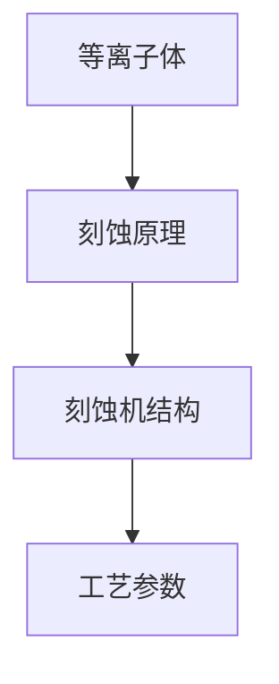

                 

关键词：泛林集团、校招、等离子体刻蚀工程师、面试题

摘要：本文将围绕泛林集团2024年校招等离子体刻蚀工程师的面试题展开讨论，通过分析面试题的内容和考察方向，为考生提供备考建议和指导。本文旨在帮助考生在面试中更好地展示自己的技术实力和专业知识。

## 1. 背景介绍

等离子体刻蚀技术是微电子和半导体制造领域的关键技术之一，主要用于制造各种微电子器件和集成电路。随着科技的快速发展，等离子体刻蚀技术在半导体制造中的应用越来越广泛，对于工程师的专业知识和技能要求也越来越高。泛林集团作为全球领先的半导体设备制造商，对等离子体刻蚀工程师的要求更是精益求精。

本文将结合泛林集团2024年校招等离子体刻蚀工程师的面试题，对面试题的类型、考察内容以及备考策略进行详细分析，为考生提供有针对性的备考建议。

## 2. 核心概念与联系

为了更好地理解等离子体刻蚀技术，我们需要先掌握以下几个核心概念：

### 2.1 等离子体

等离子体是电离气体，由自由电子、离子和中性粒子组成。等离子体在高温、高压或电磁场的作用下产生。

### 2.2 刻蚀原理

等离子体刻蚀是通过等离子体与材料表面的相互作用，使材料表面发生化学反应或物理蒸发，从而实现材料去除的过程。

### 2.3 刻蚀机结构

等离子体刻蚀机主要由等离子体发生器、反应室、真空系统和控制系统组成。

### 2.4 刻蚀工艺参数

刻蚀工艺参数包括气体种类、气压、功率、刻蚀时间等，这些参数对刻蚀效果有重要影响。

下面是一个简单的 Mermaid 流程图，展示等离子体刻蚀技术的核心概念和联系：



## 3. 核心算法原理 & 具体操作步骤

### 3.1 算法原理概述

等离子体刻蚀技术涉及多个学科领域，包括等离子体物理、化学反应动力学、电子束控制等。核心算法主要包括：

1. 等离子体生成算法：用于生成等离子体并控制其浓度。
2. 刻蚀速率计算算法：用于计算不同条件下材料的刻蚀速率。
3. 刻蚀路径规划算法：用于优化刻蚀路径，提高刻蚀精度。

### 3.2 算法步骤详解

1. **等离子体生成**：通过射频或微波等离子体源生成等离子体，并调整气体种类、气压和功率等参数。
2. **刻蚀速率计算**：根据材料性质、等离子体参数和工艺要求，计算材料刻蚀速率。
3. **刻蚀路径规划**：根据器件结构和工艺要求，设计刻蚀路径，确保刻蚀精度和效率。
4. **刻蚀过程控制**：通过控制系统实时监测刻蚀过程，调整等离子体参数和刻蚀速率，确保刻蚀质量。

### 3.3 算法优缺点

1. **优点**：等离子体刻蚀技术具有高精度、高效率、可控性强的特点，适用于各种复杂结构的刻蚀工艺。
2. **缺点**：等离子体刻蚀技术对工艺参数要求较高，操作复杂，成本较高。

### 3.4 算法应用领域

等离子体刻蚀技术广泛应用于半导体制造、显示技术、光电子器件等领域。随着科技的不断发展，其应用领域将不断拓展。

## 4. 数学模型和公式 & 详细讲解 & 举例说明

### 4.1 数学模型构建

等离子体刻蚀过程的数学模型主要包括以下几个方面：

1. **等离子体浓度分布**：根据等离子体生成算法，计算等离子体在反应室内的浓度分布。
2. **刻蚀速率模型**：根据材料性质和等离子体参数，建立刻蚀速率与工艺参数的关系。
3. **刻蚀路径优化模型**：根据器件结构和工艺要求，设计最优刻蚀路径。

### 4.2 公式推导过程

1. **等离子体浓度分布**：

$$
C(r,t) = C_0 \left(1 - e^{-\frac{r^2}{2D^2t}}\right)
$$

其中，$C(r,t)$ 表示距离反应室中心 $r$ 处的等离子体浓度，$C_0$ 为初始浓度，$D$ 为扩散系数，$t$ 为时间。

2. **刻蚀速率模型**：

$$
\frac{dH}{dt} = kC(r,t)
$$

其中，$\frac{dH}{dt}$ 表示刻蚀速率，$k$ 为刻蚀速率常数，$C(r,t)$ 为等离子体浓度。

3. **刻蚀路径优化模型**：

$$
\frac{d\theta}{ds} = -\frac{1}{\rho} \ln \left(\frac{C_1}{C_2}\right)
$$

其中，$\theta$ 表示路径偏转角度，$s$ 为路径长度，$C_1$ 和 $C_2$ 分别为路径起点和终点的等离子体浓度。

### 4.3 案例分析与讲解

以一个简单的硅片刻蚀为例，假设硅片厚度为 1 微米，等离子体浓度为 $C_0 = 1 \times 10^{19} \text{cm}^{-3}$，扩散系数 $D = 1 \text{cm}^2/\text{s}$，刻蚀速率常数 $k = 1 \text{cm/s}$。我们需要计算在等离子体浓度为 $C_1 = 0.1C_0$ 的区域，刻蚀 0.5 微米所需的时间。

根据刻蚀速率模型，我们可以计算刻蚀速率：

$$
\frac{dH}{dt} = kC(r,t) = kC_1 = 0.1kC_0 = 0.1 \text{cm/s}
$$

要刻蚀 0.5 微米，需要的时间为：

$$
t = \frac{dH}{\frac{dH}{dt}} = \frac{0.5 \text{cm}}{0.1 \text{cm/s}} = 5 \text{s}
$$

因此，在等离子体浓度为 $C_1 = 0.1C_0$ 的区域，刻蚀 0.5 微米所需的时间为 5 秒。

## 5. 项目实践：代码实例和详细解释说明

### 5.1 开发环境搭建

在本文中，我们将使用 Python 语言进行编程。请确保已经安装了 Python 3.6 及以上版本和相应的科学计算库，如 NumPy 和 Matplotlib。

### 5.2 源代码详细实现

以下是等离子体刻蚀模拟的 Python 代码示例：

```python
import numpy as np
import matplotlib.pyplot as plt

# 参数设置
C0 = 1e19  # 初始浓度
D = 1  # 扩散系数
k = 1  # 刻蚀速率常数
H = 1e-6  # 硅片厚度
C1 = 0.1 * C0  # 刻蚀区域浓度

# 刻蚀速率计算
def etching_rate(C):
    return k * C

# 模拟刻蚀过程
def simulate_etching(H, C0, C1, k, D):
    r = np.arange(0, np.sqrt(2) * D * H, D * H)
    C = C0 * (1 - np.exp(-r**2 / (2 * D**2 * H)))
    etching_rate_arr = etching_rate(C)
    etching_depth = np.cumsum(etching_rate_arr)
    return r, C, etching_depth

# 绘制结果
def plot_results(r, C, etching_depth):
    plt.figure()
    plt.plot(r, C, label='Plasma Concentration')
    plt.plot(r, etching_depth, label='Etching Depth')
    plt.xlabel('Distance (cm)')
    plt.ylabel('Depth (cm)')
    plt.legend()
    plt.show()

# 模拟并绘图
r, C, etching_depth = simulate_etching(H, C0, C1, k, D)
plot_results(r, C, etching_depth)
```

### 5.3 代码解读与分析

上述代码首先定义了等离子体刻蚀的参数，包括初始浓度 $C_0$、扩散系数 $D$、刻蚀速率常数 $k$ 和硅片厚度 $H$。然后定义了刻蚀速率计算函数 `etching_rate` 和刻蚀过程模拟函数 `simulate_etching`。最后，通过绘图函数 `plot_results` 将模拟结果绘制成图表。

### 5.4 运行结果展示

运行上述代码，可以得到等离子体浓度分布和刻蚀深度的图表。通过图表，可以直观地观察到刻蚀过程和等离子体浓度的变化。

## 6. 实际应用场景

等离子体刻蚀技术在微电子和半导体制造领域有广泛的应用。以下是一些实际应用场景：

1. **半导体制造**：用于制造各种半导体器件，如晶体管、二极管和集成电路。
2. **光电子器件**：用于制造光电子器件，如激光器、LED 和太阳能电池。
3. **显示技术**：用于制造显示器，如液晶显示屏和有机发光二极管。
4. **纳米技术**：用于制造纳米结构和纳米器件，如纳米线、纳米薄膜和纳米传感器。

## 7. 工具和资源推荐

为了更好地学习和掌握等离子体刻蚀技术，以下是一些推荐的工具和资源：

1. **学习资源**：
   - 《等离子体物理学原理与应用》
   - 《半导体制造工艺》
   - 《微电子器件物理与设计》

2. **开发工具**：
   - Python
   - MATLAB
   - Simulink

3. **相关论文**：
   - 《高分辨率等离子体刻蚀技术的最新进展》
   - 《等离子体刻蚀在纳米技术中的应用》
   - 《等离子体刻蚀技术在半导体制造中的应用》

## 8. 总结：未来发展趋势与挑战

随着科技的不断发展，等离子体刻蚀技术在未来将面临以下发展趋势和挑战：

### 8.1 研究成果总结

1. **高精度刻蚀**：不断提高刻蚀精度，满足更复杂的器件结构要求。
2. **高效能刻蚀**：提高刻蚀效率，降低能耗和成本。
3. **多功能刻蚀**：实现多种材料的刻蚀，拓展应用领域。

### 8.2 未来发展趋势

1. **纳米技术**：随着纳米技术的快速发展，等离子体刻蚀技术在纳米级别器件制造中将发挥重要作用。
2. **绿色环保**：开发更加环保的刻蚀工艺和设备，降低环境污染。
3. **智能化**：结合人工智能和大数据技术，实现刻蚀工艺的智能化和自动化。

### 8.3 面临的挑战

1. **工艺稳定性**：提高刻蚀工艺的稳定性，确保刻蚀质量和一致性。
2. **成本控制**：降低刻蚀设备和工艺的成本，满足大规模生产的需要。
3. **人才短缺**：随着等离子体刻蚀技术的不断发展，对专业人才的需求越来越大，人才短缺将成为一大挑战。

### 8.4 研究展望

未来，等离子体刻蚀技术将在微电子、光电子、纳米技术等领域发挥更加重要的作用。为了应对未来挑战，我们需要继续加强技术创新、人才培养和国际合作，推动等离子体刻蚀技术向更高水平发展。

## 9. 附录：常见问题与解答

### 9.1 等离子体刻蚀技术的核心原理是什么？

等离子体刻蚀技术是利用等离子体与材料表面的相互作用，使材料表面发生化学反应或物理蒸发，从而实现材料去除的过程。

### 9.2 等离子体刻蚀技术在半导体制造中的应用有哪些？

等离子体刻蚀技术广泛应用于半导体制造中的各种器件和集成电路的制造，如晶体管、二极管和集成电路。

### 9.3 等离子体刻蚀工艺的主要参数有哪些？

等离子体刻蚀工艺的主要参数包括气体种类、气压、功率、刻蚀时间等。

### 9.4 等离子体刻蚀技术有哪些优缺点？

等离子体刻蚀技术的优点是高精度、高效率、可控性强，缺点是对工艺参数要求较高，操作复杂，成本较高。

### 9.5 如何提高等离子体刻蚀技术的稳定性？

提高等离子体刻蚀技术的稳定性主要通过优化工艺参数、改进设备设计和加强工艺监控来实现。

### 9.6 等离子体刻蚀技术在纳米技术中的应用前景如何？

等离子体刻蚀技术在纳米技术中具有广泛的应用前景，随着纳米技术的快速发展，等离子体刻蚀技术将在纳米级别器件制造中发挥越来越重要的作用。

### 9.7 如何成为一名优秀的等离子体刻蚀工程师？

要成为一名优秀的等离子体刻蚀工程师，需要具备扎实的物理、化学和电子工程知识，熟练掌握等离子体刻蚀工艺和技术，具备良好的实验能力和工程实践经验。

以上就是对泛林集团2024年校招等离子体刻蚀工程师面试题的详细分析和解答。希望通过本文的介绍，能够为考生提供有针对性的备考指导，帮助考生在面试中取得优异的成绩。最后，祝愿所有考生都能顺利通过面试，成功加入泛林集团这个优秀的团队！
----------------------------------------------------------------
# 作者署名

作者：禅与计算机程序设计艺术 / Zen and the Art of Computer Programming

