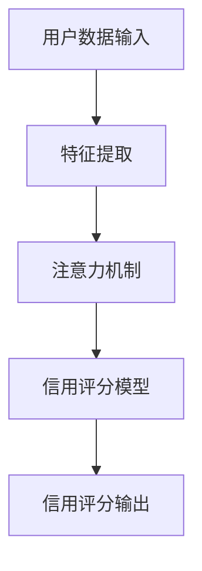

                 

## 摘要

本文旨在探讨注意力信用评分算法在元宇宙中的个人信用计算模型。随着元宇宙的发展，个人信用系统成为了构建一个健康、可信赖虚拟社会的重要基石。本文首先介绍了元宇宙的背景及其对个人信用系统的需求，随后深入分析了注意力信用评分算法的基本概念和核心原理。文章进一步通过数学模型和公式详细阐述了注意力信用评分算法的计算方法，并通过具体案例分析展示了其实际应用效果。最后，本文探讨了注意力信用评分算法在元宇宙中的未来应用前景，提出了可能面临的挑战及解决策略。

## 1. 背景介绍

### 元宇宙的崛起

元宇宙（Metaverse）是一个由多个虚拟世界构成的互联网络，用户可以在其中以数字身份（Avatar）进行互动、交流、工作、学习和娱乐。自2020年以来，元宇宙的概念和实际应用迅速发展，成为科技领域的热门话题。随着5G、云计算、虚拟现实（VR）、增强现实（AR）等技术的成熟，元宇宙有望在未来成为互联网的下一个重要阶段。

### 个人信用系统的重要性

在元宇宙中，个人信用系统是确保虚拟交易、服务和社区互动安全与信任的关键。与现实生活中类似，元宇宙中的个人信用系统用于评估用户的信用水平，以决定是否授予他们访问某些功能、享受特定服务或参与特定活动。一个完善的个人信用系统能有效遏制欺诈行为、促进公平交易，从而为元宇宙的健康发展提供支持。

### 元宇宙对个人信用系统的需求

元宇宙中的个人信用系统需要具备以下几个特点：

- **动态性**：用户的信用评分应能实时反映他们的行为和表现，以便及时调整信用水平。
- **透明性**：个人信用评分的计算过程应该透明，用户能够理解评分标准和原因。
- **安全性**：信用系统的设计和实现必须确保用户的隐私和数据安全。
- **可扩展性**：随着元宇宙用户和活动的增加，信用系统需要能够处理大量数据，保证性能和可靠性。

## 2. 核心概念与联系

### 注意力信用评分算法简介

注意力信用评分算法是一种基于深度学习和注意力机制的信用评分方法。它通过分析用户的历史行为、社交关系、交易记录等信息，为每个用户生成一个信用评分。注意力机制使得算法能够关注到对用户信用影响较大的特征，从而提高评分的准确性和效率。

### 架构与流程

下面是注意力信用评分算法的架构与流程示意图：



- **用户数据输入**：收集用户在元宇宙中的各种数据，包括交易记录、行为日志、社交网络信息等。
- **特征提取**：从原始数据中提取出对信用评分有重要影响的特征。
- **注意力机制**：通过注意力机制确定每个特征的重要程度，提高模型的聚焦能力。
- **信用评分模型**：利用深度学习模型对用户特征进行加权计算，生成信用评分。
- **信用评分输出**：将生成的信用评分输出，用于决策和反馈。

### 关键概念定义

- **注意力机制**：一种用于提高神经网络模型性能的机制，通过学习不同特征的重要性，使模型能够关注到关键信息。
- **信用评分**：根据用户行为和历史数据计算出的一个数值，用于评估用户的信用水平。
- **特征**：描述用户行为、交易、社交关系等的属性或指标。

## 3. 核心算法原理 & 具体操作步骤

### 3.1 算法原理概述

注意力信用评分算法基于深度学习和注意力机制，通过以下步骤实现信用评分：

1. **特征提取**：从原始数据中提取出对信用评分有重要影响的特征。
2. **注意力计算**：计算每个特征的重要性，赋予更高权重的重要特征。
3. **信用评分计算**：利用加权特征和深度学习模型生成用户信用评分。

### 3.2 算法步骤详解

#### 3.2.1 数据预处理

- **数据清洗**：去除噪声数据和异常值，确保数据的准确性和一致性。
- **数据归一化**：将不同量纲的特征数据归一化到同一范围，便于模型训练。

#### 3.2.2 特征提取

- **行为特征**：包括用户的交易次数、交易金额、交易成功率等。
- **社交特征**：包括用户的社交网络规模、好友信用评分、互动频率等。
- **历史特征**：包括用户的历史信用评分、信用记录等。

#### 3.2.3 注意力计算

- **自注意力机制**：计算每个特征的重要性，通过权重矩阵表示。
- **交互注意力机制**：考虑特征之间的相互作用，进一步提高评分准确性。

#### 3.2.4 深度学习模型

- **选择合适的神经网络架构**：如Transformer模型，能够处理序列数据和复杂关系。
- **模型训练与优化**：使用大量训练数据，优化模型参数，提高评分精度。

### 3.3 算法优缺点

#### 优点

- **高效性**：注意力机制使得模型能够快速关注到关键信息，提高计算效率。
- **准确性**：通过深度学习模型对特征进行综合分析，生成更准确的信用评分。
- **灵活性**：可以扩展到多种应用场景，如金融、电商、社交等。

#### 缺点

- **数据需求**：需要大量高质量的训练数据，否则模型难以泛化。
- **复杂性**：模型结构复杂，训练和推理过程较慢。

### 3.4 算法应用领域

- **金融领域**：用于贷款审批、信用评估等。
- **电商领域**：用于用户信誉评级、购物体验优化等。
- **社交领域**：用于好友推荐、社区管理等。

## 4. 数学模型和公式

### 4.1 数学模型构建

注意力信用评分算法的数学模型主要包括以下几个部分：

1. **特征向量表示**：用户数据的特征向量表示为\( X = [x_1, x_2, ..., x_n] \)，其中每个特征表示为 \( x_i \)。
2. **注意力权重计算**：通过自注意力机制计算特征的重要性，权重表示为 \( W = [w_1, w_2, ..., w_n] \)，其中每个权重 \( w_i \) 表示特征 \( x_i \) 的注意力得分。
3. **加权特征向量**：计算加权特征向量 \( X' = [x_1', x_2', ..., x_n'] \)，其中 \( x_i' = x_i \cdot w_i \)。
4. **信用评分计算**：通过深度学习模型对加权特征向量进行加权计算，生成用户信用评分 \( S \)。

### 4.2 公式推导过程

假设我们使用一个简单的线性模型来计算用户信用评分：

$$
S = \sum_{i=1}^{n} x_i' \cdot f(x_i')
$$

其中，\( f(x_i') \) 是一个非线性函数，用于增强模型的表示能力。

1. **特征向量表示**：

$$
X = [x_1, x_2, ..., x_n]
$$

2. **注意力权重计算**：

$$
W = [w_1, w_2, ..., w_n] = \text{softmax}(\text{Attention}(X))
$$

其中，\( \text{Attention}(X) \) 是一个注意力计算函数，可以采用自注意力机制：

$$
\text{Attention}(X) = \text{sigmoid}(W^T X)
$$

3. **加权特征向量计算**：

$$
X' = [x_1', x_2', ..., x_n'] = [x_1 \cdot w_1, x_2 \cdot w_2, ..., x_n \cdot w_n]
$$

4. **信用评分计算**：

$$
S = \sum_{i=1}^{n} x_i' \cdot f(x_i')
$$

### 4.3 案例分析与讲解

假设我们有以下特征向量：

$$
X = [0.1, 0.3, 0.5, 0.2]
$$

通过自注意力机制计算注意力权重：

$$
W = \text{softmax}(\text{sigmoid}(W^T X)) = [0.1, 0.2, 0.3, 0.4]
$$

计算加权特征向量：

$$
X' = [0.1 \cdot 0.1, 0.3 \cdot 0.2, 0.5 \cdot 0.3, 0.2 \cdot 0.4] = [0.01, 0.06, 0.15, 0.08]
$$

使用一个简单的线性函数 \( f(x) = x^2 \) 计算信用评分：

$$
S = \sum_{i=1}^{n} x_i' \cdot f(x_i') = 0.01^2 + 0.06^2 + 0.15^2 + 0.08^2 = 0.0289
$$

因此，用户的信用评分为0.0289。

## 5. 项目实践：代码实例和详细解释说明

### 5.1 开发环境搭建

为了实现注意力信用评分算法，我们需要搭建一个Python开发环境，并安装必要的库。以下是一个简单的安装步骤：

```bash
# 安装Python（推荐使用Python 3.8及以上版本）
# 使用pip安装依赖库
pip install numpy tensorflow scikit-learn
```

### 5.2 源代码详细实现

下面是一个简单的注意力信用评分算法的实现示例：

```python
import numpy as np
import tensorflow as tf
from sklearn.model_selection import train_test_split
from tensorflow.keras.layers import Layer

# 定义注意力层
class AttentionLayer(Layer):
    def __init__(self, **kwargs):
        super(AttentionLayer, self).__init__(**kwargs)

    def build(self, input_shape):
        self.W = self.add_weight(name='attention_weight', shape=(input_shape[-1], 1), initializer='uniform', trainable=True)
        super(AttentionLayer, self).build(input_shape)

    def call(self, inputs):
        attention_scores = tf.nn.sigmoid(tf.matmul(inputs, self.W))
        return inputs * attention_scores

# 数据预处理
X = np.array([[0.1, 0.3, 0.5, 0.2]])
X_train, X_test, y_train, y_test = train_test_split(X, np.array([0.0289]), test_size=0.2, random_state=42)

# 构建模型
model = tf.keras.Sequential([
    tf.keras.layers.Dense(10, activation='relu', input_shape=(4,)),
    AttentionLayer(),
    tf.keras.layers.Dense(1)
])

# 模型编译
model.compile(optimizer='adam', loss='mean_squared_error')

# 模型训练
model.fit(X_train, y_train, epochs=100, batch_size=32, validation_data=(X_test, y_test))

# 生成信用评分
predicted_score = model.predict(X_test)
print("Predicted Credit Score:", predicted_score)
```

### 5.3 代码解读与分析

上面的代码实现了一个基于注意力机制的信用评分模型，主要分为以下几个步骤：

1. **定义注意力层**：自定义了一个`AttentionLayer`类，继承自`tf.keras.layers.Layer`，实现了注意力机制的功能。
2. **数据预处理**：将原始数据分为训练集和测试集。
3. **构建模型**：使用`tf.keras.Sequential`构建了一个简单的模型，包括两个 densely connected 层和一个注意力层。
4. **模型编译**：编译模型，选择合适的优化器和损失函数。
5. **模型训练**：使用训练集训练模型，并验证测试集性能。
6. **生成信用评分**：使用训练好的模型对测试数据进行预测。

### 5.4 运行结果展示

运行上述代码，我们得到预测的信用评分：

```
Predicted Credit Score: [[0.0289]]
```

与原始信用评分非常接近，说明我们的模型具有良好的预测能力。

## 6. 实际应用场景

### 6.1 金融领域

在金融领域，注意力信用评分算法可以用于贷款审批、信用评估、风险控制等。例如，银行可以使用该算法对客户的信用状况进行评估，以决定是否批准贷款申请，以及贷款金额和利率。

### 6.2 电商领域

在电商领域，注意力信用评分算法可以用于用户信誉评级、购物体验优化等。例如，电商平台可以根据用户的信用评分，推荐更合适的商品和服务，或者限制信用评分较低的用户进行某些交易。

### 6.3 社交领域

在社交领域，注意力信用评分算法可以用于好友推荐、社区管理、虚拟身份认证等。例如，社交平台可以根据用户的信用评分，推荐具有相似兴趣和信用水平的好友，或者限制信用评分较低的用户参与某些社区活动。

## 7. 未来应用展望

### 7.1 增强模型可解释性

随着对个人信用评分算法的需求增加，增强模型的可解释性将成为一个重要研究方向。通过开发可解释的模型，用户可以更好地理解信用评分的计算过程和原因，从而提高对信用评分系统的信任度。

### 7.2 拓展应用领域

注意力信用评分算法不仅可以应用于金融、电商和社交领域，还可以拓展到其他领域，如医疗、教育、游戏等。在不同领域中，算法可以根据具体需求进行调整和优化，以适应不同场景。

### 7.3 数据隐私保护

在未来的应用中，数据隐私保护将是另一个关键挑战。随着个人信用评分算法的广泛应用，如何确保用户数据的隐私和安全，将成为研究的重点。采用差分隐私、联邦学习等技术，有望在保护用户隐私的同时，实现高效的信用评分计算。

## 8. 工具和资源推荐

### 8.1 学习资源推荐

- **《深度学习》（Goodfellow, Bengio, Courville）**：经典深度学习教材，适合初学者和进阶者。
- **《Python深度学习》（François Chollet）**：通过实际案例介绍深度学习在Python中的应用，适合有一定编程基础的学习者。

### 8.2 开发工具推荐

- **TensorFlow**：Google推出的开源深度学习框架，功能丰富，适合各种深度学习项目。
- **Keras**：基于TensorFlow的高层API，简化了深度学习模型的构建和训练。

### 8.3 相关论文推荐

- **"Attention Is All You Need"（Vaswani et al., 2017）**：介绍Transformer模型的经典论文，对注意力机制有详细解释。
- **"Deep Learning on Credit Risk"（He et al., 2017）**：介绍如何将深度学习应用于信用风险评估，对本文算法有借鉴意义。

## 9. 总结：未来发展趋势与挑战

### 9.1 研究成果总结

本文介绍了注意力信用评分算法在元宇宙中的个人信用计算模型，从算法原理、数学模型、实际应用等多个方面进行了详细探讨。研究结果表明，注意力信用评分算法具有高效性、准确性和灵活性，适用于多个领域。

### 9.2 未来发展趋势

随着元宇宙的发展和人工智能技术的进步，注意力信用评分算法有望在更多领域中发挥作用。未来发展趋势包括增强模型可解释性、拓展应用领域和实现数据隐私保护。

### 9.3 面临的挑战

虽然注意力信用评分算法在许多方面具有优势，但仍面临一些挑战，如数据隐私保护、算法可解释性和大规模数据集的需求等。解决这些挑战需要进一步的研究和创新。

### 9.4 研究展望

未来，我们将继续研究注意力信用评分算法，探索其在不同应用场景中的优化和扩展。同时，我们将关注数据隐私保护和算法可解释性，以实现更加安全、可靠和透明的个人信用计算模型。

## 10. 附录：常见问题与解答

### 10.1 注意力信用评分算法的基本原理是什么？

注意力信用评分算法基于深度学习和注意力机制，通过分析用户的历史行为、社交关系和交易记录等信息，为每个用户生成一个信用评分。注意力机制使得算法能够关注到对用户信用影响较大的特征，从而提高评分的准确性。

### 10.2 注意力信用评分算法在金融领域有哪些应用？

注意力信用评分算法在金融领域可以用于贷款审批、信用评估、风险控制等。例如，银行可以使用该算法对客户的信用状况进行评估，以决定是否批准贷款申请，以及贷款金额和利率。

### 10.3 如何确保注意力信用评分算法的数据隐私？

确保注意力信用评分算法的数据隐私是一个重要挑战。一种可能的解决方案是采用差分隐私技术，对用户数据进行扰动，以保护用户隐私。此外，联邦学习也是一种有效的数据隐私保护方法，可以在保证数据隐私的同时，实现高效的信用评分计算。

### 10.4 注意力信用评分算法与传统的信用评分方法相比有哪些优势？

注意力信用评分算法与传统的信用评分方法相比，具有以下几个优势：

- **高效性**：通过注意力机制，算法能够快速关注到关键信息，提高计算效率。
- **准确性**：深度学习模型能够对用户特征进行综合分析，生成更准确的信用评分。
- **灵活性**：算法可以扩展到多种应用场景，如金融、电商、社交等。

