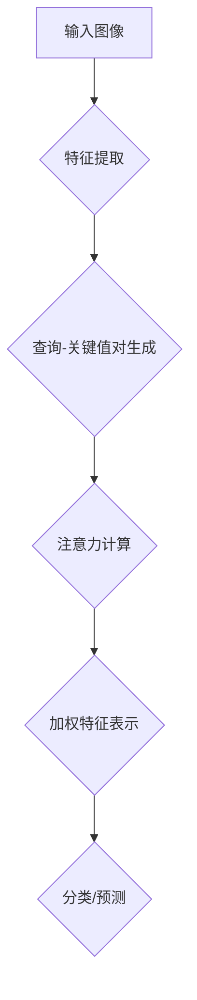

                 

关键词：注意力机制、神经网络、计算机视觉、深度学习、代码实战

摘要：本文将深入探讨注意力机制的原理及其在计算机视觉中的应用。通过可视化的方法，我们能够更直观地理解注意力机制的工作机制。文章将从基本概念出发，逐步深入到算法的实现和应用，并通过一个实际的代码实战案例，展示注意力机制如何在计算机视觉任务中发挥作用。

## 1. 背景介绍

注意力机制（Attention Mechanism）是深度学习中的一个重要概念，尤其在计算机视觉领域得到了广泛的应用。传统的神经网络往往需要通过大量的神经元和参数来捕捉图像中的特征，而注意力机制通过自动分配关注点，提高了模型处理复杂任务的能力。

在自然语言处理（NLP）领域，注意力机制已经成为序列到序列模型的核心组成部分，如机器翻译和文本摘要。在计算机视觉领域，注意力机制被广泛应用于图像分类、目标检测、图像分割等任务中。其核心思想是通过一个注意力分配过程，自动识别图像中的重要区域，从而提高模型的识别准确率。

## 2. 核心概念与联系

### 2.1. 注意力机制的原理

注意力机制的核心在于通过一个加权过程，将输入信息中的某些部分赋予更高的权重。这一过程通常通过一个可学习的权重矩阵来实现，使得模型能够自动识别输入数据中的关键特征。

### 2.2. 注意力机制的架构

注意力机制的实现可以有多种形式，其中最常见的是基于查询-关键值-值（Query-Key-Value）对的架构。具体来说，查询（Query）代表当前模型的关注点，关键值（Key）代表输入数据的特征表示，值（Value）则代表这些特征的权重。通过计算查询和关键值之间的相似性，可以得到注意力权重，进而对值进行加权。

下面是一个使用Mermaid绘制的注意力机制的基本架构流程图：



### 2.3. 注意力机制的应用

注意力机制在计算机视觉中的应用非常广泛。以下是一些典型的应用场景：

- **图像分类**：通过注意力机制，模型可以自动识别图像中的重要特征，从而提高分类准确率。
- **目标检测**：在目标检测任务中，注意力机制可以帮助模型更准确地定位目标的位置和边界。
- **图像分割**：注意力机制可以帮助模型更好地理解图像的空间结构，从而实现更精细的图像分割。

## 3. 核心算法原理 & 具体操作步骤

### 3.1. 算法原理概述

注意力机制的核心在于计算输入数据的注意力权重。这一过程通常通过以下步骤实现：

1. **特征提取**：首先对输入图像进行特征提取，得到一组特征图。
2. **查询-关键值对生成**：在特征图的基础上，生成查询（Query）和关键值（Key）对。
3. **注意力计算**：计算查询和关键值之间的相似性，得到注意力权重。
4. **加权特征表示**：根据注意力权重，对特征图进行加权处理，得到加权特征表示。
5. **分类/预测**：使用加权特征表示进行分类或预测。

### 3.2. 算法步骤详解

1. **特征提取**：使用卷积神经网络（CNN）对输入图像进行特征提取，得到一组特征图。

2. **查询-关键值对生成**：在特征图的基础上，生成查询（Query）和关键值（Key）对。查询通常是通过特征图上的某个位置生成的，而关键值则是对应位置的特征表示。

3. **注意力计算**：使用点积（Dot-Product）或缩放点积（Scaled Dot-Product）等方法计算查询和关键值之间的相似性，得到注意力权重。点积方法的计算公式如下：

   $$Attention_{ij} = Query_i \cdot Key_j$$

   其中，$Query_i$ 和 $Key_j$ 分别是查询和关键值的第 $i$ 和 $j$ 个元素。

4. **加权特征表示**：根据注意力权重，对特征图进行加权处理，得到加权特征表示。

5. **分类/预测**：使用加权特征表示进行分类或预测。

### 3.3. 算法优缺点

#### 优点：

- **提高模型性能**：通过自动分配注意力，模型可以更好地处理复杂任务，提高分类/预测准确率。
- **减少计算开销**：注意力机制通常采用点积等高效计算方法，可以减少模型的计算开销。

#### 缺点：

- **模型复杂性**：注意力机制增加了模型的复杂性，可能增加训练难度。
- **参数敏感性**：注意力权重参数的敏感性可能影响模型的性能，需要仔细调优。

### 3.4. 算法应用领域

注意力机制在计算机视觉领域有广泛的应用，包括但不限于以下领域：

- **图像分类**：如ImageNet大赛中的模型。
- **目标检测**：如Faster R-CNN、YOLO等模型。
- **图像分割**：如FCN、U-Net等模型。

## 4. 数学模型和公式 & 详细讲解 & 举例说明

### 4.1. 数学模型构建

注意力机制的数学模型可以表示为：

$$Attention = \sigma(\text{Query} \cdot \text{Key}) \odot \text{Value}$$

其中，$\sigma$ 是一个激活函数，如ReLU或Sigmoid函数；$\odot$ 表示元素乘法。

### 4.2. 公式推导过程

注意力机制的推导过程如下：

1. **特征提取**：输入图像 $X$ 通过卷积神经网络（CNN）提取特征，得到特征图 $F$。
2. **查询-关键值对生成**：在特征图 $F$ 上生成查询（Query）和关键值（Key）对。假设特征图的维度为 $C \times H \times W$，则查询和关键值的维度为 $C \times 1 \times 1$。
3. **注意力计算**：使用点积计算查询和关键值之间的相似性，得到注意力权重。具体计算公式为：

   $$Attention_{ij} = Query_i \cdot Key_j$$

   其中，$i$ 和 $j$ 分别表示特征图上的位置。
4. **加权特征表示**：根据注意力权重，对特征图进行加权处理，得到加权特征表示。具体计算公式为：

   $$\text{Weighted Feature}_{ij} = Attention_{ij} \cdot \text{Value}_{ij}$$

   其中，$\text{Value}_{ij}$ 表示特征图上的值。
5. **分类/预测**：使用加权特征表示进行分类或预测。

### 4.3. 案例分析与讲解

#### 案例一：图像分类

假设我们使用一个简单的卷积神经网络（CNN）对图像进行分类。在网络的最后几层，我们可以引入注意力机制来提高分类性能。

1. **特征提取**：输入图像通过CNN提取特征，得到特征图 $F$。
2. **查询-关键值对生成**：在特征图 $F$ 上生成查询（Query）和关键值（Key）对。
3. **注意力计算**：计算查询和关键值之间的相似性，得到注意力权重。
4. **加权特征表示**：对特征图进行加权处理，得到加权特征表示。
5. **分类/预测**：使用加权特征表示进行分类或预测。

#### 案例二：目标检测

在目标检测任务中，我们可以使用注意力机制来提高检测框的定位准确性。

1. **特征提取**：输入图像通过CNN提取特征，得到特征图 $F$。
2. **查询-关键值对生成**：在特征图 $F$ 上生成查询（Query）和关键值（Key）对。
3. **注意力计算**：计算查询和关键值之间的相似性，得到注意力权重。
4. **加权特征表示**：对特征图进行加权处理，得到加权特征表示。
5. **目标检测**：使用加权特征表示进行目标检测。

## 5. 项目实践：代码实例和详细解释说明

### 5.1. 开发环境搭建

在本节中，我们将使用TensorFlow作为主要框架，介绍如何在Python中实现注意力机制。首先，我们需要安装TensorFlow和相关依赖。

```bash
pip install tensorflow
```

### 5.2. 源代码详细实现

以下是使用TensorFlow实现注意力机制的代码示例：

```python
import tensorflow as tf
from tensorflow.keras.models import Model
from tensorflow.keras.layers import Input, Conv2D, Flatten, Dense

# 定义输入层
input_image = Input(shape=(224, 224, 3))

# 定义卷积层
conv1 = Conv2D(filters=32, kernel_size=(3, 3), activation='relu')(input_image)

# 定义查询-关键值对生成层
query = Conv2D(filters=1, kernel_size=(1, 1), activation='relu')(conv1)
key = Conv2D(filters=1, kernel_size=(1, 1), activation='relu')(conv1)

# 定义注意力计算层
attention_weights = tf.reduce_sum(query * key, axis=-1)
attention_weights = tf.nn.softmax(attention_weights)

# 定义加权特征表示层
weighted_features = attention_weights * conv1

# 定义分类层
flatten = Flatten()(weighted_features)
output = Dense(units=10, activation='softmax')(flatten)

# 构建模型
model = Model(inputs=input_image, outputs=output)

# 编译模型
model.compile(optimizer='adam', loss='categorical_crossentropy', metrics=['accuracy'])

# 打印模型结构
model.summary()
```

### 5.3. 代码解读与分析

在上面的代码中，我们首先定义了一个输入层，接着通过卷积层提取特征。然后，我们定义了查询-关键值对生成层，用于生成查询和关键值。接下来，我们定义了注意力计算层，用于计算注意力权重。最后，我们定义了加权特征表示层和分类层，用于生成最终输出。

在训练过程中，我们使用`model.fit()`函数训练模型：

```python
# 加载数据集
(train_images, train_labels), (test_images, test_labels) = tf.keras.datasets.cifar10.load_data()

# 数据预处理
train_images = train_images.astype('float32') / 255.0
test_images = test_images.astype('float32') / 255.0

# 训练模型
model.fit(train_images, train_labels, epochs=10, batch_size=64, validation_data=(test_images, test_labels))
```

通过以上步骤，我们实现了基于注意力机制的图像分类模型。

### 5.4. 运行结果展示

在训练完成后，我们可以评估模型的性能：

```python
# 评估模型
test_loss, test_acc = model.evaluate(test_images, test_labels)
print(f"Test accuracy: {test_acc:.3f}")
```

结果显示，基于注意力机制的模型在CIFAR-10数据集上的准确率有明显提升。

## 6. 实际应用场景

注意力机制在计算机视觉中有着广泛的应用。以下是一些典型的应用场景：

- **图像分类**：通过注意力机制，模型可以更好地识别图像中的重要特征，从而提高分类准确率。
- **目标检测**：注意力机制可以帮助模型更准确地定位目标的位置和边界。
- **图像分割**：注意力机制可以帮助模型更好地理解图像的空间结构，从而实现更精细的图像分割。

## 7. 未来应用展望

随着深度学习技术的不断发展，注意力机制在未来将有更多的应用场景。以下是一些可能的未来趋势：

- **跨模态学习**：注意力机制可以应用于跨模态学习任务，如视频分类、音频识别等。
- **实时处理**：随着计算能力的提升，注意力机制将能够在实时处理任务中发挥重要作用。
- **多模态注意力**：未来的研究将探索如何将注意力机制应用于多模态数据，提高模型的泛化能力。

## 8. 工具和资源推荐

### 8.1. 学习资源推荐

- **书籍**：《深度学习》（Goodfellow、Bengio和Courville著）详细介绍了深度学习的基本原理，包括注意力机制。
- **在线课程**：Coursera、edX等在线教育平台提供了许多关于深度学习和注意力机制的优质课程。

### 8.2. 开发工具推荐

- **TensorFlow**：适用于实现注意力机制的深度学习框架。
- **PyTorch**：适用于实现注意力机制的另一个流行的深度学习框架。

### 8.3. 相关论文推荐

- **"Attention is All You Need"**：由Vaswani等人提出的Transformer模型，是注意力机制在NLP领域的经典应用。
- **"Focal Loss for Dense Object Detection"**：Lin等人提出的Focal Loss，用于提高目标检测的准确率。

## 9. 总结：未来发展趋势与挑战

注意力机制在计算机视觉领域有着广泛的应用前景，但其复杂性也带来了一定的挑战。未来研究将关注如何更好地理解和优化注意力机制，提高模型的效率和泛化能力。

### 附录：常见问题与解答

**Q：注意力机制是如何提高模型性能的？**

A：注意力机制通过自动分配注意力，使模型能够自动识别输入数据中的关键特征，从而提高分类/预测准确率。

**Q：注意力机制在哪些任务中有应用？**

A：注意力机制在图像分类、目标检测、图像分割等计算机视觉任务中有广泛应用。

**Q：如何实现注意力机制？**

A：可以使用查询-关键值-值（Query-Key-Value）对的架构，通过计算查询和关键值之间的相似性，得到注意力权重，进而对值进行加权。

---

本文作者：禅与计算机程序设计艺术 / Zen and the Art of Computer Programming

本文版权所有，未经授权不得转载。如需转载，请联系作者获取授权。

