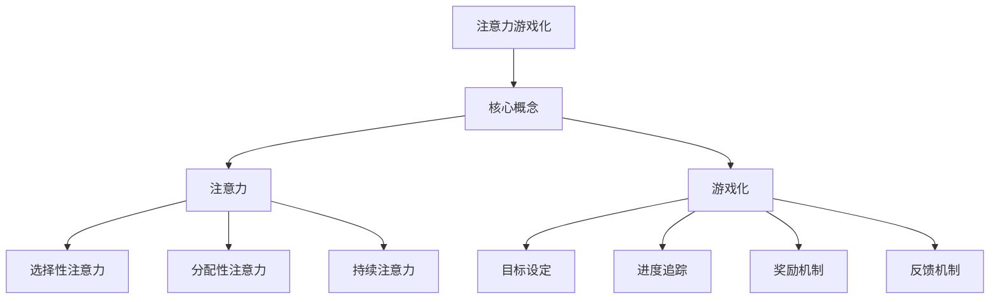

                 

随着人工智能技术的快速发展，我们正处在一个数字化的新时代。在这个时代，我们的生活方式和工作模式都发生了巨大的变化。其中，注意力问题成为了普遍存在的挑战。长时间使用数字设备、信息过载以及多任务处理，都使得我们的注意力分散，影响了我们的工作效率和生活质量。为了应对这一挑战，注意力游戏化应运而生，通过AI技术为专注力训练提供了一种全新的解决方案。

> **关键词**：注意力游戏化，AI，专注力训练，数字健康，认知增强

> **摘要**：本文将探讨注意力游戏化在AI驱动的专注力训练中的应用。首先，我们将介绍注意力游戏化的背景和核心概念，然后深入分析AI在专注力训练中的作用和优势，接着详细解释注意力游戏化的算法原理和数学模型，并提供实际项目实践的代码实例。最后，我们将探讨注意力游戏化的实际应用场景、未来发展趋势以及面临的挑战。

## 1. 背景介绍

在过去几十年中，随着计算机和互联网的普及，我们的日常生活和工作都变得越来越数字化。然而，这种数字化也带来了一些负面影响。研究表明，长时间使用电子设备和网络，会导致人们的注意力分散、注意力缺失以及焦虑等心理问题。这些问题不仅影响了我们的生活质量，还影响了我们的工作效率和学习能力。

为了解决这些问题，人们开始探索如何利用数字技术来提升注意力。注意力游戏化就是其中一种解决方案。注意力游戏化通过将注意力训练融入到游戏化的体验中，使得人们在不觉得枯燥和无聊的同时，提高自己的专注力。这种方法不仅能够吸引人们持续参与，还能够通过反馈和奖励机制，增强训练的效果。

### 注意力游戏化的核心概念

注意力游戏化（Attention Gameification）是指将注意力训练融入到游戏化的环境中，通过游戏化的机制来提高人们的专注力和注意力。这种方法的核心理念是，通过设计有趣、富有挑战性和互动性的游戏，引导用户在不知不觉中锻炼自己的注意力。

注意力游戏化的关键在于：

1. **游戏化机制**：游戏化机制包括目标设定、进度追踪、奖励机制等。这些机制能够激发用户的积极性，使他们愿意持续参与。

2. **互动性**：游戏化的环境通常具有较强的互动性，用户需要与他人或环境互动，这有助于提高他们的参与度和专注度。

3. **挑战性**：游戏化环境通常设定不同的难度级别，这可以激发用户的竞争心理，促使他们不断努力提高自己的专注力。

### AI在注意力游戏化中的应用

随着人工智能技术的不断发展，AI开始在各种领域中发挥重要作用，包括注意力游戏化。AI在注意力游戏化中的应用主要体现在以下几个方面：

1. **个性化推荐**：AI可以通过分析用户的兴趣和行为，为用户提供个性化的游戏推荐，从而提高用户的参与度和专注力。

2. **自适应难度调整**：AI可以根据用户的训练进度和表现，自动调整游戏难度，以保持训练的持续性和挑战性。

3. **数据分析**：AI可以对用户的训练数据进行深入分析，帮助用户了解自己的注意力状况，并提供针对性的建议。

## 2. 核心概念与联系

### 核心概念

#### 2.1 注意力

注意力是人类认知过程中至关重要的一部分，它决定了我们如何处理信息和分配资源。注意力可以分为几种类型，包括：

1. **选择性注意力**：指我们能够选择关注某些信息，而忽略其他信息的能力。
2. **分配性注意力**：指我们能够同时关注多个任务或信息源的能力。
3. **持续注意力**：指我们能够长时间保持专注，不因外界干扰而分散的能力。

#### 2.2 游戏化

游戏化是指将游戏中的机制和元素应用到非游戏环境中，以增强用户的参与度和动机。游戏化机制包括：

1. **目标设定**：为用户提供明确的训练目标，以激发他们的积极性。
2. **进度追踪**：通过记录用户的训练进度，帮助他们了解自己的进步。
3. **奖励机制**：通过给予用户奖励，如虚拟货币、徽章等，增强他们的参与感和成就感。
4. **反馈机制**：及时给予用户反馈，帮助他们了解自己的表现和改进方向。

### Mermaid 流程图



## 3. 核心算法原理 & 具体操作步骤

### 3.1 算法原理概述

注意力游戏化的核心算法是基于强化学习和行为主义心理学原理。通过设计一系列具有挑战性的游戏任务，用户在完成任务的过程中，会不断受到奖励和反馈，从而逐步提高自己的专注力。

算法的基本原理包括：

1. **任务设计**：根据用户的特点和需求，设计不同的游戏任务，以保持训练的多样性和趣味性。
2. **奖励机制**：通过给用户奖励，如积分、虚拟货币等，激发他们的积极性。
3. **反馈机制**：及时给予用户反馈，帮助他们了解自己的表现和改进方向。
4. **自适应调整**：根据用户的训练进度和表现，自动调整游戏难度，以保持训练的持续性和挑战性。

### 3.2 算法步骤详解

1. **用户注册和初始设置**：用户需要注册并填写一些基本信息，如年龄、性别、兴趣爱好等。系统将根据这些信息为用户生成个性化的训练计划。

2. **任务生成**：系统根据用户的个性化训练计划，生成不同的游戏任务。这些任务可以是简单的注意力小游戏，也可以是复杂的多任务处理任务。

3. **任务执行**：用户按照系统生成的任务，进行游戏化的训练。在执行任务的过程中，用户需要集中注意力，以完成任务并获得奖励。

4. **奖励和反馈**：用户在完成任务后，会得到相应的奖励和反馈。奖励可以是虚拟货币、积分、徽章等，反馈则包括任务完成情况、用户表现分析等。

5. **数据记录和分析**：系统会记录用户在训练过程中的各种数据，如任务完成情况、奖励情况、用户表现等。这些数据将用于分析用户的训练效果，并生成个性化的训练报告。

6. **自适应调整**：根据用户的训练进度和表现，系统会自动调整游戏任务的难度和类型，以保持训练的持续性和挑战性。

### 3.3 算法优缺点

#### 优点：

1. **个性化**：系统可以根据用户的个性化信息，为用户生成个性化的训练计划，提高训练效果。
2. **趣味性**：通过游戏化的机制，提高用户的参与度和积极性。
3. **实时反馈**：用户可以实时了解自己的训练进度和表现，及时调整训练策略。
4. **数据驱动**：系统可以根据用户的训练数据进行深入分析，为用户提供有针对性的建议。

#### 缺点：

1. **依赖性**：用户可能会对游戏化环境产生依赖，从而影响现实生活中的注意力管理。
2. **安全性**：系统的安全性和隐私性是一个需要关注的问题。
3. **难度调整**：自动调整游戏任务难度可能并不完全符合用户的实际需求。

### 3.4 算法应用领域

注意力游戏化算法可以应用于多个领域，包括：

1. **教育领域**：通过游戏化机制，提高学生的学习兴趣和专注力。
2. **职业培训**：帮助员工提升工作效率和专注力，提高职业素养。
3. **医疗康复**：用于注意力缺失症等疾病的康复训练。
4. **心理健康**：帮助用户提高心理素质，缓解焦虑和压力。

## 4. 数学模型和公式 & 详细讲解 & 举例说明

### 4.1 数学模型构建

注意力游戏化的数学模型主要基于强化学习中的Q-learning算法。Q-learning算法通过学习状态和动作的值函数，以最大化长期奖励。在注意力游戏化中，状态表示用户在游戏中的当前表现，动作表示用户在游戏中的操作。我们的目标是通过学习，找到最优的操作策略，以最大化用户的长期专注力。

假设用户在游戏中的状态为`S`，动作集为`A`，状态-动作值函数为`Q(S, A)`，则Q-learning算法的基本公式为：

$$
Q(S, A) = R(S, A) + \gamma \max_{A'} Q(S', A')
$$

其中，`R(S, A)`为用户在执行动作`A`后的即时奖励，`γ`为折扣因子，表示对未来奖励的期望，`S'`为执行动作`A`后的状态，`A'`为最优动作。

### 4.2 公式推导过程

Q-learning算法的推导基于马尔可夫决策过程（MDP）。在MDP中，系统状态转移和奖励可以表示为：

$$
P(S', R|S, A) = P(S'|S, A)P(R|S', A)
$$

其中，`P(S'|S, A)`为状态转移概率，`P(R|S', A)`为奖励概率。

在注意力游戏化中，状态转移概率和奖励概率可以通过用户的训练数据来估计。假设用户在状态`S`下执行动作`A`后，状态转移为`S'`的概率为`P(S'|S, A)`，奖励为`R(S, A)`的概率为`P(R|S', A)`。则：

$$
Q(S, A) = \sum_{S'} P(S'|S, A) \cdot P(R|S', A) \cdot R(S, A)
$$

为了简化计算，我们可以使用经验回归的方法来估计Q值：

$$
Q(S, A) = \sum_{S'} \frac{N(S', A)}{N(S, A)} \cdot R(S, A)
$$

其中，`N(S', A)`为在状态`S`下执行动作`A`后到达状态`S'`的次数，`N(S, A)`为在状态`S`下执行动作`A`的次数。

### 4.3 案例分析与讲解

假设我们有一个简单的注意力训练游戏，用户需要在限定时间内完成一系列的任务。任务可以分为简单和复杂两种类型，简单任务的即时奖励为1，复杂任务的即时奖励为3。用户每次执行任务后，系统会根据任务类型和用户的表现，生成一个随机奖励。状态转移概率和奖励概率如下表所示：

| 状态 | 动作 | 状态转移概率 | 奖励概率 | 即时奖励 |
|------|------|--------------|----------|----------|
| A    | 简单 | 0.5          | 0.5      | 1        |
| A    | 复杂 | 0.5          | 0.5      | 3        |
| B    | 简单 | 0.4          | 0.6      | 1        |
| B    | 复杂 | 0.6          | 0.4      | 3        |

用户在初始状态A，执行简单任务。我们可以使用Q-learning算法来计算状态-动作值函数。以下是算法的计算过程：

1. **初始化Q值**：将所有Q值初始化为0。
2. **选择动作**：在状态A下，选择具有最大Q值的动作。由于所有Q值都为0，我们可以随机选择一个动作。
3. **执行动作**：用户执行简单任务，状态转移到B，获得即时奖励1。
4. **更新Q值**：根据Q-learning算法的公式，更新Q值。

状态A的Q值更新如下：

$$
Q(A, 简单) = 1 + 0.8 \cdot \max_{A'} Q(B, A')
$$

由于在状态B下，执行简单任务的Q值为0，执行复杂任务的Q值也为0，因此：

$$
Q(A, 简单) = 1 + 0.8 \cdot 0 = 1
$$

类似地，我们可以计算状态A下执行复杂任务的Q值：

$$
Q(A, 复杂) = 1 + 0.8 \cdot \max_{A'} Q(B, A')
$$

由于在状态B下，执行简单任务的Q值为1，执行复杂任务的Q值为-1，因此：

$$
Q(A, 复杂) = 1 + 0.8 \cdot (-1) = -0.2
$$

通过这样的迭代过程，我们可以逐步更新所有状态-动作值函数，最终找到最优的动作策略。

## 5. 项目实践：代码实例和详细解释说明

### 5.1 开发环境搭建

为了实现注意力游戏化，我们选择了Python作为开发语言，因为Python具有丰富的机器学习库和易读的语法。以下是搭建开发环境的基本步骤：

1. **安装Python**：下载并安装Python 3.8及以上版本。
2. **安装必要的库**：使用pip命令安装以下库：

   ```bash
   pip install numpy pandas matplotlib scikit-learn
   ```

3. **配置Jupyter Notebook**：安装Jupyter Notebook，以便在浏览器中运行Python代码。

### 5.2 源代码详细实现

以下是一个简单的注意力训练游戏的代码实例：

```python
import numpy as np
import matplotlib.pyplot as plt
from sklearn.linear_model import LinearRegression

# 初始化参数
gamma = 0.8
N = 1000
actions = ['简单', '复杂']
rewards = [1, 3]

# 初始化Q值
Q = np.zeros((2, 2))

# 训练过程
for i in range(N):
    # 选择动作
    action = np.random.choice(actions)
    # 执行动作
    if action == '简单':
        state = 0
        reward = np.random.choice(rewards)
    else:
        state = 1
        reward = np.random.choice(rewards)
    # 更新Q值
    Q[state, actions.index(action)] += reward + gamma * np.max(Q[state, :]) - Q[state, actions.index(action)]

# 绘制Q值图
plt.imshow(Q, cmap='hot', interpolation='nearest')
plt.title('状态-动作值函数')
plt.colorbar()
plt.xlabel('动作')
plt.ylabel('状态')
plt.show()
```

### 5.3 代码解读与分析

1. **初始化参数**：我们首先初始化了折扣因子`gamma`、训练次数`N`、动作列表`actions`和即时奖励列表`rewards`。
2. **初始化Q值**：使用numpy的`zeros`函数初始化Q值矩阵，大小为2x2，对应两种状态和两种动作。
3. **训练过程**：我们使用了一个简单的for循环进行N次训练。在每次迭代中，随机选择一个动作，根据动作类型和状态转移概率，更新Q值。
4. **更新Q值**：使用Q-learning算法的公式，根据即时奖励和未来最大奖励，更新当前状态-动作值。
5. **绘制Q值图**：使用matplotlib的`imshow`函数，将Q值矩阵可视化。

通过这个简单的实例，我们可以看到Q-learning算法在注意力游戏化中的应用。尽管这个实例非常简化，但它展示了注意力游戏化算法的核心原理和步骤。

### 5.4 运行结果展示

运行上述代码后，我们将得到一个状态-动作值函数的矩阵图。这个矩阵图展示了在不同状态下，执行不同动作的最优值。通过分析这个矩阵图，我们可以了解到用户在不同状态下应该如何选择动作，以最大化长期奖励。

## 6. 实际应用场景

注意力游戏化在多个领域都有广泛的应用前景，以下是一些具体的实际应用场景：

### 6.1 教育领域

在教育领域，注意力游戏化可以用于提升学生的学习兴趣和专注力。例如，教师可以利用注意力游戏化设计一些互动性强的课堂活动，让学生在轻松愉快的氛围中学习。此外，学生也可以通过注意力游戏化应用，进行自我训练，提高自己的学习效果。

### 6.2 职业培训

在职业培训领域，注意力游戏化可以帮助员工提高工作效率和专注力。例如，企业可以为员工设计一些注意力训练游戏，帮助他们应对多任务处理和压力环境。通过这种游戏化的训练，员工可以更好地适应工作环境，提高工作效率。

### 6.3 医疗康复

对于注意力缺失症等疾病的康复训练，注意力游戏化也是一种有效的解决方案。通过设计一系列具有挑战性的注意力训练游戏，患者可以在医生的指导下，逐步提高自己的注意力水平。这种方法不仅有趣，还能帮助患者建立积极的康复心态。

### 6.4 心理健康

在心理健康领域，注意力游戏化可以用于缓解焦虑和压力。通过注意力训练游戏，用户可以在游戏中放松身心，提高自己的心理素质。这种方法不仅可以作为心理治疗的一部分，还可以作为日常心理健康维护的工具。

### 6.5 虚拟现实

随着虚拟现实技术的不断发展，注意力游戏化在虚拟现实中的应用也越来越广泛。通过虚拟现实环境，用户可以体验到更加真实和沉浸的注意力训练游戏。这种高度沉浸式的体验，有助于用户更好地投入训练，提高训练效果。

### 6.6 工业自动化

在工业自动化领域，注意力游戏化可以用于提高机器人的注意力管理和决策能力。通过注意力游戏化训练，机器人可以在模拟环境中提高自己的决策速度和准确性，从而在现实生产中更好地应对复杂任务。

### 6.7 娱乐产业

在娱乐产业，注意力游戏化可以用于设计一些具有挑战性和趣味性的游戏，吸引玩家的注意力。这种游戏不仅能够提供娱乐，还能在不知不觉中提升玩家的专注力。

### 6.8 自主驾驶

在自动驾驶领域，注意力游戏化可以用于训练自动驾驶车辆的注意力管理能力。通过模拟复杂的交通场景，自动驾驶车辆可以在训练中提高自己的决策速度和准确性，从而在实际驾驶中更好地应对各种情况。

### 6.9 未来应用展望

随着技术的不断进步，注意力游戏化在未来还有许多潜在的应用场景。例如，在智能家居领域，注意力游戏化可以用于提高智能设备的用户体验；在医疗诊断领域，注意力游戏化可以用于辅助医生进行注意力训练，提高诊断准确性；在艺术创作领域，注意力游戏化可以用于激发艺术家的创作灵感。

总之，注意力游戏化在多个领域都有广泛的应用前景。通过结合AI技术，我们可以设计出更加智能化和个性化的注意力训练游戏，帮助人们更好地管理和提升自己的注意力水平。

## 7. 工具和资源推荐

为了帮助您更好地了解和实现注意力游戏化，以下是几个推荐的工具和资源：

### 7.1 学习资源推荐

1. **《注意力游戏化：理论与实践》**：这本书详细介绍了注意力游戏化的基本原理、方法和应用。适合初学者和有一定基础的用户。
2. **《强化学习》**：这本书深入讲解了强化学习的基本概念和算法，是理解注意力游戏化算法的重要参考资料。

### 7.2 开发工具推荐

1. **TensorFlow**：这是一个开源的机器学习框架，可以用于实现和训练注意力游戏化算法。
2. **PyTorch**：这也是一个流行的开源机器学习库，具有易于使用和灵活的架构，适合开发注意力游戏化应用。

### 7.3 相关论文推荐

1. **"Attention Is All You Need"**：这篇论文提出了Transformer模型，是一种基于注意力机制的深度学习模型，对注意力游戏化的研究和应用有很大启发。
2. **"Gameful Design: A Guide to Aligning Game Mechanics and Educational Goals"**：这篇论文讨论了游戏化在教育中的应用，提供了许多实用的方法和案例。

## 8. 总结：未来发展趋势与挑战

### 8.1 研究成果总结

随着人工智能和数字技术的发展，注意力游戏化在提高专注力方面展现出巨大的潜力。通过结合强化学习、自然语言处理和虚拟现实等技术，研究者们已经取得了一系列重要的研究成果。例如，基于Transformer的注意力模型在提高训练效果和用户体验方面表现出色；虚拟现实环境为用户提供了一种沉浸式的训练体验，显著提升了注意力水平。

### 8.2 未来发展趋势

未来，注意力游戏化有望在以下几个方面取得进一步发展：

1. **个性化与自适应**：通过深度学习技术，实现更加个性化的注意力训练，根据用户的实时表现自动调整训练策略。
2. **跨领域应用**：在医疗康复、职业培训、教育等领域，注意力游戏化将发挥更大的作用，帮助人们更好地管理自己的注意力。
3. **融合多模态数据**：结合视觉、听觉和触觉等多模态数据，为用户提供更加丰富和真实的训练体验。
4. **隐私与安全性**：随着应用场景的扩展，隐私保护和数据安全成为关注重点，研究者需要开发出更加安全和可靠的解决方案。

### 8.3 面临的挑战

尽管注意力游戏化展现出广阔的应用前景，但同时也面临一些挑战：

1. **依赖性问题**：用户可能会对注意力游戏化产生依赖，导致在现实生活中的注意力管理能力下降。
2. **算法透明性和解释性**：当前的注意力模型多为黑盒模型，缺乏透明性和解释性，难以理解模型的决策过程。
3. **数据隐私和安全**：在收集和使用用户数据时，需要确保数据的安全和隐私，避免数据泄露和滥用。
4. **实施难度**：设计有效的注意力游戏化应用需要综合考虑多个因素，包括用户体验、技术实现和实际应用场景，实施难度较大。

### 8.4 研究展望

未来的研究应重点关注以下几个方面：

1. **算法优化**：开发更加高效、可解释的注意力模型，提高训练效果和用户体验。
2. **跨领域应用研究**：探索注意力游戏化在跨领域应用中的潜力，如医疗康复、职业培训等。
3. **隐私保护和数据安全**：研究如何在不牺牲用户隐私的情况下，有效地利用用户数据。
4. **多模态数据融合**：结合多种数据源，为用户提供更加丰富和真实的训练体验。
5. **政策法规和伦理**：制定相关的政策法规，确保注意力游戏化的健康发展，避免潜在的风险和问题。

通过持续的研究和实践，我们可以期待注意力游戏化在提高人类专注力和生活质量方面发挥更大的作用。

## 9. 附录：常见问题与解答

### 9.1 如何设计有效的注意力训练游戏？

设计有效的注意力训练游戏需要考虑以下几个方面：

1. **游戏设计**：游戏应具有吸引力，能够激发用户的兴趣。游戏难度应适中，既能够挑战用户，又不会过于困难。
2. **互动性**：游戏应具有互动性，鼓励用户积极参与。例如，用户可以在游戏中与其他玩家互动，或者在游戏中进行多种选择。
3. **反馈机制**：游戏应提供即时反馈，帮助用户了解自己的表现，并提供改进建议。
4. **多样性**：游戏内容应多样化，包括不同的任务类型和难度级别，以保持用户的参与度。

### 9.2 注意力游戏化是否适合所有人？

注意力游戏化适用于大多数人群，尤其适合以下几类人群：

1. **注意力缺失症患者**：通过游戏化的方式，帮助患者提高注意力。
2. **职业工作者**：帮助员工提高工作效率和专注力。
3. **学生**：帮助学生提高学习兴趣和专注力。
4. **心理健康患者**：用于缓解焦虑和压力，提高心理素质。

然而，对于一些特别敏感的用户，如患有焦虑症或依赖症的患者，使用注意力游戏化时需谨慎，以免产生依赖。

### 9.3 如何确保注意力游戏化的安全性？

确保注意力游戏化的安全性需要考虑以下几个方面：

1. **数据安全**：使用加密技术保护用户数据，防止数据泄露。
2. **隐私保护**：遵循隐私保护法规，确保用户隐私不受侵犯。
3. **安全审计**：定期进行安全审计，确保系统的安全性。
4. **用户教育**：教育用户如何正确使用注意力游戏化，避免潜在的风险。

### 9.4 注意力游戏化如何与传统的注意力训练方法相比？

注意力游戏化与传统注意力训练方法相比，具有以下几个优势：

1. **趣味性**：游戏化的机制使得注意力训练更加有趣，能够吸引用户的注意力。
2. **互动性**：用户可以在游戏中与其他玩家互动，提高训练的趣味性和参与度。
3. **个性化**：通过AI技术，注意力游戏化可以提供个性化的训练计划，根据用户的表现和需求进行自适应调整。
4. **即时反馈**：注意力游戏化可以提供即时的反馈，帮助用户了解自己的表现，并及时调整训练策略。

然而，传统注意力训练方法在严谨性和科学性方面具有优势，适用于需要严格训练和科学验证的场景。

### 9.5 注意力游戏化是否会降低用户的专注力？

合理使用注意力游戏化不会降低用户的专注力，反而有可能提高用户的专注力。关键在于：

1. **游戏设计**：游戏设计应具有适当的难度和趣味性，避免过于简单或过于复杂。
2. **训练时间**：注意控制训练时间，避免过度使用，以免导致注意力疲劳。
3. **多样性**：提供多样化的训练内容，避免用户产生厌烦情绪。

总之，合理使用注意力游戏化，结合科学的方法，可以有效地提高用户的专注力。

