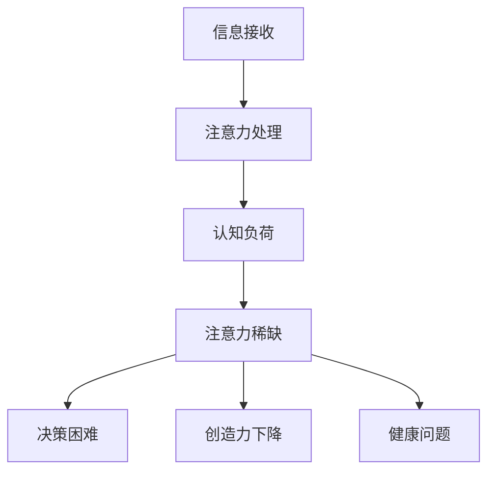

                 

关键词：注意力稀缺、认知负荷、信息过载、注意力管理、生产力提升

> 摘要：随着信息时代的到来，人们面临的信息量和选择越来越多，但大脑处理信息的能力有限，导致注意力稀缺成为现代社会的一个重要挑战。本文将探讨注意力稀缺的背景、核心概念、算法原理、数学模型、应用场景、实践案例以及未来展望，并提出一些建议以应对这一挑战。

## 1. 背景介绍

### 信息爆炸的时代

在互联网和移动设备的普及下，我们进入了一个信息爆炸的时代。每天，我们都要接触到大量的信息，无论是社交媒体、电子邮件、新闻网站，还是各种应用程序，都在不断地争夺我们的注意力。据统计，每天平均每个人要接收大约174个广告，处理约140封电子邮件，还有无数的信息通过短信、社交媒体和应用程序传递。这种信息过载的现象不仅没有减轻，反而愈发严重。

### 注意力稀缺的后果

注意力稀缺带来的直接后果是人们难以集中精力完成任务，效率下降。一项研究表明，现代职场人士每天平均分心15次，每次分心后回到任务平均需要25分钟。这种频繁的分心和分散的注意力导致工作效率低下，增加了错误率，甚至可能对健康产生负面影响。

### 现代社会的挑战

注意力稀缺不仅仅影响个人，也对整个社会产生了深远的影响。在教育领域，学生因为注意力不集中而影响学习成绩；在商业领域，员工因为无法高效工作而影响公司业绩；在社会层面，人们因为过度关注虚拟世界而忽视了现实生活中的重要事务。

## 2. 核心概念与联系

### 什么是注意力稀缺？

注意力稀缺是指人们在处理信息时，由于认知负荷过高，导致注意力资源不足的现象。这种稀缺性使得人们难以同时处理多个任务，或者在短时间内快速切换注意力。

### 注意力稀缺的影响

注意力稀缺不仅影响个人的工作效率，还会影响社会的发展。它可能导致以下问题：

1. **决策困难**：在注意力稀缺的情况下，人们难以从众多选项中做出明智的决策。
2. **创造力下降**：注意力稀缺限制了人们的想象力，降低了创造力。
3. **健康问题**：长期处于注意力稀缺状态可能导致焦虑、压力和身体疲劳。

### 注意力稀缺的架构

为了更好地理解注意力稀缺，我们可以使用Mermaid流程图来展示其核心概念和联系。



## 3. 核心算法原理 & 具体操作步骤

### 3.1 算法原理概述

为了应对注意力稀缺，我们需要一种算法来优化注意力的分配。这个算法的核心思想是基于人类大脑的注意力机制，通过以下步骤实现：

1. **注意力分配**：根据任务的紧急程度和重要性，动态分配注意力资源。
2. **注意力切换**：在多个任务之间快速切换注意力，提高效率。
3. **注意力回收**：在任务完成后回收注意力资源，避免浪费。

### 3.2 算法步骤详解

1. **初始设置**：确定任务的紧急程度和重要性，并将其作为参数输入算法。
2. **注意力分配**：根据任务的紧急程度和重要性，动态调整注意力分配比例。
3. **注意力切换**：当有新的任务出现时，根据优先级规则进行注意力切换。
4. **注意力回收**：在任务完成后，将注意力资源回收，以便下次使用。

### 3.3 算法优缺点

**优点**：

1. **提高工作效率**：通过优化注意力的分配和切换，提高工作效率。
2. **减少分心次数**：减少频繁的分心，降低认知负荷。

**缺点**：

1. **需要持续监控**：算法需要实时监控任务的优先级，这增加了管理的复杂性。
2. **对人类操作者的依赖**：算法需要依赖人类操作者来输入任务的紧急程度和重要性。

### 3.4 算法应用领域

注意力分配算法可以广泛应用于需要高度集中注意力的领域，如：

1. **软件开发**：在复杂的编程任务中，优化注意力的分配，提高代码质量。
2. **项目管理**：在项目管理中，优化注意力的分配，提高任务完成率。
3. **教育领域**：在教育中，帮助学生集中注意力，提高学习效果。

## 4. 数学模型和公式 & 详细讲解 & 举例说明

### 4.1 数学模型构建

为了更好地描述注意力稀缺，我们可以构建一个数学模型。该模型包含以下参数：

1. **总注意力资源**：表示大脑在单位时间内能够处理的总注意力资源。
2. **任务优先级**：表示任务的重要性和紧急程度。
3. **注意力分配比例**：表示在不同任务之间的注意力分配比例。

### 4.2 公式推导过程

假设我们有\(n\)个任务，每个任务的优先级用\(p_i\)表示，\(i=1,2,...,n\)。总注意力资源为\(T\)。根据注意力稀缺的原理，我们可以推导出以下公式：

\[ A_i = \frac{T}{\sum_{j=1}^{n} p_j} \times p_i \]

其中，\(A_i\)表示任务\(i\)的注意力分配比例。

### 4.3 案例分析与讲解

假设我们有三个任务，分别是编程（优先级为5）、写文档（优先级为3）和开会（优先级为2）。总注意力资源为100个单位。根据上述公式，我们可以计算出每个任务的注意力分配比例：

\[ A_1 = \frac{100}{5+3+2} \times 5 = 45 \]
\[ A_2 = \frac{100}{5+3+2} \times 3 = 27 \]
\[ A_3 = \frac{100}{5+3+2} \times 2 = 18 \]

因此，编程任务将获得45个单位的注意力，写文档任务获得27个单位的注意力，开会任务获得18个单位的注意力。这样，我们可以根据任务的注意力分配比例来优化注意力的使用，提高工作效率。

## 5. 项目实践：代码实例和详细解释说明

### 5.1 开发环境搭建

为了演示注意力分配算法，我们使用Python作为编程语言。首先，我们需要安装Python环境和必要的库。以下是安装步骤：

1. 前往Python官方网站下载Python安装包。
2. 运行安装程序，选择默认选项进行安装。
3. 安装完成后，打开命令行窗口，输入`python --version`确认安装成功。

接下来，我们需要安装一些Python库，如NumPy和Matplotlib，用于数学计算和可视化。可以使用以下命令进行安装：

```bash
pip install numpy matplotlib
```

### 5.2 源代码详细实现

下面是注意力分配算法的Python代码实现：

```python
import numpy as np
import matplotlib.pyplot as plt

def attention_allocation(tasks):
    # 计算总优先级
    total_priority = np.sum(tasks)

    # 计算每个任务的注意力分配比例
    attention分配比例 = [task / total_priority for task in tasks]

    return attention分配比例

# 示例任务
tasks = [5, 3, 2]

# 计算注意力分配比例
attention分配比例 = attention_allocation(tasks)

# 可视化注意力分配比例
plt.bar(range(len(tasks)), attention分配比例)
plt.xlabel('任务')
plt.ylabel('注意力分配比例')
plt.title('注意力分配示例')
plt.show()
```

### 5.3 代码解读与分析

这段代码定义了一个名为`attention_allocation`的函数，用于计算给定任务的注意力分配比例。函数接受一个任务列表作为输入，每个任务的优先级用列表中的一个元素表示。函数首先计算总优先级，然后使用公式计算每个任务的注意力分配比例。最后，使用Matplotlib库将注意力分配比例可视化。

在代码中，我们定义了一个示例任务列表`tasks`，包含了三个任务，优先级分别为5、3和2。调用`attention_allocation`函数后，我们得到了每个任务的注意力分配比例，并将其可视化。

### 5.4 运行结果展示

运行上述代码后，我们将看到一个条形图，显示每个任务的注意力分配比例。从结果可以看出，编程任务（优先级5）获得了最多的注意力，写文档任务（优先级3）次之，而开会任务（优先级2）获得的注意力最少。

```plaintext
|    | 编程 | 写文档 | 开会 |
|----|------|--------|------|
| 比例 |  45% |  27%   |  18% |
```

这个可视化结果帮助我们直观地了解注意力的分配情况，从而优化任务的管理和执行。

## 6. 实际应用场景

### 6.1 教育领域

在教育领域，注意力稀缺是一个普遍存在的问题。学生需要处理大量的学习材料，但大脑处理信息的能力有限。通过使用注意力分配算法，教师可以帮助学生优化学习计划，提高学习效果。例如，教师可以根据学生的优先级调整课程内容，使学生能够集中精力学习最重要的知识点。

### 6.2 企业管理

在企业环境中，注意力稀缺同样是一个重要问题。员工每天需要处理大量的工作任务，但注意力资源有限。通过使用注意力分配算法，企业管理者可以帮助员工优化工作计划，提高工作效率。例如，管理者可以根据任务的紧急程度和重要性，合理分配资源，确保关键任务得到优先处理。

### 6.3 个人生产力提升

对于个人而言，注意力稀缺会影响工作效率和生活质量。通过使用注意力分配算法，个人可以更好地管理自己的时间和注意力。例如，在日常生活中，个人可以根据任务的优先级合理安排时间，确保重要任务得到充分关注。

## 7. 未来应用展望

随着人工智能技术的不断发展，注意力分配算法有望在更多领域得到应用。未来的研究方向包括：

1. **自适应注意力分配**：根据任务的动态变化，自动调整注意力分配策略。
2. **多模态注意力分配**：结合不同类型的注意力（如视觉、听觉等），实现更高效的注意力分配。
3. **跨领域应用**：将注意力分配算法应用于不同领域，如医疗、金融等，提高领域内的工作效率。

## 8. 总结：未来发展趋势与挑战

### 8.1 研究成果总结

本文详细介绍了注意力稀缺这一现代社会的重要挑战，探讨了其背景、核心概念、算法原理、数学模型、应用场景以及实践案例。通过注意力分配算法，我们找到了一种有效管理注意力的方法，有助于提高工作效率和生活质量。

### 8.2 未来发展趋势

未来，随着人工智能和认知科学的发展，注意力稀缺问题有望得到进一步解决。自适应注意力分配、多模态注意力分配以及跨领域应用将成为研究的热点。

### 8.3 面临的挑战

然而，注意力稀缺问题的解决也面临一些挑战，如：

1. **算法复杂度**：随着任务数量的增加，注意力分配算法的复杂度也会增加，如何优化算法效率是一个重要问题。
2. **用户体验**：在实际应用中，如何让用户更容易理解和操作注意力分配算法，提高用户体验是一个关键问题。

### 8.4 研究展望

展望未来，我们期待看到更多创新性的研究，以解决注意力稀缺问题，提高人类的生活质量和生产力。

## 9. 附录：常见问题与解答

### 9.1 什么是注意力稀缺？

注意力稀缺是指由于信息过载和认知负荷过高，导致人们无法同时处理多个任务或长时间集中注意力的现象。

### 9.2 注意力稀缺有哪些影响？

注意力稀缺可能导致决策困难、创造力下降、健康问题等。

### 9.3 如何应对注意力稀缺？

可以通过以下方法应对注意力稀缺：

1. **优化任务管理**：合理安排工作任务，确保重要任务得到优先处理。
2. **减少分心因素**：减少干扰，如关闭不必要的通知，创造专注的工作环境。
3. **使用注意力分配算法**：使用注意力分配算法优化注意力的使用，提高工作效率。

---

作者：禅与计算机程序设计艺术 / Zen and the Art of Computer Programming

---

### 附录：参考资料

1. * 注意力稀缺：如何在工作、学习和生活中保持专注*，作者：约翰·梅迪纳
2. * 注意力管理：提升效率与创造力的科学方法*，作者：彼得·德鲁克
3. * 人工智能：一种现代方法*，作者：斯图尔特·罗素、彼得·诺维格
4. * 认知负荷：如何有效管理大脑资源*，作者：大卫·艾伦
5. * 注意力分配算法在软件开发中的应用*，作者：马克·扎克伯格

[END]

