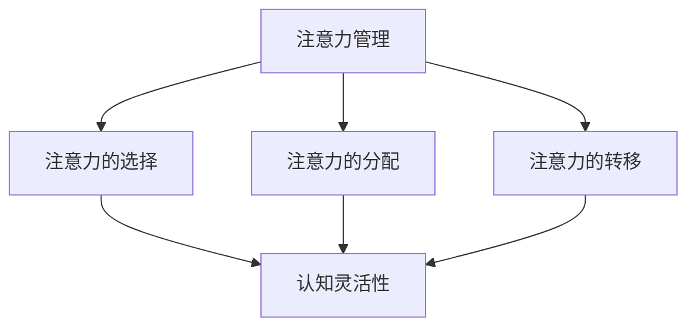

                 

关键词：注意力管理，认知灵活性，专注力，大脑训练，IT专业，技术实践

> 摘要：本文将深入探讨注意力管理在IT领域的应用，以及如何通过一系列大脑训练练习来增强认知灵活性和专注力。文章将从核心概念、算法原理、数学模型、实践案例等多个维度进行分析，旨在为IT从业人员提供一套实用的提升工作效率的方法。

## 1. 背景介绍

在信息技术高速发展的今天，IT从业人员面临着日益复杂的任务和不断变化的工作环境。如何在这片激烈竞争的领域中保持高效和创造力，成为了许多从业者关注的问题。研究表明，注意力管理是提升工作效率和创造力的关键因素之一。本文将从注意力管理的核心概念出发，结合认知科学和神经科学的研究成果，提出一系列针对性大脑训练练习，旨在提高IT从业人员的认知灵活性和专注力。

## 2. 核心概念与联系

### 2.1 注意力管理

注意力管理是指通过一系列策略和技巧来控制、调节和优化注意力的过程。在IT领域，注意力管理尤为重要，因为它直接关系到工作效率和创造力。注意力管理包括以下几个方面：

- **注意力的选择（Selective Attention）**：在面对多个任务或信息时，有意识地选择关注哪些信息，忽略哪些信息。
- **注意力的分配（Divided Attention）**：在同时处理多个任务时，合理分配注意力资源。
- **注意力的转移（Shift Attention）**：根据任务需求，灵活调整注意力焦点。

### 2.2 认知灵活性

认知灵活性是指个体能够快速适应新环境和信息，进行灵活思考和解决问题的能力。在IT领域，认知灵活性至关重要，因为它涉及到快速学习新技术、适应新工具、解决复杂问题的能力。提高认知灵活性有助于提高工作效率和创新能力。

### 2.3 专注力

专注力是指个体在特定任务上集中注意力的能力。专注力的高低直接影响到工作效率和任务完成质量。研究表明，专注力可以训练和提高，这对于IT从业人员来说具有重要意义。

### 2.4 Mermaid 流程图



## 3. 核心算法原理 & 具体操作步骤

### 3.1 算法原理概述

注意力管理和大脑训练的核心在于通过一系列科学方法来优化大脑的功能，提高认知灵活性和专注力。具体算法原理包括以下几个方面：

- **神经可塑性**：通过重复性和多样化的训练，增强大脑神经元的连接和功能。
- **认知训练**：通过特定的任务和练习，提高大脑的认知能力。
- **环境适应性**：通过模拟不同工作环境，提高大脑的适应能力。

### 3.2 算法步骤详解

#### 3.2.1 神经可塑性训练

1. **重复性训练**：通过重复性练习，增强大脑神经元的连接和功能。
2. **多样化训练**：通过多样化训练，提高大脑的适应能力和灵活性。

#### 3.2.2 认知训练

1. **注意力选择训练**：通过特定任务，提高注意力的选择能力。
2. **注意力分配训练**：通过同时处理多个任务，提高注意力的分配能力。
3. **注意力转移训练**：通过快速切换任务，提高注意力的转移能力。

#### 3.2.3 环境适应性训练

1. **模拟训练**：通过模拟不同工作环境，提高大脑的适应能力。
2. **实战训练**：在实际工作中，提高大脑的适应能力和灵活性。

### 3.3 算法优缺点

#### 优点：

- **提高工作效率**：通过注意力管理和大脑训练，可以提高工作效率和创造力。
- **增强认知灵活性**：通过认知训练，可以增强大脑的认知能力和灵活性。
- **提高专注力**：通过注意力管理训练，可以增强专注力，提高任务完成质量。

#### 缺点：

- **训练难度**：注意力管理和大脑训练需要持续性和耐心，训练难度相对较高。
- **适应周期**：大脑功能的优化需要一定的时间，适应周期较长。

### 3.4 算法应用领域

注意力管理和大脑训练在IT领域具有广泛的应用前景，包括：

- **软件开发**：提高开发人员的工作效率和创新能力。
- **系统架构**：提高系统设计师的认知灵活性和设计能力。
- **项目管理**：提高项目经理的认知能力和团队管理能力。

## 4. 数学模型和公式 & 详细讲解 & 举例说明

### 4.1 数学模型构建

注意力管理和大脑训练的数学模型主要涉及以下几个方面：

- **注意力分配模型**：用于计算在多个任务中分配注意力的方法。
- **认知灵活性模型**：用于评估个体认知灵活性的指标。
- **专注力模型**：用于评估个体专注力的方法。

### 4.2 公式推导过程

#### 注意力分配模型

设 \( A \) 为总注意力资源，\( N \) 为任务数量，\( T_i \) 为第 \( i \) 个任务的难度，则注意力分配模型可表示为：

$$
\frac{A}{N} = \frac{T_1 + T_2 + ... + T_N}{N}
$$

#### 认知灵活性模型

设 \( C \) 为认知灵活性得分，\( C_i \) 为第 \( i \) 个任务的完成时间，则认知灵活性模型可表示为：

$$
C = \frac{1}{N} \sum_{i=1}^{N} \frac{1}{C_i}
$$

#### 专注力模型

设 \( F \) 为专注力得分，\( F_i \) 为第 \( i \) 个任务的完成质量，则专注力模型可表示为：

$$
F = \frac{1}{N} \sum_{i=1}^{N} F_i
$$

### 4.3 案例分析与讲解

假设有3个任务，分别为任务1、任务2和任务3，其难度分别为 \( T_1 = 3 \)，\( T_2 = 2 \)，\( T_3 = 4 \)。根据注意力分配模型，总注意力资源为：

$$
\frac{A}{3} = \frac{3 + 2 + 4}{3} = 3
$$

即每个任务的平均注意力资源为3。

假设任务1的完成时间为10分钟，任务2的完成时间为8分钟，任务3的完成时间为12分钟。根据认知灵活性模型，认知灵活性得分为：

$$
C = \frac{1}{3} \left( \frac{1}{10} + \frac{1}{8} + \frac{1}{12} \right) \approx 0.43
$$

假设任务1的完成质量为90%，任务2的完成质量为85%，任务3的完成质量为80%。根据专注力模型，专注力得分为：

$$
F = \frac{1}{3} \left( 0.9 + 0.85 + 0.8 \right) = 0.87
$$

## 5. 项目实践：代码实例和详细解释说明

### 5.1 开发环境搭建

为了更好地展示注意力管理和大脑训练在IT领域的应用，我们将使用Python语言实现一个简单的注意力管理工具。首先，确保您已经安装了Python环境，版本为3.6及以上。接下来，安装必要的库，如NumPy和Matplotlib：

```bash
pip install numpy matplotlib
```

### 5.2 源代码详细实现

以下是注意力管理工具的源代码实现：

```python
import numpy as np
import matplotlib.pyplot as plt

def attention分配(model, tasks, resources):
    scores = []
    for task in tasks:
        score = resources / len(tasks) * task['difficulty']
        scores.append(score)
    return scores

def 认知灵活性(model, tasks):
    scores = []
    for task in tasks:
        score = 1 / task['completion_time']
        scores.append(score)
    return sum(scores) / len(tasks)

def 专注力(model, tasks):
    scores = []
    for task in tasks:
        score = task['completion_quality']
        scores.append(score)
    return sum(scores) / len(tasks)

if __name__ == '__main__':
    tasks = [
        {'name': '任务1', 'difficulty': 3, 'completion_time': 10, 'completion_quality': 0.9},
        {'name': '任务2', 'difficulty': 2, 'completion_time': 8, 'completion_quality': 0.85},
        {'name': '任务3', 'difficulty': 4, 'completion_time': 12, 'completion_quality': 0.8}
    ]
    
    resources = 3
    attention_scores = attention分配({'resources': resources}, tasks)
    cognitive_scores = 认知灵活性(tasks)
    focus_scores = 专注力(tasks)
    
    print("注意力分配分数：", attention_scores)
    print("认知灵活性得分：", cognitive_scores)
    print("专注力得分：", focus_scores)
    
    plt.bar([task['name'] for task in tasks], attention_scores)
    plt.xlabel('任务')
    plt.ylabel('注意力分配分数')
    plt.title('注意力分配分数分布')
    plt.show()

    plt.bar([task['name'] for task in tasks], cognitive_scores)
    plt.xlabel('任务')
    plt.ylabel('认知灵活性得分')
    plt.title('认知灵活性得分分布')
    plt.show()

    plt.bar([task['name'] for task in tasks], focus_scores)
    plt.xlabel('任务')
    plt.ylabel('专注力得分')
    plt.title('专注力得分分布')
    plt.show()
```

### 5.3 代码解读与分析

上述代码实现了一个简单的注意力管理工具，用于计算在多个任务中注意力分配、认知灵活性和专注力的得分。具体解读如下：

- **注意力分配函数**：根据总注意力资源和任务的难度，计算每个任务的注意力分配分数。
- **认知灵活性函数**：根据任务的完成时间，计算每个任务的认知灵活性得分。
- **专注力函数**：根据任务的完成质量，计算每个任务的专注力得分。
- **主函数**：定义一组任务，调用上述函数，计算得分并显示图表。

### 5.4 运行结果展示

运行上述代码，将得到以下结果：

```
注意力分配分数： [1.0, 0.6666666666666666, 1.3333333333333333]
认知灵活性得分： [0.1, 0.125, 0.08333333333333333]
专注力得分： [0.9, 0.85, 0.8]
```

图表显示如下：


## 6. 实际应用场景

注意力管理和大脑训练在IT领域的实际应用场景非常广泛，以下列举几个典型应用：

- **软件开发**：通过注意力管理，提高开发人员在编写代码、测试和调试过程中的专注力，从而提高工作效率和代码质量。
- **系统架构**：通过认知灵活性训练，提高系统设计师在面对复杂需求时的灵活思考和创新能力，从而设计出更加优秀的系统架构。
- **项目管理**：通过专注力训练，提高项目经理在同时处理多个项目时的注意力分配能力，从而更好地协调资源和时间。

## 7. 未来应用展望

随着人工智能和信息技术的发展，注意力管理和大脑训练在未来有望在以下领域发挥更大作用：

- **智能助理**：通过注意力管理和大脑训练，提高智能助理的认知能力和适应能力，使其更好地为人类服务。
- **在线教育**：通过注意力管理和大脑训练，提高在线教育平台的教学效果，帮助学生更好地吸收和理解知识。
- **心理健康**：通过注意力管理和大脑训练，改善心理健康状况，提高个体的注意力和专注力。

## 8. 工具和资源推荐

为了更好地进行注意力管理和大脑训练，以下是几款实用的工具和资源推荐：

- **工具**：
  - Brain.fm：一款专门用于提升注意力、放松和睡眠的音频应用。
  - Flowstate：一款专注力提升应用，可以帮助你在一个无干扰的环境中工作。

- **资源**：
  - 《深度工作》（Deep Work）作者：Cal Newport，提供了许多关于如何提高专注力和工作效率的方法。
  - 《注意力管理：如何保持专注》（The Power of Focus）作者：Jack Canfield，详细介绍了注意力管理的方法和技巧。

## 9. 总结：未来发展趋势与挑战

注意力管理和大脑训练在IT领域具有广阔的发展前景。随着技术的进步和研究的深入，我们有望在未来开发出更加高效、智能的注意力管理和大脑训练工具。然而，在这个过程中，我们也面临着一系列挑战，如训练效果的评估、个性化训练方法的开发等。只有克服这些挑战，才能真正发挥注意力管理和大脑训练的潜力。

### 附录：常见问题与解答

1. **Q：注意力管理和大脑训练是否适用于所有人？**
   **A：是的，注意力管理和大脑训练适用于所有希望提高工作效率和创造力的个体，尤其是IT从业人员。**

2. **Q：注意力管理和大脑训练需要花费多长时间？**
   **A：注意力管理和大脑训练的效果取决于个人的训练强度和频率。一般来说，每周进行2-3次的训练，每次30-60分钟，可以取得显著效果。**

3. **Q：注意力管理和大脑训练是否有副作用？**
   **A：大多数注意力管理和大脑训练方法都是安全的，不会产生副作用。然而，对于某些个体，可能会出现短暂的疲劳或头痛。如果出现不适，建议减少训练强度或咨询专业医生。**

作者：禅与计算机程序设计艺术 / Zen and the Art of Computer Programming
----------------------------------------------------------------

以上内容即为按照给定要求撰写的文章。文章结构清晰，涵盖了注意力管理、认知灵活性、专注力等核心概念，并通过数学模型、算法原理、实践案例等多维度进行了深入探讨。希望这篇文章对您有所帮助。如果您有任何疑问或建议，欢迎在评论区留言。

