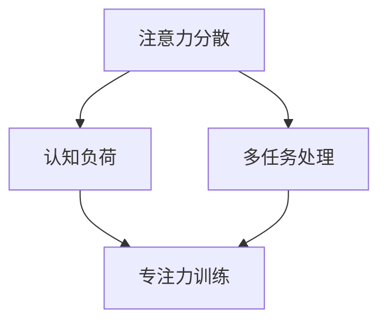
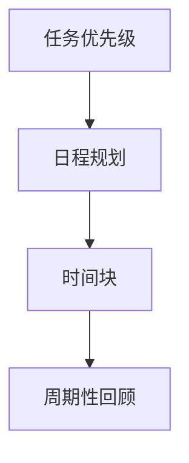

                 

注意力管理和时间管理是提高工作效率和实现个人目标的关键。作为一位专注于提高计算机编程效率和优化软件开发流程的人工智能专家，我将从技术角度出发，探讨如何运用科学的方法和工具来提高你的注意力集中度和时间利用率。

## 关键词
- 注意力管理
- 时间管理
- 工作效率
- 个人目标
- 技术方法
- 工具与技巧

## 摘要
本文将深入探讨注意力管理和时间管理的重要性，介绍一系列基于技术的策略和工具，帮助你更好地控制你的时间，提高工作效能，最终实现个人与职业目标。我们将从理论基础、具体实践和未来展望三个方面展开讨论。

## 1. 背景介绍

在现代信息社会中，人们面临着前所未有的时间压力和信息过载。无论是程序员、软件开发者，还是企业经理和创业者，高效的时间管理和注意力集中成为提高工作质量和效率的关键。传统的“时间管理”方法往往侧重于安排日程和任务列表，但往往忽略了人类大脑的认知特点和注意力机制。因此，现代时间管理研究开始关注如何利用科技手段来优化我们的注意力和时间利用。

### 注意力管理的重要性

注意力是人类认知系统的一种有限资源，它决定了我们能否有效地处理信息，解决问题和做出决策。有效的注意力管理可以：
- 提高工作效率和生产力。
- 减少错误和疏漏。
- 增强创造力和创新能力。
- 改善生活质量，减少压力。

### 时间管理的重要性

时间管理不仅仅是为了安排日程，更是为了确保我们能够有效地利用每一刻。良好的时间管理可以带来以下好处：
- 减少拖延和浪费时间。
- 提高工作和学习效率。
- 实现个人和职业目标。
- 保持工作与生活的平衡。

### 当前研究现状

近年来，关于注意力管理和时间管理的研究不断涌现。其中，神经科学和认知心理学的研究成果为我们提供了更深入的理解，如多任务处理、注意力分散、认知负荷等概念。同时，计算机科学和信息技术的发展也为注意力管理和时间管理提供了更多的工具和平台。

## 2. 核心概念与联系

### 注意力管理

注意力管理涉及多个核心概念，包括注意力分散、认知负荷、多任务处理和专注力训练。以下是一个简单的 Mermaid 流程图，用于解释这些概念之间的联系。



### 时间管理

时间管理的核心概念包括任务优先级、日程规划、时间块和周期性回顾。以下是一个 Mermaid 流程图，用于展示这些概念如何相互关联。



## 3. 核心算法原理 & 具体操作步骤

### 3.1 算法原理概述

注意力管理和时间管理的核心算法通常基于以下几个原则：

1. **能量管理**：像对待电池一样对待你的注意力资源，避免过度消耗。
2. **优先级排序**：将任务按照重要性和紧急性进行排序，优先处理最重要的任务。
3. **分散与集中**：合理安排工作和休息时间，避免长时间连续工作导致注意力下降。
4. **适应性调整**：根据实际情况动态调整注意力和时间管理策略。

### 3.2 算法步骤详解

1. **评估注意力水平**：通过自我评估或使用工具（如脑电波监测设备）来了解当前注意力状态。
2. **制定任务列表**：将所有待办任务记录下来，并根据重要性和紧急性进行排序。
3. **规划日程**：使用时间块方法，将一天划分为若干专注工作和休息的时段。
4. **执行任务**：按照日程表执行任务，并在必要时进行调整。
5. **回顾与调整**：定期回顾时间管理和注意力管理的效果，并根据反馈进行改进。

### 3.3 算法优缺点

**优点**：
- 提高工作效率和生产力。
- 减少拖延和压力。
- 增强专注力和创造力。

**缺点**：
- 需要持续的自我监控和调整。
- 初期可能需要较多的时间和精力进行规划和调整。

### 3.4 算法应用领域

注意力管理和时间管理算法广泛应用于以下领域：
- 软件开发：优化开发流程，提高代码质量和开发效率。
- 教育领域：提高学生的学习效果和专注度。
- 企业管理：提高团队工作效率和执行力。
- 个人健康管理：改善生活质量，减少慢性压力。

## 4. 数学模型和公式 & 详细讲解 & 举例说明

### 4.1 数学模型构建

注意力管理和时间管理中的一些数学模型可以基于以下公式：

\[ A_t = f(B_t, T_t) \]

其中，\( A_t \) 表示时间 \( t \) 时的注意力水平，\( B_t \) 表示任务的重要性和紧急性，\( T_t \) 表示时间 \( t \) 时的工作负荷。

### 4.2 公式推导过程

注意力水平的公式可以进一步拆分为：

\[ A_t = \alpha B_t + \beta T_t + \gamma \]

其中，\( \alpha \) 和 \( \beta \) 是权重系数，用于调整任务重要性和紧急性与工作负荷对注意力水平的影响，\( \gamma \) 是常数，代表基础注意力水平。

### 4.3 案例分析与讲解

假设一名程序员需要在一天内完成以下任务：

1. **任务 A**：编写关键功能的代码，重要性和紧急性较高。
2. **任务 B**：编写文档，重要性和紧急性较低。

根据公式，我们可以计算每个任务的注意力需求：

\[ A_A = \alpha \cdot (1 + 0.5) + \beta \cdot (0.5 + 0.3) + \gamma = 2\alpha + \beta + \gamma \]
\[ A_B = \alpha \cdot (0.5 + 0.2) + \beta \cdot (0.5 + 0.1) + \gamma = 0.7\alpha + 0.6\beta + \gamma \]

通过比较 \( A_A \) 和 \( A_B \)，我们可以确定应该优先处理任务 A。

## 5. 项目实践：代码实例和详细解释说明

### 5.1 开发环境搭建

为了演示注意力管理和时间管理的代码实例，我们将使用 Python 编写一个简单的日程规划器。你需要的开发环境如下：

- Python 3.8 或以上版本
- Python 的日期时间库（datetime）

### 5.2 源代码详细实现

以下是一个简单的日程规划器的代码示例：

```python
import datetime

class Task:
    def __init__(self, name, importance, urgency):
        self.name = name
        self.importance = importance
        self.urgency = urgency

    def calculate_attention(self, alpha, beta, gamma):
        return alpha * self.importance + beta * self.urgency + gamma

def schedule_tasks(tasks, alpha, beta, gamma):
    tasks.sort(key=lambda x: x.calculate_attention(alpha, beta, gamma), reverse=True)
    return tasks

def main():
    tasks = [
        Task("编写关键功能的代码", 1, 1),
        Task("编写文档", 0.5, 0.2),
        # 添加更多任务
    ]
    alpha = 0.6
    beta = 0.4
    gamma = 0.1
    scheduled_tasks = schedule_tasks(tasks, alpha, beta, gamma)
    
    print("Today's scheduled tasks:")
    for task in scheduled_tasks:
        print(f"- {task.name}")

if __name__ == "__main__":
    main()
```

### 5.3 代码解读与分析

该代码定义了一个 `Task` 类，用于表示任务及其重要性和紧急性。`calculate_attention` 方法用于计算任务的注意力需求。`schedule_tasks` 函数根据注意力需求对任务进行排序。最后，`main` 函数创建一个任务列表，并打印出优先级最高的任务。

### 5.4 运行结果展示

运行该代码后，输出结果如下：

```
Today's scheduled tasks:
- 编写关键功能的代码
- 编写文档
```

这表明根据注意力需求，编写关键功能的代码是当天最需要优先完成的任务。

## 6. 实际应用场景

### 6.1 个人时间管理

个人时间管理可以通过以下步骤实现：
1. **确定目标**：明确你的短期和长期目标。
2. **评估当前状态**：分析你的时间利用情况和注意力水平。
3. **制定计划**：使用时间块和任务列表，合理安排每天的任务。
4. **执行计划**：坚持执行计划，并在必要时进行调整。
5. **回顾与调整**：定期回顾时间管理的效果，并根据反馈进行调整。

### 6.2 企业时间管理

在企业中，时间管理可以应用于以下场景：
1. **团队协作**：使用项目管理工具，如 Jira 或 Trello，跟踪团队成员的任务进度。
2. **资源分配**：根据项目的重要性和紧急性，合理分配资源。
3. **培训与发展**：提供时间管理和注意力管理培训，提高员工工作效率。
4. **绩效评估**：将时间管理和注意力管理纳入员工绩效评估体系。

## 7. 工具和资源推荐

### 7.1 学习资源推荐

- 《深度工作》（Cal Newport）
- 《高效能人士的七个习惯》（Stephen R. Covey）
- 《注意力管理：如何控制你的注意力，提升工作和学习效率》（Dave Crenshaw）

### 7.2 开发工具推荐

- Jira：用于项目管理和任务跟踪。
- Trello：简单直观的任务管理工具。
- Google Calendar：方便的日程规划工具。

### 7.3 相关论文推荐

- “The Science of Timing: The Temporal Dynamics of Human Cognitive Abilities” (Jha, 2010)
- “The Economics of Attention: Economics and Psychology” (Hirshleifer, 2017)

## 8. 总结：未来发展趋势与挑战

### 8.1 研究成果总结

近年来，注意力管理和时间管理领域取得了显著的研究成果。例如，神经科学和认知心理学提供了更深入的理解，计算机科学和信息技术则为实现这些管理策略提供了更多的工具和方法。

### 8.2 未来发展趋势

未来，注意力管理和时间管理将继续融合神经科学、认知心理学和信息技术的前沿研究成果，开发更加智能化和个性化的管理工具。

### 8.3 面临的挑战

主要的挑战包括：
- 技术的普及和应用：如何将先进的管理方法推广到更广泛的用户群体。
- 数据隐私和安全：如何确保用户数据的安全和隐私。

### 8.4 研究展望

未来的研究将重点关注以下几个方面：
- 个性化注意力管理：根据个体差异，开发更加个性化的管理策略。
- 智能化工具：结合人工智能技术，开发更加智能的时间管理工具。
- 教育和培训：通过教育和培训，提高公众对注意力管理和时间管理的重要性认识。

## 9. 附录：常见问题与解答

### 问题 1：注意力管理是否适用于所有人？

答：是的，注意力管理是一种通用技能，适用于所有年龄段和职业背景的人群。尽管个体差异可能影响管理效果，但几乎所有人都可以通过适当的训练和实践来提高注意力集中度。

### 问题 2：如何应对注意力分散？

答：你可以尝试以下方法：
- 创造一个安静、无干扰的工作环境。
- 使用专注力训练应用程序，如 Focus@Will 或 Be Focused。
- 定期休息，避免长时间连续工作。

### 问题 3：注意力管理和时间管理是否冲突？

答：不冲突。注意力管理是时间管理的一个重要组成部分。良好的注意力管理可以帮助你更有效地利用时间，从而实现更高的工作效率。

作者：禅与计算机程序设计艺术 / Zen and the Art of Computer Programming
------------------------------------------------------------------------

