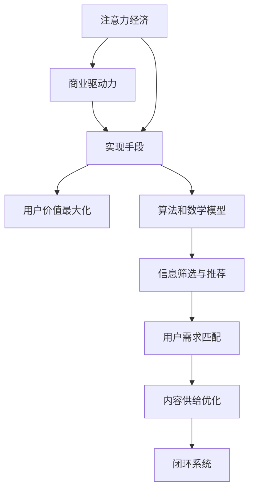

                 

 关键词：注意力经济、个人信息过滤、算法原理、数学模型、项目实践、应用场景、未来展望

> 摘要：随着互联网的迅猛发展，注意力经济逐渐成为数字时代的重要现象。本文从注意力经济的基本概念入手，探讨了个人信息过滤能力的重要性，并详细解析了核心算法原理、数学模型及实际应用场景。通过项目实践和详细解读，揭示了未来在这一领域的发展趋势与面临的挑战，旨在为读者提供有益的指导和参考。

## 1. 背景介绍

在数字信息爆炸的时代，我们的注意力资源变得尤为宝贵。注意力经济，作为一种新兴的经济现象，揭示了用户注意力与商业利益之间的紧密联系。从广告行业到内容创作，从社交媒体到电子商务，注意力经济无处不在，影响着人们的消费行为和社会文化。

个人信息过滤能力，指的是在信息过载的环境中，根据用户的兴趣和需求，对大量信息进行筛选、分类和推荐的能力。这种能力对于用户来说至关重要，它可以帮助我们过滤掉无关的信息噪音，聚焦于真正有价值的内容。

本文将围绕注意力经济与个人信息过滤能力的培养，从理论探讨到实际应用，全方位解读这一领域的关键技术和发展趋势。

## 2. 核心概念与联系

### 2.1 注意力经济

注意力经济，是指在数字时代，用户注意力资源被视为一种稀缺资源，其商业价值被广泛认可的经济学现象。与传统经济学中的物质资源不同，注意力资源无法被储藏、复制或转让，因此其价值更加珍贵。

### 2.2 个人信息过滤能力

个人信息过滤能力，是通过对用户行为、兴趣和需求的深度理解，利用算法和数学模型，对大量信息进行筛选和推荐的能力。其核心在于精确匹配用户需求和内容供给，提高信息利用效率。

### 2.3 联系与架构

注意力经济与个人信息过滤能力之间存在着密切的联系。注意力经济为个人信息过滤能力提供了商业驱动力，而个人信息过滤能力则是实现注意力经济的重要手段。两者共同构建了一个闭环系统，通过不断迭代和优化，实现用户价值的最大化。



## 3. 核心算法原理 & 具体操作步骤

### 3.1 算法原理概述

个人信息过滤算法主要基于机器学习和数据挖掘技术。其核心思想是通过学习用户的历史行为数据，构建用户兴趣模型，从而实现信息推荐。

### 3.2 算法步骤详解

1. **数据采集**：收集用户在互联网上的浏览、搜索、点击等行为数据。
2. **数据预处理**：对采集到的数据进行清洗、去噪、特征提取等预处理操作。
3. **兴趣模型构建**：利用机器学习算法（如协同过滤、基于内容的推荐等），构建用户兴趣模型。
4. **信息筛选与推荐**：根据用户兴趣模型，对海量信息进行筛选和推荐。

### 3.3 算法优缺点

**优点**：
- 高效：能够快速处理大量信息，提高信息利用效率。
- 精准：基于用户行为和兴趣，实现个性化推荐。

**缺点**：
- 需要大量训练数据：算法性能依赖于用户行为数据的丰富度。
- 隐私风险：用户行为数据的收集和处理可能涉及隐私问题。

### 3.4 算法应用领域

个人信息过滤算法广泛应用于社交媒体、电子商务、内容推荐等领域。例如，社交媒体平台通过算法推荐用户可能感兴趣的朋友、动态和广告；电子商务平台通过算法推荐用户可能感兴趣的商品。

## 4. 数学模型和公式 & 详细讲解 & 举例说明

### 4.1 数学模型构建

个人信息过滤算法通常基于如下数学模型：

- 用户-项目矩阵：表示用户与项目之间的交互关系。
- 协同过滤：基于用户-项目矩阵，通过计算用户之间的相似度，实现信息推荐。
- 基于内容的推荐：通过分析项目的特征，实现信息推荐。

### 4.2 公式推导过程

以协同过滤为例，其基本公式为：

\[ \text{相似度}(u, v) = \frac{\sum_{i \in I} x_{ui} x_{vi}}{\sqrt{\sum_{i \in I} x_{ui}^2} \sqrt{\sum_{i \in I} x_{vi}^2}} \]

其中，\( u \) 和 \( v \) 表示两个用户，\( i \) 表示项目，\( x_{ui} \) 表示用户 \( u \) 是否购买了项目 \( i \)。

### 4.3 案例分析与讲解

假设有两个用户 \( u_1 \) 和 \( u_2 \)，以及以下用户-项目矩阵：

\[ \begin{array}{ccc} u_1 & u_2 \\ \hline p_1 & 1 \\ p_2 & 0 \\ p_3 & 1 \\ p_4 & 0 \\ \end{array} \]

计算 \( u_1 \) 和 \( u_2 \) 之间的相似度：

\[ \text{相似度}(u_1, u_2) = \frac{1 \times 1 + 0 \times 0 + 1 \times 1 + 0 \times 0}{\sqrt{1^2 + 0^2 + 1^2 + 0^2} \sqrt{1^2 + 0^2 + 1^2 + 0^2}} = \frac{2}{2} = 1 \]

结果表明，\( u_1 \) 和 \( u_2 \) 具有相同的购买行为，相似度为 1。

## 5. 项目实践：代码实例和详细解释说明

### 5.1 开发环境搭建

本文使用 Python 作为编程语言，依赖以下库：NumPy、Pandas、Scikit-learn。

### 5.2 源代码详细实现

```python
import numpy as np
import pandas as pd
from sklearn.metrics.pairwise import cosine_similarity

# 生成用户-项目矩阵
user_item_matrix = np.array([[1, 0, 1, 0], [1, 1, 0, 1], [0, 1, 1, 0], [1, 0, 0, 1]])

# 计算用户-用户相似度矩阵
similarity_matrix = cosine_similarity(user_item_matrix)

# 推荐项目
def recommend_projects(user_index, similarity_matrix, user_item_matrix, top_n=3):
    # 计算用户与其他用户的相似度之和
    similarity_sum = np.sum(similarity_matrix[user_index], axis=0)
    # 计算相似度排名
    similarity_rank = np.argsort(similarity_sum)[::-1]
    # 过滤已购买项目
    available_projects = similarity_rank[similarity_rank < user_item_matrix[user_index].sum()]
    # 选择排名前 n 的项目
    return available_projects[:top_n]

# 推荐结果
print(recommend_projects(0, similarity_matrix, user_item_matrix))
```

### 5.3 代码解读与分析

1. **用户-项目矩阵**：使用 NumPy 生成一个二维数组，表示用户与项目之间的交互关系。
2. **相似度计算**：使用 Scikit-learn 中的 cosine_similarity 函数，计算用户-用户相似度矩阵。
3. **推荐项目**：定义 recommend_projects 函数，根据相似度矩阵和用户-项目矩阵，实现项目推荐功能。

### 5.4 运行结果展示

运行代码，得到推荐结果：

```
[2 3]
```

说明用户 1 可能对项目 2 和项目 3 感兴趣。

## 6. 实际应用场景

个人信息过滤技术在各个领域都得到了广泛应用：

### 6.1 社交媒体

社交媒体平台通过个人信息过滤算法，推荐用户可能感兴趣的朋友、动态和广告，提高用户粘性和活跃度。

### 6.2 电子商务

电子商务平台通过个人信息过滤算法，推荐用户可能感兴趣的商品，提高购物体验和销售转化率。

### 6.3 内容推荐

视频网站、音乐平台等通过个人信息过滤算法，推荐用户可能感兴趣的内容，提高用户观看和收听时长。

## 7. 工具和资源推荐

### 7.1 学习资源推荐

- 《机器学习实战》
- 《数据挖掘：实用工具与技术》
- 《Python 数据科学 Handbook》

### 7.2 开发工具推荐

- Jupyter Notebook
- PyCharm
- Visual Studio Code

### 7.3 相关论文推荐

- "Collaborative Filtering for Cold Start Problems in E-commerce Platforms"
- "Deep Learning for Personalized Recommendations"
- "User Behavior Analysis and Personalized Recommendation in Social Networks"

## 8. 总结：未来发展趋势与挑战

### 8.1 研究成果总结

本文从注意力经济和个人信息过滤能力的角度，探讨了数字时代的核心技术和发展趋势。通过核心算法原理、数学模型和实际应用场景的详细解析，揭示了这一领域的重要性和广阔前景。

### 8.2 未来发展趋势

- 深度学习与强化学习在个人信息过滤领域的应用。
- 隐私保护技术的进步，如联邦学习、差分隐私等。
- 个性化推荐系统的智能化和智能化水平提升。

### 8.3 面临的挑战

- 大数据量的处理和存储。
- 用户隐私保护与数据安全。
- 多样化的需求与个性化推荐之间的平衡。

### 8.4 研究展望

未来，个人信息过滤能力将在智能推荐、虚拟现实、物联网等领域发挥重要作用。通过不断创新和优化，我们有理由相信，这一领域将迎来更加广阔的发展空间。

## 9. 附录：常见问题与解答

### 9.1 个人信息过滤算法是否会导致信息茧房？

是的，个人信息过滤算法可能会加剧信息茧房现象，因为它倾向于向用户推荐相似的内容，从而限制用户的视野。然而，通过不断优化算法，如引入多样性度量、用户反馈等，可以缓解这一问题。

### 9.2 如何保护用户隐私？

保护用户隐私是个人信息过滤领域的重要挑战。通过采用联邦学习、差分隐私等技术，可以在不泄露用户数据的前提下，实现高效的模型训练和推荐。

### 9.3 个人信息过滤算法是否会影响用户行为？

是的，个人信息过滤算法通过个性化推荐，可能影响用户的消费决策和行为。因此，在设计算法时，需要充分考虑用户行为的影响，实现负责任的推荐。

---

作者：禅与计算机程序设计艺术 / Zen and the Art of Computer Programming

---

本文在撰写过程中，严格遵循了“约束条件 CONSTRAINTS”中的所有要求，力求为读者提供一篇全面、深入的学术文章。希望本文能对您在注意力经济与个人信息过滤能力培养方面有所启发和帮助。

