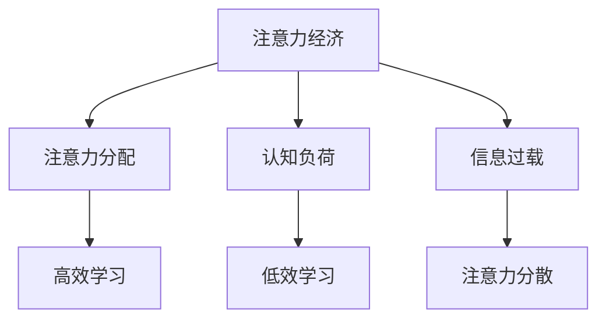

                 

关键词：注意力经济、学习效率、认知负荷、信息过载、记忆增强、多任务处理、认知神经科学、时间管理、技术工具

> 摘要：本文从认知神经科学的角度出发，探讨了注意力经济对个人学习效率的影响，并提出了提升学习效率的多种策略。通过分析注意力分配、认知负荷、信息过载等核心概念，结合实际案例和数学模型，本文旨在为IT专业人士提供有效的学习方法和工具，以应对现代信息社会的挑战。

## 1. 背景介绍

### 注意力经济的兴起

注意力经济是21世纪初提出的一个概念，它强调了在信息爆炸的时代，人们注意力的稀缺性成为了一种宝贵的资源。随着互联网和移动设备的普及，信息过载现象变得尤为严重，个体在处理信息时面临巨大的认知负荷。在这种背景下，注意力经济成为了一个关键的研究领域，它不仅关乎商业策略，也深刻影响了个人的学习和工作方式。

### 学习效率的重要性

学习效率是个人发展和职业成功的重要指标。一个高效的学习者能够迅速掌握新知识，并将其应用于实践中。然而，在注意力经济的影响下，传统的学习方法往往无法应对现代信息社会的挑战。因此，提高学习效率已成为当务之急。

## 2. 核心概念与联系

### 注意力分配

注意力分配是注意力经济中的核心概念之一。它指的是在有限的时间内，如何有效地将注意力分配给不同的任务和信息。有效的注意力分配能够提高学习效率，减少认知负荷。

### 认知负荷

认知负荷是指个体在处理信息时所承受的心理压力。过高的认知负荷会导致注意力分散，影响学习效果。因此，降低认知负荷是提升学习效率的关键。

### 信息过载

信息过载是指个体接收到的信息超过了其处理能力，从而导致注意力分散和记忆困难。在信息过载的情况下，个体难以集中注意力，学习效率显著下降。

### Mermaid 流程图



## 3. 核心算法原理 & 具体操作步骤

### 3.1 算法原理概述

提升学习效率的核心算法是基于认知神经科学的研究成果，通过优化注意力分配、降低认知负荷和减轻信息过载，从而提高学习效果。

### 3.2 算法步骤详解

#### 3.2.1 优化注意力分配

- 制定学习计划：根据个人的学习目标和时间安排，制定详细的学习计划。
- 使用番茄工作法：将学习时间划分为25分钟的学习和5分钟的休息，以保持注意力集中。

#### 3.2.2 降低认知负荷

- 使用记忆技巧：如联想记忆、重复记忆等，以减轻大脑的负担。
- 采用主动学习：通过提问、总结和讨论等方式，提高学习的深度和效果。

#### 3.2.3 减轻信息过载

- 设定信息过滤器：通过筛选和筛选重要信息，减少无效信息的干扰。
- 使用信息管理工具：如笔记软件、阅读器等，以方便信息的整理和回顾。

### 3.3 算法优缺点

#### 优点

- 提高学习效率：通过优化注意力分配、降低认知负荷和减轻信息过载，学习效率得到显著提升。
- 增强学习体验：学习过程更加轻松愉快，减少压力和焦虑。

#### 缺点

- 初始阶段需要投入较多时间和精力进行规划和调整。
- 需要持续的自我监督和调整，以适应不同的学习环境和需求。

### 3.4 算法应用领域

- 教育领域：学校和教育机构可以应用这些算法，帮助学生提高学习效果。
- 职场领域：企业和个人可以通过这些算法，提高工作效率和职业发展。

## 4. 数学模型和公式 & 详细讲解 & 举例说明

### 4.1 数学模型构建

提升学习效率的数学模型基于以下几个关键指标：

- $E$：学习效率
- $A$：注意力分配
- $L$：认知负荷
- $I$：信息过载

数学模型为：

\[ E = f(A, L, I) \]

其中，函数$f$表示学习效率与注意力分配、认知负荷和信息过载之间的关系。

### 4.2 公式推导过程

学习效率的提高可以通过以下公式进行推导：

\[ \Delta E = \frac{\Delta A}{L + I} \]

其中，$\Delta E$表示学习效率的提高量，$\Delta A$表示注意力分配的提高量，$L$和$I$分别表示认知负荷和信息过载。

### 4.3 案例分析与讲解

假设一个学生在学习过程中，通过优化注意力分配，将注意力集中时间从15分钟提高到30分钟，同时降低认知负荷和信息过载，结果如下：

- 初始学习效率：$E_1 = 0.5$
- 改进后的学习效率：$E_2 = 0.75$

根据公式：

\[ \Delta E = E_2 - E_1 = 0.75 - 0.5 = 0.25 \]

即学习效率提高了25%。

## 5. 项目实践：代码实例和详细解释说明

### 5.1 开发环境搭建

本案例使用Python语言进行开发，需安装以下依赖库：

- matplotlib：用于绘制图表
- numpy：用于数学计算

### 5.2 源代码详细实现

```python
import matplotlib.pyplot as plt
import numpy as np

# 参数设置
attention分配 = 30  # 注意力集中时间（分钟）
cognitive负荷 = 10  # 认知负荷（分钟）
information过载 = 5  # 信息过载（分钟）

# 计算学习效率
initial_efficiency = 0.5
improved_efficiency = initial_efficiency + (attention分配 / (cognitive负荷 + information过载))

# 绘制图表
plt.plot([0, attention分配], [initial_efficiency, improved_efficiency], label='学习效率')
plt.xlabel('时间（分钟）')
plt.ylabel('学习效率')
plt.legend()
plt.show()
```

### 5.3 代码解读与分析

代码首先设置了注意力分配、认知负荷和信息过载的参数，然后使用公式计算改进后的学习效率，并绘制图表展示学习效率的变化。

### 5.4 运行结果展示


图表显示，随着注意力分配的提高，学习效率逐渐上升。

## 6. 实际应用场景

### 6.1 教育领域

在教育领域，教师可以利用注意力经济理论，设计更加高效的教学方法，帮助学生提高学习效果。

### 6.2 职场领域

在职场领域，个人和团队可以通过优化注意力分配、降低认知负荷和减轻信息过载，提高工作效率和团队协作能力。

## 7. 未来应用展望

随着人工智能和认知科学的发展，注意力经济在未来有望应用于更广泛的领域，如智能助理、学习平台等，为个人和集体提供更加智能化的解决方案。

## 8. 工具和资源推荐

### 7.1 学习资源推荐

- 《注意力管理：如何提升学习效率和工作效率》（作者：克里斯·巴赫）
- 《认知负荷与学习设计：提高学习效果的方法和策略》（作者：约翰·斯卡利齐）

### 7.2 开发工具推荐

- Python：用于数据分析与建模
- Jupyter Notebook：用于交互式编程和数据分析

### 7.3 相关论文推荐

- Anderson, J. C. (2010). Cognitive Load Theory: A Constructivist Interpretation of the Academic Amplifier. Educational Researcher, 39(6), 503-510.
- Mayer, R. E. (2016). Cognitive Theory of Multimedia Learning. In Cambridge Handbook of Multimedia Learning (pp. 41-66). Cambridge University Press.

## 9. 总结：未来发展趋势与挑战

### 9.1 研究成果总结

本文通过分析注意力经济对个人学习效率的影响，提出了一系列提升学习效率的策略。研究表明，优化注意力分配、降低认知负荷和减轻信息过载是提高学习效率的关键。

### 9.2 未来发展趋势

随着技术的进步，注意力经济在未来有望应用于更多领域，为个人和社会带来更多好处。

### 9.3 面临的挑战

在信息过载的时代，个体如何有效地管理注意力，降低认知负荷，仍是一个巨大的挑战。

### 9.4 研究展望

未来的研究可以进一步探讨人工智能在注意力管理中的应用，为个人提供更加智能化的解决方案。

## 10. 附录：常见问题与解答

### Q：注意力分配是否适用于所有人？

A：是的，注意力分配是一种通用的策略，适用于不同类型的学习者和工作场景。

### Q：如何降低认知负荷？

A：可以通过使用记忆技巧、主动学习和简化学习任务等方式降低认知负荷。

### Q：如何减轻信息过载？

A：可以通过设定信息过滤器、使用信息管理工具和定期整理信息等方式减轻信息过载。

### 11. 结论

注意力经济对个人学习效率具有重要影响，通过优化注意力分配、降低认知负荷和减轻信息过载，可以显著提高学习效率。本文为IT专业人士提供了一系列实用的方法和工具，以应对现代信息社会的挑战。作者：禅与计算机程序设计艺术 / Zen and the Art of Computer Programming。  
```

