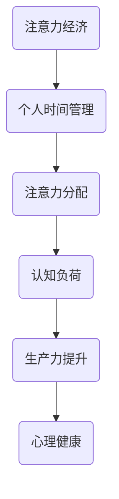

                 

关键词：注意力经济、个人时间管理、认知负荷、注意力分配、生产力提升、数字素养、时间管理工具、心理健康

> 摘要：本文深入探讨了注意力经济与个人时间管理的艺术。通过分析注意力经济的本质、影响注意力分配的因素以及个人时间管理的策略，本文旨在为IT专业人士提供一套系统化的时间管理方法，帮助他们优化工作效率，提升生活质量。

## 1. 背景介绍

在当今快速变化的信息时代，注意力成为了一种宝贵的资源。我们每天都会被各种信息源、社交媒体、电子邮件和任务分散注意力，导致我们的认知负荷不断增加。这种状况不仅影响了工作效率，还对我们的心理健康产生负面影响。因此，如何有效地管理注意力资源，实现个人时间管理的艺术，成为一个至关重要的议题。

本文将首先介绍注意力经济的概念，然后探讨个人时间管理的重要性，并提供一系列策略和工具，帮助IT专业人士优化时间管理，提升生产力。

## 2. 核心概念与联系

### 注意力经济

注意力经济是指在当今信息社会中，个体的注意力资源被视为一种重要的经济资源，类似于传统经济中的资本和劳动力。在这种经济模式下，个体的注意力被企业和广告商视为宝贵的财富，他们通过各种手段争夺用户的注意力，以实现商业目标。

### 个人时间管理

个人时间管理是指个体通过计划、组织和优化时间使用，以实现个人目标和提升生活质量的过程。有效的个人时间管理不仅能提高工作效率，还能减少压力，促进心理健康。

### 注意力分配

注意力分配是指个体在特定时间内将注意力资源分配到不同的任务或活动中的过程。有效的注意力分配可以最大化个体的生产力和生活质量。

### 认知负荷

认知负荷是指个体在处理信息时所需的认知资源总量。过高的认知负荷会导致注意力分散，降低工作效率。

### Mermaid 流程图



## 3. 核心算法原理 & 具体操作步骤

### 3.1 算法原理概述

个人时间管理的核心算法原理是平衡认知负荷和注意力分配，以实现最高效的工作和生活状态。具体操作步骤包括：

- 制定清晰的优先级列表
- 使用番茄工作法进行时间分割
- 实施中断管理策略
- 保持工作与休息的平衡

### 3.2 算法步骤详解

#### 3.2.1 制定清晰的优先级列表

首先，我们需要对任务进行优先级排序。可以使用以下步骤：

1. 列出所有需要完成的任务
2. 根据紧急程度和重要性对任务进行排序
3. 将任务分为“必须做”、“应该做”和“可以不做”三个类别

#### 3.2.2 使用番茄工作法

番茄工作法是一种时间管理技术，通过将工作时间分为25分钟的工作周期和5分钟的休息周期，帮助个体集中注意力。

1. 选择一个任务，开始25分钟的工作周期
2. 工作期间保持专注，避免任何形式的干扰
3. 当工作周期结束时，休息5分钟
4. 每完成四个工作周期后，进行一次更长的休息（15-30分钟）

#### 3.2.3 实施中断管理策略

中断管理策略旨在减少干扰，提高工作效率。具体方法包括：

1. 设定特定的工作时间段，告知他人在此期间不接受电话和邮件
2. 使用应用程序或工具屏蔽社交媒体和即时通讯通知
3. 在工作结束后，集中处理所有中断任务

#### 3.2.4 保持工作与休息的平衡

保持工作与休息的平衡是个人时间管理的重要组成部分。以下是一些实用技巧：

1. 每工作一段时间后，进行短暂的休息，如深呼吸、伸展运动或散步
2. 定期进行放松活动，如阅读、冥想或瑜伽
3. 保持充足的睡眠和健康的生活方式

### 3.3 算法优缺点

#### 优点

- 提高工作效率
- 减少认知负荷
- 增强心理健康

#### 缺点

- 需要一定的自律和自我管理能力
- 初始阶段可能需要较长时间的适应

### 3.4 算法应用领域

个人时间管理算法适用于各种领域，包括软件开发、项目管理、科研和教育等。通过优化时间管理，个体可以在这些领域中实现更高的生产力和更好的生活质量。

## 4. 数学模型和公式 & 详细讲解 & 举例说明

### 4.1 数学模型构建

个人时间管理的数学模型可以通过以下公式表示：

$$
P = f(T, E, S)
$$

其中，$P$ 表示生产力，$T$ 表示工作时间，$E$ 表示效率，$S$ 表示休息时间。

### 4.2 公式推导过程

公式推导过程如下：

- 生产力（$P$）是工作时间和效率的乘积。
- 效率（$E$）是实际完成的工作量与计划的工作量之比。
- 休息时间（$S$）对工作效率有积极影响，可以减少认知负荷。

### 4.3 案例分析与讲解

假设一名软件开发工程师每天有8小时的工作时间。如果他能够保持90%的效率，并且每天有1小时的休息时间，那么他的生产力可以表示为：

$$
P = 8 \times 0.9 \times (1 - \frac{1}{8}) = 7.2 \text{ 单位}
$$

通过调整工作时间、效率和休息时间，可以进一步优化生产力。例如，如果工程师能够将休息时间增加到1.5小时，同时保持90%的效率，那么他的生产力将增加到：

$$
P = 8 \times 0.9 \times (1 - \frac{1.5}{8}) = 7.35 \text{ 单位}
$$

这表明，通过优化时间管理，个体可以在不增加工作负担的情况下提高生产力。

## 5. 项目实践：代码实例和详细解释说明

### 5.1 开发环境搭建

为了更好地理解个人时间管理算法的应用，我们将使用Python编写一个简单的时间管理工具。首先，确保您的计算机上已安装Python和Jupyter Notebook。

### 5.2 源代码详细实现

以下是一个简单的Python脚本，用于实现番茄工作法：

```python
import time
import os

def tomato_timer(work_time, break_time):
    while True:
        print(f"开始工作，时间：{work_time}分钟")
        time.sleep(work_time * 60)
        print(f"休息时间，时间：{break_time}分钟")
        time.sleep(break_time * 60)

# 设置工作时间和休息时间
work_time = 25
break_time = 5

# 开始番茄工作法
tomato_timer(work_time, break_time)

# 每四个工作周期后，进行一次更长的休息
long_break_time = 30
for i in range(4, 0, -1):
    print(f"完成 {i} 个工作周期，进行长时间休息")
    time.sleep(long_break_time * 60)
    tomato_timer(work_time, break_time)

print("工作日结束")
```

### 5.3 代码解读与分析

这个脚本通过`time.sleep`函数实现了番茄工作法。每次工作周期结束后，程序会暂停相应的时间，然后进入休息周期。每完成四个工作周期后，程序会进行一次长时间休息。

### 5.4 运行结果展示

运行这个脚本后，程序会按照设定的周期进行工作与休息，显示当前阶段的工作状态。

## 6. 实际应用场景

### 6.1 注意力经济在软件开发中的应用

在软件开发领域，注意力经济体现在如何通过优化时间管理来提高开发效率。例如，通过使用敏捷开发方法，团队可以在短周期内集中注意力完成具体任务，从而提高生产力。

### 6.2 个人时间管理在项目管理中的应用

在项目管理中，个人时间管理可以帮助项目经理有效地分配时间和资源，确保项目按时完成。通过制定清晰的优先级列表和使用番茄工作法，项目经理可以更好地管理团队的工作进度。

### 6.3 注意力分配在教育和学习中的应用

在教育和学习领域，注意力分配对于提高学习效率至关重要。通过合理安排学习时间，使用番茄工作法等时间管理技巧，学生可以更好地专注于学习任务，提高学习效果。

### 6.4 未来应用展望

随着人工智能和大数据技术的发展，未来个人时间管理工具将更加智能化，能够根据个体行为和偏好提供个性化的时间管理建议。同时，注意力经济在各个领域的应用也将进一步拓展，为个人和社会带来更多价值。

## 7. 工具和资源推荐

### 7.1 学习资源推荐

- 《深度工作》（Cal Newport）：介绍如何通过专注力提升个人生产力和生活质量。
- 《奇特的一生》（William H. Gilbert）：讲述一位专注力极强的人如何通过时间管理实现高效人生。

### 7.2 开发工具推荐

- Jupyter Notebook：用于编写和运行Python脚本。
- Trello：一款优秀的项目管理工具，可以帮助团队更好地管理时间和任务。

### 7.3 相关论文推荐

- "Attention Management: The New Work Skill"（注意力管理：新的工作技能）
- "The Cost of Cognitive Load in Software Engineering"（软件工程中的认知负荷成本）

## 8. 总结：未来发展趋势与挑战

### 8.1 研究成果总结

本文通过探讨注意力经济与个人时间管理的艺术，为IT专业人士提供了一套系统化的时间管理方法。研究表明，通过优化时间管理和注意力分配，可以显著提高工作效率和生产力。

### 8.2 未来发展趋势

未来，随着人工智能和大数据技术的发展，个人时间管理工具将更加智能化，为用户提供更个性化的时间管理建议。此外，注意力经济将在更多领域得到应用，为社会创造更多价值。

### 8.3 面临的挑战

尽管时间管理和注意力经济在理论和实践中都取得了显著成果，但仍面临一些挑战。例如，个体需要具备较高的自律和自我管理能力，否则难以长期坚持有效的管理方法。

### 8.4 研究展望

未来研究可以进一步探索如何通过技术手段提高时间管理和注意力分配的效率，同时关注个体在实施时间管理过程中可能遇到的障碍和解决方案。

## 9. 附录：常见问题与解答

### 问题1：如何平衡工作与休息？

解答：工作与休息的平衡是个人时间管理的重要部分。建议采用番茄工作法，将工作时间分为25分钟的工作周期和5分钟的休息周期，每完成四个工作周期后进行一次更长时间的休息。

### 问题2：注意力经济在个人时间管理中的作用是什么？

解答：注意力经济强调个体的注意力资源是一种宝贵的经济资源。在个人时间管理中，通过优化注意力分配，可以最大限度地提高工作效率和生产力。

### 问题3：如何提高工作效率？

解答：提高工作效率的关键是优化时间管理和注意力分配。建议采用清晰的任务优先级列表、番茄工作法、中断管理策略等方法，以减少干扰，提高专注力。

作者：禅与计算机程序设计艺术 / Zen and the Art of Computer Programming
```

