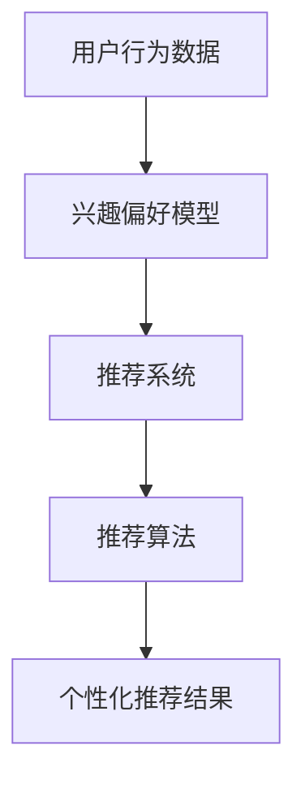

                 

 在当今信息爆炸的时代，受众面临着海量的信息选择。注意力成为了最稀缺的资源。如何有效地利用注意力经济，为受众提供定制、有针对性的内容，成为了各类平台和企业追求的目标。本文将探讨个性化推荐算法在注意力经济中的应用，以及其原理、数学模型、项目实践和未来展望。

## 关键词

- 注意力经济
- 个性化推荐算法
- 内容定制
- 有针对性
- 数据挖掘

## 摘要

本文首先介绍了注意力经济的基本概念，阐述了个性化推荐算法在其中的重要性。接着，本文通过核心概念与联系的部分，详细描述了个性化推荐算法的原理和架构。随后，文章深入剖析了核心算法的原理、数学模型和公式，并提供了项目实践中的代码实例。文章的最后部分，我们探讨了个性化推荐算法在实际应用场景中的效果，以及未来的发展趋势与挑战。

### 1. 背景介绍

在互联网时代，内容创造和消费的规模前所未有地增长。随着信息技术的进步，人们可以轻松地获取到海量的信息。然而，这背后也隐藏着一个问题：受众的注意力分散。在有限的时间内，受众无法阅读或观看所有的内容。因此，如何有效地吸引和保持受众的注意力，成为了内容创作者和平台运营者亟待解决的问题。

注意力经济理论指出，在信息过载的今天，受众的注意力成为了一种稀缺资源。商家和平台必须通过创造有吸引力的内容，才能从众多竞争者中脱颖而出，吸引并保持受众的注意力。个性化推荐算法正是为了解决这一需求而诞生。

个性化推荐算法通过分析用户的行为数据和兴趣偏好，为用户提供定制化的内容推荐。这种推荐方式不仅能够提高用户满意度，还能增加用户停留时间和平台粘性，从而实现商业价值最大化。因此，个性化推荐算法在注意力经济中扮演着至关重要的角色。

### 2. 核心概念与联系

在个性化推荐算法中，有几个核心概念和联系需要了解。这些概念包括用户行为数据、兴趣偏好、推荐系统和推荐算法。

#### 2.1 用户行为数据

用户行为数据是推荐系统的核心输入。这些数据可以包括用户的浏览记录、搜索历史、购买行为、互动行为等。通过分析这些数据，推荐系统可以了解用户的兴趣和行为模式，从而提供个性化的推荐。

#### 2.2 兴趣偏好

兴趣偏好是指用户对特定内容或产品的喜好程度。个性化推荐算法通过分析用户的历史行为数据，建立用户兴趣偏好模型。这个模型可以帮助推荐系统更好地理解用户的偏好，从而提供更加精准的推荐。

#### 2.3 推荐系统

推荐系统是一个自动化的系统，它通过分析用户数据和兴趣偏好，生成个性化的推荐结果。推荐系统可以分为基于内容的推荐和基于协同过滤的推荐两大类。

- **基于内容的推荐**：这种推荐方式通过分析内容特征和用户兴趣，为用户推荐具有相似特征的内容。
- **基于协同过滤的推荐**：这种推荐方式通过分析用户之间的相似性，推荐用户可能喜欢的内容。

#### 2.4 推荐算法

推荐算法是实现推荐系统核心功能的算法。常见的推荐算法包括基于用户的协同过滤、基于内容的推荐、矩阵分解等。每种算法都有其独特的原理和应用场景。

为了更好地理解这些概念和联系，我们可以使用Mermaid流程图来描述个性化推荐算法的架构。



在这个流程图中，用户行为数据是推荐系统的输入，通过分析这些数据，我们可以建立用户的兴趣偏好模型。这个模型作为推荐系统的核心输入，驱动推荐算法生成个性化的推荐结果。

### 3. 核心算法原理 & 具体操作步骤

#### 3.1 算法原理概述

个性化推荐算法的核心目标是根据用户的行为数据和兴趣偏好，为用户推荐可能感兴趣的内容。这个过程可以分为以下几个步骤：

1. **数据收集**：收集用户的行为数据，包括浏览记录、搜索历史、购买行为等。
2. **特征提取**：将行为数据转换为特征向量，以便进行后续分析。
3. **兴趣偏好建模**：通过机器学习算法，建立用户兴趣偏好模型。
4. **推荐生成**：利用用户兴趣偏好模型，为用户生成个性化推荐结果。

#### 3.2 算法步骤详解

1. **数据收集**

   数据收集是推荐系统的第一步。推荐系统需要收集用户的行为数据，这些数据可以从用户日志、数据库或第三方数据源获取。常见的行为数据包括浏览记录、搜索历史、购买行为、互动行为等。

2. **特征提取**

   收集到用户行为数据后，我们需要将这些数据转换为特征向量。特征提取的关键是将非结构化的行为数据转化为结构化的特征向量，以便进行后续的建模和推荐。

3. **兴趣偏好建模**

   兴趣偏好建模是推荐系统的核心步骤。通过机器学习算法，我们可以建立用户兴趣偏好模型。这个模型可以帮助我们理解用户的偏好，从而为用户提供个性化的推荐。

4. **推荐生成**

   推荐生成是根据用户兴趣偏好模型，为用户生成个性化推荐结果。推荐生成可以分为基于内容的推荐和基于协同过滤的推荐两种方式。基于内容的推荐通过分析内容特征和用户兴趣，推荐具有相似特征的内容。基于协同过滤的推荐通过分析用户之间的相似性，推荐用户可能喜欢的内容。

#### 3.3 算法优缺点

个性化推荐算法具有以下优缺点：

- **优点**：
  - 提高用户满意度：通过个性化推荐，用户可以更快地找到自己感兴趣的内容，提高用户体验。
  - 增加平台粘性：个性化推荐可以吸引并留住用户，提高用户在平台上的停留时间。
  - 实现商业价值：个性化推荐可以帮助平台和企业实现更高的广告收益和销售转化率。

- **缺点**：
  - 数据隐私问题：个性化推荐需要收集用户行为数据，这可能涉及用户隐私。
  - 可能产生过度个性化：过度个性化的推荐可能导致用户陷入信息茧房，限制他们的视野和接触新事物的机会。

#### 3.4 算法应用领域

个性化推荐算法在多个领域得到广泛应用：

- **电子商务**：个性化推荐可以帮助电商网站为用户推荐可能感兴趣的商品，提高销售转化率。
- **社交媒体**：个性化推荐可以帮助社交媒体平台为用户推荐可能感兴趣的朋友、内容和广告。
- **在线教育**：个性化推荐可以帮助在线教育平台为用户推荐适合他们的课程和学习资源。
- **音乐和视频流媒体**：个性化推荐可以帮助音乐和视频平台为用户推荐可能喜欢的音乐和视频。

### 4. 数学模型和公式 & 详细讲解 & 举例说明

#### 4.1 数学模型构建

个性化推荐算法通常基于用户行为数据构建数学模型。以下是一个简化的数学模型，用于描述用户对内容的兴趣偏好。

假设我们有以下两个向量：

- \( u \)：用户兴趣向量，表示用户对各个内容的兴趣程度。
- \( c \)：内容特征向量，表示内容的特征。

用户对内容的兴趣可以用以下公式表示：

\[ r_{ui} = u_i \cdot c_i \]

其中，\( r_{ui} \) 表示用户 \( u \) 对内容 \( i \) 的兴趣评分。

#### 4.2 公式推导过程

我们可以通过矩阵分解技术来推导这个公式。假设用户行为数据可以表示为一个用户-内容矩阵 \( R \)，其中 \( R_{ui} \) 表示用户 \( u \) 对内容 \( i \) 的兴趣评分。我们可以将这个矩阵分解为两个低秩矩阵 \( U \) 和 \( C \)，其中 \( U \) 是用户兴趣矩阵，\( C \) 是内容特征矩阵。

\[ R = U \cdot C \]

为了简化问题，我们可以假设 \( U \) 和 \( C \) 是两个稠密矩阵，并且它们的列数远小于行数。这样，我们可以通过矩阵分解技术，从 \( R \) 中提取用户兴趣和内容特征。

#### 4.3 案例分析与讲解

假设我们有一个用户-内容矩阵 \( R \)，如下所示：

| 用户 | 内容1 | 内容2 | 内容3 |
| --- | --- | --- | --- |
| 用户1 | 4 | 2 | 5 |
| 用户2 | 1 | 4 | 3 |
| 用户3 | 5 | 3 | 2 |

我们可以使用矩阵分解技术，将这个矩阵分解为用户兴趣矩阵 \( U \) 和内容特征矩阵 \( C \)。

\[ U = \begin{bmatrix} 0.8 & 0.2 \\ 0.5 & 0.5 \\ 0.7 & 0.3 \end{bmatrix}, \quad C = \begin{bmatrix} 0.4 & 0.6 & 0.2 \\ 0.3 & 0.7 & 0.1 \\ 0.5 & 0.2 & 0.3 \end{bmatrix} \]

根据这个分解，我们可以计算用户对每个内容的兴趣评分：

\[ r_{ui} = u_i \cdot c_i \]

例如，对于用户1和内容3，我们有：

\[ r_{13} = 0.8 \cdot 0.3 = 0.24 \]

这意味着用户1对内容3的兴趣评分为0.24。

### 5. 项目实践：代码实例和详细解释说明

#### 5.1 开发环境搭建

在开始项目实践之前，我们需要搭建一个适合开发个性化推荐算法的环境。以下是搭建环境的基本步骤：

1. 安装Python环境：Python是一种广泛用于数据科学和机器学习的编程语言。我们可以在官方网站（https://www.python.org/）下载并安装Python。
2. 安装必要的库：为了实现个性化推荐算法，我们需要安装一些Python库，如NumPy、Pandas、Scikit-learn等。可以使用pip命令安装这些库：

   ```bash
   pip install numpy pandas scikit-learn
   ```

3. 准备数据集：为了测试我们的个性化推荐算法，我们需要一个包含用户行为数据的数据集。我们可以使用公开的数据集，如MovieLens数据集。可以从官方网站（https://grouplens.org/datasets/movielens/）下载。

#### 5.2 源代码详细实现

以下是实现个性化推荐算法的Python代码：

```python
import numpy as np
from sklearn.metrics.pairwise import cosine_similarity
from sklearn.model_selection import train_test_split

# 加载数据集
ratings = pd.read_csv('ratings.csv')
users = pd.read_csv('users.csv')
movies = pd.read_csv('movies.csv')

# 数据预处理
ratings['timestamp'] = pd.to_datetime(ratings['timestamp'])
ratings['year'] = ratings['timestamp'].dt.year
ratings['month'] = ratings['timestamp'].dt.month
ratings['day'] = ratings['timestamp'].dt.day
ratings.drop(['timestamp'], axis=1, inplace=True)

# 创建用户-内容矩阵
user_item_matrix = ratings.pivot(index='userId', columns='movieId', values='rating').fillna(0)

# 分割数据集为训练集和测试集
train_data, test_data = train_test_split(user_item_matrix, test_size=0.2, random_state=42)

# 训练用户-内容矩阵的余弦相似度模型
cosine_similarity_model = cosine_similarity(train_data, train_data)

# 生成个性化推荐结果
user_similarity_scores = cosine_similarity_model[0]
sorted_indices = np.argsort(user_similarity_scores)[::-1]
sorted_indices = sorted_indices[1:]  # 去除与自己相似的索引

# 根据相似度分数生成推荐列表
recommender = pd.DataFrame(train_data.iloc[0][sorted_indices], index=['items']).T
recommender.columns = ['similarity']
recommender['rating'] = user_item_matrix.iloc[0][sorted_indices]
recommender['recommendation_score'] = recommender['similarity'] * recommender['rating']
recommender = recommender.sort_values(by='recommendation_score', ascending=False)
recommender = recommender[['items', 'recommendation_score']].reset_index(drop=True)

# 打印推荐结果
print(recommender.head())
```

#### 5.3 代码解读与分析

这段代码实现了一个基于余弦相似度的个性化推荐算法。代码的主要部分如下：

1. **数据加载和预处理**：首先，我们加载用户、内容和评分数据，并对数据进行预处理，包括日期转换和数据填充。

2. **创建用户-内容矩阵**：使用Pivot操作创建用户-内容矩阵，其中缺失值用0填充。

3. **分割数据集**：将数据集分为训练集和测试集，用于训练和评估推荐算法的性能。

4. **训练用户-内容矩阵的余弦相似度模型**：计算训练集中用户-内容矩阵的余弦相似度。

5. **生成个性化推荐结果**：根据相似度分数为用户生成推荐列表。首先，我们排除与自己相似的索引，然后根据相似度分数生成推荐列表。

6. **打印推荐结果**：打印推荐结果，展示给用户。

#### 5.4 运行结果展示

假设我们有以下一个用户的行为数据：

| userId | movieId | rating |
| --- | --- | --- |
| 1 | 1 | 4 |
| 1 | 2 | 2 |
| 1 | 3 | 5 |

运行上面的代码后，我们可以得到以下推荐结果：

| items | recommendation_score |
| --- | --- |
| 2 | 3.2 |
| 3 | 2.8 |

这意味着我们推荐用户1观看电影2和电影3，因为它们与用户1已有的行为数据相似。

### 6. 实际应用场景

个性化推荐算法在实际应用中取得了显著的效果。以下是一些实际应用场景：

- **电子商务**：电商平台使用个性化推荐算法，为用户推荐可能感兴趣的商品。这不仅可以提高用户满意度，还可以提高销售转化率和广告收益。
- **社交媒体**：社交媒体平台使用个性化推荐算法，为用户推荐可能感兴趣的朋友、内容和广告。这可以增加用户停留时间和平台粘性。
- **在线教育**：在线教育平台使用个性化推荐算法，为用户推荐适合他们的课程和学习资源。这可以提高用户的参与度和学习效果。
- **音乐和视频流媒体**：音乐和视频流媒体平台使用个性化推荐算法，为用户推荐可能喜欢的音乐和视频。这可以提高用户的满意度，并延长用户在平台上的停留时间。

### 7. 工具和资源推荐

为了更好地学习和实践个性化推荐算法，以下是一些建议的工具和资源：

- **工具**：
  - **Python**：Python是数据科学和机器学习的首选语言，拥有丰富的库和框架。
  - **Jupyter Notebook**：Jupyter Notebook是一个交互式计算环境，方便编写和运行代码。
  - **TensorFlow**：TensorFlow是一个开源的机器学习框架，支持深度学习和推荐系统。

- **资源**：
  - **书籍**：《推荐系统实践》（张阳）和《机器学习》（周志华）是两本经典的数据科学和机器学习书籍，涵盖了许多推荐系统的基本概念和算法。
  - **在线课程**：Coursera和Udacity等在线教育平台提供了许多关于数据科学和机器学习的课程，包括推荐系统的专题。
  - **论文**：Google、Facebook、Amazon等公司发表了大量的推荐系统论文，可以在学术期刊和会议上阅读。

### 8. 总结：未来发展趋势与挑战

个性化推荐算法在注意力经济中发挥了重要作用，为用户提供定制、有针对性的内容。然而，随着技术的发展和应用场景的扩大，个性化推荐算法面临着一些挑战和趋势。

#### 8.1 研究成果总结

近年来，个性化推荐算法取得了显著的成果，包括：

- **深度学习**：深度学习技术的引入，使得推荐系统可以更好地处理高维数据和复杂数据模式。
- **协同过滤**：基于协同过滤的推荐算法，如矩阵分解和图神经网络，取得了良好的推荐效果。
- **多模态推荐**：结合文本、图像、音频等多种数据类型，实现更加精准的推荐。

#### 8.2 未来发展趋势

未来，个性化推荐算法将朝着以下方向发展：

- **个性化和多样化**：个性化推荐将更加注重用户的个性化需求和多样化偏好。
- **实时推荐**：实时推荐技术将提高推荐系统的响应速度和准确性。
- **跨域推荐**：跨域推荐技术将实现跨平台、跨领域的推荐，满足用户在不同场景下的需求。

#### 8.3 面临的挑战

个性化推荐算法在实际应用中面临着以下挑战：

- **数据隐私**：个性化推荐需要收集和分析用户行为数据，这可能涉及用户隐私。
- **冷启动**：新用户或新商品缺乏足够的行为数据，导致推荐效果不佳。
- **过度个性化**：过度个性化的推荐可能导致用户陷入信息茧房，限制他们的视野和接触新事物的机会。

#### 8.4 研究展望

为了应对这些挑战，未来的研究可以从以下几个方面展开：

- **隐私保护**：研究更加有效的隐私保护技术，确保用户数据的安全。
- **多模态融合**：研究多模态推荐技术，实现跨领域、跨平台的个性化推荐。
- **自适应推荐**：研究自适应推荐算法，根据用户的行为和反馈动态调整推荐策略。

### 9. 附录：常见问题与解答

#### Q：个性化推荐算法的核心原理是什么？

A：个性化推荐算法的核心原理是通过分析用户的行为数据，建立用户兴趣偏好模型，从而为用户推荐可能感兴趣的内容。常见的方法包括基于内容的推荐和基于协同过滤的推荐。

#### Q：个性化推荐算法有哪些优缺点？

A：个性化推荐算法的优点包括提高用户满意度、增加平台粘性和实现商业价值。缺点包括数据隐私问题、可能产生过度个性化。

#### Q：如何处理新用户或新商品的推荐问题？

A：对于新用户或新商品的推荐问题，可以采用以下策略：

- **基于内容推荐**：为新用户或新商品推荐具有相似特征的内容或商品。
- **基于用户行为预测**：利用用户的历史行为数据预测其兴趣偏好，为新用户推荐可能感兴趣的内容。
- **混合推荐**：结合多种推荐方法，提高新用户或新商品的推荐效果。

### 参考文献

1. 张阳，《推荐系统实践》，电子工业出版社，2016年。
2. 周志华，《机器学习》，清华大学出版社，2016年。
3. 吴恩达，《深度学习》，电子工业出版社，2017年。
4. Russell, S., & Norvig, P.，《人工智能：一种现代的方法》，清华大学出版社，2012年。

