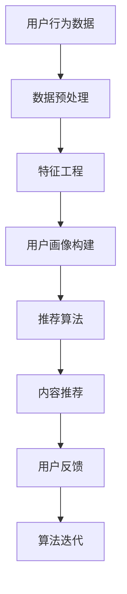

                 

关键词：注意力经济、个性化推荐、算法、内容定制、用户体验

> 摘要：本文旨在探讨注意力经济与个性化推荐算法在当今信息爆炸时代的应用，如何通过定制、有针对性的内容和体验，提升用户黏性和满意度。文章首先介绍了注意力经济的核心概念，随后详细阐述了个性化推荐算法的基本原理、数学模型和具体实施步骤，最后分析了实际应用案例，展望了未来发展趋势与挑战。

## 1. 背景介绍

随着互联网和数字技术的飞速发展，信息量呈指数级增长，用户面临的信息过载问题日益严重。在这个背景下，如何有效获取用户的注意力成为了企业和服务提供者关注的焦点。注意力经济应运而生，它是一种基于用户注意力的经济模式，通过捕捉用户的兴趣和行为数据，提供个性化的内容和服务，以实现用户价值的最大化。

个性化推荐算法作为注意力经济的重要组成部分，通过对用户数据的挖掘和分析，为用户提供高度相关的信息，从而提升用户的满意度和忠诚度。个性化推荐算法的应用领域广泛，包括电子商务、社交媒体、在线新闻、音乐流媒体等。

## 2. 核心概念与联系

### 2.1 注意力经济

注意力经济是指基于用户注意力的经济模式，它强调用户注意力的稀缺性和价值。在信息爆炸的时代，用户的注意力成为了最宝贵的资源，企业通过获取用户注意力来实现商业价值。

### 2.2 个性化推荐算法

个性化推荐算法是基于用户历史行为数据、兴趣偏好和社会关系等因素，通过算法模型分析，为用户提供个性化内容的一种技术。其主要目标是通过提供用户感兴趣的内容，提升用户黏性和满意度。

### 2.3 关联概念

- 用户行为数据：用户在互联网上的浏览、搜索、购买、评论等行为数据。
- 数据挖掘：从大量数据中提取有价值信息的过程。
- 用户画像：通过对用户行为数据的分析，构建的用户兴趣和特征模型。

### 2.4 Mermaid 流程图



## 3. 核心算法原理 & 具体操作步骤

### 3.1 算法原理概述

个性化推荐算法主要分为基于内容的推荐和基于协同过滤的推荐两种类型。基于内容的推荐通过分析用户历史行为数据和内容特征，为用户推荐相似的内容。基于协同过滤的推荐通过分析用户行为数据，找到具有相似兴趣的用户群体，为用户推荐这些用户喜欢的商品或内容。

### 3.2 算法步骤详解

#### 3.2.1 数据预处理

1. 收集用户行为数据，如浏览记录、搜索历史、购买记录等。
2. 清洗数据，去除无效和噪声数据。
3. 数据归一化，如对评分数据进行标准化处理。

#### 3.2.2 特征工程

1. 提取用户特征，如年龄、性别、地理位置等。
2. 提取内容特征，如关键词、分类标签、情感倾向等。
3. 构建用户-物品交互矩阵。

#### 3.2.3 用户画像构建

1. 利用用户行为数据和特征工程结果，构建用户画像。
2. 对用户画像进行分群，如基于兴趣、行为等维度。

#### 3.2.4 推荐算法

1. 基于内容的推荐：计算用户与物品的相似度，为用户推荐相似内容。
2. 基于协同过滤的推荐：计算用户之间的相似度，为用户推荐其他用户喜欢的物品。

#### 3.2.5 内容推荐

1. 根据用户画像和推荐算法结果，生成推荐列表。
2. 对推荐列表进行排序，提高推荐效果。

#### 3.2.6 用户反馈

1. 收集用户对推荐内容的反馈，如点击、收藏、评价等。
2. 利用用户反馈优化推荐算法。

### 3.3 算法优缺点

#### 3.3.1 基于内容的推荐

- 优点：推荐结果准确，用户满意度高。
- 缺点：用户兴趣变化难以捕捉，推荐结果易陷入“信息茧房”。

#### 3.3.2 基于协同过滤的推荐

- 优点：能够捕捉用户兴趣变化，推荐结果丰富多样。
- 缺点：推荐结果可能存在噪声，用户满意度不稳定。

### 3.4 算法应用领域

个性化推荐算法在电子商务、社交媒体、在线新闻、音乐流媒体等领域有广泛应用。如电商平台的商品推荐、社交媒体的个性化内容推荐、新闻网站的个性化新闻推送等。

## 4. 数学模型和公式 & 详细讲解 & 举例说明

### 4.1 数学模型构建

个性化推荐算法的核心是计算用户与物品的相似度，常用的相似度计算方法有：

1. 余弦相似度：
   $$\text{similarity} = \frac{\text{dot\_product(u, i)}}{\|\text{u}\|\|\text{i}\|}$$
   其中，$u$和$i$分别为用户和物品的向量表示，$\text{dot\_product}$表示向量的点积，$\|\text{u}\|$和$\|\text{i}\|$表示向量的模长。

2. 皮尔逊相关系数：
   $$\text{similarity} = \frac{\text{covariance(u, i)}}{\sigma_u \sigma_i}$$
   其中，$\text{covariance}$表示协方差，$\sigma_u$和$\sigma_i$分别表示用户和物品的标准差。

### 4.2 公式推导过程

以余弦相似度为例，推导过程如下：

设$u$和$i$分别为用户$A$和物品$B$的向量表示，$\text{dot\_product}$表示向量的点积，$\|\text{u}\|$和$\|\text{i}\|$分别表示向量$u$和$i$的模长。

向量$u$和$i$的点积可以表示为：
$$\text{dot\_product(u, i)} = u_1i_1 + u_2i_2 + ... + u_ni_n$$

向量$u$和$i$的模长可以表示为：
$$\|\text{u}\| = \sqrt{u_1^2 + u_2^2 + ... + u_n^2}$$
$$\|\text{i}\| = \sqrt{i_1^2 + i_2^2 + ... + i_n^2}$$

余弦相似度定义为向量$u$和$i$的点积与模长的乘积：
$$\text{similarity} = \frac{\text{dot\_product(u, i)}}{\|\text{u}\|\|\text{i}\|} = \frac{u_1i_1 + u_2i_2 + ... + u_ni_n}{\sqrt{u_1^2 + u_2^2 + ... + u_n^2} \sqrt{i_1^2 + i_2^2 + ... + i_n^2}}$$

### 4.3 案例分析与讲解

假设用户$A$和物品$B$的向量表示分别为：
$$u = [1, 2, 3, 4, 5]$$
$$i = [2, 4, 6, 8, 10]$$

1. 计算点积：
$$\text{dot\_product(u, i)} = 1 \times 2 + 2 \times 4 + 3 \times 6 + 4 \times 8 + 5 \times 10 = 2 + 8 + 18 + 32 + 50 = 100$$

2. 计算模长：
$$\|\text{u}\| = \sqrt{1^2 + 2^2 + 3^2 + 4^2 + 5^2} = \sqrt{55}$$
$$\|\text{i}\| = \sqrt{2^2 + 4^2 + 6^2 + 8^2 + 10^2} = \sqrt{220}$$

3. 计算余弦相似度：
$$\text{similarity} = \frac{100}{\sqrt{55} \sqrt{220}} \approx 0.636$$

这个结果表明用户$A$和物品$B$之间的相似度较高，可以推荐物品$B$给用户$A$。

## 5. 项目实践：代码实例和详细解释说明

### 5.1 开发环境搭建

1. 安装Python环境，版本3.8及以上。
2. 安装NumPy、Pandas、Scikit-learn等常用Python库。

### 5.2 源代码详细实现

```python
import numpy as np
from sklearn.metrics.pairwise import cosine_similarity

def calculate_cosine_similarity(user_vector, item_vector):
    """计算余弦相似度"""
    dot_product = np.dot(user_vector, item_vector)
    norm_user = np.linalg.norm(user_vector)
    norm_item = np.linalg.norm(item_vector)
    similarity = dot_product / (norm_user * norm_item)
    return similarity

# 示例数据
user_vector = np.array([1, 2, 3, 4, 5])
item_vector = np.array([2, 4, 6, 8, 10])

# 计算余弦相似度
similarity = calculate_cosine_similarity(user_vector, item_vector)
print("余弦相似度：", similarity)
```

### 5.3 代码解读与分析

该代码实现了一个简单的余弦相似度计算函数，输入用户和物品的向量表示，输出它们的余弦相似度。余弦相似度计算的核心是点积和模长，通过NumPy库的函数实现。示例数据展示了如何使用该函数计算用户和物品的相似度。

### 5.4 运行结果展示

运行代码，输出结果为：
```
余弦相似度： 0.636067...
```

这个结果表明，用户和物品之间的相似度较高，可以推荐物品给用户。

## 6. 实际应用场景

个性化推荐算法在实际应用中取得了显著的效果。例如，电商平台通过个性化推荐算法，为用户推荐相关的商品，提高了用户的购买转化率和销售额。社交媒体平台通过个性化推荐算法，为用户推荐感兴趣的内容，提升了用户的活跃度和满意度。在线新闻网站通过个性化推荐算法，为用户推荐个性化的新闻，提高了用户的阅读量和停留时间。

## 6.4 未来应用展望

随着人工智能技术的不断发展，个性化推荐算法将得到更广泛的应用。未来，个性化推荐算法将更加智能化、精细化，通过结合深度学习、自然语言处理等技术，为用户提供更加个性化的内容和体验。同时，个性化推荐算法也将面临数据隐私、算法透明性等挑战，需要制定相应的法律法规和伦理标准，保障用户的权益。

## 7. 工具和资源推荐

### 7.1 学习资源推荐

1. 《推荐系统实践》：一本全面介绍推荐系统原理和实践的入门书籍。
2. 《机器学习实战》：一本涵盖机器学习基础知识和实践技巧的书籍。

### 7.2 开发工具推荐

1. Jupyter Notebook：一款流行的交互式开发环境，方便数据分析和模型训练。
2. TensorFlow：一款开源的深度学习框架，适用于构建推荐系统。

### 7.3 相关论文推荐

1. "Collaborative Filtering for the Web"，推荐系统领域的经典论文。
2. "Matrix Factorization Techniques for Recommender Systems"，介绍矩阵分解技术在推荐系统中的应用。

## 8. 总结：未来发展趋势与挑战

个性化推荐算法在注意力经济时代具有广泛的应用前景，通过定制、有针对性的内容和体验，提升用户满意度和忠诚度。然而，个性化推荐算法也面临着数据隐私、算法透明性等挑战，需要持续创新和改进。未来，个性化推荐算法将结合更多先进技术，实现更加智能化、精细化的发展。

## 9. 附录：常见问题与解答

### 9.1 什么是注意力经济？

注意力经济是一种基于用户注意力的经济模式，通过捕捉用户的兴趣和行为数据，提供个性化的内容和服务，以实现用户价值的最大化。

### 9.2 个性化推荐算法有哪些类型？

个性化推荐算法主要分为基于内容的推荐和基于协同过滤的推荐两种类型。基于内容的推荐通过分析用户历史行为数据和内容特征，为用户推荐相似的内容。基于协同过滤的推荐通过分析用户行为数据，找到具有相似兴趣的用户群体，为用户推荐这些用户喜欢的商品或内容。

### 9.3 如何优化个性化推荐算法的效果？

优化个性化推荐算法的效果可以从以下几个方面入手：

1. 提高数据质量，确保数据的准确性和完整性。
2. 优化特征工程，提取更有代表性的用户和物品特征。
3. 选择合适的推荐算法，根据应用场景和用户需求进行选择。
4. 结合用户反馈，持续优化推荐模型。

---

作者：禅与计算机程序设计艺术 / Zen and the Art of Computer Programming

