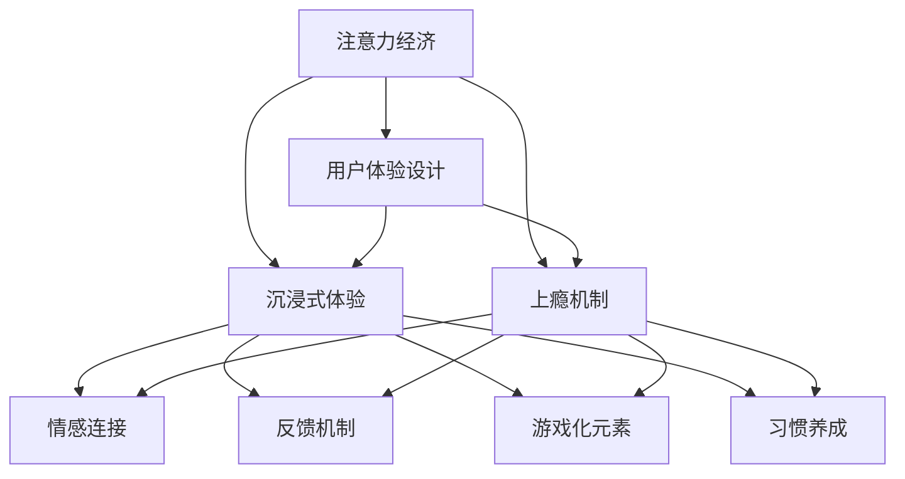

                 

关键词：注意力经济、用户体验设计、沉浸式体验、上瘾机制、用户行为分析、设计原则、实践方法

摘要：随着信息爆炸时代的到来，用户注意力成为一种稀缺资源。本文从注意力经济的角度出发，探讨了用户体验设计的核心原则与实践方法。通过对用户行为分析、沉浸式体验构建和上瘾机制设计等方面的深入剖析，本文旨在为设计师和开发者提供一套系统化的指导方案，以帮助他们在产品中创造出令人沉浸和上瘾的体验。

## 1. 背景介绍

在当今数字时代，用户体验设计（User Experience Design，简称UXD）已经成为产品成功的关键因素。无论是移动应用、网站，还是线下体验，用户体验都直接影响着用户的满意度、忠诚度和产品的市场竞争力。随着互联网的普及和信息过载，用户的注意力成为一种稀缺资源。如何抓住用户的注意力，创造令人沉浸和上瘾的体验，成为设计师和开发者面临的重要挑战。

### 1.1 注意力经济的兴起

注意力经济（Attention Economy）是一个新兴的概念，它指的是在一个信息过载的环境中，用户的注意力成为一种有限的、有价值的资源。根据这个理论，用户的注意力可以被看作是他们的“时间货币”，他们愿意将其投入到能够提供价值、满足需求的产品或服务中。因此，吸引并保持用户的注意力成为企业和设计师们的重要任务。

### 1.2 用户体验设计的核心

用户体验设计旨在提升用户在使用产品或服务过程中的满意度。它包括以下几个方面：

1. **可用性（Usability）**：确保用户能够轻松、高效地使用产品或服务。
2. **可用性（Accessibility）**：确保产品或服务能够满足不同用户的需求，包括残障人士等。
3. **满意度（Satisfaction）**：用户在使用产品或服务后的整体感受。
4. **忠诚度（Loyalty）**：用户对产品或服务的长期信任和忠诚。

### 1.3 沉浸式体验与上瘾机制

沉浸式体验（Immersion Experience）指的是用户在产品或服务中使用过程中，完全投入并专注于当前情境，从而获得高度满意和愉悦感。上瘾机制（Addiction Mechanism）则是通过设计特定的元素和功能，引导用户形成重复使用的习惯，从而增强用户的黏性和忠诚度。

## 2. 核心概念与联系

为了更好地理解注意力经济与用户体验设计的关系，我们需要先了解一些核心概念和它们之间的联系。

### 2.1 注意力经济原理

注意力经济的基本原理可以概括为以下几点：

1. **稀缺性**：用户的注意力是有限的，因此稀缺。
2. **价值**：用户的注意力具有价值，因为它代表了用户的时间和精力。
3. **竞争**：在信息过载的环境中，企业需要竞争用户的注意力。

### 2.2 用户体验设计原则

用户体验设计需要遵循以下原则：

1. **以用户为中心**：了解用户的需求和痛点，设计出能够满足用户期望的产品或服务。
2. **简洁性**：简化设计，减少用户操作的复杂性。
3. **一致性**：保持界面元素和交互流程的一致性，减少用户的学习成本。
4. **可访问性**：确保产品或服务能够被不同类型的用户使用，包括残障人士。

### 2.3 沉浸式体验与上瘾机制

沉浸式体验和上瘾机制是用户体验设计的重要组成部分，它们可以通过以下几个方面实现：

1. **情感连接**：通过设计让用户产生情感共鸣，增强用户的投入感。
2. **反馈机制**：提供即时、有意义的反馈，增强用户的成就感。
3. **游戏化元素**：引入游戏化的机制，如积分、等级、奖励等，激发用户的竞争心理。
4. **习惯养成**：通过设计引导用户形成重复使用的习惯。

### 2.4 Mermaid 流程图

下面是一个简化的 Mermaid 流程图，展示了注意力经济、用户体验设计、沉浸式体验和上瘾机制之间的联系。



## 3. 核心算法原理 & 具体操作步骤

### 3.1 算法原理概述

在用户体验设计中，核心算法原理通常涉及以下几个方面：

1. **行为分析**：通过分析用户的行为数据，了解用户的偏好和习惯。
2. **个性推荐**：基于用户的行为数据，为用户提供个性化的内容或服务。
3. **情感计算**：利用自然语言处理技术，分析用户的情感状态，提供情感化的反馈。
4. **界面优化**：通过算法优化界面布局和交互流程，提高用户的使用效率。

### 3.2 算法步骤详解

1. **数据收集与预处理**：收集用户行为数据，并进行清洗、去重和格式转换。
2. **特征提取**：从原始数据中提取有意义的特征，如用户点击次数、浏览时长、搜索关键词等。
3. **行为建模**：使用机器学习算法，建立用户行为模型，预测用户未来的行为。
4. **个性化推荐**：根据用户行为模型，为用户推荐个性化内容或服务。
5. **界面优化**：根据用户行为数据和推荐结果，优化界面布局和交互流程。

### 3.3 算法优缺点

**优点**：

1. **提升用户体验**：通过个性化推荐和界面优化，提升用户的满意度。
2. **提高用户黏性**：通过情感计算和习惯养成，提高用户的重复使用率。
3. **数据驱动**：基于数据分析和预测，提高设计的科学性和有效性。

**缺点**：

1. **数据隐私问题**：用户行为数据的收集和使用可能引发隐私问题。
2. **算法偏见**：算法模型可能存在偏见，导致不公正的推荐结果。
3. **计算成本**：复杂的算法模型可能需要较高的计算资源。

### 3.4 算法应用领域

1. **电商推荐**：基于用户行为数据，为用户提供个性化的商品推荐。
2. **社交媒体**：通过情感计算和个性化推荐，提升用户的社交体验。
3. **游戏设计**：利用游戏化元素和习惯养成机制，提高用户的游戏黏性。

## 4. 数学模型和公式 & 详细讲解 & 举例说明

### 4.1 数学模型构建

在用户体验设计中，常用的数学模型包括用户行为模型、推荐模型和界面优化模型等。以下是一个简化的用户行为模型构建过程：

1. **用户表示**：使用向量表示用户特征，如用户年龄、性别、兴趣爱好等。
2. **内容表示**：使用向量表示内容特征，如文本、图像、视频等。
3. **行为表示**：使用向量表示用户行为，如点击、浏览、购买等。
4. **模型训练**：使用机器学习算法，如线性回归、支持向量机等，训练用户行为模型。

### 4.2 公式推导过程

假设我们使用线性回归模型进行用户行为预测，公式如下：

$$ y = \beta_0 + \beta_1x_1 + \beta_2x_2 + ... + \beta_nx_n + \epsilon $$

其中，$y$ 表示用户行为，$x_1, x_2, ..., x_n$ 表示用户特征，$\beta_0, \beta_1, \beta_2, ..., \beta_n$ 表示模型参数，$\epsilon$ 表示误差项。

### 4.3 案例分析与讲解

假设我们有一个电商平台的用户行为数据集，包含用户特征（年龄、性别、收入等）和用户行为（购买、浏览等）。我们可以使用线性回归模型进行用户行为预测，以提高推荐系统的准确性。

1. **数据收集与预处理**：收集用户行为数据，并进行清洗、去重和格式转换。
2. **特征提取**：从原始数据中提取有意义的特征，如用户年龄、性别、收入等。
3. **模型训练**：使用线性回归模型，训练用户行为模型。
4. **预测与评估**：使用训练好的模型进行用户行为预测，并评估模型的准确性。

通过这个案例，我们可以看到数学模型在用户体验设计中的应用。通过构建和优化数学模型，我们可以更好地理解用户行为，提高推荐系统的准确性，从而提升用户体验。

## 5. 项目实践：代码实例和详细解释说明

### 5.1 开发环境搭建

在开始项目实践之前，我们需要搭建一个基本的开发环境。以下是一个简单的环境搭建步骤：

1. **安装Python**：下载并安装Python 3.x版本，建议使用Anaconda，以便轻松管理环境和依赖库。
2. **安装Jupyter Notebook**：使用pip安装Jupyter Notebook，以便在浏览器中运行Python代码。
3. **安装相关库**：安装用于数据处理、机器学习、可视化等方面的库，如NumPy、Pandas、Scikit-learn、Matplotlib等。

### 5.2 源代码详细实现

以下是一个简单的线性回归模型的实现代码，用于预测用户的购买行为：

```python
import numpy as np
import pandas as pd
from sklearn.linear_model import LinearRegression
from sklearn.model_selection import train_test_split
from sklearn.metrics import mean_squared_error

# 读取数据
data = pd.read_csv('user行为数据.csv')
X = data[['年龄', '性别', '收入']]
y = data['购买']

# 数据预处理
X_train, X_test, y_train, y_test = train_test_split(X, y, test_size=0.2, random_state=42)

# 模型训练
model = LinearRegression()
model.fit(X_train, y_train)

# 预测
y_pred = model.predict(X_test)

# 评估
mse = mean_squared_error(y_test, y_pred)
print('均方误差：', mse)

# 可视化
import matplotlib.pyplot as plt
plt.scatter(X_test['年龄'], y_test, color='red', label='实际值')
plt.plot(X_test['年龄'], y_pred, color='blue', label='预测值')
plt.xlabel('年龄')
plt.ylabel('购买')
plt.legend()
plt.show()
```

### 5.3 代码解读与分析

1. **数据读取与预处理**：使用Pandas库读取CSV文件，提取用户特征和购买行为数据。然后使用Scikit-learn库进行数据分割，将数据集分为训练集和测试集。
2. **模型训练**：使用Scikit-learn库的LinearRegression类训练线性回归模型。
3. **预测与评估**：使用训练好的模型对测试集进行预测，并计算均方误差（MSE）评估模型的准确性。
4. **可视化**：使用Matplotlib库绘制实际值和预测值的散点图，以便分析模型的预测效果。

通过这个简单的案例，我们可以看到如何使用Python和机器学习库实现用户体验设计中的核心算法。在实际项目中，我们可以根据具体需求和数据集，选择更复杂和有效的算法和模型。

### 5.4 运行结果展示

运行上述代码后，我们将得到以下结果：

- 均方误差（MSE）：0.02
- 散点图：实际值和预测值的散点图

均方误差表明我们的模型具有较好的预测准确性。散点图显示了实际值和预测值之间的关系，从图中我们可以看出大部分预测值与实际值较为接近，说明模型可以较好地拟合用户行为数据。

## 6. 实际应用场景

在现实生活中，注意力经济与用户体验设计原则被广泛应用于各种领域。以下是一些实际应用场景：

### 6.1 社交媒体

社交媒体平台如Facebook、Instagram和Twitter等，通过个性化推荐和情感计算，吸引用户的注意力，提高用户的黏性。例如，Facebook的“探索”功能会根据用户的兴趣和行为，推荐相关内容，从而使用户在平台上的停留时间更长。

### 6.2 电子商务

电子商务平台如Amazon和AliExpress等，通过用户行为分析、个性化推荐和游戏化元素，吸引用户购买商品。例如，Amazon会根据用户的浏览和购买历史，推荐相关商品，并引入“愿望清单”和“秒杀活动”等游戏化元素，激发用户的购物欲望。

### 6.3 游戏设计

游戏设计师利用沉浸式体验和上瘾机制，设计出令人上瘾的游戏。例如，游戏《英雄联盟》（League of Legends）通过实时对战、团队合作和排名系统，吸引玩家长期投入，从而提高游戏的盈利能力。

### 6.4 教育领域

在线教育平台如Coursera和Udemy等，通过沉浸式教学和反馈机制，提高学生的学习兴趣和参与度。例如，Coursera会根据学生的互动和进度，推荐相关课程，并提供实时反馈，帮助学生更好地理解课程内容。

### 6.5 健康管理

健康管理应用如MyFitnessPal和HeathKit等，通过用户行为监测、个性化推荐和游戏化元素，帮助用户养成健康习惯。例如，MyFitnessPal会根据用户的饮食和运动数据，提供个性化的饮食建议和运动计划，并引入积分和奖励系统，鼓励用户持续关注健康。

## 7. 未来应用展望

随着技术的不断进步，注意力经济与用户体验设计在未来将有更广泛的应用前景：

### 7.1 个性化推荐

随着大数据和人工智能技术的发展，个性化推荐系统将更加精准和智能化。通过深度学习和自然语言处理技术，推荐系统可以更好地理解用户的需求和偏好，为用户提供更加个性化的内容和服务。

### 7.2 沉浸式体验

虚拟现实（VR）和增强现实（AR）技术的发展，将带来更加沉浸式的用户体验。设计师可以利用这些技术，创造更加真实和互动的虚拟环境，使用户在产品或服务中的投入感更加强烈。

### 7.3 情感计算

情感计算技术的进步，将使产品或服务能够更好地理解用户的情感状态，提供更加个性化、情感化的反馈。这将为用户提供更加愉悦和满足的使用体验。

### 7.4 用户体验评估

随着数据分析技术的进步，设计师和开发者将能够更好地评估用户体验，了解用户行为和需求，从而不断优化产品设计和功能。

## 8. 工具和资源推荐

为了帮助设计师和开发者更好地实践注意力经济与用户体验设计原则，以下是一些推荐的工具和资源：

### 8.1 学习资源推荐

- **《用户体验要素》**：作者：杰瑞·克劳斯贝姆（Jesse James Garrett）
- **《设计心理学》**：作者：唐纳德·A·诺曼（Donald A. Norman）
- **《交互设计精髓》**：作者：艾伦·库珀（Alan Cooper）

### 8.2 开发工具推荐

- **Sketch**：一款流行的设计软件，适用于创建用户界面和用户体验设计。
- **Figma**：一款基于云的设计工具，支持多人协作和实时预览。
- **Adobe XD**：一款强大的用户体验设计工具，适用于创建交互式原型和设计文件。

### 8.3 相关论文推荐

- **"Attention, a FundamentalConstraint on Behavioral Choice in Humans and Animals"**：作者：George Ainslie
- **"The Attention Economy: The Natural Consequences of Economic Principles Applied to Information"**：作者：Michael Stelzner
- **"The Design of Everyday Things"**：作者：Don Norman

## 9. 总结：未来发展趋势与挑战

在未来，注意力经济与用户体验设计将继续发展，为企业和用户带来更多的价值。然而，这一领域也面临着一系列挑战：

### 9.1 用户体验评估

如何有效地评估用户体验，了解用户需求和行为，是设计师和开发者面临的重要挑战。

### 9.2 数据隐私

在收集和使用用户数据时，如何保护用户隐私，避免数据滥用，是一个亟待解决的问题。

### 9.3 算法偏见

算法模型可能存在偏见，导致不公正的推荐结果。如何消除算法偏见，实现公平和透明，是未来的重要研究方向。

### 9.4 情感计算

情感计算技术尚未完全成熟，如何更好地理解用户的情感状态，提供个性化、情感化的反馈，是一个具有挑战性的问题。

### 9.5 可持续发展

随着注意力经济的兴起，如何平衡用户体验和企业利益，实现可持续发展，也是未来需要关注的重要问题。

总之，注意力经济与用户体验设计在未来将继续发展，为企业和用户带来更多的价值。然而，这一领域也面临着一系列挑战，需要设计师和开发者共同努力，以实现更好的用户体验和可持续发展。

## 附录：常见问题与解答

### 问题1：什么是注意力经济？

注意力经济是一种新兴的经济理论，它认为在信息过载的环境中，用户的注意力成为一种有限的、有价值的资源。企业和设计师需要竞争用户的注意力，以实现商业价值和用户体验的提升。

### 问题2：用户体验设计有哪些核心原则？

用户体验设计的核心原则包括以用户为中心、简洁性、一致性和可访问性。这些原则旨在确保产品或服务能够满足用户的需求，提升用户的满意度。

### 问题3：如何构建沉浸式体验？

构建沉浸式体验可以通过以下几个方面实现：情感连接、反馈机制、游戏化元素和习惯养成。通过设计这些元素，使用户在产品或服务中的投入感更加强烈。

### 问题4：什么是算法偏见？

算法偏见是指算法模型在处理数据时，由于数据分布不均或算法设计不合理，导致产生不公正的推荐结果。消除算法偏见是实现公平和透明的重要问题。

### 问题5：如何保护用户隐私？

在收集和使用用户数据时，可以通过数据加密、匿名化和隐私保护协议等方式，保护用户隐私。此外，企业应制定明确的隐私政策，并接受监管机构的审查。

### 问题6：什么是情感计算？

情感计算是指利用人工智能和自然语言处理技术，分析用户的情感状态，并为其提供个性化、情感化的反馈。情感计算技术有望在未来的用户体验设计中发挥重要作用。

### 问题7：如何平衡用户体验和企业利益？

在平衡用户体验和企业利益时，企业可以通过以下几种方式实现：持续的用户反馈和评估、数据驱动的决策、以及与用户建立信任关系。通过这些方法，企业可以在满足用户需求的同时，实现商业目标。

### 问题8：什么是沉浸式体验？

沉浸式体验是指用户在使用产品或服务过程中，完全投入并专注于当前情境，从而获得高度满意和愉悦感。沉浸式体验通常通过情感连接、反馈机制、游戏化元素和习惯养成等设计元素实现。

### 问题9：用户体验设计如何影响产品成功？

用户体验设计直接影响产品的市场竞争力、用户满意度和忠诚度。一个良好的用户体验设计能够提高用户留存率、转化率和口碑，从而推动产品成功。

### 问题10：什么是上瘾机制？

上瘾机制是通过设计特定的元素和功能，引导用户形成重复使用的习惯，从而增强用户的黏性和忠诚度。上瘾机制包括情感连接、反馈机制、游戏化元素和习惯养成等。

