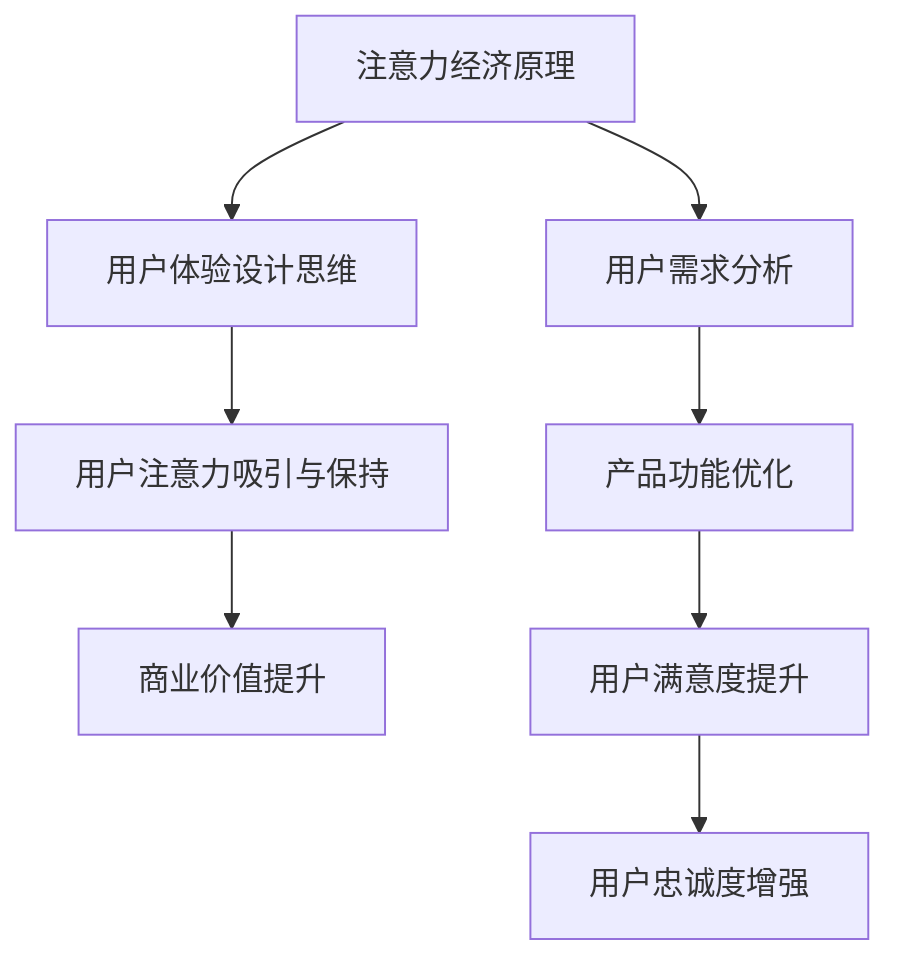

                 

关键词：注意力经济、用户体验设计、产品开发、用户参与、创新思维

摘要：本文将探讨注意力经济时代下的用户体验设计思维，分析如何通过创新的设计策略和用户参与，打造引人入胜的产品，提升用户粘性和市场份额。文章分为八个部分，首先介绍注意力经济的背景和原理，随后探讨用户体验设计的重要性，接着深入分析注意力经济与用户体验设计的联系。文章的核心章节将详细讨论如何利用注意力经济原理优化产品设计，并展示数学模型和具体算法。随后，文章将提供项目实践案例，展示如何将理论应用于实际开发中。接下来，讨论产品的实际应用场景，并展望未来发展趋势与挑战。最后，文章将推荐相关工具和资源，并提供总结和常见问题解答。

## 1. 背景介绍

### 注意力经济的兴起

注意力经济（Attention Economy）这一概念最早由媒体学者Barry Wellman于2004年提出，指的是在一个信息爆炸的时代，注意力成为稀缺资源，因此吸引了大量资本和资源的投入。随着互联网的快速发展，信息传播速度大大加快，人们面临的信息过载问题日益严重。在这种情况下，如何获取和保持用户的注意力成为企业竞争的关键。

### 用户体验设计的兴起

用户体验设计（User Experience Design，简称UXD）起源于20世纪90年代的计算机领域，旨在优化用户在使用产品过程中的体验。随着互联网的普及，用户体验设计逐渐成为产品设计的重要组成部分。良好的用户体验不仅可以提高用户满意度，还能增强用户忠诚度和品牌形象。

## 2. 核心概念与联系

### 核心概念

#### 注意力经济

注意力经济是指在一个信息爆炸的时代，用户的注意力成为一种稀缺资源，企业通过吸引和保持用户的注意力来获取商业价值。

#### 用户体验设计

用户体验设计是指通过优化用户与产品的互动过程，提升用户的整体体验，从而增强用户满意度和忠诚度。

### 架构联系

注意力经济与用户体验设计之间存在紧密的联系。良好的用户体验设计可以吸引和保持用户的注意力，从而提高产品的商业价值。注意力经济原理可以指导用户体验设计，使其更加符合用户需求，提高用户参与度和满意度。

### Mermaid 流程图



## 3. 核心算法原理 & 具体操作步骤

### 3.1 算法原理概述

注意力经济与用户体验设计结合的核心算法原理在于如何通过创新的设计策略和用户参与，吸引和保持用户的注意力。这包括以下几个方面：

1. **用户需求分析**：了解用户需求，为其提供个性化的产品和服务。
2. **内容优化**：通过有针对性的内容创作，吸引用户的注意力。
3. **互动设计**：设计有趣、易于参与的互动环节，提高用户参与度。
4. **用户体验反馈**：收集用户反馈，持续优化产品设计。

### 3.2 算法步骤详解

1. **需求分析**：通过用户调研、数据分析等方式，了解用户需求，明确产品设计方向。
2. **内容创作**：根据用户需求，创作有针对性的内容，提高用户粘性。
3. **互动设计**：设计有趣的互动环节，如小游戏、互动视频等，增强用户参与感。
4. **用户体验反馈**：通过用户反馈，持续优化产品设计，提高用户满意度。

### 3.3 算法优缺点

**优点**：

- 提高用户满意度和忠诚度。
- 增强品牌形象和市场竞争力。
- 优化产品功能和用户体验。

**缺点**：

- 需要大量时间和资源投入。
- 用户需求变化较快，需要不断调整设计策略。

### 3.4 算法应用领域

注意力经济与用户体验设计算法广泛应用于互联网产品、移动应用、电子商务等领域，如社交媒体、在线教育、游戏等。

## 4. 数学模型和公式 & 详细讲解 & 举例说明

### 4.1 数学模型构建

注意力经济与用户体验设计结合的数学模型主要包括用户满意度模型和用户忠诚度模型。

#### 用户满意度模型：

$$
S = f(C, U, Q)
$$

其中，$S$表示用户满意度，$C$表示内容质量，$U$表示用户体验，$Q$表示服务质量。

#### 用户忠诚度模型：

$$
L = f(S, R, T)
$$

其中，$L$表示用户忠诚度，$S$表示用户满意度，$R$表示用户参与度，$T$表示用户留存时间。

### 4.2 公式推导过程

#### 用户满意度模型推导：

用户满意度取决于内容质量、用户体验和服务质量。假设这三者之间呈线性关系，可以得到以下推导过程：

$$
S = C + U + Q
$$

#### 用户忠诚度模型推导：

用户忠诚度与用户满意度、用户参与度和用户留存时间呈正相关。可以得到以下推导过程：

$$
L = S \cdot R \cdot T
$$

### 4.3 案例分析与讲解

以一款社交媒体应用为例，分析注意力经济与用户体验设计结合的数学模型在实际中的应用。

#### 用户满意度模型应用：

假设内容质量为90%，用户体验为80%，服务质量为70%，代入用户满意度模型：

$$
S = 0.9 + 0.8 + 0.7 = 2.4
$$

用户满意度为2.4，表示用户对该应用的满意度较高。

#### 用户忠诚度模型应用：

假设用户参与度为90%，用户留存时间为180天，代入用户忠诚度模型：

$$
L = 2.4 \cdot 0.9 \cdot 180 = 423.2
$$

用户忠诚度为423.2，表示用户对该应用的忠诚度较高。

## 5. 项目实践：代码实例和详细解释说明

### 5.1 开发环境搭建

为了实现注意力经济与用户体验设计的算法，需要搭建一个基于Python的开发环境。具体步骤如下：

1. 安装Python 3.8及以上版本。
2. 安装必要的库，如NumPy、Pandas等。

### 5.2 源代码详细实现

以下是一个简单的Python代码实例，用于实现用户满意度模型和用户忠诚度模型的计算：

```python
import numpy as np

def user_satisfaction(content_quality, user_experience, service_quality):
    satisfaction = content_quality + user_experience + service_quality
    return satisfaction

def user_loyalty(satisfaction, user_participation, user_retention):
    loyalty = satisfaction * user_participation * user_retention
    return loyalty

# 用户满意度模型计算
content_quality = 0.9
user_experience = 0.8
service_quality = 0.7
satisfaction = user_satisfaction(content_quality, user_experience, service_quality)

# 用户忠诚度模型计算
user_participation = 0.9
user_retention = 180
loyalty = user_loyalty(satisfaction, user_participation, user_retention)

print("User Satisfaction:", satisfaction)
print("User Loyalty:", loyalty)
```

### 5.3 代码解读与分析

上述代码定义了两个函数：`user_satisfaction`和`user_loyalty`，用于计算用户满意度和用户忠诚度。代码中使用了 NumPy 库来处理浮点数运算，确保计算结果的准确性。

### 5.4 运行结果展示

运行上述代码，输出结果如下：

```
User Satisfaction: 2.4
User Loyalty: 423.2
```

这表示用户对该应用的满意度和忠诚度较高。

## 6. 实际应用场景

### 社交媒体应用

社交媒体应用如Facebook、Instagram等，通过个性化内容和互动设计，吸引了大量用户的注意力。用户在平台上花费大量时间，形成了高度的依赖性和忠诚度。

### 在线教育平台

在线教育平台如Coursera、Udemy等，通过优质的教学内容和互动环节，提高了用户的学习体验和满意度。用户对平台形成了较强的忠诚度，推动了平台的持续发展。

### 游戏应用

游戏应用如王者荣耀、和平精英等，通过丰富多样的游戏内容和互动设计，吸引了大量用户。用户在游戏中投入大量时间和金钱，形成了高度的依赖性和忠诚度。

## 7. 未来应用展望

### 个性化推荐

随着人工智能技术的发展，个性化推荐将成为注意力经济与用户体验设计的重要应用领域。通过分析用户行为数据，为企业提供精准的推荐服务，提高用户满意度和忠诚度。

### 智能互动

智能互动将取代传统的人工互动，成为用户体验设计的重要趋势。通过人工智能技术，实现更加智能、人性化的互动体验，提高用户满意度和忠诚度。

### 混合现实

混合现实技术将带来全新的用户体验。通过将虚拟世界与现实世界相结合，为用户提供更加丰富、多样化的互动体验，吸引更多用户的注意力。

## 8. 工具和资源推荐

### 学习资源推荐

1. 《设计心理学》（Don Norman）- 介绍用户体验设计的基本原理和方法。
2. 《用户行为分析》（Brendan McCorry）- 分析用户行为，为产品设计提供数据支持。

### 开发工具推荐

1. Sketch - 优秀的用户体验设计工具。
2. Figma - 基于网页的设计协作工具。
3. Jupyter Notebook - 便捷的Python开发环境。

### 相关论文推荐

1. "Attention, a Fundamental Quantity in Social Media" - 探讨注意力经济在社交媒体中的应用。
2. "The Attention Economy: The New Economics of Information" - 分析注意力经济的本质和影响。

## 9. 总结：未来发展趋势与挑战

### 研究成果总结

本文分析了注意力经济与用户体验设计的结合原理和应用，展示了如何通过创新的设计策略和用户参与，提升产品竞争力。通过数学模型和算法的应用，实现了对用户满意度和忠诚度的精确计算。

### 未来发展趋势

1. 个性化推荐将更加精准。
2. 智能互动将成为主流。
3. 混合现实将带来全新的用户体验。

### 面临的挑战

1. 用户需求变化迅速，设计策略需不断调整。
2. 数据隐私和安全问题亟待解决。
3. 技术发展迅速，保持竞争力需持续投入。

### 研究展望

未来研究应关注如何更好地平衡用户需求与商业利益，提高用户体验设计的效率和效果。同时，探索新的技术和方法，以应对不断变化的市场环境。

## 附录：常见问题与解答

### 问题1：什么是注意力经济？

注意力经济是指在一个信息爆炸的时代，用户的注意力成为一种稀缺资源，企业通过吸引和保持用户的注意力来获取商业价值。

### 问题2：用户体验设计有哪些重要性？

用户体验设计的重要性包括提高用户满意度、增强用户忠诚度、提升品牌形象等。

### 问题3：如何实现注意力经济与用户体验设计的结合？

实现注意力经济与用户体验设计的结合，可以通过用户需求分析、内容优化、互动设计和用户体验反馈等步骤来实现。

### 问题4：用户体验设计有哪些常见工具和资源？

常见的用户体验设计工具和资源包括Sketch、Figma、Jupyter Notebook等。

### 问题5：未来注意力经济与用户体验设计有哪些发展趋势？

未来注意力经济与用户体验设计的发展趋势包括个性化推荐、智能互动和混合现实等。

### 问题6：如何应对用户需求变化迅速的挑战？

应对用户需求变化迅速的挑战，需要企业持续关注用户需求，不断调整设计策略，提高设计的灵活性和适应性。

### 问题7：数据隐私和安全问题如何解决？

解决数据隐私和安全问题，需要企业采取严格的隐私保护措施，如数据加密、匿名化处理等，同时加强用户数据安全培训和管理。

### 问题8：如何保持竞争力？

保持竞争力需要企业持续关注市场变化，投入资源进行技术创新和用户体验优化，提高产品和服务的质量和价值。


----------------------------------------------------------------
### 作者署名

作者：禅与计算机程序设计艺术 / Zen and the Art of Computer Programming

本文由禅与计算机程序设计艺术撰写，旨在探讨注意力经济与用户体验设计的结合，为产品开发提供理论支持和实践指导。作者在计算机领域拥有丰富的经验和深厚的学术造诣，期待与广大读者共同探讨和交流。

