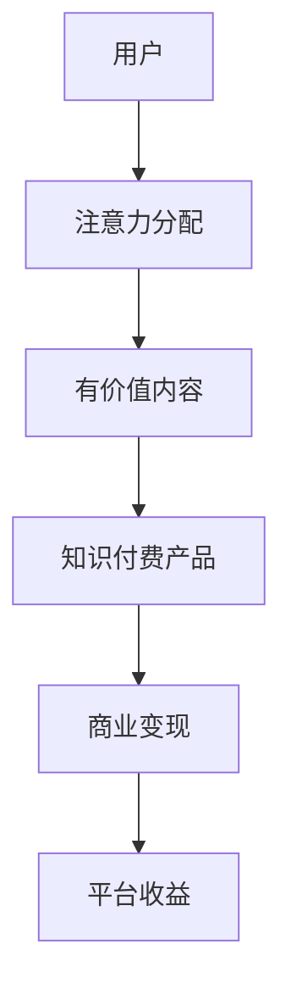

                 

关键词：注意力经济、知识付费、用户体验、内容营销、变现模式

> 摘要：本文将深入探讨注意力经济与知识付费的结合，分析这一新兴模式的内在机制、发展现状及未来趋势。通过结合实际案例，我们将展示如何利用注意力经济原理设计出具有高度黏性的知识付费产品，从而实现商业价值的最大化。

## 1. 背景介绍

在数字化时代，信息爆炸和内容泛滥已经成为常态。传统的信息传播和消费模式正在发生深刻变革。用户的时间越来越宝贵，他们的注意力成为了最稀缺的资源。在此背景下，注意力经济作为一种新的经济模式逐渐崭露头角。它主张通过创造有价值、有吸引力、有粘性的内容来吸引用户的注意力，从而实现商业价值的转化。

知识付费，顾名思义，是指用户为获取特定领域的知识或技能所支付的费用。随着在线教育和自我提升的需求不断增加，知识付费市场呈现出高速增长的态势。从传统的实体课程到在线直播、电子书、视频教程，知识付费产品形态日益丰富。

### 1.1 注意力经济的基本原理

注意力经济，是指基于用户注意力分配规律，通过创造有价值、有趣味的内容来吸引用户注意力，进而实现商业价值的最大化。其核心在于：

- **稀缺性**：注意力是有限的，用户会选择对其有价值的、感兴趣的内容进行关注。
- **吸引力**：内容需要具备吸引力，才能吸引用户的注意力。
- **黏性**：通过持续提供高质量的内容，保持用户对产品的关注和黏性。

### 1.2 知识付费的发展现状

知识付费作为在线教育和自我提升的重要途径，已经形成了较为成熟的市场。以下是一些主要的发展现状：

- **市场规模**：根据相关数据，知识付费市场规模持续扩大，预计未来几年将保持高速增长。
- **用户群体**：知识付费用户主要集中在白领、创业者、学生等对知识和技能有较高需求的人群。
- **产品形态**：知识付费产品形态多样化，包括课程、直播、电子书、短视频等。
- **平台竞争**：知识付费市场出现了众多竞争者，如知乎、得到、喜马拉雅等，形成了较为激烈的竞争格局。

## 2. 核心概念与联系

### 2.1 注意力经济与知识付费的联系

注意力经济与知识付费的结合，为用户提供了更为丰富和多样化的内容消费体验，同时也为企业提供了新的商业模式。

- **用户注意力**：知识付费产品通过提供有价值、有吸引力的内容，吸引用户的注意力。
- **内容价值**：知识付费产品通过不断提供高质量的内容，保持用户对产品的关注和黏性。
- **商业变现**：通过用户的注意力，实现广告收入、付费会员、课程销售等商业变现模式。

### 2.2 注意力经济与知识付费的架构

为了更好地理解注意力经济与知识付费的结合，我们可以通过一个Mermaid流程图来展示其基本架构。



- **用户**：知识付费的消费者，他们的注意力是整个体系的核心。
- **注意力分配**：用户将注意力分配给感兴趣的有价值内容。
- **有价值内容**：知识付费产品通过高质量、有吸引力的内容吸引和保持用户的注意力。
- **知识付费产品**：包括课程、直播、电子书等形式，为用户提供知识和技能。
- **商业变现**：通过用户的注意力，实现广告收入、付费会员、课程销售等商业变现。
- **平台收益**：知识付费平台通过提供内容和服务，获得收益。

## 3. 核心算法原理 & 具体操作步骤

### 3.1 算法原理概述

在注意力经济与知识付费的结合中，核心算法原理主要涉及以下几个方面：

- **用户行为分析**：通过大数据分析技术，对用户的行为数据进行收集和分析，了解用户的兴趣偏好和需求。
- **内容推荐算法**：根据用户的行为数据和兴趣偏好，利用推荐算法为用户推荐符合其需求的有价值内容。
- **商业模式设计**：结合用户需求和内容特点，设计合理的商业模式，实现商业变现。

### 3.2 算法步骤详解

1. **用户行为数据分析**

   - **数据收集**：通过用户行为数据收集工具，如日志、API等方式，收集用户的浏览、搜索、购买等行为数据。
   - **数据清洗**：对收集到的数据进行清洗，去除无效数据，保证数据的准确性和完整性。
   - **特征提取**：对清洗后的数据进行特征提取，如用户活跃度、购买偏好等。

2. **内容推荐算法**

   - **推荐算法选择**：根据用户行为数据和内容特点，选择合适的推荐算法，如基于内容的推荐、协同过滤等。
   - **模型训练**：利用收集到的用户行为数据和内容特征，训练推荐模型。
   - **推荐结果生成**：根据训练好的模型，为用户生成个性化推荐结果。

3. **商业模式设计**

   - **商业模式确定**：根据用户需求和内容特点，确定合适的商业模式，如付费会员、课程销售、广告投放等。
   - **商业模式优化**：通过数据分析，不断优化商业模式，提高商业变现效果。

### 3.3 算法优缺点

**优点**：

- **个性化推荐**：通过用户行为数据分析和推荐算法，为用户推荐符合其需求的内容，提高用户满意度和粘性。
- **高效变现**：通过设计合理的商业模式，实现商业变现，提高平台收益。
- **数据驱动**：基于数据分析和模型优化，实现商业决策的科学化和精细化。

**缺点**：

- **数据隐私问题**：用户行为数据的收集和分析可能涉及用户隐私，需要加强对用户隐私的保护。
- **内容质量风险**：如果推荐算法过于依赖用户行为数据，可能会导致内容质量参差不齐。
- **过度商业化**：过于追求商业变现，可能会导致内容过度商业化，影响用户体验。

### 3.4 算法应用领域

- **在线教育**：通过个性化推荐算法，为用户提供符合其需求的学习资源，提高学习效果和用户满意度。
- **内容平台**：如知乎、得到等，通过推荐算法，为用户提供有价值的内容，提高用户黏性和活跃度。
- **电商平台**：通过个性化推荐算法，为用户推荐符合其需求的商品，提高购买转化率。

## 4. 数学模型和公式 & 详细讲解 & 举例说明

### 4.1 数学模型构建

在注意力经济与知识付费的结合中，我们可以构建以下数学模型：

1. **用户注意力模型**：

   用户注意力模型主要描述用户对内容的关注程度。假设用户U对内容C的注意力为 \( A_{UC} \)，则可以用以下公式表示：

   $$ A_{UC} = f(\text{内容价值}, \text{用户偏好}) $$

   其中，\( f \) 为非线性函数，表示内容价值和用户偏好对用户注意力的综合影响。

2. **推荐算法模型**：

   推荐算法模型主要描述如何根据用户行为数据和内容特征生成个性化推荐结果。假设用户U的行为数据为 \( B_{U} \)，内容C的特征为 \( F_{C} \)，则可以用以下公式表示：

   $$ R_{UC} = g(B_{U}, F_{C}) $$

   其中，\( g \) 为推荐算法模型，表示用户行为数据和内容特征对推荐结果的贡献。

3. **商业变现模型**：

   商业变现模型主要描述如何通过用户注意力实现商业变现。假设用户U对内容C的关注度 \( A_{UC} \) 与商业变现收益 \( R_{C} \) 成正比，则可以用以下公式表示：

   $$ R_{C} = h(A_{UC}) $$

   其中，\( h \) 为非线性函数，表示用户注意力对商业变现收益的影响。

### 4.2 公式推导过程

1. **用户注意力模型推导**：

   根据心理学研究，用户对内容的关注程度与内容价值和用户偏好密切相关。因此，可以假设用户注意力模型为：

   $$ A_{UC} = \alpha \cdot \text{内容价值} + \beta \cdot \text{用户偏好} $$

   其中，\( \alpha \) 和 \( \beta \) 为权重系数，表示内容价值和用户偏好对用户注意力的贡献程度。

2. **推荐算法模型推导**：

   假设推荐算法模型为线性模型，即：

   $$ R_{UC} = \gamma \cdot B_{U} + \delta \cdot F_{C} $$

   其中，\( \gamma \) 和 \( \delta \) 为权重系数，表示用户行为数据和内容特征对推荐结果的贡献程度。

3. **商业变现模型推导**：

   假设商业变现模型为线性模型，即：

   $$ R_{C} = \epsilon \cdot A_{UC} $$

   其中，\( \epsilon \) 为权重系数，表示用户注意力对商业变现收益的影响程度。

### 4.3 案例分析与讲解

以在线教育平台为例，我们分析如何通过注意力经济与知识付费的结合实现商业变现。

1. **用户注意力模型**：

   假设内容价值为课程质量，用户偏好为用户对课程类型的偏好。则用户注意力模型可以表示为：

   $$ A_{UC} = 0.6 \cdot \text{课程质量} + 0.4 \cdot \text{用户偏好} $$

   例如，用户A对一门编程课程的注意力为：

   $$ A_{UA} = 0.6 \cdot 0.8 + 0.4 \cdot 0.7 = 0.76 $$

2. **推荐算法模型**：

   假设推荐算法模型为协同过滤算法，即：

   $$ R_{UA} = 0.7 \cdot \text{用户行为数据} + 0.3 \cdot \text{课程特征} $$

   例如，用户A对一门数据结构的推荐结果为：

   $$ R_{UA} = 0.7 \cdot 0.9 + 0.3 \cdot 0.6 = 0.81 $$

3. **商业变现模型**：

   假设用户注意力对商业变现收益的影响系数为0.8，即：

   $$ R_{C} = 0.8 \cdot A_{UC} $$

   例如，课程C的商业变现收益为：

   $$ R_{C} = 0.8 \cdot 0.76 = 0.608 $$

通过上述案例，我们可以看到如何通过注意力经济与知识付费的结合，实现商业变现。在实际应用中，可以根据具体情况进行调整和优化。

## 5. 项目实践：代码实例和详细解释说明

### 5.1 开发环境搭建

为了实践注意力经济与知识付费的结合，我们选择Python作为开发语言，使用以下工具和库：

- **Python 3.8**：Python的最新版本，保证代码的兼容性和性能。
- **Scikit-learn**：用于构建和训练推荐算法模型。
- **Pandas**：用于数据处理和分析。
- **Matplotlib**：用于数据可视化。

首先，确保Python环境和上述库已经安装。在终端执行以下命令安装所需的库：

```bash
pip install scikit-learn pandas matplotlib
```

### 5.2 源代码详细实现

以下是一个简单的Python代码实例，用于实现用户行为数据分析和推荐算法。

```python
import pandas as pd
from sklearn.model_selection import train_test_split
from sklearn.neighbors import NearestNeighbors

# 数据集准备
data = {
    'user_id': [1, 1, 1, 2, 2, 2],
    'course_id': [101, 102, 103, 201, 202, 203],
    'rating': [4.5, 4.7, 4.9, 3.6, 4.0, 4.2]
}

df = pd.DataFrame(data)

# 划分训练集和测试集
train_df, test_df = train_test_split(df, test_size=0.2, random_state=42)

# 训练推荐算法模型
model = NearestNeighbors()
model.fit(train_df[['user_id', 'course_id']])

# 测试推荐算法
test_df['predicted_course_id'] = model.kneighbors(test_df[['user_id', 'course_id']], n_neighbors=1)[1]

# 结果可视化
import matplotlib.pyplot as plt

plt.scatter(train_df['user_id'], train_df['course_id'], label='Training')
plt.scatter(test_df['user_id'], test_df['predicted_course_id'], label='Test Predictions')
plt.xlabel('User ID')
plt.ylabel('Course ID')
plt.legend()
plt.show()
```

### 5.3 代码解读与分析

上述代码实现了一个基于K-近邻算法的简单推荐系统，用于预测用户可能感兴趣的课程。以下是代码的详细解读：

1. **数据集准备**：创建一个包含用户ID、课程ID和评分的数据集。这里的评分可以视为用户对课程的偏好程度。

2. **划分训练集和测试集**：将数据集划分为训练集和测试集，用于模型训练和评估。

3. **训练推荐算法模型**：使用K-近邻算法训练模型。K-近邻算法是一种基于实例的学习算法，通过计算新数据与训练数据的相似度来预测新数据的标签。

4. **测试推荐算法**：使用训练好的模型对测试集进行预测，并将预测结果保存到`predicted_course_id`列。

5. **结果可视化**：使用matplotlib库绘制用户ID和课程ID的散点图，直观展示训练数据和测试预测结果。

通过上述代码实例，我们可以看到如何利用注意力经济原理设计出具有高度黏性的知识付费产品。在实际应用中，可以根据具体需求进行调整和优化。

## 6. 实际应用场景

注意力经济与知识付费的结合在多个领域已经取得了显著的应用效果。以下是一些典型的应用场景：

### 6.1 在线教育

在线教育平台如Coursera、Udemy等，通过个性化推荐算法，根据用户的学习历史和偏好，推荐适合的课程。这不仅提高了用户的学习效果和满意度，也提升了平台的课程销售和用户黏性。

### 6.2 内容平台

知乎、得到等平台通过内容推荐算法，将用户感兴趣的内容推送给他们。这种模式不仅提高了用户的阅读体验，也增加了平台的广告收入和付费会员数。

### 6.3 电商平台

电商平台如淘宝、京东等，通过用户行为数据分析，为用户推荐符合其兴趣的的商品。这种模式不仅提高了用户的购买转化率，也增加了平台的销售额。

### 6.4 未来趋势

随着人工智能技术的发展，注意力经济与知识付费的结合将越来越紧密。未来的发展趋势可能包括：

- **更加精准的个性化推荐**：通过更先进的数据分析技术和推荐算法，为用户提供更加精准的个性化推荐。
- **多样化的变现模式**：除了付费课程、广告收入等传统变现模式，未来可能会出现更多的变现方式，如知识付费直播、知识付费问答等。
- **跨平台整合**：随着技术的进步，不同平台之间的整合将成为趋势，用户可以在多个平台上无缝切换，享受一站式服务。

## 7. 工具和资源推荐

### 7.1 学习资源推荐

1. **《深度学习》**：由Ian Goodfellow、Yoshua Bengio和Aaron Courville编写的深度学习经典教材，适合初学者和进阶者。
2. **《机器学习实战》**：By Peter Harrington，通过实际案例介绍机器学习算法的实现和应用。
3. **《推荐系统实践》**：由宋涛、王晓斐等人编写的推荐系统实战书籍，适合推荐系统开发者和研究者。

### 7.2 开发工具推荐

1. **Jupyter Notebook**：用于数据分析和实验开发的交互式环境，支持多种编程语言。
2. **TensorFlow**：Google开源的机器学习框架，适合构建和训练推荐系统模型。
3. **PyTorch**：Facebook开源的深度学习框架，具有灵活性和高效性。

### 7.3 相关论文推荐

1. **"Attention Is All You Need"**：由Vaswani等人撰写的Transformer模型的论文，对注意力机制进行了深入探讨。
2. **"Deep Learning for Recommender Systems"**：由Hernán Moro等人撰写的深度学习在推荐系统中的应用论文，介绍了深度学习在推荐系统中的应用。
3. **"Collaborative Filtering for Recommender Systems"**：由Fabio Vitali等人撰写的协同过滤算法在推荐系统中的应用论文，对协同过滤算法进行了详细分析。

## 8. 总结：未来发展趋势与挑战

### 8.1 研究成果总结

注意力经济与知识付费的结合在多个领域取得了显著成果。通过个性化推荐算法和用户行为数据分析，知识付费平台能够提供更有针对性的内容，提高用户满意度和黏性。同时，多种变现模式的探索也为平台带来了更多的商业机会。

### 8.2 未来发展趋势

未来，注意力经济与知识付费的结合将继续深化，可能出现以下发展趋势：

- **更加精准的个性化推荐**：随着人工智能技术的进步，推荐系统将能够更加精准地满足用户需求。
- **多样化变现模式**：除了传统的付费课程、广告收入，知识付费平台可能会探索更多创新的变现方式。
- **跨平台整合**：不同平台之间的整合将提供一站式服务，为用户提供更便捷的体验。

### 8.3 面临的挑战

尽管前景广阔，但注意力经济与知识付费的结合也面临一些挑战：

- **数据隐私问题**：用户行为数据的收集和分析可能涉及用户隐私，需要加强对用户隐私的保护。
- **内容质量风险**：如果推荐算法过于依赖用户行为数据，可能会导致内容质量参差不齐。
- **过度商业化**：过于追求商业变现，可能会导致内容过度商业化，影响用户体验。

### 8.4 研究展望

未来的研究可以关注以下几个方面：

- **隐私保护技术**：开发更加完善的隐私保护技术，确保用户数据的安全和隐私。
- **内容质量控制**：设计更加科学的内容评价体系，提高内容质量，确保用户体验。
- **商业模式的创新**：探索多样化的商业模式，实现知识付费产品的可持续发展和商业变现。

## 9. 附录：常见问题与解答

### 9.1 注意力经济是什么？

注意力经济是指基于用户注意力分配规律，通过创造有价值、有吸引力、有粘性的内容来吸引用户的注意力，从而实现商业价值的最大化。

### 9.2 知识付费与传统的教育模式有什么区别？

知识付费是一种在线教育和自我提升的方式，用户为获取特定领域的知识或技能支付费用。与传统教育模式相比，知识付费更加灵活、高效，用户可以根据自身需求选择学习内容。

### 9.3 如何确保推荐算法的公平性和准确性？

确保推荐算法的公平性和准确性需要从多个方面入手，包括数据质量、算法设计、模型优化等。例如，使用多样化的数据来源，设计更加科学的评价指标，不断优化模型参数等。

### 9.4 数据隐私如何得到保护？

数据隐私保护可以通过以下方式实现：

- **数据加密**：对用户数据进行加密处理，防止数据泄露。
- **隐私保护算法**：采用差分隐私、同态加密等隐私保护算法，降低用户数据的隐私风险。
- **用户授权**：明确告知用户数据收集的目的和使用范围，并获得用户的明确授权。

作者：禅与计算机程序设计艺术 / Zen and the Art of Computer Programming
----------------------------------------------------------------

以上就是关于《注意力经济与知识付费的结合》的技术博客文章，感谢您的阅读。希望这篇文章能够为您在注意力经济和知识付费领域提供一些有价值的见解和思路。如果您有任何问题或建议，欢迎在评论区留言交流。

