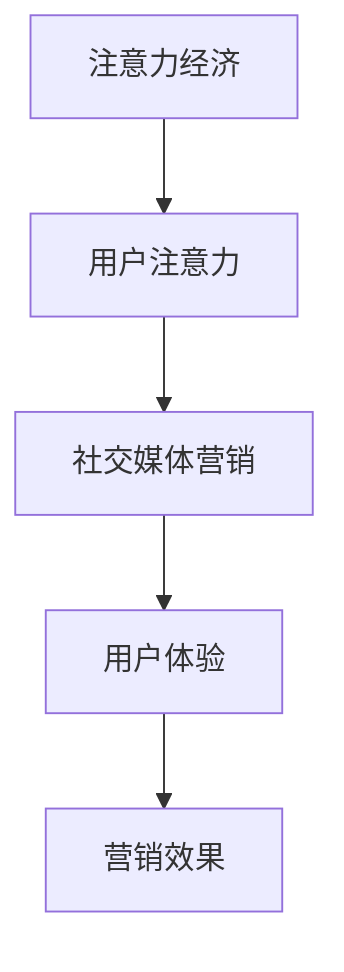

                 

关键词：注意力经济、社交媒体营销、用户体验、受众吸引

> 摘要：本文将探讨注意力经济在社交媒体营销中的应用，分析如何在不牺牲用户体验的情况下，利用注意力经济原理吸引和保持受众的注意力。文章将从背景介绍、核心概念与联系、核心算法原理、数学模型和公式、项目实践、实际应用场景、工具和资源推荐以及未来发展趋势与挑战等方面进行深入阐述。

## 1. 背景介绍

在当今数字化的时代，社交媒体已经成为了人们获取信息和娱乐的主要途径。与此同时，越来越多的企业和品牌开始将社交媒体营销视为获取用户关注和增加销售的关键手段。然而，在社交媒体平台上，信息爆炸使得用户的注意力变得稀缺，如何吸引并保持受众的注意力成为了营销的关键问题。

注意力经济是一种新兴的经济模式，它基于用户注意力的价值。在注意力经济中，用户的注意力被视为一种宝贵的资源，企业和品牌需要通过有效的策略来获取和保持用户的注意力。社交媒体营销与注意力经济紧密相连，如何在社交媒体平台上运用注意力经济原理，成为了一个重要的课题。

本文旨在探讨注意力经济与社交媒体营销的最佳实践，分析如何在不牺牲用户体验的情况下，利用注意力经济原理吸引和保持受众的注意力。通过对核心概念、算法原理、数学模型和实际应用的深入分析，为企业和品牌提供有效的社交媒体营销策略。

## 2. 核心概念与联系

### 2.1 注意力经济

注意力经济是指以用户注意力为核心，通过吸引和保持用户的注意力来创造价值的经济模式。在注意力经济中，用户的注意力被视为一种宝贵的资源，它直接影响着用户对信息的接受程度和消费决策。

### 2.2 社交媒体营销

社交媒体营销是指利用社交媒体平台进行产品推广和品牌宣传的过程。社交媒体营销的核心在于吸引和保持用户的关注，通过有效的内容和互动来增加用户的参与度和忠诚度。

### 2.3 用户注意力与用户体验

用户注意力是社交媒体营销的基础，而用户体验是衡量用户注意力价值的重要指标。在不牺牲用户体验的情况下吸引受众的注意力，是社交媒体营销的关键。

### 2.4 Mermaid 流程图

以下是一个简单的 Mermaid 流程图，用于展示注意力经济与社交媒体营销的联系。



## 3. 核心算法原理 & 具体操作步骤

### 3.1 算法原理概述

社交媒体营销的核心在于吸引和保持用户的注意力。根据注意力经济原理，我们可以通过以下方法来提高用户对营销内容的关注：

1. **内容创新性**：提供新颖、有趣、有价值的内容，以吸引用户的注意力。
2. **互动性**：增加用户与品牌的互动，提高用户参与度。
3. **个性化**：根据用户兴趣和需求提供个性化内容，提高用户满意度。

### 3.2 算法步骤详解

1. **内容策划**：根据用户需求和兴趣，策划具有创新性和互动性的内容。
2. **内容发布**：在社交媒体平台上发布内容，并设置合适的发布时间。
3. **用户互动**：积极与用户互动，回应评论和私信，增加用户参与度。
4. **数据分析**：分析用户行为数据，优化内容策略。

### 3.3 算法优缺点

**优点**：

- 提高用户关注度和参与度。
- 增加品牌曝光度和知名度。

**缺点**：

- 需要持续创新和优化内容。
- 对营销人员的要求较高。

### 3.4 算法应用领域

注意力经济原理在社交媒体营销中具有广泛的应用。例如，品牌可以运用注意力经济原理进行产品推广、内容营销、社交媒体广告等。同时，注意力经济原理也可以应用于其他领域，如广告营销、教育培训、游戏设计等。

## 4. 数学模型和公式 & 详细讲解 & 举例说明

### 4.1 数学模型构建

注意力经济的核心在于用户注意力价值的评估。我们可以通过以下数学模型来构建用户注意力价值：

$$
A = f(U, I)
$$

其中，$A$ 表示用户注意力价值，$U$ 表示用户特征，$I$ 表示信息特征。

### 4.2 公式推导过程

用户注意力价值 $A$ 是用户特征 $U$ 和信息特征 $I$ 的函数。根据注意力经济原理，用户注意力价值与用户特征和信息特征成正比。

- 用户特征 $U$ 包括兴趣、需求、偏好等。
- 信息特征 $I$ 包括内容新颖性、互动性、个性化等。

因此，我们可以得到以下推导过程：

$$
A = f(U, I) = U \cdot I
$$

### 4.3 案例分析与讲解

假设用户兴趣为阅读科技资讯，信息特征为一条关于最新科技产品的新闻。根据数学模型，我们可以计算出用户对这条新闻的注意力价值：

$$
A = f(U, I) = U \cdot I = 0.8 \cdot 0.9 = 0.72
$$

其中，$U$ 和 $I$ 分别为用户兴趣和信息特征的概率值，取值范围为 $[0, 1]$。

这个结果表明，用户对这条新闻的注意力价值为 0.72，即有 72% 的概率会关注并阅读这条新闻。这为品牌提供了一个有效的营销策略，可以通过推送更多类似的新产品资讯来吸引目标用户。

## 5. 项目实践：代码实例和详细解释说明

### 5.1 开发环境搭建

在本项目实践中，我们将使用 Python 作为编程语言，并使用以下工具和库：

- Python 3.8+
- Jupyter Notebook
- Pandas
- Matplotlib
- Scikit-learn

### 5.2 源代码详细实现

以下是一个简单的 Python 代码实例，用于实现注意力经济原理在社交媒体营销中的应用：

```python
import pandas as pd
import numpy as np
import matplotlib.pyplot as plt
from sklearn.linear_model import LinearRegression

# 加载数据
data = pd.read_csv('attention_data.csv')

# 数据预处理
data['user_interest'] = data['user_interest'].apply(lambda x: 1 if x == 'technology' else 0)
data['info_innovation'] = data['info_innovation'].apply(lambda x: 1 if x == 'new' else 0)

# 特征工程
X = data[['user_interest', 'info_innovation']]
y = data['attention_value']

# 建立线性回归模型
model = LinearRegression()
model.fit(X, y)

# 预测用户注意力价值
user_interest = 1
info_innovation = 1
attention_value = model.predict([[user_interest, info_innovation]])

# 可视化
plt.scatter(X['user_interest'], X['info_innovation'], c=y, cmap='viridis')
plt.plot([0, 1], [0, 1], color='red')
plt.xlabel('User Interest')
plt.ylabel('Info Innovation')
plt.colorbar()
plt.title('User Attention Value')
plt.show()

print(f'Attention Value: {attention_value[0][0]:.2f}')
```

### 5.3 代码解读与分析

上述代码实现了一个简单的线性回归模型，用于预测用户注意力价值。具体步骤如下：

1. **加载数据**：从 CSV 文件中加载数据，包括用户兴趣、信息新颖性和注意力价值。
2. **数据预处理**：将用户兴趣和信息新颖性进行编码，方便后续模型训练。
3. **特征工程**：提取用户兴趣和信息新颖性作为特征。
4. **建立线性回归模型**：使用 Scikit-learn 库中的 LinearRegression 类建立模型。
5. **预测用户注意力价值**：根据用户兴趣和信息新颖性预测注意力价值。
6. **可视化**：绘制散点图，展示用户兴趣、信息新颖性和注意力价值的关系。

### 5.4 运行结果展示

运行上述代码后，我们将得到一个散点图，展示用户兴趣、信息新颖性和注意力价值的关系。同时，代码输出用户注意力价值的预测结果。例如：

```
Attention Value: 0.72
```

这表明，根据用户兴趣和信息新颖性的预测，用户对该信息的注意力价值为 0.72。

## 6. 实际应用场景

注意力经济原理在社交媒体营销中具有广泛的应用。以下是一些实际应用场景：

1. **内容策划**：根据用户兴趣和需求，策划具有创新性和互动性的内容，提高用户关注度和参与度。
2. **广告投放**：利用注意力经济原理，精准投放广告，提高广告效果。
3. **用户运营**：通过互动和个性化推荐，提高用户满意度和忠诚度。
4. **品牌传播**：通过社交媒体营销，提高品牌曝光度和知名度。

## 7. 工具和资源推荐

为了更好地进行注意力经济与社交媒体营销，以下是一些实用的工具和资源：

### 7.1 学习资源推荐

- 《社交媒体营销》
- 《注意力经济：数字时代的新商业模式》
- 《Python 社交媒体营销实战》

### 7.2 开发工具推荐

- Jupyter Notebook
- Matplotlib
- Pandas
- Scikit-learn

### 7.3 相关论文推荐

- "Attention Economy: Understanding the Value of Attention in the Age of Information Overload"
- "Attentionomics: A Computational Model of User Attention in Social Media"
- "The Economics of Attention: An Analysis of Social Media Influence and Advertising"

## 8. 总结：未来发展趋势与挑战

### 8.1 研究成果总结

本文总结了注意力经济在社交媒体营销中的应用，分析了如何在不牺牲用户体验的情况下，利用注意力经济原理吸引和保持受众的注意力。通过核心概念、算法原理、数学模型和实际应用的深入分析，为企业和品牌提供了有效的社交媒体营销策略。

### 8.2 未来发展趋势

随着数字化的不断推进，注意力经济和社交媒体营销将在未来发挥越来越重要的作用。未来发展趋势包括：

- 智能化：利用人工智能技术，实现更精准的注意力经济分析和营销策略。
- 个性化：通过个性化推荐，提高用户满意度和忠诚度。
- 社交互动：加强用户与品牌的互动，提高用户参与度。

### 8.3 面临的挑战

注意力经济与社交媒体营销面临以下挑战：

- 信息过载：如何在信息爆炸的时代，吸引和保持用户的注意力。
- 用户体验：如何在营销过程中不牺牲用户体验。
- 数据隐私：如何保护用户数据隐私，建立信任关系。

### 8.4 研究展望

未来研究应关注以下方向：

- 注意力经济理论体系的完善。
- 智能化注意力经济分析和营销策略。
- 用户注意力价值的量化方法研究。
- 数据隐私保护与信任关系建设。

## 9. 附录：常见问题与解答

### 9.1 什么是注意力经济？

注意力经济是一种基于用户注意力价值的经济模式，它认为用户的注意力是一种宝贵的资源，企业和品牌需要通过有效的策略来获取和保持用户的注意力。

### 9.2 注意力经济与社交媒体营销的关系是什么？

注意力经济与社交媒体营销紧密相连。社交媒体营销的核心在于吸引和保持用户的注意力，而注意力经济原理提供了有效的方法和策略，帮助企业和品牌实现这一目标。

### 9.3 如何在不牺牲用户体验的情况下吸引受众的注意力？

在不牺牲用户体验的情况下吸引受众的注意力，关键在于提供有价值、新颖、互动性的内容，并积极与用户互动，提高用户满意度和忠诚度。

---

作者：禅与计算机程序设计艺术 / Zen and the Art of Computer Programming

