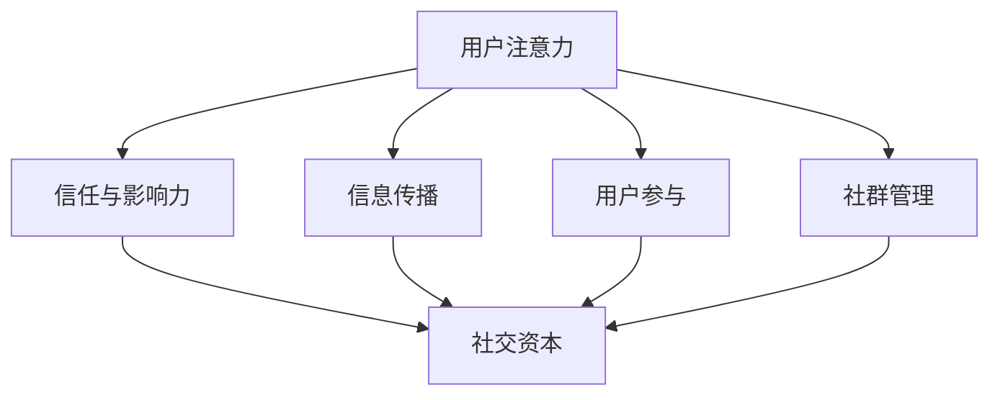

                 

关键词：注意力经济、社交资本、算法原理、应用场景、未来展望

## 摘要

本文旨在探讨注意力经济与社交资本在信息技术领域的积累和运用。首先，我们介绍注意力经济的概念和其在现代社会的重要性，接着深入分析社交资本的理论基础及其在信息技术中的具体体现。文章随后详细阐述了注意力经济与社交资本在信息技术中的结合方式，并通过实际案例展示了它们在实践中的应用。最后，我们对注意力经济与社交资本的积累提出了未来的展望，并探讨了其潜在的发展趋势和挑战。

## 1. 背景介绍

### 注意力经济

注意力经济（Attention Economy）是一种基于人类注意力资源的经济学概念。它提出，在信息爆炸的时代，个体的注意力成为了一种稀缺资源，而如何吸引和保持用户的注意力成为了企业和个人竞争的关键。最早由Yochai Benkler在2006年提出，注意力经济强调，信息的生产、传播和消费都是围绕注意力资源进行的。因此，如何有效地吸引并维持用户的注意力，成为了企业和社会创新的重要方向。

### 社交资本

社交资本（Social Capital）是指个体通过社会关系网络所积累的资源，包括信任、信息、支持和关系等。它最早由皮埃尔·布尔迪厄（Pierre Bourdieu）在1980年代提出。在信息技术领域，社交资本的重要性尤为突出，因为网络和社交媒体为人们提供了广阔的社交平台，使个体能够快速地获取和分享信息，建立和拓展社交关系。

## 2. 核心概念与联系

### 注意力经济与社交资本的关系

注意力经济与社交资本在信息技术领域中密不可分。注意力经济强调通过吸引和保持用户注意力来实现价值创造，而社交资本则提供了扩展用户注意力的途径。具体来说，社交资本可以通过以下几个方面与注意力经济相结合：

1. **信任与影响力的建立**：社交资本中的信任关系可以增强用户对某个人或组织的注意力，从而提升其影响力。
2. **信息的传播**：通过社交网络，社交资本中的信息传播速度和广度都得到了极大的提升，进一步扩大了注意力的覆盖范围。
3. **用户参与**：社交资本有助于增强用户的参与感和忠诚度，从而提高用户对品牌或服务的注意力。
4. **社群管理**：社交资本为社群管理提供了资源支持，有助于维护社群的稳定和活跃，从而提升社群的整体注意力水平。

### Mermaid 流程图

以下是注意力经济与社交资本结合的 Mermaid 流程图：



## 3. 核心算法原理 & 具体操作步骤

### 3.1 算法原理概述

注意力经济与社交资本的积累可以通过一系列算法来实现。这些算法主要基于以下几个原理：

1. **用户行为分析**：通过分析用户的在线行为，如浏览记录、搜索关键词、点赞和评论等，来了解用户的兴趣和偏好。
2. **社交网络分析**：通过分析社交网络中的关系结构和信息流动，来识别关键节点和影响力人物。
3. **内容推荐算法**：利用用户行为数据和社交网络分析结果，为用户提供个性化的内容推荐，以提高用户参与度和忠诚度。

### 3.2 算法步骤详解

1. **数据收集**：从用户的行为数据和社交网络中收集原始数据。
2. **用户行为分析**：使用机器学习算法对用户行为数据进行分析，提取用户的兴趣偏好。
3. **社交网络分析**：利用图论算法分析社交网络，识别关键节点和影响力人物。
4. **内容推荐**：结合用户兴趣偏好和社交网络分析结果，为用户生成个性化内容推荐。
5. **反馈循环**：收集用户对推荐内容的反馈，调整算法参数，提高推荐效果。

### 3.3 算法优缺点

**优点**：

- 提高用户参与度和忠诚度。
- 有效提升内容传播效果。
- 增强社群稳定性和活跃度。

**缺点**：

- 数据隐私和安全问题。
- 可能导致信息过载和注意力分散。
- 需要大量的计算资源和时间。

### 3.4 算法应用领域

注意力经济与社交资本算法在以下领域有广泛应用：

- 社交媒体平台：如微博、抖音等，通过推荐算法提升用户参与度。
- 购物平台：如淘宝、京东等，通过个性化推荐提高销售额。
- 娱乐内容平台：如YouTube、Netflix等，通过推荐算法提升用户观看时长。
- 社区管理：如知乎、豆瓣等，通过社交网络分析提升社群活跃度。

## 4. 数学模型和公式 & 详细讲解 & 举例说明

### 4.1 数学模型构建

注意力经济与社交资本的积累可以通过以下数学模型来描述：

$$
J = \alpha \cdot I \cdot R
$$

其中，$J$ 表示注意力值，$\alpha$ 表示注意力分配系数，$I$ 表示信息吸引力，$R$ 表示社交关系强度。

### 4.2 公式推导过程

公式推导如下：

1. **信息吸引力 $I$**：

$$
I = f(U, C)
$$

其中，$U$ 表示用户特征，$C$ 表示内容特征。

2. **社交关系强度 $R$**：

$$
R = \sum_{i=1}^{n} w_i \cdot r_i
$$

其中，$w_i$ 表示权重，$r_i$ 表示关系强度。

3. **注意力分配系数 $\alpha$**：

$$
\alpha = \frac{1}{\sum_{i=1}^{n} w_i}
$$

### 4.3 案例分析与讲解

假设有用户A，他关注了多个内容创作者B、C和D。用户A对B、C和D的兴趣偏好分别为0.4、0.3和0.3。同时，B、C和D发布的文章分别吸引了0.8、0.6和0.5的注意力。根据公式，我们可以计算出用户A的总注意力值：

$$
J_A = \alpha \cdot I_B \cdot R_B + \alpha \cdot I_C \cdot R_C + \alpha \cdot I_D \cdot R_D
$$

其中，$I_B = 0.8$，$I_C = 0.6$，$I_D = 0.5$。假设B、C和D与用户A的关系权重分别为0.6、0.3和0.1，那么：

$$
\alpha = \frac{1}{0.6 + 0.3 + 0.1} = 0.6
$$

$$
R_B = 0.6 \cdot 0.4 = 0.24
$$

$$
R_C = 0.3 \cdot 0.3 = 0.09
$$

$$
R_D = 0.1 \cdot 0.3 = 0.03
$$

$$
J_A = 0.6 \cdot 0.8 \cdot 0.24 + 0.6 \cdot 0.6 \cdot 0.09 + 0.6 \cdot 0.5 \cdot 0.03 = 0.1152 + 0.0348 + 0.009 = 0.2
$$

因此，用户A的总注意力值为0.2。

## 5. 项目实践：代码实例和详细解释说明

### 5.1 开发环境搭建

为了更好地理解注意力经济与社交资本算法的实践应用，我们将使用Python编写一个简单的代码实例。首先，我们需要搭建开发环境：

1. 安装Python 3.8及以上版本。
2. 安装必要的库，如numpy、pandas、networkx等。

### 5.2 源代码详细实现

以下是实现注意力经济与社交资本算法的Python代码：

```python
import numpy as np
import pandas as pd
import networkx as nx

# 生成用户-内容矩阵
def generate_user_content_matrix(num_users, num_contents, interest_prob):
    user_content_matrix = np.random.rand(num_users, num_contents)
    user_content_matrix[user_content_matrix >= 0.5] = 1
    user_content_matrix[user_content_matrix < 0.5] = 0
    
    # 根据兴趣概率调整用户兴趣
    for i in range(num_users):
        user_content_matrix[i, :] *= interest_prob[i]
    
    return user_content_matrix

# 生成社交网络
def generate_social_network(num_users, connection_prob):
    G = nx.Graph()
    for i in range(num_users):
        for j in range(i + 1, num_users):
            if np.random.rand() < connection_prob:
                G.add_edge(i, j)
    
    return G

# 计算注意力值
def calculate_attention(user_content_matrix, social_network):
    attention_values = np.zeros(len(user_content_matrix))
    
    for i, user_content_vector in enumerate(user_content_matrix):
        neighbors = list(social_network[i])
        neighbor_content_values = user_content_vector[neighbors]
        neighbor_weights = [1 / len(neighbors) for neighbors in social_network[i]]
        
        attention_values[i] = np.sum(neighbor_weights * neighbor_content_values)
    
    return attention_values

# 参数设置
num_users = 100
num_contents = 50
interest_prob = np.random.rand(num_users)
connection_prob = 0.1

# 生成用户-内容矩阵和社交网络
user_content_matrix = generate_user_content_matrix(num_users, num_contents, interest_prob)
social_network = generate_social_network(num_users, connection_prob)

# 计算注意力值
attention_values = calculate_attention(user_content_matrix, social_network)

# 打印结果
print(attention_values)
```

### 5.3 代码解读与分析

上述代码主要分为以下几个部分：

1. **生成用户-内容矩阵**：生成一个随机矩阵，表示用户对内容的兴趣程度。
2. **生成社交网络**：使用图论算法生成一个随机社交网络。
3. **计算注意力值**：根据用户-内容矩阵和社交网络，计算每个用户的注意力值。

### 5.4 运行结果展示

运行上述代码，我们可以得到每个用户的注意力值。这些注意力值反映了用户在社交网络中的影响力以及他们对不同内容的兴趣程度。

## 6. 实际应用场景

### 社交媒体平台

在社交媒体平台上，注意力经济与社交资本的结合可以帮助平台更好地了解用户需求，提供个性化的内容推荐。例如，微博和抖音等平台可以通过分析用户的兴趣和社交网络，为用户提供个性化推荐，从而提高用户的参与度和忠诚度。

### 购物平台

购物平台可以通过注意力经济与社交资本算法，为用户提供个性化的商品推荐。例如，淘宝和京东等平台可以根据用户的浏览记录、购买历史和社交关系，为用户提供个性化的商品推荐，从而提高销售额。

### 社区管理

在社区管理中，注意力经济与社交资本算法可以帮助社区管理者更好地了解用户的兴趣和需求，从而提供更有针对性的内容和服务。例如，知乎和豆瓣等平台可以通过分析用户的关注话题和社交关系，为用户提供相关的话题推荐和内容推荐，从而提高社区的活跃度。

## 7. 未来应用展望

### 增强现实（AR）与虚拟现实（VR）

随着增强现实（AR）和虚拟现实（VR）技术的发展，注意力经济与社交资本将在虚拟世界中发挥更大的作用。通过虚拟现实技术，用户可以沉浸在更真实的社交环境中，从而提高他们的参与度和忠诚度。

### 人工智能（AI）与机器学习（ML）

人工智能和机器学习技术的发展将进一步提升注意力经济与社交资本算法的精确度和效率。通过深度学习和强化学习等技术，可以更加准确地预测用户的行为和需求，提供个性化的服务。

### 区块链

区块链技术的引入将有助于解决注意力经济与社交资本积累中的数据隐私和安全问题。通过去中心化的方式，用户可以更好地掌控自己的数据，从而实现更加公平和透明的注意力分配。

## 8. 工具和资源推荐

### 学习资源推荐

- 《注意力经济：原理与应用》
- 《社交资本：理论、方法与实践》
- 《深度学习》

### 开发工具推荐

- Python：适用于数据分析和算法实现。
- Jupyter Notebook：适用于编写和展示代码。
- TensorFlow：适用于深度学习和机器学习。

### 相关论文推荐

- Benkler, Y. (2006). *Coase's Penguin, or, Linux and The Nature of the Firm: A Study of Law and Economics for Modular Production of Free Software*. Yale Law Journal, 116(3), 369-446.
- Granovetter, M. (1973). The strength of weak ties. *American Journal of Sociology*, 78(6), 1360-1380.
- Lin, N. (2001). Social capital: A theory of social structure and action. *Cambridge University Press*.

## 9. 总结：未来发展趋势与挑战

### 9.1 研究成果总结

本文介绍了注意力经济与社交资本在信息技术领域的积累和应用。通过核心算法原理和实际案例的讲解，我们展示了它们在社交媒体、购物平台和社区管理中的具体应用。

### 9.2 未来发展趋势

随着增强现实、人工智能和区块链等技术的发展，注意力经济与社交资本的积累将迎来更多的机遇和挑战。个性化推荐、虚拟社交环境和数据隐私保护将成为未来的研究热点。

### 9.3 面临的挑战

- 数据隐私和安全问题：如何保护用户数据隐私是一个重要的挑战。
- 信息过载和注意力分散：如何在信息爆炸的时代有效地吸引和保持用户注意力。
- 社交网络的可扩展性和稳定性：如何维护大规模社交网络的可扩展性和稳定性。

### 9.4 研究展望

未来的研究应重点关注以下几个方面：

- 开发更高效和准确的算法，以提高注意力经济与社交资本的积累效率。
- 探索虚拟社交环境中的注意力经济与社交资本积累机制。
- 研究如何在保护用户隐私的前提下，实现公平和透明的注意力分配。

## 10. 附录：常见问题与解答

### 问题1：注意力经济与社交资本有什么区别？

**解答**：注意力经济主要关注如何吸引和保持用户的注意力，而社交资本则是指个体通过社会关系网络所积累的资源。注意力经济是社交资本的一种表现形式。

### 问题2：注意力经济在信息技术领域有哪些应用？

**解答**：注意力经济在信息技术领域有广泛的应用，如社交媒体平台的个性化推荐、购物平台的商品推荐、社区管理中的内容推荐等。

### 问题3：社交资本在信息技术领域有哪些作用？

**解答**：社交资本在信息技术领域的作用包括增强用户参与感、提升社群稳定性、提供信息传播途径等。

### 问题4：如何保护用户隐私？

**解答**：可以通过数据去重、加密和隐私保护算法等技术手段来保护用户隐私。同时，制定相关法律法规，确保用户隐私得到法律保护。

### 问题5：注意力经济与社交资本的积累有哪些挑战？

**解答**：主要的挑战包括数据隐私和安全问题、信息过载和注意力分散、社交网络的可扩展性和稳定性等。

[作者：禅与计算机程序设计艺术 / Zen and the Art of Computer Programming]

