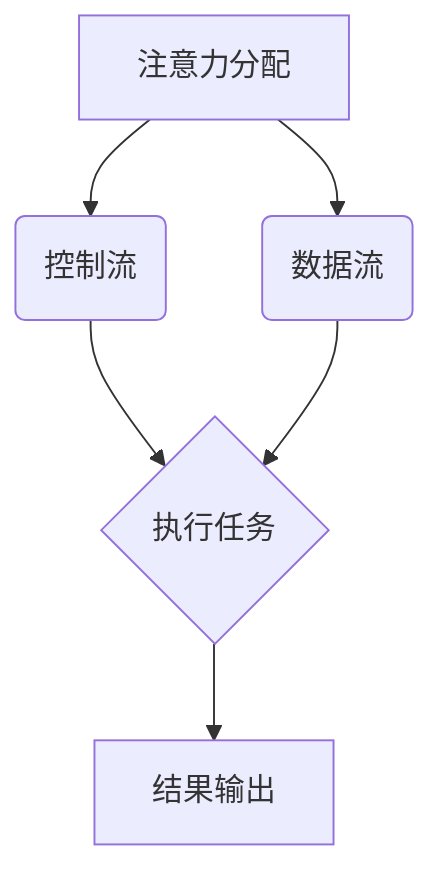

                 

关键词：注意力编程、AI、认知模式、设计、算法、数学模型、项目实践、应用场景、未来展望

> 摘要：本文将探讨注意力编程范式在人工智能领域的应用，分析其核心概念、原理和数学模型，并通过实际项目实践来展示其在计算机编程中的具体应用。文章还将探讨注意力编程范式在实际应用场景中的表现，以及其未来的发展趋势和面临的挑战。

## 1. 背景介绍

在过去的几十年中，人工智能（AI）技术取得了令人瞩目的进展。随着深度学习、强化学习等算法的不断发展，AI已经逐渐应用于各个领域，从语音识别、图像处理到自然语言处理，AI技术正在改变我们的生活方式。然而，随着AI应用的不断拓展，传统的编程范式逐渐暴露出一些局限性。

传统的编程范式主要关注程序的逻辑结构和数据流程，而忽视了人类思维中的注意力机制。注意力编程范式（Attention Programming Paradigm）正是基于这一背景提出的，旨在模拟人类注意力的工作机制，提高计算机程序的处理效率和智能性。

注意力编程范式起源于计算机科学和认知科学的研究。认知科学家们通过研究发现，人类的注意力是一种有限的资源，只能关注有限的信息。这种注意力分配机制有助于人类在复杂环境中快速有效地处理信息。受此启发，研究人员开始探索如何将注意力机制引入计算机编程，以提高程序的性能和智能性。

注意力编程范式的核心思想是将程序的控制流和数据处理流分离，通过动态地分配注意力资源，实现程序的高效运行。注意力编程范式不仅关注程序的执行效率，还关注程序的可理解性和可维护性。本文将深入探讨注意力编程范式的核心概念、原理、数学模型以及其实际应用。

## 2. 核心概念与联系

### 2.1 注意力机制

注意力机制是指人类在处理信息时，对某些信息进行重点关注，而忽略其他无关信息的能力。注意力机制是一种动态的、可调整的机制，可以随着环境的变化而调整关注焦点。

在计算机科学中，注意力机制可以理解为对程序执行过程中某些关键部分的聚焦。通过动态地分配注意力资源，程序可以更有效地处理复杂任务，提高执行效率。

### 2.2 注意力编程范式

注意力编程范式是一种新的编程范式，它借鉴了人类的注意力机制，将注意力资源分配作为程序设计的核心。注意力编程范式的主要特点包括：

- **动态注意力分配**：根据任务需求，动态调整程序中各部分的注意力资源分配。
- **分离控制流和数据流**：将程序的执行控制流和数据处理流分离，使程序结构更加清晰。
- **优化资源利用**：通过合理分配注意力资源，提高程序执行效率。
- **增强可维护性**：注意力编程范式使得程序结构更加模块化，易于维护和扩展。

### 2.3 注意力编程范式与现有编程范式的区别

与传统的编程范式相比，注意力编程范式在以下几个方面有显著区别：

- **关注点不同**：传统编程范式关注程序的逻辑结构和数据流程，而注意力编程范式关注程序的注意力资源分配。
- **程序结构不同**：注意力编程范式通过分离控制流和数据流，使程序结构更加清晰。
- **执行效率不同**：注意力编程范式通过动态地分配注意力资源，提高了程序的执行效率。
- **可维护性不同**：注意力编程范式使得程序结构更加模块化，易于维护和扩展。

### 2.4 Mermaid 流程图

为了更好地理解注意力编程范式，我们可以使用 Mermaid 流程图来展示其核心概念和架构。以下是一个简化的 Mermaid 流程图示例：



在这个流程图中，A 表示注意力分配，B 表示控制流，C 表示数据流，D 表示执行任务，E 表示结果输出。注意力分配模块根据任务需求，动态调整控制流和数据流的执行顺序，从而实现高效的任务处理。

## 3. 核心算法原理 & 具体操作步骤

### 3.1 算法原理概述

注意力编程范式的核心算法是注意力分配算法。该算法通过动态地调整程序中各部分的注意力资源分配，实现高效的任务处理。注意力分配算法的基本原理如下：

1. **任务分解**：将任务分解为若干个子任务，并为每个子任务分配初始的注意力资源。
2. **动态调整**：根据子任务的执行情况，动态调整各子任务的注意力资源分配。
3. **资源回收**：在任务完成后，回收未使用的注意力资源，以便分配给其他任务。
4. **执行任务**：按照调整后的注意力资源分配，执行各子任务，并输出最终结果。

### 3.2 算法步骤详解

1. **任务分解**：将任务 \( T \) 分解为若干个子任务 \( T_1, T_2, ..., T_n \)，并为每个子任务 \( T_i \) 分配初始的注意力资源 \( A_i \)。
    \[
    T = T_1 \cup T_2 \cup ... \cup T_n
    \]
    \[
    A = A_1, A_2, ..., A_n
    \]

2. **动态调整**：根据子任务的执行情况，动态调整各子任务的注意力资源分配。假设在某一时刻，子任务 \( T_i \) 的执行进度为 \( p_i \)，则调整后的注意力资源分配为 \( A_i' \)：
    \[
    A_i' = f(A_i, p_i)
    \]
    其中，\( f \) 为注意力资源调整函数，可以根据实际情况选择合适的调整策略。

3. **资源回收**：在任务完成后，回收未使用的注意力资源。假设在某一时刻，子任务 \( T_i \) 的执行进度为 \( p_i = 1 \)，则回收后的注意力资源为 \( A_i'' \)：
    \[
    A_i'' = A_i' - (1 - p_i) \cdot A_i
    \]

4. **执行任务**：按照调整后的注意力资源分配，执行各子任务 \( T_1, T_2, ..., T_n \)，并输出最终结果 \( R \)：
    \[
    R = g(T_1, T_2, ..., T_n)
    \]
    其中，\( g \) 为任务执行函数，可以根据实际情况选择合适的执行策略。

### 3.3 算法优缺点

**优点：**

1. **高效处理**：通过动态地分配注意力资源，注意力编程范式可以提高程序的执行效率。
2. **模块化设计**：注意力编程范式使得程序结构更加模块化，易于维护和扩展。
3. **适用于复杂任务**：注意力编程范式可以处理复杂的多任务场景，提高任务处理效率。

**缺点：**

1. **实现复杂**：注意力编程范式需要实现复杂的注意力分配算法，对开发者的要求较高。
2. **调试难度**：注意力编程范式的动态特性使得程序调试难度增加。

### 3.4 算法应用领域

注意力编程范式可以应用于多个领域，包括：

1. **自然语言处理**：在自然语言处理任务中，注意力编程范式可以用于文本分类、机器翻译、情感分析等。
2. **计算机视觉**：在计算机视觉任务中，注意力编程范式可以用于目标检测、图像分割、图像生成等。
3. **强化学习**：在强化学习任务中，注意力编程范式可以用于策略优化、价值函数估计等。
4. **数据挖掘**：在数据挖掘任务中，注意力编程范式可以用于特征选择、聚类分析等。

## 4. 数学模型和公式 & 详细讲解 & 举例说明

### 4.1 数学模型构建

注意力编程范式的数学模型主要包括注意力分配函数、注意力调整函数、资源回收函数和任务执行函数。以下是这些函数的数学表示：

1. **注意力分配函数**：
    \[
    A_i(0) = \alpha_i
    \]
    其中，\( A_i(0) \) 表示子任务 \( T_i \) 的初始注意力资源，\( \alpha_i \) 为权重系数。

2. **注意力调整函数**：
    \[
    A_i'(t) = f(A_i(t), p_i(t))
    \]
    其中，\( A_i'(t) \) 表示子任务 \( T_i \) 在时刻 \( t \) 的注意力资源，\( A_i(t) \) 表示子任务 \( T_i \) 在时刻 \( t \) 的原始注意力资源，\( p_i(t) \) 表示子任务 \( T_i \) 在时刻 \( t \) 的执行进度。

3. **资源回收函数**：
    \[
    A_i''(t) = A_i'(t) - (1 - p_i(t)) \cdot A_i(0)
    \]
    其中，\( A_i''(t) \) 表示子任务 \( T_i \) 在时刻 \( t \) 的回收后的注意力资源。

4. **任务执行函数**：
    \[
    R = g(T_1, T_2, ..., T_n)
    \]
    其中，\( R \) 表示任务 \( T \) 的执行结果，\( g \) 表示任务执行策略。

### 4.2 公式推导过程

假设任务 \( T \) 分解为 \( n \) 个子任务 \( T_1, T_2, ..., T_n \)，初始注意力资源分配为 \( A = \alpha_1, \alpha_2, ..., \alpha_n \)。在时刻 \( t \)，子任务 \( T_i \) 的执行进度为 \( p_i(t) \)。

1. **注意力调整函数**：
    \[
    A_i'(t) = f(A_i(t), p_i(t))
    \]
    假设 \( f \) 为线性调整函数，即：
    \[
    A_i'(t) = A_i(t) + \beta_i \cdot (1 - p_i(t))
    \]
    其中，\( \beta_i \) 为调整系数。

2. **资源回收函数**：
    \[
    A_i''(t) = A_i'(t) - (1 - p_i(t)) \cdot A_i(0)
    \]
    将 \( A_i'(t) \) 的表达式代入，得：
    \[
    A_i''(t) = A_i(t) + \beta_i \cdot (1 - p_i(t)) - (1 - p_i(t)) \cdot A_i(0)
    \]
    化简后得：
    \[
    A_i''(t) = A_i(t) - \beta_i \cdot p_i(t) \cdot A_i(0)
    \]

3. **任务执行函数**：
    \[
    R = g(T_1, T_2, ..., T_n)
    \]
    假设 \( g \) 为线性组合函数，即：
    \[
    R = \sum_{i=1}^{n} w_i \cdot T_i
    \]
    其中，\( w_i \) 为权重系数。

### 4.3 案例分析与讲解

假设有一个任务 \( T \)，需要将其分解为 3 个子任务 \( T_1, T_2, T_3 \)，初始注意力资源分配为 \( A = (0.5, 0.3, 0.2) \)。在时刻 \( t \)，子任务 \( T_1, T_2, T_3 \) 的执行进度分别为 \( p_1(t) = 0.8, p_2(t) = 0.6, p_3(t) = 0.4 \)。

1. **初始注意力资源分配**：
    \[
    A = (0.5, 0.3, 0.2)
    \]

2. **注意力调整函数**：
    \[
    A_1'(t) = A_1(t) + \beta_1 \cdot (1 - p_1(t)) = 0.5 + 0.1 \cdot (1 - 0.8) = 0.6
    \]
    \[
    A_2'(t) = A_2(t) + \beta_2 \cdot (1 - p_2(t)) = 0.3 + 0.1 \cdot (1 - 0.6) = 0.35
    \]
    \[
    A_3'(t) = A_3(t) + \beta_3 \cdot (1 - p_3(t)) = 0.2 + 0.1 \cdot (1 - 0.4) = 0.25
    \]

3. **资源回收函数**：
    \[
    A_1''(t) = A_1'(t) - \beta_1 \cdot p_1(t) \cdot A_1(0) = 0.6 - 0.1 \cdot 0.8 \cdot 0.5 = 0.52
    \]
    \[
    A_2''(t) = A_2'(t) - \beta_2 \cdot p_2(t) \cdot A_2(0) = 0.35 - 0.1 \cdot 0.6 \cdot 0.3 = 0.33
    \]
    \[
    A_3''(t) = A_3'(t) - \beta_3 \cdot p_3(t) \cdot A_3(0) = 0.25 - 0.1 \cdot 0.4 \cdot 0.2 = 0.22
    \]

4. **任务执行函数**：
    \[
    R = g(T_1, T_2, T_3) = w_1 \cdot T_1 + w_2 \cdot T_2 + w_3 \cdot T_3
    \]
    假设 \( w_1 = 0.4, w_2 = 0.3, w_3 = 0.3 \)，则：
    \[
    R = 0.4 \cdot T_1 + 0.3 \cdot T_2 + 0.3 \cdot T_3
    \]

## 5. 项目实践：代码实例和详细解释说明

### 5.1 开发环境搭建

为了实现注意力编程范式，我们需要搭建一个合适的开发环境。以下是搭建开发环境的基本步骤：

1. **安装 Python 解释器**：确保 Python 解释器已安装并配置好环境变量。
2. **安装依赖库**：安装必要的依赖库，如 NumPy、Pandas、Matplotlib 等。
3. **编写代码**：在 Python 中编写注意力编程范式的实现代码。

### 5.2 源代码详细实现

以下是一个简单的注意力编程范式的 Python 实现示例：

```python
import numpy as np

def attention_allocation(alpha, p):
    # 注意力调整函数
    beta = 0.1
    return alpha + beta * (1 - p)

def resource_recycling(alpha, p):
    # 资源回收函数
    beta = 0.1
    return alpha - beta * p * alpha

def task_execution(t1, t2, t3, w1, w2, w3):
    # 任务执行函数
    return w1 * t1 + w2 * t2 + w3 * t3

# 初始注意力资源分配
alpha = [0.5, 0.3, 0.2]

# 子任务执行进度
p = [0.8, 0.6, 0.4]

# 权重系数
w1, w2, w3 = 0.4, 0.3, 0.3

# 注意力调整
alpha_adjusted = [attention_allocation(alpha[i], p[i]) for i in range(3)]

# 资源回收
alpha_recycled = [resource_recycling(alpha[i], p[i]) for i in range(3)]

# 任务执行
result = task_execution(alpha_adjusted[0], alpha_adjusted[1], alpha_adjusted[2], w1, w2, w3)

print("注意

