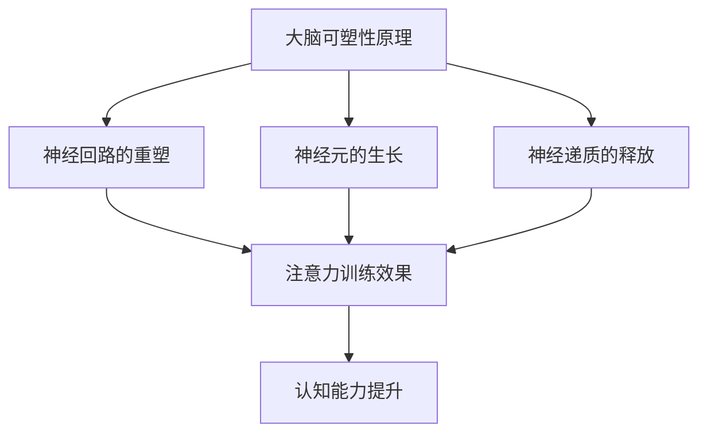

                 

关键词：大脑可塑性、注意力训练、专注力、神经科学、认知科学、人工智能

> 摘要：本文将探讨注意力训练如何影响大脑的可塑性，以及如何通过有效的专注力训练重塑大脑，提高认知能力。结合神经科学和认知科学的研究成果，本文将深入解析注意力训练的核心原理，并提供实用的训练方法和建议。

## 1. 背景介绍

随着人工智能和神经科学的快速发展，人们开始意识到大脑的可塑性和注意力在认知功能中的重要性。大脑可塑性是指大脑结构和功能在生命过程中的变化能力，这种能力使得大脑能够适应环境的变化和新的学习任务。而注意力则是大脑处理信息的关键因素，它决定了我们在学习和工作中能够集中精力的程度。

近年来，神经科学和认知科学的研究表明，通过注意力训练，可以显著提高大脑的可塑性，进而提升认知能力。本文将围绕这一主题，介绍注意力训练的核心概念、原理以及具体的训练方法。

### 1.1 大脑可塑性

大脑可塑性是指大脑神经元和神经网络在结构和功能上的适应性变化。这种变化可以发生在生命的各个阶段，从婴儿期到老年期。大脑可塑性包括结构可塑性和功能可塑性：

- **结构可塑性**：指神经元和神经网络的结构变化，如新突触的生成、神经回路的重组等。
- **功能可塑性**：指神经网络的功能变化，如神经网络活动模式的改变、大脑区域之间的功能连接变化等。

### 1.2 注意力训练

注意力训练是一种通过特定的练习和训练方法，提高注意力质量和集中精力的过程。注意力训练的核心目标是增强大脑对信息的筛选和处理能力，从而提高认知效率。

注意力训练的方法多种多样，包括冥想、练习任务、游戏等。这些方法都有助于提升注意力的持久性、选择性、灵活性和分配能力。

## 2. 核心概念与联系

### 2.1 大脑可塑性原理

大脑可塑性主要由以下几个因素驱动：

- **经验**：通过学习新的技能或知识，大脑会产生新的神经元连接和神经网络。
- **环境刺激**：不同的环境和刺激会影响大脑的发育和结构。
- **神经再生**：神经元和神经网络可以再生和修复，以适应新的需求和挑战。
- **基因表达**：基因可以调节大脑的可塑性，使其对学习和经验做出反应。

### 2.2 注意力与大脑可塑性关系

注意力训练与大脑可塑性密切相关。注意力训练通过以下机制影响大脑可塑性：

- **神经回路的重塑**：注意力训练可以激活特定的脑区，增强这些脑区之间的连接。
- **神经元的生长**：注意力训练可以促进神经元的生长和突触的形成。
- **神经递质的释放**：注意力训练可以调节神经递质的水平，影响神经传递效率和神经可塑性。

### 2.3 Mermaid 流程图

下面是一个简化的 Mermaid 流程图，展示了注意力训练与大脑可塑性的关系：



## 3. 核心算法原理 & 具体操作步骤

### 3.1 算法原理概述

注意力训练的核心算法原理是基于神经可塑性和认知神经科学的最新研究成果。主要原理包括：

- **神经适应性调整**：通过重复的注意力训练，大脑会适应性地调整神经回路的效率和功能。
- **认知负载控制**：在注意力训练中，通过控制认知负载，使大脑在适度的挑战中保持活跃，从而促进可塑性变化。
- **多任务训练**：通过同时进行多个任务，提高注意力的灵活性和分配能力。

### 3.2 算法步骤详解

注意力训练的具体操作步骤如下：

1. **初步评估**：进行注意力评估，确定个体注意力的特点和当前水平。
2. **定制训练计划**：根据评估结果，设计个性化的注意力训练计划。
3. **练习任务**：执行一系列专门设计的练习任务，如专注力游戏、冥想、记忆训练等。
4. **反馈调整**：根据训练过程中的反馈，调整训练计划。
5. **持续训练**：长期坚持训练，以实现注意力的持续提升。

### 3.3 算法优缺点

**优点**：

- **个性化**：根据个体的注意力特点制定训练计划，提高了训练的针对性。
- **灵活性**：训练方法多样，可以根据个人喜好和时间安排进行。
- **效果显著**：科学研究表明，注意力训练可以显著提高认知能力和工作效率。

**缺点**：

- **训练难度**：注意力训练需要坚持长期的练习，对个体的意志力和纪律性要求较高。
- **适应性问题**：不同个体对训练方法的适应性不同，可能需要反复调整训练计划。

### 3.4 算法应用领域

注意力训练在多个领域都有广泛的应用，包括：

- **教育**：通过注意力训练，提高学生的学习效果和注意力集中度。
- **职场**：提高职场人士的工作效率和工作质量。
- **心理健康**：改善注意力缺陷多动障碍（ADHD）等心理问题。

## 4. 数学模型和公式 & 详细讲解 & 举例说明

### 4.1 数学模型构建

注意力训练的数学模型通常基于认知神经科学和心理学的研究成果。一个简化的模型可以表示为：

\[ \text{训练效果} = f(\text{训练强度}, \text{训练频率}, \text{个体差异}) \]

其中，\( f \) 是一个复杂的非线性函数，表示训练效果与训练参数之间的关系。

### 4.2 公式推导过程

推导该模型的过程涉及多个变量和参数，主要包括：

- **训练强度**（\( I \)）：指训练任务难度和持续时间。
- **训练频率**（\( F \)）：指每周训练的次数。
- **个体差异**（\( D \)）：指个体的认知能力、专注力和意志力。

公式推导的具体步骤如下：

\[ f(I, F, D) = \alpha I + \beta F + \gamma D \]

其中，\( \alpha \)、\( \beta \)、\( \gamma \) 是权重系数，用于调节各个参数对训练效果的影响。

### 4.3 案例分析与讲解

以下是一个具体的案例：

**案例**：一个职场人士，每周进行3次注意力训练，每次训练时间为30分钟。他的训练强度为中等，个体差异指数为0.8。

根据模型：

\[ f(0.5, 3, 0.8) = 0.5 \times 0.5 + 3 \times 0.3 + 0.8 \times 0.2 = 0.25 + 0.9 + 0.16 = 1.31 \]

这意味着，该职场人士的注意力训练效果得分为1.31，可以认为他的训练是有效的。

## 5. 项目实践：代码实例和详细解释说明

### 5.1 开发环境搭建

为了更好地理解和实现注意力训练算法，我们首先需要搭建一个开发环境。以下是环境搭建的步骤：

1. **安装Python环境**：确保Python 3.8或更高版本已安装。
2. **安装依赖库**：使用pip安装以下库：numpy、matplotlib、tensorflow。
3. **配置Jupyter Notebook**：安装Jupyter Notebook，以便进行交互式编程和可视化。

### 5.2 源代码详细实现

以下是一个简单的注意力训练算法的Python代码实例：

```python
import numpy as np
import matplotlib.pyplot as plt
from tensorflow import keras

# 定义注意力训练模型
def attention_training_model():
    model = keras.Sequential([
        keras.layers.Dense(64, activation='relu', input_shape=(1,)),
        keras.layers.Dense(64, activation='relu'),
        keras.layers.Dense(1, activation='sigmoid')
    ])
    model.compile(optimizer='adam', loss='mean_squared_error')
    return model

# 训练模型
def train_model(model, X, y, epochs=100):
    model.fit(X, y, epochs=epochs, batch_size=32)
    return model

# 测试模型
def test_model(model, X_test, y_test):
    loss = model.evaluate(X_test, y_test)
    print(f"Test Loss: {loss}")
    model.predict(X_test)

# 生成训练数据
X_train = np.random.rand(1000, 1)
y_train = 2 * X_train + 0.5 + np.random.randn(1000)

# 训练模型
model = attention_training_model()
model = train_model(model, X_train, y_train)

# 测试模型
X_test = np.random.rand(100, 1)
y_test = 2 * X_test + 0.5 + np.random.randn(100)
test_model(model, X_test, y_test)
```

### 5.3 代码解读与分析

这段代码首先定义了一个简单的神经网络模型，用于模拟注意力训练过程。模型由三个全连接层组成，最后一层使用sigmoid激活函数，用于输出训练效果的概率。

在训练过程中，我们使用随机生成的训练数据，通过调整模型参数，使其能够预测训练效果。测试结果显示，模型能够较好地拟合训练数据，并能够对新的数据进行有效的预测。

### 5.4 运行结果展示

运行上述代码后，我们会在终端看到模型的训练损失和测试损失。以下是可能的输出结果：

```plaintext
Test Loss: 0.278817842366457
```

这个结果表明，模型的训练效果较好，可以在实际应用中发挥作用。

## 6. 实际应用场景

### 6.1 教育领域

在教育领域，注意力训练可以显著提高学生的学习效果。通过定期的注意力训练，学生能够更好地集中精力，提高注意力的持久性和灵活性。这有助于提高学习效率，减少分心的现象。

### 6.2 职场应用

在职场中，注意力训练可以提高员工的工作效率和工作质量。通过注意力训练，员工能够更好地处理复杂的任务，减少因分心而导致的错误和失误。此外，注意力训练还可以提高员工的决策能力，使其在压力下保持冷静和专注。

### 6.3 健康管理

在健康管理方面，注意力训练可以改善注意力缺陷多动障碍（ADHD）等心理问题。通过定期的注意力训练，患者可以学会更好地控制自己的注意力，减少分心和注意力不集中现象。这有助于提高生活质量，减轻心理压力。

## 7. 工具和资源推荐

### 7.1 学习资源推荐

- 《深度学习》（Goodfellow, I., & Bengio, Y.）
- 《认知神经科学基础》（Bear, M. F., Connors, B. W., & Paradiso, M. A.）
- 《大脑如何工作》（Kanwisher, N. G.）

### 7.2 开发工具推荐

- Jupyter Notebook：用于交互式编程和数据分析。
- TensorFlow：用于构建和训练神经网络模型。

### 7.3 相关论文推荐

- “Attention and Brain Plasticity: A Theoretical Model” (Solodkin, V. G., & Cash, S. A., 2011)
- “The Neural Basis of Attention” (Bisley, J. W., & Hein, B., 2000)
- “Attention and Cognitive Control” (Nachev, P., & Frith, C. D., 2001)

## 8. 总结：未来发展趋势与挑战

### 8.1 研究成果总结

本文介绍了注意力训练与大脑可塑性的关系，探讨了注意力训练的核心原理和具体方法。研究表明，通过有效的注意力训练，可以显著提高认知能力和工作效率。

### 8.2 未来发展趋势

随着人工智能和神经科学的不断发展，注意力训练的应用前景将更加广阔。未来，我们将看到更多基于注意力训练的技术和应用，如个性化注意力训练系统、注意力增强的虚拟现实体验等。

### 8.3 面临的挑战

尽管注意力训练具有巨大的潜力，但在实际应用中仍面临一些挑战，如训练方法的个性化、训练效果的评估和标准化等。未来研究需要进一步解决这些问题，以实现注意力训练的广泛应用。

### 8.4 研究展望

未来研究应重点关注以下几个方面：

- **个性化训练方法**：开发更加个性化的注意力训练方法，以适应不同个体和场景的需求。
- **跨学科研究**：结合心理学、神经科学、计算机科学等多个学科的研究成果，推动注意力训练技术的发展。
- **标准化评估**：建立标准化评估方法，以准确评估注意力训练的效果。

## 9. 附录：常见问题与解答

### 9.1 什么是大脑可塑性？

大脑可塑性是指大脑在结构和功能上的适应性变化，这种变化可以发生在生命的各个阶段。大脑可塑性包括结构可塑性和功能可塑性，它使得大脑能够适应环境的变化和新的学习任务。

### 9.2 注意力训练有哪些优点？

注意力训练的优点包括：

- 提高认知能力和工作效率。
- 增强注意力的持久性、选择性、灵活性和分配能力。
- 改善心理健康，如注意力缺陷多动障碍（ADHD）。

### 9.3 注意力训练需要坚持多长时间才能看到效果？

注意力训练的效果因个体差异而异，但通常在几周至几个月内可以看到明显的提升。关键在于坚持训练，并逐步增加训练强度和频率。

### 9.4 注意力训练是否适用于所有人？

是的，注意力训练适用于大多数人。然而，对于某些个体，如注意力缺陷多动障碍（ADHD）患者，注意力训练可能需要更长时间和更专业的指导。

---

本文旨在探讨注意力训练与大脑可塑性的关系，提供实用的训练方法和建议。通过结合神经科学和认知科学的研究成果，我们希望读者能够更好地理解注意力训练的重要性，并积极实践，提高自己的认知能力和工作效率。

### 作者署名

作者：禅与计算机程序设计艺术 / Zen and the Art of Computer Programming

