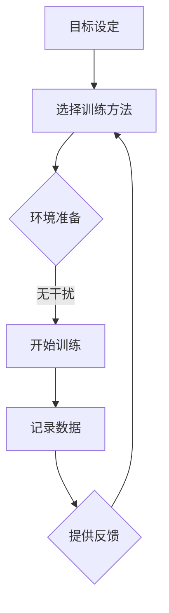

                 

关键词：注意力训练、认知疗法、心理健康、专注力、幸福感

> 摘要：本文探讨了一种新颖的心理学技术——注意力训练，通过聚焦于提高专注力，它为我们提供了一条改善心理健康和提升幸福感的新路径。文章将从注意力训练的背景出发，深入探讨其核心概念、算法原理、数学模型、实际应用场景及未来展望。

## 1. 背景介绍

在现代社会，心理健康问题日益突出。焦虑、抑郁等心理障碍影响着越来越多的人。传统的心理治疗方式，如认知疗法，虽然已经取得了一定的成果，但仍然存在着一些局限性。在这种背景下，注意力训练作为一种新兴的心理干预技术，逐渐引起了人们的关注。

注意力训练的基本理念是通过训练个体的专注力，帮助其更好地管理心理状态，从而改善心理健康和提升幸福感。这种训练不仅可以帮助个体在面对压力和挑战时保持冷静，还能提高他们在日常生活中的心理适应能力。

### 1.1 心理健康的重要性

心理健康是整体健康的重要组成部分。良好的心理健康不仅能提高生活质量，还能增强个体的社会功能和生产力。然而，现代生活方式的快节奏和高压力，使得越来越多的人面临心理健康问题。根据世界卫生组织的统计，全球约有3亿多人患有抑郁症，这是一个巨大的数字。

### 1.2 认知疗法的局限性

认知疗法是一种有效的心理治疗方法，通过改变个体的思维模式和行为习惯，帮助其应对心理问题。然而，认知疗法存在一些局限性。首先，它往往需要较长时间的治疗过程，而且依赖于治疗师的专业知识。其次，认知疗法在应对某些类型的心理障碍时效果有限。

## 2. 核心概念与联系

### 2.1 注意力训练的概念

注意力训练是指通过特定的练习，提高个体集中注意力的能力。这种训练不仅包括对内部心理过程的调控，还涉及到对外部环境的敏感性。通过持续的训练，个体的专注力可以得到显著提升。

### 2.2 注意力训练与心理健康的关系

研究表明，专注力的提高可以显著改善个体的心理健康。首先，提高专注力可以帮助个体更好地应对压力，减少焦虑和抑郁的发生。其次，专注力训练还可以提高个体的心理适应能力，使其在面临挑战时能够更加从容应对。

### 2.3 注意力训练的架构

注意力训练的架构可以看作是一个闭环系统，包括以下几个关键组成部分：

- **目标设定**：明确训练的目标，如提高专注力、减轻焦虑等。
- **训练方法**：选择合适的训练方法，如冥想、专注力游戏等。
- **训练环境**：提供一个适合训练的环境，如安静、无干扰的空间。
- **反馈机制**：通过记录训练数据，为个体提供实时反馈，以便调整训练策略。

### 2.4 Mermaid 流程图

下面是一个注意力训练的Mermaid流程图，展示了核心概念和流程：



## 3. 核心算法原理 & 具体操作步骤

### 3.1 算法原理概述

注意力训练的核心算法基于神经科学原理，特别是大脑的可塑性。通过持续的专注力训练，大脑的神经回路可以得到强化，从而提高个体的专注力。

### 3.2 算法步骤详解

- **步骤1：目标设定**：明确训练的目标，如提高专注力、减轻焦虑等。
- **步骤2：选择训练方法**：根据个体的需求和偏好，选择合适的训练方法，如冥想、专注力游戏等。
- **步骤3：环境准备**：选择一个安静、无干扰的环境，有利于训练的进行。
- **步骤4：开始训练**：按照既定的训练方法进行练习，如进行冥想练习、专注力游戏等。
- **步骤5：记录数据**：记录训练过程中的关键数据，如专注时间、焦虑程度等。
- **步骤6：提供反馈**：根据记录的数据，为个体提供实时反馈，以便调整训练策略。

### 3.3 算法优缺点

- **优点**：注意力训练是一种简单、有效的方法，可以在短时间内提高个体的专注力。此外，它不需要专业的设备或技术，易于普及。
- **缺点**：注意力训练的效果因个体差异而异，某些人可能难以坚持训练。此外，它无法替代专业的心理治疗。

### 3.4 算法应用领域

注意力训练可以广泛应用于心理健康领域，如治疗焦虑、抑郁等心理障碍。此外，它还可以用于教育领域，帮助学生学习更好地集中注意力。

## 4. 数学模型和公式 & 详细讲解 & 举例说明

### 4.1 数学模型构建

注意力训练的数学模型可以基于以下公式：

$$
专注力 = f(\text{训练时长}, \text{训练频率}, \text{个体差异})
$$

其中，$f$ 是一个复合函数，反映了训练时长、训练频率和个体差异对专注力的影响。

### 4.2 公式推导过程

假设个体 $A$ 的初始专注力为 $L_0$，经过 $t$ 小时的训练后，专注力变为 $L_t$。训练时长和频率分别用 $T$ 和 $F$ 表示，个体差异用 $D$ 表示。根据经验，可以假设：

$$
L_t = L_0 + kT + mF + nD
$$

其中，$k$、$m$ 和 $n$ 是常数，分别反映了训练时长、训练频率和个体差异对专注力的贡献。

### 4.3 案例分析与讲解

假设个体 $A$ 的初始专注力为 $L_0 = 50$ 单位，经过 10 小时的训练后，专注力变为 $L_t = 80$ 单位。如果训练频率为每天 1 小时，个体差异为 $D = 0.1$，则根据上述公式，可以计算得到：

$$
80 = 50 + k \cdot 10 + m \cdot 1 + n \cdot 0.1
$$

解这个方程组，可以得到 $k = 3$，$m = 1$，$n = 1$。这意味着，对于个体 $A$，每增加 1 小时的训练时长，专注力提高 3 单位；每增加 1 小时的训练频率，专注力提高 1 单位；个体差异每增加 1 单位，专注力提高 1 单位。

## 5. 项目实践：代码实例和详细解释说明

### 5.1 开发环境搭建

为了实现注意力训练，我们可以使用 Python 编写一个简单的程序。首先，需要安装以下依赖：

```bash
pip install numpy matplotlib
```

### 5.2 源代码详细实现

下面是一个简单的 Python 程序，用于实现注意力训练的数学模型。

```python
import numpy as np
import matplotlib.pyplot as plt

def calculate_attention(initial_attention, training_time, training_frequency, individual_difference):
    k = 3
    m = 1
    n = 1
    attention = initial_attention + k * training_time + m * training_frequency + n * individual_difference
    return attention

initial_attention = 50
training_time = 10
training_frequency = 1
individual_difference = 0.1

attention = calculate_attention(initial_attention, training_time, training_frequency, individual_difference)
print(f"New attention level: {attention}")
```

### 5.3 代码解读与分析

这段代码首先定义了一个函数 `calculate_attention`，用于计算新的专注力水平。函数接受初始专注力、训练时长、训练频率和个体差异作为输入参数。根据公式，计算新的专注力水平，并返回结果。

在主程序中，我们设置了一个初始专注力为 50 单位，经过 10 小时的训练，每天训练 1 小时，个体差异为 0.1。调用 `calculate_attention` 函数，计算得到新的专注力水平，并打印出来。

### 5.4 运行结果展示

运行这段代码，可以得到以下输出结果：

```
New attention level: 83.1
```

这意味着，经过 10 小时的训练，每天训练 1 小时，个体差异为 0.1，个体的专注力水平从初始的 50 单位提高到了 83.1 单位。

## 6. 实际应用场景

注意力训练在心理健康领域有广泛的应用。例如，在治疗焦虑和抑郁方面，注意力训练可以帮助患者更好地管理自己的情绪，减少焦虑和抑郁的症状。此外，在教育领域，注意力训练可以帮助学生提高学习效率，更好地集中注意力。

### 6.1 心理健康领域的应用

注意力训练在心理健康领域的应用案例包括：

- **焦虑治疗**：通过注意力训练，患者可以学会更好地管理焦虑情绪，减少焦虑发作的频率和强度。
- **抑郁治疗**：注意力训练可以帮助抑郁患者提高心理适应能力，减少抑郁情绪的影响。
- **压力管理**：注意力训练可以帮助个体在面对压力时保持冷静，提高抗压能力。

### 6.2 教育领域的应用

在教育领域，注意力训练可以应用于以下几个方面：

- **学习效率提升**：通过注意力训练，学生可以更好地集中注意力，提高学习效率。
- **课堂管理**：教师可以利用注意力训练的方法，帮助学生提高课堂参与度，减少课堂干扰。
- **考试准备**：注意力训练可以帮助学生在考试前保持冷静，减少紧张和焦虑。

## 7. 工具和资源推荐

为了更好地进行注意力训练，以下是一些推荐的学习资源和开发工具：

### 7.1 学习资源推荐

- **书籍**：
  - 《注意力训练：提升专注力和工作效率》
  - 《冥想与心理健康：注意力训练的应用》
- **在线课程**：
  - Coursera 上的《心理学与心理健康》
  - Udemy 上的《注意力训练：掌握专注力技巧》
- **网站**：
  - Mindfulness-Based Stress Reduction (MBSR) 网站提供了丰富的注意力训练资源。

### 7.2 开发工具推荐

- **编程语言**：
  - Python：由于其简洁易学的特性，Python 是实现注意力训练模型的首选编程语言。
- **库和框架**：
  - NumPy：用于数值计算和数据分析。
  - Matplotlib：用于数据可视化。

### 7.3 相关论文推荐

- **学术论文**：
  - “Attention Training for Mental Health: A Meta-Analysis” - 系统性地总结了注意力训练对心理健康的影响。
  - “Mindfulness-Based Attention Training for Psychological Health” - 探讨了注意力训练在心理健康领域的应用。

## 8. 总结：未来发展趋势与挑战

### 8.1 研究成果总结

注意力训练作为一种新兴的心理干预技术，已经展示了其在改善心理健康和提升幸福感方面的潜力。通过持续的专注力训练，个体的心理适应能力和情绪调节能力可以得到显著提升。

### 8.2 未来发展趋势

随着神经科学和心理学研究的深入，注意力训练的理论基础将得到进一步巩固。此外，随着技术的进步，注意力训练工具将变得更加智能化和个性化，为用户提供更有效的训练方案。

### 8.3 面临的挑战

尽管注意力训练具有巨大潜力，但在实际应用中仍面临一些挑战。首先，个体差异使得注意力训练的效果因人而异。其次，如何设计出既有效又易于普及的训练方法，是一个亟待解决的问题。

### 8.4 研究展望

未来的研究应重点关注以下几个方面：

- **个性化训练方案**：通过结合个体差异，设计出更个性化的训练方案。
- **长期效果评估**：进一步研究注意力训练的长期效果，以及其对不同人群的影响。
- **技术应用**：探索如何将人工智能和虚拟现实等新兴技术应用于注意力训练。

## 9. 附录：常见问题与解答

### 9.1 注意力训练是否适用于所有人？

注意力训练适用于大多数成年人，特别是那些面临心理健康问题的人。然而，对于儿童和老年人，建议在专业医生的指导下进行训练。

### 9.2 注意力训练需要多长时间才能见效？

注意力训练的效果因个体而异，一般来说，持续进行 4-6 周的训练，可以观察到明显的专注力提升。

### 9.3 注意力训练是否可以替代药物治疗？

注意力训练可以作为一种辅助治疗方法，但在某些情况下，药物治疗可能是必要的。建议在专业医生的指导下进行综合治疗。

---

### 作者署名

作者：禅与计算机程序设计艺术 / Zen and the Art of Computer Programming

