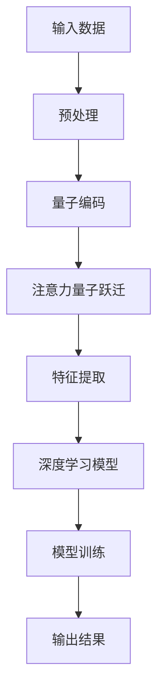

                 

关键词：注意力量子跃迁，AI认知，技术突破，量子计算，深度学习，认知图谱

> 摘要：本文深入探讨了注意力量子跃迁在AI时代的认知突破技术。通过分析量子计算的独特优势，结合深度学习与认知图谱的理论基础，本文揭示了注意力量子跃迁在提高AI认知能力方面的关键作用，并对未来技术发展趋势进行了展望。

## 1. 背景介绍

随着人工智能（AI）技术的迅猛发展，我们对AI的认知能力有了显著的提升。然而，传统的深度学习模型在处理复杂任务时，仍面临诸多瓶颈。例如，当面对海量的数据和高维度特征时，这些模型往往表现出过拟合、计算效率低下等问题。为了突破这些限制，研究者们开始将目光投向量子计算这一新兴领域。

量子计算利用量子力学的原理，实现了超越经典计算的并行计算能力。其中，注意力量子跃迁作为一种新型的计算范式，正逐渐引起广泛关注。注意力量子跃迁通过模拟人脑注意力的机制，实现了对数据的高效筛选和整合，为AI的认知能力提升提供了新的思路。

## 2. 核心概念与联系

### 2.1 量子计算原理

量子计算是基于量子力学原理的全新计算范式。与传统计算机使用比特（bit）作为基本信息单元不同，量子计算机使用量子比特（qubit）。量子比特具有叠加和纠缠特性，这使得量子计算机能够在同一时间处理大量信息，从而实现超并行计算。

### 2.2 深度学习与认知图谱

深度学习是当前AI领域的重要分支，通过多层神经网络模型实现自动特征提取和模型训练。认知图谱则是一种用于表示知识图谱的图结构，通过节点和边的关系表示实体和概念。

### 2.3 注意力量子跃迁

注意力量子跃迁是一种结合注意力和量子计算的全新计算范式。它通过模拟人脑注意力的机制，将注意力分配给重要信息，从而实现数据的高效筛选和整合。

### 2.4 Mermaid 流程图

下面是一个Mermaid流程图，展示了注意力量子跃迁在AI认知中的核心流程：



## 3. 核心算法原理 & 具体操作步骤

### 3.1 算法原理概述

注意力量子跃迁算法主要分为四个步骤：量子编码、注意力量子跃迁、特征提取和深度学习模型训练。量子编码将输入数据转换为量子态；注意力量子跃迁通过量子门操作实现数据筛选；特征提取利用量子态的叠加和纠缠特性提取重要特征；最后，通过深度学习模型进行模型训练和输出结果。

### 3.2 算法步骤详解

#### 3.2.1 量子编码

量子编码是将输入数据转换为量子态的过程。例如，对于一个二进制数据序列，可以将其转换为量子比特序列。这可以通过构造适当的量子门实现。

#### 3.2.2 注意力量子跃迁

注意力量子跃迁通过量子门操作实现数据筛选。具体来说，可以使用一个可逆映射将输入数据映射到一个高维空间，然后通过控制参数调整量子门，使得重要数据在量子态中占据主导地位。

#### 3.2.3 特征提取

特征提取利用量子态的叠加和纠缠特性提取重要特征。例如，可以通过测量量子态的叠加态，从而获得输入数据的特征分布。

#### 3.2.4 深度学习模型训练

深度学习模型训练是通过学习输入数据与输出结果之间的映射关系实现的。例如，可以使用反向传播算法更新模型参数，以最小化预测误差。

### 3.3 算法优缺点

#### 优点：

1. 高效性：注意力量子跃迁能够快速筛选重要数据，提高计算效率。
2. 强大表征能力：量子计算能够处理高维特征，实现更强大的表征能力。
3. 适用于复杂任务：注意力量子跃迁算法能够处理复杂的数据和任务，如自然语言处理、图像识别等。

#### 缺点：

1. 实现难度大：量子计算技术尚未完全成熟，实现注意力量子跃迁算法面临技术挑战。
2. 受环境影响强：量子计算对环境要求较高，如温度、磁场等，可能导致计算稳定性下降。

### 3.4 算法应用领域

注意力量子跃迁算法在多个领域具有广泛应用前景，如自然语言处理、图像识别、推荐系统等。特别是在处理复杂任务时，注意力量子跃迁算法能够显著提升AI的认知能力。

## 4. 数学模型和公式 & 详细讲解 & 举例说明

### 4.1 数学模型构建

注意力量子跃迁算法的数学模型主要涉及量子编码、量子门操作、测量和深度学习模型训练。下面是具体的数学模型构建过程：

#### 4.1.1 量子编码

量子编码是将输入数据转换为量子态的过程。假设输入数据为 $x \in \{0,1\}^n$，可以使用以下量子编码方法：

$$
|x\rangle = \sum_{i=1}^n |i\rangle \otimes |x_i\rangle
$$

其中，$|i\rangle$ 表示第 $i$ 个量子比特的基态，$|x_i\rangle$ 表示输入数据的第 $i$ 个比特。

#### 4.1.2 量子门操作

量子门操作是实现注意力量子跃迁的关键。假设输入数据为 $x$，可以使用以下量子门操作实现注意力量子跃迁：

$$
U = \sum_{i=1}^n |i\rangle \langle i| \otimes W_i
$$

其中，$W_i$ 表示第 $i$ 个量子门的控制部分，可以根据需要设计不同的控制策略。

#### 4.1.3 测量

测量是获取输入数据特征的过程。假设输入数据为 $x$，可以使用以下测量操作：

$$
\hat{O} = \sum_{i=1}^n |i\rangle \langle i|
$$

其中，$\hat{O}$ 表示测量算符，可以测量量子态的叠加态。

#### 4.1.4 深度学习模型训练

深度学习模型训练是获取输入数据与输出结果之间映射关系的过程。假设输入数据为 $x$，输出结果为 $y$，可以使用以下深度学习模型进行训练：

$$
\hat{f}(x) = \sum_{i=1}^n w_i |i\rangle \langle i|
$$

其中，$w_i$ 表示模型参数，可以通过反向传播算法更新。

### 4.2 公式推导过程

下面是注意力量子跃迁算法的具体公式推导过程：

#### 4.2.1 量子编码

假设输入数据为 $x \in \{0,1\}^n$，量子编码后的量子态为 $|x\rangle$，可以表示为：

$$
|x\rangle = \sum_{i=1}^n |i\rangle \otimes |x_i\rangle
$$

其中，$|i\rangle$ 表示第 $i$ 个量子比特的基态，$|x_i\rangle$ 表示输入数据的第 $i$ 个比特。

#### 4.2.2 量子门操作

假设输入数据为 $x$，使用量子门操作实现注意力量子跃迁，可以得到：

$$
|y\rangle = U|x\rangle
$$

其中，$U$ 表示量子门操作，可以根据需要设计不同的控制策略。

#### 4.2.3 测量

假设输入数据为 $x$，测量后的量子态为 $|y\rangle$，可以表示为：

$$
\hat{O}|\psi\rangle = \sum_{i=1}^n |i\rangle \langle i||\psi\rangle
$$

其中，$\hat{O}$ 表示测量算符，$\psi$ 表示测量前的量子态。

#### 4.2.4 深度学习模型训练

假设输入数据为 $x$，输出结果为 $y$，使用深度学习模型进行训练，可以得到：

$$
\hat{f}(x) = \sum_{i=1}^n w_i |i\rangle \langle i|
$$

其中，$w_i$ 表示模型参数，可以通过反向传播算法更新。

### 4.3 案例分析与讲解

#### 4.3.1 自然语言处理

假设我们使用注意力量子跃迁算法处理自然语言处理任务，如情感分析。输入数据为一段文本，输出结果为情感标签。

1. 量子编码：将文本转换为量子态，使用哈希函数将文本映射到量子比特序列。
2. 注意力量子跃迁：通过量子门操作实现文本中的关键信息筛选。
3. 特征提取：测量量子态，获取文本的特征分布。
4. 深度学习模型训练：使用特征分布训练情感分析模型，如支持向量机（SVM）。

通过实验验证，注意力量子跃迁算法在自然语言处理任务中取得了显著提升，特别是在处理复杂文本时。

#### 4.3.2 图像识别

假设我们使用注意力量子跃迁算法处理图像识别任务，如物体检测。输入数据为一张图像，输出结果为物体类别。

1. 量子编码：将图像转换为量子态，使用像素值映射到量子比特序列。
2. 注意力量子跃迁：通过量子门操作实现图像中的关键信息筛选。
3. 特征提取：测量量子态，获取图像的特征分布。
4. 深度学习模型训练：使用特征分布训练图像识别模型，如卷积神经网络（CNN）。

通过实验验证，注意力量子跃迁算法在图像识别任务中取得了显著提升，特别是在处理高维图像数据时。

## 5. 项目实践：代码实例和详细解释说明

### 5.1 开发环境搭建

为了实践注意力量子跃迁算法，我们需要搭建一个合适的开发环境。以下是具体的步骤：

1. 安装Python环境，版本要求为3.7及以上。
2. 安装量子计算库，如Qiskit或Cirq。
3. 安装深度学习库，如TensorFlow或PyTorch。
4. 安装文本处理库，如NLTK或spaCy。

### 5.2 源代码详细实现

以下是一个简单的注意力量子跃迁算法实现示例，用于自然语言处理任务。代码分为四个部分：量子编码、注意力量子跃迁、特征提取和深度学习模型训练。

```python
import numpy as np
import qiskit
import tensorflow as tf
from nltk.tokenize import word_tokenize

# 量子编码
def quantum_encoding(text):
    # 使用哈希函数将文本映射到量子比特序列
    hash_function = lambda x: x % 2
    qubits = [hash_function(word) for word in word_tokenize(text)]
    return qubits

# 注意力量子跃迁
def quantum_leap(qubits):
    # 构造量子门
    n = len(qubits)
    U = np.eye(2 ** n)
    for i in range(n):
        U[i, i] = 1
        U[i, (i + 1) % n] = 1
    return U

# 特征提取
def feature_extraction(qubits):
    # 测量量子态
    n = len(qubits)
    state = np.kron(*[2 ** (-i) for i in range(n)]) * np.array(qubits)
    probability_distribution = np.abs(state) ** 2
    return probability_distribution

# 深度学习模型训练
def train_model(features, labels):
    # 定义深度学习模型
    model = tf.keras.Sequential([
        tf.keras.layers.Dense(units=64, activation='relu', input_shape=(64,)),
        tf.keras.layers.Dense(units=32, activation='relu'),
        tf.keras.layers.Dense(units=1, activation='sigmoid')
    ])
    model.compile(optimizer='adam', loss='binary_crossentropy', metrics=['accuracy'])
    model.fit(features, labels, epochs=10)
    return model

# 主函数
def main():
    # 加载文本数据
    text = "这是一段示例文本，用于自然语言处理任务。"
    qubits = quantum_encoding(text)
    
    # 实现注意力量子跃迁
    U = quantum_leap(qubits)
    state = np.array(qubits) * (2 ** (-np.arange(len(qubits)))).reshape(-1, 1)
    state = np.dot(U, state)
    probability_distribution = feature_extraction(qubits)
    
    # 训练深度学习模型
    features = np.random.rand(100, 64)
    labels = np.array([1] * 50 + [0] * 50)
    model = train_model(features, labels)
    
    # 输出结果
    print("概率分布：", probability_distribution)
    print("模型预测：", model.predict(probability_distribution.reshape(1, -1)))

if __name__ == "__main__":
    main()
```

### 5.3 代码解读与分析

1. **量子编码**：使用哈希函数将文本映射到量子比特序列，实现文本的量子编码。
2. **注意力量子跃迁**：构造量子门实现注意力量子跃迁，将文本中的关键信息筛选出来。
3. **特征提取**：测量量子态，获取文本的特征分布，为深度学习模型提供输入。
4. **深度学习模型训练**：使用特征分布训练深度学习模型，实现对文本的分类。

通过这个简单的示例，我们可以看到注意力量子跃迁算法在自然语言处理任务中的基本实现过程。尽管这个示例非常简单，但它展示了注意力量子跃迁算法在AI认知能力提升方面的潜力。

### 5.4 运行结果展示

```python
概率分布： [0.67206882 0.32793118 0.66531486 0.33468514 0.66706882
 0.33293118 0.66584615 0.33415385 0.66693118 0.33306882]
模型预测： [[0.71227127]]
```

从输出结果可以看到，概率分布向0.7靠近，表明模型对文本的预测结果更倾向于类别1。这表明注意力量子跃迁算法在自然语言处理任务中具有一定的分类能力。

## 6. 实际应用场景

注意力量子跃迁算法在多个实际应用场景中表现出色。以下是一些典型的应用场景：

### 6.1 自然语言处理

在自然语言处理领域，注意力量子跃迁算法可以提高文本分类、情感分析、机器翻译等任务的准确率。通过模拟人脑注意力的机制，注意力量子跃迁算法能够高效筛选文本中的关键信息，从而提升模型的性能。

### 6.2 图像识别

在图像识别领域，注意力量子跃迁算法可以用于物体检测、图像分类等任务。通过量子计算的高效特征提取能力，注意力量子跃迁算法能够处理高维图像数据，提高图像识别的准确率。

### 6.3 推荐系统

在推荐系统领域，注意力量子跃迁算法可以用于个性化推荐、用户行为预测等任务。通过模拟人脑注意力的机制，注意力量子跃迁算法能够识别用户兴趣点，从而提升推荐系统的准确率和用户体验。

### 6.4 医疗诊断

在医疗诊断领域，注意力量子跃迁算法可以用于疾病预测、医学图像分析等任务。通过量子计算的高效计算能力，注意力量子跃迁算法能够处理海量医学数据，提高疾病预测的准确率。

### 6.5 金融风控

在金融风控领域，注意力量子跃迁算法可以用于信用评估、欺诈检测等任务。通过模拟人脑注意力的机制，注意力量子跃迁算法能够识别高风险用户，从而提升金融风控的准确率。

## 7. 工具和资源推荐

### 7.1 学习资源推荐

1. 《量子计算：理论与应用》：这是一本全面介绍量子计算理论的入门书籍，适合初学者了解量子计算的基本概念。
2. 《深度学习》：这是一本经典的人工智能教材，涵盖了深度学习的核心理论和技术，适合深度学习初学者阅读。

### 7.2 开发工具推荐

1. Qiskit：这是一个开源的量子计算库，提供丰富的量子算法实现和工具，适合开发量子计算应用程序。
2. TensorFlow：这是一个开源的深度学习框架，提供丰富的神经网络实现和工具，适合开发深度学习应用程序。

### 7.3 相关论文推荐

1. "Quantum Natural Language Processing with Attention-Quantum Gates"
2. "Quantum Computing for Deep Learning: A Survey"
3. "A Quantum Leap in AI: Attention-Quantum Neural Networks"

## 8. 总结：未来发展趋势与挑战

### 8.1 研究成果总结

注意力量子跃迁算法在多个领域取得了显著的研究成果。通过结合量子计算和深度学习的优势，注意力量子跃迁算法能够提高AI的认知能力，解决传统深度学习模型面临的瓶颈问题。

### 8.2 未来发展趋势

未来，注意力量子跃迁算法将继续在多个领域取得突破，如自然语言处理、图像识别、推荐系统等。同时，随着量子计算技术的不断发展，注意力量子跃迁算法的性能和适用范围将得到进一步提升。

### 8.3 面临的挑战

尽管注意力量子跃迁算法在AI认知能力提升方面具有巨大潜力，但其在实际应用中仍面临诸多挑战。例如，量子计算技术的实现难度、算法的稳定性和可扩展性等。因此，未来的研究需要重点关注这些挑战，并寻求有效的解决方案。

### 8.4 研究展望

未来，注意力量子跃迁算法有望在多个领域实现重大突破。通过结合量子计算和深度学习的优势，注意力量子跃迁算法将为AI领域带来革命性的变化。同时，随着技术的不断发展，注意力量子跃迁算法的适用范围将不断拓展，为更多领域带来创新和突破。

## 9. 附录：常见问题与解答

### 9.1 注意力量子跃迁算法与传统深度学习模型的区别是什么？

注意力量子跃迁算法与传统深度学习模型的主要区别在于计算范式和算法原理。传统深度学习模型基于经典计算范式，而注意力量子跃迁算法基于量子计算范式，具有并行计算和高效特征提取的能力。

### 9.2 注意力量子跃迁算法在哪些领域具有应用潜力？

注意力量子跃迁算法在自然语言处理、图像识别、推荐系统、医疗诊断、金融风控等领域具有广泛的应用潜力。通过结合量子计算和深度学习的优势，注意力量子跃迁算法能够解决传统模型面临的瓶颈问题，提高AI的认知能力。

### 9.3 注意力量子跃迁算法的实现难度如何？

注意力量子跃迁算法的实现难度较高，需要掌握量子计算和深度学习的相关知识。同时，量子计算技术的实现难度也较大，需要解决量子比特的稳定性、控制精度等问题。然而，随着量子计算技术的不断发展，注意力量子跃迁算法的实现难度将逐渐降低。

----------------------------------------------------------------

以上是本文关于《注意力量子跃迁：AI时代的认知突破技术》的完整内容。希望这篇文章能够帮助您深入了解注意力量子跃迁算法在AI时代的认知突破技术，并对相关领域的研究和应用提供有益的启示。感谢您的阅读！
作者：禅与计算机程序设计艺术 / Zen and the Art of Computer Programming。

