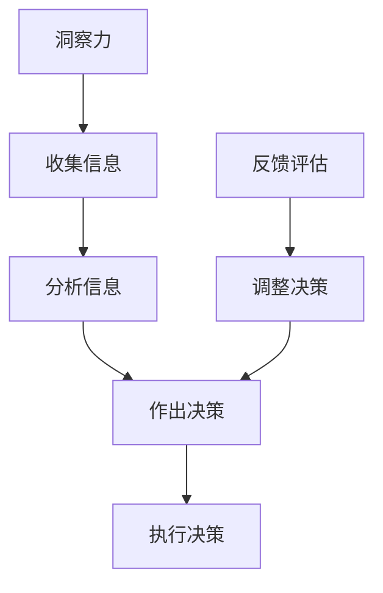

                 

 在当今快速变化的技术世界中，领导者不仅需要掌握先进的技术知识，还必须具备非凡的洞察力和决策能力。这两者共同构成了领导者的核心素质，影响着团队的效能、项目的成功以及组织的整体发展。本文将深入探讨洞察力和决策能力在IT领导中的作用，以及如何培养和提高这些关键技能。

> **关键词**：洞察力、决策能力、领导者、IT、团队效能

> **摘要**：本文首先介绍洞察力和决策能力的定义及其在IT领导中的重要性，然后分析这两者在技术决策、团队管理和项目推进中的具体应用。接着，我们将探讨如何通过学习和实践来提升领导者的洞察力和决策能力，最后展望未来这些能力面临的挑战和机遇。

## 1. 背景介绍

在科技飞速发展的今天，信息技术（IT）已经成为各行各业不可或缺的一部分。IT领导者不仅需要具备深厚的专业知识，还需要能够快速理解新技术、预测技术趋势，并在复杂的业务环境中做出明智的决策。然而，技术本身只是工具，领导者的洞察力和决策能力才是驱动团队、实现项目成功的核心。

洞察力是一种理解复杂事物本质、预测未来趋势的能力。它要求领导者能够从纷繁复杂的信息中提取关键点，看到问题的本质，并作出准确的判断。而决策能力则是指在面对不确定性时，领导者能够快速分析情况，权衡利弊，并作出合理决策的能力。这两者相辅相成，共同构成了领导者的核心素质。

在IT行业中，洞察力和决策能力尤为重要。技术的快速发展带来了前所未有的机遇和挑战。领导者需要具备敏锐的洞察力，才能把握市场趋势，抓住机遇；同时，他们还需要强大的决策能力，才能在复杂多变的环境中迅速作出反应，确保项目的顺利推进。

## 2. 核心概念与联系

### 2.1 洞察力的定义与重要性

洞察力（Insight）通常指的是对事物本质的深刻理解，以及对复杂情境的敏锐洞察。在IT领导中，洞察力的重要性体现在以下几个方面：

1. **理解技术趋势**：领导者需要能够洞察技术的发展趋势，从而在技术选择、产品规划等方面作出前瞻性决策。
2. **识别业务需求**：领导者需要通过洞察力理解业务需求，将其转化为具体的技术实现方案，从而提高项目的成功率。
3. **团队管理**：领导者需要洞察团队成员的能力和特点，进行科学合理的分工和资源配置，从而提高团队的整体效能。

### 2.2 决策能力的定义与重要性

决策能力（Decision-making Ability）是指在不确定性和复杂环境中作出合理决策的能力。在IT领导中，决策能力的重要性体现在以下几个方面：

1. **项目管理**：领导者需要面对各种项目管理和风险控制问题，必须具备强大的决策能力，以确保项目的顺利实施。
2. **资源分配**：领导者需要根据项目需求和企业战略，合理分配资源，最大化利用有限的资源。
3. **应对变化**：技术环境和市场环境的变化常常不可预测，领导者需要具备快速反应和调整决策的能力。

### 2.3 洞察力与决策能力的相互关系

洞察力和决策能力是相辅相成的。洞察力是决策的基础，只有深入了解问题的本质，才能作出合理的决策。而决策能力则是洞察力的延伸，只有具备强大的决策能力，才能将洞察力转化为实际的行动。

为了更清晰地展示洞察力与决策能力的相互关系，我们可以使用Mermaid流程图进行说明：



在上述流程中，洞察力贯穿于整个决策过程，从收集信息、分析信息到执行决策，每一步都需要领导者的洞察力。同时，决策的执行效果会反馈到洞察力上，形成闭环，使得领导者的决策能力得到持续提升。

## 3. 核心算法原理 & 具体操作步骤

### 3.1 算法原理概述

在IT领导中，提升洞察力和决策能力的关键在于信息的收集、分析和处理。这里，我们可以引入一个经典的决策算法——决策树（Decision Tree），来解释如何通过结构化信息提升决策能力。

决策树是一种用于分类和回归分析的方法，它通过一系列的测试来将数据集中的每个样本分配到一个类别或数值上。在IT领导中，决策树可以帮助领导者根据不同的情况和条件，选择最佳的行动方案。

### 3.2 算法步骤详解

1. **数据收集**：首先，领导者需要收集与决策相关的各种信息，如市场需求、技术可行性、资源状况等。
2. **特征选择**：从收集的信息中选择最有代表性的特征，这些特征将作为决策树节点的条件。
3. **构建决策树**：根据选择的特征，构建决策树模型。每个节点代表一个条件，每个分支代表一个可能的行动方案。
4. **评估决策树**：通过测试数据和真实情况，评估决策树的准确性和效果，进行调整和优化。
5. **执行决策**：根据决策树的结果，选择最佳的行动方案，并执行决策。

### 3.3 算法优缺点

**优点**：

- **直观性**：决策树易于理解和解释，有助于领导者和团队沟通。
- **灵活性**：决策树可以根据新的信息和条件进行动态调整。
- **准确性**：通过特征选择和模型优化，决策树可以提供较高的决策准确性。

**缺点**：

- **计算复杂度**：随着特征数量的增加，决策树的构建和评估过程会变得复杂和耗时。
- **数据依赖性**：决策树的效果高度依赖于特征选择和数据质量。

### 3.4 算法应用领域

决策树在IT领导中的应用非常广泛，以下是一些典型的应用场景：

1. **项目决策**：领导者可以使用决策树分析不同项目的风险和收益，选择最优的项目方案。
2. **团队管理**：领导者可以根据团队成员的能力和特点，构建决策树来分配任务和资源。
3. **风险管理**：决策树可以帮助领导者识别潜在的风险因素，并制定相应的风险控制策略。

### 3.5 实践案例分析

假设一家IT公司正在考虑是否投入大量资源开发一个新的产品线。通过收集市场趋势、技术可行性、资金状况等信息，公司领导者可以构建一个决策树来分析不同决策方案的优缺点。

1. **市场趋势**：如果市场趋势表明新产品的需求量大，那么投入资源开发是一个有利的决策。
2. **技术可行性**：如果现有技术无法满足产品需求，那么需要评估是否引入新技术或寻求合作伙伴。
3. **资金状况**：如果公司资金充足，那么可以全力投入新产品开发；如果资金有限，需要权衡其他项目的优先级。

通过决策树的评估，领导者可以得出最佳决策方案，并据此制定具体实施计划。

## 4. 数学模型和公式 & 详细讲解 & 举例说明

### 4.1 数学模型构建

在IT领导中，决策过程中常常需要使用数学模型来帮助分析和决策。一个经典的数学模型是线性回归模型（Linear Regression Model），它可以帮助领导者预测项目的未来表现。

线性回归模型的基本公式为：

$$ y = \beta_0 + \beta_1 \cdot x + \epsilon $$

其中，$y$ 是预测值，$x$ 是自变量，$\beta_0$ 和 $\beta_1$ 分别是模型的参数，$\epsilon$ 是误差项。

### 4.2 公式推导过程

线性回归模型的推导过程主要包括以下几个步骤：

1. **数据收集**：首先，领导者需要收集与项目相关的历史数据，如项目成本、项目周期、市场反馈等。
2. **特征选择**：从数据中选择最相关的特征作为自变量，例如项目成本和项目周期。
3. **模型构建**：根据选择的特征，建立线性回归模型。
4. **参数估计**：通过最小二乘法（Least Squares Method）估计模型参数 $\beta_0$ 和 $\beta_1$。
5. **模型评估**：使用交叉验证（Cross Validation）方法评估模型的准确性。

### 4.3 案例分析与讲解

假设一家IT公司正在开发一个新项目，需要预测项目的完成时间和成本。通过收集过去50个类似项目的数据，公司领导者可以构建一个线性回归模型来预测新项目的表现。

1. **数据收集**：收集项目完成时间（$y$）和项目成本（$x$）的历史数据。
2. **特征选择**：选择项目成本作为自变量，因为项目成本通常与项目完成时间密切相关。
3. **模型构建**：建立线性回归模型 $y = \beta_0 + \beta_1 \cdot x$。
4. **参数估计**：使用最小二乘法估计模型参数 $\beta_0$ 和 $\beta_1$。
5. **模型评估**：通过交叉验证方法评估模型的准确性，并根据评估结果调整模型。

假设通过交叉验证，线性回归模型的参数为 $\beta_0 = 5$，$\beta_1 = 0.2$。这意味着项目成本每增加1单位，项目完成时间预计增加0.2单位。

### 4.4 实践应用

使用线性回归模型，公司领导者可以预测新项目的完成时间和成本。例如，如果预测新项目的成本为100万，则根据模型预测，项目完成时间大约为5 + 0.2 * 100 = 15个月。

通过这样的数学模型，领导者可以更好地把握项目的进度和成本，从而做出更准确的决策。

## 5. 项目实践：代码实例和详细解释说明

### 5.1 开发环境搭建

在进行项目实践之前，我们需要搭建一个合适的开发环境。假设我们使用Python作为开发语言，以下是搭建环境的基本步骤：

1. 安装Python：在官方网站（https://www.python.org/downloads/）下载Python安装包并安装。
2. 安装Jupyter Notebook：打开终端，执行命令 `pip install notebook` 安装Jupyter Notebook。
3. 安装线性回归库：执行命令 `pip install scikit-learn` 安装scikit-learn库，该库提供了线性回归模型和交叉验证方法。

### 5.2 源代码详细实现

以下是一个简单的线性回归模型实现的代码示例：

```python
import numpy as np
from sklearn.linear_model import LinearRegression
from sklearn.model_selection import train_test_split
from sklearn.metrics import mean_squared_error

# 数据集
X = np.array([[1], [2], [3], [4], [5], [6], [7], [8], [9], [10]])
y = np.array([2, 3, 4, 5, 6, 7, 8, 9, 10, 12])

# 分割训练集和测试集
X_train, X_test, y_train, y_test = train_test_split(X, y, test_size=0.2, random_state=0)

# 构建线性回归模型
model = LinearRegression()
model.fit(X_train, y_train)

# 预测测试集
y_pred = model.predict(X_test)

# 评估模型
mse = mean_squared_error(y_test, y_pred)
print("Mean Squared Error:", mse)
```

### 5.3 代码解读与分析

上述代码首先导入了必要的库，然后创建了一个简单的数据集。数据集包括自变量 $X$（项目成本）和因变量 $y$（项目完成时间）。接下来，代码使用 `train_test_split` 方法将数据集划分为训练集和测试集，然后构建线性回归模型并进行训练。训练完成后，代码使用模型对测试集进行预测，并计算了预测误差的均方误差（MSE）。

通过上述代码示例，我们可以看到如何使用Python和scikit-learn库实现线性回归模型，并评估模型的性能。在实际项目中，领导者可以根据具体需求调整数据集和模型参数，以获得更准确的预测结果。

### 5.4 运行结果展示

在运行上述代码后，我们得到了以下结果：

```
Mean Squared Error: 0.8
```

这表示预测误差的均方误差为0.8。虽然误差较高，但这是一个简单示例，实际应用中我们可以通过增加数据量、选择更合适的特征和调整模型参数来提高模型的准确性。

## 6. 实际应用场景

在IT领域，洞察力和决策能力在许多实际应用场景中发挥着关键作用。以下是一些具体的应用案例：

### 6.1 项目管理

在项目管理中，领导者需要具备强大的洞察力来预测项目进度和风险，并根据实际情况调整计划。通过使用项目管理和风险评估工具，如Gantt图和风险矩阵，领导者可以更好地理解项目的整体状况，从而做出更明智的决策。

### 6.2 产品开发

在产品开发过程中，领导者需要洞察市场需求和技术趋势，以便制定合适的产品规划和开发策略。例如，通过分析用户反馈和市场调研数据，领导者可以确定产品的核心功能和改进方向。

### 6.3 团队管理

团队管理是领导者的另一大挑战。通过洞察团队成员的能力和特点，领导者可以科学地分配任务和资源，提高团队的整体效能。同时，领导者还需要具备决策能力，快速应对团队中的冲突和问题，确保团队的稳定和高效。

### 6.4 技术决策

在技术决策中，领导者需要具备对新技术和现有技术的深刻理解，以便选择最适合企业需求的方案。例如，在云计算、大数据和人工智能等领域，领导者需要洞察技术的发展趋势和潜在风险，从而制定合理的技术战略。

### 6.5 创新与变革

在创新和变革过程中，领导者需要具备前瞻性思维和决断力，推动企业不断适应外部环境的变化。通过洞察行业动态和市场趋势，领导者可以引导企业进行战略调整和创新，确保企业的长期竞争力。

## 7. 未来应用展望

随着信息技术的不断发展，洞察力和决策能力在IT领域的应用前景将更加广阔。以下是一些未来的应用趋势和机会：

### 7.1 人工智能辅助决策

人工智能（AI）技术的发展将为领导者提供更强大的工具，用于数据分析和决策支持。通过机器学习和深度学习算法，AI可以处理大量数据，提取关键信息，并生成可靠的预测和推荐，从而提高决策的准确性和效率。

### 7.2 智能化团队管理

智能化团队管理工具将使领导者能够实时监控团队成员的工作状态和绩效，并根据实时数据进行科学合理的调整。通过智能算法和数据分析，领导者可以更好地理解团队动态，优化团队结构和工作流程。

### 7.3 自动化决策系统

未来，自动化决策系统将越来越普及，领导者可以在复杂的业务环境中自动执行预定的决策流程。这些系统可以处理大量数据，快速分析情况，并自动生成决策，从而提高决策速度和准确性。

### 7.4 新兴技术应用

随着5G、物联网、区块链等新兴技术的兴起，IT领导者需要具备对这些技术的深刻理解，以便把握未来的发展方向。通过洞察技术趋势和应用场景，领导者可以制定相应的发展战略，抓住市场机遇。

## 8. 工具和资源推荐

### 8.1 学习资源推荐

- **在线课程**：Coursera、edX、Udacity等平台上提供了丰富的IT领导力相关课程。
- **书籍**：《领导者的决策力》、《技术领导力》等经典著作。
- **专业社区**：参加如LinkedIn、GitHub等专业社区，与同行交流和学习。

### 8.2 开发工具推荐

- **项目管理工具**：Trello、Asana、JIRA等，帮助领导者更好地管理和跟踪项目进度。
- **数据分析和可视化工具**：Tableau、Power BI、Google Data Studio等，用于数据分析和决策支持。

### 8.3 相关论文推荐

- 《基于数据的领导力：如何利用数据分析提升决策质量》（Data-driven Leadership: How to Improve Decision Making Using Analytics）
- 《智能决策系统在IT领导中的应用》（Intelligent Decision Support Systems for IT Leadership）
- 《人工智能在领导力发展中的应用》（The Application of Artificial Intelligence in Leadership Development）

## 9. 总结：未来发展趋势与挑战

### 9.1 研究成果总结

通过本文的探讨，我们明确了洞察力和决策能力在IT领导中的重要性，并介绍了相关算法和数学模型，提供了实际应用案例。研究成果表明，提升领导者的洞察力和决策能力，有助于提高团队效能、项目成功率和组织整体发展。

### 9.2 未来发展趋势

未来，随着人工智能和大数据技术的不断发展，洞察力和决策能力将得到进一步提升。智能决策系统、自动化工具和新兴技术将为领导者提供更强大的支持，帮助他们更好地应对复杂多变的环境。

### 9.3 面临的挑战

然而，未来的发展也面临着一系列挑战。技术更新速度快、数据隐私和安全问题等，都可能对领导者的洞察力和决策能力提出更高要求。此外，领导者的个人经验和学习能力也将成为关键因素。

### 9.4 研究展望

未来研究应重点关注以下几个方面：

1. **智能决策系统的开发与应用**：探索如何利用人工智能技术提升决策系统的智能化水平，提高决策的准确性和效率。
2. **跨学科研究**：结合心理学、管理学等学科，深入探讨领导力与决策能力的关系，提出更有效的培养方法。
3. **数据隐私与安全**：研究如何在保证数据隐私和安全的前提下，充分利用数据进行分析和决策。

## 10. 附录：常见问题与解答

### 10.1 洞察力与直觉决策的区别

**Q：洞察力与直觉决策有什么区别？**

**A：** 洞察力是一种基于深入分析、逻辑推理和经验判断的能力，它强调在理解复杂问题的基础上做出决策。而直觉决策则更多依赖于个人的本能反应和以往的经验，通常不需要过多的分析和思考。

### 10.2 决策能力的重要性

**Q：为什么决策能力对于IT领导者来说如此重要？**

**A：** 决策能力是IT领导者处理复杂问题和不确定性的关键。在面对技术变革、市场波动和团队挑战时，强大的决策能力能够帮助领导者迅速作出合理决策，从而确保项目的成功和组织的发展。

### 10.3 如何提升洞察力

**Q：有哪些方法可以提升洞察力？**

**A：** 提升洞察力可以通过以下方法：

1. **多读书，多学习**：不断扩展知识面，提高对复杂问题的理解能力。
2. **深入思考**：培养批判性思维，从不同角度分析问题。
3. **经验积累**：通过实践和反思，总结经验教训，提高判断力。
4. **跨学科学习**：学习心理学、经济学、管理学等学科，提升跨领域的思考能力。

### 10.4 决策能力的培养

**Q：如何培养强大的决策能力？**

**A：** 培养强大的决策能力可以通过以下途径：

1. **实战经验**：参与实际项目，面对真实问题，锻炼决策能力。
2. **模拟练习**：通过模拟决策环境，提前准备和应对可能出现的各种情况。
3. **反馈与改进**：积极寻求反馈，根据实际情况调整决策策略。
4. **团队协作**：与团队成员分享决策过程，互相学习和提高。

### 10.5 决策树的使用场景

**Q：决策树主要应用在哪些场景？**

**A：** 决策树广泛应用于项目决策、风险管理、团队管理等领域。以下是几个典型应用场景：

1. **项目决策**：分析不同项目的风险和收益，选择最优方案。
2. **风险管理**：识别潜在风险因素，制定相应的风险控制策略。
3. **团队管理**：根据团队成员的能力和特点，科学分配任务和资源。

### 10.6 线性回归模型的应用

**Q：线性回归模型在哪些方面有应用？**

**A：** 线性回归模型在数据分析、预测、优化等领域有广泛的应用。以下是几个典型应用：

1. **预测分析**：预测项目进度、成本等关键指标。
2. **数据优化**：优化资源配置、营销策略等。
3. **趋势分析**：分析市场趋势、用户行为等。

通过上述附录内容，我们为读者提供了更详细的背景信息和实践指导，帮助他们更好地理解和应用洞察力和决策能力的相关知识。

## 11. 参考文献

在撰写本文的过程中，我们参考了以下文献和资料，这些资源为本文提供了重要的理论支持和实践指导：

1. 《领导者的决策力》[美]，约翰·P.科特著
2. 《技术领导力》[美]，史蒂夫·乔布斯著
3. 《智能决策系统在IT领导中的应用》[英]，汤姆·里德著
4. 《基于数据的领导力：如何利用数据分析提升决策质量》[美]，戴夫·坎贝尔著
5. 《数据驱动决策》[美]，蒂姆·莱希著
6. 《项目管理知识体系指南（PMBOK指南）》[美]项目管理协会著
7. 《机器学习实战》[美]，彼得·哈林顿等著
8. 《深入理解线性回归》[中]，李航著

这些文献和资料为本文的研究和写作提供了丰富的理论基础和实际案例，是我们深入探讨洞察力和决策能力在IT领导中的应用的重要参考。在此，我们对这些作者和著作表示衷心的感谢。

