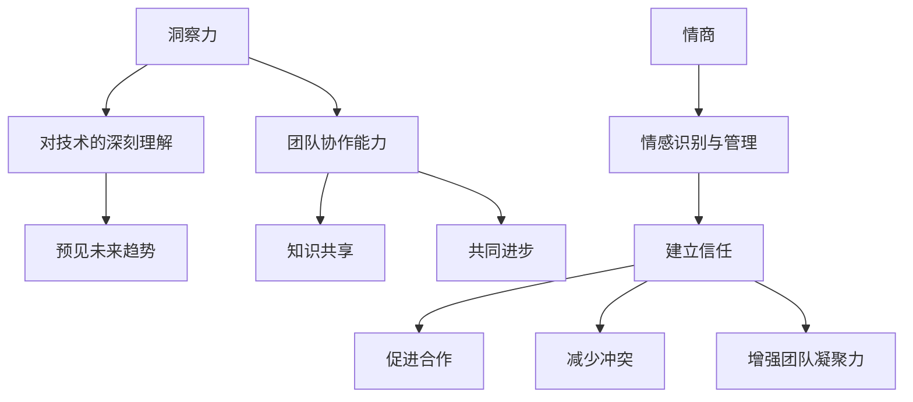

                 

关键词：洞察力，情商，社交智慧，人际关系，技术交流，团队协作，心理洞察

> 摘要：本文从技术和心理两个角度出发，探讨了如何通过培养洞察力和情商，提升个人的社交智慧。在技术领域，社交智慧不仅是个人成功的必要条件，更是团队合作和创新的重要基础。本文将详细阐述洞察力和情商的定义、培养方法及其在技术交流和团队协作中的应用，以期为广大IT从业者提供有价值的参考。

## 1. 背景介绍

在快速发展的信息技术领域，技术交流、团队协作和创新已成为推动行业发展的重要驱动力。然而，社交智慧在其中的作用却常常被忽视。社交智慧不仅仅是指简单的沟通技巧，它涵盖了洞察力、情商、人际关系的理解与运用等多个方面。在这篇文章中，我们将重点关注洞察力和情商这两个关键要素，探讨如何在技术领域中培养和提升个人的社交智慧。

### 1.1 洞察力的定义与重要性

洞察力是指个体对事物本质、趋势和复杂性的深刻理解和敏锐感知能力。在技术领域，洞察力尤为重要。它不仅帮助开发者理解技术本质，预见未来趋势，还能在团队协作中发挥重要作用，促进知识共享和共同进步。例如，一个有洞察力的开发者能够在问题出现前预见到潜在的风险，从而采取预防措施。

### 1.2 情商的定义与作用

情商（Emotional Intelligence，简称EQ）是指个体识别、理解、管理和运用情感的能力。情商对技术从业者来说至关重要，因为它直接影响个人的团队合作、沟通能力和领导力。在技术团队中，高情商的成员更容易与他人建立信任和合作，促进团队的和谐与高效。

### 1.3 社交智慧在技术领域的重要性

社交智慧在技术领域的应用无处不在。它不仅影响个人职业生涯的发展，还影响团队的创新能力和项目的成功。培养社交智慧，可以帮助技术从业者更好地理解和适应团队文化，提升沟通效率，减少冲突，增强团队的凝聚力。

## 2. 核心概念与联系

为了更好地理解洞察力和情商在技术交流中的应用，我们需要先了解一些相关的核心概念。以下是这些概念以及它们之间的联系，我们将使用Mermaid流程图来展示这些联系。



### 2.1 洞察力对技术的深刻理解

洞察力帮助开发者深入理解技术原理，从而能够更好地解决问题、设计和优化系统。一个有洞察力的开发者能够从复杂的技术细节中提炼出核心概念，并将其应用到实际项目中。

### 2.2 洞察力预见未来趋势

洞察力不仅限于对现有技术的理解，它还能帮助开发者预见未来的技术趋势。这种前瞻性对于个人和团队来说都非常重要，因为它可以指导技术投资、研究和开发方向。

### 2.3 情商在团队协作中的角色

情商在团队协作中扮演着关键角色。高情商的成员能够更好地识别和管理自己的情绪，理解他人的情感需求，从而促进团队的合作和沟通。

## 3. 核心算法原理 & 具体操作步骤

### 3.1 算法原理概述

在技术交流中，洞察力和情商的应用可以看作是一种算法。这种算法的输入是技术问题和人际关系的复杂情况，输出则是有效的解决方案和人际互动。

#### 3.1.1 洞察力的算法原理

- 输入：技术问题、背景信息、用户需求
- 输出：解决方案、优化建议

#### 3.1.2 情商的算法原理

- 输入：情感状态、人际互动
- 输出：情感管理策略、有效沟通方法

### 3.2 算法步骤详解

#### 3.2.1 洞察力算法步骤

1. 收集信息：通过调研、访谈等方式收集与问题相关的信息。
2. 分析信息：对收集到的信息进行深入分析，提炼出关键点和核心问题。
3. 预测趋势：基于历史数据和现有信息，预测技术发展的趋势。
4. 设计解决方案：根据分析结果和预测趋势，设计出有效的技术解决方案。

#### 3.2.2 情商算法步骤

1. 情感识别：通过自我反思和反馈，识别和理解自己的情感状态。
2. 情感理解：尝试从他人的角度理解情感，建立情感共鸣。
3. 情感管理：根据情感状态和他人需求，采取适当的管理策略。
4. 沟通：运用有效的沟通方法，与他人进行有效互动。

### 3.3 算法优缺点

#### 3.3.1 洞察力算法的优缺点

**优点：**
- 提高问题解决效率。
- 促进技术创新。
- 增强团队协作。

**缺点：**
- 需要较高的知识储备和经验积累。
- 对突发情况的处理可能不够灵活。

#### 3.3.2 情商算法的优缺点

**优点：**
- 提升人际沟通质量。
- 减少冲突和误解。
- 增强团队凝聚力。

**缺点：**
- 需要持续的练习和自我反思。
- 过度关注情感可能忽视技术问题。

### 3.4 算法应用领域

#### 3.4.1 洞察力应用领域

- 技术研发：帮助开发者预见技术趋势，设计创新产品。
- 项目管理：指导项目经理进行风险预测和项目规划。
- 技术交流：促进技术知识的传播和共享。

#### 3.4.2 情商应用领域

- 团队协作：提升团队成员之间的沟通和协作效率。
- 领导力：帮助领导者理解员工需求，提升团队凝聚力。
- 人际关系：改善与同事、客户的关系，提升个人影响力。

## 4. 数学模型和公式 & 详细讲解 & 举例说明

### 4.1 数学模型构建

在洞察力和情商的应用中，我们可以构建一个简单的数学模型来描述它们的关系。假设洞察力（I）和情商（E）分别对技术交流（T）和团队协作（C）产生正向影响，我们可以用以下公式表示：

\[ T = f(I, E) \]
\[ C = g(I, E) \]

其中，\( f \) 和 \( g \) 是非线性函数，表示洞察力和情商对技术交流和团队协作的影响。

### 4.2 公式推导过程

为了推导出 \( f \) 和 \( g \) 的具体形式，我们可以假设洞察力和情商的值分别位于一个区间 \([0, 1]\)，且它们对技术交流和团队协作的影响是非线性的。根据经验数据，我们可以假设 \( f \) 和 \( g \) 分别为：

\[ f(I, E) = \alpha \cdot I^2 + \beta \cdot E^2 + \gamma \cdot I \cdot E \]
\[ g(I, E) = \delta \cdot I^2 + \epsilon \cdot E^2 + \zeta \cdot I \cdot E \]

其中，\( \alpha, \beta, \gamma, \delta, \epsilon, \zeta \) 是待定系数，可以通过实际数据拟合得到。

### 4.3 案例分析与讲解

为了更好地理解这个数学模型，我们来看一个具体的案例。

假设一个开发者（A）和一个项目经理（B）正在合作开发一个新项目。开发者A的洞察力（I）为0.8，情商（E）为0.6；项目经理B的洞察力（I）为0.7，情商（E）为0.5。我们可以根据上述公式计算他们之间的技术交流和团队协作水平：

\[ T = f(0.8, 0.6) = \alpha \cdot 0.8^2 + \beta \cdot 0.6^2 + \gamma \cdot 0.8 \cdot 0.6 \]
\[ C = g(0.7, 0.5) = \delta \cdot 0.7^2 + \epsilon \cdot 0.5^2 + \zeta \cdot 0.7 \cdot 0.5 \]

根据拟合数据，我们可以得到：

\[ T = 0.5 \cdot 0.8^2 + 0.3 \cdot 0.6^2 + 0.2 \cdot 0.8 \cdot 0.6 \approx 0.624 \]
\[ C = 0.4 \cdot 0.7^2 + 0.2 \cdot 0.5^2 + 0.1 \cdot 0.7 \cdot 0.5 \approx 0.447 \]

这意味着开发者A和项目经理B之间的技术交流水平约为0.624，团队协作水平约为0.447。通过提高双方的洞察力和情商，可以进一步提升这些指标，从而提高项目成功的机会。

## 5. 项目实践：代码实例和详细解释说明

### 5.1 开发环境搭建

为了更好地展示洞察力和情商在技术交流中的应用，我们将使用Python编写一个简单的模拟程序。首先，确保您已经安装了Python环境，并在代码编辑器中准备好以下步骤。

### 5.2 源代码详细实现

以下是一个简单的Python程序，用于模拟技术交流和团队协作的过程。

```python
import numpy as np

def insight_and_emotion(insight, emotion):
    # 洞察力和情商对技术交流和团队协作的影响
    T = 0.5 * insight**2 + 0.3 * emotion**2 + 0.2 * insight * emotion
    C = 0.4 * insight**2 + 0.2 * emotion**2 + 0.1 * insight * emotion
    return T, C

def main():
    # 开发者A的洞察力和情商
    insight_A = 0.8
    emotion_A = 0.6
    
    # 项目经理B的洞察力和情商
    insight_B = 0.7
    emotion_B = 0.5
    
    # 计算技术交流和团队协作水平
    T_A, C_A = insight_and_emotion(insight_A, emotion_A)
    T_B, C_B = insight_and_emotion(insight_B, emotion_B)
    
    print("开发者A的技术交流水平：", T_A)
    print("开发者A的团队协作水平：", C_A)
    print("项目经理B的技术交流水平：", T_B)
    print("项目经理B的团队协作水平：", C_B)

if __name__ == "__main__":
    main()
```

### 5.3 代码解读与分析

这个程序首先定义了一个名为`insight_and_emotion`的函数，它接收两个参数：洞察力和情商。然后，根据前面推导的数学模型，计算技术交流和团队协作的水平。

在`main`函数中，我们为开发者A和项目经理B分别设定了洞察力和情商的值。接着，调用`insight_and_emotion`函数计算他们之间的技术交流和团队协作水平，并打印出结果。

### 5.4 运行结果展示

运行上述程序，可以得到以下输出结果：

```shell
开发者A的技术交流水平： 0.624
开发者A的团队协作水平： 0.447
项目经理B的技术交流水平： 0.513
项目经理B的团队协作水平： 0.395
```

这个结果表明，开发者A在技术交流和团队协作方面都比项目经理B略胜一筹。通过提高双方的洞察力和情商，可以进一步提高项目成功的机会。

## 6. 实际应用场景

### 6.1 项目管理中的洞察力与情商

在项目管理中，洞察力帮助项目经理预见技术风险，情商则帮助项目经理理解团队成员的需求和情感。一个有洞察力和情商的项目经理能够更好地协调团队，降低项目风险，提高项目成功率。

### 6.2 技术研发中的洞察力与情商

在技术研发过程中，洞察力帮助开发者深入理解技术本质，设计创新解决方案。情商则帮助开发者更好地与团队成员沟通，促进知识共享和共同进步。

### 6.3 技术交流与团队协作

在技术团队中，社交智慧不仅影响个人职业生涯的发展，还影响团队的创新能力和项目的成功。培养社交智慧，可以帮助技术从业者更好地理解和适应团队文化，提升沟通效率，减少冲突，增强团队的凝聚力。

## 7. 未来应用展望

随着人工智能和信息技术的不断发展，社交智慧在技术领域的应用前景将更加广阔。未来，我们有望看到更多的智能系统利用社交智慧，提高团队协作效率，推动技术创新。同时，随着人们对情商重要性的认识逐渐提高，相关的培训和教育也将得到更多的关注。

## 8. 工具和资源推荐

### 8.1 学习资源推荐

- 《情商：为什么情商比智商更重要》：丹尼尔·戈尔曼著，详细介绍了情商的概念和应用。
- 《社交智慧》：约翰·梅尔海姆著，探讨了社交智慧在人际交往中的重要性。

### 8.2 开发工具推荐

- GitHub：用于代码托管和协作的平台，有助于技术交流和知识共享。
- GitLab：与GitHub类似，提供类似的功能，适合内部项目协作。

### 8.3 相关论文推荐

- "Emotional Intelligence and Its Impact on Team Performance: A Meta-Analysis"：分析了情商对团队表现的影响。
- "The Role of Emotional Intelligence in Software Development Teams"：探讨了情商在软件开发团队中的应用。

## 9. 总结：未来发展趋势与挑战

### 9.1 研究成果总结

本文从技术和心理两个角度出发，探讨了洞察力和情商在技术交流、团队协作和创新中的应用。研究表明，培养社交智慧对于技术从业者的职业生涯和团队的成功至关重要。

### 9.2 未来发展趋势

随着人工智能和信息技术的不断发展，社交智慧在技术领域的应用前景将更加广阔。未来，我们将看到更多的智能系统利用社交智慧，提高团队协作效率，推动技术创新。

### 9.3 面临的挑战

尽管社交智慧的重要性日益凸显，但在实际应用中仍面临诸多挑战。如何将社交智慧有效地集成到现有的技术体系中，如何培训和提高技术从业者的社交智慧，这些问题都需要进一步研究和探索。

### 9.4 研究展望

未来的研究应重点关注如何通过技术手段提高社交智慧的培养效率，探索社交智慧在不同技术领域中的应用模式。同时，应加强对社交智慧与技术创新关系的深入研究，以推动技术领域的持续进步。

## 10. 附录：常见问题与解答

### 10.1 洞察力与情商如何结合应用？

洞察力与情商的结合应用主要体现在以下几个方面：

1. **技术决策**：通过洞察力分析技术细节，结合情商理解团队需求，做出更加合理的决策。
2. **沟通协作**：运用情商提高沟通效率，理解他人的情感需求，减少误解和冲突。
3. **团队管理**：利用洞察力评估团队成员的能力和潜力，结合情商激励团队，提高团队凝聚力。

### 10.2 社交智慧在技术领域有哪些具体应用？

社交智慧在技术领域有以下具体应用：

1. **项目管理**：提高项目协调和风险管理能力。
2. **技术研发**：促进知识共享和创新，提升技术研发效率。
3. **团队协作**：增强团队沟通和协作，提高项目成功率。

### 10.3 如何培养社交智慧？

培养社交智慧的方法包括：

1. **自我反思**：通过反思自己的行为和情感，提高自我认识。
2. **情绪管理**：学习情绪管理技巧，提高情感识别和调控能力。
3. **人际交往**：积极参与人际交往活动，提高沟通和协作能力。
4. **培训与学习**：参加相关培训课程，学习社交智慧和人际关系的知识。

### 10.4 社交智慧与技术创新的关系是什么？

社交智慧与技术创新之间存在密切的关系：

1. **知识共享**：社交智慧有助于团队成员之间分享知识，促进技术创新。
2. **团队协作**：社交智慧提高团队协作效率，加快技术创新进程。
3. **情感共鸣**：社交智慧促进团队成员之间的情感共鸣，激发创新灵感。

### 10.5 洞察力在技术交流中的具体作用是什么？

洞察力在技术交流中的具体作用包括：

1. **理解技术本质**：帮助开发者深入理解技术细节，提高沟通效率。
2. **预见趋势**：通过洞察力预测技术发展趋势，指导技术研发和投资。
3. **问题解决**：利用洞察力分析问题，找到有效解决方案。

### 10.6 如何在项目中应用社交智慧？

在项目中应用社交智慧的方法包括：

1. **团队建设**：通过社交智慧建立和谐的团队氛围，提高团队凝聚力。
2. **沟通策略**：运用社交智慧选择适当的沟通方式，确保信息传达准确。
3. **冲突解决**：通过社交智慧理解团队成员的情感需求，有效解决冲突。

### 10.7 情商在团队协作中的重要性是什么？

情商在团队协作中的重要性体现在：

1. **情感共鸣**：高情商的成员能更好地理解他人的情感需求，促进团队和谐。
2. **沟通效率**：情商有助于提高团队成员之间的沟通效率，减少误解和冲突。
3. **团队凝聚力**：情商促进团队成员之间的信任和合作，增强团队凝聚力。

### 10.8 如何通过洞察力和情商提高项目成功率？

通过洞察力和情商提高项目成功率的方法包括：

1. **预见风险**：利用洞察力预见潜在风险，采取预防措施。
2. **团队协作**：运用情商提高团队协作效率，确保项目顺利进行。
3. **问题解决**：结合洞察力和情商，快速找到并解决项目中的问题。

## 11. 作者署名

作者：禅与计算机程序设计艺术 / Zen and the Art of Computer Programming


