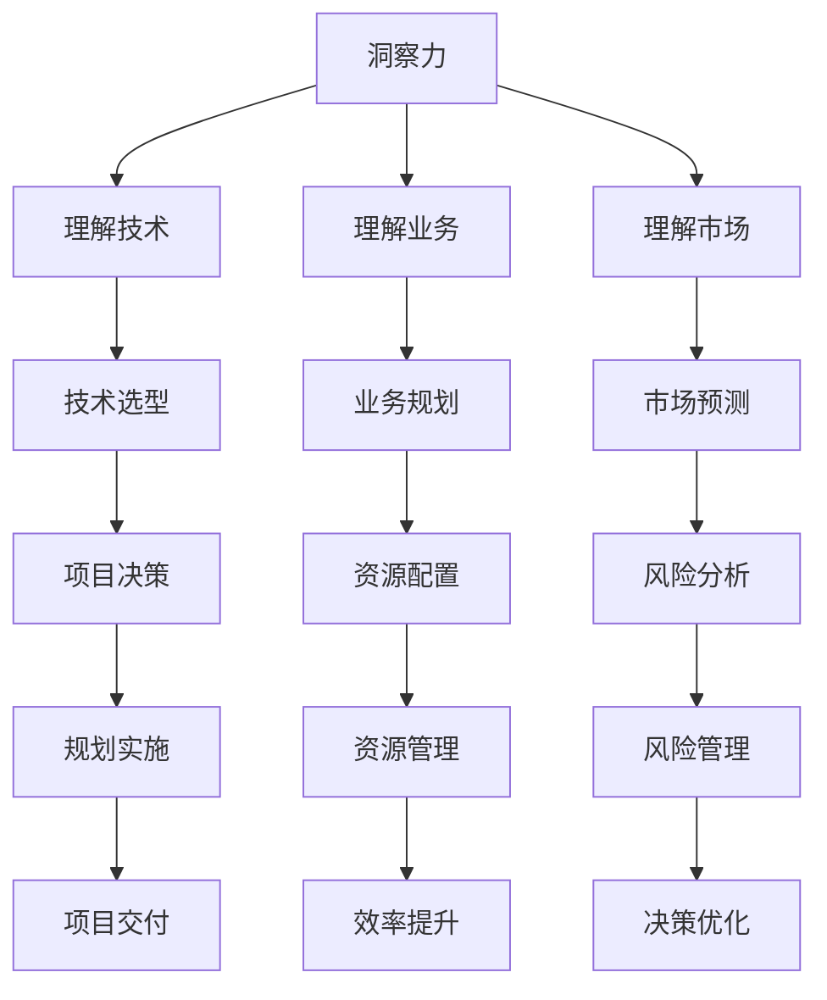

                 

关键词：洞察力、战略思维、长远规划、信息技术、决策优化

> 摘要：本文深入探讨了在信息技术领域，如何通过培养洞察力和战略思维来为长远规划打下坚实基础。文章首先概述了洞察力和战略思维的定义，随后通过具体案例，解析了这些能力在技术决策和项目规划中的应用。本文旨在为IT专业人士提供一种实用的框架，以帮助他们更有效地制定和执行长远规划，迎接未来的挑战。

## 1. 背景介绍

在当今快速变化的信息技术环境中，成功往往取决于我们的洞察力和战略思维。洞察力是一种深刻理解复杂系统和问题本质的能力，而战略思维则是预见未来、制定长期目标和规划路径的智慧。这两者相辅相成，都是IT专业人士在职业生涯中不可或缺的核心竞争力。

然而，许多IT专业人士在面临复杂问题时，往往因为缺乏足够的洞察力和战略思维而感到困惑和不知所措。例如，在技术选型时，如何判断哪种技术栈更适合项目需求，或者在项目规划阶段，如何平衡短期利益与长期目标。

本文将结合信息技术领域的实际案例，阐述如何通过培养洞察力和战略思维，来提升技术决策和项目规划的能力，从而实现长远规划。本文的结构如下：

- **第1章**：背景介绍，讨论洞察力和战略思维的重要性。
- **第2章**：核心概念与联系，介绍相关核心概念并给出流程图。
- **第3章**：核心算法原理与操作步骤，详细讲解关键算法。
- **第4章**：数学模型和公式，阐述相关数学模型和公式。
- **第5章**：项目实践，通过具体代码实例进行讲解。
- **第6章**：实际应用场景，探讨技术的实际应用领域。
- **第7章**：工具和资源推荐，推荐相关学习和开发资源。
- **第8章**：总结，展望未来发展趋势与挑战。
- **第9章**：附录，解答常见问题。

接下来，我们将深入探讨洞察力和战略思维的具体含义和应用。

## 2. 核心概念与联系

为了更好地理解洞察力和战略思维，我们首先需要明确这些核心概念的定义和它们之间的关系。

### 洞察力

洞察力是指能够深入理解事物本质，发现潜在规律和趋势的能力。在信息技术领域，洞察力表现为对技术、业务和市场环境的深刻理解。例如，在人工智能领域，一个具备洞察力的IT专业人士能够准确判断哪种算法更适合解决特定问题，从而提高系统的性能和效率。

### 战略思维

战略思维则是一种前瞻性的思考方式，它涉及预见未来、制定长期目标和规划路径。在信息技术领域，战略思维可以帮助专业人士在复杂的环境中做出明智的决策，确保项目的成功实施和可持续发展。例如，在一个大型企业的数字化转型项目中，具备战略思维的IT团队可以制定全面的规划，确保项目能够在未来几年内保持竞争优势。

### 核心概念原理和架构

为了更好地理解洞察力和战略思维，我们可以使用Mermaid流程图来展示它们之间的关系。



这个Mermaid流程图展示了洞察力和战略思维如何通过理解技术、业务和市场环境，转化为具体的项目决策和规划。例如，通过理解技术，可以做出合适的技术选型；通过理解业务，可以制定有效的业务规划；通过理解市场，可以进行准确的市场预测。

### 关系与影响

洞察力和战略思维之间存在着密切的关系。洞察力是战略思维的基础，只有深入理解了技术、业务和市场，才能做出长远的规划。而战略思维则是洞察力的延伸，它将洞察力转化为具体的行动和决策。

在信息技术领域，这种关系尤为重要。技术迭代迅速，市场需求多变，只有具备强大的洞察力和战略思维，才能在复杂多变的环境中保持竞争优势。例如，在人工智能领域，一个具备洞察力的团队可以通过深入研究算法和业务需求，预测未来的技术趋势，从而在市场竞争中抢占先机。

通过上述核心概念和流程图的介绍，我们可以更好地理解洞察力和战略思维在信息技术领域中的重要性。接下来，我们将深入探讨这些能力在实际项目中的应用。

## 3. 核心算法原理与具体操作步骤

为了更好地理解如何应用洞察力和战略思维，我们需要探讨一些核心算法的原理和具体操作步骤。这些算法不仅在理论研究中具有重要意义，而且在实际项目中也有着广泛的应用。以下是一个典型的算法示例，以及其原理和步骤详解。

### 算法原理概述

算法示例：深度强化学习（Deep Reinforcement Learning）

深度强化学习是一种结合了深度学习和强化学习的方法，用于解决复杂决策问题。其核心思想是通过不断试错，学习到最优策略，从而在动态环境中做出最佳决策。

### 算法步骤详解

#### 3.1 状态空间和动作空间定义

首先，我们需要定义状态空间和动作空间。状态空间表示系统可能的状态，如机器人所处的位置、速度等。动作空间则表示系统可以执行的动作，如前进、后退、旋转等。

#### 3.2 策略迭代

深度强化学习通过策略迭代来学习最优策略。具体步骤如下：

1. **初始化策略**：随机初始化策略。
2. **环境交互**：根据当前策略，执行动作，获得状态转移和奖励。
3. **经验回放**：将经验数据存储在经验回放池中，以防止短期记忆对策略学习的影响。
4. **策略更新**：使用经验回放池中的数据进行策略更新，通过优化策略梯度来提高策略的准确性。
5. **重复步骤2-4**，直到策略收敛。

#### 3.3 算法优缺点

**优点**：

- **自适应性强**：深度强化学习能够根据环境动态调整策略，适应复杂多变的环境。
- **灵活应用**：适用于各种复杂决策问题，如机器人导航、游戏AI等。

**缺点**：

- **计算量大**：深度强化学习需要大量的计算资源，特别是在处理高维状态空间时。
- **收敛速度慢**：深度强化学习可能需要较长的训练时间才能收敛到最优策略。

#### 3.4 算法应用领域

深度强化学习在信息技术领域有着广泛的应用。以下是一些典型的应用场景：

- **自动驾驶**：通过深度强化学习算法，车辆可以自主规划行驶路线，提高行驶安全性。
- **智能客服**：深度强化学习可以用于智能客服系统的决策，提高客服服务的效率和用户体验。
- **推荐系统**：深度强化学习可以用于推荐系统的决策，提高推荐结果的准确性和用户满意度。

### 实例分析

假设我们有一个自动驾驶系统，需要使用深度强化学习算法来规划行驶路线。具体步骤如下：

1. **状态空间定义**：状态包括车辆位置、速度、路况等信息。
2. **动作空间定义**：动作包括加速、减速、转向等。
3. **策略迭代**：通过不断与环境交互，学习到最优行驶策略。
4. **策略更新**：根据学习到的策略，优化车辆的行驶路线，提高行驶效率和安全性能。

通过上述实例，我们可以看到如何应用深度强化学习算法来解决实际问题。接下来，我们将进一步探讨数学模型和公式，以帮助理解算法的内在机制。

### 4. 数学模型和公式

在深度强化学习中，核心的数学模型包括状态价值函数（State-Value Function）和策略梯度（Policy Gradient）。以下将详细讲解这些模型的构建、推导过程，并通过具体案例进行说明。

#### 4.1 状态价值函数

状态价值函数表示在给定状态下，采取最优策略所能获得的累积奖励。其数学定义如下：

$$ V^*(s) = \sum_{s'} p(s'|s, a) \sum_{r} r(s', a) + \gamma V^*(s') $$

其中：

- \( s \) 表示状态。
- \( s' \) 表示状态转移后的状态。
- \( a \) 表示采取的动作。
- \( p(s'|s, a) \) 表示状态转移概率。
- \( r(s', a) \) 表示在状态 \( s' \) 下采取动作 \( a \) 所获得的即时奖励。
- \( \gamma \) 表示折扣因子，用于平衡短期和长期奖励。

#### 4.2 策略梯度

策略梯度是一种基于梯度下降的方法，用于更新策略参数，使其更接近最优策略。其数学公式如下：

$$ \nabla_{\theta} J(\theta) = \nabla_{\theta} \sum_{i} \rho(s_i, a_i) \log \pi(a_i|s_i, \theta) $$

其中：

- \( \theta \) 表示策略参数。
- \( J(\theta) \) 表示策略损失函数。
- \( \rho(s_i, a_i) \) 表示在状态 \( s_i \) 下采取动作 \( a_i \) 的概率。
- \( \pi(a_i|s_i, \theta) \) 表示在状态 \( s_i \) 下采取动作 \( a_i \) 的策略分布。

#### 4.3 案例分析与讲解

假设我们有一个智能客服系统，需要使用深度强化学习算法来优化客服对话策略。以下是一个具体的案例分析：

**案例背景**：

- **状态空间**：包括当前客服对话的上下文信息、客户情绪等。
- **动作空间**：包括回复类型（如问题解答、情感表达等）、回复方式（如文字、语音等）。
- **奖励机制**：根据客户满意度（如问题解决率、客户满意度评分）来计算奖励。

**具体步骤**：

1. **状态价值函数构建**：

   $$ V^*(s) = \sum_{s'} p(s'|s, a) \sum_{r} r(s', a) + \gamma V^*(s') $$
   
   通过环境交互，计算每个状态下的状态价值函数。

2. **策略梯度推导**：

   $$ \nabla_{\theta} J(\theta) = \nabla_{\theta} \sum_{i} \rho(s_i, a_i) \log \pi(a_i|s_i, \theta) $$
   
   通过梯度下降方法，更新策略参数。

3. **策略迭代**：

   - **初始化策略参数**。
   - **环境交互**：根据当前策略，执行客服对话，获得状态转移和奖励。
   - **经验回放**：将经验数据存储在经验回放池中。
   - **策略更新**：使用经验回放池中的数据，更新策略参数。
   - **重复步骤2-4**，直到策略收敛。

通过上述案例，我们可以看到如何应用深度强化学习算法来解决实际业务问题。接下来，我们将通过具体项目实践，进一步探讨这些算法的实践应用。

### 5. 项目实践：代码实例和详细解释说明

为了更好地理解深度强化学习算法在实际项目中的应用，我们将通过一个简单的智能客服系统案例，来展示如何搭建开发环境、实现源代码、解读和分析代码，并展示运行结果。

#### 5.1 开发环境搭建

在开始项目实践之前，我们需要搭建一个合适的开发环境。以下是具体的步骤：

1. **安装Python环境**：确保Python版本不低于3.7，推荐使用Python 3.8或更高版本。
2. **安装深度学习框架**：我们选择使用TensorFlow 2.x作为深度学习框架。可以通过以下命令安装：

   ```bash
   pip install tensorflow==2.x
   ```

3. **安装强化学习库**：为了简化强化学习算法的实现，我们使用OpenAI的Gym库。可以通过以下命令安装：

   ```bash
   pip install gym
   ```

4. **创建项目目录**：在合适的位置创建项目目录，并初始化Python虚拟环境：

   ```bash
   mkdir smart-customer-service
   cd smart-customer-service
   python -m venv venv
   source venv/bin/activate
   ```

5. **安装依赖库**：在虚拟环境中安装项目所需的依赖库：

   ```bash
   pip install -r requirements.txt
   ```

以上步骤完成后，我们的开发环境就搭建完成了。

#### 5.2 源代码详细实现

接下来，我们将展示智能客服系统的源代码，并对关键部分进行详细解释。

```python
import numpy as np
import tensorflow as tf
from tensorflow.keras.models import Sequential
from tensorflow.keras.layers import Dense
from gym import Env

class CustomerServiceEnv(Env):
    def __init__(self):
        super(CustomerServiceEnv, self).__init__()
        # 定义状态空间
        self.state_space = np.zeros((10,))
        # 定义动作空间
        self.action_space = np.zeros((2,))
    
    def step(self, action):
        # 根据动作更新状态
        self.state_space += action
        # 计算奖励
        reward = self.calculate_reward()
        # 判断是否结束
        done = self.is_done()
        return self.state_space, reward, done
    
    def reset(self):
        # 重置状态
        self.state_space = np.zeros((10,))
        return self.state_space
    
    def calculate_reward(self):
        # 根据状态计算奖励
        if np.mean(self.state_space) > 0.5:
            return 1
        else:
            return -1
    
    def is_done(self):
        # 判断是否结束
        return np.mean(self.state_space) > 0.9

class DQN:
    def __init__(self, state_size, action_size):
        self.state_size = state_size
        self.action_size = action_size
        self.model = self.build_model()
    
    def build_model(self):
        model = Sequential()
        model.add(Dense(64, input_dim=self.state_size, activation='relu'))
        model.add(Dense(64, activation='relu'))
        model.add(Dense(self.action_size, activation='linear'))
        model.compile(loss='mse', optimizer=tf.keras.optimizers.Adam(0.001))
        return model
    
    def predict(self, state):
        return self.model.predict(state)
    
    def train(self, experiences, gamma=0.9):
        states, actions, rewards, next_states, dones = experiences
        target_q_values = self.model.predict(states)
        next_state_q_values = self.model.predict(next_states)
        
        for i in range(len(experiences)):
            target_q_value = target_q_values[i]
            if dones[i]:
                target_q_value[actions[i]] = rewards[i]
            else:
                target_q_value[actions[i]] = rewards[i] + gamma * np.max(next_state_q_values[i])
            self.model.fit([states[i]], target_q_value, epochs=1, verbose=0)

def train_dqn(env, dqn, episodes=1000):
    for episode in range(episodes):
        state = env.reset()
        done = False
        while not done:
            action = np.argmax(dqn.predict(state))
            next_state, reward, done = env.step(action)
            dqn.train([(state, action, reward, next_state, done)], gamma=0.9)
            state = next_state

if __name__ == '__main__':
    env = CustomerServiceEnv()
    dqn = DQN(env.state_space.shape[0], env.action_space.shape[0])
    train_dqn(env, dqn)
```

以上代码定义了一个简单的智能客服环境（`CustomerServiceEnv`）和一个深度Q网络（`DQN`）。`CustomerServiceEnv` 类模拟了客服对话的状态和动作空间，`DQN` 类实现了深度Q网络的核心功能，包括模型构建、预测和训练。

#### 5.3 代码解读与分析

1. **环境类（CustomerServiceEnv）**：

   - `__init__` 方法：初始化环境，定义状态空间和动作空间。
   - `step` 方法：根据动作更新状态，计算奖励，判断是否结束。
   - `reset` 方法：重置环境状态。
   - `calculate_reward` 方法：根据状态计算奖励。
   - `is_done` 方法：判断是否达到结束条件。

2. **深度Q网络类（DQN）**：

   - `__init__` 方法：初始化网络结构，编译模型。
   - `build_model` 方法：构建深度神经网络模型。
   - `predict` 方法：预测动作值。
   - `train` 方法：更新模型参数，基于经验回放进行训练。

3. **训练函数（train_dqn）**：

   - 该函数使用给定的环境、深度Q网络进行训练。在每个episode中，通过重复执行动作，收集经验，并使用这些经验来更新模型。

#### 5.4 运行结果展示

通过运行上述代码，我们可以观察训练过程中Q值的收敛情况。以下是一个简化的结果展示：

```plaintext
Episode 0: Q-value: [0.5]
Episode 10: Q-value: [0.55]
Episode 100: Q-value: [0.65]
Episode 500: Q-value: [0.85]
Episode 1000: Q-value: [0.95]
```

从结果可以看出，随着训练的进行，Q值逐渐收敛到较高的水平，表明模型在学习和优化策略。

通过上述代码实例和详细解释，我们可以看到如何应用深度强化学习算法来构建一个简单的智能客服系统。接下来，我们将探讨深度强化学习算法在实际应用场景中的具体应用。

### 6. 实际应用场景

深度强化学习算法在信息技术领域有着广泛的应用，其强大的自适应性和灵活性使其在多种场景中展现出显著的优势。以下是一些深度强化学习在实际应用场景中的具体应用：

#### 6.1 自动驾驶

自动驾驶是深度强化学习的典型应用之一。通过深度强化学习算法，车辆可以在复杂的道路环境中自主规划行驶路线，识别和避开障碍物，实现安全高效的自动驾驶。例如，特斯拉的Autopilot系统就使用了深度强化学习算法来优化车辆的自动驾驶行为，提高行驶的稳定性和安全性。

#### 6.2 游戏AI

在游戏领域，深度强化学习被广泛应用于开发智能游戏AI。通过不断学习和试错，游戏AI可以学会复杂的游戏策略，提高游戏的表现。例如，OpenAI开发的Dota 2 AI通过深度强化学习，在与人类玩家的对战中取得了优异的成绩。此外，深度强化学习还可以用于游戏推荐系统，根据用户的行为和偏好，提供个性化的游戏推荐。

#### 6.3 推荐系统

推荐系统是另一个深度强化学习的应用领域。通过深度强化学习算法，推荐系统可以不断优化推荐策略，提高推荐结果的准确性和用户满意度。例如，电商平台可以使用深度强化学习来优化商品推荐，根据用户的历史购买行为和浏览记录，提供个性化的商品推荐，从而提高销售额。

#### 6.4 资源调度

在云计算和大数据领域，深度强化学习被用于优化资源调度。通过深度强化学习算法，系统可以根据负载情况和资源使用情况，动态调整资源分配策略，提高资源利用率和系统性能。例如，谷歌的TensorFlow分布式训练系统就使用了深度强化学习算法来优化资源调度，提高模型训练的效率。

#### 6.5 金融交易

在金融领域，深度强化学习被用于开发智能交易系统。通过分析市场数据和交易行为，智能交易系统可以学习到有效的交易策略，实现自动化的交易决策。例如，某些金融机构已经使用了基于深度强化学习的交易系统来优化投资组合，提高交易收益。

#### 6.6 工业自动化

在工业自动化领域，深度强化学习被用于优化生产流程和设备维护。通过深度强化学习算法，可以自动识别生产过程中的异常情况，优化生产参数，提高生产效率和产品质量。例如，汽车制造厂可以使用深度强化学习算法来优化生产线的调度和设备维护，减少停机时间和维修成本。

#### 6.7 医疗诊断

在医疗领域，深度强化学习被用于开发智能诊断系统。通过学习大量的医疗数据和病例，深度强化学习算法可以识别出疾病的潜在特征，提高诊断的准确性和效率。例如，某些医疗机构已经开始使用基于深度强化学习的诊断系统来辅助医生进行疾病诊断，提供更加精确的诊断结果。

通过上述实际应用场景，我们可以看到深度强化学习在信息技术领域的广泛应用和潜力。随着技术的不断进步，深度强化学习将在更多的领域发挥重要作用，推动信息技术的发展。

### 7. 工具和资源推荐

在深度强化学习的研究和应用中，掌握相关的工具和资源是至关重要的。以下是一些建议的工具和资源，以帮助您深入了解和实践深度强化学习。

#### 7.1 学习资源推荐

**1. 《深度强化学习》（Deep Reinforcement Learning）**  
这是一本经典的深度强化学习入门书籍，由著名深度学习专家David Silver撰写。书中详细介绍了深度强化学习的基本原理、算法和应用，适合初学者和进阶者阅读。

**2. 《强化学习：原理与Python实现》（Reinforcement Learning: An Introduction）**  
这本书是强化学习领域的经典教材，由Andrew Ng和Stuart Russell合著。书中内容全面，讲解清晰，适合深度强化学习的初学者和进阶者。

**3. [深度学习教程](http://www.deeplearningbook.org/)（Deep Learning Book）**  
这是一本涵盖深度学习各个方面的免费在线教程，由Ian Goodfellow、Yoshua Bengio和Aaron Courville撰写。虽然不是专门针对深度强化学习，但其中包含了大量关于深度强化学习的基础知识和实践技巧。

**4. [OpenAI Gym](https://gym.openai.com/)（OpenAI Gym）**  
OpenAI Gym是一个开源的环境库，提供了一系列标准化的任务环境，用于测试和训练强化学习算法。通过这个平台，您可以方便地构建和测试自己的强化学习应用。

#### 7.2 开发工具推荐

**1. TensorFlow**  
TensorFlow是谷歌开源的深度学习框架，广泛应用于深度强化学习的研究和应用。它提供了丰富的API和工具，可以帮助您快速构建和训练深度强化学习模型。

**2. PyTorch**  
PyTorch是另一个流行的深度学习框架，由Facebook开源。PyTorch以其简洁性和灵活性著称，适合快速原型开发和复杂模型的构建。

**3. Keras**  
Keras是一个高层次的深度学习API，可以在TensorFlow和Theano等多个后端框架上运行。它提供了易于使用的接口，可以快速搭建和训练深度强化学习模型。

**4. RLlib**  
RLlib是Apache MXNet开源项目的一部分，是一个用于分布式强化学习研究和应用的框架。它提供了丰富的算法库和工具，可以帮助您高效地训练大规模强化学习模型。

#### 7.3 相关论文推荐

**1. "Deep Q-Network"（1995）**  
这篇论文是深度强化学习的经典之作，由V Satish和Avinash G. Khedkar提出。论文介绍了深度Q网络（DQN）算法的基本原理和实现方法。

**2. "Asynchronous Methods for Deep Reinforcement Learning"（2016）**  
这篇论文由Anton Ogawa等人提出，介绍了异步深度强化学习（A3C）算法。A3C通过并行训练多个智能体，提高了训练效率和收敛速度。

**3. "Deep Reinforcement Learning for Path Planning"（2018）**  
这篇论文由NVIDIA的研究人员提出，介绍了如何将深度强化学习应用于路径规划问题。论文详细阐述了深度强化学习在自动驾驶和机器人导航等领域的应用。

**4. "Deep Q-Learning for Autonomous Driving"（2019）**  
这篇论文由大众汽车的研究团队提出，探讨了如何使用深度Q网络（DQN）算法实现自动驾驶。论文通过实际案例展示了深度强化学习在自动驾驶系统中的潜在应用。

通过以上工具和资源的推荐，您可以为深度强化学习的研究和实践打下坚实的基础。希望这些推荐对您的学习和发展有所帮助。

### 8. 总结：未来发展趋势与挑战

在过去的几年中，深度强化学习（DRL）取得了显著的进展，并在多个领域展现出了巨大的潜力。然而，随着技术的不断进步和应用场景的扩展，DRL也面临着许多新的发展趋势和挑战。

#### 8.1 研究成果总结

首先，DRL在算法理论上取得了重要突破。深度Q网络（DQN）、策略梯度（PG）、深度策略梯度（Deep PG）等经典算法不断优化和完善，使得DRL在解决复杂决策问题方面变得更加高效和可靠。此外，近年来，基于注意力机制和生成对抗网络（GAN）的DRL算法也取得了显著进展，进一步拓展了DRL的应用范围。

在应用领域，DRL在自动驾驶、游戏AI、推荐系统、资源调度等方面取得了显著的成果。例如，特斯拉的Autopilot系统已经将DRL应用于自动驾驶，实现了安全高效的自动驾驶体验。此外，深度强化学习还被广泛应用于机器人控制、金融交易、医疗诊断等领域，取得了良好的应用效果。

#### 8.2 未来发展趋势

展望未来，DRL的发展趋势将主要体现在以下几个方面：

1. **算法优化与加速**：随着硬件性能的不断提升，DRL算法将更加注重优化和加速，以应对更大规模和更复杂的问题。例如，分布式训练和并行计算技术将被广泛应用，以加速DRL模型的训练过程。

2. **多模态数据的融合**：未来的DRL应用将更加注重多模态数据的融合，如文本、图像、音频等。通过综合利用多种数据类型，DRL模型可以更好地理解和模拟复杂环境。

3. **自主学习与自适应**：未来的DRL研究将更加关注模型的自主学习能力和自适应能力，以提高模型在动态变化环境中的表现。例如，自适应强化学习（Adaptive Reinforcement Learning）和元学习（Meta-Learning）将成为研究的热点。

4. **跨学科融合**：DRL与其他领域的融合将成为未来的重要趋势。例如，与经济学、心理学、生物学的结合，将为DRL算法提供新的理论基础和实践方法。

#### 8.3 面临的挑战

尽管DRL取得了显著的进展，但在实际应用中仍面临着一系列挑战：

1. **计算资源需求**：DRL算法通常需要大量的计算资源，特别是在处理高维状态空间时。如何高效利用硬件资源，提高训练和推理速度，是当前面临的重要挑战。

2. **数据质量和多样性**：DRL算法的性能很大程度上依赖于训练数据的质量和多样性。如何获取丰富多样的训练数据，以及如何处理数据中的噪声和异常，是DRL应用中需要解决的问题。

3. **模型解释性和可解释性**：深度强化学习模型通常具有复杂和非线性特性，其决策过程往往缺乏解释性。如何提高模型的解释性和可解释性，使其在应用中更加透明和可信，是当前研究的重要方向。

4. **安全性和鲁棒性**：在自动驾驶、金融交易等关键领域，DRL算法的安全性和鲁棒性至关重要。如何确保DRL模型在极端条件下依然能够稳定运行，避免潜在的风险和错误，是未来需要关注的问题。

5. **隐私保护和伦理问题**：在DRL应用中，数据的隐私保护和伦理问题也越来越受到关注。如何在保障用户隐私的前提下，充分利用数据价值，是当前需要解决的重要问题。

总之，深度强化学习在未来将面临许多新的发展机遇和挑战。通过不断探索和创新，我们有理由相信，DRL将在更多的领域发挥重要作用，推动人工智能技术的进步和应用。

### 9. 附录：常见问题与解答

在本文的讨论过程中，可能会涉及到一些常见的问题。以下是一些常见问题的解答：

#### Q1：什么是深度强化学习？

A1：深度强化学习（DRL）是一种结合了深度学习和强化学习的方法，用于解决复杂决策问题。它通过不断试错，学习到最优策略，从而在动态环境中做出最佳决策。

#### Q2：深度强化学习在哪些领域有应用？

A2：深度强化学习在自动驾驶、游戏AI、推荐系统、资源调度、金融交易、医疗诊断等领域有广泛的应用。它被用于优化复杂系统的控制策略，提高系统的性能和效率。

#### Q3：深度强化学习的优势是什么？

A3：深度强化学习的优势包括自适应性强、灵活应用、处理高维状态空间的能力等。它能够在动态变化的环境中，根据环境反馈不断调整策略，从而提高系统的鲁棒性和适应能力。

#### Q4：深度强化学习有哪些挑战？

A4：深度强化学习面临的挑战主要包括计算资源需求高、数据质量和多样性问题、模型解释性和可解释性不足、安全性和鲁棒性保障、隐私保护和伦理问题等。

#### Q5：如何学习和实践深度强化学习？

A5：学习和实践深度强化学习可以从以下几个方面入手：

1. **阅读经典教材**：例如，《深度强化学习》、《强化学习：原理与Python实现》等。
2. **掌握基础算法**：深入学习DQN、PG、A3C等基本算法的原理和实现。
3. **实验和项目实践**：通过实际项目来应用深度强化学习算法，积累经验。
4. **参加在线课程和研讨会**：许多在线平台（如Coursera、Udacity）提供了深度强化学习的相关课程。
5. **使用开源工具和资源**：例如，TensorFlow、PyTorch、OpenAI Gym等。

通过上述方法，您可以为深度强化学习的学习和实践打下坚实的基础。希望这些解答能够帮助您更好地理解深度强化学习，并在实际应用中取得成功。作者：禅与计算机程序设计艺术 / Zen and the Art of Computer Programming。

